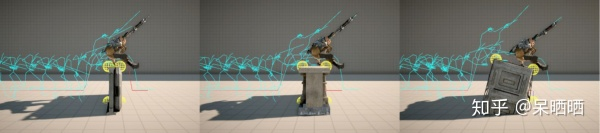
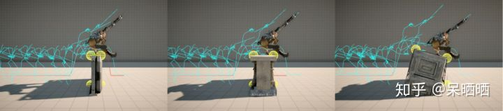
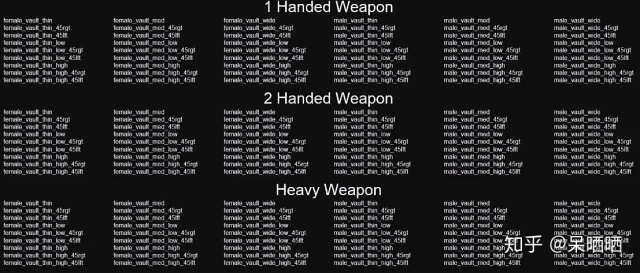
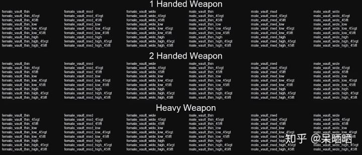
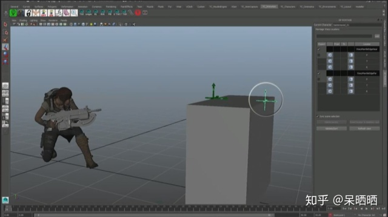
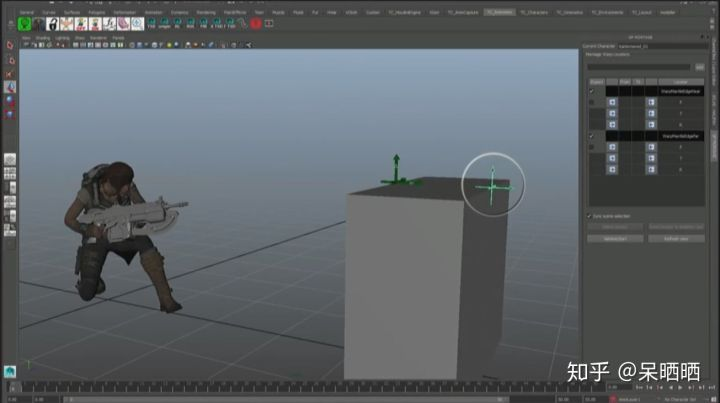
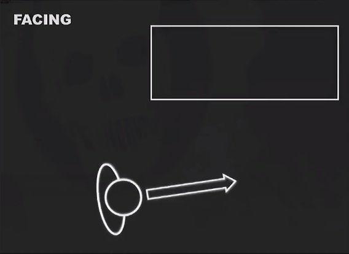

Gears of War 4中的高性能动画技术

作者：呆晒晒

1. MOTION PATH WARPING 运动轨迹翘曲
2. MOTION TRANSITIONS 运动过渡
3. PHASE MATCHING 相位匹配

## 一、MOTION PATH WARPING

**1.技术目的：**

​       在Gears of War 4中，角色需要翻越各种复杂的环境。为了让这种交互看起来更加真实，需要根据环境物理参数来调整动画的播放。如在Fig.1中，角色就需要同时处理障碍物的高度、宽度甚至斜度信息。

Fig.1 针对不同高度、宽度与斜度的障碍物所做的动画翘曲

**2. 相关工作：**

​       研究相关技术基于*Gleicher(2001)*和*Lockwood等人(2011)*关于Motion Warping的工作成果。此前解决这一问题的主要方法是**特化**，即动画师不断产出所需的动画资源。这种方案在离线状态下很容易完成。但在游戏中，需要程序员根据具体内容定制化构建代码。比如滑行和跳跃都可以通过调整Trajectory的不同形式来实现。这种思路被称为Ad Hoc，即拉丁语中的“for this”,指代专门为某一问题或者任务而设计的解决方法，具有非泛化的特性。

Fig.2 使用Blendspace来特化解决环境交互问题时可能产生的资源列表

​       为了让解决方案更加系统化，开发者们引入了**Warp Point**的概念。

**3. 技术细节：**

​       Warp Point分为两部分：制作时(Authoring)与运行时(Runtime)Warp Point。

**(1)制作时Warp Point：**

​       动画师在Maya中创建**与动画相关**的Warp Point，每个Warp Point具有三个参量：Face、Translation和Rotation。三个参量分别对应了动画中三个过程：从角色当前朝向转向Warp Point、从角色当前位置平移到Warp Point、从角色当前朝向转向Warp Point朝向。

Fig.3 动画师在Maya中创建Warp Point

