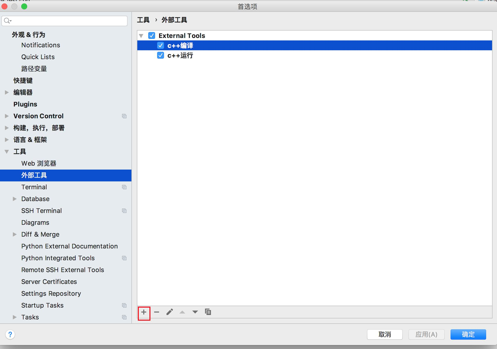
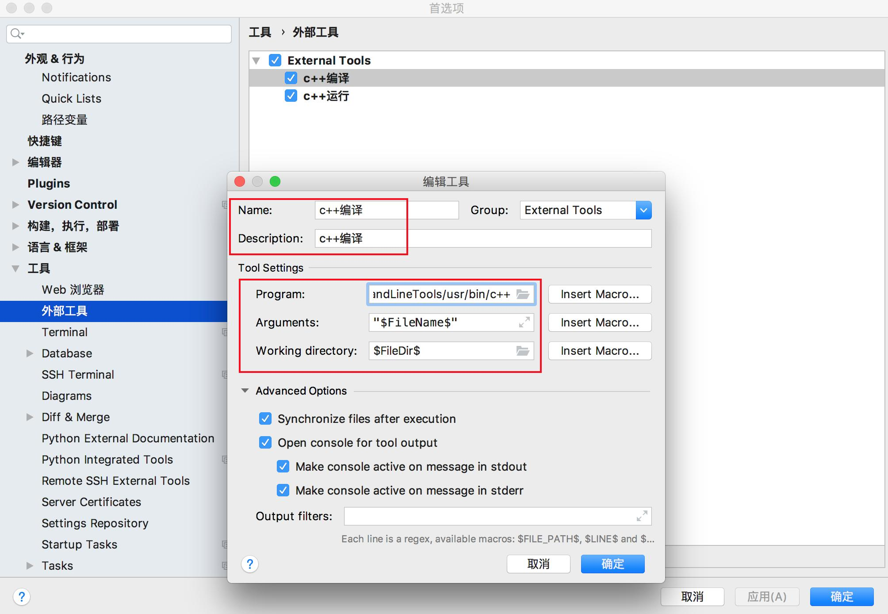
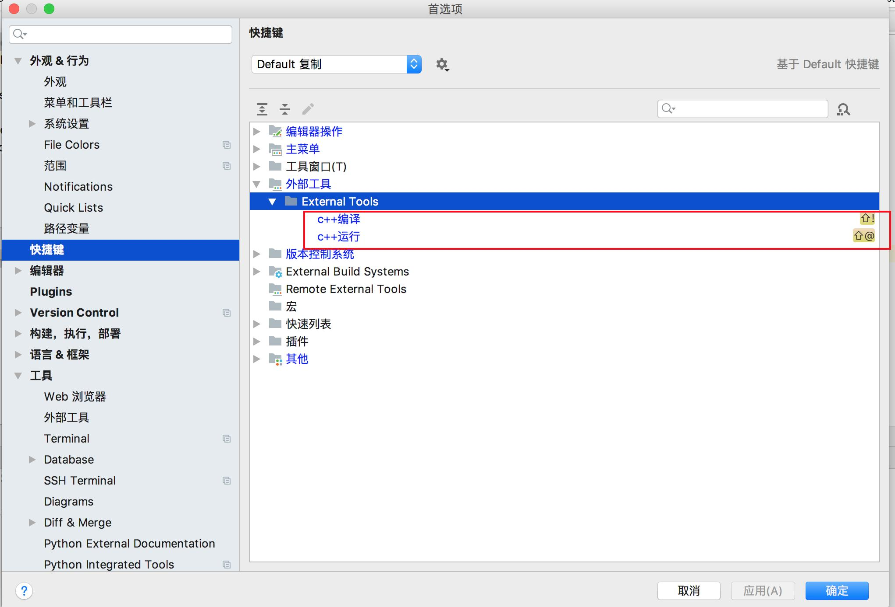
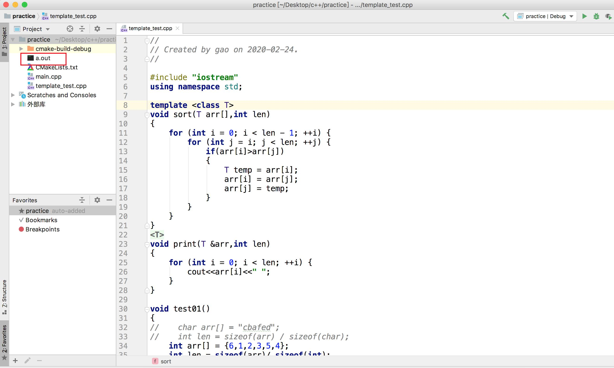
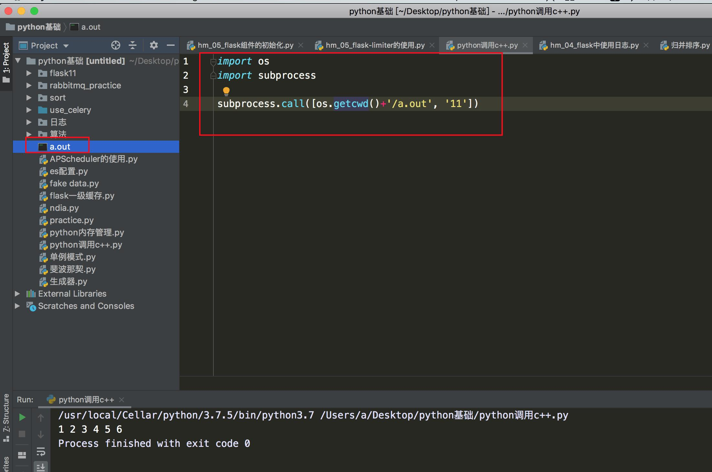

## mac版CLion编译和运行c++单个文件配置

### 一、添加

### 二、外部工具配置

#### 1.编译配置

- Name 和 Description自己随便取
- 参数Program：/Library/Developer/CommandLineTools/usr/bin/c++
- 参数Arguments："$FileName$"
- 参数Working directory:$FileDir$

#### 2.执行配置

- 参数program: $FileDir$/a.out
- 参数Working directory:$FileDir$

### 三、快捷键配置

### 四、使用

- 使用快捷键编译会产生a.out文件
- 使用快捷键运行，可以执行a.out文件

### 五、使用Python执行c++编译的文件

a.out文件 放在当前目录，调用

