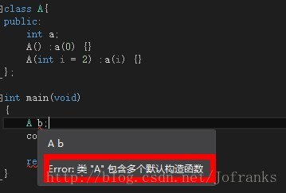
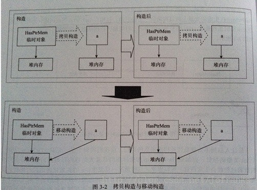

# C++11六大函数（构造函数，移动构造函数，移动赋值操作符，复制构造函数，赋值操作符，析构函数）

在C++中，有三大函数复制控制（复制构造函数，赋值操作符，析构函数），而在C++11中，加入了移动构造函数，移动赋值操作符。我就斗胆将他们命名为六大函数好了。

**一、构造函数**

c++primer中说过：构造函数是特殊的成员函数，只要创建类类型的新对象，都要执行构造函数。构造函数的工作就是保证每个对象的数据成员具有合适的初始值。

构造函数与其他函数不同：构造函数和类同名，没有返回类型。

构造函数与其他函数相同：构造函数也有形参表(可为void)和函数体。  （参数表为void的构造函数为默认构造函数）

构造函数构造类对象的顺序是：**1.内存分配，构造函数调用的时候 隐士\显示的初始化各数据。**

**2.执行构造函数的运行。**

**1、构造函数初始化表**


```
A() :a(0){}
```

我们使用构造函数初始化表示初始化数据成员，然而在没有使用初始化表的构造函数则在构造函数体中对数据成员赋值。

在我们编写类的时候，有些成员必须在构造函数初始化表中进行初始化。（没有默认构造函数的类类型成员，const或者引用类型成员）

在编写代码的时候，要注意的是：可以初始化const对象或者引用类型的对象，但不能对他们进行赋值。 也就是需要在我们执行构造函数函数体之前完成初始化工作，所以唯一的机会就是初始化表。从这一点可以看出初始化表的执行先于函数体。

在初始化表中，成员被初始化的次序不是你编写初始化表的次序，而是定义成员的次序。


初始化列表在初始化类类型的成员时，要指定实参并传递给成员类型的一个构造函数。

在c++primer中有一个书店的例子：


```
Sales-item(): isbn(10, '9'), units_sold(0), revenue(0.0) {}
```


我们的初始化表在什么时候必须使用呢 ？

当有一个类成员，他本身就是结构或者类的时候，并且只有一个带参数的构造函数，(无默认构造函数) 此时我们要对成员进行初始化，就需要调用成员的构造函数，此时需要我们的初始化表，如果不使用初始化表，那么内存分配就会出问题。


**初始化列表的优点：**主要是对于自定义类型，初始化列表是作用在函数体之前，他调用构造函数对对象进行初始化。

然而在函数体内，需要先调用构造函数，然后进行赋值，这样效率就不如初始化表。


**2、默认实参构造函数**


```
A(int i = 1) :a(i), ca(i), ra(i){}
```


**3、默认构造函数**

**合成的默认构造函数：**当类中没有定义构造函数(注意是构造函数)的时候，编译器自动生成的函数。

但是我们不能过分依赖编译器，如果我们的类中有复合类型或者自定义类型成员，我们需要自己定义构造函数。

**自定义的默认构造函数：**


```
A(): a(0) {}A(int i = 1): a(i) {}
```

可能疑问的是第二个构造函数也是默认构造函数么？是的，因为参数中带有默认值。

我们来看一张图，就会一目了然了：




**4、类型转换**

在C++primer中，书店问题中的一个例子是 传递string对象或者iostream对象到参数中，会发生隐式转换，这样就会出现问题。

explicit关键字可以抑制隐式转换。


```
explicit Sales_item(const string &book): isbn(book) {}
```


 如果我们声明了构造函数禁止隐式转换， 可以将其他对象显示转换后传入构造函数。


```
string a = "d";item.same(Sales_item(a));
```


**二、移动构造函数**

在C++11中新加入的特性！

在上一篇blog中我加入了一张图，可以具体看到移动构造函数的运行原理。



此时，我们偷走了临时变量的内存空间，据为己用。节省了开辟空间的时间。


```
	A(A && h) : a(h.a)	{		h.a = nullptr; //还记得nullptr？	}
```


 可以看到，这个构造函数的参数不同，有两个&操作符，  移动构造函数接收的是“右值引用”的参数。

还要来说一下，这里h.a置为空，如果不这样做，h.a在移动构造函数结束时候执行析构函数会将我们偷来的内存析构掉。h.a会变成[悬垂指针](http://blog.csdn.net/jofranks/article/details/8088857)。

移动构造函数何时触发？  那就是临时对象（右值）。用到临时对象的时候就会执行移动语义。

这里要注意的是，异常发生的情况，要尽量保证移动构造函数 不发生异常，可以通过noexcept关键字，这里可以保证移动构造函数中抛出来的异常会直接调用terminate终止程序。

**右值引用：**

在上一篇blog中，我们提到过将亡值，他是c++11新增的跟右值引用相关的表达式。

在c++11中，右值引用就是对一个右值进行引用的类型，右值通常不具有名字，我们就只能通过引用的方式找到它的存在了。

比较一下下面两条语句：


```
T &&a = returna();T b = returnb();
```

此时a是右值引用，他比b少了一次对象析构和对象构造的过程。a直接绑定了returna返回的临时变量。b只是由临时变量值构造而成的。

应该可以看清楚了吧。右值引用就是让返回的右值（临时对象）重获新生，延长生命周期。临时对象析构了，但是右值引用存活。

不过要注意的是，右值引用不能绑定左值：int a; int &&c = a;  这样是不行的。


 这里有一个函数就是 move函数，它能够将左值强制转换成右值引用。


**三、移动赋值操作符**

他的原理跟移动构造函数相同，这里不再多说。

给出实现代码：


```cpp
	A & operator = (A&& h)	{		assert(this != &h); 		a = nullptr;		a = move(h.a);		h.a = nullptr;		return *this;	}
```


复制控制

**四、复制构造函数**

他是一种特殊的构造函数，具有单个形参，形参是对该类类型的引用。当定义一个新对象并用一个同类型的对象对它进行初始化时，将显式使用复制构造函数。当将该类型的对象传递给函数或从函数返回该类型的对象时，将隐式使用复制构造函数。

必须定义复制构造函数的情况：

1.、类有一个或者多个数据成员是指针。

2、有成员表示在构造函数中分配的其他资源。另外的类在创建新对象时必须做一些特定的工作。

下面给出赋值构造函数的编写：


```
A(const A& h) :a(h.a){}
```

如果不想让对象复制呢？ 那就将复制构造函数声明为：private；


**五、赋值操作符**

他跟构造函数一样，赋值操作符可以通过制定不同类型的右操作数而重载。

赋值和复制经常是一起使用的，这个要注意。

下面给出赋值操作符的写法：


```
	A& operator = (const A& h)	{		assert(this != &h); 		this->a = h.a; 		return *this;	}
```


**六、析构函数**

是构造函数的互补，当对象超出作用域或动态分配的对象被删除时，将自动应用析构函数。析构函数可用于释放对象时构造或在对象的生命期中所获取的资源。不管类是否定义了自己的析构函数，编译器都会自动执行类中非static数据成员的析构函数。

**析构函数的运行：**

当对象引用或指针越界的时候不会执行析构函数，只有在删除指向动态分配对象的指针或实际对象超出作用域时才会调用析构函数。

**合成析构函数：**

编译器总是会合成一个析构函数，合成析构函数按对象创建时的逆序撤销每个非static成员。要注意的是，合成的析构函数不会删除指针成员所指向的对象。


最后要注意的是：类如果需要析构函数，那么他肯定也需要复制构造函数和赋值操作符。


blog的最后给出完整的六大函数的代码。


```cpp
#include <iostream>
#include <assert.h>
using namespace std; 
class Temp
{
    
    public:	Temp(const char* str = nullptr);	
    Temp(Temp&& t);	Temp& operator = (Temp&& t);	
    Temp(const Temp& t);	
    Temp& operator = (Temp& t);	
    ~Temp(void);private:	
    char *m_pData;
}; 
Temp::Temp(const char* str)
{	
    if (!str)	
    {		
        m_pData = nullptr;	
    }	
    else 
    {
        this->m_pData = new char[strlen(str) + 1];		
        strcpy(this->m_pData, str);	
    }
} 

Temp::Temp(Temp&& t) :m_pData(move(t.m_pData))
{	
    t.m_pData = nullptr;
} 

Temp& Temp::operator = (Temp&& t)
{	
    assert(this != &t); 	
    this->m_pData = nullptr;	
    this->m_pData = move(t.m_pData);	
    t.m_pData = nullptr; 	
    return *this; 
} 

Temp::Temp(const Temp& t)
{	
    if (!t.m_pData)	
    {		
        this->m_pData = nullptr;	
    }	
    else 
    {		
        this->m_pData = new char[strlen(t.m_pData) + 1];		
        strcpy(this->m_pData, t.m_pData);	
    }
} 

Temp& Temp::operator = (Temp &t)
{	
    if (this != &t)	
    {		
        delete[] this->m_pData;		
        if (!t.m_pData)		
        {			
            this->m_pData = nullptr;		
        }		
        else 
        {			
            this->m_pData = new char[strlen(t.m_pData) + 1];			
            strcpy(this->m_pData, t.m_pData);		
        }	
    } 	
    return *this;
} 

Temp::~Temp(void)
{	
    if (this->m_pData)	
    {		
        delete[] this->m_pData;		
        this->m_pData = nullptr;	
    }
}
```


---2013.12.20