# C++ const关键字的总结

​      之前一直在学习C/C++，关于const的使用，这里出现一点，那里出现一点。知识用时方恨少，这一段时间正好各种笔试题，其中关于const的用法也是层出不穷，所以疲于在书本上各种翻，这里汇总一下，加深自己的印象的同时，也方便以后查阅和学习。菜鸟一个，若有错误，望指正！  

1. # const关键字 

常类型是指使用类型修饰符const说明的类型，常类型的变量或对象的值是不能被更新的。不管出现在任何上下文都是为这个目的而服务的。     

1. # const使用方法 

- **定义const对象** 

  const修饰符可以把对象转变成常数对象，意思就是说利用const进行修饰的变量的值在程序的任意位置将不能再被修改，就如同常数一样使用！任何修改该变量的尝试都会导致编译错误： 

​        
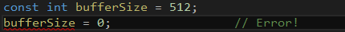

 
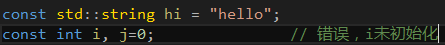 

​    注意：因为常量在定以后就不能被修改，所以定义时必须初始化： 

​        对于类中的const成员变量必须通过初始化列表进行初始化，如下所示： 

> 
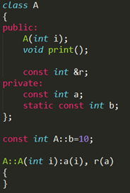 

- **const对象默认为文件的局部变量** 

在全局作用域里定义非const变量时，它在整个程序中都可以访问，我们可以把一个非const变量定义在一个文件中，假设已经做了合适的声明，就可以在另外的文件中使用这个变量： 

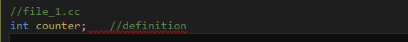
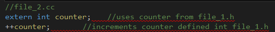 

与其他变量不同，除非特别说明，在全局作用域声明的const变量是定义该对象的文件的局部变量。此变量只存在于那个文件中，不能被其他文件访问。通过指定const变量为extern，就可以在整个程序中访问const对象。 

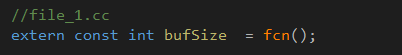
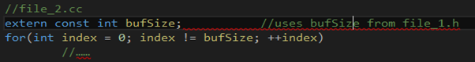 

注意:非const变量默认为extern。要使const变量能够在其他文件中访问，必须在文件中显式地指定它为extern。 

- **const 引用** 

  **const引用是指向const对象的引用**： 

  
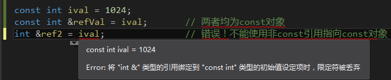 

> 可以读取但不能修改refVal，因此，任何对refVal的赋值都是不合法的。这个限制有其意义：不能直接对ival赋值，因此不能通过使用refVal来修改ival。同理，用ival初始化ref2也是不合法的：ref2是普通的非const引用，因此可以用来修改ref2指向的对象的值。通过ref2对ival赋值会导致修改const对象的值，为防止这样的修改，需要规定将普通的引用绑定到const对象是不合法的。 const 引用可以初始化为不同类型的对象或者初始化为右值。如字面值常量： 

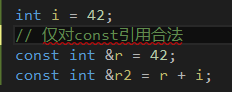 

同样的初始化对于非const引用却是不合法的，而且会导致编译时错误。其原因非常微妙，值得解释一下。观察将引用绑定到不同的类型时所发生的事情，最容易理解上述行为。对于下一段代码： 

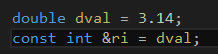 

编译器会将这些代码转换为一下形式： 

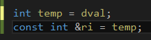

我们发现编译器会创建一个int型的暂时变量存储dval，然后将ri绑定到temp上。 

注意：引用在内部存放的是一个对象的地址，它是该对象的别名。对于不可寻址的值，如文字常量，以及不同类型的对象，编译器为了实现引用，必须生成一个临时对象，引用实际上指向该对象，但用户不能访问它。 

如果ri不是const，那么可以给ri赋一新值。这样做不会修改dval的，而是修改了temp。期望对ri赋值会修改dval的程序员会发现dval没有被修改。仅允许const引用绑定到需要临时使用的值完全避免了这个问题，直接告诉程序员不能修改，因为const引用是只读的哈~（其实就是避免程序员心理预期产生反差。。。）  

注意：非const引用只能绑定到与该引用相同类型的对象。 const引用则可以绑定到不同但相关的类型的对象或绑定到右值。 

- **const对象的动态数组** 

如果我们在自由存储区中创建的数组存储了内置类型的const对象，则必须为这个数组提供初始化： 因为数组元素都是const对象，无法赋值。实现这个要求的唯一方法是对数组做值初始化。 

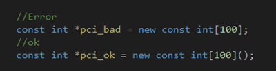 

C++允许定义类类型的const数组，但该类类型必须提供默认构造函数： 

 这里便会调用string类的默认构造函数初始化数组元素。 

- **指针和const限定符的关系（重点！！！！！！！非常容易搞混）** 

  const限定符和指针结合起来常见的情况有以下几种。 

1. 指向常量的指针（指向const对象的指针） 

>   C++为了保证不允许使用指针改变所指的const值这个特性，强制要求这个指针也必须具备const特性： 

 

这里cptr是一个指向double类型const对象的指针，const先顶了cptr指向的对象的类型，而并非cptr本身，所以**cptr本身并不是const**。所以定义的时候并不需要对它进行初始，如果需要的话，允许给cptr重新赋值，让其指向另一个const对象。但不能通过cptr修改其所指对象的值。 

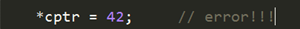 

而我们将一个const对象的地址赋给一个普通的非const指针也会导致编译错误。 

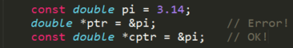 

不能使用void*指针保存const对象的地址，必须使用const void*类型的指针保存const对象的地址。 

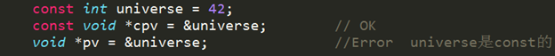 

下面令人头晕的一个问题来了----à 允许把非const对象的地址赋给指向const对象的指针，例如： 

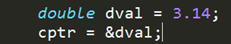 

但是我们不能通过cptr指针来修改dval的值！！！即使它指向的是非const对象。 

然后，我们一定要知道，不能使用指向const对象的指针修改基础对象，然而如果该指针指向了非const对象，可用其他方式修改其所指的对象，所以事实上，可以修改const指针所指向的值的，但是不能通过const对象指针来进行而已！如下所示： 

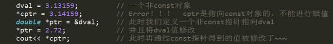 

通过以上，我们知道指向const对象的指针 确切的讲： 自以为指向const的指针！ 

1. 常指针(const指针) 

> C++中还提供了const指针——本身的值不能被修改。
>
> 
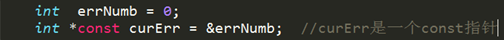 

​        我们可以从右往左把上述定义语句读作"指向int型对象的const指针"。与其他const量一样，const指针的值不能被修改，这意味着不能使curErr指向其他对象。Const指针也必须在定义的时候初始化。 

​        
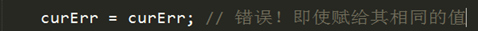     

​        指针本身是const的试试并没有说明是否能用改真真修改其所指向的对象的值。指针对象的值能否修改完全取决于该对象的类型。 

1. 指向常量的常指针（指向const对象的const指针） 

> 如下可以这样定义： 
>
> 
>
> 
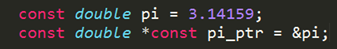 
>
> 这样pi_ptr首先是一个const指针，然后其指向一个const对象~~~ 

- **函数和const限定符的关系（另一难点！！！理解）** 

1. 类中的const成员函数（常量成员函数） 

> 在一个类中，任何不会修改数据成员的函数都应该声明为const类型。如果在编写const成员函数时，不慎修改了数据成员，或者调用了其它非const成员函数，编译器将指出错误，这无疑会提高程序的健壮性。使用const关键字进行说明的成员函数，称为常成员函数。只有常成员函数才有资格操作常量或常对象，没有使用const关键字说明的成员函数不能用来操作常对象。常成员函数说明格式如下：  

　　**<类型说明符> <函数名> (<参数表>) const；** 

> 其中，const是加在函数说明后面的类型修饰符，它是函数类型的一个组成部分，因此，在函数实现部分也要带const关键字。下面举一例子说明常成员函数的特征。 

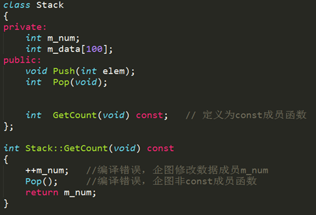 

1. 1. 函数重载 

> 既然const是定义为const函数的组成部分，那么就可以通过添加const实现函数重载咯。 

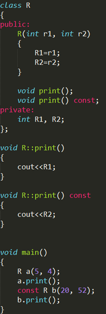
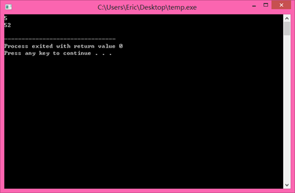 

其中print成员函数就实现了两个版本~~~ 重载哦，输出结果为 5,52。 const对象默认调用const成员函数。 

1. const 修饰函数返回值 

const修饰函数返回值其实用的并不是很多，它的含义和const修饰普通变量以及指针的含义基本相同。如下所示： 

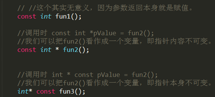     

一般情况下，函数的返回值为某个对象时，如果将其声明为const时，多用于操作符的重载。通常，不建议用const修饰函数的返回值类型为某个对象或对某个对象引用的情况。原因如下：如果返回值为某个对象为const（const  A test = A 实例）或某个对象的引用为const（const A& test = A实例）  ，则返回值具有const属性，则返回实例只能访问类A中的公有（保护）数据成员和const成员函数，并且不允许对其进行赋值操作，这在一般情况下很少用到。    

1. const修饰函数参数 

- 传递过来的参数在函数内不可以改变(无意义，因为Var本身就是形参) 

> 
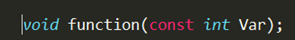 

- 参数指针所指内容为常量不可变

> 
 

- 参数指针本身为常量不可变(也无意义，因为char* Var也是形参) 

> 
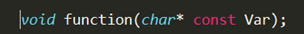 

- 参数为引用，为了增加效率同时防止修改。修饰引用参数时： 

> 
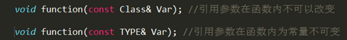 

> ​         这样的一个const引用传递和最普通的函数按值传递的效果是一模一样的,他禁止对引用的对象的一切修改,唯一不同的是按值传递会先建立一个类对象的副本,   然后传递过去,而它直接传递地址,所以这种传递比按值传递更有效.另外只有引用的const传递可以传递一个临时对象,因为临时对象都是const属性,  且是不可见的,他短时间存在一个局部域中,所以不能使用指针,只有引用的const传递能够捕捉到这个家伙. 

- **const限定符和static的区别** 

1. const定义的常量在超出其作用域之后其空间会被释放，而static定义的静态常量在函数执行后不会释放其存储空间。  
2. static表示的是静态的。类的静态成员函数、静态成员变量是和类相关的，而不是和类的具体对象相关的。即使没有具体对象，也能调用类的静态成员函数和成员变量。一般类的静态函数几乎就是一个全局函数，只不过它的作用域限于包含它的文件中。  
3. 在C++中，static静态成员变量不能在类的内部初始化。在类的内部只是声明，定义必须在类定义体的外部，通常在类的实现文件中初始化，如：double  Account::Rate=2.25; static关键字只能用于类定义体内部的声明中，定义时不能标示为static  
4. 在C++中，const成员变量也不能在类定义处初始化，只能通过构造函数初始化列表进行，并且必须有构造函数。  
5. const数据成员,只在某个对象生存期内是常量，而对于整个类而言却是可变的。因为类可以创建多个对象，不同的对象其const数据成员的值可以不同。所以不能在类的声明中初始化const数据成员，因为类的对象没被创建时，编译器不知道const数据成员的值是什么。  
6. const数据成员的初始化只能在类的构造函数的初始化列表中进行。要想建立在整个类中都恒定的常量，应该用类中的枚举常量来实现，或者static const。 
7. const成员函数主要目的是防止成员函数修改对象的内容。即const成员函数不能修改成员变量的值，但可以访问成员变量。当方法成员函数时，该函数只能是const成员函数。  
8. static成员函数主要目的是作为类作用域的全局函数。不能访问类的非静态数据成员。类的静态成员函数没有this指针，这导致：1、不能直接存取类的非静态成员变量，调用非静态成员函数2、不能被声明为virtual 
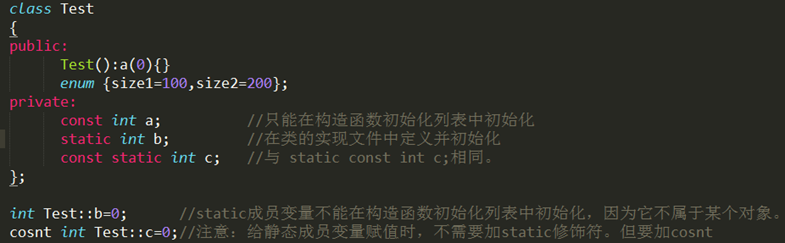

**其中关于static、const、static cosnt、const static成员的初始化问题：** 

- 类里的const成员初始化 

> ​     在一个类里建立一个const时，不能给他初值
>
> 
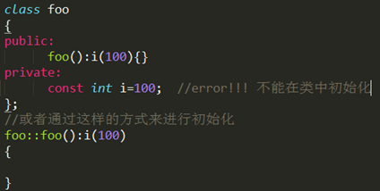 

- 类里的static成员初始化： 

> ​      类中的static变量是属于类的，不属于某个对象，它在整个程序的运行过程中只有一个副本，因此不能在定义对象时 对变量进行初始化，就是不能用构造函数进行初始化，其正确的初始化方法是： 
>
> 数据类型 类名::静态数据成员名=值 

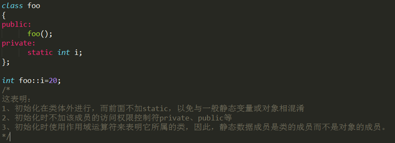 

- 类里的static cosnt 和 const static成员初始化（这两种写法是一致的！！） 

  
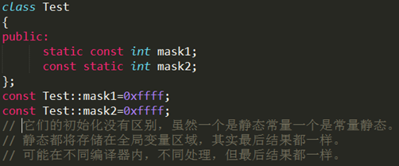 

> ​       最后通过一个完整的例子展示以上结果：
>
> 
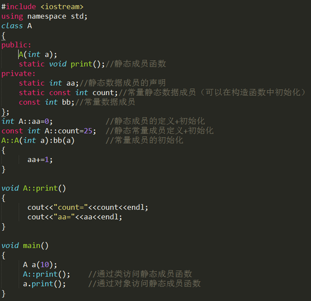 

- # const 的难点 

> 如果函数需要传入一个指针，面试官可能会问是否需要为该指针加上const，把const加在指针不同的位置有什么区别；如果写的函数需要传入的参数是一个复杂类型的实例，面试官可能会问传入值参数或者引用参数有什么区别，什么时候需要为传入的引用参数加上const。 const是用来声明一个常量的，当你不想让一个值被改变时就用const，const int max和int const max 是没有区别的，都可以。不涉及到指针const很好理解。一旦涉及到指针，则比较容易出问题。 
>
> 
>
> 
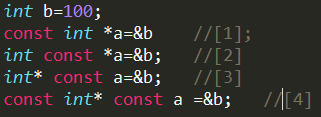
>
> 如果const位于星号的左侧，则const就是用来修饰指针所指向的变量，即指针指向的对象为常量；如果const位于星号的右侧，const就是修饰指针本身，即指针本身是常量。 
>
> 因此，[1]和[2]的情况相同，都是指针所指向的内容为常量（const放在变量声明符的位置无关），这种情况下不允许对内容进行更改操作，如不能*a  = 3  ；[3]为指针本身是常量，而指针所指向的内容不是常量，这种情况下不能对指针本身进行更改操作，如a++是错误的；[4]为指针本身和指向的内容均为常量。  

 

如果理解了上面的所有信息，我相信应该问题不大。仅供参考~~~ 希望大家热烈讨论哈。 好了，先写到这里，在以后需要补充我再加东西吧。。。敲得手疼~~~ ~！！！
