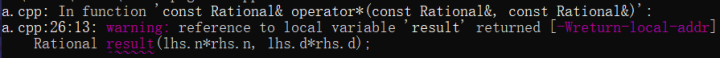
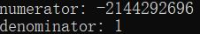
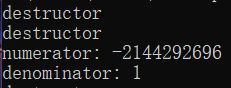

# Effective C++读书笔记(21): 不要随便返回引用

**守则21: 不要在需要返回对象时返回引用**

> "Don't return a reference when you must return an object"

------

***本篇关键词: 返回引用\***

*FBI Warning: 这一篇主要举的都是反例，用来说明返回引用绝大多数情况下都是不可取的*

------

[上一章](https://zhuanlan.zhihu.com/p/77753938)我们见识到了引用传递的高效率，但这不代表要根除值传递。C++的引用可以简单地理解为是一个**已存在的**变量的另一个名字，那么我们就可以根据两个名字来操作同一个变量，因此当你看见某处使用了引用，首先要问自己，它的另一个名字叫什么? 当这个问题找不到答案的时候，我们就只能使用值传递了。

接下来我们要用反例来证明为什么随便传递(返回)引用不可取，来看一个例子:

```text
class Rational{  //表示有理数的类
  public:
    Rational(int numerator = 0, int denominator = 1); 
    ...
  private:
    int n,d;  //分子与分母
  friend const Rational operator*(const Rational& lhs, const Rational& rhs);
};
```

这里的opeator*按值返回一个常量，就必定会在调用处生成本地拷贝，那么我们可不可以通过返回一个引用来避免拷贝带来的高成本呢? 就像这样:

```text
friend const Rational& operator*(const Rational& lhs, const Rational& rhs);
```

想法很好，可是在应用中是不现实的。既然引用必须指向一个**已存在的**对象，那么我们就必须自己创建一个对象，让我们返回的引用来指向这个对象。创建对象有两种方式，从堆(heap)上创建和从栈(stack)上创建。我们先试试在栈上创建对象:

```text
const Rational& operator*(const Rational& lhs, const Rational& rhs){
  Rational result(lhs.n*rhs.n, lhs.d*rhs.d);
  return result;
}
```

第一，返回引用是希望节省拷贝的成本，可是这个函数第一行就生成了拷贝 

第二，这个引用指向result，但result是这个函数的本地变量，在函数返回时自动销毁，那么这个返回的引用就成了空引用，对其执行操作就会导致程序运行错误，*这种错误同样适用于返回指向本地变量的指针。*

这样的代码首先会在编译时发出警告:



最后执行时因为接触了空引用而报错:


如果在堆上创建对象呢?

```text
const Rational& operator*(const Rational& lhs, const Rational& rhs){
  Rational* result = new Rational(lhs.n*rhs.n, lhs.d*rhs.d);
  return *result;
} 
```

第一，还是不可避免要调用一次构造函数

第二，虽然可以成功编译，结果也是正确的，如下图:


但这样写一定会发生资源泄漏，因为没有代码负责删除掉这个指针。就算使用了智能指针或者别的资源管理策略来防止泄露，所获得数据也是坏数据，因为动态分配的本地对象会在离开函数后**立即**被销毁，甚至还来不及到达调用operator*代码的地方。

如下是使用智能指针实现的代码:

```text
  friend const Rational& operator*(const Rational& lhs, const Rational& rhs){
	  shared_ptr<Rational> result(new Rational(lhs.n*rhs.n, lhs.d*rhs.d));
	  return *result;
  }
```

虽然成功通过编译，可是执行时输出如下结果，可以看到明显是错误的:



> 注释：上面是我经过实验得出的结论，作者在原文可能犯了一个错，他举了Rational w,x,y,z; w =  x*y*z;的一个例子来说明即使使用智能指针，在堆上创建对象依然会导致资源泄漏。这个语句调用了两次operator*，等价于operator*(operator*(x,y),z)，因为第一次调用返回的是引用，而我们不能拿出引用背后隐藏的指针，所以第二次调用会造成资源泄漏。
> 我觉得有些匪夷所思，最后经过一番自己亲手实验，发现首先析构函数可以被顺利调用两次，而且首要问题是以上的坏数据问题，如下图:



------

既然不管是堆还是栈上创建对象，每次访问这个函数都要造成一次构造函数调用，而我们的目标是节省这次调用，想一劳永逸，是不是想起来了静态变量?

```text
const Rational& operator(const Rational& lhs, const Rational& rhs){
  static Rational result;  //创建一个静态对象
  result=.....;
  return result;
}
```

静态对象可能会带来多线程安全问题，可除此之外，我们再来看如下一段完全合理的代码:

```text
bool operator==(const Rational& lhs, const Rational& rhs);
Rational a,b,c,d;
...
if((a*b)==(c*d)){
  .....
}
```

结果如何?  if条件语句的每次都会被计算为true，不管abcd取什么值。这是因为该条件语句等价于operator==(operator*(a,b),operator*(c,d))。所以当operator==被执行时，会产生两个对operator*的调用，可是operator*只能返回指向*同一个*静态对象的引用，因此两边一定会相等。

------

举了这么多反例，真正正确的做法还是要让函数返回对象而非引用，因此我们的运算符定义应该至少等价于如下:

```text
inline const Rational operator*(const Rational& lhs, const Rational& rhs){
  return Rational(lhs.n * rhs.n, lhs.d * rhs.d);
}
```

在传入参数时，我们可以使用引用传递，可是在返回时，除非确定真的要一个引用，就比如在[第4章](https://zhuanlan.zhihu.com/p/64141116)，用来解决不同编译单元的静态对象初始化问题，或者重载输出运算符operator<<，还是要老老实实返回对象，虽然这样当然会产生构造函数和析构函数的额外开销，可是从长期来看，这些开销对于一个程序的稳定运行可以说非常微小，倒不如在别的方面给程序优化一下。

同时许多C++编译器自带优化功能，生成的机器代码会在保证不影响可观测范围内结果的前提下提升效率，有时使用了优化，这些成本便可以忽略不计了。

**总结:**

- 千万不要返回指向一个本地对象的指针或者引用，否则会造成资源泄漏和程序崩溃
- 在面临返回引用还是对象的选择时，你的目标是要让程序能工作正常，因此除非明确希望返回引用，还是老老实实返回对象，至于其带来的成本，交给编译器来优化

发布于 2019-08-24