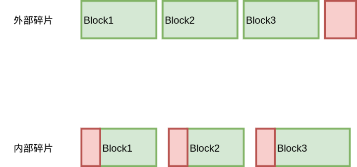
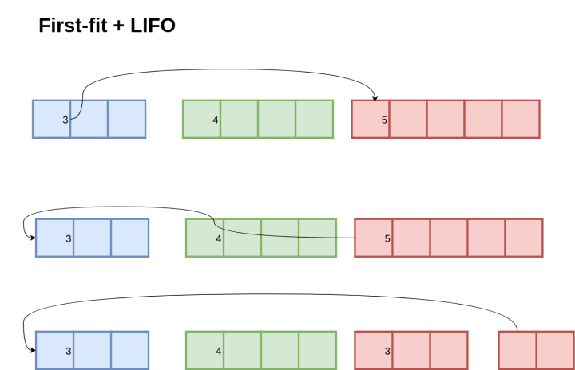
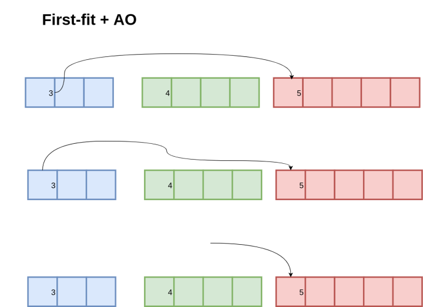
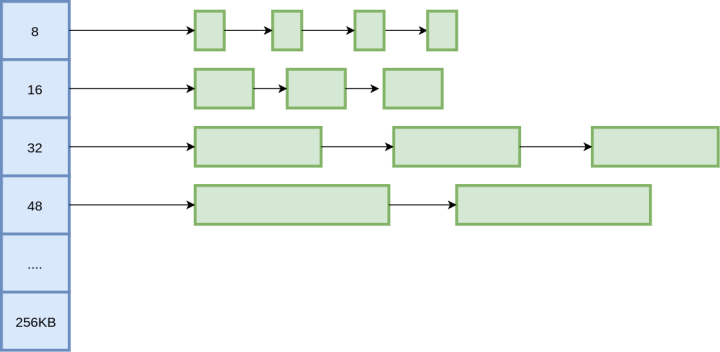
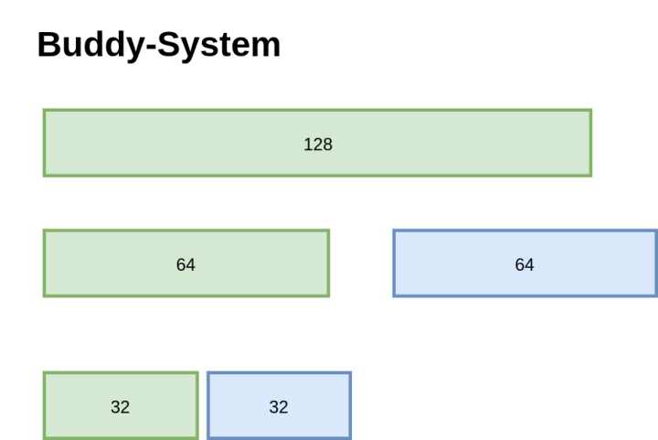
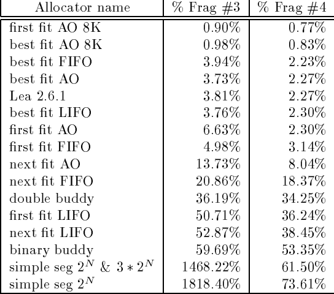

# TCMalloc分析 - 如何减少内存碎片

## 前言

前文说到 TCMalloc 的基本原理，ThreadCache、PageHeap、PageMap之类的，有了这些组件，基本算的上一个现代化的内存分配器了。但对于 TCMalloc 来说，这些只是万里长征第一步，实现一个高性能的内存分配器还有很长的路要走。

本文围绕着**如何减少内存碎片**这一问题，来看看 TCMalloc 对这方面的考量。

## 什么是内存碎片？

这基本上是一个地球人都知道的问题。。不过我还需要再唠叨一遍。所谓内存碎片，就是有一部分内存不能够分配给程序使用，因为它们以碎片的方式存在。内存碎片可以分两种，内部碎片和外部碎片，内部碎片是分配器分配的内存大于程序申请的内存，外部碎片是内存块太小，无法分配给程序使用。



那么，内存碎片来自于哪里呢？这个问题的答案取决于具体的内存分配算法，所以我们先来回顾一下经典的内存分配算法。

## 内存碎片-Freelist


首先是 free-list，通过链表，把内存中空闲块连接起来。分配的时候，找到大小合适的 Block，把它切分成两块，一块是待分配的大小，另一块放回 free-list；释放的时候，插入到链表中，并且合并一下前后的内存块方便下次分配。

分配的时候，选择哪块内存进行分裂？第一个满足大小的？还是大小最合适的？通常有 First-Fit、Next-Fit、Best-Fit这几种策略。

放回的时候，也有多种策略，可以直接放回链表头部（Last In First Out），最省事；或者按照地址顺序放回（Address-Ordered），使得链表中的空闲块都按照地址顺序排列。

free-list的内部碎片来自于固定大小的头部和尾部，用来记录内存块的大小以及这块内存的空闲与否，否则无从得知一个内存块的大小，以及前一个内存块的地址，后一个内存块的地址，也就无从进行内存合并了。

free-list的外部碎片则取决于分配和释放策略。通常来说，First-Fit策略会使得链表前面的大块内存被频繁分裂，从而造成较多的内存碎片；Best-Fit的内存碎片较少；放回时，采用Address-Ordered顺序能够增加内存合并的机会，相比于 LIFO 的碎片会更少。

这里有一个很有意思的策略是Address-Ordered。先看一下LIFO的情况：



首先这些内存块都是按地址排序的，3和5是空闲的，4是已分配的，3指向5。现在分别申请了3和5的内存，然后又释放了3和5，得到第二幅图的情况，指针变成了5指向3，因为直接把 3 和 5 插入到链表头部，LIFO策略。接下来再申请 3字节内存，按照 First-Fit策略，就会把 5的内存进行分裂。



如果采用Address-Ordered策略，放回3和5时，指针顺序还是从3指向5。那么再次申请3字节内存时，直接分配原有的3，而不需要分裂5的内存。

一些研究表明，采用Address-Ordered策略能够显著降低内存碎片，不过其实现较为复杂，释放内存的复杂度较高。

## 内存碎片-Segregated-Freelist

上面的 Freelist 都可以申请和释放任意大小的内存块，而将大的内存块和小的内存块放在一起很容易带来内存碎片，因此就有了 Segregated-Freelist，每个 Freelist 存储不同大小的内存块。



在Seglist中，就无需 Boundary-Tag 去存储内存块的大小信息了，只需要实现从地址到Seglist的映射即可，例如TCMalloc中使用的PageMap就是一种方式。

看起来可以减少内部碎片，但是问题随之而来，每个Freelist都存储固定大小的内存块，如果申请9字节数据，可能就要分配16字节，带来的内存碎片反而更多了！因此，虽然按照2的幂级数去分配是一种很简单的策略，但是它并不高效。解决方案也有不少，例如分配 2^N 和 3*2^N 的内存块。

至于外部碎片的问题，Seglist也同样存在，不过不是那么明显。因为在分配Freelist的时候，通常按照内存 Page为单位，如果块大小不是 Page 的约数，就会有外部碎片了。

Segregated-Freelist 还有一个变种，称之为 Segregated-Fit。每个Freelist 不再是存储固定大小的内存块，而是存储一定范围的内存块。大名鼎鼎的 Doug Lea内存分配其（dlmalloc）就使用了这种策略。

## 内存碎片-Buddy-System

伙伴系统也是一种很经典的分配算法。



按照一分为二，二分为四的原则，直到分裂出一个满足大小的内存块；合并的时候看看它的 Buddy 是否也为空闲，如果是就可以合并，可以一直向上合并。

伙伴系统的优势在于地址计算很快，对于一个内存块的地址，可以通过位运算直接算出它的 Buddy，Buddy 的 Buddy，因此速度很不错。

不过考虑内存碎片，它并没有什么优势，像图中的这种经典的 Binary Buddy，全部都是2的幂级数，内部碎片还是会达到 50%。当然也有一些其他的优化，块大小可以是3的倍数之类的。

## 内存分配算法的比较

对于以上的几种算法，实际会产生的内存碎片会有多少呢，有人专门做过测试比较：



Frag#3和Frag#4分别是两种不同的度量方法，一个是分配器申请内存最大时，程序分配的内存和分配器申请的内存，另一个是程序最大申请的内存和分配器最大申请的内存。测试时使用了实际的程序进行模拟，例如GCC之类内存开销较大的程序。

这里有几个比较夸张的值，例如simple seg的1468%，这是因为碎片率的度量仅仅考虑分配器申请的内存和程序分配的内存，存在一定误差。不过对于 best fit  AO来说，其内存碎片显然是相当少的，而一些在我们看来比较朴素的算法，first fit，其内存碎片率其实也相当低，反而是 buddy  system 和 segregated list 比较尴尬。

不过这篇文章说明的核心观点是，只要选择了合适的策略，其内存碎片就完全不用担心，只要关心实现的性能就可以了，程序员也不用再手写内存分配器什么的了。

## TCMalloc的内存碎片

TCMalloc采用了 Segregated-Freelist 的算法，提前分配好多种 size-class，在64位系统中，通常就是 88 种，那么问题来了，这个怎么计算？

首先看一下结果：8， 16， 32， 48， 64， 80， 96， 112， 128， 144， 160， 176......

TCMalloc 的目标是最多 12.5% 的内存碎片，按照上面的 size-class算一下，例如 [112, 128)，碎片率最大是 ([128-112-1](tel:128-112-1))/128 = 11.7%，([1152-1024-1](tel:1152-1024-1))/1151 = 11.02%。当然结果是满足 12.5% 这一目标的。

要生成一批满足碎片率的 size-class 其实也有多种方法，比如，[x, y)区间内，只要满足 (y-x-1)/y <= 0.125即可，即 y <= 8/7*(x+1)，从前往后递推一下就可以得到这些结果了，另外再考虑一下字节对齐什么的，就可以得到不错的结果。

不过  TCMalloc 从另一个角度来考虑这个问题的：从 size 到 size-class，需要进行一次向上对齐（round-up），例如 17  对齐到32；其实也是进行了一次字节对齐（Alignment），把 17 以 16 字节进行对齐，(17 + 15) / 16 * 16 =  32。

那么，内存碎片率其实就是 (Alignment-1) / SizeClass。那么我们只需要保证每个SizeClass它的 Alignment 满足 (Alignment-1)/SizeClass <= 0.125 就能满足需求了。

例如，对于 size-class 1024，下一个size-class 就是 1024 + 1024 / 8 = 1152，其中 Alignment  是1024/8=128；那么1152，我们是按照 1152/8=144，还是按照128计算 Alignment 呢，我们选一个比较好看的数字  128 计算出下一个 size-class。好吧，为什么是128呢，因为是把 1152  向下对齐到了2的幂级数1024，（这里的原因我就不是那么清楚了）。得到的代码如下：

```go
func InitSizeClass() []int {
	alignment := 8
	classToSize := make([]int, 0, 88)
	for size := alignment; size <= 256*1024; size += alignment {
		alignment = align(size)
		classToSize = append(classToSize, size)
	}
	return classToSize
}
```

代码非常简单，不过省略了 align 这个函数的实现：

```go
func align(size int) int {
	aligment := 8
	if size > 256*1024 {
		aligment = PageSize
	} else if size >= 128 {
		aligment = (1 << uint32(lgfloor(size))) / 8
	} else if size >= 16 {
		aligment = 16
	}
	if aligment > PageSize {
		aligment = PageSize
	}
	return aligment
}
```

计算 Alignment 的时候，大于 256 × 1024就按照Page进行对齐；最小对齐是8；在128到256×1024之间的，按照 1<<lgfloor(size) / 8进行对齐。等等，说好的向下取整到 2的幂级数然后除以8呢？

其实 lgfloor 就是用二分查找，向下对齐到2的幂级数的：

```go
func lgfloor(size int) int {
	n := 0
	for i := 4; i >= 0; i-- {
		shift := uint32(1 << uint32(i))
		if (size >> shift) != 0 {
			size >>= shift
			n += int(shift)
		}
	}
	return n
}
```

先看左边16位，有数字的话就搜左边，否则搜右边。。。

到这里，基本上完成了 size-class的计算（TCMalloc 还有一个优化）。

## TCMalloc的外部碎片

上面的 size-class 保证了内部碎片基本在 12.5%以下，但是外部碎片呢？

外部碎片是因为 CentralCache 在向 PageHeap 申请内存的时候，以 Page 为单位进行申请。举个例子，对于 size-class  1024，以一个Page（8192）申请，完全没有外部碎片；但是对于 size-class 1152，就有 8192 % 1152 = 128  的碎片。为了保证外部碎片也小于 12.5%，可以一次多申请几个Page，但是又不能太多造成浪费。

```go
func numMoveSize(size int) int {
	if size == 0 {
		return 0
	}
	num := 64 * 1024 / size
	return minInt(32768, maxInt(2, num))
}

func InitPages(classToSize []int) []int {
	classToPage := make([]int, 0, NumClass)
	for _, size := range classToSize {
		blocksToMove := numMoveSize(size) / 4
		psize := 0
		for {
			psize += PageSize
			for (psize % size) > (psize >> 3) {
				psize += PageSize
			}
			if (psize / size) >= blocksToMove {
				break
			}
		}
		classToPage = append(classToPage, psize>>PageShift)
	}
	return classToPage
}
```

这里计算出来的结果，就是每个 size-class 每次申请的 Page 数量，保证12.5%以下的外部碎片。

到这里基本能够保证内部碎片和外部碎片都在 12.5% 以下了，但 TCMalloc 还没有就此止步。。

## size-class的合并

在我们上面计算出来的size-class中存在一些冗余，比如 1664，1792。它们都是一次申请2个Page，1664 可以分配出 8 * 1024 * 2 / 1664 = 9  个对象，1792也是可以分配出 8 * 1024 * 2 / 1792 = 9 个对象，那么，区分这两个  size-class有意义吗？1664浪费的内存是 8*1024*2%1664=1408, 1792浪费的内存是  8*1024*2%1792=256，1792浪费的内存反而更少一点。因此都保留并不能让这2 个Page  发挥更大的价值，所以，我们干脆把这两个合并了，仅仅保留 1792，结果并不会更差。

不过还有一个问题，如果我们计算一下[1536,  1792)的碎片，会发现 （1792-1536+1) / 1792 = 14.28% ，怎么大于 12.5 % 了？略尴尬。这也意味着，申请  1537字节，它的实际碎片率是 (8192*2 - (8192*2/1792*1537)) / (8192 * 2) =  15.57%，还是大于了 12.5% 的承诺。。

这里会发现，虽然内部碎片小于 12.5%，外部碎片也小于 12.5%，但是它们加在一起就大于12.5%了，很悲伤的故事。。不知道 Sanjay是有意为之，还是无心之过。

## size到size-class

还有一个小的问题，如何从size 计算出 size-class。最简单的最大是二分查找，用std::upper_bound  就可以搞定，不过对于88个size-class，O（LogN）需要7次查找，还是有些多，随之带来的 cache miss 可能又会加剧问题。

另一个方法是打表，因为所有size-class都是至少8字节对齐的，我们把 256×1024 所有 8 字节对齐的数都打表，就能用O（1）的复杂度查找到 size-class，不过这种方法略废内存，cache  locality可能也不会太好；观察一下发现，大于1024的 size-class  其实都以128对齐，那么这个表就可以分两段，小于1024和大于1024，省了很多内存。具体的计算就不再赘述。

## 总结

其实在代码中，关于 size-class 的计算真的就那么几行，以至于很多文章都没有仔细考虑这段代码的含义。不过 size-class  关系到内存碎片的多少，显然又是相当重要的，所以还是花了不少心思研究了一下这几行代码的意思。而我又比较弱，其实花了好多时间才搞明白。虽然只是几个参数，但是相信 Sanjay 还是仔细设计的，否则直接用 magic number写在里面，后来人更是不知所云了。

## 参考

- [Johnstone M S, Wilson P R. The memory fragmentation problem: solved?[C\]//ACM SIGPLAN Notices. ACM, 1998, 34(3): 26-36.](https://link.zhihu.com/?target=https%3A//www.researchgate.net/profile/Paul_Wilson34/publication/2294861_The_Memory_Fragmentation_Problem_Solved/links/55618b1708ae8c0cab31f4c1/The-Memory-Fragmentation-Problem-Solved.pdf)
- [Zorn E D B B G, McKinley K S. Reconsidering Custom Memory Allocation[J\]. 2002.](https://link.zhihu.com/?target=http%3A//www.allendowney.com/ss08/handouts/berger02reconsidering.ps)
- [http://jemalloc.net/](https://link.zhihu.com/?target=http%3A//jemalloc.net/)
- [CMU 15213关于内存管理的课件](https://link.zhihu.com/?target=http%3A//www.cs.cmu.edu/afs/cs/academic/class/15213-s11/www/lectures/20-allocation-advanced.pdf)

编辑于 2017-09-17