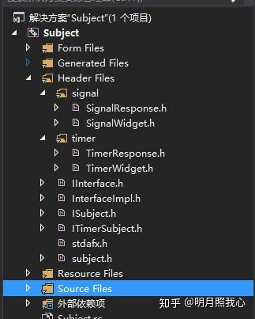

# C++屌屌的观察者模式-同步回调和异步回调

## **一、概述**

说起观察者模式，也是比较简单的一种模式了，稍微工作有1年经验的同学，写起来都是666...

**想看观察者模式的说明可以直接上[菜鸟教程|观察者模式](https://link.zhihu.com/?target=https%3A//www.runoob.com/design-pattern/observer-pattern.html)这个地址去看。**

本篇文章其实就是一个简单的观察者模式，只是使用了模板的方式，把我们的回调接口进行了参数化，这样有什么好处呢？

**好处当然是大大的有了。** 平时我们在不同业务逻辑之间写观察者模式呢，都得写好多个，大家有没有发现，所有的被观察者Subject其实很多操作都是一样的。

本篇我们带来两种观察者模式：**同步观察者和异步观察者**

### **1、同步观察者**

顾名思义，同步观察者其实就是不管是谁，触发了Subject的Update操作，该操作都是同步进行的，他会调用所有的观察者(Observer)的OnUpdate接口，来通知Observer处理改变操作。

如效果展示图中的第一个`单次拉取`页签，当我们点击拉取按钮时，就相当于触发了一次Subject对象的Update操作

### **2、异步观察者**

异步观察者模式上和同步观察者基本一样，只是在事件处理上有稍微不同

1. 执行Update操作是由Subject自己去完成的
2. 调用Observer的OnUpdate回调接口时，处于工作线程中
3. Subject所有的请求操作都是在工作现场中进行

如效果图所示，`定时拉取`观察者模式，Subject启动了一个后台线程，3秒钟拉取一次数据，并回调到界面

## **二、效果展示**

如下图所示，是一个简单的观察者模式事例。

`单次拉取`：演示了同步观察者模式

`定时拉取`：演示了异步观察者模式


工程结构如图所示，这里只把头文件的目录展示出来了。

实现文件的目录和头文件类似，为了截图方便所以做了隐藏操作。





Header Files目录下有2个虚拟文件夹，分别就是对`单次拉取`和`定时拉取`功能的实践

**下面我们就来正式开始讲解这个屌屌的观察者模式**

## **三、同步观察者**

**1、首先就是定义一堆接口和回调参数**

```text
struct DataItem
{
    std::string     strID;  
    std::string     strName;        
};

typedef IUpdate1<DataItem>          ISignalObserver;

//单次回调
struct ISignal : public SubjectBase<ISignalObserver>
{
    virtual void RequestData() = 0;
};
```

**2、业务观察者**

这里我定义了一个SignalResponse业务观察者，也就是我们在开发工程中的实际功能类。

```text
class SignalResponse : public ISignal
{
public:
    SignalResponse();
    ~SignalResponse();

public:
    virtual void RequestData() override;

private:
    
};
```

*3、获取观察者指针**

通过一个门面接口获取观察者指针

1. 调用ISignal的Attach接口，就可以把自己添加到观察者列表。
2. 调用ISignal的RequestData接口，就可以拉取数据。
3. 调用ISignal的Detach接口，就可以把自己从观察者列表中移除。

```text
ISignal * GetSignalCommon();
```

**4、UI界面**

接下来就是写一个UI界面啦，当我们通过上一步调用拉取数据接口后，我们的UI上相应的OnUpdate接口就会被回调

```text
class SignalWidget : public QWidget, public ISignalObserver
{
    Q_OBJECT

public:
    SignalWidget(QWidget * parent = 0);
    ~SignalWidget();

protected:
    virtual void OnUpdate(const DataItem &) override;

private slots:
    void on_pushButton_clicked();

private:
    Ui::SignalWidget *ui;
};
```

**通过以上四步，就可以很方便的实现一个现在业务中的观察者，是不是很简单呢**，编写过程中，需要完成这几个地方

1. 需要定义我们回调函数的参数结构
2. 需要实例化一个被观察者接口类
3. 实例化一个业务观察者
4. 做一个UI界面，并集成第二步实例化的被观察者的模板参数(接口类)

注意看这里的ISignalObserver，是不是很眼熟，其实他就是我们的模板被观察者SubjectBase的模板参数。

**讲到这里，大家是不是都很关心这个模板观察者到底是何方神圣，居然这么叼。那么接下来就是模板SubjectBase出场啦。。。**

下面我直接给出代码，学过C++的同学阅读起来应该都不难。

> 觉着难了就多读几遍

```text
template <typename T>
struct ISubject
{
    virtual void Attach(T * pObserver) = 0;
    virtual void Detach(T * pObserver) = 0;
};

template <typename P>
struct IUpdate1
{
    virtual void OnUpdate(const P& data) = 0;
};

template <typename P1, typename P2>
struct IUpdate2
{
    virtual void OnUpdate2(const P1 & p1, const P2 & p2) = 0;
};

template <typename P>
struct IUpdate1_P
{
    virtual void OnUpdate(const P * data) = 0;
};

template <typename T>
struct SubjectBase
{
public:
    virtual void Attach(T * pObserver)
    {
        std::lock_guard<std::mutex> lg(m_mutex);
#ifdef _DEBUG
        if (m_observers.end() != std::find(m_observers.begin(), m_observers.end(), pObserver))
        {
            assert(false);
        }
#endif // _DEBUG
        m_observers.push_back(pObserver);
    }

    virtual void Detach(T * pObserver)
    {
        std::lock_guard<std::mutex> lg(m_mutex);
        auto it = std::find(m_observers.begin(), m_observers.end(), pObserver);
        if (it != m_observers.end())
        {
            m_observers.erase(it);
        }
        else
        {
            assert(false);
        }
    }

    //protected:
    template <typename P>
    void UpdateImpl(const P & data)
    {
        std::lock_guard<mutex> lg(m_mutex);
        for (T * observer : m_observers)
        {
            observer->OnUpdate(data);
        }
    }

    template <typename P>
    void UpdateImpl(P & data)
    {
        std::lock_guard<std::mutex> lg(m_mutex);
        for (T* observer : m_observers)
        {
            observer->OnUpdate(data);
        }
    }

    template <typename P1, typename P2>
    void UpdateImpl(const P1& p1, const P2& p2)
    {
        std::lock_guard<mutex> lg(m_mutex);
        for (T* observer : m_observers)
        {
            observer->OnUpdate2(p1, p2);
        }
    }

    template <typename P1, typename P2>
    void UpdateImpl(P1& p1, P2& p2)
    {
        std::lock_guard<mutex> lg(m_mutex);
        for (T* observer : m_observers)
        {
            observer->OnUpdate2(p1, p2);
        }
    }

    template <typename P>
    void UpdateImpl(const P * data)
    {
        std::lock_guard<mutex> lg(m_mutex);
        for (T * observer : m_observers)
        {
            observer->OnUpdate(data);
        }
    }

    template <typename P>
    void UpdateImpl(P * data)
    {
        std::lock_guard<mutex> lg(m_mutex);
        for (T* observer : m_observers)
        {
            observer->OnUpdate(data);
        }
    }

protected:
    std::mutex      m_mutex;
    std::list<T *>  m_observers;
};
```

## **四、异步观察者**

异步观察者的实现和同步观察者的结构基本一样，都是使用同样的套路，唯一有区别的地方就是，异步观察者所有的逻辑处理操作都是在工作线程中的。

由于ITimerSubject和SubjectBase很多接口都是一样的，因此我这里就只把差异的部分贴出来。

**1、线程**

ITimerSubject对象在构造时，就启动了一个线程，然后在线程中定时执行TimerNotify函数

```text
ITimerSubject()
{
    m_thread = std::thread(std::bind(&ITimerSubject::TimerNotify, this));
}

virtual ~ITimerSubject()
{
    m_thread.join();
}
```

再来看下定时处理任务这个函数，这个函数本身是用boost的库实现我的，我改成C++11的模式的，新城退出这块有些问题，我没有处理，这个也不是本篇文章的核心要讲解的东西。

> 怎么优雅的退出std::thread，这个从网上查下资料吧，我能想到的也就是加一个标识，然后子线程去判断。如果大家有更好的办法的话可以私信我，或者在底部留言。

```text
void TimerNotify()
{
    for (;;)
    {
        //std::this_thread::interruption_point();

        bool bNotify = false;
        {
            std::lock_guard<std::mutex> lg(m_mutex);
            bNotify = m_sleeping_observers.size() < m_observers.size() ? true : false;
        }

        if (bNotify)
        {
            OnTimerNotify();
        }

        //std::this_thread::interruption_point();

        std::chrono::milliseconds timespan(GetTimerInterval() * 1000); // or whatever
        std::this_thread::sleep_for(timespan);
    }
}
```

**2、定义一堆接口和回调参数**

```text
struct TimerDataItem
{
    std::string     strID;
    std::string     strName;
};

typedef IUpdate1<TimerDataItem>     ITimerObserver;

//定时回调
struct ITimer : public ITimerSubject<ITimerObserver, std::string, TimerDataItem>{};
```

**3、业务观察者**

这里我定义了一个TimerResponse业务观察者，也就是我们在开发工程中的实际功能类。

```text
class TimerResponse : public ITimer
{
public:
    TimerResponse();
    ~TimerResponse();

protected:
    virtual void OnNotify() override;

private:
    
};
```

TimerResponse::OnNotify()这个接口的实现就像这样，**这里需要注意的一点是，这个函数的执行位于工作线程中，也就意味着UI界面的回调函数也在工作线程中，操作UI界面时，一定需要抛事件到UI线程中。**

```text
void TimerResponse::OnNotify()
{
    static int id = 0;
    static std::string name = "miki";
    id += 1;
    TimerDataItem item;

    std::stringstream ss;
    ss << "timer" << id;

    item.strID = ss.str();
    item.strName = name;

    UpdateImpl(item);
}
```

OnNotify会定时被调用，然后去更新UI上的内容。

**4、获取观察者指针**

通过一个门面接口获取观察者指针，调用ITimer的Attach接口把自己添加到观察者列表，然后就可以定时获取到数据，反之也能把自己从观察者列表中移除，并停止接收到数据。

```text
ITimer * GetTimerCommon();
```

**5、UI界面**

定时回调功能测试界面

1. on_pushButton_clicked槽函数只是为了把当前线程唤醒，并定时回调
2. OnUpdate属于定时回调接口

```text
class TimerWidget : public QWidget, public ITimerObserver
{
    Q_OBJECT

public:
    TimerWidget(QWidget *parent = 0);
    ~TimerWidget();

protected:
    virtual void OnUpdate(const TimerDataItem &) override;

private slots:
    void on_pushButton_clicked();

signals:
    void RerfushData(TimerDataItem);

private:
    Ui::TimerWidget *ui;
};
```

上边也强调过了，OnUpdate的执行是在工作线程中的，因此实现的时候，如果涉及到访问UI界面，一定要注意切换线程

```text
void TimerWidget::OnUpdate(const TimerDataItem & item)
{
    //注意这里的定时回调都在工作线程中 需要切换到主线程

    emit RerfushData(item);
}
```

**以上讲解就是我们观察者的实现了，如果有疑问欢迎提出**


原文：[https://www.cnblogs.com/swarmbees/p/11155072.html#%E5%90%8C%E6%AD%A5%E8%A7%82%E5%AF%9F%E8%80%85](https://link.zhihu.com/?target=https%3A//www.cnblogs.com/swarmbees/p/11155072.html%23%E5%90%8C%E6%AD%A5%E8%A7%82%E5%AF%9F%E8%80%85)

作者：朝十晚八