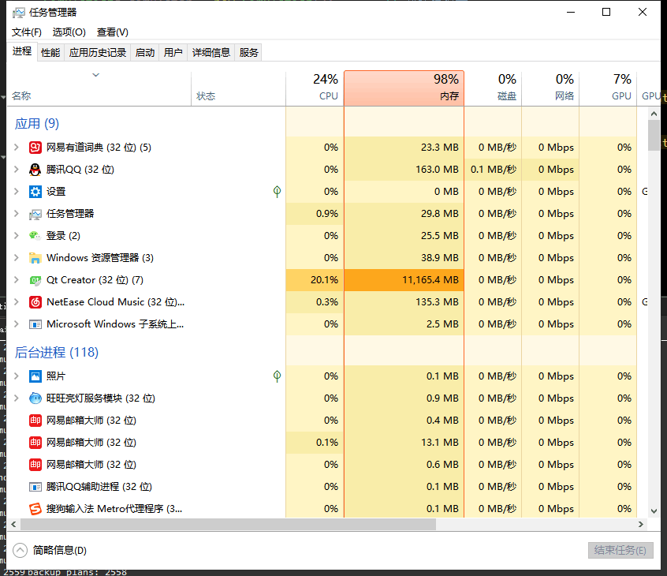
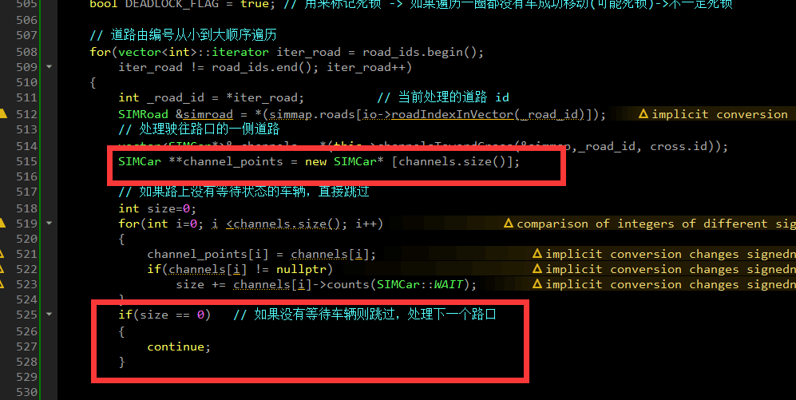

# C++ 智能指针

## 内存泄露的惨痛经历


# 引言

最近在敲一个C++项目的时候，出现了令人丧失自我的严重的内存泄露，如下图所示： 


经过调试后，最终发现导致内存泄漏的地点是一个频繁调用的函数中，有一定概率使四个指针没有释放，每个指针大小应该与内存宽度一致，也就是每个指针为 64位 8字节，四个指针就是32字节。而小小的32字节的泄露积蓄的能量可以达到数十G空间直至吃掉所有内存。




本文介绍一种不借助其他检测工具的情况下如何对内存泄露的点进行检测的方法，同时也介绍下STL中智能指针的使用方法。

# 查询内存泄露方法

## 啥是内存泄露

内存泄露在维基百科中的解释如下：

> 在计算机科学中，内存泄漏指由于疏忽或错误造成程序未能释放已经不再使用的内存。内存泄漏并非指内存在物理上的消失，而是应用程序分配某段内存后，由于设计错误，导致在释放该段内存之前就失去了对该段内存的控制，从而造成了内存的浪费。

在C++中出现内存泄露的主要原因就是程序猿在申请了内存后(`malloc(), new`)，没有及时释放没用的内存空间，甚至消灭了指针导致该区域内存空间根本无法释放。

知道了出现内存泄露的原因就能知道如何应对内存泄露，即：不用了的内存空间记得释放，不释放留着过年哇！

内存泄漏可能会导致严重的后果：

- 程序运行后，随着时间占用了更多的内存，最后无内存可用而崩溃；
- 程序消耗了大量的内存，导致其他程序无法正常使用；
- 程序消耗了大量内存，导致消费者选用了别人的程序而不是你的；
- 经常做出内存泄露bug的程序猿被公司开出而贫困潦倒。

## 如何知道自己的程序存在内存泄露？

根据内存泄露的原因及其恶劣的后果，我们可以通过其主要表现来发现程序是否存在内存泄漏：程序长时间运行后内存占用率一直不断的缓慢的上升，而实际上在你的逻辑中并没有这么多的内存需求。

## 如何定位到泄露点呢？

1. 根据原理，我们可以先review自己的代码，利用”查找”功能，查询`new`与`delete`，看看内存的申请与释放是不是成对释放的，这使你迅速发现一些逻辑较为简单的内存泄露情况。
2. 如果依旧发生内存泄露，可以通过记录申请与释放的对象数目是否一致来判断。在类中追加一个静态变量 `static int count;`在构造函数中执行`count++;`在析构函数中执行`count--;`，通过在程序结束前将所有类析构，之后输出静态变量，看count的值是否为0，如果为0,则问题并非出现在该处，如果不为0，则是该类型对象没有完全释放。
3. 检查类中申请的空间是否完全释放，尤其是存在继承父类的情况，看看子类中是否调用了父类的析构函数，有可能会因为子类析构时没有是否父类中申请的内存空间。
4. 对于函数中申请的临时空间，认真检查，是否存在提前跳出函数的地方没有释放内存。

# STL 的智能指针

为了减少出现内存泄露的情况，STL中使用智能指针来减少泄露。STL中一般有四种智能指针:

| 指针类别     | 支持         | 备注                                  |
| ------------ | ------------ | ------------------------------------- |
| `unique_ptr` | C++ 11       | 拥有独有对象所有权语义的智能指针      |
| `shared_ptr` | C++ 11       | 拥有共享对象所有权语义的智能指针      |
| `weak_ptr`   | C++ 11       | 到 std::shared_ptr 所管理对象的弱引用 |
| `auto_ptr`   | C++ 17中移除 | 拥有严格对象所有权语义的智能指针      |

因为 `auto_ptr` 已经在 C++ 17 中移除，对于面向未来的程序员来说，最好减少在代码中出现该使用的频次吧，这里我便不再研究该类型。又因为`weak_ptr`是`shared_ptr`的弱引用，所以，主要的只能指针分为两个`unique_ptr`和`shared_ptr`。

std::unique_ptr 是通过指针占有并管理另一对象，并在 unique_ptr 离开作用域时释放该对象的智能指针。在下列两者之一发生时用关联的删除器释放对象：

- 销毁了管理的 unique_ptr 对象
- 通过 operator= 或 reset() 赋值另一指针给管理的 unique_ptr 对象。

std::shared_ptr 是通过指针保持对象共享所有权的智能指针。多个 shared_ptr 对象可占有同一对象。下列情况之一出现时销毁对象并解分配其内存：

- 最后剩下的占有对象的 shared_ptr 被销毁；
- 最后剩下的占有对象的 shared_ptr 被通过 operator= 或 reset() 赋值为另一指针。

## unique_ptr

这是个独占式的指针对象，在任何时间、资源只能被一个指针占有，当unique_ptr离开作用域，指针所包含的内容会被释放。

### 创建

```C++
unique_ptr<int> uptr( new int );
unique_ptr<int[ ]> uptr( new int[5] );

//声明,可以用一个指针显示的初始化,或者声明成一个空指针,可以指向一个类型为T的对象
shared_ptr<T> sp;
unique_ptr<T> up;
//赋值,返回相对应类型的智能指针,指向一个动态分配的T类型对象,并且用args来初始化这个对象
make_shared<T>(args);
make_unique<T>(args);     //注意make_unique是C++14之后才有的
//用来做条件判断,如果其指向一个对象,则返回true否则返回false
p;
//解引用
*p;
//获得其保存的指针,一般不要用
p.get();
//交换指针
swap(p,q);
p.swap(q);

//release()用法
 //release()返回原来智能指针指向的指针,只负责转移控制权，不负责释放内存，常见的用法
 unique_ptr<int> q(p.release()) // 此时p失去了原来的的控制权交由q,同时p指向nullptr  
 //所以如果单独用:
 p.release()
 //则会导致p丢了控制权的同时,原来的内存得不到释放
 //则会导致//reset()用法
 p.reset()     // 释放p原来的对象,并将其置为nullptr，
 p = nullptr   // 等同于上面一步
 p.reset(q)    // 注意此处q为一个内置指针,令p释放原来的内存，p新指向这个对象
```

类满足可移动构造 (MoveConstructible) 和可移动赋值 (MoveAssignable) 的要求，但不满足可复制构造  (CopyConstructible) 或可复制赋值 (CopyAssignable) 的要求。 因此不可以使用 =  操作和拷贝构造函数，仅能使用移动操作。

### Demo

```C++
#include <iostream>
#include <vector>
#include <memory>
#include <cstdio>
#include <fstream>
#include <cassert>
#include <functional>

struct B {
  virtual void bar() { std::cout << "B::bar\n"; }
  virtual ~B() = default;
};
struct D : B
{
    D() { std::cout << "D::D\n";  }
    ~D() { std::cout << "D::~D\n";  }
    void bar() override { std::cout << "D::bar\n";  }
};

// 消费 unique_ptr 的函数能以值或以右值引用接收它
std::unique_ptr<D> pass_through(std::unique_ptr<D> p)
{
    p->bar();
    return p;
}

void close_file(std::FILE* fp) { std::fclose(fp); }

int main()
{
  std::cout << "unique ownership semantics demo\n";
  {
      auto p = std::make_unique<D>(); // p 是占有 D 的 unique_ptr
      auto q = pass_through(std::move(p));
      assert(!p); // 现在 p 不占有任何内容并保有空指针
      q->bar();   // 而 q 占有 D 对象
  } // ~D 调用于此

  std::cout << "Runtime polymorphism demo\n";
  {
    std::unique_ptr<B> p = std::make_unique<D>(); // p 是占有 D 的 unique_ptr
                                                  // 作为指向基类的指针
    p->bar(); // 虚派发

    std::vector<std::unique_ptr<B>> v;  // unique_ptr 能存储于容器
    v.push_back(std::make_unique<D>());
    v.push_back(std::move(p));
    v.emplace_back(new D);
    for(auto& p: v) p->bar(); // 虚派发
  } // ~D called 3 times

  std::cout << "Custom deleter demo\n";
  std::ofstream("demo.txt") << 'x'; // 准备要读的文件
  {
      std::unique_ptr<std::FILE, void (*)(std::FILE*) > fp(std::fopen("demo.txt", "r"),
                                                           close_file);
      if(fp) // fopen 可以打开失败；该情况下 fp 保有空指针
        std::cout << (char)std::fgetc(fp.get()) << '\n';
  } // fclose() 调用于此，但仅若 FILE* 不是空指针
    // （即 fopen 成功）

  std::cout << "Custom lambda-expression deleter demo\n";
  {
    std::unique_ptr<D, std::function<void(D*)>> p(new D, [](D* ptr)
        {
            std::cout << "destroying from a custom deleter...\n";
            delete ptr;
        });  // p 占有 D
    p->bar();
  } // 调用上述 lambda 并销毁 D

  std::cout << "Array form of unique_ptr demo\n";
  {
      std::unique_ptr<D[]> p{new D[3]};
  } // 调用 ~D 3 次
}
```

输出结果：

```
unique ownership semantics demo
D::D
D::bar
D::bar
D::~D
Runtime polymorphism demo
D::D
D::bar
D::D
D::D
D::bar
D::bar
D::bar
D::~D
D::~D
D::~D
Custom deleter demo
x
Custom lambda-expression deleter demo
D::D
D::bar
destroying from a custom deleter...
D::~D
Array form of unique_ptr demo
D::D
D::D
D::D
D::~D
D::~D
D::~D
```

## shared_ptr

有两种方式创建 `shared_ptr`：使用make_shared宏来加速创建的过程。因为shared_ptr主动分配内存并且保存引用计数(reference count),make_shared 以一种更有效率的方法来实现创建工作。

```C++
void main( )
{
 shared_ptr<int> sptr1( new int );
 shared_ptr<int> sptr2 = make_shared<int>(100);
}
```

### 析构

shared_ptr默认调用delete释放关联的资源。如果用户采用一个不一样的析构策略时，他可以自由指定构造这个shared_ptr的策略。在此场景下，shared_ptr指向一组对象，但是当离开作用域时，默认的析构函数调用delete释放资源。实际上，我们应该调用delete[]来销毁这个数组。用户可以通过调用一个函数，例如一个lamda表达式，来指定一个通用的释放步骤。

```C++
void main( )
{
 shared_ptr<Test> sptr1( new Test[5],
        [ ](Test* p) { delete[ ] p; } );
}
```

**注意** 尽量不要用裸指针创建 shared_ptr，以免出现分组不同导致错误

```C++
void main( )
{
// 错误
 int* p = new int;
 shared_ptr<int> sptr1( p);   // count 1
 shared_ptr<int> sptr2( p );  // count 1

// 正确
 shared_ptr<int> sptr1( new int );  // count 1
 shared_ptr<int> sptr2 = sptr1;     // count 2
 shared_ptr<int> sptr3;           
 sptr3 =sptr1                       // count 3
}
```

### 循环引用

因为 Shared_ptr 是多个指向的指针，可能出现循环引用，导致超出了作用域后仍有内存未能释放。

```C++
class B;
class A
{
public:
 A(  ) : m_sptrB(nullptr) { };
 ~A( )
 {
  cout<<" A is destroyed"<<endl;
 }
 shared_ptr<B> m_sptrB;
};
class B
{
public:
 B(  ) : m_sptrA(nullptr) { };
 ~B( )
 {
  cout<<" B is destroyed"<<endl;
 }
 shared_ptr<A> m_sptrA;
};
//***********************************************************
void main( )
{
 shared_ptr<B> sptrB( new B );  // sptB count 1
 shared_ptr<A> sptrA( new A );  // sptB count 1
 sptrB->m_sptrA = sptrA;    // sptB count 2
 sptrA->m_sptrB = sptrB;    // sptA count 2
}

// 超出定义域
// sptA count 1
// sptB count 2
```

### demo

```C++
#include <iostream>
#include <memory>
#include <thread>
#include <chrono>
#include <mutex>

struct Base
{
    Base() { std::cout << "  Base::Base()\n"; }
    // 注意：此处非虚析构函数 OK
    ~Base() { std::cout << "  Base::~Base()\n"; }
};

struct Derived: public Base
{
    Derived() { std::cout << "  Derived::Derived()\n"; }
    ~Derived() { std::cout << "  Derived::~Derived()\n"; }
};

void thr(std::shared_ptr<Base> p)
{
    std::this_thread::sleep_for(std::chrono::seconds(1));
    std::shared_ptr<Base> lp = p; // 线程安全，虽然自增共享的 use_count
    {
        static std::mutex io_mutex;
        std::lock_guard<std::mutex> lk(io_mutex);
        std::cout << "local pointer in a thread:\n"
                  << "  lp.get() = " << lp.get()
                  << ", lp.use_count() = " << lp.use_count() << '\n';
    }
}

int main()
{
    std::shared_ptr<Base> p = std::make_shared<Derived>();

    std::cout << "Created a shared Derived (as a pointer to Base)\n"
              << "  p.get() = " << p.get()
              << ", p.use_count() = " << p.use_count() << '\n';
    std::thread t1(thr, p), t2(thr, p), t3(thr, p);
    p.reset(); // 从 main 释放所有权
    std::cout << "Shared ownership between 3 threads and released\n"
              << "ownership from main:\n"
              << "  p.get() = " << p.get()
              << ", p.use_count() = " << p.use_count() << '\n';
    t1.join(); t2.join(); t3.join();
    std::cout << "All threads completed, the last one deleted Derived\n";
}
```

可能的输出结果

```
Base::Base()
  Derived::Derived()
Created a shared Derived (as a pointer to Base)
  p.get() = 0xc99028, p.use_count() = 1
Shared ownership between 3 threads and released
ownership from main:
  p.get() = (nil), p.use_count() = 0
local pointer in a thread:
  lp.get() = 0xc99028, lp.use_count() = 3
local pointer in a thread:
  lp.get() = 0xc99028, lp.use_count() = 4
local pointer in a thread:
  lp.get() = 0xc99028, lp.use_count() = 2
  Derived::~Derived()
  Base::~Base()
All threads completed, the last one deleted Derived
```

## weak_ptr

std::weak_ptr 是一种智能指针，它对被 std::shared_ptr 管理的对象存在非拥有性（“弱”）引用。在访问所引用的对象前必须先转换为 std::shared_ptr。

std::weak_ptr 用来表达临时所有权的概念：当某个对象只有存在时才需要被访问，而且随时可能被他人删除时，可以使用  std::weak_ptr 来跟踪该对象。需要获得临时所有权时，则将其转换为 std::shared_ptr，此时如果原来的  std::shared_ptr 被销毁，则该对象的生命期将被延长至这个临时的 std::shared_ptr 同样被销毁为止。

std::weak_ptr 的另一用法是打断 std::shared_ptr 所管理的对象组成的环状引用。若这种环被孤立（例如无指向环中的外部共享指针），则 shared_ptr 引用计数无法抵达零，而内存被泄露。能令环中的指针之一为弱指针以避免此情况。

### 创建

```C++
void main( )
{
 shared_ptr<Test> sptr( new Test );   // 强引用 1
 weak_ptr<Test> wptr( sptr );         // 强引用 1 弱引用 1
 weak_ptr<Test> wptr1 = wptr;         // 强引用 1 弱引用 2
}
```

将一个weak_ptr赋给另一个weak_ptr会增加弱引用计数(weak reference count)。 所以，当shared_ptr离开作用域时，其内的资源释放了，这时候指向该shared_ptr的weak_ptr发生了什么？weak_ptr过期了（expired）。如何判断weak_ptr是否指向有效资源，有两种方法：

- 调用use-count()去获取引用计数，该方法只返回强引用计数，并不返回弱引用计数。
- 调用expired()方法。比调用use_count()方法速度更快。

从weak_ptr调用lock()可以得到shared_ptr或者直接将weak_ptr转型为shared_ptr

### 解决 shared_ptr 循环引用问题

```C++
class B;
class A
{
public:
 A(  ) : m_a(5)  { };
 ~A( )
 {
  cout<<" A is destroyed"<<endl;
 }
 void PrintSpB( );
 weak_ptr<B> m_sptrB;
 int m_a;
};
class B
{
public:
 B(  ) : m_b(10) { };
 ~B( )
 {
  cout<<" B is destroyed"<<endl;
 }
 weak_ptr<A> m_sptrA;
 int m_b;
};

void A::PrintSpB( )
{
 if( !m_sptrB.expired() )
 {  
  cout<< m_sptrB.lock( )->m_b<<endl;
 }
}

void main( )
{
 shared_ptr<B> sptrB( new B );
 shared_ptr<A> sptrA( new A );
 sptrB->m_sptrA = sptrA;
 sptrA->m_sptrB = sptrB;
 sptrA->PrintSpB( );
}
```

# STL 智能指针的陷阱/不够智能的地方

1. 尽量用make_shared/make_unique，少用new     

   > `std::shared_ptr`在实现的时候使用的refcount技术，因此内部会有一个计数器（控制块，用来管理数据）和一个指针，指向数据。因此在执行`std::shared_ptr<A> p2(new A)` 的时候，首先会申请数据的内存，然后申请内控制块，因此是两次内存申请，而`std::make_shared<A>()`则是只执行一次内存申请，将数据和控制块的申请放到一起。

2. 不要使用相同的内置指针来初始化(或者reset)多个智能指针

3. 不要delete get()返回的指针

4. 不要用get()初始化/reset另一个智能指针

5. 智能指针管理的资源它只会默认删除new分配的内存,如果不是new分配的则要传递给其一个删除器

6. 不要把this指针交给智能指针管理     

   > 以下代码发生了什么事情呢？还是同样的错误。把原生指针 this 同时交付给了 m_sp 和 p 管理，这样会导致 this  指针被 delete 两次。         这里值得注意的是：以上所说的交付给m_sp 和 p  管理不对，并不是指不能多个shared_ptr同时占有同一类资源。shared_ptr之间的资源共享是通过shared_ptr智能指针拷贝、赋值实现的，因为这样可以引起计数器的更新；而如果直接通过原生指针来初始化，就会导致m_sp和p都根本不知道对方的存在，然而却两者都管理同一块地方。相当于”一间庙里请了两尊神”。

   ```C++
    class Test{
    public:
        void Do(){  m_sp =  shared_ptr<Test>(this);  }
    private:
        shared_ptr<Test> m_sp;
    };
    int main()
    {
        Test* t = new Test;
        shared_ptr<Test> p(t);
        p->Do();
        return 0;
    }
   ```

7. 不要把一个原生指针给多个shared_ptr或者unique_ptr管理     

   > 我们知道，在使用原生指针对智能指针初始化的时候，智能指针对象都视原生指针为自己管理的资源。换句话意思就说：初始化多个智能指针之后，这些智能指针都担负起释放内存的作用。那么就会导致该原生指针会被释放多次！！

   ```C++
    int* ptr = new int;
    shared_ptr<int> p1(ptr);
    shared_ptr<int> p2(ptr);
    //p1,p2析构的时候都会释放ptr，同一内存被释放多次！
   ```

8. 不是使用new出来的空间要自定义删除器     

   > 以下代码试图将malloc产生的动态内存交给shared_ptr管理；显然是有问题的，delete 和 malloc 牛头不对马嘴！！！      所以我们需要自定义删除器{ free(p); }传递给shared_ptr。

   ```C++
        int main()
    {
        int* pi = (int*)malloc(4 * sizeof(int));
        shared_ptr<int> sp(pi);
        return 0;
    }
   ```

9. 尽量不要使用 get()     

   > 智能指针设计者之处提供get()接口是为了使得智能指针也能够适配原生指针使用的相关函数。这个设计可以说是个好的设计，也可以说是个失败的设计。因为根据封装的封闭原则，我们将原生指针交付给智能指针管理，我们就不应该也不能得到原生指针了；因为原生指针唯一的管理者就应该是智能指针。而不是客户逻辑区的其他什么代码。 所以我们在使用get()的时候要额外小心，禁止使用get()返回的原生指针再去初始化其他智能指针或者释放。(只能够被使用，不能够被管理)。而下面这段代码就违反了这个规定：

```C++
int main()
{
    shared_ptr<int> sp(new int(4));
    shared_ptr<int> pp(sp.get());
    return 0;
}
```

# Reference

1. [cppreference.com](https://zh.cppreference.com/w/cpp/memory)
2. [C++11 智能指针 作者：卡巴拉的树](https://www.jianshu.com/p/e4919f1c3a28)
3. [C++11及C++14标准的智能指针](https://blog.csdn.net/haolexiao/article/details/56773039)
4. [Item 21: 比起直接使用new优先使用std::make_unique和std::make_shared](http://www.cnblogs.com/boydfd/p/5146432.html)
5. [必须要注意的 C++ 动态内存资源管理(五)——智能指针陷阱](https://blog.csdn.net/y1196645376/article/details/53023848)
