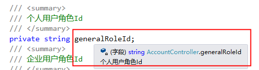

## C#的注释

一般分为两类:

1）**单行注释**。格式：// Comments   或者 ///(XML注释的一级注释)

2）**多行注释**。格式：/* Comments... */


### c#中//注释和///注释的区别

来源:https://www.cnblogs.com/liuyaozhi/p/4910221.html 


- **///**:会被编译,会减慢编译的速度（但不会影响执行速度）
- **//:**不会被编译,


- **使用///**:

- - 会在其它的人调用你的代码时提供智能感知

  - 也是一种注释，但是这种注释主要有两种作用：

  - - 1.这些注释能够生成一个XML文件。这样呢,看起来会对程序的内容一目了然。

    - 2.以这种方式对你的类，属性，方法等等加上注释之后，当你在其他地方使用以这种方式加上的类，属性，方法等等地时候，黄色的提示框里面会把你写的注释显示出来，是你更加明白你要使用的功能的作用。

    - 

      


### **XML注释(///):**

- 一级注释（Primary Tags）:可以单独存在
- 二级注释（Secondary Tags）:必须包含在一级注释内部。


####  一级注释:


```
<remarks> 对类型进行描述，功能类似<summary>，据说建议使用<remarks>;
<summary> 对共有类型的类、方法、属性或字段进行注释；
<value>主要用于属性的注释，表示属性的制的含义，可以配合<summary>使用；
<param>用于对方法的参数进行说明，格式：<param name="param_name">value </param>；
<returns>用于定义方法的返回值，对于一个方法，输入///后，会自动添加<summary>、<param>列表和<returns>；
<exception>定义可能抛出的异常，格式：<exception cref="IDNotFoundException">；
<example>用于给出如何使用某个方法、属性或者字段的使用方法；
<permission>涉及方法的访问许可；
<seealso>用于参考某个其它的东东:)，也可以通过cref设置属性；
<include>用于指示外部的XML注释；
```


```
&&案例:
/// <summary>
///定义用户姓名属性，该属性为可读可写属性
/// </summary>
```


#### 二级注释:

```
<c> or <code>主要用于加入代码段；
<para>的作用类似HTML中的<p>标记符，就是分段；
<pararef>用于引用某个参数；
<see>的作用类似<seealso>，可以指示其它的方法；
<list>用于生成一个列表；
```


另外，还可以自定义XML标签 