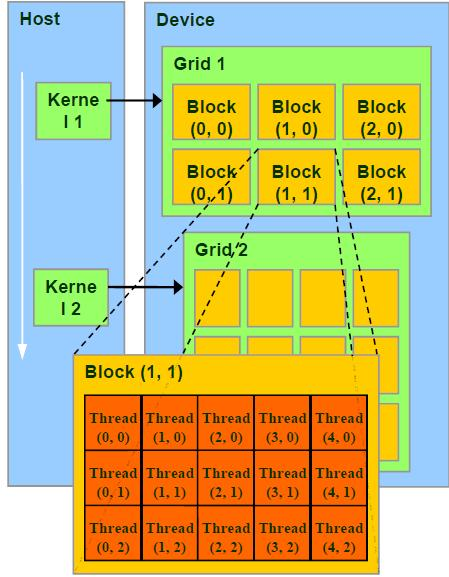
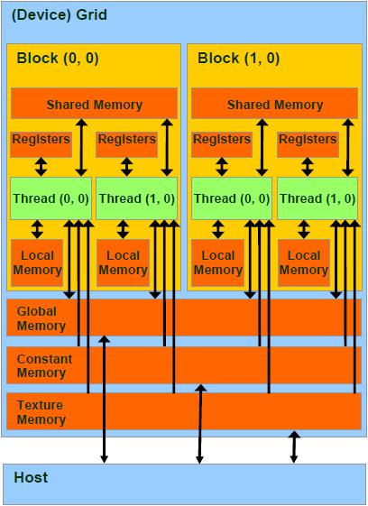

# [GPU CUDA 经典入门指南]

CUDA编程中，习惯称CPU为Host，GPU为Device。编程中最开始接触的东西恐怕是并行架构，诸如Grid、Block的区别会让人一头雾水，我所看的书上所讲述的内容比较抽象，对这些概念的内容没有细讲，于是在这里作一个整理。

Grid、Block和Thread的关系

Thread  ：并行运算的基本单位（轻量级的线程）
Block   ：由相互合作的一组线程组成。一个block中的thread可以彼此同步，快速交换数据，最多可以同时512个线程。
Grid     ：一组Block，有共享全局内存
Kernel ：在GPU上执行的程序，一个Kernel对应一个Grid。

其结构如下图所示：



[](javascript:void(0);)

```
 1 /*
 2 另外：Block和Thread都有各自的ID，记作blockIdx（1D，2D），threadIdx（1D，2D，3D）
 3 Block和Thread还有Dim，即blockDim与threadDim. 他们都有三个分量x，y，z
 4 线程同步：void __syncthreads(); 可以同步一个Block内的所有线程
 5 总结来说，每个 thread 都有自己的一份 register 和 local memory 的空间。
 6 一组thread构成一个 block，这些 thread 则共享有一份shared memory。
 7 此外，所有的 thread(包括不同 block 的 thread)都共享一份
 8 global memory、constant memory、和 texture memory。
 9 不同的 grid 则有各自的 global memory、constant memory 和 texture memory。
10 */
```

[](javascript:void(0);)



 

[](javascript:void(0);)

```
存储层次1 per-thread register                             1 cycle
2 per-thread local memory                     slow
3 per-block shared memory                   1 cycle
4 per-grid global memory                       500 cycle,not cached!!
5 constant and texture memories            500 cycle, but cached and read-only
6 分配内存：cudaMalloc，cudaFree，它们分配的是global memory
7 Hose-Device数据交换：cudaMemcpy
```

[](javascript:void(0);)

```
变量类型1 __device__   // GPU的global memory空间，grid中所有线程可访问
2 __constant__ // GPU的constant memory空间，grid中所有线程可访问
3 __shared__   // GPU上的thread block空间，block中所有线程可访问
4 local        // 位于SM内，仅本thread可访问
5 // 在编程中，可以在变量名前面加上这些前缀以区分。
```

[](javascript:void(0);)

```
数据类型1 // 内建矢量类型：
2 int1，int2，int3，int4，float1，float2， float3，float4 ...
3 // 纹理类型：
4 texture<Type, Dim, ReadMode>texRef;
5 // 内建dim3类型：定义grid和block的组织方法。例如：
6 dim3 dimGrid(2, 2);
7 dim3 dimBlock(4, 2, 2);
8 // CUDA函数CPU端调用方法
9 kernelFoo<<<dimGrid, dimBlock>>>(argument);
```

[](javascript:void(0);)

[](javascript:void(0);)

```
函数定义 1 __device__ // 执行于Device，仅能从Device调用。限制，不能用&取地址；不支持递归；不支持static variable；不支持可变长度参数
 2 __global__ // void： 执行于Device，仅能从Host调用。此类函数必须返回void
 3 __host__ // 执行于Host，仅能从Host调用，是函数的默认类型
 4 // 在执行kernel函数时，必须提供execution configuration，即<<<....>>>的部分。
 5 //   例如：
 6 __global__ void KernelFunc(...);
 7 dim3 DimGrid(100, 50); // 5000 thread blocks
 8 dim3 DimBlock(4, 8, 8); // 256 threads per block
 9 size_t SharedMemBytes = 64; // 64 bytes of shared memory
10 KernelFunc<<< DimGrid, DimBlock, SharedMemBytes >>>(...);
```

[](javascript:void(0);)

 

```
数学函数1 CUDA包含一些数学函数，如sin，pow等。每一个函数包含有两个版本，
2 例如正弦函数sin，一个普通版本sin，另一个不精确但速度极快的__sin版本。
内置变量1 /*
2 gridDim, blockIdx, blockDim, 
3 threadIdx, wrapsize. 
4 这些内置变量不允许赋值的
5 */
```

[](javascript:void(0);)

```
编写程序1 /*
2 目前CUDA仅能良好的支持C，在编写含有CUDA代码的程序时，
3 首先要导入头文件cuda_runtime_api.h。文件名后缀为.cu，使用nvcc编译器编译。
4 目前最新的CUDA版本为5.0，可以在官方网站下载最新的工具包，网址为：
5 https://developer.nvidia.com/cuda-downloads
6 该工具包内包含了ToolKit、样例等，安装起来比原先的版本也方便了很多。
7 */
```

[](javascript:void(0);)

[](javascript:void(0);)

```
 相关扩展 1 1 GPU硬件
 2 // i GPU一个最小单元称为Streaming Processor(SP)，全流水线单事件无序微处理器，
 3 包含两个ALU和一个FPU，多组寄存器文件（register file，很多寄存器的组合），
 4 这个SP没有cache。事实上，现代GPU就是一组SP的array，即SPA。
 5 每一个SP执行一个thread
 6  
 7 // ii 多个SP组成Streaming Multiprocessor(SM)。
 8 每一个SM执行一个block。每个SM包含8个SP；
 9 2个special function unit(SFU)：
10 这里面有4个FPU可以进行超越函数和插值计算
11 MultiThreading Issue Unit：分发线程指令
12 具有指令和常量缓存。
13 包含shared memory 
14  
15 // iii Texture Processor Cluster(TPC) ：包含某些其他单元的一组SM 
16  
17 2 Single-Program Multiple-Data （SPMD）模型  
18  
19 // i CPU以顺序结构执行代码，
20 GPU以threads blocks组织并发执行的代码，即无数个threads同时执行
21  
22 // ii 回顾一下CUDA的概念：
23 一个kernel程序执行在一个grid of threads blocks之中
24 一个threads block是一批相互合作的threads：
25 可以用过__syncthreads同步；
26 通过shared memory共享变量，不同block的不能同步。
27  
28 // iii Threads block声明：
29 可以包含有1到512个并发线程，具有唯一的blockID，可以是1,2,3D
30 同一个block中的线程执行同一个程序，不同的操作数，可以同步，每个线程具有唯一的ID 
31  
32 3 线程硬件原理
33  
34 // i GPU通过Global block scheduler来调度block，
35 根据硬件架构分配block到某一个SM。
36 每个SM最多分配8个block，每个SM最多可接受768个thread
37 （可以是一个block包含512个thread，
38 也可以是3个block每个包含256个thread（3*256=768！））。
39 同一个SM上面的block的尺寸必须相同。每个线程的调度与ID由该SM管理。
40  
41 // ii SM满负载工作效率最高！考虑某个Block，其尺寸可以为8*8,16*16,32*32
42 8*8：每个block有64个线程，
43 由于每个SM最多处理768个线程，因此需要768/64=12个block。
44 但是由于SM最多8个block，因此一个SM实际执行的线程为8*64=512个线程。
45 16*16：每个block有256个线程，SM可以同时接受三个block，3*256=768，满负载
46 32*32：每个block有1024个线程，SM无法处理！ 
47  
48 // iii Block是独立执行的，每个Block内的threads是可协同的。
49  
50 // iv 每个线程由SM中的一个SP执行。
51 当然，由于SM中仅有8个SP，768个线程是以warp为单位执行的，
52 每个warp包含32个线程，这是基于线程指令的流水线特性完成的。
53 Warp是SM基本调度单位，实际上，一个Warp是一个32路SIMD指令
54 。基本单位是half-warp。
55 如，SM满负载工作有768个线程，则共有768/32=24个warp
56 ，每一瞬时，只有一组warp在SM中执行。
57 Warp全部线程是执行同一个指令，
58 每个指令需要4个clock cycle，通过复杂的机制执行。
59  
60 // v 一个thread的一生：
61 Grid在GPU上启动；
62 block被分配到SM上；
63 SM把线程组织为warp；
64 SM调度执行warp；
65 执行结束后释放资源；
66 block继续被分配....
67  
68 4 线程存储模型
69  
70 // i Register and local memory：线程私有，对程序员透明。
71 每个SM中有8192个register，分配给某些block，
72 block内部的thread只能使用分配的寄存器。
73 线程数多，每个线程使用的寄存器就少了。
74  
75 // ii shared memory：block内共享，动态分配。
76 如__shared__ float region[N]。
77 shared memory 存储器是被划分为16个小单元，
78 与half-warp长度相同，称为bank，每个bank可以提供自己的地址服务。
79 连续的32位word映射到连续的bank。
80 对同一bank的同时访问称为bank conflict。
81 尽量减少这种情形。 
82  
83 // iii Global memory：没有缓存！容易称为性能瓶颈，是优化的关键！
84 一个half-warp里面的16个线程对global memory的访问可以被coalesce成整块内存的访问，如果：
85 数据长度为4,8或16bytes；地址连续；起始地址对齐；第N个线程访问第N个数据。
86 Coalesce可以大大提升性能。
87  
88 // uncoalesced 
89 Coalesced方法：如果所有线程读取同一地址，
90 不妨使用constant memory；
91 如果为不规则读取可以使用texture内存
92 如果使用了某种结构体，其大小不是4 8 16的倍数，
93 可以通过__align(X)强制对齐，X=4 8 16
```

[](javascript:void(0);)

 

 example：//想象为二维数组

int row = blockIdx.y * blockDim.y + threadIdx.y; //thread 所在的行

int col = blockIdx.x * blockDim.x + threadIdx.x; //thread 所在的列

blockDim是指每个block的size，blockDim.y 相当于block的height，blockDim.x相当于block的width。

blockIdx.y是指block在grid中竖排的位置，同理，blockIdx.x是指block在grid中横排的位置。