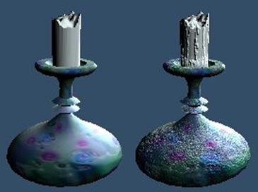
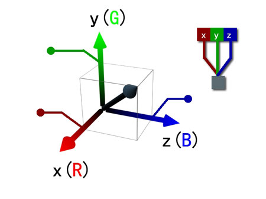
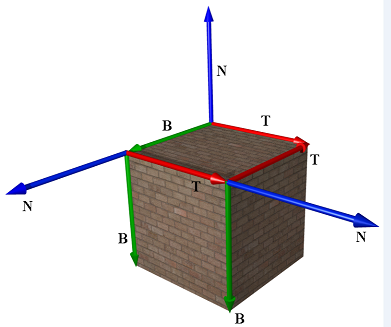
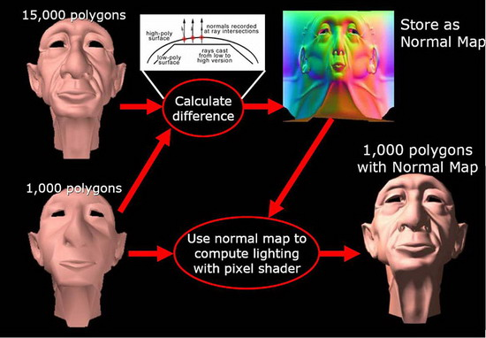
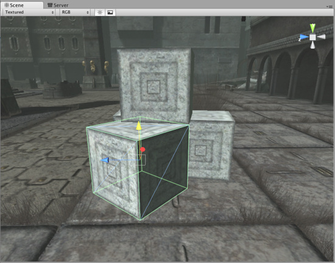
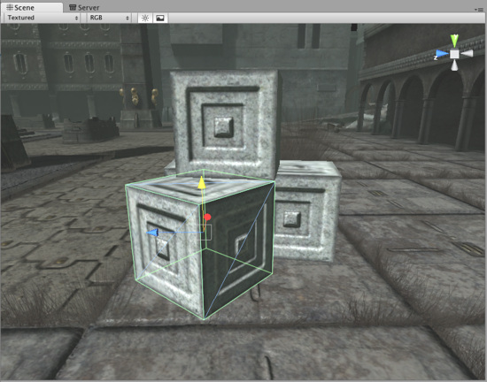

**1、法线贴图基本概念**

　　在制作3D游戏时，常常遇到这样一个问题：一个平面，这个平面在现实中并不是一  个“平”面，例如砖墙的表面带有石质浮雕等等。这种情况下如果只是简单的做一个平面，则让人感觉严重失真，如图1所示；而如果用很密集的三角形去表示这类略有凹凸的表面，则性能上大大下降。研究人员发现，人眼对物体的凹凸感觉，很大程度上取决于表面的光照明暗变化，如果能通过一张贴图在一个平面上表现出由凹凸造成的明暗变化，则可以让人眼感觉这个平面是凹凸不平的（虽然这个平面还是平的）。法线贴图正是为了这个目的而产生的。

图1 不同细节程度的蜡烛

　　准确的说，法线贴图是Bump Mapping（凹凸贴图）的其中一种。第一个Bump  Mapping由Blinn在1978年提出，目的是以低代价给予计算机几何体以更丰富的表面信息。30年来，这项技术不断延展，尤其是计算机图形学成熟以后，相继出现了不少算法变体，法线贴图就是其中很重要的一种。研究人员对法线贴图进一步改进，出现了Parallax Mapping（视差贴图）, Relief Mapping等技术，实现了更逼真的效果。本文仅针对法线贴图进行介绍。

　　一条法线是一个三维向量，一个三维向量由x, y, z等3个分量组成，在法线贴图中，把(x, y, z)当作RGB3个颜色的值存储（如图2），并将其每个分量映射到[-1, 1]。例如，对于x, y, z各有8位的纹理，[0， 128， 255]表示法向量(-1, 0, 1)。

图2 利用彩色通道存储法线贴图

**2、切线空间**

　　法线贴图中存储的法线最初是定义在世界空间中，但在实际中，这种方式很少见，因为只要物体移动，法线贴图则不再有效。另一种方式就是将法线存储在物体的局部空间中，物体可以进行刚体变换（平移，旋转，缩放），法线贴图依旧有效，但是这种方法并不能应对任何方式的变换，并且法线贴图不能在不同物体进行复用，增加了美工的负担。所以，现在现在普遍采用的解决方案是将法线存储在切线空间中。

　　简单的来说，切线空间可以理解为纹理空间的u，v方向和法向量n，这3个方向构成了切线空间，一般使用T、B和N表示，如图3所示。具体解释见http://blog.csdn.net/bonchoix/article/details/8619624，这个博客解释的很好，没见过的童鞋可以看一看，第一次理解可能会有点困难。

图3 切线空间

**3、法线贴图的使用**

　　法线贴图的制作过程如图4所示，通过对比高模和低模的差异，生成法线贴图，在运行时使用法线贴图+低模即可表现出接近高模的效果，但是大大降低了显卡的负担。计算法线贴图的算法在3ds Max中已实现，美术人员只需针对同一个模型制作一个高模和一个低模，烘焙出一张法线贴图，在游戏中使用低模+法线贴图即可。

图4 法线贴图制作过程

　　在渲染模型表面的时候，需保证光照方向和法线是处在同一坐标空间。光照方向在世界空间中，而法线在切线空间，将他们变换到同一坐标空间无非两种方法：

　　1、将光照方向变换到切线空间；

　　2、将法线变换到世界空间。

　　在大部分情况下，使用第一种方案会比较好，因为只需针对每个顶点进行变换，然后在三角形中对变换后的光照方向进行插值；而使用第二种方案，则需要对每个像素进行变换。显然，在光源较少的情况下，使用第一种方案可以减少计算量。当然，在光源数量较多的情况下，到底使用那种方案，需要值得考虑，因为使用第二种方案只需要变换一次法线，而第一种方案需要有多个光照方向需要变换。

　　值得注意的是，第一种方案中的插值对于点光源来说存在一个近似，光照方向在一个三角形上变化的很慢，所以可以进行插值，不过对于方向光则没有这个问题。

**4、法线贴图效果**

　　法线贴图+低模可以表现出接近高模的效果，在图4中可以看到，加上法线贴图的低模，效果很接近高模；图5为unity3d中法线贴图的示例，左图（没有法线贴图）和右图（有加入法线贴图）相比，明显右图的立体感更强。

　　

图5 unity3d中法线贴图的示例。左图中的方块没有法线贴图，右图加入了法线贴图

**5、法线贴图的压缩和mipmap**

　　归一化的法线长度为1，且在切线空间下，法线的z分量不可能为负数，所以只需要存储x和y值即可。当然，仅仅是这种简单的压缩是不够的，但是传统的纹理压缩方法如DXTC等，不能直接对法线贴图使用，需要进行一定的变化，具体方法将在下一篇博客《3D游戏常用技巧Normal Mapping (法线贴图)原理解析——高级篇》进行详细描述。

　　使用传统mipmap方法生成的法线贴图对于漫反射表面基本没问题，但是在镜面表面会导致严重的视觉问题。对于漫反射表面来说，光照的计算公式为**l**·**n**，**l**为光线方向的相反方向，**n**为法线，**l**·**n1** + **l**·**n2** + **l**·**n3** + **l**·**n4** = **l**·(**n1** + **n2** + **n3** + **n4**) / 4，而mipmap则是事先计算(**n1** + **n2** + **n3** + **n4**) / 4，所以对于漫反射表面，对法线贴图使用传统方式的mipmap基本没问题。为什么是基本没问题而不是完全没问题呢？因为这里存在一个近似，若**l**·**n** < 0，则光照值为0（光照不能为负），若将这个因素考虑进去，漫反射表面也会有问题，不过在实际当中这种情况表现不明显，所以可以认为基本没问题。

　　对于镜面表面来说，当视线偏离反射光线方向的时候，光照强度会急剧下降，反映在公式中是因为其含有cosm(**h**·**n**)项（具体公式可以Google），而漫反射光照是线性变化，所以对于镜面表面，不能使用传统方法生成法线贴图的mipmap，需要用特殊的技术手段进行处理，具体方法见下一篇博客“[3D游戏常用技巧Normal Mapping (法线贴图)原理解析——高级篇](http://www.cnblogs.com/wangchengfeng/p/3475489.html)”。**
**

