# Unity手游开发札记——基于通道混合的角色染色系统实现

有几个月的时间没有更新技术博客了，数了数距离去年写下的2018的博客目标还差一些，于是花一些时间来补一补。

这次想聊一聊关于角色的染色系统。简单做了一下搜索，网络上聊角色染色实现的文章很少，相关的讨论也不多。想来主要是因为这块技术虽然在很多项目都有用到，但太过于简单直白，没太多高深的技术含量。不过在笔者经历的几个项目中，都有针对于染色功能的实现，要想做一套兼顾效果和效率的染色系统，还是有不少细节可以讨论的。

## **1. 染色系统的作用和应用**

染色系统的作用非常明了——它可以在时装系统的基础上为玩家提供更加**个性化、多样化**的角色体验，而相比于时装系统，**制作成本更低**，甚至很多游戏开放给玩家进行参数调整。染色系统也是很多`绿色游戏`收入的重要来源之一。

具有染色系统的游戏有很多，从《刺客信条》这样的3A主机游戏到《梦幻西游》这样的2D手机游戏，都提供了或复杂或简单的染色系统，更不用说《奇迹暖暖》这样靠换装吃饭以及I社的各种“著名”游戏……

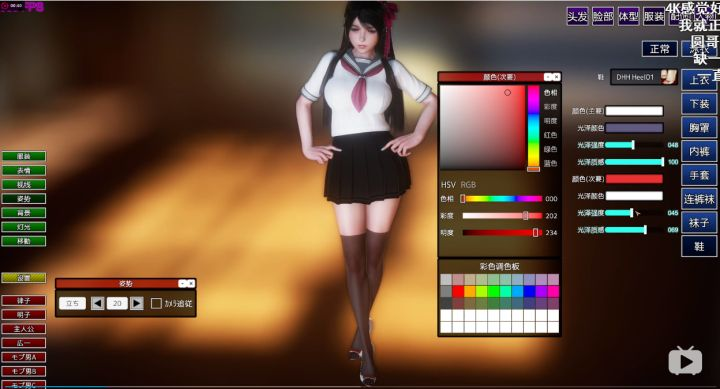b站的推荐算法做得不错，沿着这张图片的视频推荐我看了半小时的b站……

之前就说过，日本人总喜欢把技术用在**奇怪的地方**。I社的《PlayHome》（好同学不要搜索）中不光可以改变颜色，还有各种光泽度的调整，简直开放了材质球的大半参数的感觉……

好，言归正传，我们还是来看一些国内的正常游戏的染色系统吧。《楚留香》9月份开放了染色系统，看下官方宣传图中像霓虹灯一样随着呼吸变色的小姐姐：

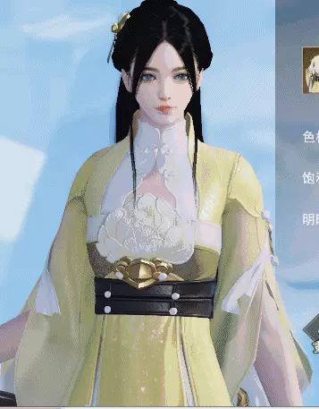


《楚留香》9月版本更新的染色系统

《楚留香》的染色系统开放了色相、饱和度以及明暗的参数供玩家自由调整，颜色变化的自由度非常高，但是染色的范围是预先定义好的，这样也方便处理一些不太想让玩家进行染色的地方。

既然本文的主题是基于通道混合算法的染色系统实现，笔者就截取了一些之前在网易时做的端游《无尽战区》的染色效果截图。在这些截图中，左侧第一张图是美术制作的原始贴图颜色，其他的截图即美术通过通道混合算法调整出来的染色效果。

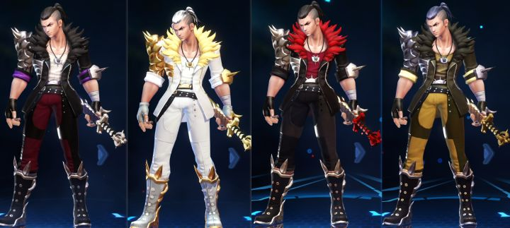《无尽战区》染色效果截图1

可以看到整个角色可以进行染色的区域非常多，颜色变化的范围也比较大，比如黑色的衣领可以染成金色或者红色。

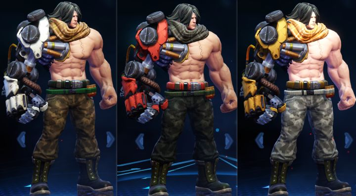《无尽战区》染色效果截图2

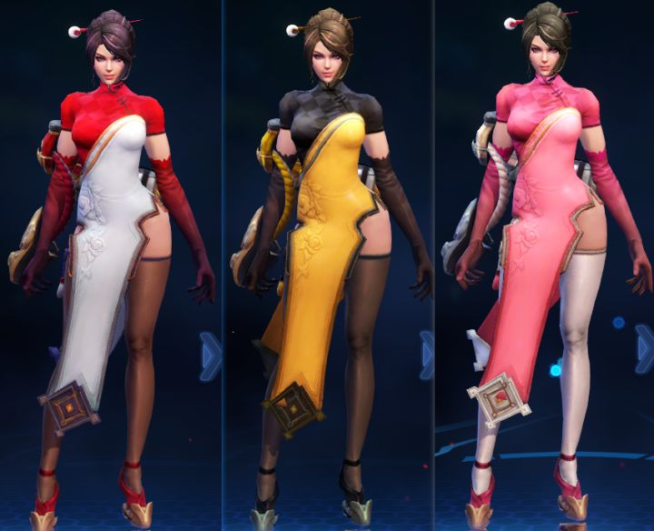《无尽战区》染色效果截图3

无论是兄贵哥哥还是旗袍小姐姐，染色之后的衣服细节都得到了较好的保留。

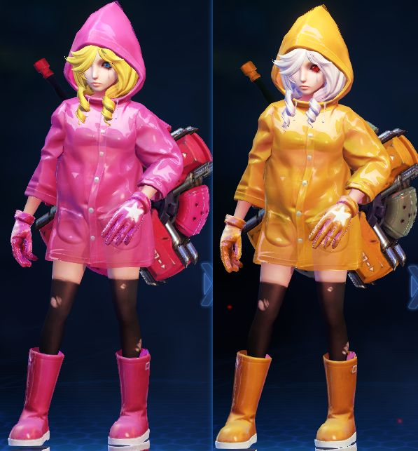《无尽战区》染色效果截图4

《无尽战区》是一款3D格斗MOBA端游，为了保证染色效果，没有选择对玩家开放任意染色的功能，而是给玩家提供由美术配置好的染色剂效果。在后来的《巴清传》手游项目中，也采用了类似的染色方案：

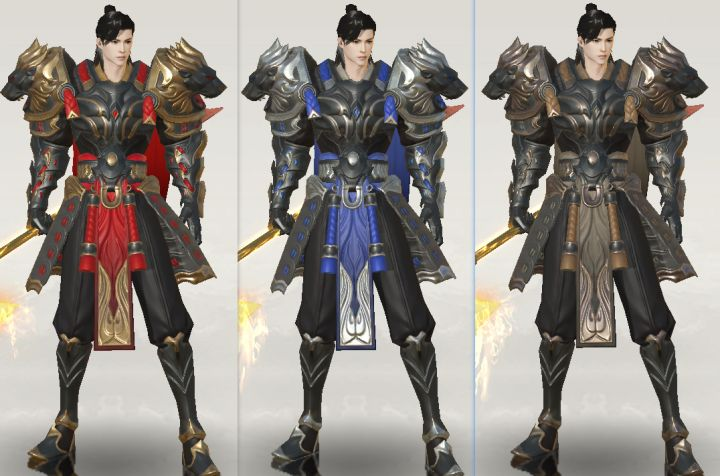《巴清传》手游的染色效果截图1

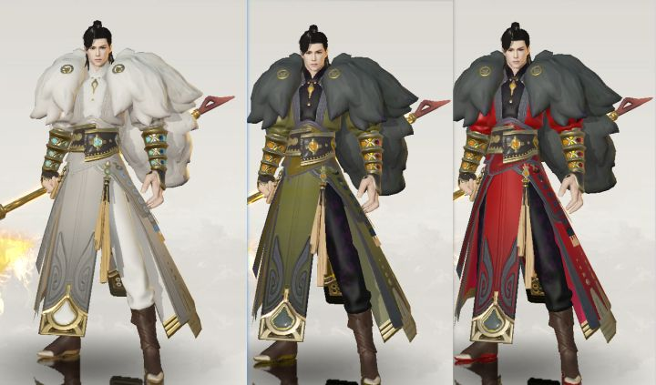《巴清传》手游的染色效果截图1

当然，还有很多游戏有很厉害的染色效果，这里不再一一赘述，有兴趣的朋友可以自己搜索或者玩游戏来看。总之，染色系统已经成为很多游戏的标配，而实现的方法以及提供给玩家的灵活度也各不相同。

## **2. 常见的染色系统实现方式**

这一部分我们来聊一聊一些常见的染色系统实现方式。

染色的目的很简单，抛开分块等需求，它的**目标就是将一种颜色根据参数经过一个算法的计算变换成另外一种颜色**。为了方便形式化地说明，我们定义原始颜色为BaseColor，染色之后的颜色为DyeColor，染色算法就是一个函数f:

> DyeColor = f(BaseColor, params)

对于函数f的输入来说，除了BaseColor之外，还有一些供美术或者玩家调整的参数，做得极端一些甚至可以提供多种函数f供玩家自主选择，当然通常这种极端的做法没有必要。我们首先来讨论一种最为简单粗暴的变色方式。

## 2.1 直接的颜色替换

既然染色是要把一种颜色变为另外一种颜色，那么最简单直白的方式就是直接将所有的原始颜色都替换成目标颜色。

> DyeColor = TargetColor

在一些很老的游戏中，可能有这样进行染色的方式，但这种方式仅仅适用于那些整个画面效果都是完整大色块的游戏。而现实项目中，我们的贴图中一块区域即便是一种色调，也会有细节的差异，单纯的颜色替换就把原来的细节抹掉了。比如常见的会在衣物的贴图上绘制褶皱，这些褶皱很难用mask来标注，因为是用渐变的方式来制作，直接的颜色替换就把褶皱抹平了。

《巴清传》手游中一张角色身体的贴图

从上面举例的贴图中可以看出，中间白色的衣领区域是有褶皱的，右下角部分的红色区域也有衣服的褶皱被绘制在贴图上。即便是大范围的红色区域，也有明暗的变化。

> 当然，你可以说这种贴图的制作方式不够好，把AO混在了颜色贴图里，但很多时候我们出于性能等其他考量，的确还会保留一些“不正确”的制作方法。

更加二次元的角色效果可能可以使用这种方式，比如《崩坏3》的贴图：

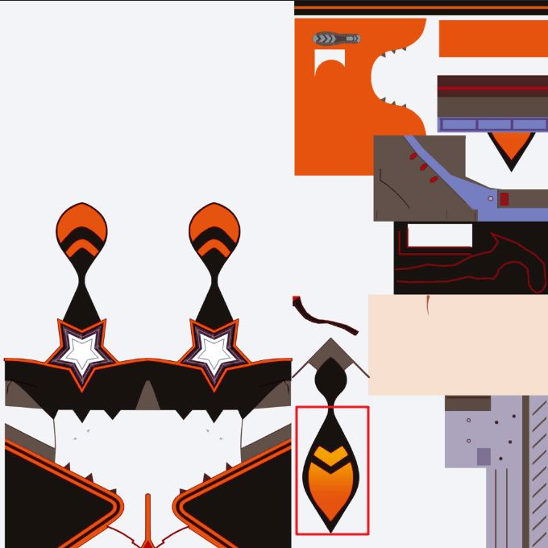《崩坏3》的角色贴图

我们可以看出，《崩坏3》的这种贴图中的颜色比较少地使用渐变，而是大块的相同颜色，这种情况下直接使用颜色的替换可能是一种可行的染色方案。不过红框也标注出了部分使用渐变的区域。

因此，在更偏写实的项目中，如何更好的处理渐变以及褶皱这样描绘在贴图上的细节，会是我们对比各种染色算法的重要指标。

## 2.2 基于查表的颜色替换

简单暴力的颜色替换不够好用，那么就会有相应的改进方案产生，查表就是其中一种思路。Color Lookup  Table是一种非常常用的变色手段，它使用表格的方式提供了从一种颜色映射到另外一种颜色的定义方式，常见的应用场景是在后处理里对渲染结果做Color Grading。在一些2D游戏中，这也是一种对于角色和特效实施变色的方法：

> DyeColor = LookupTable(BaseColor.r, BaseColor.g, BaseColor.b)

与用在滤镜以及后处理中的使用方式相似，在角色染色过程中，查表的方式也就是根据基础颜色的rgb值作为三维坐标的值，检索出其要变色后对应的颜色值。一个标准的3D Lookup Tabke如下图所示：

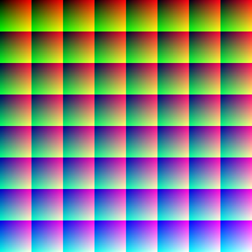3D Lookup Table示例

这种染色方式的优点有：

1. 可定制性强，在颜色的RGB空间中可以定义任意（当然由于要存成图，所以未必是连续的）颜色之间的映射关系，可以做到非常细致。
2. 对于分区有原生的支持。这里还没有讨论到分区的部分，但是在一个角色不同染色分区没有颜色相似的前提下，对于一个角色使用一张Color Lookup Table图就可以处理很多分区的染色需求。
3. 性能影响相对较小，只有rgb转换到uv空间的计算过程和一次贴图采样的消耗。

缺点也有不少：

1. 每种染色都要新制作一张Color Lookup Table，有较多的资源消耗，当然理论上不同角色之间相似的染色可以尝试复用Color Lookup Table，但是效果可能不够理想。
2. Color Lookup Table的尺寸和染色精细度需要权衡和取舍，两者不好兼得。
3. 几乎没有玩家自己定制的可能性。这种方式需要提前定制好Color Lookup Table，因此基本上只能提供给玩家定制好的染色效果。

这种染色实现方式理论上也可以用于3D游戏，但是在实际项目应用的情景的确比较少，原因就是其实我们大部分情况下都有更好的选择。

## 2.3 基于颜色叠加的染色方式

相比于颜色替换，基于原始颜色进行一些计算从而获得新的颜色效果是一种更加通用的计算方式。我们首先讨论一种非常简单的计算方式——颜色叠加。颜色叠加的方式有多种，比如直接的相加，而更为常用的是**乘法**。在特效制作中就大量使用了这种变色方式。

> DyeColor = BaseColor * TintColor

Unity提供的Standard材质球中就提供了这样的效果，实现就是在Shader代码中对采样出来的贴图颜色进行一次乘法。

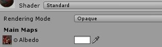Standard材质球中的Tint Color

这种方式的优点就是简单、高效。只需要一个乘法的代价，就可以实现基本的染色效果。缺点也相应地比较明显：由于采用的是乘法，因此颜色亮度上肯定是小于等于原始颜色的亮度的，对于同一个区域内原始颜色变化较大的情况无法调整出好的效果。

所以，这种染色效果通常应用在一些简单的2D游戏或者cel shading这种大色块的3D渲染方式下，对于细节较多的写实3D游戏并不太适用。

当然基于这种简单的算法也有一些制作上的改进可以让它表现得更好：

1. 颜色值使用hdr，允许超过1的值，这样来解决颜色只能变暗的问题；
2. 制作中，原始贴图的颜色采用灰度的方式，只保留明暗对比，所有的颜色都通过染色来做，这样可以剥离之前原始贴图颜色对于最终染色效果的影响。

总之，这是一种非常基础的染色方式，有用，但是真正在项目中的适用范围并不广泛。

## 2.4 基于HSV/HSL的染色方式

这几乎是目前最为主流的染色方法了，HSV分别是色相（Hue），饱和度（Saturation），明度（Value）。HSL中的L是亮度（Lightness），原理类似，这里只用HSV来进行讨论。这是RGB颜色模型之外的一种色彩空间描述方式，其他的色彩空间描述方式还有印刷四分色模式（CMYK）等等。《楚留香》也是直接给玩家开放了这三个选项供玩家调节。

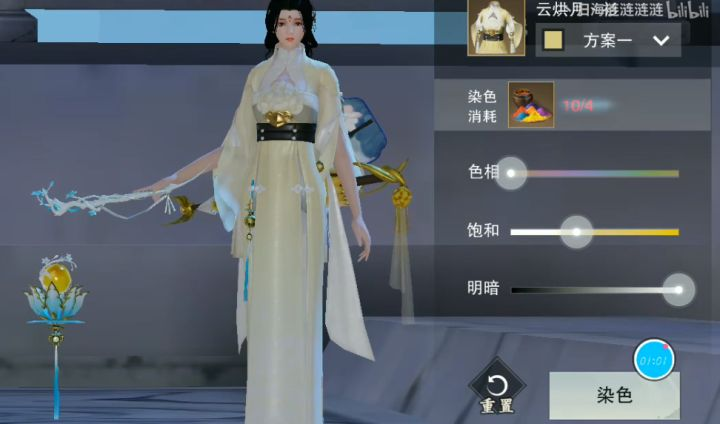《楚留香》中的染色系统

> RGB 和 CMYK 分别是加法原色和减法原色模型，以原色组合的方式定义颜色，而 HSV 以人类更熟悉的方式封装了关于颜色的信息：“这是什么颜色？深浅如何？明暗如何？”。

就像引用中对于HSV色彩空间的描述一样，色相表示了颜色，饱和度表示了颜色的深浅，明度表现了颜色的明暗，这些概念对于人眼来说有更加直接的对应关系。比如玩家想要改变颜色，那就直接拖动色相的条就可以直观地看到颜色的变化。计算过程大致可以描述如下：

> DyeColor = HSV2RGB (RGB2HSV(BaseColor) + HSVOffset)

首先每一个RGB描述的颜色和HSV描述的颜色值之间都可以互相转换，转换公式这里只贴一下，更加详细的转换过程大家可以自行搜索，有很多文章讲这个过程。

RGB2HSV的计算公式：

设 (r,g,b) 分别是一个颜色的红、绿和蓝坐标，它们的值是在 0 到 1 之间的实数。设max等价于r,g和b中的最大者。设min等于这些值中的最小者。要找到在 HSV空间中的 (h,s,v) 值，这里的*h*∈ [0, 360）是角度的色相角，而s,v∈ [0,1] 是饱和度和明度：

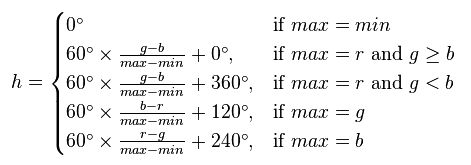

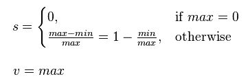

类似地，HSV2RGB的计算公式：

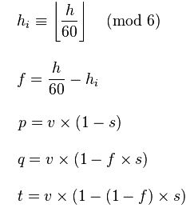

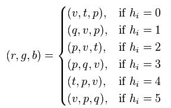

HSVOffset是一个三元组，即美术或者玩家针对色相、饱和度和明度调整的偏移值。所以当你去玩《楚留香》的染色系统，在打开一套时装的染色效果的时候，HSV的值并不在中央位置，而是根据设定的颜色计算好的HSV值。

基于HSV颜色空间的染色是如此地常用，它的优势在前面也有提到：

1. 染色过程无论对于美术还是玩家，都较为友好，容易理解。
2. 在大部分情况下，可以染色的范围很广，几乎覆盖所有颜色区间。
3. 将最常用的颜色调整和亮度、饱和度分离，实现调整颜色的时候保持亮度和饱和度变化不大，这对于染色的稳定性比较友好。
4. 可以做到同一块染色区域内进行染色，保留褶皱这样的细节。

当然它也有一些缺点：

1. 计算量相对较大，需要RGB和HSV之间的互相转换，转换过程虽然可以优化，但是如果在GPU上做计算还是有一些消耗的。
2. 如果原始颜色是黑色或者白色，则单纯色相的调整无法改变颜色，需要借助饱和度和明度来进行调整，虽然有些麻烦，但是依然可以得到任何颜色【此处感谢燃野的提醒，之前认为黑色和白色很难调整成其他颜色，因为在Photoshop里没有勾选“着色”选项】。
3. 某些情况下，HSV的调整会让**冷暖关系**发生变化。这是当时在网易的时候，一个非常资深的原画专家在和我讨论《无尽战区》中染色效果的实现的时候说的，当时给我举了一些例子，时间有点久远，具体的细节忘记了。这个问题如果你们团队的美术没有反馈的话，也可以无视它的存在。

HSV颜色空间的染色方式是很多游戏中常用的染色方法，同时也是美术制作贴图时在Photoshop里常用的色彩调整方式。

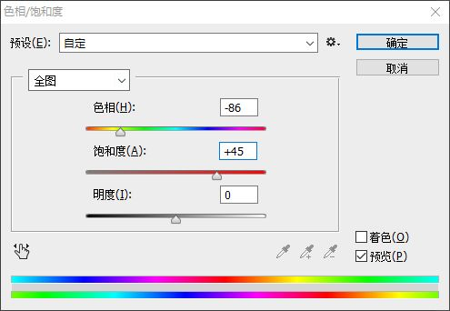Photoshop里的色相/饱和度调整界面

## 2.5 基于通道混合算法的染色

在制作《无尽战区》的染色系统的时候，我们的美术不满足于HSV的染色效果，也不能够接受HSV在某些情况下让冷暖关系发生改变的情况。

“我们在调整贴图的颜色的时候，还经常使用的一种调色方法是用Photoshop里的**通道混合器**。”原画专家提出了一个替代方案。

Photoshop里的通道混合器

关于通道混合器的使用以及基本原理这里不再赘述，网络上有很多文章进行讲解，随便贴一个知乎链接：[怎样理解「通道混合器」？](https://www.zhihu.com/question/24554517)

简单来说，在我的理解里，通道混合算法基于RGB的颜色叠加的方式进行调整，通过原始颜色的通道作为选区和调整基准值。

我们直接来看通道混合算法的计算过程：

> DyeColor.r = BaseColor.r * ParamsR.r + BaseColor.g * ParamsR.g + BaseColor.b * ParamsR.b + ParamsR.const
> DyeColor.g = BaseColor.r * ParamsG.r + BaseColor.g * ParamsG.g + BaseColor.b * ParamsG.b + ParamsG.const
> DyeColor.b = BaseColor.r * ParamsB.r + BaseColor.g * ParamsB.g + BaseColor.b * ParamsB.b + ParamsB.const

这里写得比较复杂，但只是把向量计算拆开了而已。选取r通道的计算过程来进行一下说明。首先输入参数Params拆分成了ParamsR、ParamsG、ParamsB三个向量，分别描述对应结果的RGB三个通道的调整参数，他们的取值范围是[-2.0, 2.0]，在Photoshop里体现为一个百分比。具体来说：

- ParamsR.r的值表示对于原本红色通道上添加或者减少红色的比例，默认值是100；
- ParamsR.g则是对于原本绿色通道上添加或者减少红色的比例，默认值是0；
- ParamsR.b则是对于原本蓝色通道上添加或者减少红色的比例，默认值是0；
- ParamsR.const是对于红色调整的一个常量值，通常用于处理原本颜色是黑色或者接近黑色的情况。

以此类推ParamsG和ParamsB向量的含义，这样通过12个参数就可以将任意颜色按照不同通道的颜色选区进行调整，从而得到任意的其他颜色值。

基于通道混合算法的染色系统的优势有：

1. 可以染色的范围广泛，在添加了const值之后，理论上没有什么颜色是无法染到的。
2. 解决了HSV染色之后中明暗/冷暖关系改变的问题。
3. 基于矩阵做运算的话，效率比HSV要高一些。

它需要面临的问题也有不少：

1. 染色过程不够直观，有不少美术一开始没办法理解这个计算过程，需要一定的讲解和上手过程；
2. 参数比较多，运行的时候如果在Shader中做计算的话，需要传递给Shader的参数会比较多；
3. 由于染色效果不直观、参数也比较多，无法直接开放给玩家来进行自定义的染色。

除了在《无尽战区》中使用了通道混合的染色方法之外，在《巴清传》手游项目中也使用了这一染色方法。

## 2.6 其他染色算法

除了前面提到的这几种之外，还有一些其他的染色方式，比如定义一些转换曲线等，还有就是针对特殊效果需求的染色，比如冰冻效果、石化效果，这些不属于通用的染色系统的功能范围就不在本文进行讨论。

## **3. 染色系统的实现**

聊了这么多，我们只描述了将一种颜色变换为另外一种颜色的染色方法，而这个过程只是染色系统在工程应用中的一个核心部分，除此之外还需要其他几个模块的支持才能够实现一个完整的染色系统。

## 3.1 染色区域定义

在染色系统中，通常不会针对于一整张贴图应用同一个参数的染色，而是要将贴图区分为多个区域，比如皮肤、头发、上衣等等，进行分别的染色，每个区域的染色参数会有所不同。

我们有很多方式来标定一些区域，比如颜色范围、如多边形、Photoshop里的魔棒选区等等，但是在游戏中最为常用的还是一张Mask贴图。

利用Mask贴图划定染色区域的最为简单的方法就是每个通道表示一个区域，加上Alpha通道之后，一张Mask贴图可以表示四个区域。比如为数不多聊染色系统实现的一篇文章——[Unity中实现染色效果](https://zhuanlan.zhihu.com/p/49447996)中就是使用了BaseText的RGB通道作为区域定义，然后它还加上了uv区间，将最多支持的区域个数扩展到了5个。

这可以满足大部分的贴图的染色需求，毕竟通常头发和身体会分开mesh制作，贴图也大都不合用，但是uv的偏移对于美术制作Mesh有额外的需求，个人觉得不够理想，而抛开uv之后，最多四个区域对于身体这样的部件的染色区域支持又略有不足，因此我们采用了**二进制**的思路来做染色区域的定义，即将RGB区分为0和1，作为二进制描述8个区域，这样就基本够用了。

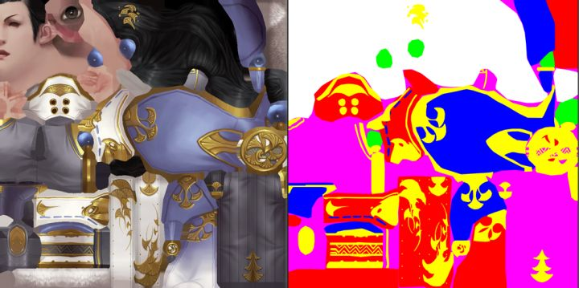角色的染色Mask贴图示例

上图给出了一张我们角色染色用的Mask贴图，其中标定了6个区域：黄色、红色、绿色、洋红、蓝色、白色。我们也有一些贴图使用了8中颜色……当然，基于这个思路，如果你们项目需要更多通道，只需要再把alpha通道利用起来，就有16个区域可以使用了，大部分手游都不需要这么多的染色区域。

> 值得注意的是，如果使用了alpha通道的话，美术在染色时对照mask贴图进行区域判断的时候，是**非常不直观**的。

在CPU中将颜色映射为区域编号非常简单，如果要在shader中处理区域也不算麻烦，不过需要一些step和乘法操作：

```c
half bias = 0.1f;
half4 mask = tex2D(_RecolorMask, uv);
int maskIndex = (int)(step(bias, mask.r)
	+ step(bias, mask.g) * 2
	+ step(bias, mask.b) * 4);
```

注意这里代码中使用bias作为阈值来处理边界情况，在Mask贴图制作时要注意提醒美术注意**边界区域的完整程度**，尤其是多个颜色区域交叠的部分，会出现叠加出意料之外颜色的情况，最好让其明确属于一个区域，而非默认混合出来的颜色。

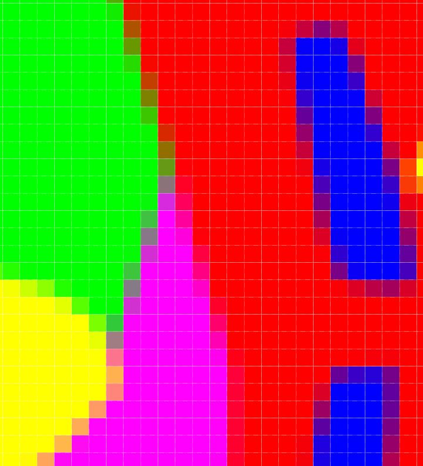注意Mask贴图中区域边界的颜色处理

## 3.2 CPU计算 or GPU计算

染色过程整体来说还是一个计算很大的过程，因为要对贴图做逐像素的处理。这里有几种选择：

\1. **完全在CPU计算**。在《无尽战区》端游的开发过程中，我们选择了完全在CPU计算染色过程的方式，一方面PC机器的CPU性能足够好，使用后台线程来做计算也没有特别大压力，另外一方面可以在CPU做一些GPU不方便做的事情，比如特殊的多边形区域定义等等，另外参数也非常方便传递，没有什么特殊的限制。由于《无尽战区》是一个MOBA，因此对于进入战斗之后的染色需求在CPU处理之后，直接生成对应的贴图存储在内存，对于GPU的渲染过程没有任何额外压力，这也是当时选择在CPU计算的另外一个原因。

\2. **利用GPU进行RenderTexture的计算**，这里推荐一个Unity的插件：[Texture Adjustments](https://link.zhihu.com/?target=https%3A//assetstore.unity.com/packages/tools/level-design/texture-adjustments-37732)。

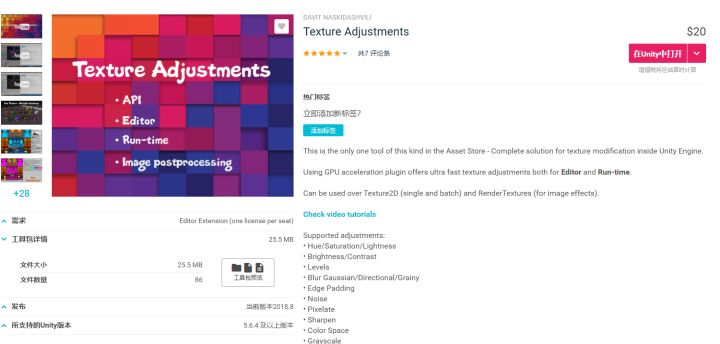Texture Adjustments插件

这个插件功能非常强大，提供了各种染色效果：

- Hue/Saturation/Lightness
- Brightness/Contrast
- Levels
- Blur Gaussian/Directional/Grainy
- Edge Padding
- Noise
- Pixelate
- Sharpen
- Color Space
- Grayscale
- Threshold
- LUT
- Color Overlay
- Color Replace
- Watermark
- Gradient Ramp
- Channel Import/Swap/Invert
- Image Flip/Tilling/Offset/Rotate
- Crop by Alpha, Color and Custom Rect
- Split (by grid)
- Gradient generator (Linear, Radial, Diamond, Angle)

它最大的特点就是使用**GPU来加速染色过程**，根据参数生成一张RenderTexture供后续使用。

\3. 更为常见的做法是**在Shader中进行计算**，这种做法的好处是可以减少内存的占用，代价就是GPU一直有染色的计算过程，而且是针对需要染色的角色逐像素进行的。

这几种不同的染色计算方式有各自的应用场景，比如前面所说的MOBA游戏，可以采用GPU计算成RenderTexture的方式来提升渲染效率；但是对于大型的MMO来说，当提供给玩家的染色方案非常多的时候，如果使用这种方式则可能会面临较大的内存压力。在同一款游戏中也可能会结合多种实现方式，比如在角色预览界面，使用Shader来实现染色，可以方便玩家快速预览，也不会有特别多的性能影响，较为合适，而在对于性能要求高的战场内则使用直接使用染色后贴图的方式。

## 3.3 染色编辑器

大部分情况下都需要提供给美术一套染色编辑器来方便美术进行编辑，当然像《楚留香》那样完全开放给玩家自己编辑也是一种选择。在《巴清传》游戏中，使用了一个ChannelMixingComponet组件来做染色的效果编辑和存储。

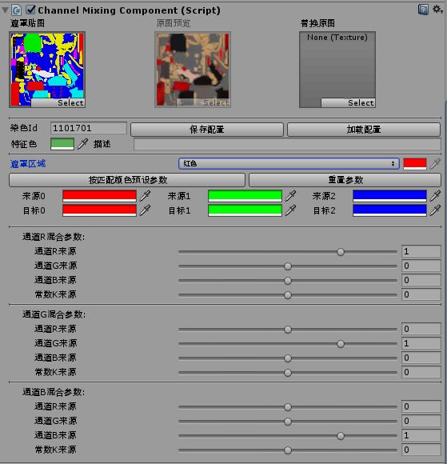用于调整染色的ChannelMixingComponet组件

在通道混合算法中，首选要选择要编辑的遮罩区域，然后调整12个参数获得想要的结果，接着继续编辑其他的区域，直到得到一套完整的染色效果。整个编辑的结果保存为一套Json数据，供运行时加载。

这是根据我们游戏中只提供给玩家美术编辑好的有限染料的需求来制作的编辑器，而不同的项目这部分需求可能不同，主要是效果预览和数据处理，也没有什么特别难的地方。

## 3.4 运行时染色

运行时的染色我们走了一些弯路，最早的时候采用了类似TextureAdjustment插件那样通过GPU生成一张RenderTexture的方式来做，这部分代码如果有兴趣的同学可以直接参考TextureAdjustment插件的实现（可能需要反编译一下）。后来因为内存占用的问题，又改成了直接在Shader中计算的方式：

```c
#ifdef _RECOLOR_ON
inline half3 channelMixing(half3 src, float2 uv)
{
	half bias = 0.1f;
	half4 mask = tex2D(_RecolorMask, uv);
	int maskIndex = (int)(step(bias, mask.r)
						+ step(bias, mask.g) * 2
						+ step(bias, mask.b) * 4);
	half4x4 mixingMatrix = _MixingMatrices[maskIndex];

	half3 dst = saturate(mul((half3x3)mixingMatrix, src));
	dst.r += mixingMatrix[0].w;
	dst.g += mixingMatrix[1].w;
	dst.b += mixingMatrix[2].w;
	return dst.rgb;
}
#endif
```

代码也非常简单，核心就是一个矩阵计算的过程，然后需要在C#中根据染色的区域数量传递多个矩阵参数给Shader。整个染色计算使用一个宏来控制，避免不需要染色情况下的额外消耗。

虽然说了这么多，但也可以看出一个染色系统的实现并不复杂，但这其中也有一些性能和内存上考量和权衡。最后稍微讨论一些和染色相关的在工程中的实现细节。

## **4. 与染色系统相关的其他问题**

在角色具备了染色效果之后，可能会面临一些小的问题，这里简单讨论一下。

1. Mask贴图的颜色边界的锐利程度问题这个前文已经提到了，如果角色染色之后两块染色交接处出现意料之外的颜色可以考虑往这方向查看一下。另外Mask贴图的尺寸不易过小，一般和原图的大小一致，或者比较规整的分区的话可以缩小到原始贴图长宽的1/2，当然这个可以根据效果来判断。
2. 注意材质中其他使用albedo颜色的值是染色之后的还是染色之前的。在制作《无尽战区》游戏的时候，初期的角色材质使用的是传统的高光法线的方式，其中高光使用了一张带颜色的高光贴图。角色染色之后，高光的颜色依然是和原始贴图对应的，这就会存在问题。修改方法也比较简单：一种思路是对高光贴图也应用同样的染色过程，但这个比较耗，所以还是抛弃掉带颜色的高光，使用染色后的颜色乘以高光控制贴图的值作为高光颜色来进行计算。一些角色身上的流光效果也可能遇到类似的问题，所以要注意区分角色渲染时使用的颜色值是否要跟随染色变化。
3. 角色染色之后，技能和自身特效可能需要跟随变化。这个实现起来就比较难，但是也是追求细节的游戏的常见需求。这涉及到特效的染色功能实现，通常相比于角色染色，特效进行变色的过程比较简单，一般选择乘法的方式就够用了，但是特效中有很多个ParticleSystem的效果需要去修改，管理起来就比较麻烦。一种思路是在逻辑层根据角色染色直接做特效的替换或者染色的处理，但也也需要额外美术的制作工作。
4. 通道混合算法是否可能提供给玩家一种自主染色的方案？这是我在做《无尽战区》端游的时候自己思考的一个问题，首先肯定不能将那么多参数开放给玩家，专业的美术还需要一定时间来理解通道混合算法，何况没有任何美术知识的玩家。其实在给定代表一个区域的颜色值和目标颜色值之后，可以通过一种简单的算法推算出一种解。三个一次方程组，但是有十二个未知数，所以解肯定不止一种，那么一个更好的思路是通过尽量少的调整参数来达到目标颜色。使用Python实现的一个简单的根据原始的rgb颜色和目标rgb颜色计算通道混合参数代码如下：

```python
def cal_mix_channel_param(sColor, tValue, targetIdx):
	"""计算通道混合算法中单个通道的值"""
	ret = [0.0, 0.0, 0.0]
	ret[targetIdx] = 1.0
	sColor2 = list(sColor)
	sColor2.sort()
	maxLimit = sum(sColor2)*2
	if tValue > maxLimit:
		return [2.0, 2.0, 2.0, float(tValue - maxLimit) / 255.0]
	currColor = sColor[targetIdx]
	if currColor < tValue:
		for i in xrange(len(sColor2)):
			retIdx = sColor.index(sColor2[2-i])
			diff = tValue - currColor
			mRatio = 2.0
			if retIdx == targetIdx:
				mRatio = 1.0
			r = float(diff) / float(sColor2[2-i])
			if r > mRatio:
				currColor += int(mRatio * sColor2[2-i])
				ret[retIdx] = 2.0
			else:
				ret[retIdx] += r
				break
	elif currColor > tValue:
		r = float(tValue) / float(currColor)
		ret[targetIdx] = r
	ret.append(0.0)
	return ret

def cal_mix_channel_params(sColor, tValue):
	"""根据原始的rgb颜色和目标rgb颜色计算通道混合参数"""
	sColor = ((sColor & 0x00FF0000) >> 16, (sColor & 0x0000FF00) >> 8, (sColor & 0x000000FF))
	tValue = ((tValue & 0x00FF0000) >> 16, (tValue & 0x0000FF00) >> 8, (tValue & 0x000000FF))
	ret1 = cal_mix_channel_param(sColor, tValue[0], 0)
	ret2 = cal_mix_channel_param(sColor, tValue[1], 1)
	ret3 = cal_mix_channel_param(sColor, tValue[2], 2)
	if not(ret1 and ret2 and ret3):
		return None
	ret = [ int(ret1[0]*100), int(ret1[1]*100), int(ret1[2]*100),
			int(ret2[0]*100), int(ret2[1]*100), int(ret2[2]*100),
			int(ret3[0]*100), int(ret3[1]*100), int(ret3[2]*100),
			int(ret1[3]*100), int(ret2[3]*100), int(ret3[3]*100),]
	return ret
```

这一部分的实现比较晦涩，大部分项目应该用不到，有需要的朋友再单独讨论细节吧。

通过这样的方法，就可以做到让玩家直接选择目标颜色，然后自动生成通道混合的算法参数。当然，结果可能和目标颜色有稍微的偏差，因为一个区域的颜色通常不是唯一的，所以原始颜色的值也是一个平均值或者其他特种值。

## **5. 总结**

关于染色系统，可能有些团队也在使用通道混合的方式来进行染色，也可能有团队使用了更加好的染色方法，欢迎来进行讨论和补充。我们出于团队经验以及特定的染色需求等考量，选择了这种功能强大但可能不太常用的染色方式，这并不意味着我一定向所有团队推荐来使用它，毕竟适合特定需求和自己团队的方案才是最好的。但我也想通过这篇文章，给在开发染色系统的团队一些额外的信息，希望你们能够了解到更多方案的利弊，更好地做出适合自己的选择。


2018年12月12日  于杭州滨江海创园