# 从AI到渲染，最终幻想系列是这样领跑行业（四）

这里解释了实现的细节，关卡使用了Sequence Graph来实现，Sequence Graph同样也是节点的图表系统。这个比较类似UE4的蓝图，这里就不做详细解释了。可以在Sequence Graph里定制AI，这些节点可以归类为AI Mode，这种情况下实际使用的节点是AI Mode Route 。类似body graph，AI Graph的中断模式从Sequence Graph接受指令，再把它翻译成AI Graph里的root移动状态，然后AI节点调用，用导航系统来沿着路线移动。前面三宅先生讲过了导航网格的生成和执行方法，用关卡编辑器在关卡里定义了目标点的列表

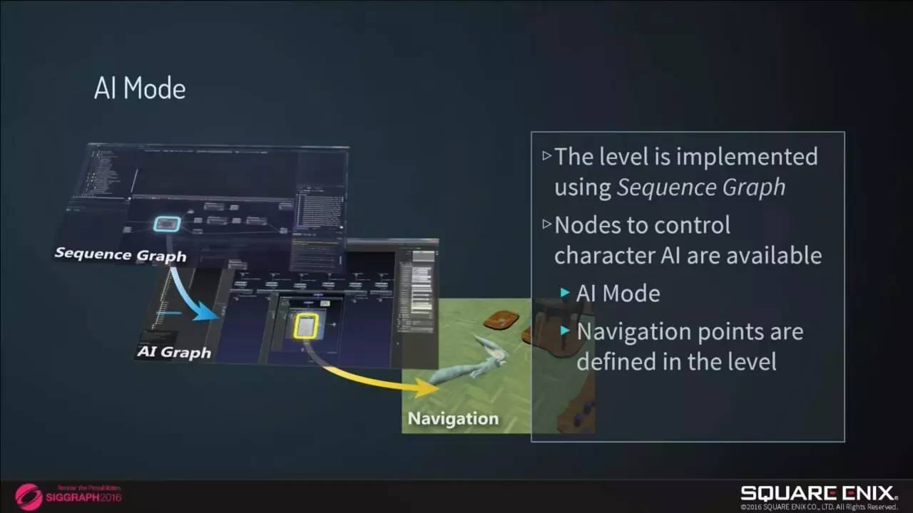

可以看到地板上的导航网格，Carbuncle可以在地板和桌面上随意移动，还有跳跃。不光地板上有导航网格，椅子和桌子上也有，要连接这些不同的导航网格，需要使用Jump Link，所以加入了这种跳跃系统达到实现连接不同导航系统的目标。当加入探索网络里特殊点的时候，我们可以评估走过这个Jump Link的Cost。

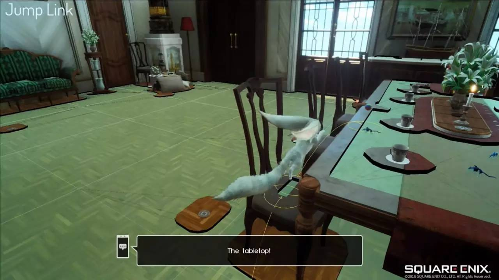

当Carbuncle接近跳跃点时，会传递消息让body graph来跳跃，而body graph会要切换到Jump State，并把消息传递给Anim Graph，Anim Graph从locomotion State切换到Jump state，并播放跳跃的动作。但这个是由AI驱动的，所以起始点并不是那么的精确，要增加精度就要使用运动分析（motion analysis），这个在AI技术演讲中介绍过。这个有时仍然会有一些错误，如果只播放动画师创作的运动的话，Carbuncle会掉落到地板上，所以加入将预设的值加到自动root motion，来调整跳跃时的旋转。这个预设的变量是通过动画系统的预测来进行评估，为了让跳上去这个动作自然，有很多系统协同工作。

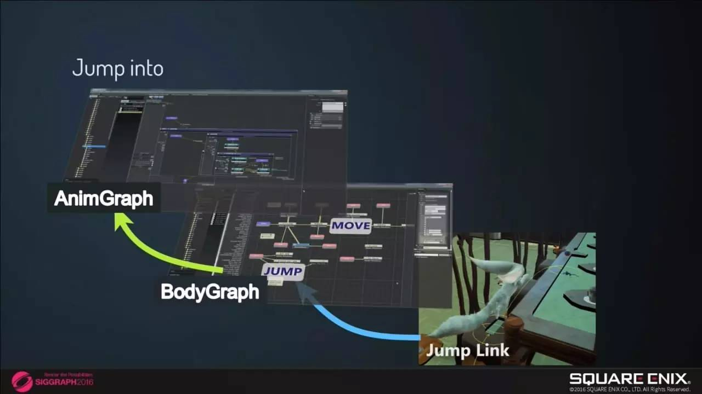

总结，本次Talk解释了姿势变化的概念，三宅也介绍了一些AI技术，PQS，导航和运动的知识。而动画技术同样重要，各种怪物的IK系统，用最好的动画技术来完成，为了集成这些技术，使用了3层Graph的架构，AI Graph，Body Graph以及Animation Graph，通过这些系统的协作，实现了自然的动作效果。

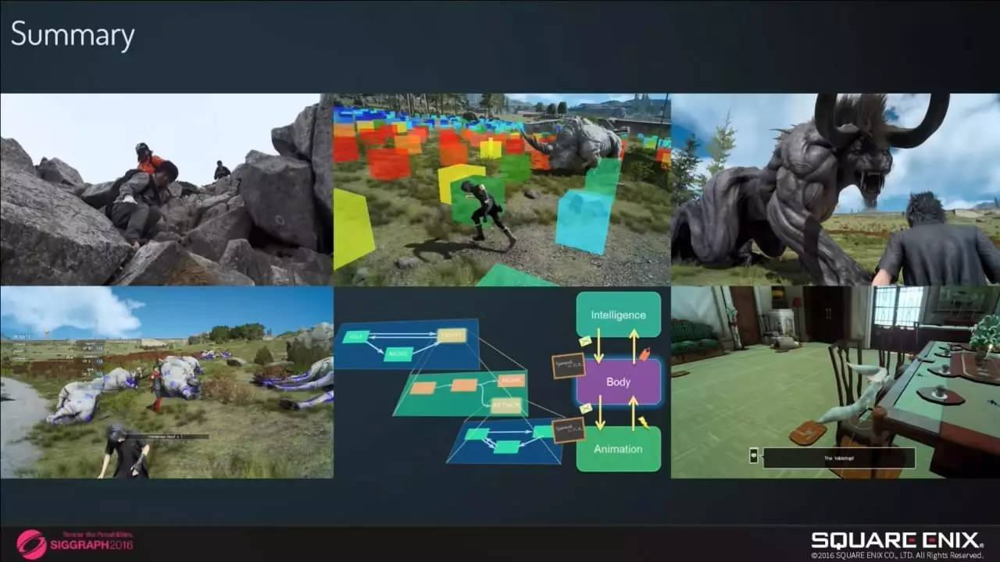

接下来的技术讲座是FFXV的渲染技术。这个讲座也是两个人。Remi Driancourt是东京SE先进技术部的主管，加入SE前从事过认知科学，机器人技术，以及自然语言的处理，加入后主要从事动画和CG的研发，并成为E3 2012年的Agni's Philosophy技术Demo的图形组长，2014年离开先进技术部，加入其他部门负责研发工作。第2个演讲者是Masayoshi MIYAMOTO，是SE东京的图形程序员，2012年加入，之前有过5年的CAD/CAM的开发经验，目前在开发FFXV，是东京大学的数学硕士。

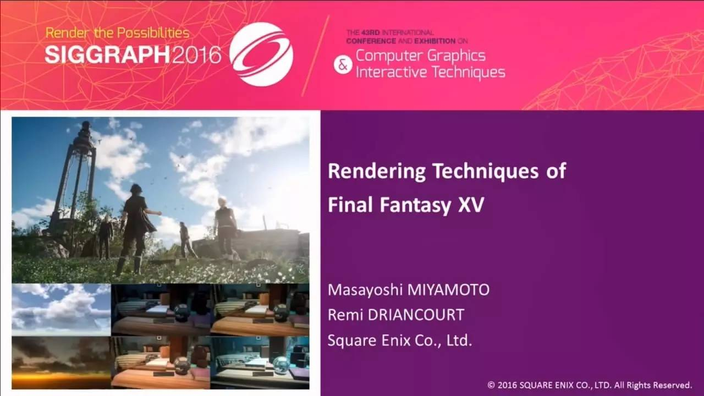

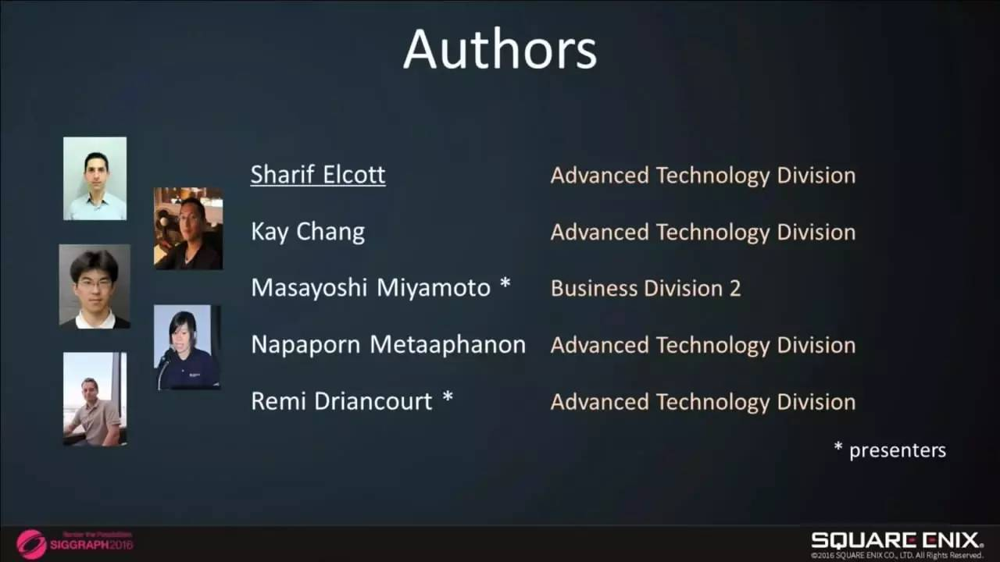

Siggraph2016上一些其他讲座的介绍。

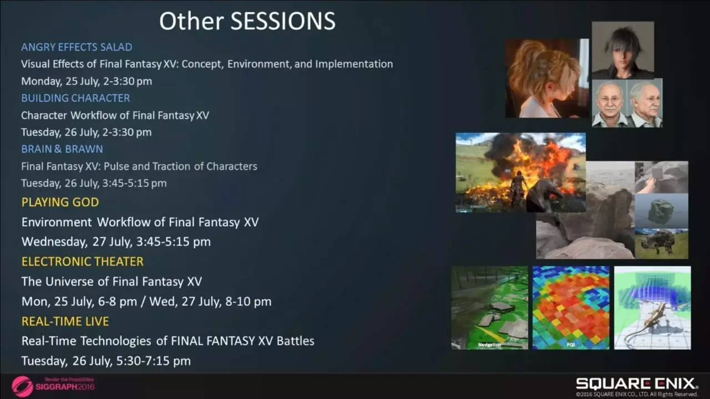

一些可以介绍FFXV的关键词，它是SQUARE ENIX开发的一款动作角色扮演游戏（ARPG），9月30日在两大主机发售（PS:已经延期了），之前已经发布了两款游戏Demo，“Episode Duscae”和“Platinum Demo”。

从图形程序员的角度看，使FFXV变得独特的是，最终幻想系列中完全开放世界的（open world），有室内和室外的位置，例如海洋，森林，洞穴等，以及这次要介绍的日夜循环，而气候也是完全动态变化的，可以说天空和气和故事描述的主要部分。

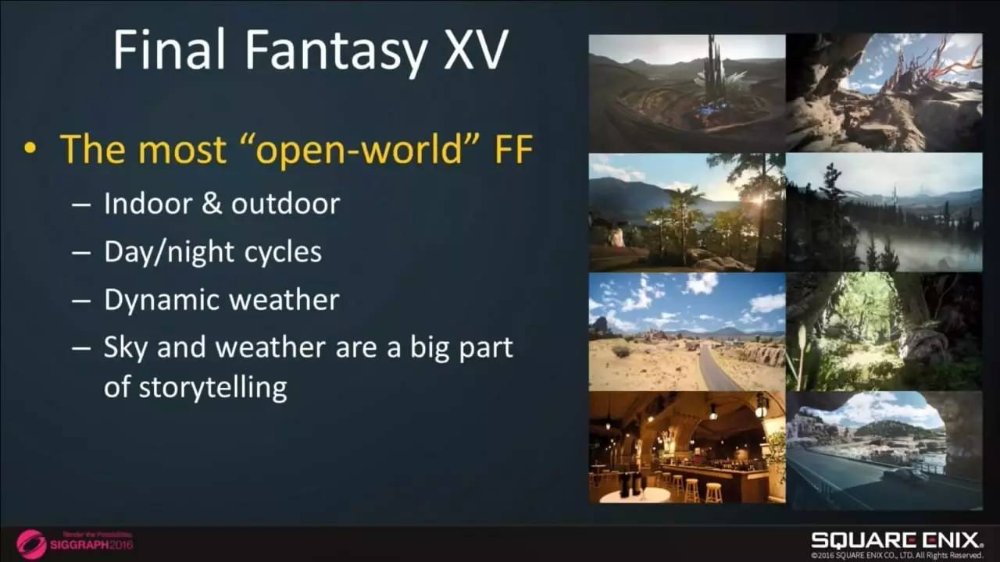

在开始介绍技术前，先看一段3分钟的关于这些技术的视频。

前面这段视频是游戏中的环境和光照类型的预览，接下来是这次讲座的议程，先从游戏引擎实现的一些基础渲染特性的简单讲解开始，然后会是实现的全局照明相关的细节，然后MIYAMOTO会加入进来，一起介绍天空和气候系统。

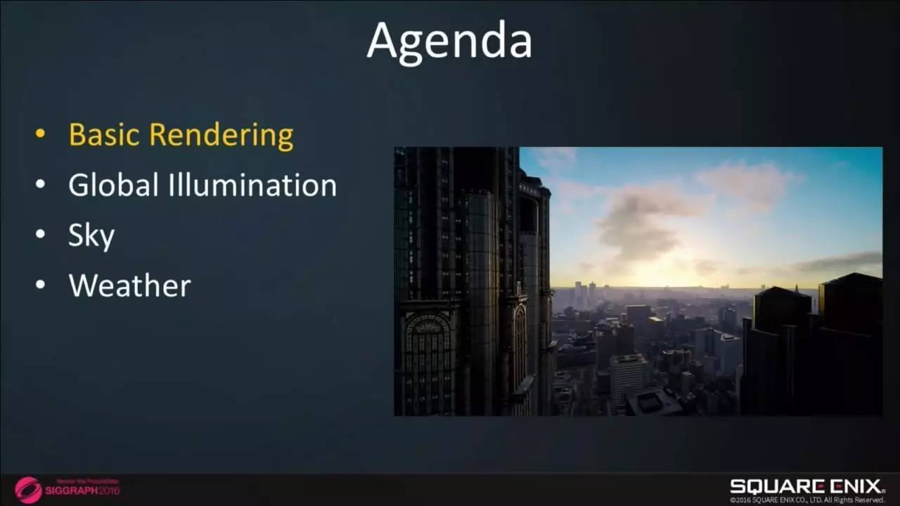

FFXV使用了完整的现代AAA级别的引擎，也就是前面介绍的Luminous Stuido。有大多数的常用特性，例如PBR，使用了Tile-based light culling的Deferred&Forward渲染管线，IES Light和Temeroal AA等等。这些特性在其他的游戏产品中也可以找到，就不做详细介绍了。

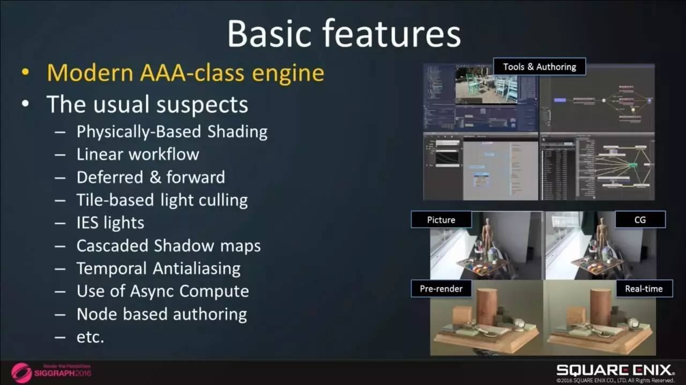

然后是关于着色方面，使用了基于物理的着色，Specular方面使用了Trowbridge-Reitz(GGX)的Torrance Sparrow BRDF模型，Schlick-Smith的Masking function，以及近似的Schlick的Fresnel trem，而Diffuse方面没什么奇特的，还是继续使用常用的Lambertian。

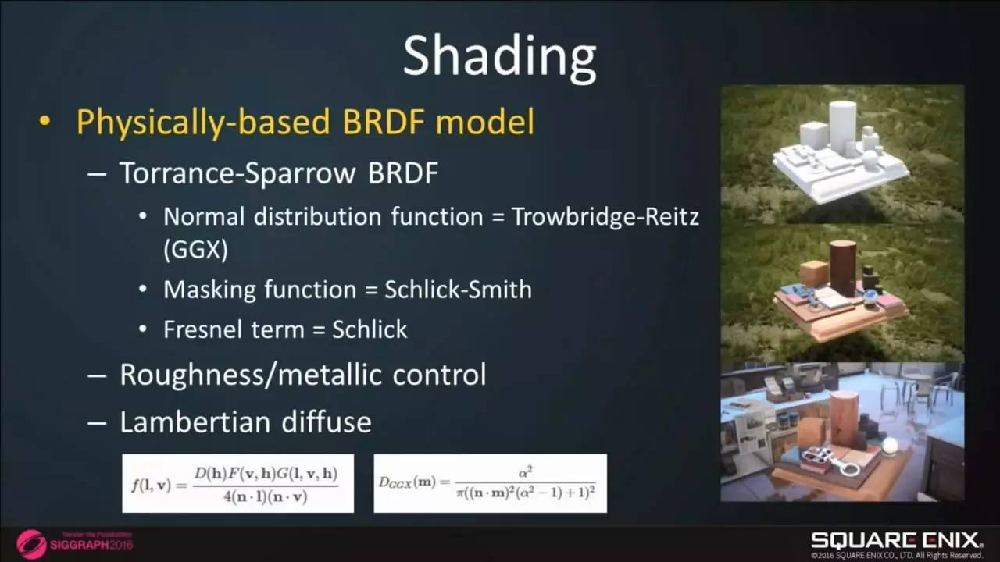

使用着色是非常经典的，基本的BRDF材质使用Deferred，而Forward一般是透明和特殊材质使用，这里也使用了一些Trick，例如眼睛通过Forward渲染实现了第2层高光（Second Specular）。类似的，车漆也是用Forward渲染来实现额外的车漆层（extra layer），皮肤方面，在Deferred上分成两个render target来渲染Diffuse和Specular，然后模糊Diffuse，再在Forward里对这两个做混合。而头发使用了marschner model，在Deferred中只渲染了depth和normal，在Forward里进行全部渲染与合并。

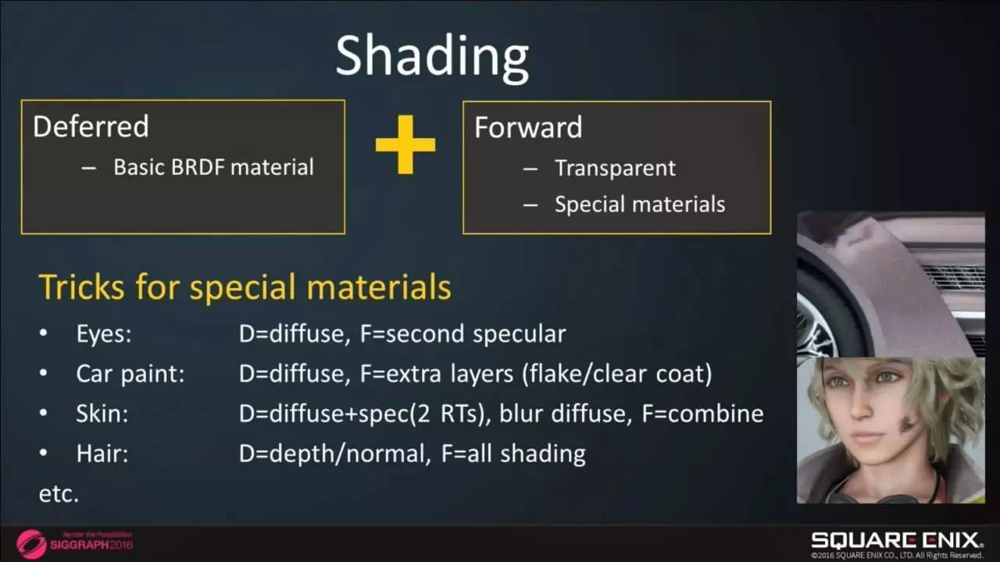

而使用的G-buffer可以看到非常的清晰简单，它是有3个Render Target扩展而成，是非常经典的配置，在第3张Render Target里（RT2），可以看到有3个Slot，这个使用量支持各种特殊材质的，例如眼球和头发等。通过加入到stencil的ID来区分不同的brdf。

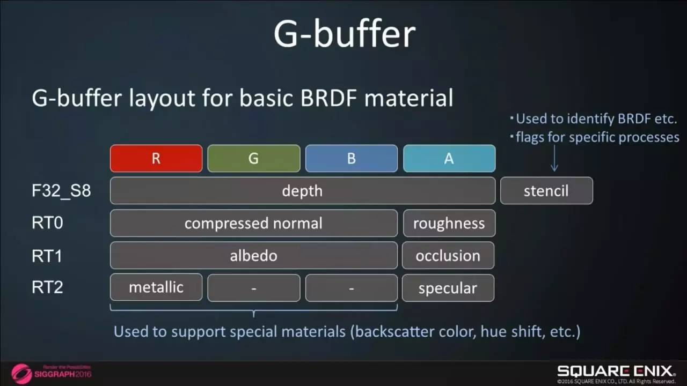

接下来要讲的是全局照明，先从间接的漫反射（Indirect Diffuse）开始。

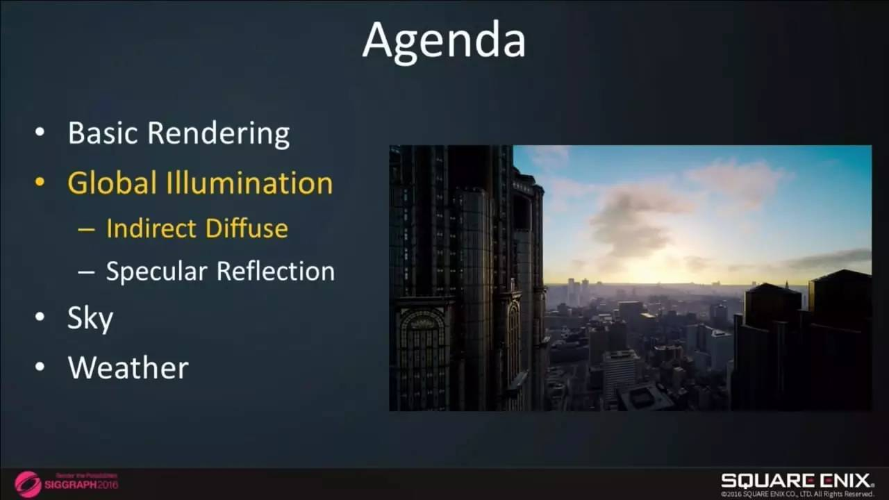

在开始介绍前，这款游戏对光照有一些非常特殊需求，首先需要的是室内和室外的无缝转换。游戏里也火车和汽车这种移动的载具，所以也要特殊情况的光照，不是在室内也不是在室外的，而是在这两者之间，同时还要处理Time of day和动态气候（dynamic weather）。正因为有这些需求的问题，所以不能只使用常用的静态烘培的光照贴图或数据。因为有非常巨大的游戏世界，对数据存储的要求也非常的大，所以为了处理这个，创建了基于静态和动态数据的Hybird GI策略、

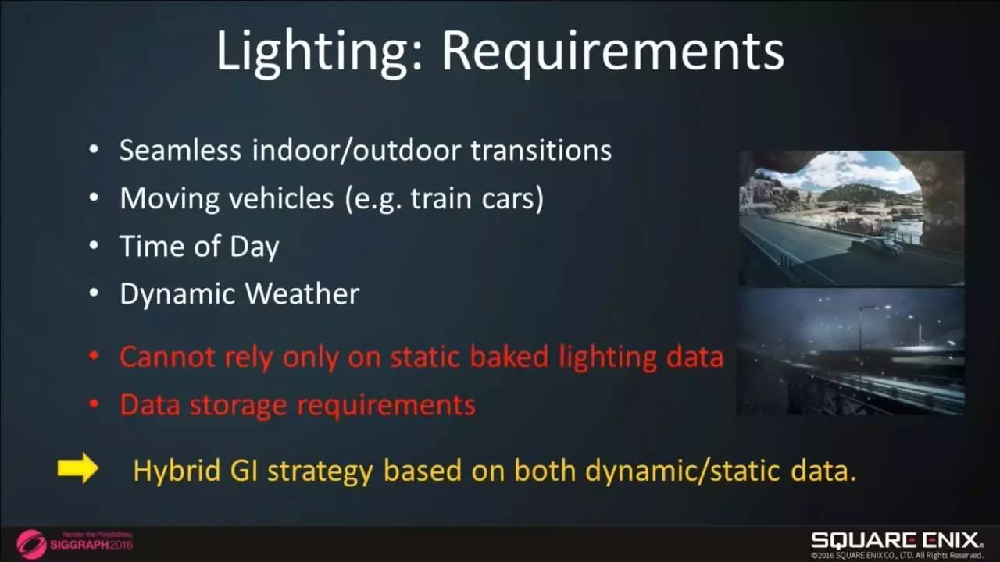

先是间接漫反射，使用了Local probe，而实际的Local probe的读取，是把它组织到分层的网格里（hierarchies of grids）。这个是非常经典的方法，手动的来放置Gird，或者通过导航网格来自动的摆放他们。通常大的室外环境里，会在很大的区域放置1个，美术师在根据需求来决定哪里放置的更加细致。当然这些系统也是基于图层系统的（Layer System），可以通过各种参数来控制来淡出淡入（fade in / fade out），以及不同的图层之间做

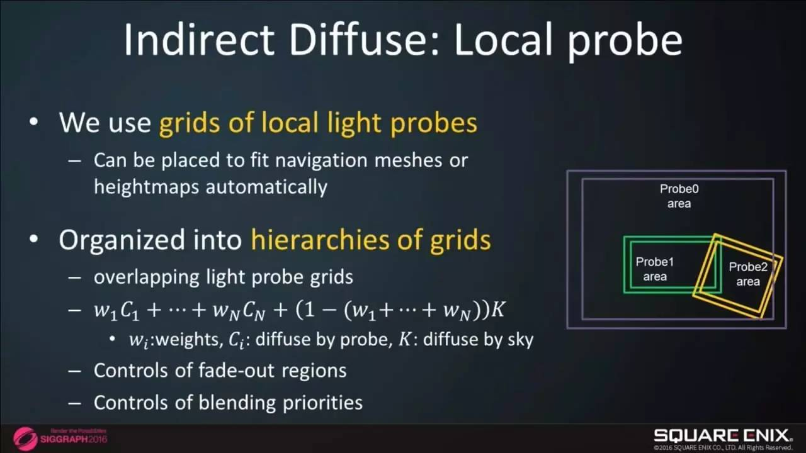

那么，指定的Probe grid可以是预计算光能传递（PRT-Precomputed Radiance Transfer）的数据或者是辐射体（IV，Irradiance Volume），PRT数据是考虑到天空的动态光照变化带来的影响。例如表现天空遮蔽（Sky Occlusion），也大量的用来处理完全室外的方案。而IV主要的是在完全室内的静态的局部光（static local light）。当然，因为是需要移动变化的，在特殊情况下就需要两个都使用。那就需要两个都保存。

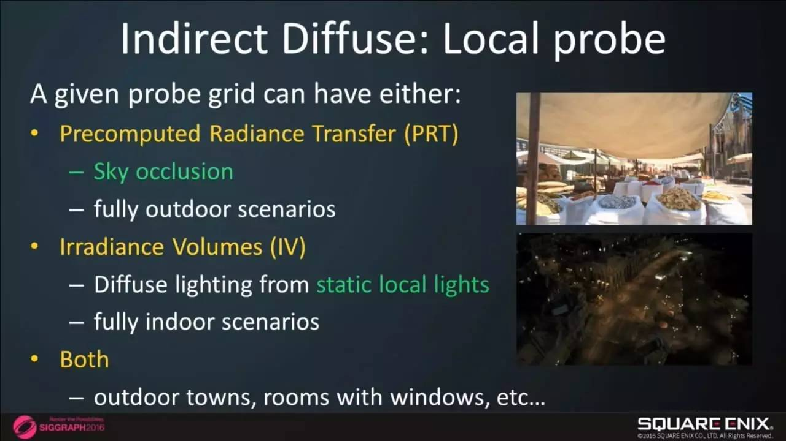

实际上，PRT是球谐（Sphere harmonics）系数的矩阵，游戏里使用的order3的SH9，也就是9个系数，使用的是自研的path tracer来烘培传递矩阵。这里把IV是和PRT数据一起保存的，同样也用的order 3 SH9的IV，这样正好就PRT的传递矩阵再加一行就可以了。在运行时也相当简单，按下面公式的方法对probe做光照计算。grid里所有的Probe作为一个批次，也就是sky SH乘以PRT transfer matrix加上IV的信息。绿色PRT和IV是烘培数据，而蓝色的sky SH是运行时的数据，所以计算的时候同时需要烘焙数据和实时数据，为所有SH的系数以及每个RGB通道进行9次这样的运算操作。

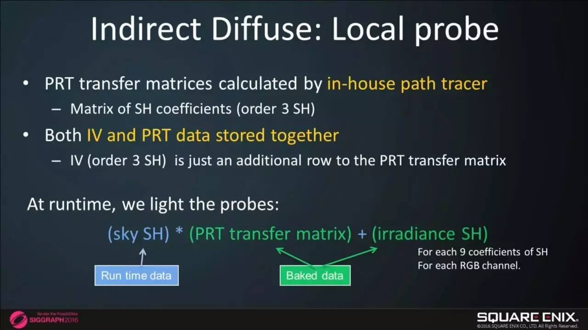

接下来看下Moving Probe这种特殊情况，前面也说到有火车的情况，火车不光有外面的场景也是内部事物，它自身的环境是相对于外部场景在移动和旋转的。那么处理的方法是，无视全局环境，使用局部环境来烘培Probe，然后载具移动时旋转SH数据，因为前面说到也要考虑到Occlusion，否则玩家就会发现问题，在火车上到处都有窗户，所以对实际的外观也更加重要。这里需要考虑太阳光入射的方向（所以旋转SH9），这个比Occlusion更重要，做好了效果就没啥问题了。

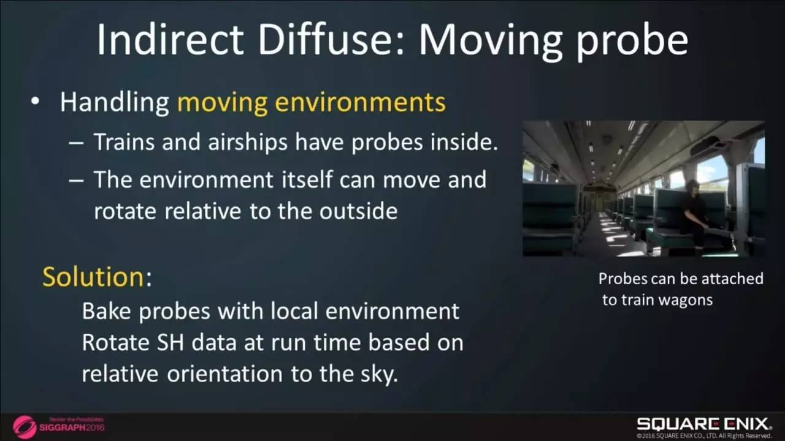

那么局部遮蔽（Local Occlusion）的方法也是非常经典的方法。间接漫反射里加入了屏幕空间的环境遮蔽（SSAO），使用了合作的LABS group创造的定制算法，去年已经进行了相关分享，用半分辨率来模糊和采样，再使用Temeroal Reprojection。除此之外还实现了Analytical AO，这个没什么特别之处，就是把AO Sphere attach到植物或角色上，使用Tiled方式来应用Analytical AO，通常在1ms内完成。视频里可以看到切换Analytical AO时画面的不同，方法很简单，但是个好点子。

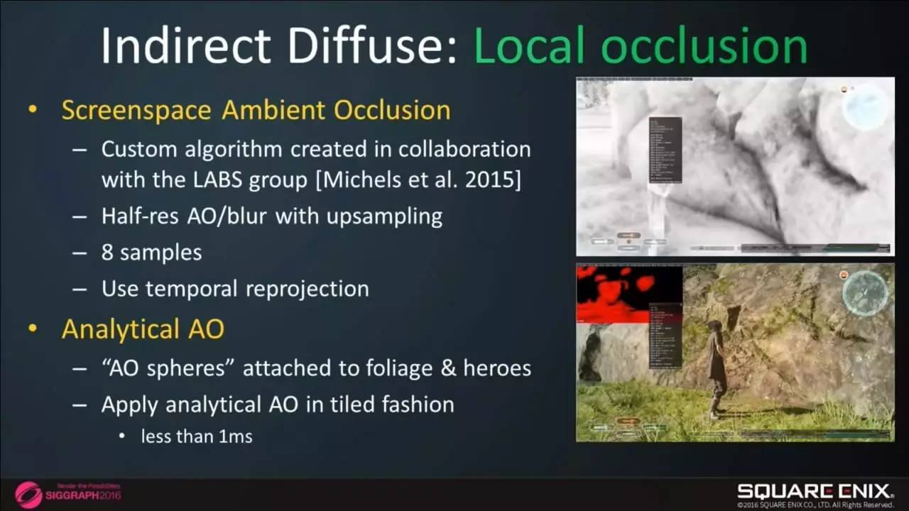

接下里涉及的是动态光源的反弹（bounce），也研究了一些基于RSM（Reflective Shadow Map）的GI技术，有两个选择，一个是Light Propagation Volume，另一个是SE自研的Virtual Spherical Gaussian Light技术。这两种技术都有很多有点，是完全动态的，但在试验后意识到RSM对游戏来说过于昂贵了，因为游戏里有很多的高多边形的场景以及大量的几何体。所以最后选择了完全的动态光，但关闭了使用GPU资源的光照反弹，来渲染天空和云。

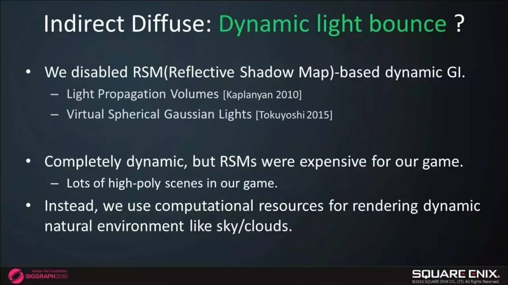

处理完漫反射后，来说一下镜面反射。

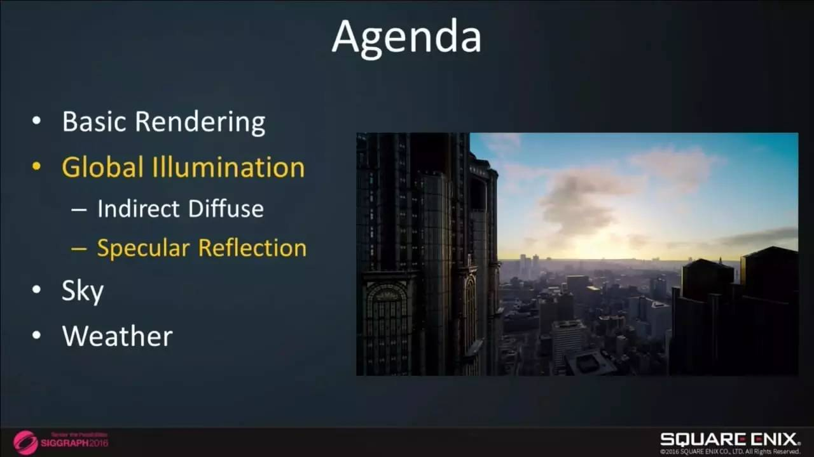

为了处理反射，使用了最传统的Tiered System，分为三层结构，屏幕空间反射里使用了ray march，基于粗糙度的bilateral blur。带视察校正的Local Cubemap，以及天空盒来作为Global Cubemap。视频里可以看到Global cubemap在运行时的更新。当然要实时的反射所有事物非常昂贵，所以他是在多帧里分开来Filtering。

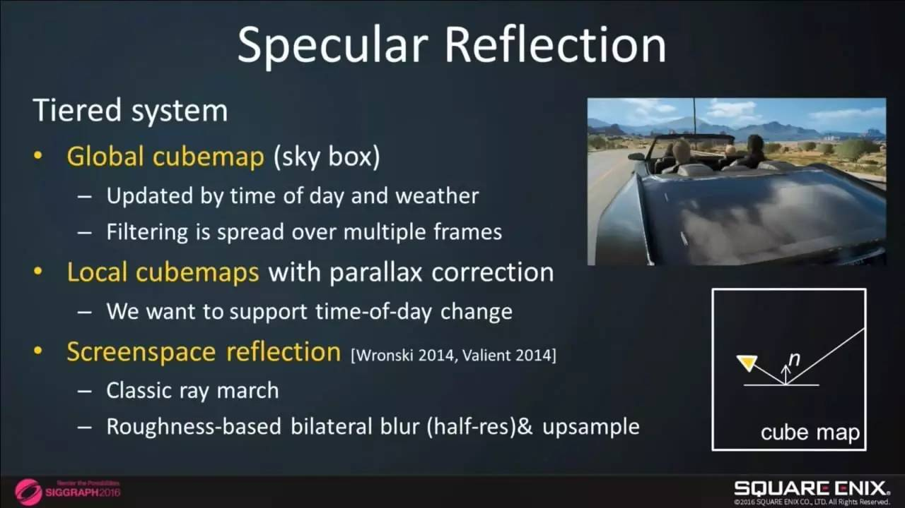

这时还是有问题的，那就是如何在local cubemap里处理time of day的变化，因为这些cubemap都是静态的，而在运行时bake probe又过于昂贵。这个在其他游戏里有一些解决方法，例如可以在运行时使用一个mini G-buffer来relight cubemap，这个是Stephen McAuley在Far Cry 4里实现的，但这个方法仍然过于昂贵。可以预先各种时间和天气条件排列组合下的Probe，然后在运行时来混合，但是这种方法会产生Blending artifacts，实际上也同样不够廉价。

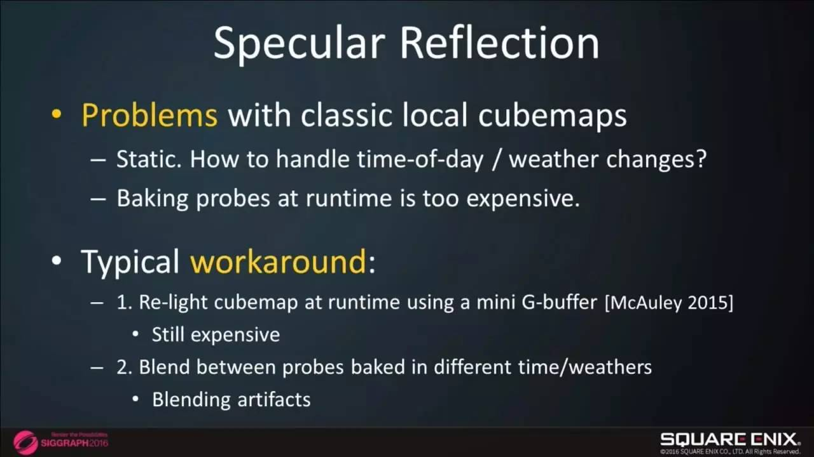

下面就是FFXV的解决方案，概念上，是把Specular Probe分离到3个组件里，第1个是天空的像素（sky pixel），第2个不受time of day影响的像素，例如局部光源或自发光。第3个是受time of day影响的像素，例如太阳和某些包含在气候系统里的天空。最后这个系统是相当快的来计算的，另外使用的内存也较少。

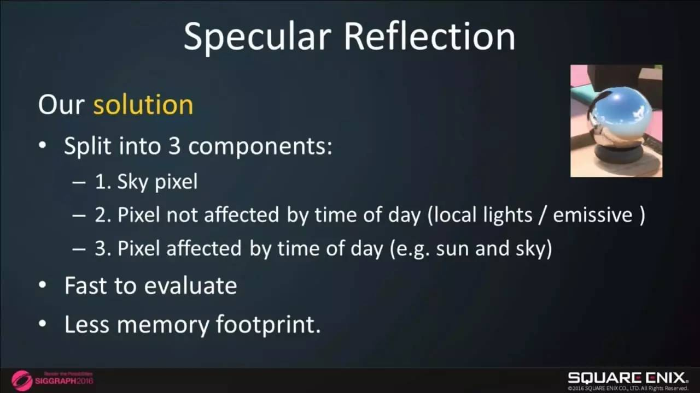

那么第1个组件是Sky Mask，是在烘培是简单的来生成Mask指定出“天空”的像素，在运行时，Shader会基于这个Mask回滚动态的天空盒。这意味着即便是Local Specular Porbe，如果打开一扇朝向天空的窗户，也可以看到反射的的云。

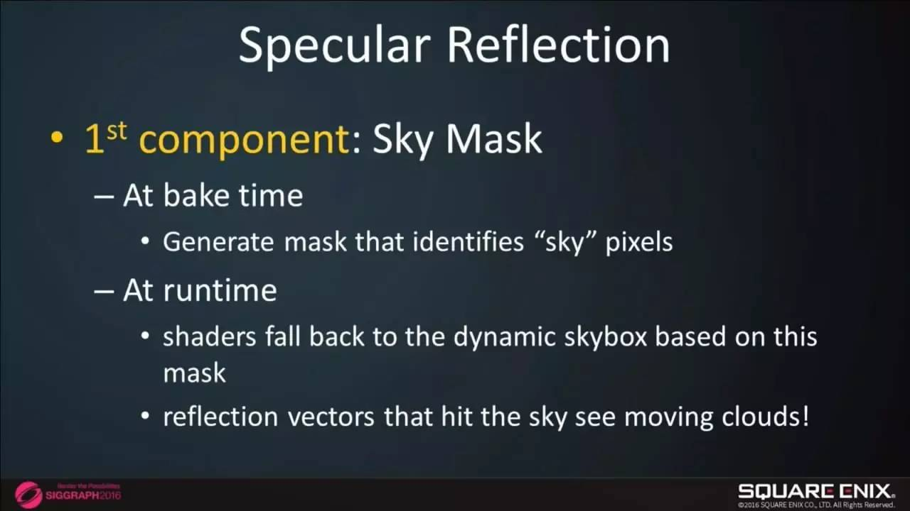

第2个组件是Baked static lighting，这个的处理也很传统的方式，在烘培时，关闭了太阳，天光，雾等所有动态的事项，只保留了静态光源，使用有规则Cubemap来Capture和Fiter，然后在运行时，按照原样的基于粗糙度查找LOD的方式来使用这张贴图，这个也是非常传统。

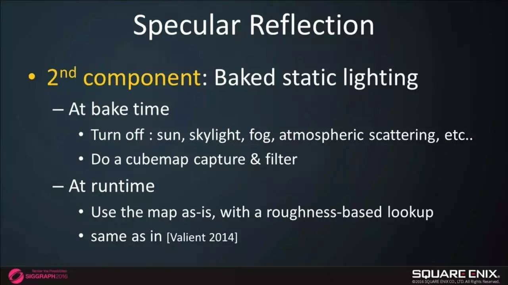

第3个组件稍微有些特别，在烘培时，打开所有光源来渲染场景，然后减去前面的“局部光照（Local lighting）”来获得只受太阳和天空光照的场景的Cubemap，非常重要的是，从sky SH的constant term里获取天空的颜色，在保存前把这部分分离出来。而在运行时，通过运行时的信息来取回天空的颜色，并获得需要的效果。

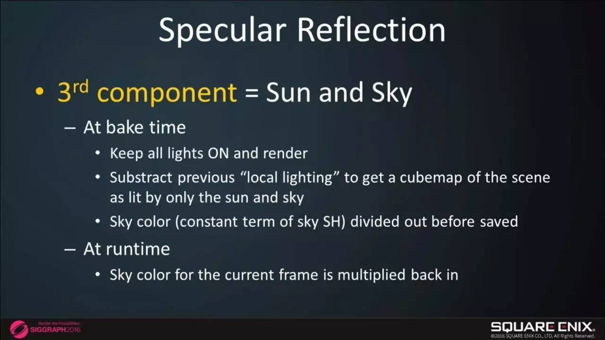

下面是这3个组件的总览以及它们是如何在运行时使用的。可以看到在这个等式里。把归一化的天光系数乘以SH projected skybox的Constan term，加上baked local light后，再乘以1-Mask，这里只加入了基于Sky Mask的内容，而取自Global cubemap的Sky Box Color属于局部信息。绿色部分的信息是烘培数据（baked data），而蓝色的变量是来自运行时并每帧要计算的。

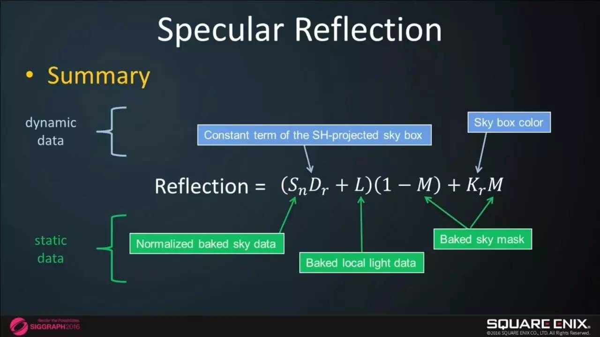

然后是一些关于数据存储方面的信息。当然如果要是很幼稚的来实现这些技术，那就需要7个通道来保存这些信息，当然就太多了，所以通过下面的方法做了压缩。

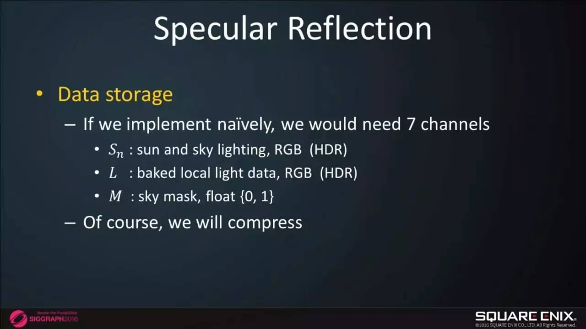

核心思想就是，假设Sn和L有大致类似的颜色，这里要提醒下Sn是归一化（Normalized）的Sky Color，Sky Color应该被看作是天空颜色种的通用部分，那么就可以读回来作为Local light的grayscale，如果没有使用太过饱和的光，Sn的值就与L非常接近了。所以这里可以按下面介绍的方法来重写等式，R可以作为的Local light和Normalized skylight的比率系数。R基本上是一个grayscale。很多情况都必须要把R编码到一个通道里。要注意的是，当我们把把L写成关于Sn的参数，那么在室内时Sn代表的来自天空光的颜色的值会变成0，这是很常见的情况。这个就是处理方法还有个问题，当处理的参数接近0的时候会出精度问题。

那么就选出S或者L来作为主色，在运行时来通过一个简单的分支处理来disambiguate。

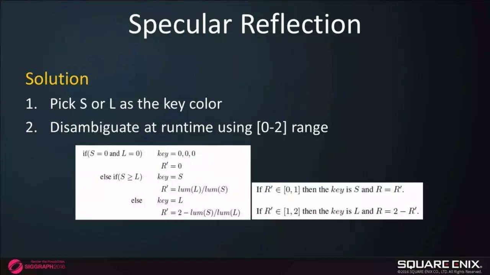

具体的，可以看下面一些高光反射结果的截图，这是FFXV的城市里一个典型的房间，里面有一些来自天花板局部光（Local light），有可以看到天空盒的朝向外面的窗户，现在的时间是中午，所以没有室内局部光源，只有天光。

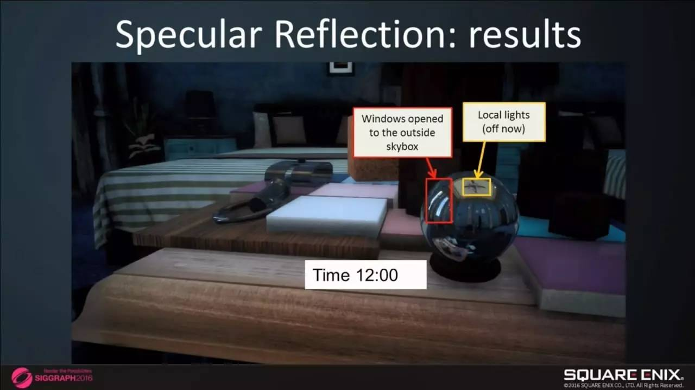

下图的时间是下午6:30，太阳光较弱，色调偏蓝，这个时间仍然没有局部光。

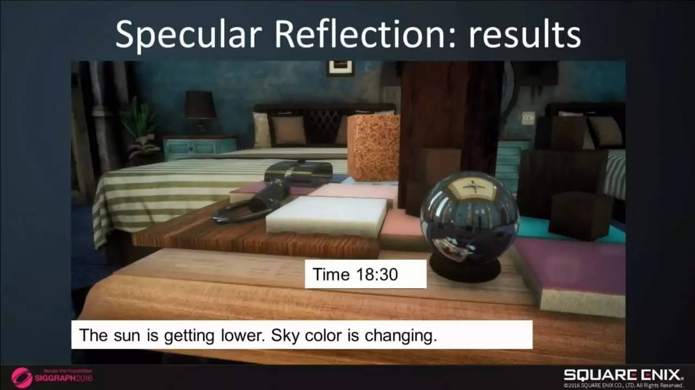

到了晚上7：20分，local light打开了，场景被天光照到变得带有粉红色。

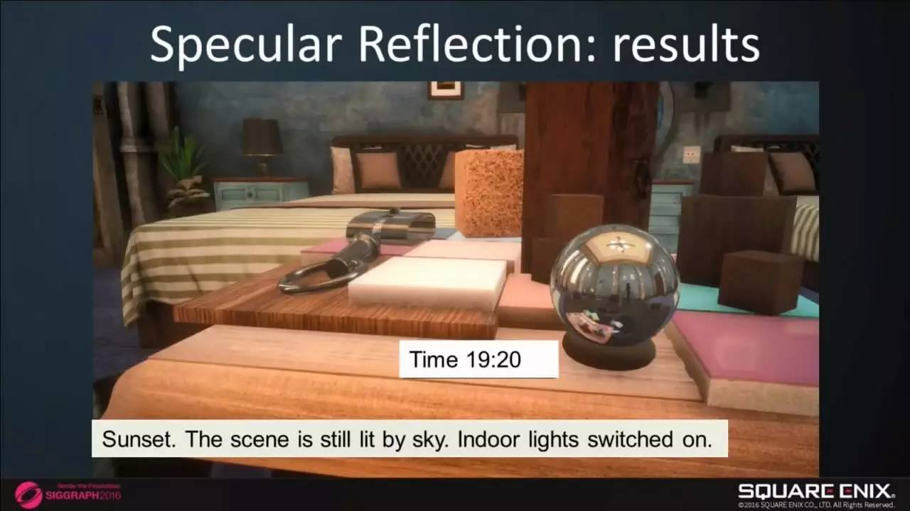

接下来是午夜的截图，天光变黑了，场景只被local light照射。

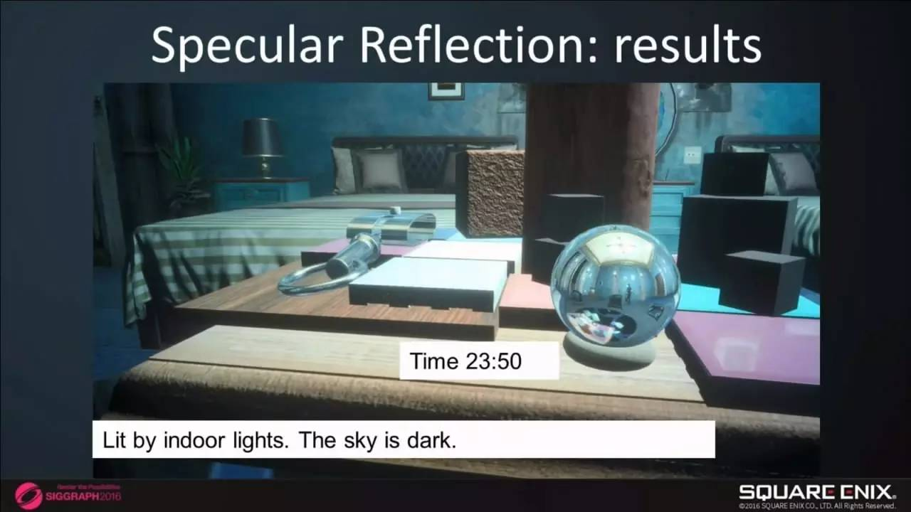

下面的就是之前描述技术的概要，可以看到有一些要素是要离线烘培，镜面反射和漫反射Probe，还有PRT和IV。这些是在运行时通过从Time of day以及过程化的天空和云中获得的动态信息来进行合并的。这些合并体给予了所有需要的光照，直接和间接的漫反射和镜面高光。

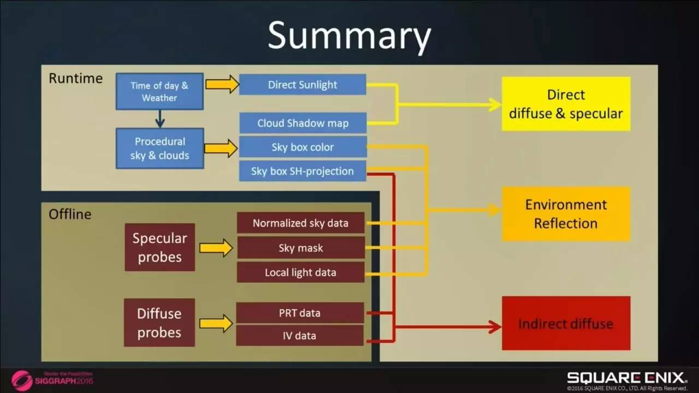

接下来是MIYAMOTO来讲解，聚焦于这些元素的集成，time of day和Procedural sky&cloud

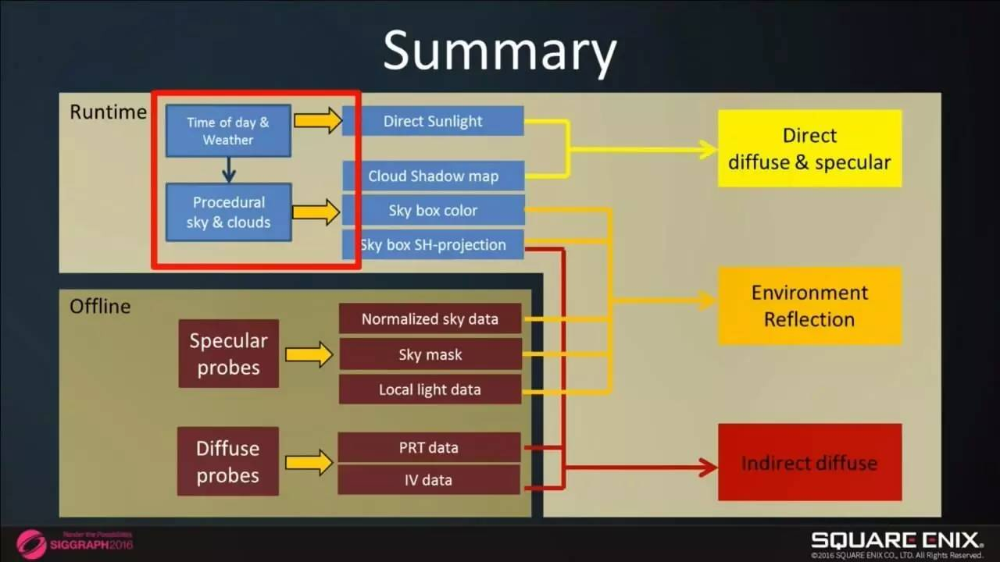

接下来介绍的如何设计天空的

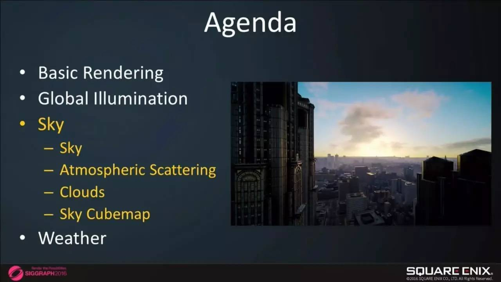

FFXV需要的大气戏剧性的变化，并且与光照和气候相关联。必须要能适应不同的气候和不同的TOD，需要给美术师完全的控制。

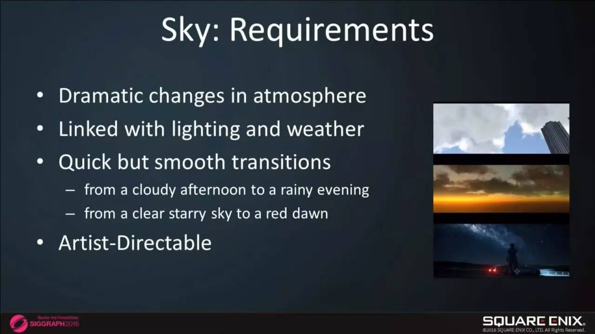

为了实现这些要求，整个天空是用过程化来生成的

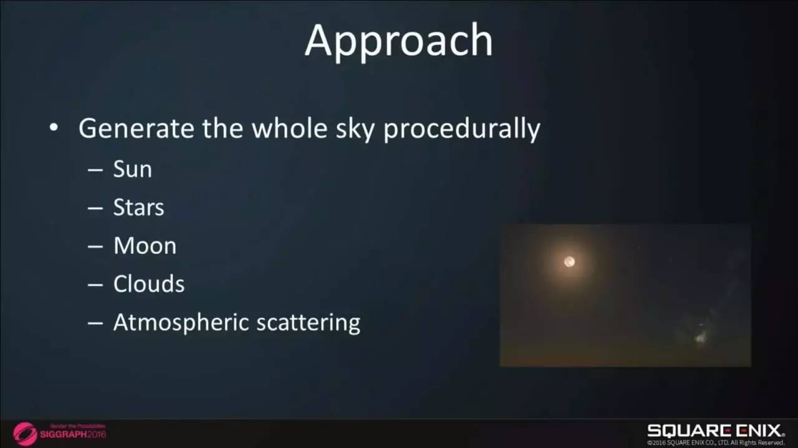

FFXV的天空包括的银河（Milky way）是个物体对象，是渲染在一个圆柱表面（cylindrical surface）上的。有两种类型的星星，小星星用的是Repeated Texture，覆盖了整个天空的上半球，而大星星是用了硬件Instanced Billboard，位置是一定程度上随机的。也有太阳和月亮以及大气散射在整个屏幕上，但是使用了同一个方法来生成天空和云，然后把大气散射用空间透视（aerial perspective）的方式计算到一个物体对象上，这使用了不同的方式，下面做进一步的解释。

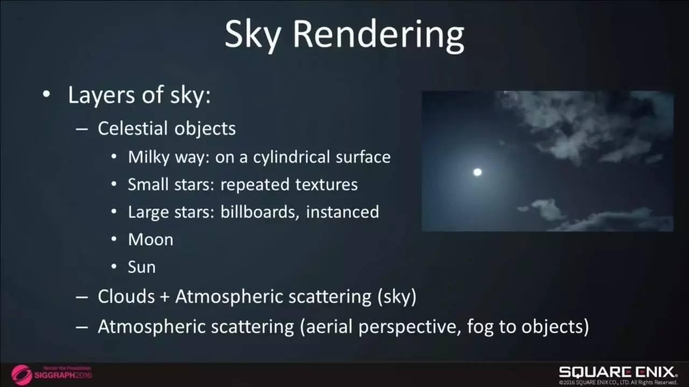

为了实现大气散射，尝试了几种模型，从single scattering model开始，优势在于可以雾可以和天空一起渲染，但它没有黄昏和黎明的暮光（twilight）效果，日落后就完全黑掉了，这是因为没有二次散射的缘故。美术师控制上也不是很直观。所以接下来尝试了Precomputation & Analytical model，有3篇文章，更容易控制，但对于匹配参考的照片并不够，最后一个生成的效果不够漂亮，并不是很好的方法，FFXV里选择里这个模型，但用自己的方式生成静态数据。

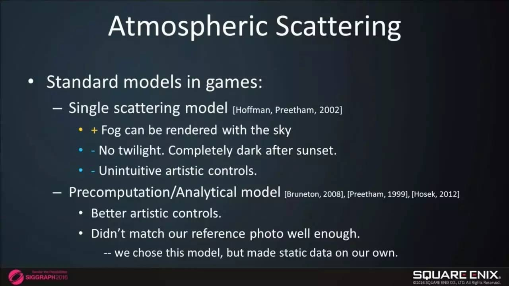

FFXV的天空是有两个LUT（lookup table）以及瑞利和米氏散射函数合并而成的。可以看下下方的图示，天空大致是由蓝色部分和阴霾（haziness）部分组成，蓝色部分是瑞利散射（Rayleigh），而米氏散射（Mie）部分是太阳周围的阴霾。haziness是由phase函数中的g值来控制的。

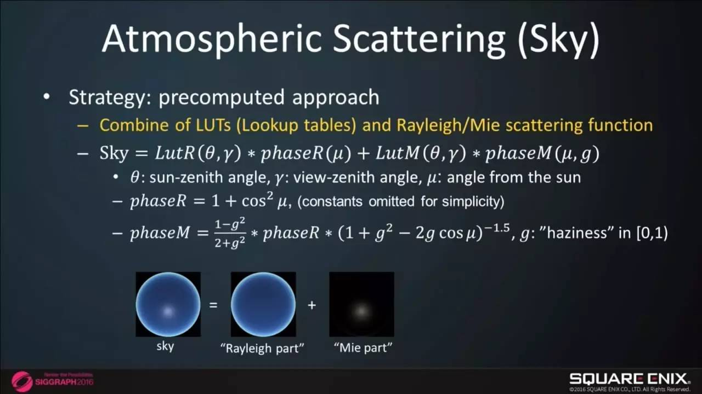

离线的生成LUT上，使用了Least Square fitting，对基于真实数据的天空做Ray Trace。而天空的公式相当简单，没有高层次的视点，也没有地面的阴影，但对应游戏来说足够了。对于阴天的特殊情况，可以成功的对应多云和下雨的气候，所以使用了不同的模型来处理，并混合两种模型来完成。

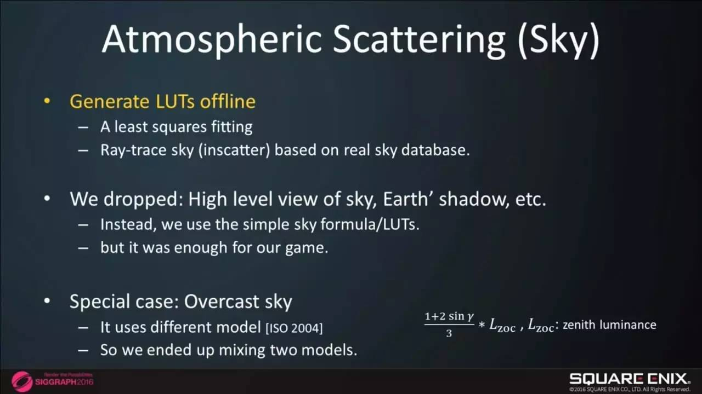

接下里介绍空间透视（aerial perspective），请看下右上的照片，远处的山因为透过率（transmittance）的缘故看不到细节，而变蓝色是因为散射的缘故。透射率是距离的一个指数函数，这个的理论范畴可以看右下的图，理论上不同地方的inscatter系数不同，所以我们用了不同的LUTs来模拟。

FFXV的空间透视散射只在水平方向上散射，是由Mid-ground LUT和Background LUT合并而成，分别作为瑞利散射和米氏散射的组件，然后使用B-spline basis函数把两个LUT做合并。Background LUT是sky LUT的水平部分，用这种方法设计师只能控制mid-ground的颜色。

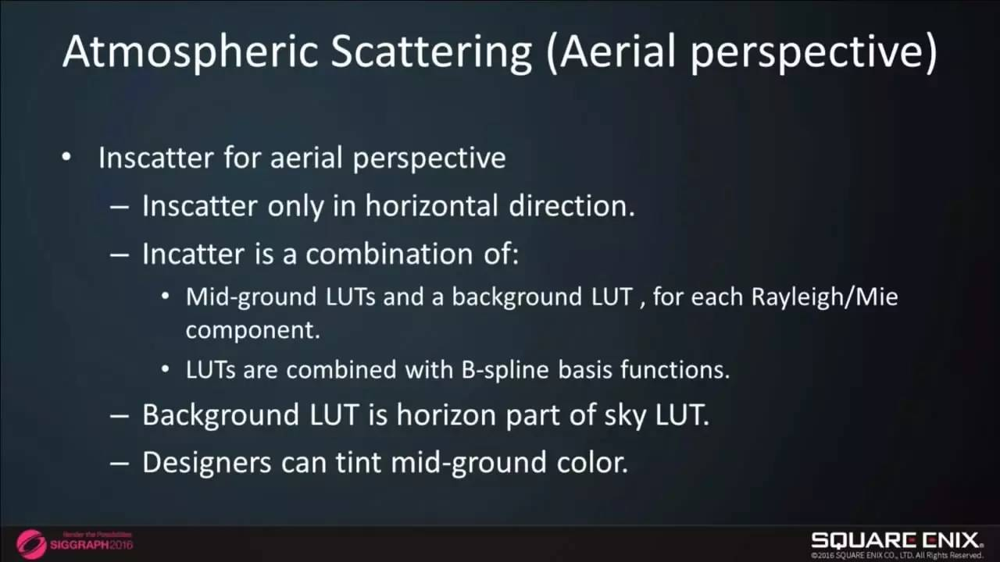

接下来是云，下面的游戏中的一些截图，有不同形状的云，也支持他们之间进行更新转化。

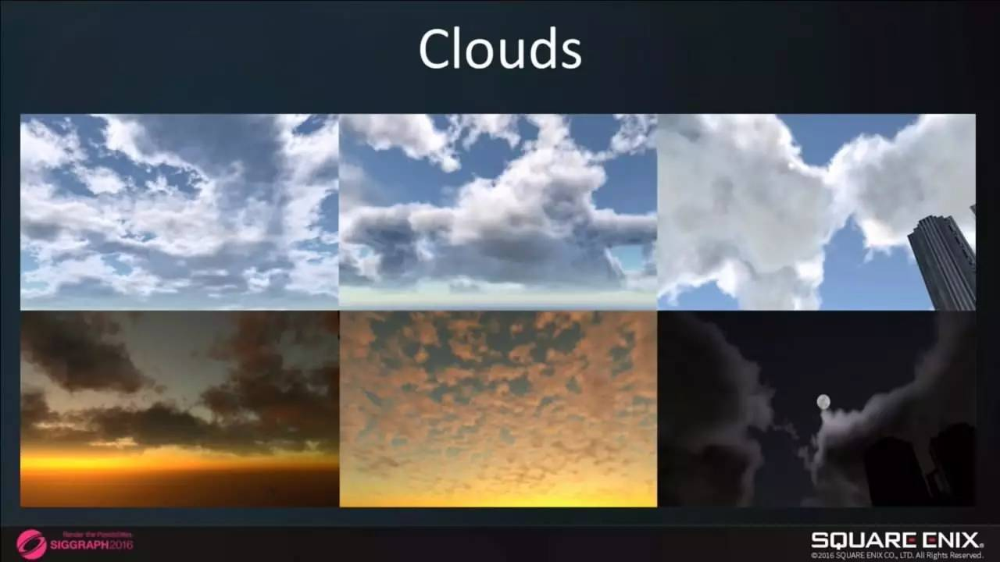

云的范围是在相机位置上面，在用户定义范围内，包括了最高最低的海拔高度和水平半径。密度函数是由7个octaves的噪声（Noise）合并而成，octave有不同的振幅和动画速度，每个都是独立的。Lowest octave给予了粗糙的云的形状，两个Lowest octave给予了云边缘形状的动画，而higher octave提供了云的细节。噪声是通过采样一张小的3D纹理获得。可以通过把大量参数暴露给美术师来制作变化，例如用高度来控制密度。

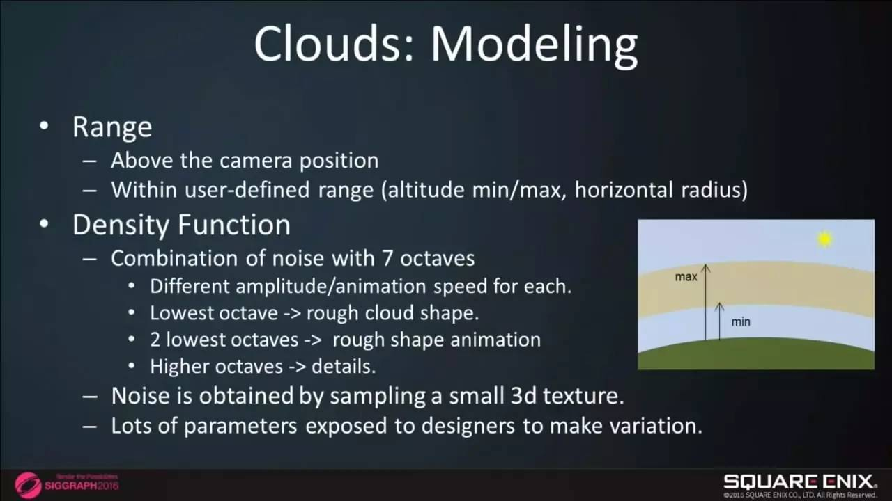

云有3个光照阶段，来自于太阳或月亮光的直接光照，来自上面和下面的环境光。利用ray marching来计算云的不透明度（Cloud opacity），用来这个值把云和sky dome做混合，再把最后的4个结果打包到RGBA8纹理里。这里要注意的是，结果并不是颜色，而是Scalar值。

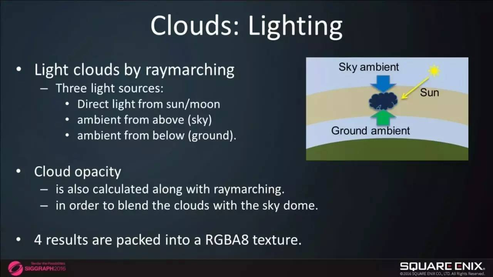

如图所示，直接光照使用的是Single scattering model来进行Ray march，这里没有为太阳光使用第2个ray march，也就图中黄线的部分，并没有进行采样。取而代之的使用了ETM（extinction transmittance map），这个会在后面解释。而Ambient term单纯的就是对半球面的积分，然后认为这个系数保持不变。

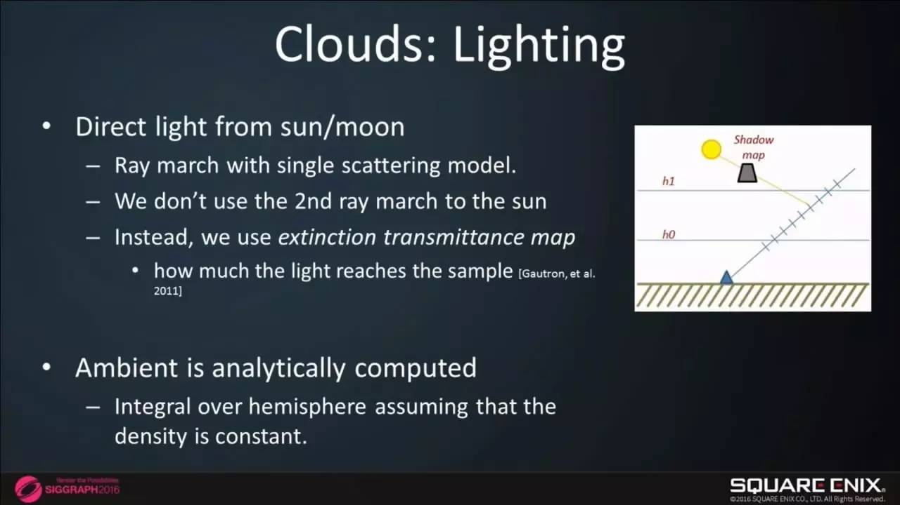

米氏散射方面只考虑一次散射，因为是Single scattering，所以把ray march的散射阶段函数作为系数拆出，这个函数提供了光照的方向性。也就是说，云约接近太阳就越亮一些。

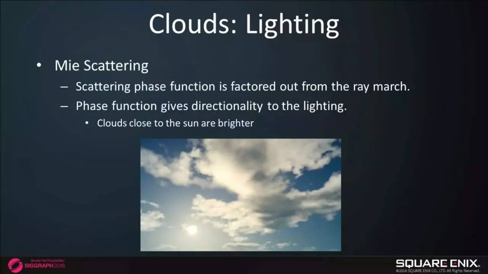

然后就是前面提到的ETM（extinction transmittance map），它主要是用来表现右边图片中那种云的自阴影效果，并且使用ETM可以生成物体表面上云的阴影。ETM实际是沿着太阳光线的透过率曲线，曲线包含了4个值用于离散余弦变化（DCT / Discrete Cosine Transformation），两个值作为曲线的起始点和结束点，这个方法与Fourier Opacity Mapping（POM）很像，最后把这些值pack到两张纹理里。

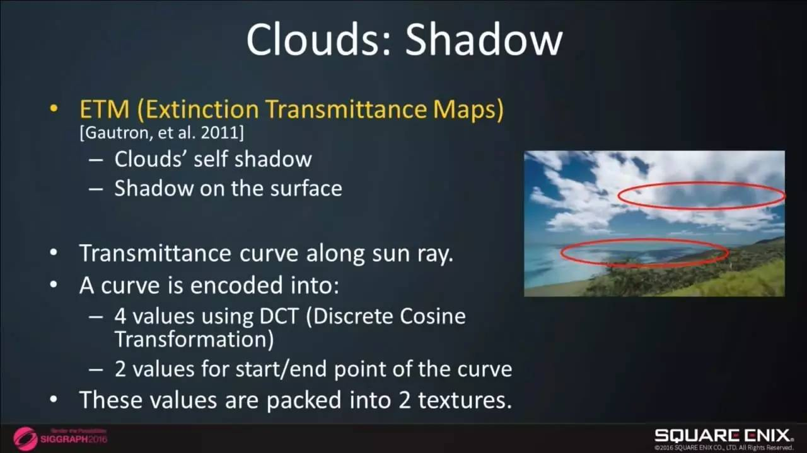

接下来是如何保存数据的，有3张纹理用来保存Raymaching的结果，后面会解释为什么要用3张，地面使用的shadowmap，以及ETM。

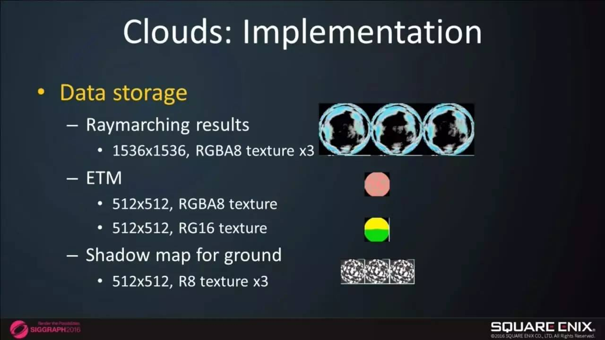

下面的视频中，左上的3个是ray march，然后是ETM，下面的是shadow map。因为ay march消耗很高，那么是通过多帧来分担的，把sky dome分成了64个slice，每帧更新1个slice。ETM是在4帧里完成的。而shadow map相对廉价了，是通过异步来计算的。

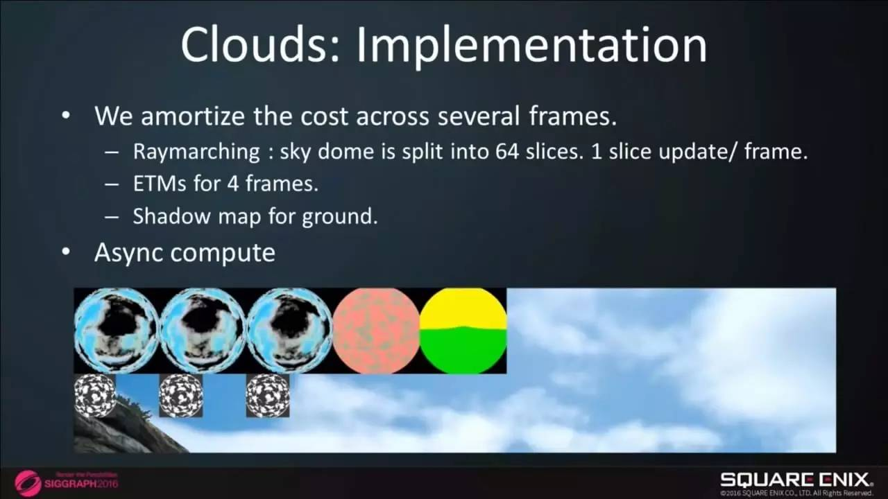

当云的纹理更新完成后，就要把云投射到sky dome上。这里是随着时间混合两个云的raymarch的结果，同时还会有另外一个纹理在进行更新。因为这两个纹理都是静止的，所以在场景里需要风的动画（wind animation）。

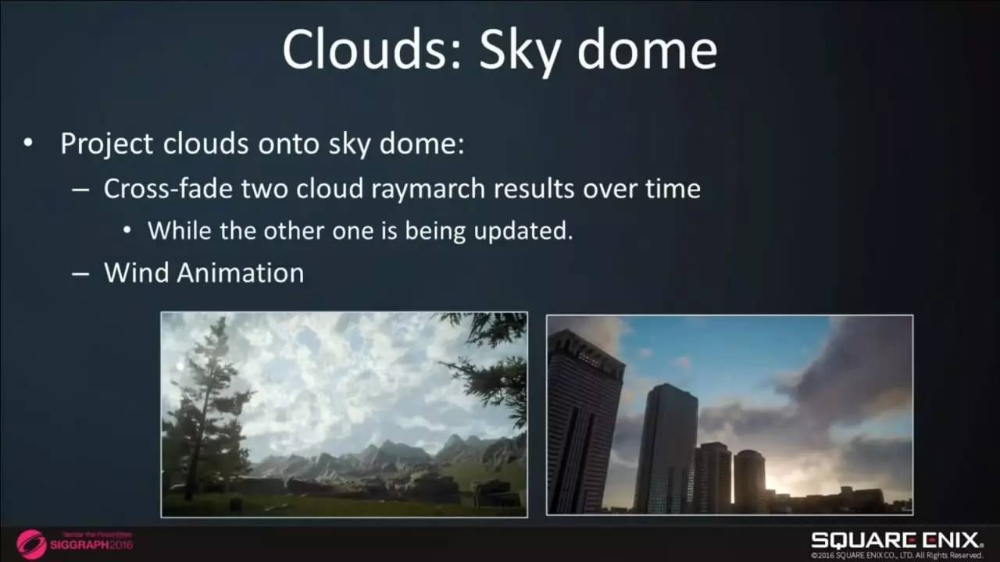

未完待续。。。。。。

近期热文