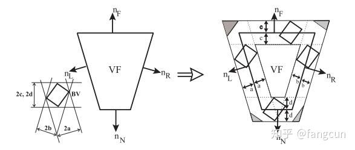
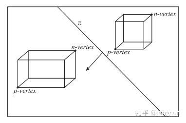
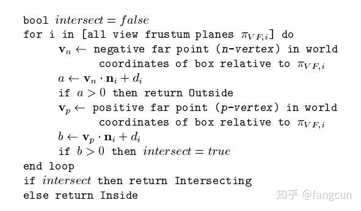
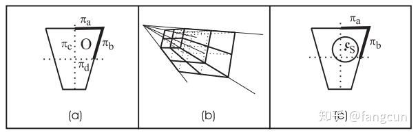
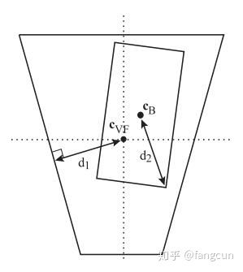
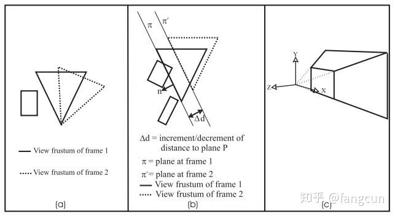
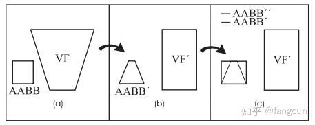

# 视锥体剔除AABB和OBB包围盒的优化方法

https://link.zhihu.com/?target=http%3A//fileadmin.cs.lth.se/cs/Personal/Tomas_Akenine-Moller/pubs/vfcullbox.pdf.gz)

**由于本人才疏学浅，翻译难免有误，望各位不吝惜指正。**

本文给出了视锥体剔除(view frustum culling,VFC)AABB和OBB包围盒的一些优化方法。

## 1.引言

视锥体剔除是经常用在层次包围体上的一种场景剔除方法。层次包围体(bounding  volume hierarchies,BVH)的每个结点包含了一个包围体(bounding  volume,BV)。视锥体剔除遍历层次包围体时，从根结点出发，如果一个结点的包围体处于视锥体之外，就不用再去遍历它的孩子结点，这个结点所包围体物体也不需要再去处理。显然，提高视锥体剔除的效率可以大大减少后期场景的处理压力。

我们在这里给出了多个视锥体剔除AABB和OBB包围盒的优化方法。这些方法利用帧和帧之间变化的一致性，八分测试，标记等技巧来加速视锥体剔除。

我们在双核奔腾Ⅱ200MHz，128Mb的计算机对算法进行了测试。

测试中，我们使用了三种模型：一个有184，000个多边形，3800个场景结点的汽车生产车间模型，一个有167，000个多边形，188个场景结点的汽车车间模型和一个有52，000个多边形，1274个场景结点的汽车生产车间模型。这些模型都来自真实使用的工业应用程序。

测试结果表明，在一定条件下，我们给出的优化方法是其它方法效率的2到11倍。

## 2.视锥体-AABB/OBB相交检测

我们的算法由下面五步构成：

1. 基础相交测试
2. 平面一致性测试
3. 八分测试
4. 标记
5. 平移旋转一致性测试

上面的五步都可以独立地在视锥体剔除中使用。我们可以任意地组合它们。通常，视锥体使用六个平面来定义：

 

 ，其中  是平面的法线向量，   是平面上的任意一点。我们定义当  时，  位于平面  正面。如果一个点位于所有六个平面背面，那么这个点就位于视锥体中。

接下来，我们给出基础相交测试的方法以及优化的具体实现。

## 2.1.基础相交测试

图1：如果一个包围盒的中心位于灰色部分，即使包围盒完全位于视锥体外，测试的结果也会是相交。

视锥体和包围盒的精确测试需要进行的计算量非常大。我们这里使用简化的方法进行测试：对于每个视锥体的平面，测试包围盒和平面的关系，如果在一次测试中包围盒位于正面，说明包围盒位于视锥体外，就可以终止测试。如果包围盒位于所有平面背部，说明包围盒位于视锥体中，其余情况说明包围盒和视锥体的平面相交。需要注意的是进行这个测试得到的结果是一个近似结果，有时测试结果为相交，但实际上包围盒可能完全位于视锥体外(参考图1)。对于测试结果为相交的包围盒，我们继续测试它的孩子结点。对于叶子结点，它具有具体的形状，我们可以采用更加准确的测试，但貌似实际中这样做的好处不大，我们可以跳过进行这种更精确的测试。

使用这个算法，如何确定一个包围盒是否和平面相交是我们首先要解决的问题。很自然，我们会想到使用包围盒的8个顶点与视锥体平面进行测试。但实际上，这样做并不必要，只需要使用离平面最近和最远的包围盒对角线上的两个顶点即可。我们将这两个顶点分别叫做*n-顶点* 和*p-顶点* ，其中，*p顶点* 到平面的有向距离大于*n顶点* 。

图2：p顶点具有比n顶点更大的有向距离

首先，我们将n顶点代入平面公式。如果n顶点位于平面正面，说明包围盒位于视锥体外部，测试结束。否则，测试代入p顶点到平面公式，如果p顶点位于平面背部，说明包围盒完全位于平面背部。其余情况说明包围盒和平面相交。图2是这一过程的一个图示。寻找n顶点和p顶点可以通过9次乘法和3次比较完成，具体做法是：将视锥体平面的法线投影到包围盒的坐标轴上，然后检测投影的x，y，z分量的符号。对于AABB包围盒，它在世界坐标系下是轴对齐的，每一帧开始，我们将视锥体转换到世界坐标系下，这样AABB包围盒和视锥体就处于同一坐标系下，不必再进行视锥体平面法线的投影操作，可以直接使用视锥体平面法线的x，y，z分量的符号，这样我们只需要进行3次比较就可以完成操作。我们可以使用位域来存储x，y，z分量的符号，负号用0表示，正号用1表示，我们可以使用位域信息从一个我们组织好的查询表中直接获得p-顶点，从而避免使用条件分支，提高CPU的预测执行命中率。如果查询表的顺序组织得当，我们甚至可以通过反转位域获得n-顶点。

如果我们需要测试多个AABB包围盒(这是最常见的情况)，可以利用所有AABB包围盒的都是坐标轴对称这一特征，在每帧提前计算出每个视锥体平面指示n顶点和p顶点的位域。

我们用来检测包围盒与视锥体相交的代码在图3中给出。

图3 剔除AABB包围盒和OBB包围盒的基础测试算法伪代码

## 2.2.平面一致性测试

进行这一测试是为了利用剔除操作的一致性特征。假设一个结点在上一次的视锥体测试中位于其中一个视锥体平面正面。如果视锥体进行微小地移动，这一结点在这一次测试中仍有很大的概率完全位于视锥体外，应该首先进行可以快速剔除的这一结点的视锥体平面测试。具体可以这样做，如果在上一次检测，结点的包围体位于某个视锥体平面的正面，就将这一平面对应得索引缓存在这一结点中。下次测试时，可以优先测试缓存索引对应的视锥体平面进行快速排除，如果无法排除继续检测其它视锥体平面。

我们按照这样的顺序测试视锥体平面：左平面，右平面，近平面，远平面，上平面和下平面。这一顺序并非实验得到的最佳顺序。

## 2.3.八分测试

如果对视锥体沿每个轴的中间部分进行切分，可以将视锥体切分为8部分。我们将切分的每一部分称为一个象限。

图4：(a)切分操作的二维视图。(b)被切分为8部分的视锥体。(c)根据对称性，对于包围球检测一个象限的三个外平面即可判断相交性。

如果我们的视锥体是对称的(一般情况下都是这样)，对于包围球来说，只需要将它和最近的三个外平面进行测试就可以根据对称性，判断它和视锥体的相交性(参考图4)。如果包围球位于三个离它最近的外平面背部，那么显然整个包围球就位于视锥体中。如果它位于任意一个视锥体平面的正面，那么它就完全处于视锥体外，其余情况下，说明包围球和视锥体相交。

上面对于包围球的测试可以扩展到一般的包围体，具体参考[Assarsson99]。使用八分测试来检测包围盒，需要包围盒满足它的中心到它的顶点距离必须小于视锥体中心到视锥体平面的最小距离(参考图5)，满足这一性质后，包围盒如果没有和离它最近的三个视锥体平面(一个象限的外平面)相交，也就不会和其它象限的外平面相交。

这里的视锥体中心是指视锥体的8个顶点之和除以8得到的坐标位置。

确定象限的代价约等于一次平面/包围盒相交检测。

图5

 包围盒中心

 视锥体中心

 视锥体中心到离它最近的视锥体平面的距离

 包围盒中心到包围盒顶点的距离

如果  ，我们可以对包围盒使用八分测试。

## 2.4.标记

假设一个结点的包围体位于视锥体的一个平面背部，那么它的所有子结点显然也全部位于这一平面背部，我们可以对这一平面进行标记，在检测结点的孩子结点时不再对这一平面进行检测。

遍历场景图时，将一个标记有哪些平面需要检测，哪些平面不需要检测的掩码(位域)从父节点传递到子结点。这里使用的掩码是一个系列的二进制位用来表示视锥体的平面是否还需要测试，如果视锥体的一个平面对应的二进制位为0，就不再检测这一平面，否则对这一平面进行检测。通过这一方法，可以避免检测通过父节点已经可以判定结果的平面。

直接对低级多边形进行剔除，代价非常大[Bishop98]，通常对低级多边形的剔除是渲染前的最后一道工序，如果已经可以确定孩子结点位于视锥体内，那么可以减少大量不必要的低级多边形剔除，从而大大提升效率。

## 2.5.平移旋转一致性测试

这一优化方法利用三维世界中的物体移动是通过绕轴旋转和平移进行这一特性。对于上一帧没有移动的物体，满足下列属性：

1. 如果在上一帧时，包围体位于视锥体的左平面正面，在这一帧时，视锥体向右旋转，并且旋转角度小于(180度-左平面和右平面之间的角度)，那么显然这一帧包围体仍然位于视锥体的左平面正面。这里的旋转指的是绕x轴，y轴和z轴旋转(参考图6a)。
2. 如果视锥体相对于上一帧而言，只做了平移操作，那么所有包围体到同一个视锥体平面的距离都增加或减少一个固定量  (参考图6b)。  每个视锥体平面每帧可以只计算一次。具体可以通过投射平移到平面法线完成。对于每个进行测试的包围体和视锥体平面，我们将对应的  和上一帧的包围体到平面的距离进行比较，从而得出相交性。

图6：(a)旋转视锥体。一个不会移动的物体的包围体在帧1时位于视锥体外，根据旋转的方向，在帧2时，这一物体仍然位于视锥体外。(b)平移视锥体。(c)视锥体和它的局部坐标系。

对于属性2，我们需要向包围体的结构体中添加成员变量来存储包围体到每个视锥体平面的距离，还需要添加一个指示包围体是否被测试过(否则距离没有被计算过，也就没法进行距离比较，得出相交性，我们需要使用其它方法进行测试)。

许多游戏和应用程序可以利用平移旋转一致性测试获得巨大的效率优化。在一些渲染系统，窗口以一个固定的频率进行重绘，而不是在相机移动时才进行重绘，对于这些渲染系统，如果两次绘制时的视锥体没有发生改变，我们可以利用这一优化方法减少大量计算。

## 3.实验结果

每种优化方法都经过了测试，确定可以提升视锥体剔除的效率。这里给出的实验结果是视锥体剔除效率较之前的倍数，并非总的渲染时间。

我们的实验是在奔腾Ⅱ  200MHz 128Mb RAM的机器上进行的，比较的对象Direct  Model的视锥体剔除算法。被我们用来测试的模型有：一个有184，000个多边形，3800个场景结点的汽车生产车间模型，一个有167，000个多边形，188个场景结点的汽车车间模型和一个有52，000个多边形，1274个场景结点的汽车生产车间模型。

我们测试了四个不同的使用场景：第一个场景，模拟真实的用户操作视锥体进行测试。第二个场景，每帧进行平移和旋转，然后进行视锥体测试。第三个场景，只进行旋转，然后进行视锥体测试。第四个场景，只进行平移，然后进行视锥体测试。每种场景，都进行了大约一百万次包围盒/视锥体相交性检测。

下面汇总了实验得出的优化组合：

- 对于对称的视锥体，我们的优化方法效率是比较对象的2.4到9.0倍，具体采取的优化组合是：平面一致性测试，八分测试和平移旋转一致性测试。测试中，优化方法对于只进行旋转的场景表现最好。
- 对于一般的视锥体(对称和非对称)，我们的优化方法效率是比较对象的2.2到11.0倍，具体采取的优化组合是：平面一致性测试和平移旋转一致性测试。没有使用八分测试的原因是对于非对称的视锥体无法使用八分测试。测试中，优化方法对于只进行平移的场景表现最好(对于任意视锥体)。

实验中，我们使用的AABB包围盒，对于OBB包围盒(使用代价相比AABB包围盒只提高了一点，几乎可以忽略不计，但包围盒比AABB紧凑太多)，应该会有更好的表现。对于AABB包围盒，我们可以在每一帧预先计算出它们的*n顶点* 和*p顶点* 对应在查询表中的索引，而不是对每个包围盒重新计算，这样可以得到5-10%的效率提升。对于只进行平移的操作，我们的优化方法可以获得最佳的效率提升，对于同时进行平移和旋转操作，我们的优化方法效率提升最小。标记优化方法带来的提升相比其它优化方法毫无竞争力。

基础相交测试的效率是比较对象的2.0到3.7倍，除此之外的效率提升是其它优化方法的贡献。也就是说优化方法加速相交测试达到基础相交测试效率的1.2到3.0倍。

对于单独的一次包围体/视锥体相交测试，比较对象的算法实现有时表现得比我们的好。这种情况占比大概在整个相交测试中约为0.2%，换句话说99.8%的情况下，我们的算法更快。这种情况可能是缓存命中失败或分页错误导致的。

## 4.相关研究

查阅以往的文献，我们发现有两种常见的视锥体剔除方法。一种是将包围体和视锥体变换为AABB包围盒，然后进行相交性测试(参考图7)。这种方法的缺点是变换需要对包围体的8个顶点进行视图和投影变换，这一过程至少需要72次乘法。我们用来进行比较的算法采用的就是这一剔除方法。

图7：(a)视锥体和一个AABB包围盒。(b)同一个视锥体和AABB包围盒变换后的形态。(c)使用AABB包围盒将变换后的AABB包围盒再次包围。

另一种视锥体剔除方法是对包围体和视锥体的6个平面进行测试，这也是我们这里使用的方法。这一方法的优点是可以进行很多拒绝/接受测试。代价低的测试失败了，可以继续进行代价高，更精确的测试，可以在早期排除大量的计算。在这里，为了更好的效率表现，我们没有更进一步地进行更加精确的测试。

视锥体剔除可以通过BSP树获得加速，但缺点是BSP树只能用来表示静态场景。

Slater  et al.  [Slater97]给出了一个优化缓存命中的视锥体剔除算法。他通过组合单纯的旋转和单纯的平移操作(可以通过空间一致性进行优化)对算法进行了测试，得到与我们的算法相差不大的性能提升。但我们的算法可以在同一帧中进行旋转和平移操作时得到性能提升，并且，我们的算法不会将任何在视锥体内的剔除掉，对于包围体也没有任何额外的调整措施，而Slater的算法则可能错误地将不应该剔除的物体剔除掉，并且需要设置额外的椭球参数。

## 5.总结与展望

我们在这里给出了视锥体剔除的优化方法，并且通过实验得出了在不同场景下应该如何组合这些优化方法。

所有给出的优化方法，包括基础相交测试，可以使用在任意的包围体上，但这里，我们只分析了使用AABB包围盒，OBB包围盒和包围球的情况。由于包围球/平面测试代价非常小，我们的优化对效率提升不大。具体信息，可以参考[Assarsson99]。

除了八分测试和视锥体移动后的一致性测试，我们还没有利用视锥体的近平面和远平面是平行的这一特性，我们可以在基础相交测试中使用这一特性，将近平面和远平面作为一对平行的平面，而不是当作两个独立的平面，可以减少至少6次乘法和2次n顶点和p顶点的计算。在这里，我们没有这样做的原因是我们没有找到将这一措施加入算法，并且不会降低其它部分效率，以及代码美观度的简单方法。

如果一个包围体既不完全位于任一视锥体平面正面，也不完全位于所有视锥体平面背部，我们可以缓存包围体相交的平面，在下一次测试时，优先测试这些平面。

我们还可以修改算法使用DOP作为包围体。或许可以利用它平行特性。然而，寻找n顶点和p顶点以及从DOP中心到特定方向的最大延申代价很大，需要找到一个高效的方法。

由于测试AABB包围盒和OBB包围盒的代价相差不大，显然测试OBB包围盒层次结构是否快于AABB包围盒层次结构是非常令人关心的。

## 参考文献

[Assarsson99]  Ulf Assarsson and Tomas M oller, \Optimized View Frustum Culling  Algorithms", Technical Report 99-3, Department of Computer Engineering,  Chalmers University of Technology, March 1999.

[Bishop98] Lars  Bishop, Dave Eberly, Turner Whitted, Mark Finch, Michael Shantz,  \Designing a PC Game Engine", Computer Graphics in Entertainment, pp.  46{53, January/february 1998.

[Chin95] Norman Chin, \A Walk through BSP Trees", Graphics Gems V, Heckbert, pp. 121{138, 1995.

[Clark76]  James H. Clark, \Hierarchical Geometric Models for Visible Surface  Algorithm", Communications of the ACM, vol. 19, no. 10, pp. 547{554,  October 1976.

[CrusNeira93] Carolina Cruz-Neira, Daniel J. Sandin,  Thomas A. DeFanti, \Surround-screen Pro jection-based Virtual Reality:  The Design and Implementation of the CAVE", Computer Graphics (SIGGRAPH  '93 Proceedings), pp 135-142, volume 27, aug, 1993.

[Donovan94]  Walt Donovan, Tim van Hook, \Direct Outcode Calculation for Faster Clip  Testing", Graphics Gems IV, Heckbert, pp. 125{131, 1994.

[DirectModel] DirectModel 1.0 Speci cation, Hewlett Packard Company, Corvalis, 1998

[Greene94]  Ned Green \Detecting Intersection of a Rectangular Solid and a Convex  Polyhedron", Graphics Gems IV, Heckbert, pp. 74{82, 1994.

[Green95] Daniel Green, Don Hatch, \Fast Polygon-Cube Intersection Testing", Graphics Gems V, Heckbert, pp. 375{379, 1995.

[Haines94]  \Shaft Culling for Ecient Ray-Traced Radiosity", Eric A. Haines and  John R. Wallace, Photorealistic Rendering in Computer Graphics  (Proceedings of the Second Eurographics Workshop on Rendering),  Springer-Verlag, New York, pp.122{138, 1994, also in SIGGRAPH '91  Frontiers in Rendering course notes.

[Hoff96a] K. Hoff, \A Fast  Method for Culling of OrientedBounding Boxes (OBBs) Against a  Perspective Viewing Frustum in Large "Walktrough" Models", [http://www.cs.unc.edu/](https://link.zhihu.com/?target=http%3A//www.cs.unc.edu/) hoff/research/index.html, 1996.

[Hoff96b] K. Hoff, \A Faster Overlap Test for a Plane and a Bounding Box", [http://www.cs.unc.edu/](https://link.zhihu.com/?target=http%3A//www.cs.unc.edu/) hoff/research/index.html, 07/08/96, 1996.

[Hoff97] K. Hoff, \Fast AABB/View-Frustum Overlap Test", [http://www.cs.unc.edu/](https://link.zhihu.com/?target=http%3A//www.cs.unc.edu/) hoff/research/index.html, 1997.

[Klosowski97]  J.T. Klosowski, M. Held, J.S.B. Mitchell,H. Sowizral, K. Zikan  \Efficient Collision Detection Using Bounding Volume Hierarchies of  k-DOPs" , [http://www.ams.sunysb.edu/~jklosow/projects/coll](https://link.zhihu.com/?target=http%3A//www.ams.sunysb.edu/~jklosow/projects/coll) det/collision.html, 1997.

[Slater97]  Mel Slater, Yiorgos Chrysanthou, Department of Computer Science,  University College London, \View Volume Culling Using a Probabilistic  Caching Scheme" ACM VRST '97 Lausanne Switzerland, 1997.

编辑于 2019-02-02
