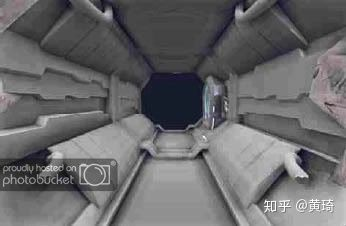
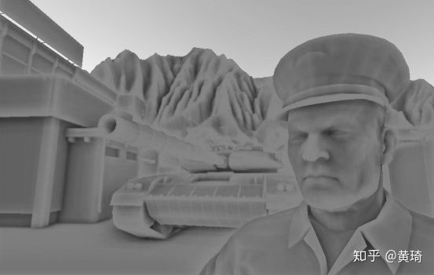
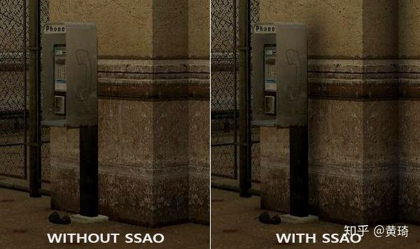
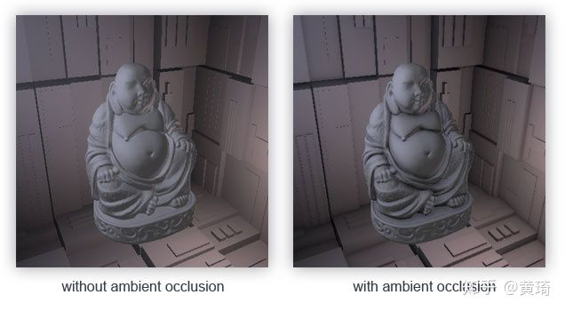
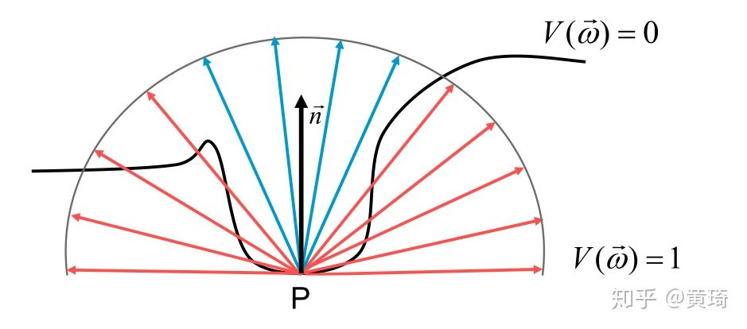
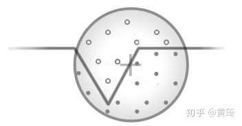
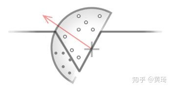
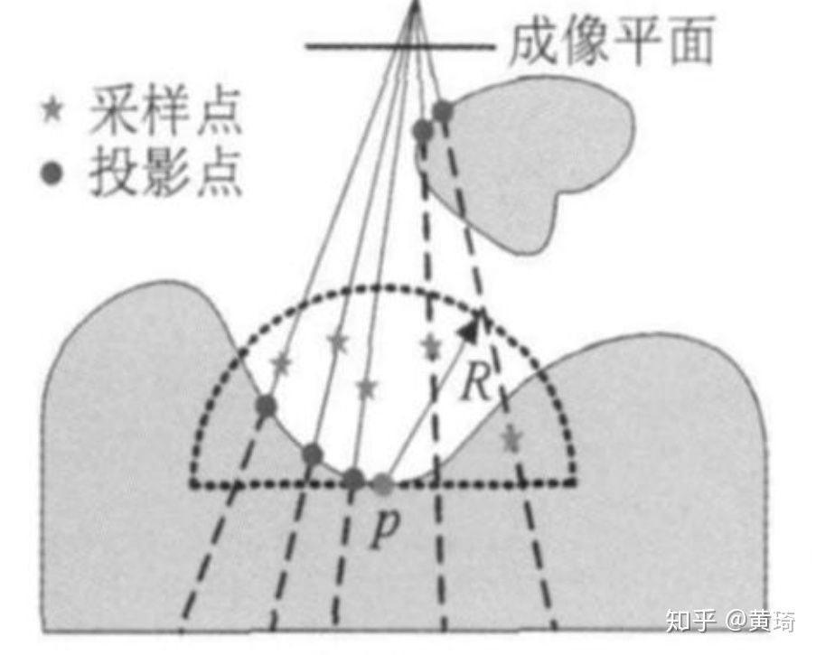

# 环境遮罩之SSAO原理

在计算机图形学中全局光照的效果直接影响画面的真实性。使用传统的基于物理的关照算法(例如光线跟踪算法 )可以达到很好的效果但是技术计算复杂 ，难以实时，其计算复杂难以做到实时应用 。所以在游戏等实时应用中一般选用环境光遮蔽 (AO)技术模拟全局光照效果，在画面质量和渲染速度之间取得平衡 。

**上文总结**：

1. 环境光照是我们加入场景总体光照中的一个固定光照常量，它被用来模拟光的**散射(Scattering)**。在现实中，光线会以任意方向散射，它的强度是会一直改变的，所以间接被照到的那部分场景也应该有变化的强度，而不是一成不变的环境光。
2. 其中一种间接光照的模拟叫做**环境光遮罩(Ambient Occlusion)**，环境遮罩用来近似室外的柔软照明（天光）,它的原理是通过将褶皱、孔洞和非常靠近的墙面变暗的方法近似模拟出间接光照。这些区域很大程度上是被周围的几何体遮蔽的，光线会很难流入，所以这些地方看起来会更暗一些。站起来看一看你房间的拐角或者是褶皱，这些地方会看起来有一点暗。

当我们简单了解了这个东西是干什么的用的之后，我们将简单的回顾一下AO技术的发展历史，让我们能够更加梳理足够完整的知识体系融入自己的知识树中。

并且我们在本文中**只考虑**出现SSAO之前的一些大事件。

## **一.环境遮罩技术发展史**

1. 1998年，zhukov等人提出利用场景表面的可见点发射射线，判断与周围物体的相交情况，计算点与周围物体的遮挡关系模型
2. 2002年，Landis在zhukov等人提出的模型基础上，改进遮挡的计算方式，称作AO，计算效率得到大幅提升
3. 2004年NVIDIA公司根据AO的原理，预计算AO值， 存储在三维网格之中并通过检索相应值使用
4. 2005年，Kontkanen等人提出对每个遮挡物，提前计算一个空间区域，利用场景上点的相关信息，近似表示可见点被遮挡的比例，提升执行效率
5. 2007年，Shanmugam等人在AO思想的基础上，结合硬件加速的方法，将AO分解为高频的AO和低频的AO进行计算。与大多数技术不同，此方法产生的结果类似于基础的AO计算。这种方法中，AO分为两个阶段，一个用于高频细节，另一个阶段用于低频细节，具有更广泛的搜索。第二阶段尤其令人感兴趣，它允许大型物体在通过时彼此遮挡。

2007年，Crytex游戏公司**最先提出SSAO理论改进AO计算.**Crytek的Martin Mittring在Siggraph 2007的演示中展示了该技术。只需计算可视区域场景的几何物体之间的位置遮挡关系．这种方法不仅适用于静态场景，更适用于各种动态场景，极大地提高AO计算的实时性

> 我们的一位富有创意的程序员想要使用我们已经拥有的z缓冲区数据用于计算某种环境遮挡的纹理。这个想法很吸引人，因为所有的不透明物体，在没有无特殊情况下，都可以在恒定时间内处理内存数据。 我们还可以在许多地方消除复杂度。 我们现有解决方案虽然工作但是我们遇到了处理各种动态情况的问题。

他们的结果

## **二.什么是SSAO（屏幕空间环境光遮罩**）

基于顶点的AO技术在模型表面顶点足够密的情况下，能够得到很好的效果。但是基于物理精确的 AO 计算需要进行光线与场景的求交运算 , 十分耗时 ，所以这种方法只能用于离线渲染。

为达到实时计算的目的，提出基于屏幕空间的环境遮挡技术，对每个像素的邻域进行随机采样快速计算AO的近似值。

屏幕空间环境光遮蔽 (SSAO)是实际应用较多的一种AO算法。该算法可以在实时运行的条件下较为逼真的模拟全局光照的渲染效果。

由于所有的计算都发生在屏幕空间,所以也叫做屏幕空间环境光遮罩。 即在屏幕空间上进行

AO 计算 , 并用深度缓存上的深度比较来代替光线求交 .

## **2.1 SSAO特点**

- 独立于场景复杂性，仅和投影后最终的像素有关，和场景中的顶点数三角数没有关系
- 跟传统的AO处理方法相比，不需要预处理，无需加载时间，也无需系统内存中的内存分配,所以更加适用于动态场景。
- 对屏幕上的每个像素以相同的一致方式工作。
- 没有cpu使用 - 它可以在GPU上完全执行。
- 可以轻松集成到任何现代图形管道中。

**跟普通的AO处理相比，它可以作为后处理效果出现。**

## **2.2 SSAO的原理解析**

**基本思路：**把当前视点下的深度缓存当成场景的一个粗略的近似来计算AO , 因为它们都是基于场景在屏幕空间的一个特定表达 , 而 AO 计算也是在屏幕空间中进行的 。

## 2.2.1名词解析Ambient occlusion（AO）

之前总说AO，那么AO到底代表着什么呢？又怎么计算呢

AO ：是通过在场景中的点上产生一个标量值来描述由这点向各个方向出射的光线被遮挡的概率 , 这个标量值可以用来产生全局的遮挡效果 , 并为用户提供关于场景中物体之间的位置关系和物体表面的起伏情况的重要视觉信息 。计算 AO 可通过在半球面上对可见性函数的积分来得到 , 定义为 ：

其中，这个式子是一个方向积分

1. Ω是 p 点朝向法线方向的半球面上的方向集合
2. d(ω ) 是 p 点到其沿ω方向与场景的第一个交点的距离
3. V( ω) 是距离衰减函数衰减函数从 1 开始衰减并在某个固定距离下衰减到 0

## 2.2.2为什么要选取屏幕空间进行计算

使用上述这种计算方法计算AO的开销当然是相当可观的 , 最主要的原因在于光线跟踪计算的全局性 , 它要求在每个 p点对场景进行某种形式的遍历并计算光线与场景的交点 . 对于像游戏这类实时性要求很高的交互式三应用中的 AO 绘制 , 显然需要更高效的算法 。

**而SSAO 算法将深度缓存当成场景的一个粗略的近似并用深度比较代替光线求交来计算 AO**

## **2.3 SSAO的基本步骤**

1. 对屏幕空间内每一个像素计算其在三维空间里的位置 p, 执行下列步骤 :

- 在以 p 点为中心、 R 为半径的球体空间内( 若有法向缓存则为半球体空间内 ) 随机地产生若干三维采样点

通过在法向半球体(Normal-oriented Hemisphere)周围采样，它消除了环境光遮蔽灰蒙蒙的感觉，从而产生更真实的结果

- 估算每个采样点产生的 AO : 计算每个采样点在深度缓存上的投影点 , 用投影点产生的遮蔽近似代替采样点的遮蔽 .

- 对于投影点的遮蔽 , 不同的 SSAO 算法使用了不同的计算方法 . **最简单的方法**是直接利用投影点跟 p 点深度值差异计算遮蔽大小, 但这会带来自身遮蔽等走样问题 . 一种改进方法是引入法向缓存 , 使得所有采样点都在 p 点上方 , 并利用采样点跟投影点的深度差异计算遮蔽大小
- 计算所有采样点的平均遮蔽 .

2.当采样点较少时进行必要的降噪处理

**SSAO改进方向**

基于屏幕空间的AO算法通过在屏幕空间进行随机采样，并根据采样点的空间分布来估算AO因子。

由于所有的计算都发生在屏幕空间，因此这类算法的执行效率非常高，但在计算的精度上，却难以和基于顶点的ＡＯ计算相比。

同时，由于视点移动以及随机采样等因素，基于屏幕空间的ＡＯ算法往往需要使用平滑滤波的方式来消除采样较少或不足所产生的噪点。

综上所述，基于屏幕空间的ＡＯ算法以牺牲部分渲染效果和精度的代价，来换取实时渲染