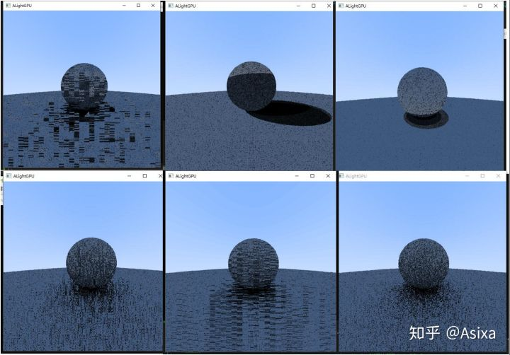
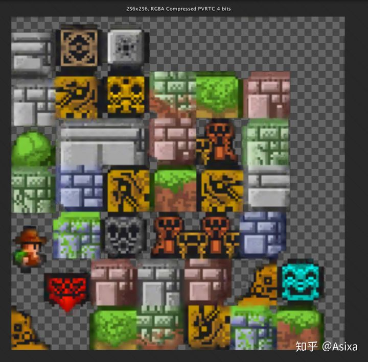

# (转)基于CUDA的GPU光线追踪

https://zhuanlan.zhihu.com/p/55855479

[](https://www.zhihu.com/people/asixa)

[Asixa](https://www.zhihu.com/people/asixa)

CS美本大一/图形学萌新/编译学围观


先放最终效果：

<iframe allowfullscreen="" src="https://www.zhihu.com/video/1073144630408941568?autoplay=false&amp;useMSE=" frameborder="0"></iframe>

实时光线追踪


十天前我打算用我之前的CPU渲染器渲染一张博客封面，大概是这张。


我之前的渲染器是使用C#写的，已经进行过多线程优化。但是为了渲染这张图我坐等两个多小时(7680*1159, i7-8700k)。坐等的时候我便决定，我要搞GPU渲染器...

之前有几位大佬使用OpenGL，Vulkan，Unity等用Shader的方式实现了GPU光线追踪:

Ubp.a：基于OpenGL的GPU光线追踪

zhuanlan.zhihu.com

ycz：【PathTracing】实时光线追踪和BSSRDF的那些事

zhuanlan.zhihu.com

但是我这里为了学习并行计算使用的是CUDA。本文并不是一个教程，因为光线追踪部分与下面文章重复了。本文的重点是分享一些CUDA编写光线追踪渲染器时候遇见的一些坑。

破晓：【翻译】两天学会光线追踪（一）

zhuanlan.zhihu.com

Asixa：《一周学习光线追踪》（一）序言及动态模糊

zhuanlan.zhihu.com

------

关于CUDA可以看看这里  [我是小将：CUDA编程入门极简教程](https://zhuanlan.zhihu.com/p/34587739)。简单地说，CUDA可以同时启动上千万个线程(Kernel)进行并行计算。但是CUDA的Kernel需要注意以下问题。

## CUDA值得注意的特性(坑)

## 0.**传递数据**

CUDA在从内存传数据到显存的时候使用的是cudaMalloc和cudaMemcpy, 对象中以指针储存的字段都需要单独复制一遍。所以这个在传递二叉树和派生类的时候可能会有一些棘手。

1. **不支持递归**

由于GPU的目的是高并行运算，所以GPU的计算单元并没有CPU那么强的计算能力。最明显的一点就是GPU的Kernel的栈深度无法支持递归，经测试Kernel递归三四次后在就会崩掉... 

解决办法就是讲所有递归代码改成循环。比如光线追踪射线采样，BVH查找这些高度依赖递归的函数都需要改成循环。

\2. **不支持虚函数**

比如B类继承自A，A类中定义了一个虚函数(Virtual   function)，而B类中覆盖(override)了这个函数。且B对象是在CPU端创建的(从Host创建)。那么在GPU上调用B的这个函数时，程序就会卡死。而且是那种用任务管理器,taskkill  都关不掉的卡死。

解决办法是在GPU端创建这个对象B(从device创建)，我的写法是在B类中声明一个构造函数，参数是B*, 然后初始值全都从这个指针中取。在Host中的对象传到Device后重新构建一遍对象，这可能有一丢丢慢，但每次渲染只需要构建一次。

\3. **不支持STL，**但支持thrust

最开始在我构建BVH树的时候我是在GPU上构建的，因为懒得传二叉树。而这样做的弊端不仅是GPU的一个线程计算力远低于CPU。并且GPU不支持STL的qsort, Vector<T>. 无法排序就无法构建BVH。

但是英伟达提供了[thrust](https://link.zhihu.com/?target=https%3A//developer.nvidia.com/thrust)库，理论上可以在GPU端上代替STL。

\4. **显存层级**

GPU上的显存共分为三个层级，Global Memory, Shared Memory, Local Memory.

读取耗时方面，L存 < S存 <<G存  <<  内存。

 local memory是最快的，但是需要注意一个问题，每个Kernel的local memory大小是650000字节，如果使用量超过了这个量，就会崩溃。

5.**在Device慎用 new，malloc** 

这两个操作是在Device端创建一个Global Memory，这个弊端是很慢。我相信每个使用GPU加速的程序都是对效率敏感的。

\6. **异常处理**

可以在每次调用完Kernel写

```cpp
auto error = cudaGetLastError();
if(error!=0)printf("error %d\n", error);
```

来检测有没有Error抛出。（我每次使用Nsight调试整个电脑就会崩，可能是我自己的问题）

而在我写渲染器的时候出现最多的是Error 77“内存越界”，一般的内存越界很容易避免，但是我依然遇到很多很迷的崩溃然后抛出Error77，据我猜测应该包含但不限于以下两种情况：

- kernel栈溢出

前面说过，Kernel的栈深度并不够用，第一种解决办法是消除递归，减少函数相互调用等。第二种是 将项目从Debug模式改成Release模式，这样编译器的优化就会发挥作用。

- Local Memory超过了极限,

将不需要的对象及时的free掉，或者使用`cudaDeviceSetLimit`API设置最低Local Memory大小。

\7. **随机数**

在之前的项目中我的随机数使用的是drand48()，但是CUDA提供了一个更高效的随机数生成器curand。

curand提供多种随机数序列。我用的最多的是最普通的curand_uniform，在我的光线追踪采样中，我确保每个像素的采样序列都不一样，不然就会出现很多奇怪的效果




我为每个像素都创建了一个currandState

```cpp
//Host
#include <curand_kernel.h>
//...

curandState *d_rng_states = nullptr;
cudaMalloc(reinterpret_cast<void **>(&d_rng_states), height * width * sizeof(curandState));
```

而种子方面，使用像素的唯一id。

```cpp
//Device
const auto tidx = blockIdx.x * blockDim.x + threadIdx.x;
const auto tidy = blockIdx.y * blockDim.y + threadIdx.y;
curand_init(seed + tidx + tidy * d_width, 0, 0, &rngStates[tidx]);
```

这样在每次调用

```cpp
curand_uniform(&rngStates[tid])  //tid = tidx + tidy * width
```

就可以生成一个0~1的随机浮点数了。

**7. 纹理**

在CPU渲染器中我使用byte[] 储存的纹理信息，如果在Cuda中也使用 unsigned char* 的话，会消耗很多的Global Memory，并且最重要的是，Global Memory很慢。

幸运的是Cuda提供了一个Texture解决方案，这个Texture储存在一个特定的显存区域可以极大地提高读取速度。

在Cuda的示例 0_Simple/simpleTexture项目中，项目实现了一个简单Texture，这个Texture通过绑定到了一部分显存提供更快的读取。甚至不需要传递指针到kernal即可当全局变量使用。

但是有两个问题：

第一个问题，这个Texture不能是数组或者指针数组。也就是说Texture的数量在编译的时候就是写死的。

解决方案：1. 将所有的纹理都合并到一张Atlas，这理论上是最快的，效果大概是这样:


图自Unity Form by gary_bbgames

第二个方案是使用Texture的BindlessTexture功能，这个在CUDA的示例 2_Graphics/bindlessTexture项目中有实现。而我采用的就是这种方法。

CudaTexture第二个问题是如何绑定RGB三通道，示例项目中的颜色通道只有一个，并且值类型是float，我尝试使用uchar3类型来储存三个RGB值但是没有成功。我最后使用的是LayeredTexture来创建三个层,代码在Cuda示例  0_Simple/simpleLayeredTexture项目。我不确定这是否是创建三通道纹理的最优方法，如果有其他写法，请让我知道谢谢。

三通道纹理的缓冲有点奇怪，是这样的，在创建之前需要修改一下。

```text
//类型float
RRRRRRRRRRGGGGGGGGGGBBBBBBBBBB
```

下面附Texture相关代码

```cpp
//Host
inline void InitTextureList()
	{
		for (auto i = 0; i < TEXTURE_COUNT; i++) {
			//读取纹理，使用了stb_image库
			int width, height, depth;
			const auto tex_data = stbi_load(imageFilenames[i],&width, &height, &depth, 0);
			const auto size = width * height * depth;
			float* h_data = new float[size];
			printf("LoadTexture %d,%d,%d\n", width, height, depth);
			for (unsigned int layer = 0; layer < 3; layer++)
				for (auto i = 0; i < static_cast<int>(width * height); i++)h_data[layer*width*height + i] = tex_data[i * 3 + layer] / 255.0;

			//cudaArray Descriptor
			cudaChannelFormatDesc channelDesc = cudaCreateChannelDesc(32, 0, 0, 0, cudaChannelFormatKindFloat);
			//cuda Array
			cudaArray *d_cuArr;
			cudaMalloc3DArray(&d_cuArr, &channelDesc, make_cudaExtent(width, height, 3), cudaArrayLayered);


			cudaMemcpy3DParms myparms = { 0 };
			myparms.srcPos = make_cudaPos(0, 0, 0);
			myparms.dstPos = make_cudaPos(0, 0, 0);
			myparms.srcPtr = make_cudaPitchedPtr(h_data, width * sizeof(float), width, height);
			myparms.dstArray = d_cuArr;
			myparms.extent = make_cudaExtent(width, height, 3);
			myparms.kind = cudaMemcpyHostToDevice;
			cudaMemcpy3D(&myparms);
			

			cudaResourceDesc    texRes;
			memset(&texRes, 0, sizeof(cudaResourceDesc));
			texRes.resType = cudaResourceTypeArray;
			texRes.res.array.array = d_cuArr;
			cudaTextureDesc     texDescr;
			memset(&texDescr, 0, sizeof(cudaTextureDesc));
			texDescr.filterMode = cudaFilterModeLinear;
			texDescr.addressMode[0] = cudaAddressModeWrap;   // clamp
			texDescr.addressMode[1] = cudaAddressModeWrap;
			texDescr.addressMode[2] = cudaAddressModeWrap;
			texDescr.readMode = cudaReadModeElementType;
			texDescr.normalizedCoords = true;
			cudaCreateTextureObject(&textlist[i], &texRes, &texDescr, NULL);
		}
	}
```


```cpp
//Device 
const auto albedo =Vec3(
		tex2DLayered<float>(texs[texid], rec.u, 1-rec.v, 0), //R
		tex2DLayered<float>(texs[texid], rec.u, 1 - rec.v, 1),//G
		tex2DLayered<float>(texs[texid], rec.u, 1 - rec.v, 2));//B
```


**8. BVH层次包围盒**

在Kernel写BVH真的是刺激....

首先正如前面所说，BVH必须在CPU创建，所以从Host向Device复制数据时候，需要复制一棵二叉树，二叉树的子节点还是个派生类的指针.....

由于我之前没单独学过C语言的内存管理，所以这部分消耗了我整整两天一夜的精力。

我最后的解决方案是将所有对象包括BVH节点放在一个父类指针数组(Hitable**)中先传到Device。每个对象都被赋予一个id，也就是在数组中的位置。而BVH树的左右节点只是个int对象。

二分查找部分，由于这部分原始代码高度依赖于递归，需要改成循环。这部分我参考了

https://devblogs.nvidia.com/thinking-parallel-part-i-collision-detection-gpu/

devblogs.nvidia.com


Thinking Parallel, Part II: Tree Traversal on the GPU | NVIDIA Developer Blog

devblogs.nvidia.com

Thinking Parallel, Part III: Tree Construction on the GPU | NVIDIA Developer Blog

devblogs.nvidia.com

其中在第II部分，Minimizing Divergence 部分中的traverseIterative函数中。我创建的是 

```text
int stack[64];
```

并且这部分在每个像素的最初始被创建，每次查找时只是重设为0，最后记得free掉这个数组。目前调试BVH依然有问题，渲染个茶壶是没有问题的，


但是换成Bunny就会抛出Error 77。目前还没有解决。

------

代码目前开源在：

Asixa/ALightGPU

github.com

由于之前没怎么写过C++项目，代码可能有些乱，深表歉意，明天开学，等过一阵子可能才开始修BUG和整理代码。

关于为什么我为什么全都写在头文件里，因为CUDA的编译器如果想要代码分离的话需要开启【generate  relocatable device  code】但是这样会导致编译器无法进行代码优化。似乎另一种解决方式是使用CUDA的*.cuh和*.cu文件进行代码分离，但是我目前还没有测试成功。如果这样可以的话之后整理代码的时候会进行代码分离。
