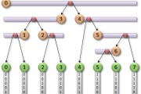

# Daily Pathtracer Part 0: Intro

2019年3月13日

23:06

As [mentioned before](http://aras-p.info/blog/2018/03/21/Random-Thoughts-on-Raytracing/), I realized I’ve never done a path tracer. Given that I suggest everyone else who asks “how should I graphics” start with one, this sounded wrong. So I started making a super-simple one. When I say *super simple*, I mean it! It’s not useful for anything, think of it as [smallpt] with more lines of code :)

However I do want to make one in C++, in C#, in something else perhaps, and also run into various LOLs along the way. All code is at [github.com/aras-p/ToyPathTracer](https://github.com/aras-p/ToyPathTracer).

 

Now, all that said. *Sometimes* it can be useful (or at least fun) to see someone who’s clueless in the area going through parts of it, bumping into things, and going into dead ends or wrong approaches. This is what I shall do in this blog series! Let’s see where this *path* will lead us.

·         [Part 1: Initial C++](http://aras-p.info/blog/2018/03/28/Daily-Pathtracer-Part-1-Initial-C-/) implementation and walkthrough.

·         [Part 2: Fix stupid performance issue](http://aras-p.info/blog/2018/03/28/Daily-Pathtracer-Part-2-Fix-Stupid/).

·         [Part 3: C#, Unity, Burst](http://aras-p.info/blog/2018/03/28/Daily-Pathtracer-Part-3-CSharp-Unity-Burst/).

·         [Part 4: Fixing wrong rendering, and Mitsuba](http://aras-p.info/blog/2018/03/31/Daily-Pathtracer-Part-4-Fixes-Mitsuba/).

·         [Part 5: GPU implementation for Metal](http://aras-p.info/blog/2018/04/03/Daily-Pathtracer-Part-5-Metal-GPU/).

·         [Part 6: GPU implementation for D3D11/HLSL](http://aras-p.info/blog/2018/04/04/Daily-Pathtracer-Part-6-D3D11-GPU/).

·         [Part 7: Initial C++ SIMD & SoA attempt](http://aras-p.info/blog/2018/04/10/Daily-Pathtracer-Part-7-Initial-SIMD/).

·         [Part 8: SIMD SSE HitSpheres, and a larger scene](http://aras-p.info/blog/2018/04/11/Daily-Pathtracer-8-SSE-HitSpheres/).

·         [Part 9: A wild ryg appears](http://aras-p.info/blog/2018/04/13/Daily-Pathtracer-9-A-wild-ryg-appears/) and optimizes my code!

·         [Part 10: Let’s unify all implementations](http://aras-p.info/blog/2018/04/16/Daily-Pathtracer-10-Update-CsharpGPU/) so that they render the same scene again etc.

·         [Part 11: Attempt at a buffer-oriented approach](http://aras-p.info/blog/2018/04/19/Daily-Pathtracer-11-Buffer-Oriented/).

·         [Part 12: Buffer-oriented approach on the GPU](http://aras-p.info/blog/2018/04/25/Daily-Pathtracer-12-GPU-Buffer-Oriented-D3D11/).

·         [Part 13: GPU performance boost via thread group data caching](http://aras-p.info/blog/2018/05/28/Pathtracer-13-GPU-threadgroup-memory-is-useful/).

·         [Part 14: Let’s make it run on iOS](http://aras-p.info/blog/2018/05/30/Pathtracer-14-iOS/).

·         [Part 15: Pausing it all, and a bunch of links](http://aras-p.info/blog/2018/08/01/Pathtracer-15-Pause-Links/).

·         [Part 16: Update Unity Burst code with 4-wide HitSpheres](http://aras-p.info/blog/2018/10/29/Pathtracer-16-Burst-SIMD-Optimization/).

·         [Part 17: WebAssembly version](http://aras-p.info/blog/2018/11/16/Pathtracer-17-WebAssembly/).

**Actually useful resources**

If you want to *actually* learn someting about path tracing or raytracing, I’d suggest these:

·         “[Physically Based Rendering: From Theory to Implementation](http://www.pbrt.org/)” ([free online version](http://www.pbr-book.org/)) by Pharr, Jakob, Humphreys. It’s excellent, and explains pretty much *everything*.

·         For a much lighter introduction, “[Ray Tracing in One Weekend](http://in1weekend.blogspot.lt/2016/01/ray-tracing-in-one-weekend.html)“ and two follow-up minibooks by Shirley are really good (and dirt cheap!).

·         “[The Graphics Codex](http://graphicscodex.com/)” app by McGuire is great.

·         Presentation [slides on smallpt](http://www.kevinbeason.com/smallpt/#moreinfo) are a good intro too.

 

 

来自 <[*http://aras-p.info/blog/2018/03/28/Daily-Pathtracer-Part-0-Intro/*](http://aras-p.info/blog/2018/03/28/Daily-Pathtracer-Part-0-Intro/)> 

 

 

 

**Daily Pathtracer Part 1: Initial C++**

2019年3月13日

23:06

 

*Introduction and index of this series* [*is here*](http://aras-p.info/blog/2018/03/28/Daily-Pathtracer-Part-0-Intro/).

Let’s make an initial implementation very similar to [Ray Tracing in One Weekend](http://in1weekend.blogspot.lt/2016/01/ray-tracing-in-one-weekend.html) *(seriously, just buy that minibook)*.

Source code is [**here on github**](https://github.com/aras-p/ToyPathTracer/tree/01-initial/Cpp).

·         “Main” file is Test.cpp [here](https://github.com/aras-p/ToyPathTracer/blob/01-initial/Cpp/Source/Test.cpp). Pretty much everything outside that file is plumbing and not related to path tracing itself.

·         Visual Studio 2017 project files in Cpp/Windows/TestCpu.sln. Uses simple GDI to display the result.

·         Mac Xcode 9 project file in Cpp/Mac/Test.xcodeproj. Uses Metal :) to display the result; each frame uploading the texture data and displaying it on the screen.

·         Looks like this:

**What does it contain?**

Very much like Ray Tracing in One Weekend, it can only do spheres, has no bounding volume hierarchy of any sort, and has lambert (diffuse), metallic and dielectric (glass) materials. I’ve also added explicit light sampling (“shadow rays”) similar to [smallpt](http://www.kevinbeason.com/smallpt/), to reduce the noise. Alternatively should perhaps have done importance sampling, like explained in [Ray Tracing: The Rest of Your Life](http://in1weekend.blogspot.lt/2016/03/ray-tracing-rest-of-your-life.html) minibook.

Multi-threading is implemented by doing chunks of the whole image rows independently from others. I used [enkiTS](https://github.com/dougbinks/enkiTS) task scheduler by Doug Binks. That was the simplest thing I could think of that would work on both Windows & Mac. I could have used [OpenMP](http://www.openmp.org/) or [PPL](https://msdn.microsoft.com/en-us/library/dd492418.aspx) on Windows and [GCD](http://aras-p.info/blog/2013/02/03/parallel-for-in-apples-gcd/) on Mac. Or Intel’s [TBB](https://www.threadingbuildingblocks.org/), or Some C++17 parallelism thingy, but frankly I find enkiTS simple to use and good enough :)

**Code walk-through / explanation**

Scene is hardcoded in s_Spheres and s_SphereMats arrays around [here](https://github.com/aras-p/ToyPathTracer/blob/01-initial/Cpp/Source/Test.cpp#L12):

**static** Sphere s_Spheres[] = { ... };
 **static** Material s_SphereMats[kSphereCount] = { ... };

Main ray intersection function is HitWorld [here](https://github.com/aras-p/ToyPathTracer/blob/01-initial/Cpp/Source/Test.cpp#L54). Just loops over all spheres and finds closest intersection, if any:

HitWorld(...)
 {
         **for** (all spheres)
         {
                 **if** (ray hits sphere closer)
                 {
                         remember it;
                 }
         }
         **return** closest;
 }

“Main work” of path tracer itself is Trace function [here](https://github.com/aras-p/ToyPathTracer/blob/01-initial/Cpp/Source/Test.cpp#L178), which does a:

color **Trace**(ray)
 {
         **if** (ray hits world)
     {
             *// scatter & attenuate it from the surface*
             **if** (Scatter(ray, ...))
             {
                     *// keep on tracing the scattered ray recursively*
                     **return** material.emissive + attenuation * Trace(scattered ray);
             }
             **else**
             {
                     *// ray would be absorbed; just return material emission if any*
                     **return** mat.emissive;
             }
     }
     **else**
     {
         *// ray hits sky*
         **return** sky color in ray direction;
     }
 }

The Trace function does not care where the rays come from. Initially they would be coming from the camera, but then they just keep recursively bouncing off surfaces, changing direction and attenuating with each bounce.

The Scatter [function](https://github.com/aras-p/ToyPathTracer/blob/01-initial/Cpp/Source/Test.cpp#L73) is where material “response” to a ray hitting it is evaluated. It is essentially this:

**bool** **Scatter**(...)
 {
           attenuation = material.albedo *// "color" of material*
         **if** (material is Lambert)
     {            
             scatteredRay = bounce ray off surface in a random direction
             *// (actually pick a random point inside unit sphere that sits right*
             *// atop the surface, and point a ray there)*

**return** true;
     }

**if** (material is Metal)
     {
             reflected = reflect ray along surface normal

*// (random point inside sphere, with radius based on material roughness)*
             scatteredRay = offset reflected direction by a random point

*// ray might get scattered "into" the surface, absorb it then*
             **return** (scatteredRay above surface);
     }

**if** (material is Dielectric)
     {
             *// Here we compute reflection and refraction*
             *// (based on materials' index of refraction)*
             *// directions, and pick "scattered ray"*
             *// randomly between each, with probability proportional*
             *// to Fresnel effect.*
             *//*
             *// It looks scary in math/code, but that's*
             *// essentially what it does.*
             **return** true;
     }
 }

The multi-threading “job” function that is executed by enkiTS scheduler is TraceRowJob [here](https://github.com/aras-p/ToyPathTracer/blob/01-initial/Cpp/Source/Test.cpp#L220). The task scheduler is invoked with “yo, for all rows on screen, divide that up into chunks and call TraceRowJob on each chunk”.

**void** **TraceRowJob**(startRow, endRow)
 {
         **for** (y = startRow to endRow)
     {
         **for** (x = 0 to screen width)
         {
                 color = black;
                 **for** (sample = 0 to SamplesPerPixel)
             {
                     ray = camera.GetRay(x, y, with random offset)
                     color += Trace(ray);
             }
             color /= SamplesPerPixel;
             color = gamma correct;

write color into x,y image location;
         }
     }
 }

So everything is conceptually fairly simple. The beauty of a path tracer is that something *very* simple like this can still produce images with a lot of fancy phenomena:

Fancy effects, yay! All these are very hard in a regular rasterizer. Also… noise. And this one is after a lot of frames blended one over another; just one frame with one ray per pixel actually looks like this:

Reflections are cool, but that “lighting” part… ugh!

This amount of noise makes sense though. Recall that upon hitting a diffuse surface, we bounce only *one*ray, in a *random* direction. Some of these do end up hitting that emissive sphere, but a whole lot do not!

We could do more rays per pixel, or upon hitting a surface bounce more rays off it, or explicitly trace rays towards “light sources” (aka “explicit light sampling” or “shadow rays”), or try to not bounce the ray randomly, but make it more likely bounce off in directions we might be “interested” in (e.g. towards light sources) – that is called “importance sampling”. Or alternatively, try to use some of the de-noising techniques, which are pretty good these days.

The “most proper” approach right now would be to do importance sampling, *I think*, since that would still allow all the phenomena like caustic refractions etc. But that was too much math-y for me that day, and [smallpt](http://www.kevinbeason.com/smallpt/) had explicit light sampling in there already, so I did that instead.

Scatter function, in addition to all the usual work for diffuse materials, also sends a ray towards emissive objects, and adds light contribution from those if they are visible (code [here](https://github.com/aras-p/ToyPathTracer/blob/01-initial/Cpp/Source/Test.cpp#L83)).

Just light sampling alone would contribute this to the image:

The illumination is smooth; the only noisy part is shadow penumbrae – that’s because we still only cast one ray towards the whole area of the light. So in penumbra region some pixels will see the light, and some won’t.

Combined with regular path tracing part, this “one ray per pixel” image would look like this:

That’s still a lot of noise of course! If we’d increase rays per pixel to something like 64, it starts to look better:

The overall level of illumination seemingly increases, and *I think* that’s because in the very noisy image, each bright pixel is actually way brighter than the low-dynamic-range “white”. If the rendering had bloom effect on it, these pixels would bloom.

**What do we have now, and what’s next?**

I’m testing this on two machines:

·         Windows PC is AMD ThreadRipper 1950X (3.4GHz, 16 cores / 16 threads). I have it in SMT-disabled config, since for some reason with SMT it’s generally a tiny bit slower (I suspect something is mis-configured in my motherboard/RAM setup, but I’m too lame/lazy to figure that out).

·         Mac is late-2013 MacBookPro (Core i7-4850HQ 2.3GHz, 4 cores / 8 threads).

The current code, at 1280x720 resolution, 4 rays per pixel, runs at **28.4 Mray/s** on my Mac. Is that good or bad? I don’t know! However, it only runs on 14.8 Mray/s on the Windows PC (?!). Why? That’s the topic of the [next blog post](http://aras-p.info/blog/2018/03/28/Daily-Pathtracer-Part-2-Fix-Stupid/), turns out I have quite a performance embarrassment in the code :)

 

来自 <[*http://aras-p.info/blog/2018/03/28/Daily-Pathtracer-Part-1-Initial-C-/*](http://aras-p.info/blog/2018/03/28/Daily-Pathtracer-Part-1-Initial-C-/)> 

 

 

 

**Daily Pathtracer Part 2: Fix Stupid**

2019年3月13日

23:07

 

*Introduction and index of this series* [*is here*](http://aras-p.info/blog/2018/03/28/Daily-Pathtracer-Part-0-Intro/).

At the end of the [last post](http://aras-p.info/blog/2018/03/28/Daily-Pathtracer-Part-1-Initial-C-/), I had the path tracer running at 28.4 million rays/second on a 4 year old Mac laptop, but only at 14.8 Mray/s on AMD ThreadRipper PC. Why? That’s what this post is about.

**The problem? Random number generator**

Turns out, the problem was in my little random number generator. A path tracer needs *a lot* of random numbers, and needs them fast. Built-in C rand() is fairly limited in many cases (e.g. on Windows MSVC implementation, only returns 15-bit values), and I’ve heard many years ago that [Xorshift](https://en.wikipedia.org/wiki/Xorshift) is supposedly quite good and super fast, so I did this:

**static uint32_t** s_RndState = 1;
 **static** uint32_t **XorShift32**()
 {
     **uint32_t** x = s_RndState;
     x ^= x << 13;
     x ^= x >> 17;
     x ^= x << 15;
     s_RndState = x;
     **return** x;
 }

You all can probably already see the problem, and I should have known better too… here it is:

**Actual problem: cache sharing**

The function above is fine in a single-threaded environment. The problems start when multi-threading enters the picture. Yes it’s not “thread safe” too; there’s one “random state” variable that would get read & written by multiple threads without synchronization, this could lead to “incorrect randomness”, so to speak, but that’s a bit hard to notice.

The problem is that the *same* variable is read & written to by many threads very often. Like this:

\1.    One CPU core writes into the variable,

\2.    It has to tell all other cores “yo, you had this variable in your caches, I just modified it, please invalidate your cacheline for this, kthxbye”.

\3.    Then the next CPU core is about to get a random number,

\4.    Now it has to fetch the variable into the cache,

\5.    And repeat from step 1.

All this cache invalidation and re-fetching the variable into caches again ends up being very expensive. And the more CPU cores you have, the more expensive it gets! *That’s* why my 16 thread PC was quite a bit slower than a 8-thread laptop.

*In multi-threaded programming, there’s a sneakier phenomenon, called “False Sharing”. This is when several threads are modifying completely different variables – there’s no race conditions or anything. But, the variables happen to be really close to memory, on the same cacheline. The CPU cores still have to do all the cache invalidation dance above, since they can only read memory in cacheline-size chunks. Read more about it* [*on wikipedia*](https://en.wikipedia.org/wiki/False_sharing) *or in Sutter’s “*[*Eliminate False Sharing*](http://www.drdobbs.com/parallel/eliminate-false-sharing/217500206)*”.*

**The fix and performance after it**

Simplest [fix](https://github.com/aras-p/ToyPathTracer/commit/a9d633c0bf46dc39e374c66ebfd9bfcf0d6273c1): change uint32_t s_RndState to thread_local uint32_t s_RndState, to make the random state variable be unique for each thread.

·         Mac laptop: **28.1 -> 34.7** Mray/s *(nice)*

·         ThreadRipper PC: **14.1 -> 130** Mray/s *(whoa, 9x faster!)*

**Lesson: cache sharing, or false cache sharing, can really bring your performance down**. Watch out!

And yes, I know. I shouldn’t have had that as a global variable in the first place, *mea culpa*. Even with the fix, I should perhaps have made the “random state” be explicitly passed down into functions, instead of slapping an “eh, let’s put into thread local storage, will do the trick”. Don’t do this in production code :)

So, now we are at **130 Mray/s** on Windows PC *(AMD ThreadRipper 1950X 3.4GHz, 16 threads)*, and **34.7 Mray/s** on Mac laptop *(Core i7-4850HQ 2.3GHz, 8 threads)*. Is that good or bad? I still don’t know!

But, for [next time](http://aras-p.info/blog/2018/03/28/Daily-Pathtracer-Part-3-CSharp-Unity-Burst/) let’s try doing the same path tracer in C#.

 

来自 <[*http://aras-p.info/blog/2018/03/28/Daily-Pathtracer-Part-2-Fix-Stupid/*](http://aras-p.info/blog/2018/03/28/Daily-Pathtracer-Part-2-Fix-Stupid/)> 

 

 

 

**Daily Pathtracer Part 3: C# & Unity & Burst**

2019年3月13日

23:08

 

*Introduction and index of this series* [*is here*](http://aras-p.info/blog/2018/03/28/Daily-Pathtracer-Part-0-Intro/).

As promised in the [last post](http://aras-p.info/blog/2018/03/28/Daily-Pathtracer-Part-2-Fix-Stupid/), let’s port our path tracer to C#, both outside & inside of Unity. This will also contain a brief example of Unity 2018.1 “Job System”, as well as [Burst compiler](https://www.twitch.tv/videos/242024723?t=01h34m26s).

There will be *nothing* specific to path tracing in this post!

**Basic C# port**

Let’s do a standalone (outside of Unity) C# port first.

It’s 2018, so I’ll try to pick some “modern .NET” that would work on both Windows & Mac. I *think* that is called “[.NET Core 2.0](https://en.wikipedia.org/wiki/.NET_Framework#.NET_Core)” *(seriously, .NET ecosystem is a bit confusing: .NET Framework, .NET Core, .NET Standard, Portable Class Libraries, Mono, Xamarin etc. – good luck figuring out what is what)*.

Since I have no idea how to do UI in C# that would work on both Windows & Mac, I’m just not going to do it at all :) The path tracer will be a command line app that renders a bunch of frames, and saves out the final image as a [.TGA](https://en.wikipedia.org/wiki/Truevision_TGA) file (why TGA? because it’s [super simple](https://github.com/aras-p/ToyPathTracer/blob/03-csharp/Cs/Program.cs#L41) to write).

Everything from our [C++ code](http://aras-p.info/blog/2018/03/28/Daily-Pathtracer-Part-1-Initial-C-/) pretty much ports over directly:

Basic maths plumbing: [float3](https://github.com/aras-p/ToyPathTracer/blob/03-csharp/Cs/Maths.cs#L4), [randomness utils](https://github.com/aras-p/ToyPathTracer/blob/03-csharp/Cs/Maths.cs#L60), [Ray](https://github.com/aras-p/ToyPathTracer/blob/03-csharp/Cs/Maths.cs#L96), [Hit](https://github.com/aras-p/ToyPathTracer/blob/03-csharp/Cs/Maths.cs#L111), [Sphere](https://github.com/aras-p/ToyPathTracer/blob/03-csharp/Cs/Maths.cs#L118), [Camera](https://github.com/aras-p/ToyPathTracer/blob/03-csharp/Cs/Maths.cs#L162).

All of these are struct, not class. Often I see students starting out with class, since that’s the only thing they are taught about in the university. In .NET, “reference types” (like class) means their instances are allocated on the heap, participate in garbage collection, and so on. Whereas “value types” (primitive types like int or float, as well as most struct types) are *not* allocated on the heap; they are passed “by value”. Read more in [official Microsoft docs](https://docs.microsoft.com/en-us/dotnet/standard/design-guidelines/choosing-between-class-and-struct). Math-heavy code tends to create *a lot* of small types (like float3 in our case, which is used to represent points, vectors and colors), and if they were allocated on the heap that would be “generally a disaster” for performance.

The path tracing part itself is also a very much a direct port: [Material](https://github.com/aras-p/ToyPathTracer/blob/03-csharp/Cs/Test.cs#L13) struct, and functions [HitWorld](https://github.com/aras-p/ToyPathTracer/blob/03-csharp/Cs/Test.cs#L63),[Scatter](https://github.com/aras-p/ToyPathTracer/blob/03-csharp/Cs/Test.cs#L81), [Trace](https://github.com/aras-p/ToyPathTracer/blob/03-csharp/Cs/Test.cs#L186), [TraceRowJob](https://github.com/aras-p/ToyPathTracer/blob/03-csharp/Cs/Test.cs#L215).

For multi-threading I’m using [Parallel.For](https://msdn.microsoft.com/en-us/library/ff963552.aspx) loop from .NET 4.0 [task parallel library](https://en.wikipedia.org/wiki/Parallel_Extensions). Here’s [the code](https://github.com/aras-p/ToyPathTracer/blob/03-csharp/Cs/Test.cs#L271).

It runs, and produces image as expected, yay!

**Ok enough of that, how fast does it run?**

PC: **67.1** Mray/s, Mac: **17.5** Mray/s.

For reference, C++ version runs at 136 Mray/s on PC, and 37.8 Mray/s on Mac. The numbers are slightly higher than in [last post](http://aras-p.info/blog/2018/03/28/Daily-Pathtracer-Part-2-Fix-Stupid/), I [made](https://github.com/aras-p/ToyPathTracer/commit/e2aee497f3a8c309fb5735336fe451268903717f) random seed use explicitly passed variable instead of thread local storage.

Note that this is running on “.NET Standard” implementation (JIT, runtime, class libraries). Let’s also try running on Xamarin/Mono on Mac. That gets 5.3 Mray/s, ouch :(

Recall that “use structs, not classes” advice? If I change all these simple types to use class, I get just 2.3 Mray/s on PC, and 5.8 Mray/s on Mac. I suspect the drop is much larger on PC due to more threads being ran at once, possibly creating some serial bottleneck in either allocation or GC.

So the summary of C# performance so far:

·         Basic .NET Core performance is roughly 2x slower than C++ performance, on both Windows & Mac.

·         For simple types like “vector” or “color”, you *really* want to use struct to avoid allocation & garbage collection overhead. Otherwise your code will run 30 (!) times slower on a 16-thread PC, and 3 times slower on a 8-thread Mac. I don’t know why such a performance discrepancy.

·         Mono .NET implementation is about 3x slower than .NET Core implementation, at least on Mac, which makes it ~6x slower than C++. I suspect the Mono JIT is much “weaker” than [RyuJIT](https://blogs.msdn.microsoft.com/dotnet/tag/ryujit/) and does way less inlining etc.; you might want to “manually inline” your heavily used functions.

*Notes on Mono: 1) currently it does not have .NET Core* *System.MathF* *class, so some of the things it has to do at double precision via* *System.Math**. 2) Mono still defaults to using double precision math for everything; with* *-O=float32* *option to get single precision since* [*Mono 4.0*](http://www.mono-project.com/docs/about-mono/releases/4.0.0/)*; you might want to try that for FP32-heavy workloads. They are also* [*planning*](https://github.com/mono/mono/issues/6985) *to switch to actual FP32 for floats. 3) Mono also has an* [*LLVM backend*](http://www.mono-project.com/docs/advanced/mono-llvm/) *for the JIT, which might give better performance than the default one.*

*I have updated Mono performance numbers with various options in a* [*later blog post too*](http://aras-p.info/blog/2018/04/16/Daily-Pathtracer-10-Update-CsharpGPU/)*.*

**Let’s do Unity now**

Basic port of C# code to Unity is trivial, and then I’m putting resulting data into a texture that I display over the whole screen ([code](https://github.com/aras-p/ToyPathTracer/commit/6ea3d586c373c5dfd1d1a0e220f56c7dcac4e3f8#diff-3c81de7fddb166b1a164a72838d0eb75)).

One possible gotcha: **turn off Editor Attaching** in preferences, if you’re profiling heavy C# code in the editor. This option makes it possible to attach a C# debugger at *any time*, but it causes Mono JIT to insert a whole lot of *“should I handle debugger right now?”* checks in compiled code all over the place.

You’ll also want to set scripting runtime version to .NET 4.x instead of (currently still default) .NET 3.5, to make the Parallel.For call work.

Performance is comparable to “C# with Mono” option above:

·         Editor, “attaching” option off: PC 11.3, Mac 4.6 Mray/s.

o    With “attaching” option on: PC 5.3, Mac 1.6 Mray/s. So yeah that option does make “heavy” C# code run 2-3x slower in the editor, watch out!

·         Standalone non-development build: PC 13.3, Mac 5.2 Mray/s.

o    With [IL2CPP](https://docs.unity3d.com/Manual/IL2CPP.html) instead of Mono: PC 28.1, Mac 17.1 Mray/s.

This is roughly what is expected: performance similar to Mono (which is behind .NET Core), editor has a bit of overhead, IL2CPP 2-3x faster than Mono, which brings it into the same ballpark as .NET Core. All that is quite a bit behind C++ :(

**Let’s do some more fancy stuff in Unity!**

We’ll want to use [Burst compiler](https://www.twitch.tv/videos/242024723?t=01h34m26s), but first we need to do some preparation steps.

*Note: right Burst requires using a very specific build of Unity, which is 2018.1 beta 12, version**ed1bf90b40e6* *(*[*download here*](https://beta.unity3d.com/download/ed1bf90b40e6/public_download.html)*). Also, Burst is beta, experimental, work in progress, may or might not work, today only works in editor, etc. etc. You’ve been warned!*

We’ll use NativeArray for storing pixel data ([commit](https://github.com/aras-p/ToyPathTracer/commit/6e0f9e3d0268a6fed041a98923a77770ee8bafbb)), including a [trick](https://github.com/aras-p/ToyPathTracer/commit/6e0f9e3d0268a6fed041a98923a77770ee8bafbb#diff-3c81de7fddb166b1a164a72838d0eb75L56) to use Texture2D.LoadRawTextureDatawith it *(I’m adding more proper NativeArray support for texture pixel data as we speak…)*.

And let’s replace Parallel.For with Unity’s [Job System](https://github.com/Unity-Technologies/EntityComponentSystemSamples/blob/master/Documentation/content/job_system.md) ([commit](https://github.com/aras-p/ToyPathTracer/commit/3c7ba21efeb222eb7be0f32be2fd1b40b2735bec)). This has the added benefit that our computation shows up in Unity’s timeline profiler. Look at these threads being all busy:

And now, let’s add Burst! Since Burst is beta right now, it does not show up in Package Manager UI yet. You have to manually edit Packages/manifest.json to contain this:

{
     "dependencies": {
             "com.unity.burst": "0.2.3"
     },
     "registry": "<https://staging-packages.unity.com>"
 }

This should make “Jobs” menu appear. Now, we can add [ComputeJobOptimization]attribute to our struct TraceRowJob : IJobParallelFor, and **iff** the job C# code satisfies all restrictions imposed by Burst, it should get *Magically Faster™*. Burst restrictions today basically are:

·         No reference types, only primitive types and structs.

o    Note that NativeArray is a struct, so that one is ok.

o    C# “pointers” are ok too, I think (yes C# [does have pointers](https://docs.microsoft.com/en-us/dotnet/csharp/programming-guide/unsafe-code-pointers/)!).

·         I think that’s about it, but do note that this makes a *whole lot* of “typical C#” be non-Burstable. You can’t have virtual methods, delegates, references, garbage collection, etc. etc.

·         Most accesses to static class fields are off-limits too; you should put that data into your Job struct instead.

Jobs -> Burst Inspector menu can be used to either see what errors prevented each job from Burst-ing, or inspect generated assembly for the Burst-ed ones.

In our pathtracer, making code Burst-able meant this ([see commit](https://github.com/aras-p/ToyPathTracer/commit/fbbace917417feb8520774e3462c50142f83817d)):

·         Replace arrays with NativeArray. Part of that was done previously; I also put sphere & material data into NativeArrays.

·         No static data fields means that random number generator seed needs to be passed, instead of stored in a thread-local variable. We noticed that’s a generally good idea anyway earlier.

What performance do we have now, with Burst? PC: 11.3 -> **140** Mray/s *(12x faster)*, Mac: 4.6 -> **42.6**Mray/s *(9x faster)*.

This is pretty good, if you ask me. Recall that C++ implementation is 136 Mray/s on PC, and 37.8 Mray/s on Mac, so we’re actually *faster than C++* already. Why and how? I suggest watching [Andreas’ talk](https://www.twitch.tv/videos/242024723?t=01h34m26s) from GDC 2018.

But wait, we can do a bit more. We have a new *(also experimental, WIP, etc)* C# library calledUnity.Mathematics, that is quite similar to HLSL types and functions. And Burst treats a whole lot of those as “intrinsics” that often map directly to some LLVM instruction. Let’s try that.

First off, [add](https://github.com/aras-p/ToyPathTracer/commit/ff42b31be7a379396c7fed134718943bf02b88ad#diff-d9d779e2b932fe2d6e914c5dde70c5ac) "com.unity.mathematics": "0.0.7" under dependencies in Packages/manifest.json. And then we can get rid of our own float3 struct and some helpers, and use very similar ones from Unity.Mathematics ([commit](https://github.com/aras-p/ToyPathTracer/commit/ff42b31be7a379396c7fed134718943bf02b88ad)). This gets us to **164** Mray/s on PC, and **48.1** Mray/s on Mac.

And these jobs take about 15x shorter than without Burst now:

**Status, findings and what’s next**

So we did not learn anything about path tracing this time, just spent some time in C# or Unity land. I hope that was useful for someone at least! The findings about C# are:

·         .NET Core is about 2x slower than vanilla C++.

·         Mono (with default settings) is about 3x slower than .NET Core.

·         IL2CPP is 2x-3x faster than Mono, which is roughly .NET Core performance level.

·         Unity’s Burst compiler can get our C# code faster than vanilla C++. Note that right now Burst is very early tech, I expect it will get even better performance later on.

And now, let’s get back to path tracing! Specifically, our rendering right now is *wrong*, due to the way I did the light sampling noise reduction optimization *(thanks to a bunch of folks on twitter for pointing that out!)*. Turns out, with path tracing it’s often hard to know when something is “broken”, since many things look quite plausible! I’ll look at one of possible ways of how to approach that in the [next post](http://aras-p.info/blog/2018/03/31/Daily-Pathtracer-Part-4-Fixes-Mitsuba/).

 

来自 <[*http://aras-p.info/blog/2018/03/28/Daily-Pathtracer-Part-3-CSharp-Unity-Burst/*](http://aras-p.info/blog/2018/03/28/Daily-Pathtracer-Part-3-CSharp-Unity-Burst/)> 

 

 

 

**Daily Pathtracer Part 4: Fixes & Mitsuba**

2019年3月13日

23:08

 

**Daily Pathtracer Part 4: Fixes & Mitsuba**

Posted on Mar 31, 2018

[#rendering](http://aras-p.info/tags/rendering) [#code](http://aras-p.info/tags/code)

*Introduction and index of this series* [*is here*](http://aras-p.info/blog/2018/03/28/Daily-Pathtracer-Part-0-Intro/).

The path tracer right now is small, neat and *wrong*. Some folks pointed on on twitterverse that there’s double lighting due to light sampling; there’s [an issue](https://github.com/aras-p/ToyPathTracer/issues/2) on github about diffuse scattering, and I have noticed some wrong things too. But first of all, how does one even know that rendering is wrong? After all, it doesn’t look terribad to me?

In cases like this, it’s good to have a “reference rendering”, also often called “ground truth”. For that, let’s turn to [**Mitsuba Renderer**](https://www.mitsuba-renderer.org/).

**Rendering our scene in Mitsuba**

Why Mitsuba? I’ve seen it mentioned in a bunch of graphics papers, at [MJP’s blog](https://mynameismjp.wordpress.com/2015/04/04/mitsuba-quick-start-guide/), and I know that people working on Unity’s PBR system use it too, so much as they even built a [Mitsuba Exporter/Plugin](https://bitbucket.org/Unity-Technologies/mitsubaexport). So I’ll assume that Mitsuba can render “110% correct” images :)

Getting our scene into Mitsuba is pretty easy; the [documentation](https://www.mitsuba-renderer.org/docs.html) is clear and the file format is simple.

I have simplified some things in our scene for easier comparison: turned off depth of field, made sky have a constant color, and all the metal materials be perfectly smooth. Here’s a [Mitsuba file](https://github.com/aras-p/ToyPathTracer/blob/04-fixes/Mitsuba/scene.xml) that matches our scene, and here’s the resulting rendering, with 1024 samples per pixel (this took 5.3 minutes on a Mac by the way):

Here’s my rendering, for comparison:

Uff, that is indeed quite off! Let’s fix that.

**Fixing frame accumulation**

I first turned off explicit light sampling, and that left with the most obvious wrong thing I already briefly noticed before. Specifically, the rendering works by [accumulating](https://github.com/aras-p/ToyPathTracer/blob/03-csharp/Cpp/Source/Test.cpp#L257) multiple frames over time, to “converge” to final result. However, depending on how many samples per pixel I was doing per frame, it was producing very different results. Here’s rendering with 4 and 16 samples per pixel, respectively (light sampling off):

 

Turns out, the problem was in the (cheap) gamma correction (linear -> sRGB color conversion) I had in there. This, well, was wrong, and a leftover from very first code I had written for this. By now my accumulation buffer is full floating point, so I should just accumulate linear colors there, and only convert to sRGB for final display. With [that fixed](https://github.com/aras-p/ToyPathTracer/commit/000b7594976f4b5a9be56c171ab157f198cab21c), different sample counts per frame converge to the same result, which is better. More proper linear->sRGB conversion ([from here](http://chilliant.blogspot.lt/2012/08/srgb-approximations-for-hlsl.html)) fixed overall brightness, especially on background/sky.

 

**Fixing diffuse scattering**

This is still quite different from Mitsuba though. As pointed out on [github](https://github.com/aras-p/ToyPathTracer/issues/2), the way Scatter function picked new ray for diffuse materials was wrong; it should have picked a new direction *on* the unit sphere, not *inside* of it. With that [fixed](https://github.com/aras-p/ToyPathTracer/commit/f52e23e581b03d567cfe9e4873e237dafe8c5be6), it gets much closer to reference result:

I guess this means that [Ray Tracing in One Weekend](http://in1weekend.blogspot.lt/2016/01/ray-tracing-in-one-weekend.html) book has the same error as well (that is fixed by [Ray Tracing: The Rest of Your Life](http://in1weekend.blogspot.lt/2016/03/ray-tracing-rest-of-your-life.html), where whole scattering is reworked for importance sampling).

**Fixing light sampling**

I still have a double-lighting problem with explicit light sampling. The problem is basically, that once you explicitly add direct lighting contribution from lights (emissive surfaces), then if the scattered/bounced ray also directly hits the light from the same point, you should ignore the emission from it. This makes sense; that direct ray hit was already accounted for during explicit light sampling!

With that [fixed](https://github.com/aras-p/ToyPathTracer/commit/5b7607b89d4510623700751edb5f0837da2af23a#diff-a51e0aea7aae9c8c455717cc7d8f957bL183) and light sampling back on, things are looking quite good:

*There are still differences from* [*Mitsuba rendering*](http://aras-p.info/img/blog/2018/rt-fixes-mitsuba1024.png) *on the metal objects (well,* *“my” metal BRDF there is not a “proper” one like Mitsuba’s), and a small difference on the glass object. I’ll park these for now, and will improve metal surfaces at some later point perhaps.*

Even with just 4 rays per pixel, and no progressive image accumulation, look at how (relatively) little noise there is!

And if I turn back previous things (DOF, rough metals, gradient sky), this is what’s rendered now:

**What’s next**

Now that the path tracer is *more correct*, let’s get back to exploring different topics :) Next week I’ll write about a *super-naïve* implementation for a GPU. Stay tuned!

 

来自 <[*http://aras-p.info/blog/2018/03/31/Daily-Pathtracer-Part-4-Fixes-Mitsuba/*](http://aras-p.info/blog/2018/03/31/Daily-Pathtracer-Part-4-Fixes-Mitsuba/)> 

 

 

 

# （转）[基于CUDA的GPU光线追踪](https://zhuanlan.zhihu.com/p/55855479)

2019年3月13日

23:10

 

作者：Asixa

链接：https://zhuanlan.zhihu.com/p/55855479

来源：知乎

著作权归作者所有。商业转载请联系作者获得授权，非商业转载请注明出处。

 

替STL。

\4. **显存层级**

GPU上的显存共分为三个层级，Global Memory, Shared Memory, Local Memory.

读取耗时方面，L存 < S存 <<G存 << 内存。

local memory是最快的，但是需要注意一个问题，每个Kernel的local memory大小是650000字节，如果使用量超过了这个量，就会崩溃。

5.**在Device慎用 new，malloc** 

这两个操作是在Device端创建一个Global Memory，这个弊端是很慢。我相信每个使用GPU加速的程序都是对效率敏感的。

\6. **异常处理**

可以在每次调用完Kernel写

auto error = cudaGetLastError();
 if(error!=0)printf("error %d\n", error);

来检测有没有Error抛出。（我每次使用Nsight调试整个电脑就会崩，可能是我自己的问题）

而在我写渲染器的时候出现最多的是Error 77“内存越界”，一般的内存越界很容易避免，但是我依然遇到很多很迷的崩溃然后抛出Error77，据我猜测应该包含但不限于以下两种情况：

·         kernel栈溢出

前面说过，Kernel的栈深度并不够用，第一种解决办法是消除递归，减少函数相互调用等。第二种是 将项目从Debug模式改成Release模式，这样编译器的优化就会发挥作用。

·         Local Memory超过了极限,

将不需要的对象及时的free掉，或者使用[cudaDeviceSetLimit](http://link.zhihu.com/?target=http%3A//docs.nvidia.com/cuda/cuda-runtime-api/group__CUDART__DEVICE.html%23group__CUDART__DEVICE_1g05956f16eaa47ef3a4efee84563ccb7d)API设置最低Local Memory大小。

\7. **随机数**

在之前的项目中我的随机数使用的是drand48()，但是CUDA提供了一个更高效的随机数生成器curand。

curand提供多种随机数序列。我用的最多的是最普通的curand_uniform，在我的光线追踪采样中，我确保每个像素的采样序列都不一样，不然就会出现很多奇怪的效果

我为每个像素都创建了一个currandState

//Host
 \#include <curand_kernel.h>
 //...

curandState *d_rng_states = nullptr;
 cudaMalloc(reinterpret_cast<void **>(&d_rng_states), height * width * sizeof(curandState));

而种子方面，使用像素的唯一id。

//Device
 const auto tidx = blockIdx.x * blockDim.x + threadIdx.x;
 const auto tidy = blockIdx.y * blockDim.y + threadIdx.y;
 curand_init(seed + tidx + tidy * d_width, 0, 0, &rngStates[tidx]);

这样在每次调用

curand_uniform(&rngStates[tid])  //tid = tidx + tidy * width

就可以生成一个0~1的随机浮点数了。

**7.** **纹理**

在CPU渲染器中我使用byte[] 储存的纹理信息，如果在Cuda中也使用 unsigned char* 的话，会消耗很多的Global Memory，并且最重要的是，Global Memory很慢。

幸运的是Cuda提供了一个Texture解决方案，这个Texture储存在一个特定的显存区域可以极大地提高读取速度。

在Cuda的示例 0_Simple/simpleTexture项目中，项目实现了一个简单Texture，这个Texture通过绑定到了一部分显存提供更快的读取。甚至不需要传递指针到kernal即可当全局变量使用。

但是有两个问题：

第一个问题，这个Texture不能是数组或者指针数组。也就是说Texture的数量在编译的时候就是写死的。

解决方案：1. 将所有的纹理都合并到一张Atlas，这理论上是最快的，效果大概是这样:

图自Unity Form by gary_bbgames

第二个方案是使用Texture的BindlessTexture功能，这个在CUDA的示例 2_Graphics/bindlessTexture项目中有实现。而我采用的就是这种方法。

CudaTexture第二个问题是如何绑定RGB三通道，示例项目中的颜色通道只有一个，并且值类型是float，我尝试使用uchar3类型来储存三个RGB值但是没有成功。我最后使用的是LayeredTexture来创建三个层,代码在Cuda示例 0_Simple/simpleLayeredTexture项目。我不确定这是否是创建三通道纹理的最优方法，如果有其他写法，请让我知道谢谢。

三通道纹理的缓冲有点奇怪，是这样的，在创建之前需要修改一下。

//类型float
 RRRRRRRRRRGGGGGGGGGGBBBBBBBBBB

下面附Texture相关代码

//Host
 inline void InitTextureList()
         {
                 for (auto i = 0; i < TEXTURE_COUNT; i++) {
                         //读取纹理，使用了stb_image库
                         int width, height, depth;
                         const auto tex_data = stbi_load(imageFilenames[i],&width, &height, &depth, 0);
                         const auto size = width * height * depth;
                         float* h_data = new float[size];
                         printf("LoadTexture %d,%d,%d\n", width, height, depth);
                         for (unsigned int layer = 0; layer < 3; layer++)
                                 for (auto i = 0; i < static_cast<int>(width * height); i++)h_data[layer*width*height + i] = tex_data[i * 3 + layer] / 255.0;

//cudaArray Descriptor
                         cudaChannelFormatDesc channelDesc = cudaCreateChannelDesc(32, 0, 0, 0, cudaChannelFormatKindFloat);
                         //cuda Array
                         cudaArray *d_cuArr;
                         cudaMalloc3DArray(&d_cuArr, &channelDesc, make_cudaExtent(width, height, 3), cudaArrayLayered);

cudaMemcpy3DParms myparms = { 0 };
                         myparms.srcPos = make_cudaPos(0, 0, 0);
                         myparms.dstPos = make_cudaPos(0, 0, 0);
                         myparms.srcPtr = make_cudaPitchedPtr(h_data, width * sizeof(float), width, height);
                         myparms.dstArray = d_cuArr;
                         myparms.extent = make_cudaExtent(width, height, 3);
                         myparms.kind = cudaMemcpyHostToDevice;
                         cudaMemcpy3D(&myparms);
                         

cudaResourceDesc    texRes;
                         memset(&texRes, 0, sizeof(cudaResourceDesc));
                         texRes.resType = cudaResourceTypeArray;
                         texRes.res.array.array = d_cuArr;
                         cudaTextureDesc     texDescr;
                         memset(&texDescr, 0, sizeof(cudaTextureDesc));
                         texDescr.filterMode = cudaFilterModeLinear;
                         texDescr.addressMode[0] = cudaAddressModeWrap;   // clamp
                         texDescr.addressMode[1] = cudaAddressModeWrap;
                         texDescr.addressMode[2] = cudaAddressModeWrap;
                         texDescr.readMode = cudaReadModeElementType;
                         texDescr.normalizedCoords = true;
                         cudaCreateTextureObject(&textlist[i], &texRes, &texDescr, NULL);
                 }
         }

 

//Device 
 const auto albedo =Vec3(
                 tex2DLayered<float>(texs[texid], rec.u, 1-rec.v, 0), //R
                 tex2DLayered<float>(texs[texid], rec.u, 1 - rec.v, 1),//G
                 tex2DLayered<float>(texs[texid], rec.u, 1 - rec.v, 2));//B

 

**8. BVH****层次包围盒**

在Kernel写BVH真的是刺激....

首先正如前面所说，BVH必须在CPU创建，所以从Host向Device复制数据时候，需要复制一棵二叉树，二叉树的子节点还是个派生类的指针.....

由于我之前没单独学过C语言的内存管理，所以这部分消耗了我整整两天一夜的精力。

我最后的解决方案是将所有对象包括BVH节点放在一个父类指针数组(Hitable**)中先传到Device。每个对象都被赋予一个id，也就是在数组中的位置。而BVH树的左右节点只是个int对象。

二分查找部分，由于这部分原始代码高度依赖于递归，需要改成循环。这部分我参考了

[https://devblogs.nvidia.com/thinking-parallel-part-i-collision-detection-gpu/devblogs.nvidia.com](http://link.zhihu.com/?target=https%3A//devblogs.nvidia.com/thinking-parallel-part-i-collision-detection-gpu/)

[Thinking Parallel, Part II: Tree Traversal on the GPU | NVIDIA Developer Blogdevblogs.nvidia.com](http://link.zhihu.com/?target=https%3A//devblogs.nvidia.com/thinking-parallel-part-ii-tree-traversal-gpu/)

](http://link.zhihu.com/?target=https%3A//devblogs.nvidia.com/thinking-parallel-part-ii-tree-traversal-gpu/)

[Thinking Parallel, Part III: Tree Construction on the GPU | NVIDIA Developer Blogdevblogs.nvidia.com](http://link.zhihu.com/?target=https%3A//devblogs.nvidia.com/thinking-parallel-part-iii-tree-construction-gpu/)

](http://link.zhihu.com/?target=https%3A//devblogs.nvidia.com/thinking-parallel-part-iii-tree-construction-gpu/)

其中在第II部分，Minimizing Divergence 部分中的traverseIterative函数中。我创建的是 

int stack[64];

并且这部分在每个像素的最初始被创建，每次查找时只是重设为0，最后记得free掉这个数组。目前调试BVH依然有问题，渲染个茶壶是没有问题的，

# 

但是换成Bunny就会抛出Error 77。目前还没有解决。

 

代码目前开源在：

[Asixa/ALightGPUgithub.com](http://link.zhihu.com/?target=https%3A//github.com/Asixa/ALightGPU)

由于之前没怎么写过C++项目，代码可能有些乱，深表歉意，明天开学，等过一阵子可能才开始修BUG和整理代码。

关于为什么我为什么全都写在头文件里，因为CUDA的编译器如果想要代码分离的话需要开启【generate relocatable device code】但是这样会导致编译器无法进行代码优化。似乎另一种解决方式是使用CUDA的*.cuh和*.cu文件进行代码分离，但是我目前还没有测试成功。如果这样可以的话之后整理代码的时候会进行代码分离。
