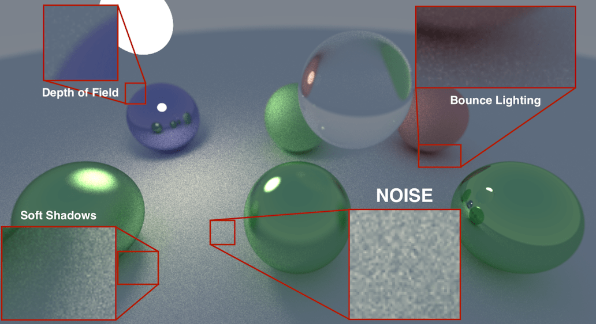
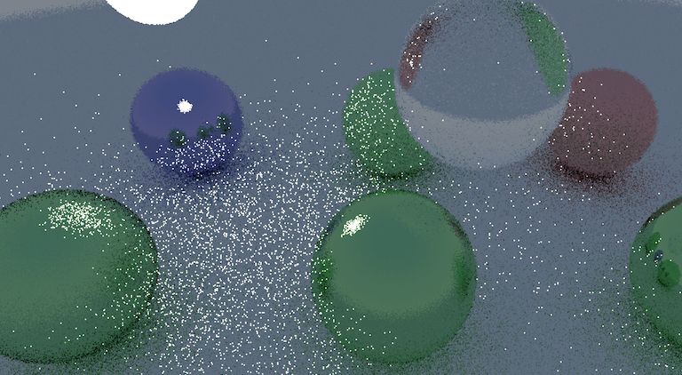
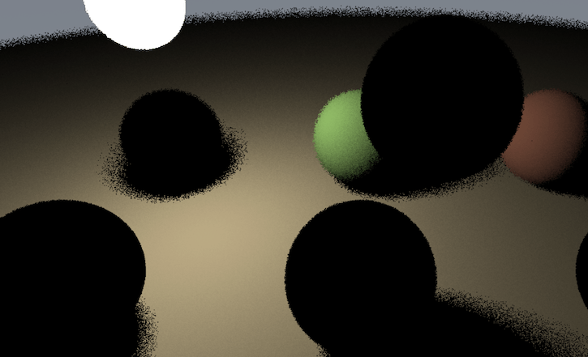
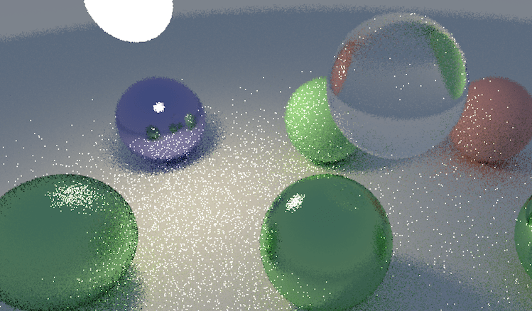
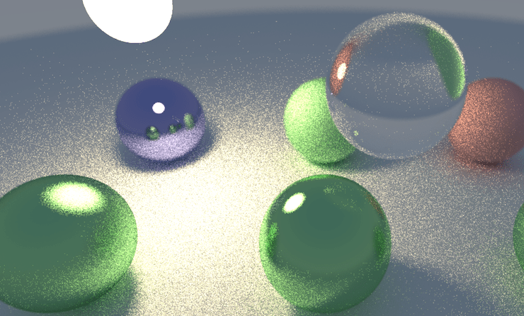

# Daily Pathtracer Part 1: Initial C++

​         Posted on                    Mar 28, 2018                

​                  [#rendering](http://aras-p.info/tags/rendering)                  [#code](http://aras-p.info/tags/code)                

*Introduction and index of this series is here*.

Let’s make an initial implementation very similar to [Ray Tracing in One Weekend](http://in1weekend.blogspot.lt/2016/01/ray-tracing-in-one-weekend.html) *(seriously, just buy that minibook)*.

Source code is [**here on github**](https://github.com/aras-p/ToyPathTracer/tree/01-initial/Cpp).

- “Main” file is `Test.cpp` [here](https://github.com/aras-p/ToyPathTracer/blob/01-initial/Cpp/Source/Test.cpp). Pretty much everything outside that file is plumbing and not related to path tracing itself.
- Visual Studio 2017 project files in `Cpp/Windows/TestCpu.sln`. Uses simple GDI to display the result.
- Mac Xcode 9 project file in `Cpp/Mac/Test.xcodeproj`. Uses Metal :) to display the result; each frame uploading the texture data and displaying it on the screen.
- Looks like this:

[
](http://aras-p.info/img/blog/2018/rt-initial-cpp-mac.jpg)

### What does it contain?

Very much like Ray Tracing in One Weekend, it can only do spheres, has no bounding volume hierarchy of any sort, and has lambert (diffuse), metallic and dielectric (glass) materials. I’ve also added explicit light sampling (“shadow rays”) similar to [smallpt](http://www.kevinbeason.com/smallpt/), to reduce the noise. Alternatively should perhaps have done importance sampling, like explained in [Ray Tracing: The Rest of Your Life](http://in1weekend.blogspot.lt/2016/03/ray-tracing-rest-of-your-life.html) minibook.

Multi-threading is implemented by doing chunks of the whole image rows independently from others. I used [enkiTS](https://github.com/dougbinks/enkiTS) task scheduler by Doug Binks. That was the simplest thing I could think of that would work on both Windows & Mac. I could have used [OpenMP](http://www.openmp.org/) or [PPL](https://msdn.microsoft.com/en-us/library/dd492418.aspx) on Windows and [GCD](http://aras-p.info/blog/2013/02/03/parallel-for-in-apples-gcd/) on Mac. Or Intel’s [TBB](https://www.threadingbuildingblocks.org/), or Some C++17 parallelism thingy, but frankly I find `enkiTS` simple to use and good enough :)

### Code walk-through / explanation

Scene is hardcoded in `s_Spheres` and `s_SphereMats` arrays around [here](https://github.com/aras-p/ToyPathTracer/blob/01-initial/Cpp/Source/Test.cpp#L12):

```c++
static Sphere s_Spheres[] = { ... };
static Material s_SphereMats[kSphereCount] = { ... };
```

Main ray intersection function is `HitWorld` [here](https://github.com/aras-p/ToyPathTracer/blob/01-initial/Cpp/Source/Test.cpp#L54). Just loops over all spheres and finds closest intersection, if any:

```c++
HitWorld(...)
{
	for (all spheres)
	{
		if (ray hits sphere closer)
		{
			remember it;
		}
	}
	return closest;
}
```

“Main work” of path tracer itself is `Trace` function [here](https://github.com/aras-p/ToyPathTracer/blob/01-initial/Cpp/Source/Test.cpp#L178), which does a:

```c++
color Trace(ray)
{
	if (ray hits world)
    {
    	// scatter & attenuate it from the surface
    	if (Scatter(ray, ...))
    	{
    		// keep on tracing the scattered ray recursively
    		return material.emissive + attenuation * Trace(scattered ray);
    	}
    	else
    	{
    		// ray would be absorbed; just return material emission if any
    		return mat.emissive;
    	}
    }
    else
    {
        // ray hits sky
        return sky color in ray direction;
    }
}
```

The `Trace` function does not care where the rays come from. Initially they would be coming from the camera, but then they just keep recursively bouncing off surfaces, changing direction and attenuating with each bounce.

The `Scatter` [function](https://github.com/aras-p/ToyPathTracer/blob/01-initial/Cpp/Source/Test.cpp#L73) is where material “response” to a ray hitting it is evaluated. It is essentially this:

```c++
bool Scatter(...)
{
  	attenuation = material.albedo // "color" of material
	if (material is Lambert)
    {    	
    	scatteredRay = bounce ray off surface in a random direction
    	// (actually pick a random point inside unit sphere that sits right
    	// atop the surface, and point a ray there)

        return true;
    }

    if (material is Metal)
    {
    	reflected = reflect ray along surface normal

    	// (random point inside sphere, with radius based on material roughness)
    	scatteredRay = offset reflected direction by a random point

    	// ray might get scattered "into" the surface, absorb it then
    	return (scatteredRay above surface);
    }

    if (material is Dielectric)
    {
    	// Here we compute reflection and refraction
    	// (based on materials' index of refraction)
    	// directions, and pick "scattered ray"
    	// randomly between each, with probability proportional
    	// to Fresnel effect.
    	//
    	// It looks scary in math/code, but that's
    	// essentially what it does.
    	return true;
    }
}
```

The multi-threading “job” function that is executed by enkiTS scheduler is `TraceRowJob` [here](https://github.com/aras-p/ToyPathTracer/blob/01-initial/Cpp/Source/Test.cpp#L220). The task scheduler is invoked with “yo, for all rows on screen, divide that up into chunks and call TraceRowJob on each chunk”.

```c++
void TraceRowJob(startRow, endRow)
{
	for (y = startRow to endRow)
    {
        for (x = 0 to screen width)
        {
        	color = black;
        	for (sample = 0 to SamplesPerPixel)
            {
            	ray = camera.GetRay(x, y, with random offset)
            	color += Trace(ray);
            }
            color /= SamplesPerPixel;
            color = gamma correct;

            write color into x,y image location;
        }
    }
}
```

So everything is conceptually fairly simple. The beauty of a path tracer is that something *very* simple like this can still produce images with a lot of fancy phenomena:

[
](http://aras-p.info/img/blog/2018/rt-initial-labeled.png)

Fancy effects, yay! All these are very hard in a regular rasterizer. Also… noise. And this one is after a lot of frames blended one over another; just one frame with one ray per pixel actually looks like this:

[
](http://aras-p.info/img/blog/2018/rt-initial-noise.png)

Reflections are cool, but that “lighting” part… ugh!

This amount of noise makes sense though. Recall that upon hitting a diffuse surface, we bounce only *one* ray, in a *random* direction. Some of these do end up hitting that emissive sphere, but a whole lot do not!

We could do more rays per pixel, or upon hitting a surface bounce more rays off it, or explicitly trace rays towards “light sources” (aka “explicit light sampling” or “shadow rays”), or try to not bounce the ray randomly, but make it more likely bounce off in directions we might be “interested” in (e.g. towards light sources) – that is called “importance sampling”. Or alternatively, try to use some of the de-noising techniques, which are pretty good these days.

The “most proper” approach right now would be to do importance sampling, *I think*, since that would still allow all the phenomena like caustic refractions etc. But that was too much math-y for me that day, and [smallpt](http://www.kevinbeason.com/smallpt/) had explicit light sampling in there already, so I did that instead.

`Scatter` function, in addition to all the usual work for diffuse materials, also sends a ray towards emissive objects, and adds light contribution from those if they are visible (code [here](https://github.com/aras-p/ToyPathTracer/blob/01-initial/Cpp/Source/Test.cpp#L83)).

Just light sampling alone would contribute this to the image:

[
](http://aras-p.info/img/blog/2018/rt-initial-lightsampling-alone.png)

The illumination is smooth; the only noisy part is shadow penumbrae – that’s because we still only cast one ray towards the whole area of the light. So in penumbra region some pixels will see the light, and some won’t.

Combined with regular path tracing part, this “one ray per pixel” image would look like this:

[
](http://aras-p.info/img/blog/2018/rt-initial-wihtlightsampling.png)

That’s still a lot of noise of course! If we’d increase rays per pixel to something like 64, it starts to look better:

[
](http://aras-p.info/img/blog/2018/rt-initial-wihtlightsampling64.png)

The overall level of illumination seemingly increases, and *I think* that’s because in the very noisy image, each bright pixel is actually way brighter than the low-dynamic-range “white”. If the rendering had bloom effect on it, these pixels would bloom.

### What do we have now, and what’s next?

I’m testing this on two machines:

- Windows PC is AMD ThreadRipper 1950X (3.4GHz, 16 cores / 16 threads). I have it in SMT-disabled config, since for some reason with SMT it’s generally a tiny bit slower (I suspect something is mis-configured in my motherboard/RAM setup, but I’m too lame/lazy to figure that out).
- Mac is late-2013 MacBookPro (Core i7-4850HQ 2.3GHz, 4 cores / 8 threads).

The current code, at 1280x720 resolution, 4 rays per pixel, runs at **28.4 Mray/s** on my Mac. Is that good or bad? I don’t know! However, it only runs on 14.8 Mray/s on the Windows PC (?!). Why? That’s the topic of the [next blog post](http://aras-p.info/blog/2018/03/28/Daily-Pathtracer-Part-2-Fix-Stupid/), turns out I have quite a performance embarrassment in the code :)
