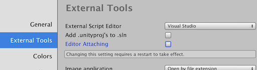
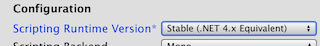
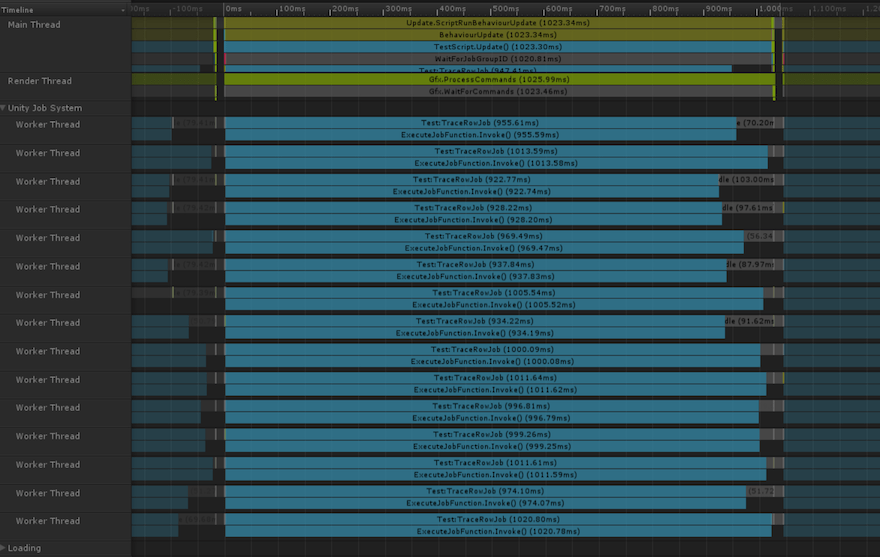
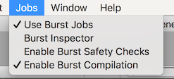
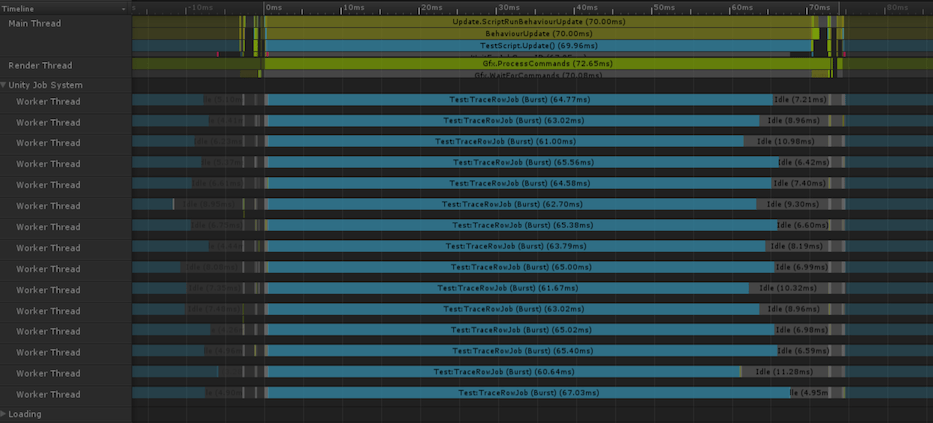

# Daily Pathtracer Part 3: C# & Unity & Burst

​         Posted on                    Mar 29, 2018                

​                  [#rendering](http://aras-p.info/tags/rendering)                  [#code](http://aras-p.info/tags/code)                  [#unity](http://aras-p.info/tags/unity)                

*Introduction and index of this series is here*.

As promised in the [last post](http://aras-p.info/blog/2018/03/28/Daily-Pathtracer-Part-2-Fix-Stupid/), let’s port our path tracer to C#, both outside & inside of Unity. This will also contain a brief example of Unity 2018.1 “Job System”, as well as [Burst compiler](https://www.twitch.tv/videos/242024723?t=01h34m26s).

There will be *nothing* specific to path tracing in this post!

### Basic C# port

Let’s do a standalone (outside of Unity) C# port first.

It’s 2018, so I’ll try to pick some “modern .NET” that would work on both Windows & Mac. I *think* that is called “[.NET Core 2.0](https://en.wikipedia.org/wiki/.NET_Framework#.NET_Core)” *(seriously, .NET ecosystem is a bit confusing: .NET Framework, .NET Core, .NET Standard, Portable Class Libraries, Mono, Xamarin etc. – good luck figuring out what is what)*.

Since I have no idea how to do UI in C# that would work on both Windows & Mac, I’m just not going to do it at all :) The path tracer will be a command line app that renders a bunch of frames, and saves out the final image as a [.TGA](https://en.wikipedia.org/wiki/Truevision_TGA) file (why TGA? because it’s [super simple](https://github.com/aras-p/ToyPathTracer/blob/03-csharp/Cs/Program.cs#L41) to write).

Everything from our [C++ code](http://aras-p.info/blog/2018/03/28/Daily-Pathtracer-Part-1-Initial-C-/) pretty much ports over directly:

Basic maths plumbing: [float3](https://github.com/aras-p/ToyPathTracer/blob/03-csharp/Cs/Maths.cs#L4), [randomness utils](https://github.com/aras-p/ToyPathTracer/blob/03-csharp/Cs/Maths.cs#L60), [Ray](https://github.com/aras-p/ToyPathTracer/blob/03-csharp/Cs/Maths.cs#L96), [Hit](https://github.com/aras-p/ToyPathTracer/blob/03-csharp/Cs/Maths.cs#L111), [Sphere](https://github.com/aras-p/ToyPathTracer/blob/03-csharp/Cs/Maths.cs#L118), [Camera](https://github.com/aras-p/ToyPathTracer/blob/03-csharp/Cs/Maths.cs#L162).

All of these are `struct`, not `class`. Often I see students starting out with `class`, since that’s the only thing they are taught about in the university. In .NET, “reference types” (like `class`) means their instances are allocated on the heap, participate in garbage collection, and so on. Whereas “value types” (primitive types like `int` or `float`, as well as most `struct` types) are *not* allocated on the heap; they are passed “by value”. Read more in [official Microsoft docs](https://docs.microsoft.com/en-us/dotnet/standard/design-guidelines/choosing-between-class-and-struct). Math-heavy code tends to create *a lot* of small types (like `float3` in our case, which is used to represent points, vectors and colors), and if they were allocated on the heap that would be “generally a disaster” for performance.

The path tracing part itself is also a very much a direct port: [Material](https://github.com/aras-p/ToyPathTracer/blob/03-csharp/Cs/Test.cs#L13) struct, and functions [HitWorld](https://github.com/aras-p/ToyPathTracer/blob/03-csharp/Cs/Test.cs#L63), [Scatter](https://github.com/aras-p/ToyPathTracer/blob/03-csharp/Cs/Test.cs#L81), [Trace](https://github.com/aras-p/ToyPathTracer/blob/03-csharp/Cs/Test.cs#L186), [TraceRowJob](https://github.com/aras-p/ToyPathTracer/blob/03-csharp/Cs/Test.cs#L215).

For multi-threading I’m using [Parallel.For](https://msdn.microsoft.com/en-us/library/ff963552.aspx) loop from .NET 4.0 [task parallel library](https://en.wikipedia.org/wiki/Parallel_Extensions). Here’s [the code](https://github.com/aras-p/ToyPathTracer/blob/03-csharp/Cs/Test.cs#L271).

It runs, and produces image as expected, yay!

[
](http://aras-p.info/img/blog/2018/rt-cs-output.jpg)

#### Ok enough of that, how fast does it run?

PC: **67.1** Mray/s, Mac: **17.5** Mray/s.

For reference, C++ version runs at 136 Mray/s on PC, and 37.8 Mray/s on Mac. The numbers are slightly higher than in [last post](http://aras-p.info/blog/2018/03/28/Daily-Pathtracer-Part-2-Fix-Stupid/), I [made](https://github.com/aras-p/ToyPathTracer/commit/e2aee497f3a8c309fb5735336fe451268903717f) random seed use explicitly passed variable instead of thread local storage.

Note that this is running on “.NET Standard” implementation (JIT, runtime, class libraries). Let’s also try running on Xamarin/Mono on Mac. That gets 5.3 Mray/s, ouch :(

Recall that “use structs, not classes” advice? If I change all these simple types to use `class`, I get just 2.3 Mray/s on PC, and 5.8 Mray/s on Mac. I suspect the drop is much larger on PC due to more threads being ran at once, possibly creating some serial bottleneck in either allocation or GC.

So the summary of C# performance so far:

- Basic .NET Core performance is roughly 2x slower than C++ performance, on both Windows & Mac.
- For simple types like “vector” or “color”, you *really* want to use `struct` to avoid allocation & garbage collection overhead. Otherwise your code will run 30 (!) times slower on a 16-thread PC, and 3 times slower on a 8-thread Mac. I don’t know why such a performance discrepancy.
- Mono .NET implementation is about 3x slower than .NET Core implementation, at least on Mac, which makes it ~6x slower than C++. I suspect the Mono JIT is much “weaker” than [RyuJIT](https://blogs.msdn.microsoft.com/dotnet/tag/ryujit/) and does way less inlining etc.; you might want to “manually inline” your heavily used functions.

> Notes on Mono: 1) currently it does not have .NET Core `System.MathF` class, so some of the things it has to do at double precision via `System.Math`. 2) Mono still defaults to using double precision math for everything; with `-O=float32` option to get single precision since [Mono 4.0](http://www.mono-project.com/docs/about-mono/releases/4.0.0/); you might want to try that for FP32-heavy workloads. They are also [planning](https://github.com/mono/mono/issues/6985) to switch to actual FP32 for floats. 3) Mono also has an [LLVM backend](http://www.mono-project.com/docs/advanced/mono-llvm/) for the JIT, which might give better performance than the default one.
>
> I have updated Mono performance numbers with various options in a [later blog post too](http://aras-p.info/blog/2018/04/16/Daily-Pathtracer-10-Update-CsharpGPU/).

### Let’s do Unity now

Basic port of C# code to Unity is trivial, and then I’m putting resulting data into a texture that I display over the whole screen ([code](https://github.com/aras-p/ToyPathTracer/commit/6ea3d586c373c5dfd1d1a0e220f56c7dcac4e3f8#diff-3c81de7fddb166b1a164a72838d0eb75)).

[
](http://aras-p.info/img/blog/2018/rt-cs-unity-editor-attach.png) One possible gotcha: **turn off Editor Attaching** in preferences, if you’re profiling heavy C# code in the editor. This option makes it possible to attach a C# debugger at *any time*, but it causes Mono JIT to insert a whole lot of *“should I handle debugger right now?”* checks in compiled code all over the place.

[
](http://aras-p.info/img/blog/2018/rt-cs-unity-scripting-version.png)You’llalsowanttosetscriptingruntimeversionto.NET4.xinsteadof(currentlystilldefault) .NET 3.5, to make the `Parallel.For` call work.

Performance is comparable to “C# with Mono” option above:

- Editor, “attaching” option off: PC 11.3, Mac 4.6 Mray/s.  
  - With “attaching” option on: PC 5.3, Mac 1.6 Mray/s. So yeah that option does make “heavy” C# code run 2-3x slower in the editor, watch out!
- Standalone non-development build: PC 13.3, Mac 5.2 Mray/s.  
  - With [IL2CPP](https://docs.unity3d.com/Manual/IL2CPP.html) instead of Mono: PC 28.1, Mac 17.1 Mray/s.

This is roughly what is expected: performance similar to Mono (which is behind .NET Core), editor has a bit of overhead, IL2CPP 2-3x faster than Mono, which brings it into the same ballpark as .NET Core. All that is quite a bit behind C++ :(

#### Let’s do some more fancy stuff in Unity!

We’ll want to use [Burst compiler](https://www.twitch.tv/videos/242024723?t=01h34m26s), but first we need to do some preparation steps.

> Note: right Burst requires using a very specific build of Unity, which is 2018.1 beta 12, version `ed1bf90b40e6` ([download here](https://beta.unity3d.com/download/ed1bf90b40e6/public_download.html)). Also, Burst is beta, experimental, work in progress, may or might not work, today only works in editor, etc. etc. You’ve been warned!

We’ll use `NativeArray` for storing pixel data ([commit](https://github.com/aras-p/ToyPathTracer/commit/6e0f9e3d0268a6fed041a98923a77770ee8bafbb)), including a [trick](https://github.com/aras-p/ToyPathTracer/commit/6e0f9e3d0268a6fed041a98923a77770ee8bafbb#diff-3c81de7fddb166b1a164a72838d0eb75L56) to use `Texture2D.LoadRawTextureData` with it *(I’m adding more proper NativeArray support for texture pixel data as we speak…)*.

And let’s replace `Parallel.For` with Unity’s [Job System](https://github.com/Unity-Technologies/EntityComponentSystemSamples/blob/master/Documentation/content/job_system.md) ([commit](https://github.com/aras-p/ToyPathTracer/commit/3c7ba21efeb222eb7be0f32be2fd1b40b2735bec)). This has the added benefit that our computation shows up in Unity’s timeline profiler. Look at these threads being all busy:

[
](http://aras-p.info/img/blog/2018/rt-cs-unity-timeline.png)

And now, let’s add Burst! Since Burst is beta right now, it does not show up in Package Manager UI yet. You have to manually edit `Packages/manifest.json` to contain this:

```
{
    "dependencies": {
    	"com.unity.burst": "0.2.3"
    },
    "registry": "https://staging-packages.unity.com"
}
```

[
](http://aras-p.info/img/blog/2018/rt-cs-unity-jobs.png) This should make “Jobs” menu appear. Now, we can add `[ComputeJobOptimization]` attribute to our `struct TraceRowJob : IJobParallelFor`, and **iff** the job C# code satisfies all restrictions imposed by Burst, it should get *Magically Faster™*. Burst restrictions today basically are:

- No reference types, only primitive types and structs.  
  - Note that `NativeArray` is a struct, so that one is ok.
  - C# “pointers” are ok too, I think (yes C# [does have pointers](https://docs.microsoft.com/en-us/dotnet/csharp/programming-guide/unsafe-code-pointers/)!).
- I think that’s about it, but do note that this makes a *whole lot* of “typical C#” be non-Burstable. You can’t have virtual methods, delegates, references, garbage collection, etc. etc.
- Most accesses to static class fields are off-limits too; you should put that data into your Job struct instead.

`Jobs -> Burst Inspector` menu can be used to either see what errors prevented each job from Burst-ing, or inspect generated assembly for the Burst-ed ones.

In our pathtracer, making code Burst-able meant this ([see commit](https://github.com/aras-p/ToyPathTracer/commit/fbbace917417feb8520774e3462c50142f83817d)):

- Replace arrays with `NativeArray`. Part of that was done previously; I also put sphere & material data into NativeArrays.
- No static data fields means that random number generator seed needs to be passed, instead of stored in a thread-local variable. We noticed that’s a generally good idea anyway earlier.

What performance do we have now, with Burst? PC: 11.3 -> **140** Mray/s *(12x faster)*, Mac: 4.6 -> **42.6** Mray/s *(9x faster)*.

This is pretty good, if you ask me. Recall that C++ implementation is 136 Mray/s on PC, and 37.8 Mray/s on Mac, so we’re actually *faster than C++* already. Why and how? I suggest watching [Andreas’ talk](https://www.twitch.tv/videos/242024723?t=01h34m26s) from GDC 2018.

But wait, we can do a bit more. We have a new *(also experimental, WIP, etc)* C# library called `Unity.Mathematics`, that is quite similar to HLSL types and functions. And Burst treats a whole lot of those as “intrinsics” that often map directly to some LLVM instruction. Let’s try that.

First off, [add](https://github.com/aras-p/ToyPathTracer/commit/ff42b31be7a379396c7fed134718943bf02b88ad#diff-d9d779e2b932fe2d6e914c5dde70c5ac) `"com.unity.mathematics": "0.0.7"` under dependencies in `Packages/manifest.json`. And then we can get rid of our own `float3` struct and some helpers, and use very similar ones from Unity.Mathematics ([commit](https://github.com/aras-p/ToyPathTracer/commit/ff42b31be7a379396c7fed134718943bf02b88ad)). This gets us to **164** Mray/s on PC, and **48.1** Mray/s on Mac.

And these jobs take about 15x shorter than without Burst now:

[
](http://aras-p.info/img/blog/2018/rt-cs-unity-timeline-burst.png)

### Status, findings and what’s next

So we did not learn anything about path tracing this time, just spent some time in C# or Unity land. I hope that was useful for someone at least! The findings about C# are:

- .NET Core is about 2x slower than vanilla C++.
- Mono (with default settings) is about 3x slower than .NET Core.
- IL2CPP is 2x-3x faster than Mono, which is roughly .NET Core performance level.
- Unity’s Burst compiler can get our C# code faster than vanilla C++. Note that right now Burst is very early tech, I expect it will get even better performance later on.

And now, let’s get back to path tracing! Specifically, our rendering right now is *wrong*, due to the way I did the light sampling noise reduction optimization *(thanks to a bunch of folks on twitter for pointing that out!)*. Turns out, with path tracing it’s often hard to know when something is “broken”, since many things look quite plausible! I’ll look at one of possible ways of how to approach that in the [next post](http://aras-p.info/blog/2018/03/31/Daily-Pathtracer-Part-4-Fixes-Mitsuba/).
