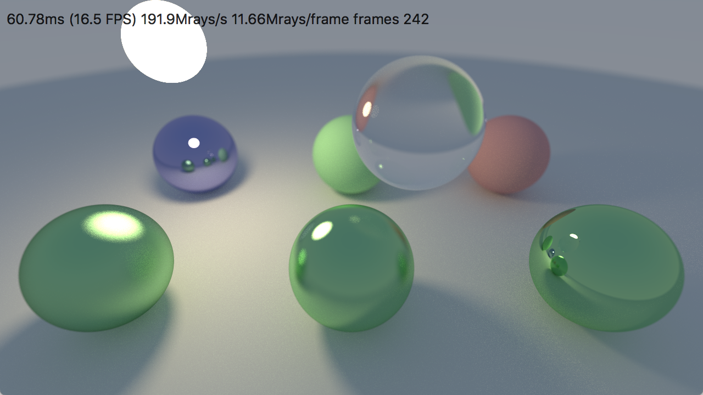
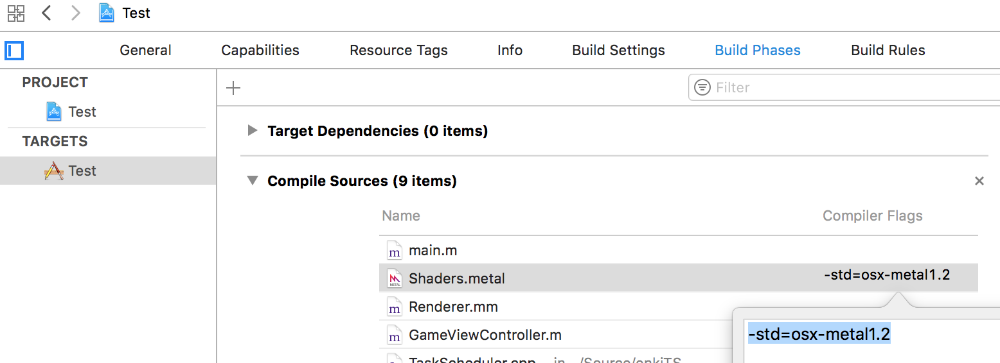
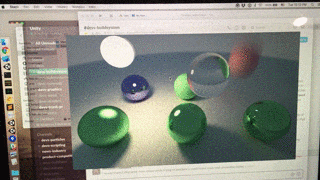

# Daily Pathtracer Part 5: Metal GPU!

​         Posted on                    Apr 3, 2018                

​                  [#rendering](http://aras-p.info/tags/rendering)                  [#code](http://aras-p.info/tags/code)                  [#gpu](http://aras-p.info/tags/gpu)                

*Introduction and index of this series is here*.

Let’s make a *super-naïve* implementation for a GPU! Did I mention that it’s going to be super simple and not optimized for GPUs at all? I did, good. This will be the “minimal amount of work” type of port, with maybe someday restructured to be more efficient.

### Why Metal?

I already have a 1) C++ implementation handy, and 2) a Mac nearby, and 3) [Metal](https://developer.apple.com/documentation/metal?language=objc) is easy to use, and especially easy to move from a C++ implementation.

The Metal Shading Language ([see spec](https://developer.apple.com/metal/Metal-Shading-Language-Specification.pdf)) is *basically* C++11/C++14 variant, with some additions (keywords to indicate address spaces and shader entry points; and attributes to indicate bindings & other metadata), and some removals (no virtuals, no exceptions, no recursion, …).

> I [wrote about this before](http://aras-p.info/blog/2015/03/13/thoughts-on-explicit-graphics-apis/), but IMHO Metal occupies a sweet spot between “low-level, access to, ahem, *metal*” (Vulkan, DX12) and “primarily single threaded, magic drivers” (OpenGL, DX11) APIs. It gives more control in some parts, keeps other parts mostly unchanged, while still being conceptually simple, and simple to use. Though with Metal 2 “argument buffers” it’s not **so** simple anymore, but you can just ignore them if you don’t use them.

### Let’s port C++ path tracer to Metal!

Majority of code translates to Metal shader pretty much as-is, and is extremely similar to the [walkthrough in Part 1](http://aras-p.info/blog/2018/03/28/Daily-Pathtracer-Part-1-Initial-C-/). See [**Shaders.metal**](https://github.com/aras-p/ToyPathTracer/blob/05-gpumetal/Cpp/Mac/Shaders.metal#L32). And then there’s a bunch of plumbing on the app side, to create buffers, feed them with data, estimate GPU running times, read back number of rays created on the GPU, etc. etc. – nothing fancy, just plumbing – see [Renderer.mm changes](https://github.com/aras-p/ToyPathTracer/pull/5/files#diff-cc597c74826d4267127bc1d823cc9ac4).

The biggest change I had to do was dealing with lack of recursion in Metal (this is true for most/all GPU shading languages today). C++ code is written in a [traditional recursive](https://en.wikipedia.org/wiki/Ray_tracing_(graphics)#Recursive_ray_tracing_algorithm) manner:

```
Color Trace(Ray r,...)
{
	if (HitWorld(r, ...))
	{
		(Ray scattered, Color attenuation) = Scatter(r, ...);
		return emission + attenuation * Trace(scattered, ...);
	}
	else
	{
		return skyColor;
	}
}
```

we can reformulate the above into a loop-based approach instead:

```
Color Trace(Ray r,...)
{
	Color result = (0,0,0)
	Color curAttenuation = (1,1,1)
	for (iter = 0 to maxBounceDepth)
	{
		if (HitWorld(r, ...))
		{
			(Ray scattered, Color attenuation) = Scatter(r, ...);
			result += curAttenuation * emission;
			// modulate attenuation and continue with scattered ray
			curAttenuation *= attenuation;
			r = scattered;
		}
		else
		{
			result += curAttenuation * skyColor;
			break; // stop looping
		}
	}
	return result;
}
```

While this approach *might* be useful for CPU path tracing optimizations *(I’ll find out later!)*, it also neatly solves lack of recursion on the GPU side. So that’s exactly what I put into Metal [shader code](https://github.com/aras-p/ToyPathTracer/blob/05-gpumetal/Cpp/Mac/Shaders.metal#L314).

The actual path tracer is a [compute shader](https://github.com/aras-p/ToyPathTracer/blob/05-gpumetal/Cpp/Mac/Shaders.metal#L371), but in the current state could have been a pixel shader just as well – it does not use any of “compute specific” functionality yet.

So that’s about it, final code changes [**looked like this**](https://github.com/aras-p/ToyPathTracer/pull/5/files). As you can see, mostly either plumbing or copy-paste from existing C++ code with small modifications.

> I did just copy & pasted most of the code, without any attempt at “sharing” some of it between C++ and Metal shader versions. If this was a “production” path tracer, and/or I had some idea what I want to achieve in the end, then sharing code might be useful. Right now, it’s easier & faster just to have the code separately.

### Does it work?

[
](http://aras-p.info/img/blog/2018/rt-gpu-metal.png)

Yeah, I guess it does work! As I mentioned before, this is *definitely not* an efficient implementation for the GPU. On the other hand… quite likely not an efficient implementation for the CPU either… But whereas CPU one is “not optimal/optimized”, the GPU one is more on the “well that’s *stupidly* slow” front. But let’s check performance anyway :)

- MacBook Pro (2013, Core i7 2.3 GHz, GeForce GT 750M + Intel Iris Pro):  
  - GeForce GT 750M: **146 Mray/s**
  - Intel Iris Pro: **191 Mray/s**
  - CPU: 38 Mray/s
- iMac 5K (2017, Core i7 4.2 GHz, Radeon Pro 580):  
  - Radeon Pro 580: **1650 Mray/s**
  - CPU: 59 Mray/s

What can we learn from that?

- Even this *stupidly slow* direct port, that should run like molasses on the GPU, is between 4 and 27 **times** faster than a simple C++ implementation!
- The integrated Intel GPU in my laptop is in some cases faster than the discrete Nvidia one. I had noticed this before in other workloads; at least on those Mac models the discrete is only faster if you use significant memory bandwidth so that it gets advantage of the VRAM. In pure computation, Intel Iris Pro is surprisingly effective.
- This is a *toy* path tracer, and neither C++ nor the GPU implementations are optimized, but overall GPUs being about 10x faster than CPUs at it seems to be expected. E.g. our progressive lightmapper team is seeing [roughly similar speedups](https://blogs.unity3d.com/2018/03/29/amd-radeon-rays-integrated-into-unitys-gpu-progressive-lightmapper/).

### Notes / gotchas

Random notes on things I ran into while doing this:

- [
](http://aras-p.info/img/blog/2018/rt-gpu-metal-flags.png) If you want to use features above Metal 1.0 language version, and use built-in Xcode `*.metal` file handling rules, it’s not exactly intuitive *how* to tell it that “yo, I need Metal version X”. Turns out it’s under Xcode project “Build Phases” settings.
- If you set Metal language version to something like “Mac Metal 1.2” (`-std=osx-metal1.2`) – I forgot what I even wanted that for, perhaps to get read-write textures – you’ll need to sprinkle `thread` or `device` etc. address space qualifiers to most/all references and pointers.
- That `read_write` access attribute from Metal 1.2 that I wanted to use… I could not get it to actually work. So I went with a double-buffered approach of having [two textures](https://github.com/aras-p/ToyPathTracer/blob/05-gpumetal/Cpp/Mac/Shaders.metal#L372); one for previous results, and another for new results.
- [
](http://aras-p.info/img/blog/2018/rt-gpu-metal-bug.gif)Ifyoudo*wrongthings*,it’squiteeasytoeithermakethemacOSwindowmanagergocrazy,orhaveamachinereboot.Inmycase,Iaccidentallymadeaninfiniteloopwiththeinitialrejectionsamplingbased“randompointinsidedisk”function.OnanIntelGPUthisresultedinscreenareas*outside*myappshowinggarbagestatefrom*previously*ranapps;andonNvidiaGPUitjustrebooted.Thisisoneofunder-appreciatedareaswhereMicrosoft(yes,inWindowsVista!) made the situation much better… ten years ago! It’s *much harder* to make a machine reboot by doing bad things in a shader on Windows.
- Watch out for [NaNs](https://en.wikipedia.org/wiki/NaN). I had everything working on my Intel/Nvidia GPU machine, but on the AMD GPU it was all black initially. Turns out, I had uninitialized data in a floating point texture that happens to be NaNs on AMD; and another place where a [Schlick’s approximation](https://en.wikipedia.org/wiki/Schlick%27s_approximation) function [could](https://github.com/aras-p/ToyPathTracer/blob/05-gpumetal/Cpp/Mac/Shaders.metal#L99) generate a very small negative argument for `pow()`. Testing on different GPUs is useful, yo.
- There’s no good way to do GPU timing on Metal (as far as I can see), so I do an approximate thing of timing CPU side between command buffer submission and until the GPU is done with it, via a [completion handler](https://github.com/aras-p/ToyPathTracer/pull/5/files#diff-cc597c74826d4267127bc1d823cc9ac4R253).

### What’s next

Maybe let’s try a [DX11 GPU](http://aras-p.info/blog/2018/04/04/Daily-Pathtracer-Part-6-D3D11-GPU/) implementation, just to see how this *super slow* GPU approach works out on a desktop GPU?
