# Precomputed Atmospheric Scattering

大气透视效果可以体现出当前的时间状态和整个场景的距离感。 越来越多实时游戏开始使用大气散射。2008年Eric Bruneton 和 Fabrice Neyret提到一种预积分处理大气散射方法。参见论文

[Precomputed Atmospheric Scattering](https://link.zhihu.com/?target=https%3A//hal.inria.fr/inria-00288758/file/article.pdf)[hal.inria.fr](https://link.zhihu.com/?target=https%3A//hal.inria.fr/inria-00288758/file/article.pdf)

在游戏及游戏引擎中得到了广泛的使用，像UE4,CE,Unity等引擎中都有使用。 这篇论文实现的大气效果，包含了Rayleigh 和 Mie multiple  scattering的计算。也包含了在任意角度下太阳在白天，黎明，地球和山峰下的阴影环境下照射的透视效果。那么我们应该如何构建一个基于预积分计算的表达式呢？

首先简单介绍一下关于大气散射的基础理论，请参考我的另外一篇文章[Volumetric Atmospheric Scattering](https://zhuanlan.zhihu.com/p/78973960)

**Rayleigh Scattering:**白天的蓝色天空，日出日落的红色天空Rayleigh Scattering的表现的效果，关于Rayleigh Scattering的详细公式推导，请参考我的另外一篇文章

[码农00：The Mathematics of Rayleigh Scattering](https://zhuanlan.zhihu.com/p/79928286)[zhuanlan.zhihu.com](https://zhuanlan.zhihu.com/p/79928286)

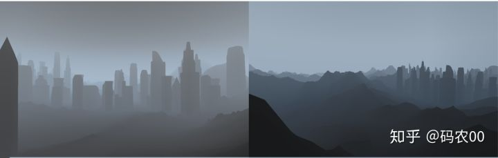

**Mie Scattering:**Mie Scattering主要表现在太阳周围的光晕效果，灰白色的云等，Mie Scattering有强烈的方向性

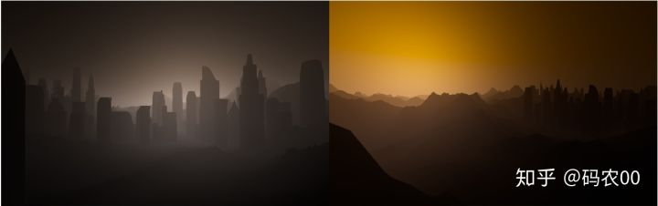

**Hight Scattering**

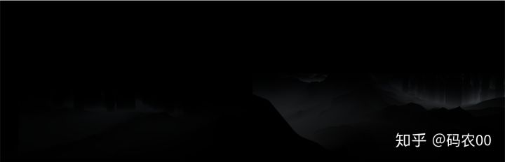

**Scatter Occlusion**


***Combined and occluded scattering***

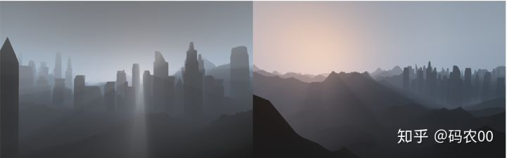

***Final composition:***最终将各个散射的效果进行组合，通过所以累计的extinction来确定透视的图像暗度。所有累计的in-scattering来确定图像亮度。

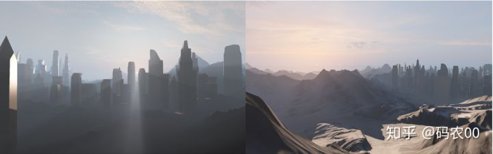

图片来源 [Atmospheric Scattering in The Blacksmith – Unity Blog](https://link.zhihu.com/?target=https%3A//blogs.unity3d.com/cn/2015/05/28/atmospheric-scattering-in-the-blacksmith/)

当然最后计算天光的效果现在一般都是在后处理来进行计算。我们这里讨论不包括在预计算中，我们这里讨论的预计算的大气散射，是基于大气在相同强度，相同厚度，同时没有遮挡的理想情况下的效果。

**构建物理模型**

已经有了基本概念，那么我们首先需要构建一个基于任意视角，灯光方向，视线的光照传输表达式。在预计算中通过迭代采样来达到较高的精度的数值，将这些数值存在在纹理中，通过参数去查询。这样在实时计算中，只需要采样这些纹理即可，而不需要经过任何Sampling，即可算出地面阴影和光柱的效果。

**2.大气模型**

渲染大气照明需要两个概念：基于当前所看到的介质属性的物理模型。和基于视角方向的全局照明。 这些包括了与地面的交互, 这样就可以模仿具有反射的高度场α(x,λ)和法线n(x)的 物体表面

**2.1物理模型**

通常在CG中物理模型就是包含空气粒子和气溶胶颗粒的清澈的天空模型。在一个薄的球形层中强度会在Rg = 6360 km and Rt = 6420 km之间递减。

在每个点上的光照部分的与入射光的散射角度都是受到散射系数βs和相位函数P的影响At . βs又受到粒子强度的影响相位函数P依赖于角度. Rayleigh理论得到βs和P

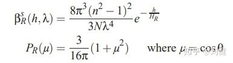h = r − Rg 是海拔高度,λ波长,n空气折射率,N 则是在海平面Rg上的分子强度, HR = 8 km 在密度均匀下的大气厚度。

和空气粒子不同的是，气溶胶只吸收部分入射光。使用吸收系数βam来进行测量，消光系数βeM = βsM + βaM，不过我们在这里忽略这部分计算。

**2.2渲染表达式**

当然上面的表达式过于复杂，我们在这里进行了简化。使用简化的渲染表达式来计算大气中的介质，**L(x,v,s)**来表示太阳光方向**S**，从视角方向**v**到达**x**点的光的辐射度。**x0(x,v)** 射线 **x+tv**到大气的边界，**x0**是在地面上或者是大气层的边界 r=Rt.透射T在**x0**到**x**的范围内。太阳在**x0**上反射产生的辐射I。是太阳在方向**-v**上y散射产生的辐射J。

左图是传统的解决方案包括了x 到 x0的单次散射和(a)多次散射(b)的积分，计算了所有遮挡。右图是我们的近似方案，只计算了x 到 x0的积分，忽略遮挡计算。(a)没有改变,(b)由于在第二次散射时没有计算遮挡值所产生的的影响(这会产生正负两种偏差)

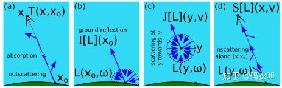(a)图大气透视在光的散射和吸收下参数的结果T。(b)图I[L]是光的方向L在x0上的反射。在大气顶部边界是空。(c)图中的J[L]是光的方向L在y，-v方向的反射。(d) S[L]是指在光照方向L指向x的散射。x在x和x0直接的任意方向。

需要注意的是 **L** 在大气层顶部数据是空。

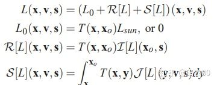

**L0**是直射光**L(sun)**在通过**T(x,x0)**到达**x**的衰减值。如果**v !=s**或者太阳被地形遮挡了**L0**是null。如果**L0**在地面上，**R[L]**光在**x0**上的反射和光到达x之前的衰减值。**S[L]**是内散射，光在**x**上的散射，散射范围是**x**到**x0**。参考图四

**2.3 早期的渲染方法**

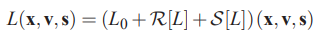图5

上述的表达式是非常复杂的解决方案，在CG中一般都会针对**x**,**s**做一些公式简化。很多近似方法都会忽略多次散射。图5中的表达式就可以简化成**L = L0 + R[L0]+ S[L0]**。尽管**S[L0]**是很复杂，不过一般大家都会把地球模型简化：假定地球上的大气强度是固定的并且也没有Mie Scattering。同时假设我们是在地面上进行观察。否则S[L0]就需要做积分计算，在实时游戏中只能使用较低的Samping进行计算。

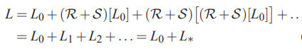

**3.我们的方法**

为了更高效，更真实，我们会对L做预计算。为了尽可能的接近真实效果，我们会对单次散射进行精确计算。对于多次散射我们使用遮挡效果去计算。事实上为了得到正确的地面颜色，阴影，和太阳光柱，单次散射我们会考虑地面的形状细节。在多次散射中则将地形看成一个完美的圆形。

**1.单次散射**

在渲染期间我们需要精确的计算**L**0和R[**L**0].使用阴影的算法去计算太阳的遮挡。

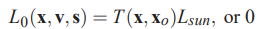遮挡公式

一个只需要两个参数基于预计算的透视效果的表T，S[L0] 则更加复杂，他是一个基于x和x0的积分。最终的简化公式如下

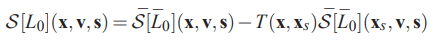

**2.多次散射**

如何上图所似，尽管有遮挡但是L0和L1依然能够计算出来，不过使用公式统计L2 +... = R[L∗]+S[L∗]  确更加困了，所以我们可以对occlusion做近似计算。其实在一般的大气中，多次散射没有单次散射效果明显。太阳不直接照射这些大气到地面时，地面的散射贡献其实也很小。所以我们就可以对S[L∗]在多次散射积分贡献做近似计算。**x**和**xs**的遮挡直接不进行计算。这样就会产生正偏差和负偏差。最终的简化表达公式如下

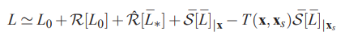

为了尽可能最小化近似L的值，我们基于零次或单次散射做精确的计算。然后使用一个近似的遮挡效果去计算多次散射。为了考虑地面颜色，阴影，光柱我们也考虑对地面做零次或单次散射。我们可以将地面表示成反射系数完美的球体。

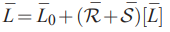

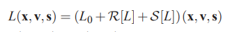

完美的球形地面的反射系数α，L0直射太阳光使用这个表达式来标识反射系数。由于球形地面是对称的，只需要用x 和 v来表示高度和一个向顶的视角。

**4.算法：**PRECOMPUTE(norders)

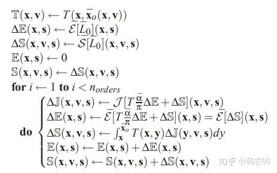

具体代码实现如下:

```text
// ---------------------------------------------------------------------------- 
// INSCATTER FUNCTIONS 
// ---------------------------------------------------------------------------- 
void Integrand(float r, float mu, float muS, float nu, float t, out float3 ray, out float mie) 
{ 
    ray = float3(0,0,0); 
    mie = 0.0; // single channel only
    float ri = sqrt(r * r + t * t + 2.0 * r * mu * t); 
//    float muSi = (nu * t + muS * r) / ri ; // original code
    float muSi = (nu * t + muS * r) / (ri * lerp(1.0, betaR.w, max(0.0, muS))); // added betaR.w to fix the Rayleigh Offset artifacts issue
    ri = max(Rg, ri); 
    UNITY_FLATTEN
    if (muSi >= -sqrt(1.0 - Rg * Rg / (ri * ri ))) 
    { 
        float3 ti = Transmittance(r, mu, t) * Transmittance(ri, muSi); 
        ray = exp(-(ri - Rg) / HR) * ti; 
        mie = exp(-(ri - Rg) / HM) * ti.x; // only calc the red channel
    } 
} 
/ transmittance(=transparency) of atmosphere between x and x0
// assume segment x,x0 not intersecting ground
// d = distance between x and x0, mu=cos(zenith angle of [x,x0) ray at x)
vec3 transmittance(float r, float mu, float d) 
{
         vec3 result;
         float r1 =sqrt(r * r + d * d +2.0* r * mu * d);
         float mu1 = (r * mu + d) / r1;
         if (mu >0.0) {
                result =min(transmittance(r, mu) / transmittance(r1, mu1), 1.0);    
         } else {        
                 result =min(transmittance(r1, -mu1) / transmittance(r, -mu), 1.0);    
         }
        return result;
}
// transmittance(=transparency) of atmosphere for infinite ray (r,mu)
// (mu=cos(view zenith angle)), intersections with ground ignored
vec3 transmittance(float r, float mu) {
    vec2 uv = getTransmittanceUV(r, mu);
    return texture2D(transmittanceSampler, uv).rgb;
}
vec2 getTransmittanceUV(float r, float mu) {
    float uR, uMu;
#ifdef TRANSMITTANCE_NON_LINEAR
    uR = sqrt((r - Rg) / (Rt - Rg));
    uMu = atan((mu + 0.15) / (1.0 + 0.15) * tan(1.5)) / 1.5;
#else
    uR = (r - Rg) / (Rt - Rg);
    uMu = (mu + 0.15) / (1.0 + 0.15);
#endif
    return vec2(uMu, uR);
}
```

**4.1预计算**

我们预计算 **T(x,¯xo(x,v)）**将值放入到2D表中**T(x,v）。**由于大气成球体模型左右对称，**T**仅仅依赖**r=||x||** 并且**u = v.x/r**。这样我们只需要使用**T(x,y) = T(x,v)**,**v = (y-x)/||y-x||**。我们预计算**S[L\*]**和**S[L]**在两张表E和S中。这个算法使用3个媒介的数据表**∆E**,**S**和**∆J**，它们包含了**E[Li ]**,**S[L]**和**J [L]**的每次迭代。

**角向量精度**

由于4D表的大小随着分辨率快速的增长。我们需要限制角分辨率V的大小。这样可能参数精度问题，同时也限制了Mie Scattering的单次强度。为了解决这个问题我们在运行时使用了相位函数。

**参数化**

为了把S[L]的结果存储在S中，我们需要把**（x,v,s）**映射到**[0,1]**中。比较简单的做法使用**r=||x||**,天顶角的余弦，太阳的天顶角，观看太阳的角度。**u = v.x/r**,**us = s.x/r**，**v=v.s**。参数化的问题是需要非常高的分辨率这样**u**才能在空气透视中获取好的采样。

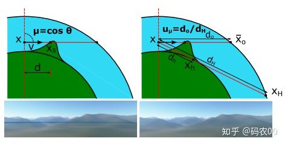左图使用u产生了很多锯齿。右图使用u = do/dh 或者 do/dH解决了这个问题

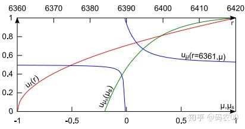

最终的公式推到过程

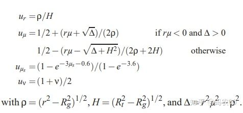

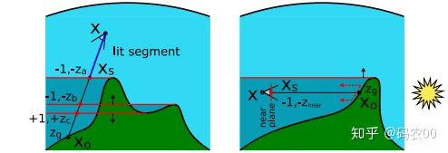

**5.渲染**

为了计算天空中的透视效果，我们使用下面的渲染表达式

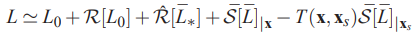

**L0**可以使用非常T进行高效的计算，**R[L0]**包含了**T**，**α(x0)**和**n(x0)**,并且阴影测试确定**x0**是否照亮。最终**E**和**S**用来计算**R[L\*]**和**S[L]**。

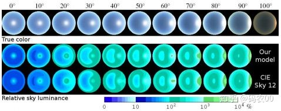

**6.具体实现**

我们在GPU端实现具体是算法，在片元着色器中对积分进行计算。GPU计算速度更快，所以我们主要在GPU端来进行处理。经过我们的优化后在4D表中比3D表有更好的精度。

**渲染**

1. 需要将地形写入到深度表中。
2. 绘制地形的阴影体到 ∆n, ∆z, zmin,zmax

**7.结论**

这篇论文包含了在实时渲染中任意视角小的空气透视，多次散射，地形阴影和光柱效果。矫正了多个视角下太阳的变化。都是基于简化的大气模型下的近似解决方案。然后对这些数据进行预计算。当然这个方案可以非常方便的扩展到更复杂的物理模型，更多的波长下的粒子散射情况。具体源代码请查看[http://evasion.inrialpes.fr/~Eric.Bruneton/](https://link.zhihu.com/?target=http%3A//evasion.inrialpes.fr/~Eric.Bruneton/).

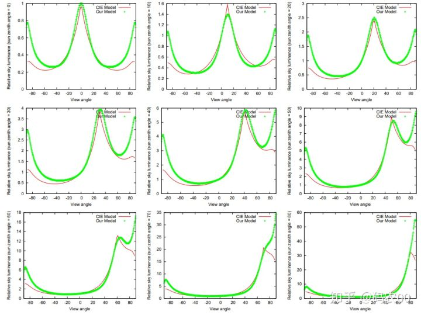

**8.最终效果**

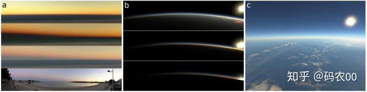(a)从大气层顶端到地面的效果下单次散射加上多次散射下的效果。由于参数v没有使用，阴影并没有计算在里面。对于只有单次散射会比较暗。(b)在太空下视角效果。

**9.最终效果**


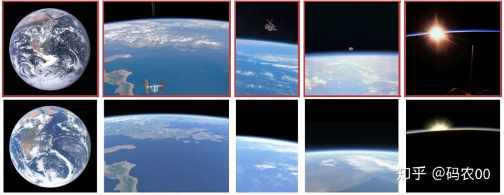Views from space for various altitudes and sun positions

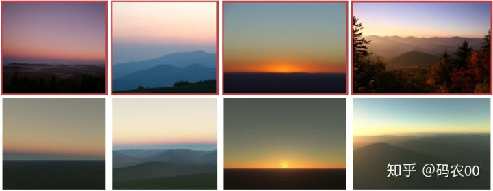Views from the ground showing, from left to right, the Earth shadow, the  aerial perspective after sunset, sunset, and light shafts at sunrise.

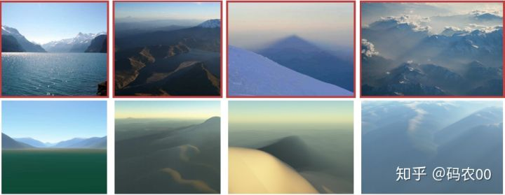Aerial perspective during the day, and mountain shadows for various view and sun angles