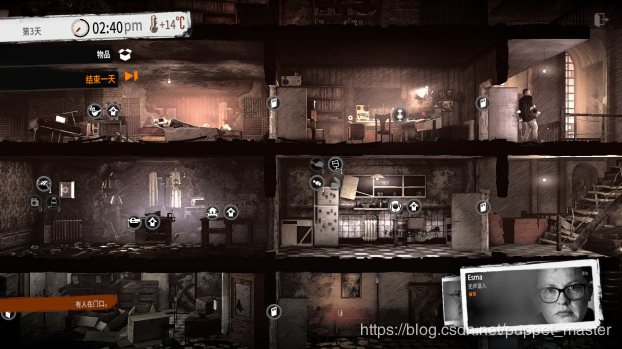
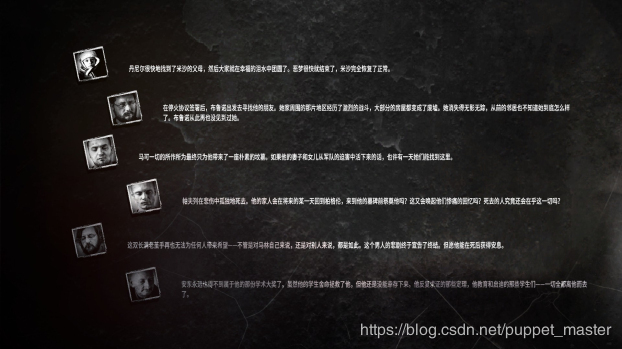
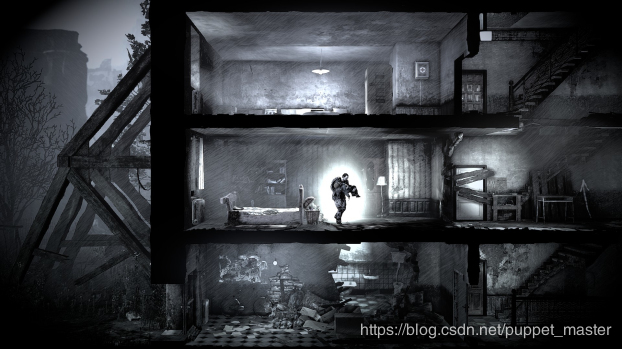

# 《Gpu Gems》《Gpu Pro》《Gpu Zen》系列读书笔记

## 前言

最近赶上春节放假，然而家里的电脑不太给力，不敢玩什么大游戏，刚好看到《This War of  Mine》打折，其实游戏大概在16年左右就玩过一次了，不过当时还是个穷学生（虽然现在依然穷，但是毕竟可以买得起游戏了），也没有很强的版权意识，这次决定补一下票。另一个很重要的原因在于经过几年时间，游戏竟然还在不断更新，新增了战争中的孩子等内容，并且更新了两个DLC。

游戏主要是在战争中的人在一个简单的避难所中如何生存到战争结束，白天需要在避难所中建造，做饭，取水，加固避难所，与商人交易等等，夜晚时则需要到外面的废墟中搜索材料，食物，武器等。

在玩基本篇时，基本没有任何剧情，但是当你为了生存下去，不得不去偷，抢一个废弃小房子中的老人的私人物品时，他追着你不停地祈求，即使知道他只是一个NPC。作为一个画面党，这个画面不怎么样的横版游戏当年给了我极其深刻的印象。而几年后这次重玩，我也差点玩脱，开始的几个人都在找东西的过程中被打死，最后只剩下一个人的时候，邻居把小孩子寄养在这里，靠着一个大人一个小孩艰难地玩到通关。

此次DLC也是非常给力，讲述了两个非常感人的战争中的生存故事，分别是《最后的广播》和《父亲的承诺》。

## 简介

本篇blog简单记录了一下最近一两年一直在读的一系列书目。《Gpu Gems》1-3三部，《Gpu Pro》1-7七部，《Gpu  Zen》一部。《Gpu  Gems》三部是有中文版，而后面的几部都是英文原版。每一本中内容都是纷繁复杂，直接看其中的任何一本书可以说跳跃幅度极大，因为每一篇之间几乎没有联系。这一系列的总结[浅墨大大](https://blog.csdn.net/poem_qianmo/article/details/79689041)已经在做了，给出了非常详细的单本书的关键内容提炼，从这个角度来看这一系列的书，个人认为是横向来说，每一部书都代表了当年最先进的图形学以及GPU相关的技术，可以看到当年GPU的能力，以及当年的渲染技术可以达到什么样的水平。

小弟不才，决定使用纵向的方式，针对每一项渲染技术，进行全系列书的总结，从这个角度来看，可以看到一项技术，近十五六年来的进化过程。比如阴影效果，在《Gpu  Gems》的年代，还有使用Shadow Volume的方式进行阴影的渲染，而在《Gpu Pro》系列开始，Shadow  Map成为了绝对的主流，阴影技术的研究方向也转向了如何优化Shadow Map，如PCF，CSM，进而如何优化PCF，CSM，SSSM等等。

本篇只是进行了一个技术的技术的简要总结，可能一句话或一小段话，甚至几个关键词。毕竟这一系列书，想要全看懂是不可能的，这辈子都不可能的，比如流体模拟等。还有一些与渲染关系较小的内容就更是一笔带过了，比如什么GPU通用计算《病毒特征匹配》等。不过，有些技术本人进行了实践，如[AO](https://blog.csdn.net/puppet_master/article/details/82929708)，[体积光](https://blog.csdn.net/puppet_master/article/details/79859678)，[Decal](https://blog.csdn.net/puppet_master/article/details/84310361)，[Reflection](https://blog.csdn.net/puppet_master/article/details/80808486)等等，但是也不能保证覆盖单项技术的全部实现。而后续的单项技术实践本人将陆续更新。

## 《Gpu Gems》《Gpu Pro》《Gpu Zen》分类整理

以下是各项技术的分类整理，除Multi Topic可能包含若干章节是很多技术整合分享的，其余绝大部分章节都是单向技术的总结。

### **Multi Topic：**

**《Gpu Pro1》Rendering Techniques in Call of Juarez: Bound in Blood：**Deferred Shading，后处理流程，SSAO，Depth Fog，RainEffect。

**《Gpu Pro1》Making it Large, Beautiful, Fast, and Consistent: Lessons Learned** **Developing Just Cause 2：**超多光源处理方式，Soft Shadow，Character Self Shadow，Soft Particle，Jitter Bug，精度连续等问题，Cloud Shading，若干渲染，内存优化项。

**《Gpu Pro3》CryENGINE 3: Three Years of** **Work in Review：**CE3大量经验分享。移植到多平台的优化经验，只关注最影响性能的问题，不要做重复工作，如多个后处理相同的内容，多次Clear，分帧做一部分工作，但是需要注意负载均衡。一个字就是Share。一定做好性能预算，预算是不能超的，要让项目内所有人都明白这个底线问题。需要性能检测工具以及自动化测试性能的工具（超大规模团队300人工作室）。引擎使用Deferred  Lighting，可以支持多种类型材质，HDR，Linear。后续各种CE3的技术，IBL，SSAO（SSDO，Bent  Normal），Shadow（CSM，透明阴影），RLR（SSR），Deferred Decal，Deferred Skin，Screen  Space Self Shadow，Soft Alpha Test，Post Processing（Camera & Object  Motion Blur，Bokeh Dof）。

**《Gpu Pro6》Next-Generation Rendering** **in Thief：**Cube Map，SSR，IBR等多项技术结合的反射系统构建；Contact-Hardening Shadows区域光源软阴影；支持光照的粒子效果；基于Compute Shader的Postprocessing。

 

### **Rendering：**

**《Gpu Gems1》Deferred Shading in S.T.A.L.K.E.R.：**打开了延迟渲染世界的大门，利用DX9 MRT特性将着色和对象数量分离，并给出了后处理AA，多材质处理等。

**《Gpu Gems3》Deferred Shading in Tabula Rasa：**对上一篇更深入地探讨了延迟渲染，最著名的延迟渲染分享之一，前向与延迟并存的流水线，多光源处理，双向光照模拟GI，Light  Cookie，形状光源（盒式光照），全局及局部阴影图，GBuffer处理折射，边缘检测；优化方面，精度问题，模板掩码，动态分支，带宽及内存。

**《Gpu Pro1》Parallelized Light Pre-Pass Rendering with the Cell Broadband Engine：**Deferred Shading带宽较高，文中使用Pre-Pass计算，利用PS3硬件的Cell Broadband Engine硬件SPE和RSX，将部分计算并行。

**《Gpu Pro4》Decoupled Deferred Shading on the GPU：**主要是通过memoization cach，极力压缩计算量，以降低AA的消耗，使用对应DS无法MSAA的问题。stochastic rasterization。

**《Gpu Pro4》Tiled Forward Shading：**对比了Forward，Deferred，Tiled  Deferred的实现以及优缺点，实现了Tiled Forward Shading，先分Tiled，渲染Pre-Z  Pass，每个Tiled寻找min，max Z  Bounds，每个tile分配光源，Shading。可以支持半透，MSAA以及多类材质，但是又有Tiled  Deferred的优点，最后扩展研究了一下Clustered Shading。

**《Gpu Pro4》Forward+: A Step Toward Film-Style Shading in Real Time：**AMD的技术Demo，实现Forward+  Shading，Depth Prepass，Light Culling，Final Shading。通过DX11 Compute  Shader实现分Tile的light Culling。将Forward+和基于Compute Shader的Tiled Deferred  Shading对比。最后扩展One Bonce GI，2.5D Culling，超大量光源阴影计算等。

**《Gpu Pro5》[Mobile] Deferred Rendering Techniques on Mobile Devices：**Deferred  Shading：GLES3.0(带扩展的GLES2.0)，深度float  pack到RGBA，重建世界坐标。Pre-Pass Lighting（Deferred  Lighting）：存储光照信息而非GBuffer，降低带宽与内存。Light Indexed  Rendering：存储光Id与影响像素的映射，相比于前两种，可以使用硬件AA。

**《Gpu Pro6》Real-Time Lighting via** **Light Linked List：**常规Deferred  Lighting需要深度，因而半透一般是通过后续的Forward Lighting实现，文中通过自定义Software Depth  Test，影响当前屏幕像素点的Light Link List实现对半透对象的Deferred Lighting效果。

**《Gpu Pro7》Clustered Shading: Assigning Lights Using Conservative** **Rasterization in DirectX 12：**使用Compute Shader以及DX12保守光栅化，实现优化的分簇渲染，三维空间划分光，存储到Light-Linklist中，降低光与物体映射的消耗。

**《Gpu Pro7》Fine Pruned Tiled Light Lists：**一种优化的Tiled  Shading，与传统的不同，通过两个pass，首先计算light在全屏的AABB进行粗略判断，然后逐Tiled精确判断，可以实现不规则光源的Tiled  Shading，而且利用Compute  Shader生成，再利用AMD的GCN架构上，将这个计算和ShadowMap并行，降低计算时间。用于《古墓丽影·崛起》。

**《Gpu Pro7》Deferred Attribute Interpolation Shading：**传统GBuffer内存太高，以至于MSAA基本不敢开，文中给出了一种方法，不保存GBuffer信息，而是保存三角形信息，再通过插值进行计算，降低Deferred的内存消耗。还可以把GI等低频光照单独计算降低着色消耗。

**《Gpu Pro7》[Mobile] Physically Based Deferred Shading on Mobile：**移动平台实现延迟物理渲染，利用Frame Buffer Fetch整合G-Buffer,Lighting，Tonemapping，降低带宽消耗。

**《Gpu Pro7》Deferred Coarse Pixel Shading：**延迟渲染最后全屏着色pixel瓶颈较高，文中给出了一种生成Gbuffer时额外生成ddx，ddy然后通过Compute Shader对NxN大小块计算找到变化不明显区域，使用低频着色，即几个像素计算一次，该方式同样适用于后处理。

 

### **GI：**

**《Gpu Gems2》High-Quality Global Illumination Rendering Using Rasterization：**通过两遍的方式，使用GPU来对光线和物体求交，得到很好的GI效果，极大加速了离线渲染，但是还不能实时运行。

**《Gpu Gems2》Global Illumination Using Progressive Refinement Radiosity：**辐射度原理，逐步求精，半球投影可见性，四叉树细分，实现软阴影简介光照等效果。

**《Gpu Gems3》Interactive Cinematic Relighting with Global Illumination：**GPU重光照引擎，用于电影级光照，对传统的GBuffer扩展，支持多次反射的间接照明。

**《Gpu Pro1》Fast, Stencil-Based Multiresolution Splatting for Indirect Illumination：**VPL方式实现GI（光线反弹效果），使用ShadowMap可以精确实现但是不现实，通过Reflective  Shadow  Map近似模拟，但是有Fillrate的问题，文中给出了一种将需要计算的内容分成多个低分辨率的RT，通过Stencil优化，然后再upsample的方法。

**《Gpu Pro2》Real-Time One-Bounce Indirect Illumination and Shadows using Ray Tracing：**结合RSM，再将场景切分成Gird，Ray Tracing模拟光源单次Bonce效果。

**《Gpu Pro2》Diffuse Global Illumination with Temporally Coherent Light Propagation Volumes：**简要介绍RSM，结合RSM，Tracing实现可控性能的实时Diffuse GI，无Precompute。

**《Gpu Pro3》Real-Time Near-Field Global Illumination Based on a Voxel Model：**通过将worldspace pos渲染到Texture，进一步构建voxel信息，通过mipmap chain实现Hierarchy Ray Tracing。RSM。支持One Onece GI。

**《Gpu Pro4》Progressive Screen-Space Multichannel Surface Voxelization：**使用Voxel RayTracing实现GI效果，多帧之间步进的效果，相比于传统的GBuffer全屏信息的GI，可以实现不在屏幕内的物体的投射的GI效果。

**《Gpu Pro4》Rasterized Voxel-Based Dynamic Global Illumination：**需要Depth Normal重建坐标和法线，另外DX 11 struct buffer，对场景多角度光栅化，存储到3D体素buffer中，最后结合VPL实现Bonce GI效果。

**《Gpu Pro6》Deferred Normalized** **Irradiance Probes：**刺客信条4黑旗的GI技术，实现实时TOD，结合了实时和烘焙，仅sunlight影响GI，场景中摆放Probe，每3个小时的光计算GI，ShadowMap烘焙到一个CubeMap的每个面中，运行时插值计算，通过GPU烘焙极大降低了烘焙速度；World  Ambient Occlusion。

**《Gpu Pro6》Real-Time Global Illumination** **Using Slices：**通过将场景切分成格子，用对齐的2D图片对应，存储场景的光照信息，可以模拟单次的光Bounce效果，限制比较大。

**《Gpu Zen》Stable Indirect Illumination：**通过deinterleaved texturing方式（棋盘格）优化Reflective Shadow Map，最终Cross Bilateral Filter，Upsample。单词Bonce GI效果。

 

### **Lightmap：**

**《Gpu Pro2》 Level-of-Detail and Streaming Optimized Irradiance Normal Mapping：**常规Lightmap只能存储低频GI，但是高频的法线信息表现不出来，文中给出了一种将Lightmap作为输入，通过SH+Normal实现针对方向光的的更好的Lightmap效果。

 

### **AO：**

**《Gpu Gems1》Ambient Occlusion：**AO正式在实时渲染中应用，基于离线光线追踪预计算，随机生成光线拒绝采样（Rejection Sampling），实时采样AO贴图。主要是计算某一点针对当前位置暴露的比例，仅适用于静态场景。

**《Gpu Gems2》Dynamic Ambient Occlusion and Indirect Lighting：**动态实现AO，三角形计算被遮挡权重，多次计算图元ShadowMap迭代可以近似达到AO的效果，可以获得动态AO以及间接光照效果。

**《Gpu Gems3》High-Quality Ambient Occlusion：**优化上篇的计算，对不连续出进行平滑，移除点尖，增加细节，使AO计算结果更加鲁棒，效果更好。

**《Gpu Pro1》Screen-Space Directional** **Occlusion：**SSAO的改良版，正常SSAO只是压暗了颜色，没有考虑光的方向，造成整体一团黑。而SSDO可以在SSAO的基础上考虑光方向的影响，可以在Indirect Diffuse中看出光的方向感。

**《Gpu Pro2》Temporal Screen-Space Ambient Occlusion：**TSSAO，Temporal技术，利用上一帧的Buffer，Reverse Reprojection，极大优化传统SSAO效率。

**《Gpu Pro3》Screen-Space Bent Cones: A Practical Approach：**SSAO，Bent Normal的进一步加强版本，可以更加接近蒙特卡洛积分，重要性采样得到的GI Diffuse以及IBL效果，而不是单纯的压暗。

**《Gpu Zen》Scalable Adaptive SSAO：**介绍了一套高中低配分级的AO系统，可以用于VR等。Deinterleaved rendering，Depth Mipmap Chain，Smart Blur。

**《Gpu Zen》 Robust Screen Space Ambient Occlusion：**在PS4上优化到1080P1ms的SSAO。1/4分辨率，存储camera  space depth然后downsample，可以用16位精度。分离Bilateral  Filter（虽然这个是不可分离的，但是不太影响结果，性能大大提升），1/4算完后不直接合并，而是upsample以获得更好的效果。

 

### **Shadow：**

**《Gpu Gems1》Efficient Shadow Volume Rendering：**阴影体方式实现阴影，模板阴影技术，效率较低，文中主要处理了一些模板阴影的特殊角度情况，以及优化填充率等。

**《Gpu Gems1》Shadow Map Antialiasing：**优化的PCF采样，解决常规Shadow Map锯齿的问题，以及大分辨率解决不了的采样点平行于光源的问题，在采样时进行随机，计算靠近光源的百分比，多次比较阴影贴图的每个像素，求平均值，而非预Filter Shadow Map。

**《Gpu Gems1》Omnidirectional Shadow Mapping：**将Shadow Map扩展到点光源中，使用Cube渲染点光源Shadowmap，以及软阴影PCF。

**《Gpu Gems1》Generating Soft Shadows Using Occlusion Interval Maps：**遮挡区间映射制作模糊阴影（半影效果），在当时还没有什么好方法模拟，文中的方法也只适用于单光线的静态场景，而且有多重特殊情况失真，已经不太适用。

**《Gpu Gems1》Perspective Shadow Maps: Care and Feeding：**PSM主要是为了解决SM锯齿的问题，根据投影近大远小的规则，优化近处锯齿，但是有若干问题，文中给出了优化版本的PSM方法，包括优化过的视锥体，CubeMap，Biasing，Filter等。

**《Gpu Gems2》Efficient Soft-Edged Shadows Using Pixel Shader Branching：**用PCF实现软阴影的半影效果，蒙特卡洛方法随机采样。

**《Gpu Gems3》Summed-Area Variance Shadow Maps：**对比了SM，PCF的优缺点，简要介绍了VSM的另一种软阴影实现，并且剔除了SVSM的方法，优化了常规的VSM，极大降低了Light Bleeding的情况。

**《Gpu Gems3》Parallel-Split Shadow Maps on Programmable GPUs：**PSSM，在大型环境中实现SM，降低SM分辨率不足导致锯齿的问题。将视锥体分割成多个深度层，独立渲染SM。

**《Gpu Gems3》Efficient and Robust Shadow Volumes Using Hierarchical Occlusion Culling and Geometry Shaders：**非常规的生成阴影几何体的方法，结合层次话的硬件遮挡查询以及Geomerty Shader实现了对传统Shadow Volumes方法的改进，提高性能。

**《Gpu Pro1》Visualize Your Shadow Map Techniques：**Shadow Map都会有Aliasing的问题，文中给出了一个可以测量ShadowMap Aliasing Error的数学模型，可以量化Aliasing，方便对各类Shadow Map效果进行对比。

**《Gpu Pro1》Fast Conventional Shadow Filtering：**通过将Filter操作拆分，可以将49次PCF降低到16次PCF。

**《Gpu Pro1》Hybrid Min/Max Plane-Based** **Shadow Maps：**根据depth shadow划分小的tile，区分全部在阴影和全部在光内的内容，加快Shadow Map Filtering的方法。

**《Gpu Pro1》Shadow Mapping for Omnidirectional Light Using Tetrahedron Mapping：**常规的点光源Shadow是Cube，文中给出了一种基于四面体的点光源ShadowMap方法。

**《Gpu Pro1》Screen Space Soft Shadows：**屏幕空间阴影，通过深度计算像素距离，光源距离，然后屏幕空间Filter，降低Filter消耗。

**《Gpu Pro2》Variance Shadow Maps** **Light-Bleeding Reduction Tricks：**VSM虽然比正常PCF省很多，但是有一个很致命的问题就是Light-Bleeding，文中给出了一种减缓这种穿帮的方法。

**《Gpu Pro2》Fast Soft Shadows via Adaptive Shadow Maps：**扩展正常的PCF，使之支持在多级Shadowmap之间Filter。

**《Gpu Pro2》 Fast Soft Shadows with Temporal Coherence：**常规软阴影都是通过Filter实现半影效果的，文中给出了一种真·软阴影效果，按照真实的原理模拟，随机采样光点位置混合，需要超大量的ShadowMap混合而成，但是性能堪忧，需要借助Temporal方法来优化，每帧渲染一个，多帧混合。

**《Gpu Pro2》Mipmapped Screen-Space Soft Shadows：**屏幕空间软阴影的优化，借助多级Mipmap存储软阴影信息，两个通道，一个保存强度，一个保存屏幕空间半影宽度，使用半影权重在多级Mip之间index。

**《Gpu Pro3》Efficient Online Visibility for Shadow Maps：**优化Shadow Map计算，尤其是大规模室外场景。检测Shadow Receivers，生成mask，渲染Shadow Caster时使用mask，去掉对最终Receiver无贡献的Caster计算。

**《Gpu Pro3》Depth Rejected Gobo Shadows：**普通gobo Shadow的优化版本。一种Soft Shadow的实现方式，简单来说还是针对Shadowmap直接Blur，但是不适用于相交物体的Shadowmap。

**《Gpu Pro4》Real-Time Deep Shadow Maps：**Deep Shadow Map之前是用于离线渲染时对于雾，头发等透明物体渲染的Shadow Map，文中给出一种基于实时的DSM方法，基于DX11 Compute Shader。

**《Gpu Pro6》Next-Generation Rendering** **in Thief：**Contact-Hardening Shadows实现类似PCF的区域光源软阴影效果。

**《Gpu Pro6》Practical Screen-Space** **Soft Shadows：**屏幕空间阴影，可以降低每个Light的PCF消耗，与ShadowMap分辨率解耦，文中为正常SSSS的优化，通过Layered Penumbra Map Pass实现多光源叠加下的软阴影，且支持透明物体。

**《Gpu Pro6》Tile-Based** **Omnidirectional Shadows：**处理多点光源的ShadowMap，使用Tiled  Based的Shadow  Map，分为四层，最大8192(看到这个分辨率我都不想继续看了....)与传统的渲染到Cube不同，渲染到一个四面体上，使用Compute  Shader实现一套Indirect Draw Buffer，通过GPU实现裁剪来降低大量点光源渲染ShadowMap的CPU消耗。

**《Gpu Pro6》Shadow Map Silhouette** **Revectorization：**把MLAA的思想放到Shadow   Map中，可以解决低分辨率的ShadowMap使用时出现的锯齿问题，但是目前解决不了投影和抖动造成的Aliasing。通过两个全屏pass解决，第一个pass查找shadowmap中不连续的边界；第二个pass根据不连续的距离以及位置，根据周围内容重建，使之更加平滑。

**《Gpu Pro7》[Mobile]Efficient Soft Shadows Based on Static Local Cubemap：**Local Cubemap，可以较为精确地模拟贴合包围盒的反射，文中用Local Cube Map实现了烘焙到其中的软阴影效果，不过只支持Static预烘焙。

 

### **Lighting：**

**《Gpu Gems1》Cinematic Lighting：**Pixar动画的光照模型，支持各种奇怪形状的光源，以及Cookie，主要是过光本身形成各种效果，不考虑纹理贴图，也不考虑细节，只是整体的光感。

**《Gpu Gems1》Spatial BRDFs：**空间BRDF，光的表现除了细节贴图还有BRDF，文中给出了基本光源的BRDF以及基于Phong叶片Filter的环境贴图效果，通过不同mipmap级别存储不同镜面指数的Filter过的环境贴图，有些类似Roughness的前身了。

**《Gpu Gems2》Approximate Bidirectional Texture Functions：**BTF，不考虑BRDF，使用非常简单的BRDF，而是基于摄影采集真是的特殊材质，在不同灯光角度下的值，生成查询贴图，来达到模拟如蜡，布料等特殊材质。新奇的思路.....

 

### **Shape Light：**

**《Gpu Pro5》Physically Based Area Lights ：** 可以反射显示光形状的区域光源，BRDF，Killzone

**《Gpu Zen》 Linear-Light Shading with Linearly Transformed Cosines：**桶形或者线形光源的光照效果，精确的GGX BRDF模型，anisotropy matrix。

 

### **PBR：**

**《Gpu Pro6》Physically Based Light Probe** **Generation on GPU：**FIFA15中间接光照的解决方案，通过Specular  BRDF+Diffuse  BRDF处理Indirect部分的光照，游戏加载时预烘焙场景中的LightProbe，场景CubMap存储不同模糊程度的环境到Mipmap中，优化过的重要性采样，可以根据光的分布进行采样，并保证每区域采样点平均分布。

 

### **IBL：**

**《Gpu Gems1》Image-Based Lighting：**之前CubeMap最多就是模拟无限远处的反射效果，而文中通过IBL实现很好的室内金属光照反射效果，模拟近处的反射效果，给Cube定义了一个范围，类似后续的Box Project Cube Map，不过更加复杂。还可以用Cube模拟Difuse效果。

**《Gpu Gems2》Real-Time Computation of Dynamic Irradiance Environment Maps：**辐照度环境映射，可以包含diffuse和specular映射信息，但是传统都是CPU离线处理，文中给出了GPU加速的卷积生成方法。

**《Gpu Gems3》GPU-Based Importance Sampling：**引入蒙特卡洛方法，重要性采样，根据PDF生成更加真实的Pre-Filter Environment Map到各级mipmap中，而计算量可控，通过滤波去噪可以达到实时的效果。双抛物面环境贴图优化。

**《Gpu Pro1》Environment Mapping with Floyd-Steinberg Halftoning：**Halftoning和重要性采样，对比了Random Sampling和Floyd-Steinberg Sampling，后者可以给出更加准确的效果。

 

### **Linear & Gamma：**

**《Gpu Gems3》The Importance of Being Linear：**现实情况的显示设备，扫描图像等设备都有非线性的问题，Gamma校正是最容易的处理这个问题的方法，可以使光照计算的结果更加真实，防止失真，尤其是HDR下以及Mipmap纹理失真（(1  + 0  ) / 2  在gamma下并非0.5），不同设备上的差异。输入图片未处理gamma，输出也未处理时，大体会抵消，但是会带来很多难以避免的问题。Gamma校正在最终显示前将显示器的变换取反以抵消显示器的Gamma校正，输入的图片已经经过Gamma校正，我们也需要将其转到线性空间，sRGB。

 

### **NPR：**

**《Gpu Gems2》Blueprint Rendering and "Sketchy Drawings"：**蓝图渲染和草图实现，后半部分介绍了勾边以及风格化渲染的效果。

**《Gpu Pro1》NPR Effects Using the Geometry Shader：**传统卡通渲染勾线一般是加pass外拓或者后处理，文中给出了一种使用Geometry Shader直接生成边缘网格的方式单Pass实现NPR效果，此外还给出另一种铅笔素描风格的NPR渲染效果。

**《Gpu Zen》Mobile Toon Shading：**卡通风格渲染，Ramp+Halftone，离线预处理。

 

### **Volumetric Lighting，Fog，Atmospheric Scattering：**

**《Gpu Gems2》Accurate Atmospheric Scattering：**精确的大气散射效果，结算大气散射方程（Nishita），Rayleigh Scattering，Mie Scattering，最后增加HDR。

**《Gpu Gems3》Volumetric Light Scattering as a Post-Process：**用径向模糊后处理实现体积光效果，Prepass处理遮挡。

**《Gpu Pro3》An Approximation to the Chapman Grazing-Incidence Function for Atmospheric Scattering：**RayTracing，简化的Chapman function，模拟大气散射效果。

**《Gpu Pro5》High Performance** **Outdoor Light Scattering** **Using Epipolar Sampling：**Ray Marching，epipolar sampling，1D minimum/maximum binary trees，Physically

**《Gpu Pro5》Volumetric Light Effects in** **Killzone: Shadow Fall ：** 体积光，Dithered Ray Marching，3D Noise Tex

**《Gpu Pro6》Volumetric Fog and Lighting：**刺客信条4黑旗中的体积雾和体积光技术，理论还是比尔兰伯特定律和MieScatting，使用了Cumpute  Shader计算，首先并行计算3D密度（噪声）图和雾效光照，再进行RayMarching，不同于KZ的Depth Ray  Marching，直接在体素3DRayMarching，最后结果和Forward或Deferred的结合，Deferred可以和光照合并计算，还给出了down  sample计算后up sample时aliasing的解决方案。

**《Gpu Pro6》Realistic Volumetric Explosions** **in Games：**思想类似于Ray Marching体积光，Ray Marching方式实现爆炸效果，使用Tessellation，3DNoise Texture，可以实现光照。不过相比于普通粒子，GPUpixel阶段消耗太高。

**《Gpu Pro6》Sparse Procedural** **Volume Rendering：**RayMarching体素实现爆炸浓烟等特效，使用层级的结构，降低Marching的消耗，使用CubeMap作为3DNoise。

**《Gpu Zen》Participating Media Using Extruded Light Volumes：**NVIDIA提供的一套体积光解决方案，更加基于物理的体积光大气散射效果，需要Tessellation生成载体Mesh，然后Raymarching。

 

### **Volumetirc Rendering：**

**《Gpu Gems1》Volume Rendering Techniques：**介绍了用排列观察面上的代理几何体实现基于纹理的体系渲染，并增加了阴影体，半透，随机细节等，优化了体渲染的效果。

**《Gpu Gems1》Applying Real-Time Shading to 3D Ultrasound Visualization：**类似上篇文章，介绍了体渲染的实际应用，根据三维超声波可视化实现着色。

**《Gpu Pro1》Efficient Rendering of Highly Detailed Volumetric Scenes with GigaVoxels：**Octree，Hierarchical Volume Ray Casting ，Voxel Mipmap，Mipmap based Blur，Dof，AA，优化体素内存Bandwidth。

**《Gpu Pro2》Adaptive Volumetric** **Shadow Maps：**对于粒子，烟雾，头发等体渲染实现软阴影效果，需要per-pixel linked lists，然后Filter。

**《Gpu Pro3》Volumetric Transparency with Per-Pixel Fragment Lists：**OIT，渲染烟雾，透明物体，Ray Tracing，Compute Shader，透明物体阴影。

**《Gpu Pro3》Practical Binary Surface and Solid Voxelization with Direct3D 11：**体素渲染，可以扩展实现GI，AO等。

**《Gpu Pro6》Smooth Probabilistic Ambient Occlusion** **for Volume Rendering：**体渲染中无法用深度图，通过3D Filter的方式实现AO效果，用多层嵌套的cube模拟计算遮蔽概率。

**《Gpu Pro6》Block-Wise Linear Binary Grids** **for Fast Ray-Casting Operations：**使用二分区块方法，实现更加快速的体素碰撞计算，可以更容易地计算简介光照，VPL等内容。

 

### **Distance Filed & Impostors & Curve：**

**《Gpu Gems3》True Impostors：**感觉类似体渲染，或者就是SDF，用光线投射到纹理定义的体积中，模拟各种复杂形状的对象。

**《Gpu Gems3》Rendering Vector Art on the GPU：**在GPU上渲染矢量图，渲染二次样条，三次贝塞尔曲线等由封闭路径定义的向量图形，将曲线图形三角化的过程。

**《Gpu Gems3》Signed Distance Fields Using Single-Pass GPU Scan Conversion of Tetrahedra：**介绍有向距离场的用途，GPU扫描实现有向距离场，极大加速生成。基于简单的四边形，伪法线处理符号。

**《Gpu Pro2》2D Distance Field Generation with the GPU：**关注2D Distance Filed，主要是DF的生成，文中给出一种Horizontal-Vertical Erosion的方式实现更好的DF，最后介绍了几种DF的应用，更好的AA效果，OutLine效果，Psychedelic效果。

 

### **Cloud：**

**《Gpu Pro1》Real-Time Screen Space** **Cloud Lighting：**给出了一种更加物理的云计算方法，基于屏幕空间，首先渲染一张云密度RT，进行Blur，再通过该RT计算Scattering，仅适用于远景云。

《Gpu Pro 6》Real-Time Rendering of Physically Based Clouds Using Precomputed Scattering**：**通过预计算的RayMarching得到根据视深度的光散射效果，模拟光线穿透云的效果；Gpu粒子排序，Instancing，特殊的Blend方式-Volume-Aware Blending。

**《Gpu Pro7》Real-Time Volumetric** **Cloudscapes：**《地平线·黎明时分》的云渲染技术，类似当年他们KZ的体积光，依然是Ray   Marching，但是给出了更加复杂的云层光照计算，以及天空不同高度云层表示，可以通过噪声密度控制疏密，乌云等，通过参数可以实现云彩的TOD，资源占用20M，RayMarching20ms，Temporal  reprojection优化后2ms。

 

### **Translucent & SSS：**

**《Gpu Gems1》Real-Time Approximations to Subsurface Scattering：**几种SSS表现，最简单的WrapLighting，通过深度图计算传输距离吸收效果模拟Translucent，原理类似Shadowmap，Texture  Space Diffusion  Blur模拟美术经常Blur Diffuse贴图叠加得到柔和的光照效果，最后一种也是Texture  Space Skin SSS的做法。

**《Gpu Gems3》High-Quality Ambient Occlusion：**AO的方法，自适应整合计算环境遮挡，但是也可以实现SSS效果。

**《Gpu Pro2》Real-Time Approximation of Light Transport in Translucent Homogenous Media：**简单模拟光线透射，通过反向烘焙AO实现，也可以实时计算厚度图。

 

### **Skin：**

**《Gpu Gems1》Skin in the "Dawn" Demo：**Dawn中的皮肤效果，Cube实现Diffuse，Specular，Environment光照，RimLighting，细节法线贴图表现毛孔等。

**《Gpu Gems3》Advanced Techniques for Realistic Real-Time Skin Rendering：**实时皮肤渲染的最经典文章，后续Skin的基础。Scattering，Diffusion Profile，分离高斯模糊，Textur Space Diffusion，使用TSM实现皮肤等透射。

**《Gpu Pro1》Screen-Space** **Subsurface Scattering：**Diffusion Profile改为屏幕空间，有诸如可以避免overdraw，降低空间转化次数，多个皮肤一次搞定等好处。需要结合Linear Depth的Blur，此外还有Stencil Mask。

**《Gpu Pro2》Pre-Integrated Skin Shading：**预积分的皮肤效果，NdotL以及斜率分别采样预计算的Ramp图，可以很省地实现SSS效果。

**《Gpu Pro5》[Mobile] Realistic Real-Time Skin Rendering on Mobile:** 移动平台皮肤渲染，Screen Space Diffusion，N·H，N·V Lut Texture

 

### **Grass & Plant：**

**《Gpu Gems1》Rendering Countless Blades of Waving Grass：**俯视图星形结构的网格渲染，防止由视角变化造成的穿插，禁用背面剔除。根据texcoord控制摇摆权重。

**《Gpu Gems2》Toward Photorealism in Virtual Botany：**大规模植被户外场景渲染，栅格种植植被，草合批渲染，Screen Door Transparent渲染半透，分层渲染，配合后处理等达到较好的户外渲染效果。

**《Gpu Gems3》Next-Generation SpeedTree Rendering：**树干粗糙凹凸使用Relief Mapping自动生成，树叶双面光照，远距离Specular降低，模糊Bump降低闪烁，树叶阴影，Alpha To Coverage，LOD渐变。

**《Gpu Gems3》GPU-Generated Procedural Wind Animations for Trees：**程序化生成风场，模拟树木在凤中的运动，树干，树枝运动模拟。

**《Gpu Gems3》Vegetation Procedural Animation and Shading in Crysis：**CE2中植被的技术（CE3看起来也没改啥），程序模拟风场，实现树木运动的效果，通过顶点色控制，sin波叠加。此外，还通过植被的细节纹理图（类似AO，或者就叫透明图吧）实现叶片Transclut效果。此外还有HDR，基于Z  Press的而非Alpha to Coverage的软Alpha Test效果。

**《Gpu Pro5》Screen-Space Grass :** 屏幕空间计算草地效果，看起来不错，主要解决草Instancing也太费的问题，Stencil Mask

**《Gpu Pro6》Grass Rendering and Simulation** **with LOD：**纯GPU草效果，TressFX的后续扩展功能，使用Instance对不同形状的草进行绘制，在Shader中扩展billboard片，Compute Shader进行草半透片的距离排序，支持距离LOD。

 

### **Fur：**

**《Gpu Gems1》Converting Production RenderMan Shaders to Real-Time：**将RenderMan离线渲染的毛发移到Shader中，一方面是离线到cg的API实现，如给出了多光源多Pass计算多光源的方式以应对不确定的光源数（Shader不定长数组支持不好），另一方面则是通过Lut，Pixel->Vertex->CPU转移优化等方式进行渲染效率的优化。

**《Gpu Pro2》Implementing Fur Using Deferred Shading：**正常GBuffer无法实现多pass blend叠加的毛发，文中给了一种Deferred Shading情况下实现毛渲染。

**《Gpu Pro6》[Mobile] Animated Characters with** **Shell Fur for Mobile Devices：**当时移动上无法使用Tessellation，所以使用Transform Feedback动画+Instancing的方式，将原本多DC叠加的绘制毛绒的方式优化为Instancing的方式，极大优化了效率。

 

### **Hair：**

**《Gpu Gems2》Hair Animation and Rendering in the Nalu Demo：**Nalu中头发效果，鱼鳍的效果，头发物理效果，以及Marschner模型实现光照，头发阴影不透明阴影图。

**《Gpu Pro5》TressFX: Advanced Real-Time Hair Rendering：**海飞丝系统，线形图元扩展渲染，Kajiya+Marschner，Self-Shadowing，Image Based AA，Order Independent Transparency

**《Gpu Pro5》 Hair Simulation in TressFX：**海飞丝系统，使用DX11 Compute Shader实现对头发的模拟，整体形状，发丝模拟，风影响，碰撞等。

 

### **Transparent：**

**《Gpu Gems2》Blueprint Rendering and "Sketchy Drawings"：**蓝图渲染和草图绘制，前半部分展现了蓝图中透视的边框线通过Depth Peeling实现。

**《Gpu Pro1》Alpha Blending as a Post-Process：**一般Alpha  Test边界太硬，Alpha To Coverage效果好一些，不过Alpha  Blend效果最好，比较柔和，但是有半透穿插以及性能问题，文中给出了一种将Alpha  Test物体先渲染到RT上，渲染遮挡Mask以及Coverage融合Mask，最终叠加回去的方法，可以用Test得到Blend的效果。

**《Gpu Pro1》Multi-Fragment Effects on the GPU Using Bucket Sort：**半透渲染，通过MRT在GPU实现透明物体的排序，Depth Peeling。

**《Gpu Pro2》Order-Independent Transparency using Per-Pixel Linked Lists：**类似ABuffer实现OIT，结合DX11新特性 随机读写可以更容易实现。通过GPU构建Pixel Link list。最后，支持MSAA，并给出了若干优化方法。

**《Gpu Pro 5》Per-Pixel Lists for** **Single Pass A-Buffer ：** ABuffer，GPU 链表，排序

**《Gpu Pro 5》[Mobile] Tiled Deferred Blending：**Tile Bucketing降低混合操作的带宽，降低时间，不过在Iphoe4S上时间似乎是负优化

 

### **Reflection：**

**《Gpu Gems3》Robust Multiple Specular Reflections and Refractions：**鲁棒的多镜面反射和折射，可以实现多反射，先将场景渲染为层次化的距离图，每个层存储为一个Cube Map，包含了颜色以及距离，法线。然后通过对这种结构进行光线追踪实现反射和折射效果。

**《Gpu Pro3》Ray-Traced Approximate Reflections Using a Grid of Oriented Splats：**通过生成一系列3D的Grid 64^3，进行RayTracing，可以模拟简单的模糊反射效果。

**《Gpu Pro4》Practical Planar Reflections Using Cubemaps and Image Proxies：**《Remember  Me》的反射系统构建，Parallax-Correct Cube Map实现精确一些的Cube Map反射，使用Image  Proxy实现动态物体的反射，Mipmap Chain Blur Reflection实现Glossy Reflection。

**《Gpu Pro5》****Hi-Z Screen-Space Cone-Traced Reflections****：**Ray Marching，Hi-Z，Con Tracing，Blur Reflection，SSR Overview，Temporal Filtering

**《Gpu Pro6》****Next-Generation Rendering in Thief：**Cube Map，SSR，IBR结合的反射系统，支持Glossy Reflection，Bump。给出了许多SSR和IBR的优化方案。最终Consonle上5ms。

 

### **Refraction：**

**《Gpu Gems2》 Generic Refraction Simulation：**不渲染两次，而是直接把原始场景渲染到RT上，采样RT进行折射模拟。但是可能有前面的遮挡导致折射物体前的物体也被扰动，所以渲染时生成一个Mask，避免扰动前面的物体。

 

### **Water：**

**《Gpu Gems1》Effective Water Simulation from Physical Models：**网格模拟集合波动，网格扰动，Gerstner波，顶点间距小于1/2波长。水面自身颜色，反射颜色，菲尼尔控制透明度，浅水区透明，深水区不透。

**《Gpu Gems1》Rendering Water Caustics：**水的焦散效果，水面波纹导致不同路径的光线浸入水中到达相同区域汇聚形成亮斑，使用逆向光线追踪，从海底法线光线，到水面折射，如果到达光源，认为高亮。两种方式，一种屏幕空间，一种渲染到纹理。

**《Gpu Gems2》Using Vertex Texture Displacement for Realistic Water Rendering：**当时FFT还不敢想，所以文中根据采样贴图实现顶点偏移，但是基于法线贴图计算光照，用法线贴图当做高度图。分支优化，泡沫渲染，波浪背面处理

**《Gpu Pro2》[Mobile] Shader-Based Water Effects：**移动平台上ES2.0下实现水效果，平面反射，折射，Bump扰动，Fresnel，Fog。

**《Gpu Pro3》Volumetric Real-Time Water and Foam Rendering：**类似流体，粒子模拟，带物理。模拟水面泡沫效果，瀑布激水，水花等。需要前后深度，模拟体效果。

 

### **Decal：**

**《Gpu Pro2》Volume Decals：**延迟贴花实现，延迟下性价比超高，没有前向下的各种性能问题以及Z Fighitng问题。

 

### **Image（Post） Processing：**

**《Gpu Gems1》Real-Time Glow：**最基本的Glow效果，提取高亮，横向纵向分离卷积叠加回原图。此外为了防止抖动，调高了远处的雾效，还有结合上一帧形成拖影效果。

**《Gpu Gems1》Color Controls：**后期效果，模拟PhotoShop中各种颜色处理效果，根据曲线生成LUT图校色图像，根据Channel进行颜色校正，以及在不同颜色空间进行转换等。

**《Gpu Gems1》High-Quality Filtering：**开始在GPU实现高质量的图像滤波处理，介绍了卷积核，灰度处理，边缘检测，AA等方法。

**《Gpu Gems1》A Framework for Image Processing：一**套后处理流程搭建，支持多个后处理效果。

**《Gpu Gems2》Using Lookup Tables to Accelerate Color Transformations：**简单介绍了一下LUT，但是常规LUT满足不了输入输出，引入了三维LUT，分辨率32*32*32，不能过大，实现对某些操作预计算，某些操作可以提高100倍的效率。

**《Gpu Gems2》Advanced High-Quality Filtering：**GPU实现模糊，重建，锐化（Shock Filtering），抗锯齿等滤镜。

**《Gpu Gems3》Motion Blur as a Post-Processing Effect：**运动模糊效果，上一帧的VP矩阵重建世界坐标，与当帧重建的世界坐标比较，叠加得到运动模糊效果。适用于相机本身移动的情况。

**《Gpu Pro1》Anisotropic Kuwahara Filtering on the GPU：**Gpu实现Kuwahara滤波效果，可以过滤高频噪声，保留低频，而且带有各向异性效果，可以加强画面的方向感，形成类似油画或者水彩的感觉。

**《Gpu Pro1》GPU Color Quantization：**通过将Self-Organizing Map在GPU上进行处理，极大加快了色彩量化处理

**《Gpu Pro1》Stylized Rendering in Spore：**后处理链的流程的搭建，包括Distort，Blur，Old Film，Oil Paint等等。

**《Gpu Pro1》Parallelized Implementation of Universal Visual Computer：**将滤波处理Halftone，Edge Detect等从CPU转移到GPU上。

**《Gpu Pro2》[Mobile]Post-Processing Effects on** **Mobile Devices：**移动平台若干后处理实现，Bloom，Blur，Dof。

**《Gpu Pro4》Coherence-Enhancing Filtering** **on the GPU：**一系列Filter实现平滑实现Flow-Guided Sommth，实现很好的平滑效果，有点风格化油画的效果。

**《Gpu Zen》High Quality GPU-efficient Image Detail Manipulation：**细节处理滤镜，增加或者移除细节，通过GL Compute Shader实现。

 

### **Dof：**

**《Gpu Gems1》 Depth of Field: A Survey of Techniques：**首先介绍了景深的原理，以及列举了若干景深的方法，光线追踪，累积Buffer，分层绘制，基于深度混合的。最后重点介绍了一些基于深度混合CoC的方法，多级mip混合，双线性插值。

**《Gpu Gems3》Practical Post-Process Depth of Field：**还是跟上篇一样，过了一遍常规的实现方式，然后重点解释了一下景深的原理（物理原因），然后优化了模糊的实现，使之可以用很少的采样次数达到较好的效果。可变宽度模糊，散光圈半径。

**《Gpu Pro1》Realistic Depth of Field in** **Postproduction：**使用更加物理的参数表达镜头的景深效果，使用CUDA进行模拟计算，并给出了优化模糊和清晰边界的方法。

**《Gpu Pro4》 The Skylanders SWAP Force Depth-of-Field Shader：**两种一种基于物理的CoC，一种更方面美术的远近模糊配置。使用根据距离进行对非聚焦位置Blur。

**《Gpu Pro4》Simulating Partial Occlusion in Post-Processing Depth-ofField Methods：**使用OIT思想实现DOF，存储不同深层级的场景到ABuffer，使用多层级可以得到焦点外更加真实的模糊效果。

**《Gpu Pro5》****Bokeh Effects on the SPU :** 散景，SPU，CoC，Sprite-Based Approach

**《Gpu Zen》Practical Gather-based Bokeh Depth of Field：**1.5ms 1080p GTX660，COC模糊，光圈边界模糊效果，1/4分辨率计算，最后特殊Upsample。

 

### **AA：**

**《Gpu Gems2》High-Quality Antialiased Rasterization：**一种将屏幕分块SSAA，然后拼合的技术。屏幕分Tile，调整投影矩阵渲染到超大分辨率上，然后降采样。用于离线渲染超清晰图像。

**《Gpu Gems2》Fast Prefiltered Lines：**介绍了一种绘制线条的方法，线条容易有锯齿，文中给出了一种卷积，并且通过查找表进行加速，得到抗锯齿线条。

**《Gpu Pro1》Edge Anti-aliasing by Post-Processing：**Deferred下，MSAA带宽和内存消耗太高，文中给出一种基于Depth和Normal进行后处理搜寻倾斜边缘，复制边缘细微像素融合的后处理AA方式，抗锯齿效果堪比MSAA，还可以用于ShadowMap，以及应对UpSample。

**《Gpu Pro2》Practical Morphological Antialiasing：**对比了当时各种已有的AA算法，然后提出了一种新的AA后处理方法，性能和效果都比较好。Edge Texture，Blending Weight Texture。

**《Gpu Pro3》 Geometric Antialiasing Methods：**给出了两种基于Geomerty的AA方法。GPAA，需要将所有物体的边缘再渲染一次到RT上，然后在Blend回去。GBAA是其优化，渲染时额外生成一个Geomerty Buffer存储边缘信息，MRT，节省DC。

**《Gpu Pro3》[Mobile] Inexpensive Antialiasing of Simple Objects：**用于移动平台的一种简单AA方式，简单来说就是在画一遍更加平滑的边盖住原始的锯齿。

**《Gpu Pro3》Implementing a Directionally Adaptive Edge AA Filter using** **DirectX 11：**DX10，11上实现一种更好的Box antialiasing filter，基于后处理的。主要是计算更加精确的倾斜边界线来表示边缘，非常数学...没有看懂。

**《Gpu Pro4》Second-Depth Antialiasing：**通过Pre-Z Pass的Depth Buffer和额外的一个Depth Buffer实现更加青雀的基于Geomerty Eddge的AA方法。

**《Gpu Pro5》Wire Antialiasing：**光栅化后小于一个像素的MSAA也只能缓解，解决电线等特别细的物体渲染时的AA，可以配合MSAA使用。

**《Gpu Pro6》Hybrid Reconstruction** **Antialiasing：**整套AA处理框架用于Far Cry4，包含各种AA。HRAA，对比了SSAA，MSAA，GBAA，最后提出了Temporal FLIPQUAD AA。

**《Gpu Zen》Programmable Per-pixel Sample Placement with** **Conservative Rasterizer：**利用保守光栅化的特性，通过Geomerty Shader调整采样位置，使Aliasing变成高频噪声，进而可以被滤波去掉，并介绍了怎样整合到Foveated Rendering系统。

 

### **Ray Tracing：**

**《Gpu Pro1》Real-Time Multi-Bounce** **Ray-Tracing with** **Geometry Impostors：**实时光追，除了Heightmap精确表示物体的形状信息外，还要有粗略的物体光线检测，另外需要保证动静分离，降低每帧更新对象数量，cubemap sistance Impostors。

**《Gpu Pro3》Interactive Ray Tracing Using the Compute Shader in DirectX 11：**DX11 Compute Shader实现 Ray Tracing效果，Bounding Volume Hierarchies优化，Shading，Reflection，GI等。

**《Gpu Pro4》Bit-Trail Traversal for Stackless LBVH on DirectCompute：**上文的后续，主要讲了LBVH的在GPU的构建，以加速Tracing。

**《Gpu Pro5》Particle-Based Simulation** **of Material Aging :** 材质做旧，生锈效果，Ray Tracing

**《Gpu Pro5》 Object-Order Ray Tracing for Fully Dynamic Scenes：**结合当前的光栅化渲染使用光线追踪渲染，支持动态场景，通过目前标准的光栅化渲染的资源生成体素化的场景结构，优化光线碰撞，多Pass渲染得到当前最近点信息，最后再使用deferred 实现着色。

**《Gpu Pro6》Rendering Vector Displacement-Mapped Surfaces** **in a GPU Ray Tracer：**OpenCL Ray Tracing实现Displacement Map。

**《Gpu Pro6》[Mobile] Hybrid Ray Tracing on a** **PowerVR GPU：**使用专门的OpenRL库，通过G-Buffer的中间信息进行计算，结合光栅化实现光线追踪渲染效果，方便实现软阴影，反射，折射等在直接光栅化中比较复杂的效果。

**《Gpu Pro7》 Semi-static Load Balancing for Low-Latency Ray Tracing on Heterogeneous Multiple GPUs：**GPU 光线追踪，针对不同GPU如果有不同的运算能力，进行合理分配以最大化效率，同样的思想也可以用于CPU。

 

### **Occlusion Culling & GPU Pipeline：**

**《Gpu Gems1》Efficient Occlusion Culling：**虽然不算GPU Pipeline，但是至少算是开始往这方面研究的始祖之一了。通过渲染物体之前先绘制简单包围盒判断可以光栅化像素数量判断是否可以提出，与Early-Z是两个概念，可以更进一步提出，发生在真正渲染的流水线之前。

**《Gpu Gems2》Hardware Occlusion Queries Made Useful：**常规的硬件遮挡查询性价比不高，主要有额外绘制以及需要等待GPU查询结果，延迟高。文中给出了一种优化方案，构建场景树状结构，从前到后处理节点，渲染时交叉进行遮挡，并且溅射先前帧可见的物体当帧仍然可见，节省了查询时间。

**《Gpu Pro1》Hierarchical Item Buffers for Granular Occlusion Culling：**不涉及CPU feedback的问题，仅考虑GPU上遮挡的问题，实现了一种仅在GPU上的遮挡方法，还可以针对管线早期，如Gemoerty进行优化。

**《Gpu Pro2》Practical, Dynamic Visibility for Games：**GPU Occlusion，通过Hi-Z，将对象存储到vertex buffer中，通过shader计算碰撞遮挡，然后RT Readback实现GPU剔除。

**《Gpu Pro4》Introducing the Programmable Vertex Pulling Rendering Pipeline：**CPU瓶颈，对比了一下DC中的各类消耗，CPU，GPU等，根据Draw ID区分内容。

**《Gpu Pro5》 Quadtrees on the GPU：**完全在Gpu实现Recursive的Quadtrees，方便脱离CPU实现地形LOD等功能。

**《Gpu Pro6》Compute-Based Tiled Culling：**使用Cumpute Shader对分Tiled的区域进行光源影响计算，通过GPU上计算降低原本在CPU上计算的光源物体映射，并介绍了若干优化。

**《Gpu Zen》Rendering Convex Occluders with Inner Conservative Rasterization：**保守光栅化实现更加精确的凸包体遮挡剔除效果。

**《Gpu Zen》Deferred+: Next-Gen Culling and Rendering** **for the Dawn Engine：**《杀出重围》引擎研究的新技术，并未正式使用。GPU  Pipeline，前一阵1/4Depth Buffer Reproject，GPU  Instacing渲染所有OBB，保守光栅化优化判断，实现多种材质Deferred Shading，Deferred+，Compute  Shader。

**《Gpu Zen》Optimizing the Graphics Pipeline with Compute：**在AMD上通过Compute Shader实现各种Culling（Cluster，Small Primitive，Backface，Frustum，Depth），Tesselation，以及AMD GCN架构下的某些特性优化。

 

### **Special Effect：**

**《Gpu Gems1》Simulating Diffraction：**衍射的模拟，光盘等各向异性的效果模拟，tangent方向计算各向异性，额外附加彩虹贴图模拟色散。

**《Gpu Pro2》[Mobile] A Shader-Based eBook Renderer：**在GLES2.0上实现电子书的翻页动画效果，并给出了ES1.1上fallback。

**《Gpu Pro4》A Pipeline for Authored Structural Damage：**制作角色部分破坏效果，比较了几种常见做法，分块做模型，SkinMesh做动画，Alpha Test等方法，而最后给出了使用顶点色作为标识，直接在Vertex Shader阶段实现剔除的方案，性能和效果都比较好。

 

### **Particle：**

**《Gpu Gems1》 Fire in the "Vulcan" Demo：**火焰粒子效果，排序的Alpha Blend Billboard贴片，降低Fillrate先把其渲染到低分辨率的RT再叠加回来，遮挡关系通过渲染低模到RT上实现。

**《Gpu Gems3》High-Speed, Off-Screen Particles：**与上一篇思想类似都是为了降低大量overdraw消耗，先把粒子渲染到低分辨率RT再叠加回来，但是处理得更加全面，结合硬件新特性。离屏的Buffer不需要再渲染低模，而是直接使用主buffer的深度进行down  sample的结果，需要DX10支持；软粒子相关；手动Blend，混合时upsample效果不好，需要进行边缘检测优化。

**《Gpu Pro6》[Mobile]Implementing a GPU-Only Particle-Collision System with ASTC 3D Textures and** **OpenGL ES 3.0：**使用GLES3.0的新特性，Transform Feedback在vertex中模拟粒子然后写回vertex buffer再渲染，并且使用Instancing降低大规模粒子的消耗。

**《Gpu Pro7》Interactive Cinematic Particles：**使用DCC Tools离线生成粒子，然后压缩，最后再使用引擎实时渲染，可以模拟更加真实的粒子。

 

### **Optimizing：**

**《Gpu Gems1》Graphics Pipeline Performance：**流水线各个阶段的优化技巧，CPU提交，合批，Shader分支，采样，Vertex，Fragment都有介绍

**《Gpu Gems2》Optimizing Resource Management with Multistreaming：**DX8下实现优化顶点流的功能，自动管理顶点数据，剔除无用定点数据提交进行优化。

**《Gpu Gems2》GPU Program Optimization：**介绍了若干GPU优化的策略，如多数据pack成一个vector并行计算，lut查找表等。

**《Gpu Pro2》Shader Amortization using Pixel Quad Message Passing：**利用GPU光栅化的一个特性，也是ddx,ddy以及Mip的原理，周围像素一起光栅化，借助这个思想可以优化部分计算，如PCF等，还需要UpSample，不过这个技术有部分硬件限制，DX11后会好。

**《Gpu Pro3》****Z^3 Culling：**为了防止Alpha Test或者Discard等导致Early-Z失效，文中给了一种自己采样深度的实现culling的操作，也可以实现overdraw的优化。

**《Gpu Pro5》[Mobile] Bandwidth Efficient Graphics with ARM® Mali™ GPUs：**Shader Framebuffer Fetch Extensions，Shader Pixel Local Storage，使用扩展可以直接读写当前缓存，而非整个frame buffer，直接读取深度，极大降低带宽消耗。

**《Gpu Pro7》Progressive Rendering Using** **Multi-frame Sampling：**正常渲染比较费，那么就把渲染分摊到多帧，使用一个积累的结果，该思想可用于AA，DOF，SSAO，OIT。

 

### **Instancing & Batching：**

**《Gpu Gems2》Inside Geometry Instancing：**通过Geomerty  Batch的方式实现尽可能降低批次的渲染，四种方式，静态合批，动态合批，Vertex Constants  Instancing（固定内容不变，每帧写顶点数据控制变化），Instancing  API（DX9已经给了类似Instancing的API，不过似乎和现有Instancing有些区别），各有优缺点。

**《Gpu Gems2》Segment Buffering：**还是英规场景中重复物体，将靠近的物体合并成一个大的实例，降低渲染批次。

 

### **Crowds：**

**《Gpu Gems3》Animated Crowd Rendering：**DX10直接支持更好的Instancing，直接通过Instancing大量绘制对象。然后使用纹理存储动画，vertex阶段读取，实现大规模Instancing动画。LOD。

**《Gpu Pro2》Rendering Pipeline for Real-Time Crowds：**Transform Feedback，Geomerrty Shader，RT，Instancing在GPU上实现多级LOD以及视锥体裁剪，超大规模人群渲染，8192级别。

**《Gpu Pro3》Optimized Stadium Crowd Rendering：**观众席大规模渲染，先根据方向视角，动作把模型渲染到RT上作为模板，albedo，normal，以及一些特殊信息，然后通过Instancing大规模渲染Billboard贴片，再通过Deferred Shading降低Overdraw。

**《Gpu Zen》Real Time Markov Decision Processes for Crowd Simulation：**主要关注的是马尔科夫决策，模拟行为，顺带包含了一些超大规模人物角色渲染的内容，GPU剔除等。

###  **Animation & Morph：**

**《Gpu Gems1》Animation in the "Dawn" Demo：**Dawn中的动画模拟，第一种是Morph，多套网格之间插值计算模拟细腻的动画，还有蒙皮骨骼动画。

**《Gpu Gems1》Deformers：**通过输入控制参数控制网格变形，如弯曲，膨胀，裁剪，扭曲等，在GPU上实现形变，最关键的问题在于顶点变化后，法线如何变化，Jacobian矩阵。

**《Gpu Gems3》DirectX 10 Blend Shapes: Breaking the Limits：**DX10下使用更强的顶点流输出（Transform Feedback？）实现Morph结果输出，再迭代处理，无需一次融合所有Morph，打破了可以Morph的数量限制，实现任意多Morph融合。

**《Gpu Pro5》[Mobile] Efficient Morph Target Animation Using OpenGL ES 3.0：**通过Transform-feedback技术，在正常渲染之前通过一个prepass处理morph，实现Morph动画效果。

 

### **Texture Animation：**

**《Gpu Pro2》 Practical and Realistic Facial Wrinkles Animation：**使用法线贴图，Mask图等实现人物的皱纹动画效果。

 

### **Bump & Parallex Mapping & Displacement Maping & Relief Mapping：**

**《Gpu Gems1》Leveraging High-Quality Software Rendering Effects in Real-Time Applications：**主要介绍了将离线渲染的高模的一些信息存储到贴图中，然后实时渲染时使用，一方面是法线高模烘焙到低模，另一方面也包含了一些光照信息。

**《Gpu Gems2》Adaptive Tessellation of Subdivision Surfaces with Displacement Mapping：**Tessllation曲面细分的情况下结合Displacement Mapping。

**《Gpu Gems2》Per-Pixel Displacement Mapping with Distance Functions：**按照Ray-Tracing的方式进行表面处理，可以达到比Parallex Map等技术更进一步的表面凹凸效果。

**《Gpu Gems3》Relaxed Cone Stepping for Relief Mapping：**用于浮雕映射的松散式锥形步进，基本的Relief Mapping到进一步扩展，如二分查找，锥形步进等，最后给出了松散式锥形步进的方法，消除了锥形步进半径定义的限制，space-leaping结合二分查找。

**《Gpu Gems3》Baking Normal Maps on the GPU：**将一个十分重要的功能，高模烘焙法线贴图从原本的CPU移植到GPU上的过程，还有一些SM3.0的限制，以及内存，走样问题处理，此外还可以用于Parallax  mapping和relief mapping，ao map，cavity map等，简单来说就是GPU烘焙的实现，极大优化了工作流。

**《Gpu Pro1》Quadtree Displacement Mapping with Height Blending：**常规法线贴图以及视差贴图都有较大的限制，视角，自阴影，AO等问题，通过Ray-Tracing的原理实现的Displacement可以满足上述条件，可以任意高度扩展网格，文中还给出了预计算存储在Mip中的Quadtree加速Tracing优化的方案。

 

### **Texture Format & Compression：**

**《Gpu Gems1》The OpenEXR Image File Format：**主要是HDR格式的贴图，LDR保存不了高亮信息会被Clip掉。半精度。给出格式结构，使用等。

**《Gpu Pro4》Real-Time Ptex and Vector Displacement：**主要是将原本分散的uv压缩整合得很紧密，能很大程度地利用贴图，尤其是对于Tesslection的Displacement map。

**《Gpu Pro4》Practical Framebuffer Compression：**压缩HDR FrameBuffer降低内存带宽消耗，支持直接在上面计算以及Blend等。通过将RGB改变成YCoCg颜色空间，使用两个通道就可以表示图像。

**《Gpu Pro4》Real-Time JPEG Compression Using DirectCompute：**实时GPU实现JPEG图片压缩，使用Direct Comulte，使实时压缩成为可能，可以为视频等进行压缩。

**《Gpu Pro5》[Mobile] Adaptive Scalable Texture Compression：**ASTC压缩格式，Channel Weight，Block Weight可以单独设置，可以以一个选定的比特率来压缩常见的任意贴图格式的贴图，甚至3D贴图。

**《Gpu Pro5》 Reducing Texture Memory Usage** **by 2-Channel Color Encoding** ：两通道表示颜色，特殊色彩空间压缩颜色贴图

**《Gpu Pro7》Real-Time BC6H Compression on GPU：**BC6H方式纹理压缩，主要是针对HDR格式的贴图，一般用于CubeMap的压缩，该方法可以用于实时压缩，基于GPU，256*256*6全套mipmap chain的0.07ms。

 

### **HDR：**

**《Gpu Pro6》[Mobile] High Dynamic Range Computational Photography** **on Mobile GPUs：**结合OpenGL和OpenCL实现了一套通过GPU处理照片曝光问题的流程，通过多曝光系数的照片结合+Tone-Mapping生成最终图片。

 

### **Texture Filter & Sample & Mipmap：** 

**《Gpu Gems1》Fast Filter-Width Estimates with Texture Maps：**主要是ddx,ddy求导在某些硬件不支持，而借助mipmap实际上跟ddx,ddy原理近似，利用将内容存储到mipmap中达到使用ddx，ddy的方法。

**《Gpu Gems2》Tile-Based Texture Mapping：**贴图太大，将内容重复的贴图改为小块，增加一个st，也就是Tilling功能，不过需要处理mipmap的问题。可以大幅度降低贴图量。

**《Gpu Gems2》Fast Third-Order Texture Filtering：**介绍了一种能减少高阶纹理过滤需要采样次数的方法。对三阶过滤器曲线过滤进行优化。

**《Gpu Gems2》Mipmap-Level Measurement：**由于GPU决定用哪一级mip因素较多，不好CPU模拟，所以文中给出了一种直接使用GPU结果的方法，false colored（伪着色），将可见的mip层载入，而无需全部载入，大幅度降低内存消耗。

**《Gpu Gems2》Deferred Filtering: Rendering from Difficult Data Formats：**延迟过滤，复杂数据格式的渲染。

**《Gpu Pro3》Practical Elliptical Texture Filtering on the GPU：**给出了一种不使用硬件Binlnear等Filter，而是在GPU实现，可以获得更高的AnsiLevel等的Texture Filter方法。

###  **Procedural Texture：**

**《Gpu Gems1》 Implementing Improved Perlin Noise：**柏林噪声，程序噪声，根据各种输入值生成的程序噪声可以脱离于分辨率，超近细节可以有较好的噪声效果，不过高频不能高于采样率，对效果无意义，而且可能在使用纹理动画时出现斑点。这类噪声已经很早就应用于电影等工业。

**《Gpu Gems2》 Implementing Improved Perlin Noise：**优化了噪声实现，基于像素着色器实现噪声，以用于凹凸贴图和其他效果，用于离线渲染。

**《Gpu Gems1》 Texture Bombing：**程序化贴图，以小图拼合大图得到很近也不失真的效果。将UV空间划分，然后使用噪声随机合成图像，该方法也可以扩展到3D纹理。

**《Gpu Pro1》Virtual Texture Mapping 101：**大量的复杂贴图会导致带宽以及内存瓶颈，通过Virtual Texture Mapping技术，仅保留查找表，存储TileID查找具体的小贴图进行融合，可以降低贴图消耗，用于地形较好。

**《Gpur Pro1》Accelerating Virtual Texturing** **Using CUDA：**还是VTM，使用GPU CUDA实现，节约贴图。

**《Gpu Pro7》Adaptive Virtual Textures：**Procedural Virtual Texture的改良版本，支持超大分辨率，根据距离自动选择Mipmap，结合延迟渲染+Deferred Decal可以实现开放世界超大地形超高分辨率的渲染。

 

### **Tessellation & Geometry：**

**《Gpu Gems1》Adaptive Tessellation of Subdivision Surfaces with Displacement Mapping：**结合广度优先的递归细分，实现曲面细分效果。并且结合了Displacement Mapping.

**《Gpu Gems3》Generic Adaptive Mesh Refinement：**通用的自适应网格细化，对粗糙网格替换三角形细化。

**《Gpu Pro1》As Simple as Possible Tessellation for Interactive Applications：**类似Phong光照的Phong Tesselation，似乎还没有硬件支持，直接使用vertex shader实现。

**《Gpu Pro1》Rule-Based Geometry** **Synthesis in Real-Time：**给出了一种基于规则生成程序化网格的框架，全部GPU实现，包括碰撞，不过目前看只能支持比较简单的mesh。

**《Gpu Pro1》GPU-Based NURBS Geometry Evaluation and Rendering：**给出了一种基于B样条曲线生成程序化网格的实现，支持GPU加速实现，方便一些工业绘图，直接通过曲线控制网格形状。

**《Gpu Pro1》Polygonal-Functional Hybrids for** **Computer Animation and Games：**除了三角形表示网格外，还有通过函数式表达的网格，所谓Function Representation（FRep），可以更容易地表达流体，软泥，触手等形变的物体，通过CUDA进行GPU模拟，实现了动画形变以及和普通三角形网格结合，绑定等功能。

**《Gpu Pro2》Terrain and Ocean Rendering with Hardware Tessellation：**刚开始DX11支持硬件Tesselation，简要介绍了Hull Shader和Domain Shader，实现地形以及海洋渲染。

**《Gpu Pro3》Vertex Shader Tessellation：**使用Vertex Shader自己实现Tesselation，在DX10下不依赖DX11的特性。

**《Gpu Pro 6》Bandwidth-Efficient Procedural** **Meshes in the GPU via** **Tessellation：**CPU->GPU的带宽限制了超大超细节的Mesh渲染，文中给出了一种基于Tessellation技术，完全通过数学计算生成程序Mesh的方法，可以根据不同的细节参数生成不同细致程度的GPU   Mesh，但是全在GPU就没有了视锥体剔除，需要做的是一个简单的剔除，可以给一个代理包围盒，如果在相机外，就不生成Mesh，降低后续的光栅化和Shading的消耗。

**《Gpu Pro7》Deferred Snow Deformation in** **Rise of the Tomb Raider：**《古墓丽影·崛起》中的程序生成的雪地形变技术，齐腰大雪或者脚印都可以模拟，甚至还考虑了脚印旁边的雪堆以及过后的暴风雪回填脚印雪坑，使用了Compute  Shader计算动态的Height Map，只考虑影响雪地的Mesh，不考虑雪地下的Mesh导致的突起，也就是所谓的Deferred。

**《Gpu Pro7》Catmull-Clark** **Subdivision Surfaces：**Catmull-Clark细分网格的方式，使用B样条曲线+Tessellation实现超细致的网格细分效果。

**《Gpu Zen》Attributed Vertex Clouds：**程序化生成网格，使用Instacing渲染，通过per instance data实现区分，如顶点采样attribute贴图，通过Geomerty生成具体形状，Tessellation进一步润色。

 

### **Terrain：**

**《Gpu Gems2》Terrain Rendering Using GPU-Based Geometry Clipmaps：**通过顶点纹理实现基于GPU的几何体裁剪，尽可能将计算转移到GPU，降低地形CPU的消耗。

**《Gpu Gems3》Generating Complex Procedural Terrains Using the GPU：**实时GPU生成程序地形，支持Bump，LOD，以及交互，Marching Cubes。

**《Gpu Pro1》Destructible Volumetric Terrain：**使用Voxels表现地形，从Max里面从三角面转化为Voxels，以及渲染实时LOD，以及实现体素的碰撞检测。

**《Gpu Pro2》 Large-Scale Terrain Rendering for Outdoor Games：**超大地形实现，包括DCC，贴图Pack，渲染等一些列流程。

**《Gpu Pro3》Real-Time Deformable Terrain Rendering with DirectX 11：**压缩Heightmap，GPU解压，降低内存和带宽。Procedure Texture，Instancing，TextureArray，Tessellation。支持动态变形。

**《Gpu Pro4》GPU Terrain Subdivision and Tessellation：**通过Tessellation的方式实现在GPU进行细分网格，无需预计算以及CPU计算，降低CPU->GPU消耗。

**《Gpu Pro6》Dynamic GPU Terrain：**在GPU计算生成网格，使近处网格密集，远处LOD，但是对于物理碰撞，需要再从GPU将数据同步回CPU。

###  **Procedural Content Generation:**

**《Gpu Pro2》Procedural Content Generation** **on the GPU：**程序生成地形，高度，树密度图，通过随机生成场景。

 

### **Engine Design：**

**《Gpu Gems1》Managing Visibility for Per-Pixel Lighting：**降低计算消耗，主要讲解剔除光源影响，深度剔除等内容，尽可能降低DC。

**《Gpu Gems1》The Design of FX Composer：**FX Composer的设计，效果编辑器，主要考虑的是稳定，易扩展，方便TA使用，效率次级。通过这个工具展现D3D的效果以及应用。

**《Gpu Gems1》Using FX Composer：**FX Composer的使用。

**《Gpu Gems1》Integrating Hardware Shading into Cinema 4D：**介绍了如何在Cinema 4D这个离线渲染软件中接入GPU实时渲染的过程，以方便更快预览迭代。

**《Gpu Gems1》Integrating Shaders into Applications：**介绍了设计一个灵活的Shader管理的功能，方便表现各种效果，简化渲染器的开发。

**《Gpu Gems2》 Implementing the mental images Phenomena Renderer on the GPU：**Mental Ray离线渲染软渲染改为cg语言GPU渲染的过程。

**《Gpu Pro3》Designing a Data-Driven Renderer：**详细介绍了一个渲染器的设计，包括架构，资源，渲染流程，后处理，API，数据组织。使之将引擎的架构和渲染解耦，可以支持任意的渲染风格。

**《Gpu Pro4》An Aspect-Based Engine Architecture：**引擎架构设计，Aspect-Based引擎，Core，Scene Graph，Event Queue，每个Aspect都是单独的功能，依赖Core和一些Common Library，覆写实现各种Aspect的接口以实现各类自定义的功能，如渲染，文件管理，

**《Gpu Pro5》glTF: Designing an Open-Standard Runtime Asset Format：**一种基于json的通用资源格式，对象，材质，mesh等序列化的功能。

**《Gpu Pro5》Managing Transformations in Hierarchy：**实现一套灵活的层级的TRS系统，方便解算物体的具体世界空间Transform，Parent，以及切换父节点时Transform重新映射。

**《Gpu Pro6》Semantic-Based Shader** **Generation Using Shader Shaker：**处理Shader管理，变体等问题。首先对比了现有的Shader管理方式，如函数调用复用代码，Uber-Shader一个超级复杂Shader搞定一切，封装好函数通过Graph编辑（UE4），Template-based方式封装大部分功能，根据需要自行扩展接口（Unity的surface）。文中给出了一种指定输入块和输出块的Shader编写方法，然后根据A*搜索按照寻路的方式链接Shader的Shader管理方式，实现复杂Shader管理以及跨平台编译。

 

### **Cross Platform&Graphic API：**

**《Gpu Gems1》An Introduction to Shader Interfaces：**CG语言的一个功能，类似C#中泛型接口，比如可以多态实现各类光照效果，而无需#if def等，此外还有可变长数组。

**《Gpu Gems2》GPU Image Processing in Apple's Motion：**在Apple上实现图像处理相关，感觉主要是吐槽ATI各种坑。

**《Gpu Pro1》[Mobile] Migration to OpenGL ES 2.0：**主要介绍了一下GLES2.0相关的内容，毕竟刚开始在移动上用ES2.0。

**《Gpu Pro1》[Moblie]iPhone 3GS Graphics Development** **and Optimization Strategies：**Iphoe3GS，PowerVR显卡移动平台GLES2.0相关内容，给出了若干移动平台的优化，以及PVRTC压缩相关内容。

**《Gpu Pro1》Porting Code between Direct3D9** **and OpenGL 2.0：**对比了DX和GL在Shader，Buffer，Texture，FrameBuffer，API等不同。

**《Gpu Pro1》Practical Thread Rendering** **for DirectX 9：**DX9下多Command Buffer实现多线程。

**《Gpu Pro6》ANGLE: Bringing OpenGL ES** **to the Desktop：**使用DX11模拟OpenGLES，WebGL。Shader转化，调试问题，Uniform Buffer，Transform Feedback，Pixel Pack Buffers等GLES3的功能如何对应转化到DX下实现。

**《Gpu Zen》Profiling and Optimizing WebGL Applications Using** **Google Chrome：**Web GL下的优化，其实更偏重的是介绍WebGL相关内容，工具，非通用优化。

 

### **Pipeline & GPU Architecture & Algorithm：**

**《Gpu Gems2》Streaming Architectures and Technology Trends：**GPU的流式体系结构，高性能计算等。

**《Gpu Gems2》The GeForce 6 Series GPU Architecture：**GeForce6系列GPU的架构，SM3.0，分支，结构，MRT等支持。

**《Gpu Gems2》GPU Flow-Control Idioms：**讲述了GPU上分支控制相关内容，新硬件支持动态分支。

**《Gpu Gems2》Conservative Rasterization：**介绍了两种保守光栅化的算法，这个东西在GPU遮挡剔除等很有用，DX12已经直接内置。

 

### **Quaternion：**

**《Gpu Pro3》Quaternion-Based Rendering Pipeline：**对比四元数和矩阵相关内容，包括TBN的实现等，基于四元数的管线。

**《Gpu Pro5》Quaternions Revisited：**使用四元数代替引擎中的3x3旋转矩阵，实现法线贴图TBN矩阵转换，基本坐标变换，Instancing，skining，morph等效果，降低带宽和存储消耗

 

### **GPU Compute：**

**《Gpu Gems1》A Toolkit for Computation on GPUs：**开始用GPU搞事情了，用GPU实现映射，约减，排序，搜索。

**《Gpu Gems2》Mapping Computational Concepts to GPUs：**将各种通用计算映射到GPU的各种流水线阶段。

**《Gpu Gems2》Taking the Plunge into GPU Computing：**从现有CPU计算转化到GPU遇到的挑战。

**《Gpu Gems2》Implementing Efficient Parallel Data Structures on GPUs：**GPU上实现各种数据结构，一维，二维，三维数组，静态稀疏结构，动态稀疏结构。

**《Gpu Gems2》Stream Reduction Operations for GPGPU Applications：**通过GPU实现过滤，一一次扫描和搜索过滤一个数据集，并由分支循环的新特性进一步优化。

**《Gpu Gems2》Octree Textures on the GPU：**在GPU上构建八叉树，精确的层级结构，可以用于诸如在模型上绘制的功能。

**《Gpu Gems2》GPU Computing for Protein Structure Prediction：**蛋白质结构预测的GPU计算。

**《Gpu Gems2》A GPU Framework for Solving Systems of Linear Equations：**一个GPU上解线性方程组的框架，偏微分方程。

**《Gpu Gems2》Options Pricing on the GPU：**GPU上计算期权定价。（我就想问问GPU累不累，咋啥都GPU算了）

**《Gpu Gems2》Improved GPU Sorting：**优化的GPU排序。

**《Gpu Gems2》Medical Image Reconstruction with the FFT：**基于FFT的医学图像重建。

**《Gpu Gems3》Fast N-Body Simulation with CUDA：**Gpu全对N-body算法实现。

**《Gpu Gems3》Fast Virus Signature Matching on the GPU：**基于GPU的病毒特征快速匹配（蛋白质搞完了就搞病毒，GPU咋这么忙？）

**《Gpu Gems3》AES Encryption and Decryption on the GPU：**基于新版本GPU，处理整数流的功能，可以实现ASE块密码算法。

**《Gpu Gems3》Efficient Random Number Generation and Application Using CUDA：**GPU上随机数生成，很重要的功能。蒙特卡洛方法的基础，天生并行，非常适合GPU。Wallae高斯生成器。期权等计算仿真示例。

**《Gpu Gems3》Imaging Earth's Subsurface Using CUDA：**用CUDA进行地震数据计算模拟，用于地球勘探资源，地震分析等。（我靠，病毒搞完了又来搞地球？好吧，不得不说GPU在其他领域也是很重要的，比如Alpha Go最开始都用GPU算的，虽然后来有专门的TPU了，但是GPU的计算能力仍然不容小觑）。

**《Gpu Gems3》Parallel Prefix Sum (Scan) with CUDA：**CUDA并行前缀和，扫描法。

**《Gpu Gems3》Incremental Computation of the Gaussian：**高斯函数的增量计算。在规则间隔点上计算高斯曲线。加速多项式指数级的函数。

**《Gpu Gems3》Using the Geometry Shader for Compact and Variable-Length GPU Feedback：**Geometry Shader处理紧凑和可变长度的GPU feedback。可以构建直方图，压缩，Hough，图像处理的角点检测等。

**《Gpu Pro1》Spatial Binning on the GPU：**GPU排序装箱问题。

**《Gpu Pro2》A Fast Poisson Solver for** **OpenCL using Multigrid Methods：**计算泊松结算，可以用于流体等。

**《Gpu Pro5》[Mobile] Optimizing OpenCL Kernels for the ARM® Mali™-T600 GPUs：**对 ARM® Mali™-T600 GPUs设计OpenCL的优化。

**《Gpu Pro5》Two-Level Constraint Solver and** **Pipelined Local Batching for** **Rigid Body Simulation on GPUs：**物理模拟，GPU实现约束解算

**《Gpu Pro5》 Non-separable 2D, 3D, and 4D Filtering with CUDA：**使用CUDA医学影像方面的一些滤波处理。

 

### **Fluids & Liquids & Metaball：**

**《Gpu Gems1》Fast Fluid Dynamics Simulation on the GPU：**介绍了GPU上模拟流体相关的一些数学知识等，使用GPU可以模拟一些复杂的运算效果。

**《Gpu Gems2》Flow Simulation with Complex Boundaries：**复杂边界的流体模拟，Lattice Boltzmann，基于GPU的边界处理。

**《Gpu Gems3》Point-Based Visualization of Metaballs on a GPU：**GPU上变形球，受限速度，斥力，粒子密度，不使用Marching Cube以及Ray Tracing，而是通过将粒子约束到表面采样。

**《Gpu Gems3》Real-Time Simulation and Rendering of 3D Fluids：**实时流体渲染，运动流体方程，固体流体交互。体素化，RayMarching，火焰，烟雾体渲染。

**《Gpu Pro2》Simple and Fast Fluids：**通过一个Pixel Shader的Filter实现流体，主要是实现NavierStokes方程（纳维-斯托克斯方程），可以模拟一些液体流动效果，火焰等。

**《Gpu Pro5》Simple Rasterization-Based Liquids ：** 简单的基于光栅化的液体渲染。

**《Gpu Pro5》Screen-Space Deformable Meshes via CSG with Per-Pixel Linked Lists：**逐像素链表构造屏幕空间形变效果。

**《Gpu Pro7》Interactive Sparse Eulerian Fluid：**DX11下模拟烟雾性质（喷气）的流体效果

 

### **Physics：**

**《Gpu Gems3》Real-Time Rigid Body Simulation on GPUs：**实时GPU上的刚体仿真效果。借助GPU的计算实现大规模的模拟，并且可以适用于其他类型，如液体。

**《Gpu Gems3》Broad-Phase Collision Detection with CUDA：**CUDA进行宽阶段碰撞检测，就是粗略判断碰撞。空间划分，排序。

**《Gpu Gems3》LCP Algorithms for Collision Detection Using CUDA：**Havok的分享，刚体碰撞一般分为3个阶段，宽阶段，窄阶段，解析阶段。文中主要针对精细的碰撞进行解析，LCP。

**《Gpu Pro1》Real-Time Interaction** **between Particles and the** **Dynamic Mesh on the GPU：**粒子（流水）和动态的Mesh碰撞，给出一种Volumetric方式表示Mesh的方法。

**《Gpu Pro 6》Real-Time Deformation of** **Subdivision Surfaces on** **Object Collisions：**大多数物理引擎只支持刚体碰撞检测，文中给出了一种可以计算形变以及细分物体等非刚体类型的碰撞，先用基本的刚体检测，然后将对象体素化（可以控制精度），完全在GPU进行细分物体的细节碰撞检测。

**《Gpu Pro7》 A 3D Visualization Tool Used for Test Automation in the Forza Series：**基于Mesh的物理需要依赖网格本身，但是如果模型制作时不规范，有洞或者法线错误会导致物理引擎出错，所以文中给出了一种检测工具。

 

### **Stereogram & VR：**

**《Gpu Gems1》Real-Time Stereograms：**实时绘制立体效果，那种对眼看能出现立体的？表示这辈子可能都不会研究到这个吧。

**《Gpu Zen》Efficient Stereo and VR Rendering：**介绍了一下VR Stereo渲染相关的内容，优化，Shader等。

**《Gpu Zen》Understanding, Measuring, and Analyzing VR Graphics Performance：**介绍VR相关内容，VSync，增加GPU Trace对VR性能进行优化。

 

### **Others：**

**《Gpu Gems2》Computer Vision on the GPU：**计算机视觉，边缘检测，特征向量，全景图等。

**《Gpu Gems3》Playable Universal Capture：**全方位的动作捕捉，主要是面部表情。

**《Gpu Gems3》Object Detection by Color: Using the GPU for Real-Time Video Image Processing：**实时图像处理跟踪，Core Image图像处理框架，实现视频中追踪关键对象替换等。

**《Gpu Pro1》[Mobile]Touchscreen-Based** **User Interaction：**触屏用户交互方案，计算触摸输入相关。

**《Gpu Pro1》[Mobile]Optimizing a 3D UI Engine** **for Mobile Devices：**在移动平台实现3D UI相关功能。

**《Gpu Pro3》A WebGL Globe Rendering Pipeline：**Web GL(基于GLES2.0)实现地球绘制

**《Gpu Pro4》Kinect Programming with Direct3D 11：**Kinect设备介绍，相关功能实现等。

**《Gpu Pro7》Octree Mapping from a Depth Camera：**Kinect，CUDA，从Depth Camera摄像机信息重建三维场景。