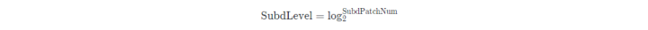
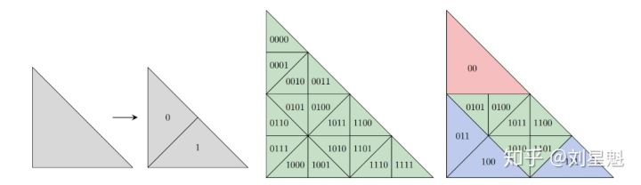
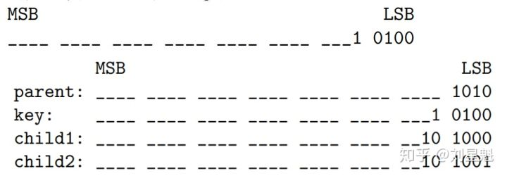
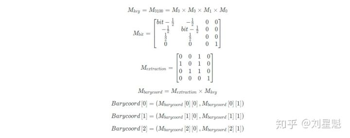
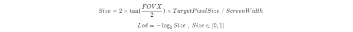
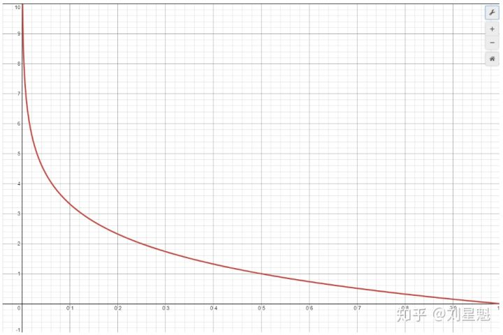
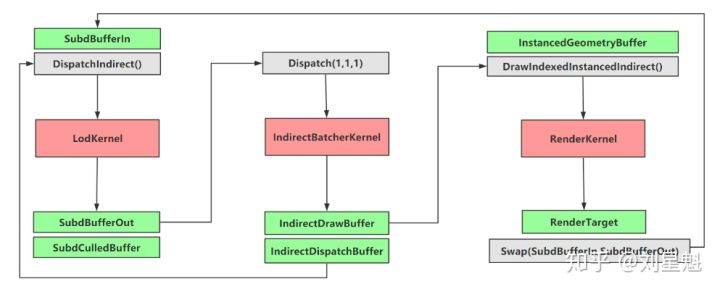
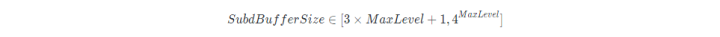
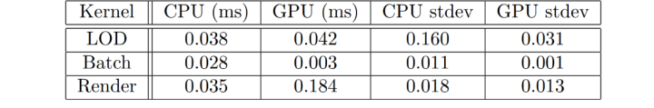

# 自适应GPU几何细分

## 前言

现代GPU是按照Quad-Pixel的方式来进行光栅化的，如果三角形太小同时出现占据跨Quad的Sub-Pixel，就容易出现OverShading的情况，同时ZBuffer性能降低。 为了解决这个问题，Lod系统就自然出现。早期有基于CPU的方法，其问题在于占用了物理计算等游戏逻辑的处理时间。 

而后进化成集成到GPU管线的Tessellation Shader，它的限制有两点，其一是细分等级的限制，目前最多在每个Patch中细分出64个Sub-Patch，也就是以6为上限的细分等级。其二是达到某个细分等级就会出现性能峰值。

本文采用BitMap的方式，以固定Buffer大小为前提，在GPU中能够实现快速且合理的网格细分。原文是OpenGL实现，采用列主序，本文采用行主序表示法。

## 三角形表示法

按二进制的形式存储三角形ID，如此可以快速索引到父与子图元，做到合并及细分操作。 

 每个三角形的一组bit构成一个key，使用32-bit存储，总是在key的高一位追加一个二进制的1，作为“哨兵“，方便检测key的存储状态，如下是key 0100相关表示，MSB和LSB分别代表最高和最低有效位，不相关位使用`_`表示。
 

  key中的每个bit转换成矩阵序列，从中提取出重心坐标，与原三角形顶点计算出key所对应三角形顶点。key是每个三角形的隐式表示，转换成三角形顶点则为显示几何表示。

用重心坐标计算出的三角形边中点与相机坐标计算出距离，进而计算出n个像素所占的像平面大小，n为可调整的值（以下公式中的TargetPixelSize为n）。

  对于自适应细分方法，如果细分后的相邻Lod等级差1以上就会出现T-Junction的情况，会导致在平滑或置换后出现相邻块的缝隙。此方法提供了一个参数来避免这个情况，即是上面公式中的TargetPixelSize，原文测试得出值小于16时可避免缝隙且保持高度细分。

## 处理管线

采用了Double-Buffering的设计，将Runtime计算尽可能的变成GPU-Driven形式，包括填充SubdBuffer,执行Culling,计算并填充Indirect数据等。 

SubdBuffer存储了模型的Index和表示三角形的key，在Lodkernel中分三种情况：细分，保留，合并。判断当前level小于计算出的level则分成两个子key，分别写入。保留原文中使用了等于计算出的key，但是在测试时发生了key不正常更新，在实现里换成了小于父级Level+1的形式，更新正常。合并判断是否为父级的0-bit子级才写入，避免出现同样的记录造成冗余。同时还有单元测试：根节点，叶子节点。

原文中写SubdBuffer下限对应每个相邻三角形细分都差1 Level，上限则是对应均匀细分。(这里我推出的情况是[`*MaxLeveL*+ 1`,`2 ^ MaxLevel`]，理解或有偏差)。

 在计算变换矩阵的时候可能会出现精度误差，可以使用API扩展来支持double精度浮点数。
 此方法在细分等级变化的情况下，会间隔地变换三角形正反面，所以正反面剔除要关闭。
这篇文章以32bit的key为示例，为了增加更多的细分等级，key可以扩展至uint2-4的形式。

## 测试结果

原文测试环境为3.7GHz的Intel i7-8700k，8GB显存的NVidia  GTX1080，TargetPixelSize设置为10。相机俯视向下正对模型，保证处理一致性。同时Shading只用单色，没有复杂的光照计算，尽可能测试本方法的性能，结果如下。 

stdev代表标准差，可以看出此方法性能高效且较稳定，CPU的开销主要在Buffer数据设置和驱动管理。

## 额外内容

### [Frustum Culling](https://link.zhihu.com/?target=http%3A//www.lighthouse3d.com/tutorials/view-frustum-culling/geometric-approach-testing-boxes-ii/) 

基于OBB的剔除，首先将视锥体的平面法线转换到OBB空间，然后计算出最大点和最小点坐标，最后分两种情况，如果最大点到平面的距离为负，则判断模型在视锥体外被剔除，否则进一步判断最小点到平面的距离，为负则相交，为正则在内部，均保留。[(如何提取FrustumPlane)](https://link.zhihu.com/?target=https%3A//www.gamedevs.org/uploads/fast-extraction-viewing-frustum-planes-from-world-view-projection-matrix.pdf) 

AABB则不需要转换法线，其余类似。

### 平滑网格 

此本文介绍的方法可以和网格平滑技术共用。

### [Phong Tessellation](https://link.zhihu.com/?target=https%3A//perso.telecom-paristech.fr/boubek/papers/PhongTessellation/) 

用于平滑网格体的内外轮廓，补足NormalMap和PhongShading无法影响轮廓效果的缺陷。

a. 在原三角形内计算重心插值坐标（Linear tessellation）
b. 计算a中插值点正交投影到每个顶点所在切平面的坐标
c. 通过b中计算的三个投影点再次计算重心插值坐标

## 代码

[Jad Khoury (OpenGL)](https://link.zhihu.com/?target=https%3A//github.com/jadkhoury/TessellationDemo) 
 [Jonathan Dupuy (OpenGL)](https://link.zhihu.com/?target=https%3A//github.com/jdupuy/opengl-framework) 
[我的实现 (Falcor 4.0)](https://link.zhihu.com/?target=https%3A//github.com/ClothoSword/AdaptiveSubdivision)