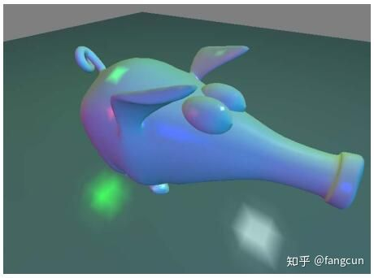
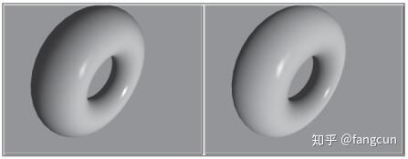
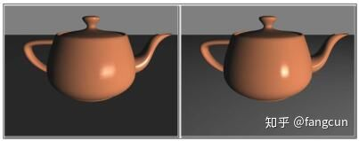
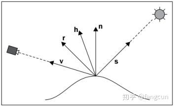
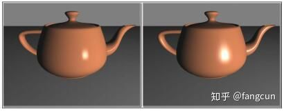
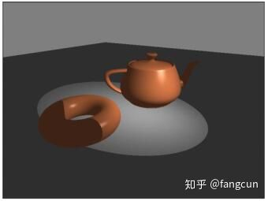
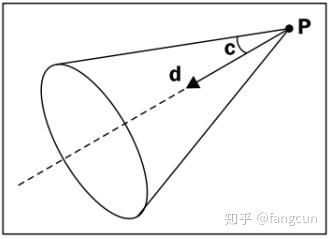
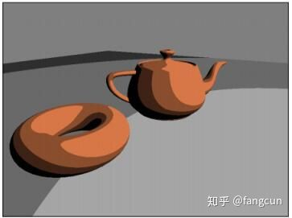
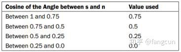
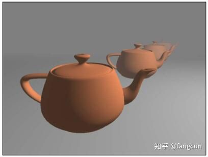

# OpenGL basic lighting model

本文是OpenGL 4.0 Shading Language Cookbook的学习笔记 

在本文我们将介绍下面这些内容： 

·         使用多个点光源进行着色 

·         使用方向光源进行着色 

·         使用逐像素着色来提高真实感 

·         使用半角向量提高性能 

·         模拟聚光灯 

·         模拟卡通风格 

·         模拟雾的效果 

使用多个点光源进行着色 

使用多个光源进行着色时，我们需要对每个光源进行计算，然后把它们的结果相加，最后得到表面反射的光的强度。很自然的，我们可以通过uniform数组来存储光源的位置和光的强度。在这里我们使用一个uniform结构体数组来存储所有光源信息。 

设置OpenGL程序的顶点位置属性的location为0，法线location为1。 

创建使用 ADS(Phong)光照模型的多光源着色器程序的步骤如下： 

\1. 使用下面的顶点着色器： 

\#version 400 
 layout (location = 0) in vec3 VertexPosition; 
 layout (location = 1) in vec3 VertexNormal; 
 out vec3 Color; 
 struct LightInfo { 
 vec4 Position; *// Light position in eye coords.* 
 vec3 Intensity; *// Light intensity* 
 }; 
 uniform LightInfo lights[5]; 
 *// Material parameters* 
 uniform vec3 Kd; *// Diffuse reflectivity* 
 uniform vec3 Ka; *// Ambient reflectivity* 
 uniform vec3 Ks; *// Specular reflectivity* 
 uniform float Shininess; *// Specular shininess factor* 
 uniform mat4 ModelViewMatrix; 
 uniform mat3 NormalMatrix; 
 uniform mat4 MVP; 
 vec3 ads( int lightIndex, vec4 position, vec3 norm ) 
 { 
 vec3 s = normalize( vec3( 
 lights[lightIndex].Position – 
 position) ); 
 vec3 v = normalize(vec3(-position)); 
 vec3 r = reflect( -s, norm ); 
 vec3 I = lights[lightIndex].Intensity; 
 return 
 I * ( Ka + 
 Kd * max( dot(s, norm), 0.0 ) + 
 Ks * pow( max( dot(r,v), 0.0 ), 
 Shininess ) ); 
 } 
 void main() 
 { 
 vec3 eyeNorm = normalize( NormalMatrix * 
 VertexNormal); 
 vec4 eyePosition = ModelViewMatrix * 
 vec4(VertexPosition,1.0); 
 *//Evaluate the lighting equation for each light* 
 Color = vec3(0.0); 
 for( int i = 0; i < 5; i++ ) 
 Color +=ads( i, eyePosition, eyeNorm); 
 gl_Position = MVP * vec4(VertexPosition,1.0); 
 } 
  

\2. 使用下面的片段着色器： 

\#version 400 
 in vec3 Color; 
 layout( location = 0 ) out vec4 FragColor; 
 void main() { 
 FragColor = vec4(Color, 1.0); 
 } 
  

\3. 在OpenGL程序中设置光源数组，代码类似下面： 

prog.setUniform("lights[0].Intensity", vec3(0.0f,0.8f,0.8f) ); 
 prog.setUniform("lights[0].Position", position ); 
  

光源信息存储在lights数组中，示例使用了5个光源。光强存储在Intensiy域中，观察坐标系下的位置信息存储在Position域中。 

函数ads负责光照计算。lightIndex表示光源信息数组索引。 

main函数里的for循环计算每一个光源，并将结果相加写入Color变量。 

片段着色器直接输出了插值后Color变量。 

使用方向光源进行着色 

着色公式的核心组成部分是从表面到光源的向量(也就是前面示例中的s)。对于距离非常远的光源，整个物体表面到光源的向量变化并不大。也就是说，对于非常遥远的光源，表面上的点到光源的向量是相同的。(也可以认为此时光源发出的光线是平行的。)这一光照模型可以用来模拟远距离光源，比如太阳。通常这样的光源被叫做方向光源，它没有位置信息，只有方向。我们实际上忽略掉了光强随距离平方衰减，然而，对于方向光源，这是常见做法。 

对于方向光源，场景中的所有点到光源的方向都是相同的，所以，就不需要重复计算表面上的点到光源的方向，从而提高着色性能。 

当然，点光源和方向光源的光照效果会有视觉上的差异。下面左图使用点光源渲染，右图使用方向光源渲染。左图的点光源在距离圆环较近的某个地方，由于平行光的原因右图相比左图有更多位置被照亮。 

OpenGL的传统管线，使用光源位置的第四个成分来确定它是否为方向光源。如果第四个成分为0，则它为方向光源，位置信息是光源的方向向量。如果为1，位置信息被作为光源位置。在本例，我们使用同样的处理。 

设置OpenGL程序的顶点位置的location为0，法线location为1。 

使用下面的代码创建方向光源的ADS着色程序： 

\1. 使用下面的顶点着色器： 

\#version 400 
 layout (location = 0) in vec3 VertexPosition; 
 layout (location = 1) in vec3 VertexNormal; 
 out vec3 Color; 
 uniform vec4 LightPosition; 
 uniform vec3 LightIntensity; 
 uniform vec3 Kd; *// Diffuse reflectivity* 
 uniform vec3 Ka; *// Ambient reflectivity* 
 uniform vec3 Ks; *// Specular reflectivity* 
 uniform float Shininess; *// Specular shininess factor* 
 uniform mat4 ModelViewMatrix; 
 uniform mat3 NormalMatrix; 
 uniform mat4 ProjectionMatrix; 
 uniform mat4 MVP; 
 vec3 ads( vec4 position, vec3 norm ) 
 { 
 vec3 s; 
 if( LightPosition.w == 0.0 ) 
 s = normalize(vec3(LightPosition)); 
 else 
 s = normalize(vec3(LightPosition - 
 position)); 
 vec3 v = normalize(vec3(-position)); 
 vec3 r = reflect( -s, norm ); 
 return 
 LightIntensity * ( Ka + 
 Kd * max( dot(s, norm), 0.0 )+ 
 Ks * pow( max( dot(r,v), 0.0), 
 Shininess )); 
 } 
 void main() 
 { 
 vec3 eyeNorm = normalize( NormalMatrix * 
 VertexNormal); 
 vec4 eyePosition = ModelViewMatrix * 
 vec4(VertexPosition,1.0); 
 *// Evaluate the lighting equation* 
 Color = ads( eyePosition, eyeNorm ); 
 gl_Position = MVP * vec4(VertexPosition,1.0); 
 } 
  

\2. 使用下面的片段着色器： 

\#version 400 
 in vec3 Color; 
 layout( location = 0 ) out vec4 FragColor; 
 void main() { 
 FragColor = vec4(Color, 1.0); 
 } 
  

我们使用uniform变量LightPosition的第四个成分确定光源是否为方向光源。在ads函数中，s向量由LightPosition的第四个成分决定。如果LightPosition第四个成分为0，LightPosition规范化得到的向量作为光源方向。否则，LightPosition被作为观察坐标系下的一个位置坐标，然后，我们使用LightPosition减顶点位置得到的向量进行规范化，从而得到方向向量。 

由于不需要对每个顶点重新计算光源方向，使用方向光源可以获得轻微的性能提升。我们节约了一次减法操作。在使用多个光源，以及逐片段渲染的情况下，累加起来可以获得的性能提升就非常可观了。 

使用逐像素着色来提高真实感 

在顶点着色器中进行顶点计算(像之前的方法)，我们最后会将颜色和顶点关联。然后颜色在对应的面中进行插值，最后片段着色器将插值的颜色输出到片段。这个着色技术叫做Gouraud着色。Gouraud(和其它着色技术一样)是一个近似模拟，有时可能会导致不期望的结果，比如，在顶点处的效果和多边形中心类似。镜面高光可能位于多边形中心，并非顶点处。所以，简单在顶点处计算着色会导致镜镜面高光没有出现在渲染结果中。还有其它一些瑕疵，比如多边形边缘也可能出现在渲染结果中，原因是生成的颜色是使用插值计算的，而不是真正的使用物理计算。 

为了提升我们的渲染准确度，我们可以将着色计算从顶点着色器移动到片段着色器。将在多边形中进行颜色插值变为进行位置，法线和其它一些着色参数进行插值，然后计算出每个片段的颜色。这个方法被叫做Phong着色或Phong插值。Phong着色的计算结果更加准确，产生的结果也更让人满意，但是仍然存在一些瑕疵。 

下面的图片显示了Gourand和Phong着色的差异。左图使用Gourand(逐顶点)渲染，右图使用Phong(逐片段)渲染。在茶壶下面是一个平面。我们可以发现两个茶壶上的镜面高光是不同的，平面颜色的变化也是不同的。 

在本例，我们使用Phong着色，从顶点着色器输出位置和法线到片段着色器，然后在片段着色器中使用ADS着色模型进行光照计算。 

设置OpenGL程序的顶点位置location为0，法线location为1。为Uniform变量Ka，Kd，Ks和Shininess，LightPosition和LightIntensity设置数据。前四个变量是ADS模型下的标准的材质属性(反射相关的)。后面两个是光源在观察坐标系中的位置，以及光源位置。最后，我们需要为Uniform变量ModelViewMatrix，NormalMatrix，ProjectionMatrix和MVP提供数据。 

创建使用逐片段着色(Phong)和ADS着色模型的着色程序的步骤如下： 

\1. 使用下面的顶点着色器： 

\#version 400 
 layout (location = 0) in vec3 VertexPosition; 
 layout (location = 1) in vec3 VertexNormal; 
 out vec3 Position; 
 out vec3 Normal; 
 uniform mat4 ModelViewMatrix; 
 uniform mat3 NormalMatrix; 
 uniform mat4 ProjectionMatrix; 
 uniform mat4 MVP; 
 void main() 
 { 
 Normal = normalize( NormalMatrix * 
 VertexNormal); 
 Position = vec3( ModelViewMatrix * 
 vec4(VertexPosition,1.0)); 
 gl_Position = MVP * vec4(VertexPosition,1.0); 
 } 
  

\2. 使用下面的片段着色器： 

\#version 400 
 in vec3 Position; 
 in vec3 Normal; 
 uniform vec4 LightPosition; 
 uniform vec3 LightIntensity; 
 uniform vec3 Kd; *// Diffuse reflectivity* 
 uniform vec3 Ka; *// Ambient reflectivity* 
 uniform vec3 Ks; *// Specular* 
 uniform float Shininess; *// Specular shininess factor* 
 layout( location = 0 ) out vec4 FragColor; 
 vec3 ads( ) 
 { 
 vec3 n = normalize( Normal ); 
 vec3 s = normalize( vec3(LightPosition) - 
 Position ); 
 vec3 v = normalize(vec3(-Position)); 
 vec3 r = reflect( -s, n ); 
 return 
 LightIntensity * 
 ( Ka + 
 Kd * max( dot(s, n), 0.0 ) + 
 Ks * pow( max( dot(r,v), 0.0 ), Shininess ) ); 
 } 
 void main() { 
 FragColor = vec4(ads(), 1.0); 
 } 
  

顶点着色器输出了两个变量：Position和Normal。在main函数中，我们使用NormalMatrix将顶点法线转换到观察坐标系，并将结果保存在Normal中。与之类似，我们使用模型视图矩阵转换了顶点位置，并将结果保存在Position。 

Position和Normal经过插值后作为片段着色器的输入变量。然后片段着色器使用ADS着色模型计算光照。最后在保存结果在FragColor中。 

在片段着色器中进行着色计算会使渲染结果更加准确。然而，它会产生大量的运算，降低渲染速度。好在，现代硬件已经足够强大来弥补减少的性能，几乎可以为逐片段和逐顶点着色提供相同的渲染效率。 

使用半角向量提高性能 

ADS着色计算使用了反射向量  

 和指向观察者的向量  

 。 

进行上面的运算，我们首先要计算反射向量  

 。它是光源的方向向量(  

 )关于法线向量(  

 )的反射向量。 

上面的运算已经被GLSL实现为  

 函数。 

我们可以看到，运算含有一个点积，一个加法，两个乘法。通过观察我们发现，当把  

 赋值为  

时，法线向量(  

 )为向量  

 和向量  

 相加的一半。 

我们定义半角向量为向量  

 和向量  

 相加后得到的向量  

 ，向量  

 在向量  

 和向量  

 之间的一半处，  

 在加法后已经规范化： 

 

我们可以替换镜面光计算中的点积为向量  

 和向量  

 的点积。 

相比于计算向量  

 ，计算向量  

 的运算更少。当这些向量都位于同一平面内时，半角向量和法线向量之间的角度与反射向量  

 和指向观察者的向量  

 之间的角度成比例关系。因此，我们可以得到与使用反射向量  

 相似的结果，尽管并不完全相同。 

我们直接修改在使用逐像素着色来提高真实感中使用的着色器程序，使用和它一样OpenGL程序。 

我们使用在使用逐像素着色来提高真实感中使用的着色器程序，替换ads函数的代码为下面的代码： 

vec3 ads( ) 
 { 
 vec3 n = normalize( Normal ); 
 vec3 s = normalize( vec3(LightPosition) - 
 Position ); 
 vec3 v = normalize(vec3(-Position)); 
 vec3 h = normalize( v + s ); 
 return 
 LightIntensity * 
 (Ka + 
 Kd * max( dot(s, Normal), 0.0 ) + 
 Ks*pow(max(dot(h,n),0.0), Shininess)); 
 } 
  

我们通过将指向观察者的向量  

 和指向光源的向量  

 相加，然后规范化得到半角向量，将其赋给  

 。 

接着，镜面光计算修改为使用向量  

 法线法线向量Normal进行。剩余部分没有变化。 

使用半角向量可以轻微提升镜面计算的性能，并且可以产生十分相似的结果。下面右图使用半角渲染，半角向量会产生更大的镜面高光，但产生的效果没有本质不同，如果愿意，我们可以通过增大Shininess的值来增加高光部分的大小。 

模拟聚光灯 

固定管线还有一种叫做聚光灯的光源。这种光源照亮可以照亮一个圆锥体范围内的物体，圆锥体的顶点位于光源位置。并且，光强从圆锥体的轴开始到圆锥体边缘逐渐减弱。这就使得我们可以实现和真实聚光灯的类似效果。 

我们将编写一个着色器实现类似固定管线聚光灯的效果。 

聚光灯的圆锥体由方向(图中的  

 )，半角(图中的c)，和位置(图中的P)确定。聚光灯的光强在圆锥体的轴处最强，越接近边缘越弱。 

我们从使用逐像素着色来提高真实感中的着色器程序开始。设置OpenGL程序的Uniform变量。 

我们使用下面的代码创建使用ADS着色的聚光灯的片段着色器。 

\#version 400 
 in vec3 Position; 
 in vec3 Normal; 
 struct SpotLightInfo { 
 vec4 position;*//Position in eye coords.* 
 vec3 intensity;*//Amb., Diff., and Specular intensity* 
 vec3 direction;*//Normalized direction of the spotlight* 
 float exponent;*//Angular attenuation exponent* 
 float cutoff;*//Cutoff angle (between 0 and 90)* 
 }; 
 uniform SpotLightInfo Spot; 
 uniform vec3 Kd; *// Diffuse reflectivity* 
 uniform vec3 Ka; *// Ambient reflectivity* 
 uniform vec3 Ks; *// Specular reflectivity* 
 uniform float Shininess; *// Specular shininess factor* 
 layout( location = 0 ) out vec4 FragColor; 
 vec3adsWithSpotlight( ) 
 { 
 vec3 s = normalize( vec3( Spot.position) - 
 Position ); 
 float angle = acos( dot(-s, Spot.direction) ); 
 float cutoff = radians( clamp( Spot.cutoff, 
 0.0, 90.0 ) ); 
 vec3 ambient = Spot.intensity * Ka; 
 if( angle < cutoff ) { 
 float spotFactor = pow( dot(-s, 
 Spot.direction), 
 Spot.exponent ); 
 vec3 v = normalize(vec3(-Position)); 
 vec3 h = normalize( v + s ); 
 return 
 ambient + 
 spotFactor*Spot.intensity*( 
 Kd*max(dot(s, Normal),0.0)+ 
 Ks*pow(max(dot(h,Normal),0.0), 
 Shininess)); 
 } else { 
 return ambient; 
 } 
 } 
 void main() { 
 FragColor = vec4(adsWithSpotlight(), 1.0); 
 } 
  

结构体SpotLightInfo定义了聚光灯所有属性。我们使用Uniform变量Spot来存储聚光灯属性。position域定义了聚光灯在观察坐标系下的坐标。intensity域定义了聚光灯的光强(环境光，散射光和镜面光)。如果愿意，也可以使用三个变量表示不同种类光的光强。direction域定义了聚光灯指向的方向，也就是聚光灯圆锥体的轴。这个向量应该定义在观察者坐标系下。在OpenGL程序中，它应该使用类似变换法线的法线矩阵进行转换。我们可以在着色器中进行变换；但是，在着色器中，法线矩阵针对渲染的对象。对于聚光灯方向可能并不合适。 

exponent域定义了聚光灯的衰减指数。聚光灯的光强和从光源到表面的向量(-s)与聚光灯方向的夹角的余弦成比例。余弦值的exponent次方被作为光强系数。exponent的值越大，光强衰减地越快。这和镜面光着色使用的指数十分类似。 

cutoff域定义了聚光灯圆锥体的轴和边界之间的角度。我们在这里使用角度作为单位，值的范围为[0,90]。 

函数adsWithSpotlight使用聚光灯作为光源计算标准的环境光，散射光和镜面光(ADS)。首先计算表面位置到聚光灯位置的向量(s)。接着，将聚光灯方向向量规范化后保存在spotDir中。向量spotDir和向量-s之间的角度被保存在angle中。变量cutoff保存了Spot.cutoff截断到0到90后的弧度值。ambient变量保存了环境光成分的计算结果。 

然后，我们比较了变量angle和变量cutoff的大小。如果angle小于cutoff，说明该点位于聚光灯的圆锥体中。否则，这个点只能接收到环境光，这时，我们只返回环境光成分。 

如果angle小于cutoff，我使用向量-s和向量spotDir的点积的Spot.exponent次方作为spotFactor。spotFactor被用来对光强进行缩放，在圆锥体中心，它的值最大，从中心到边缘逐渐减小。最后，我们进行ADS着色，对散射光和镜面光使用spotFactor进行缩放。 

模拟卡通风格 

Toon着色(也叫Celshading，卡通着色)是一种非相片感的着色技术，常常被用来模拟手绘风格。有许多不同的方法可以产生这种效果。在这里，我们使用一种非常简单的方法来实现它，这种方法只需要对环境光和散射光模型进行很小的修改。 

卡通着色会产生大面积相同颜色的区域，且不同区域之间的颜色是没有过渡的。这可以用来模拟艺术家使用刷子和画笔上色。下图是使用卡通着色渲染的圆环和茶壶。 

这里使用的方法只使用了ADS光照模型的环境光和散射光成分进行计算，最后对散射光中使用到的余弦值进行量化。换句话说，在散射光计算中用到点积运算结果被限定为固定的几个值。下表使用了四个值来转换余弦值： 

在上面的表格中，向量  

 是指向光源的向量，向量  

 是表面的法线向量。通过对余弦值进行转换，我们可以渲染出具有明显层次差异的图像，从而模拟出手绘的风格。 

我们从使用逐像素着色来提高真实感使用的顶点着色器开始。首先我们在OpenGL程序中设置顶点着色器和片段着色器使用的Uniform变量的值。 

我们使用下面的代码创建可以产生卡通着色效果的片段着色器： 

\#version 400 
 in vec3 Position; 
 in vec3 Normal; 
 struct LightInfo { 
 vec4 position; 
 vec3 intensity; 
 }; 
 uniform LightInfo Light; 
 uniform vec3 Kd; *// Diffuse reflectivity* 
 uniform vec3 Ka; *// Ambient reflectivity* 
 const int levels = 3; 
 const float scaleFactor = 1.0 / levels; 
 layout( location = 0 ) out vec4 FragColor; 
 vec3 toonShade( ) 
 { 
 vec3 s = normalize( Light.position.xyz - 
 Position.xyz ); 
 float cosine = max( 0.0, dot( s, Normal ) ); 
 vec3 diffuse = Kd * floor( cosine * levels ) * 
 scaleFactor; 
 return Light.intensity * (Ka + diffuse); 
 } 
 void main() { 
 FragColor = vec4(toonShade(), 1.0); 
 } 
  

常量levels定义了在散射光计算中使用的值的数量。也可以把它定义为Uniform变量，这样我们就可以在OpenGL程序中配置它。我们会使用这个变量来量化散射光计算中的余弦值。 

toonShade函数是整个着色器最重要的部分。我们从计算指向光源的向量s开始。接着，我们通过对向量s和向量Normal进行点积运算得到它们之间的余弦值。然后，使用下面的方法来量化它。因为两个向量已经被规范化，且我们使用  

 函数移除了负值，所以我们可以确定cosine的值在0到1之间。将cosine的值乘以levels，然后将结果取整将得到一个0到level-1的整数。我们用这个数字除以levels(通过乘以scaleFactor，就将其缩放到0到1的范围。这时，这个值就在levels的值域中了。然后将它再乘以散射光的属性Kd，得到散射光的最终计算结果。 

最后，我们将散射光和环境光成分组合得到片段的最终颜色。 

量化cosine时，我们可以使用  

 函数替换  

 函数。这样做会使效果上升一个层级，使渲染出的颜色比之前稍微明亮些。 

模拟雾的效果 

一种简单的实现雾的方法是将片段颜色与雾的颜色混合。雾颜色的影响大小由相机到它的距离决定。我们既可以使用线性关系，也可以使用非线性关系，比如指数关系来决定雾的影响大小变化。 

下图使用线性关系来产生雾的效果。 

我们使用下面这个线性关系： 

 

 为观察者到雾的最小距离(这里没有雾成分)，  

 处除了雾颜色不存在其它颜色成分。变量  

 表示片段到观察者的距离。  

 被叫做fog factor。fog factor为0表示100%的雾， 

fog factor为1则表示没有雾。 

在距离较大的情况下，雾通常看起来很厚。当  

 等于  

 时fog factor最小，当  

 等于  

 时，fog factor最大。 

因为雾效是在片段着色器进行的，只有绘制物体的地方才会应用雾效。在没有物体渲染的空间，不会使用雾效，我们可以使用雾的颜色作为背景色来让渲染结果看上去更自然。 

我们从使用逐像素着色来提高真实感使用的顶点着色器开始。首先我们在OpenGL程序中设置顶点着色器和片段着色器使用的Uniform变量的值。 

我们使用下面的代码创建模拟雾的效果的片段着色器。 

\#version 400 
 in vec3 Position; 
 in vec3 Normal; 
 struc tLightInfo { 
 vec4 position; 
 vec3 intensity; 
 }; 
 uniform LightInfo Light; 
 struct FogInfo { 
 float maxDist; 
 float minDist; 
 vec3 color; 
 }; 
 uniform FogInfo Fog; 
 uniform vec3 Kd; *// Diffuse reflectivity* 
 uniform vec3 Ka; *// Ambient reflectivity* 
 uniform vec3 Ks; *// Specular reflectivity* 
 uniform float Shininess; *// Specular shininess factor* 
 layout( location = 0 ) out vec4 FragColor; 
 vec3 ads( ) 
 { 
 vec3 s = normalize( Light.position.xyz - 
 Position.xyz ); 
 vec3 v = normalize(vec3(-Position)); 
 vec3 h = normalize( v + s ); 
 vec3 ambient = Ka * Light.intensity; 
 vec3 diffuse = Light.intensity * Kd * 
 max(0.0, dot(s, Normal) ); 
 vec3 spec = Light.intensity * Ks * 
 pow( max( 0.0, dot( h, Normal) ), Shininess ); 
 return ambient + diffuse + spec; 
 } 
 void main() { 
 float dist = abs( Position.z ); 
 float fogFactor = (Fog.maxDist - dist) / 
 (Fog.maxDist - Fog.minDist); 
 fogFactor = clamp( fogFactor, 0.0, 1.0 ); 
 vec3 shadeColor = ads(); 
 vec3 color = mix( Fog.color, shadeColor, 
 fogFactor ); 
 FragColor = vec4(color, 1.0); 
 } 
  

我们在这里使用的ads函数几乎和在使用半角向量提高性能中的相同。区别仅仅是使用了不同的变量名。处理雾效的代码在main函数中。 

Uniform变量Fog包含了雾的范围和颜色信息。minDist域是雾的起点，maxDist域是雾的终点。color域是雾的颜色。 

在代码中，我们使用线性关系来对雾进行衰减，此外，也可以使用指数关系进行衰减，比如使用下面的式子进行衰减： 

上式中的  

 表示雾的密度。  

 的值越大，雾越浓厚。此外，我们还可以将指数平方，这样雾的衰减速度会更快。 

从观察者计算距离 

上面的代码中，我们使用z值作为到点到相机的距离。这可能在一些情况下，让雾看起来不真实。我们可以替换下面的代码计算更为精确的距离： 

替换为： 

后一个版本的代码由于需要计算平方根，所以在实践中速度会有点慢。 

 

来自 <<https://zhuanlan.zhihu.com/p/57712881>>  

 

 