# 高光IBL 

高光IBL 

写在前面：由于这是一篇来自LearnOpengl的翻译的文章 ，目前网站上只有英文版的没有中文的，我按照自己的理解的翻译一下(个别翻译可能有问题)：原文地址: 

<https://learnopengl.com/PBR/IBL/Specular-IBL> 

**高光****IBL** 

在上一篇教程中，我们通过预计算（**pre-computing**）一个辐照度图作为光照非直接漫反射部分将PBR与基于图像的照明结合起来。在本教程中，我们将关注反射率方程的镜面部分 

*Lo*(*p*,*ωo*)=∫Ω(*kdcπ*+*ksDFG*4(*ωo*⋅*n*)(*ωi*⋅*n*))*Li*(*p*,*ωi*)*n*⋅*ωidωi*Lo(p,ωo)=∫Ω(kdcπ+ksDFG4(ωo⋅n)(ωi⋅n))Li(p,ωi)n⋅ωidωi L_o(p,\omega_o) = \int\limits_{\Omega} (k_d\frac{c}{\pi} + k_s\frac{DFG}{4(\omega_o \cdot n)(\omega_i \cdot n)}) L_i(p,\omega_i) n \cdot \omega_i d\omega_i Lo(p,ωo)=Ω∫(kdπc+ks4(ωo⋅n)(ωi⋅n)DFG)Li(p,ωi)n⋅ωidωi 

你会注意到Cook-Torrance镜面部分(乘以 *ks*ks k_{s} ks)在积分上不是常数，它取决于入射光的方向，也取决于观察方向. 试图求解所有入射光方向的积分，包括所有可能的视图方向，是一种耗费高代价大并且无法实时计算的方式。Epic Games提出了一种解决方案，他们可以为实时目的对高光部分进行预卷积，并给出了一些折衷方案，即所谓的 分割和近似（ split sum approximation). 

分割和近似将反射率方程的镜面部分分割为两个独立的部分，我们可以分别对其进行卷积，然后把基于图像的间接的高光照明合并到PBR着色器。与我们预卷积辐照度映射方式类似，分割和近似需要一个HDR环境贴图作为其卷积输入。为了理解分割和近似，我们将再次查看反射率方程，但这一次只关注镜面部分(我们在[前一个](https://learnopengl.com/PBR/IBL/Diffuse-irradiance)教程中提取了漫反射部分): 

*Lo*(*p*,*ωo*)=∫Ω(*ksDFG*4(*ωo*⋅*n*)(*ωi*⋅*n*)*Li*(*p*,*ωi*)*n*⋅*ωidωi*=∫Ω*fr*(*p*,*ωi*,*ωo*)*Li*(*p*,*ωi*)*n*⋅*ωidωi*Lo(p,ωo)=∫Ω(ksDFG4(ωo⋅n)(ωi⋅n)Li(p,ωi)n⋅ωidωi=∫Ωfr(p,ωi,ωo)Li(p,ωi)n⋅ωidωi L_o(p,\omega_o) = \int\limits_{\Omega} (k_s\frac{DFG}{4(\omega_o \cdot n)(\omega_i \cdot n)} L_i(p,\omega_i) n \cdot \omega_i d\omega_i = \int\limits_{\Omega} f_r(p, \omega_i, \omega_o) L_i(p,\omega_i) n \cdot \omega_i d\omega_i Lo(p,ωo)=Ω∫(ks4(ωo⋅n)(ωi⋅n)DFGLi(p,ωi)n⋅ωidωi=Ω∫fr(p,ωi,ωo)Li(p,ωi)n⋅ωidωi 

由于与辐照度卷积相同的(性能)原因，我们无法实时求解镜面部分积分并得到我们希望的合理的性能.所以我们最好预先计算这个积分来得到一个高光的IBL图，用片段的法线对这个图进行采样，然后处理它.然而，这就是它变得有点棘手的地方。我们能够预计算只取决于*ωi*ωi ω_i ωi的辐照度图的积分，我们可以把漫反射常数项移到积分的外面。此时 这个BRDF 积分不仅仅取决于*ωi*ωi ω_i ωi了： 

*fr*(*p*,*wi*,*wo*)=*DFG*4(*ωo*⋅*n*)(*ωi*⋅*n*)fr(p,wi,wo)=DFG4(ωo⋅n)(ωi⋅n) f_r(p, w_i, w_o) = \frac{DFG}{4(\omega_o \cdot n)(\omega_i \cdot n)} fr(p,wi,wo)=4(ωo⋅n)(ωi⋅n)DFG 

这次的积分也依赖于*ωo*ωo ω_o ωo我们不能对一个有两个方向向量的预先计算的cubemap进行采样.正如前一篇教程中描述的，**p**的位置在这里(跟谁)都么有联系）.实时预计算这个积分的*ωi*ωi ω_i ωi和*ωi*ωi ω_i ωi所有可能组合是不可能。 

Epic Games的分割和近似解决了这个问题，它将预计算分割为两个独立的部分，我们可以将这两个部分合并在一起，从而得到我们想要的预计算结果。分割和近似将镜面积分分为两个独立的积分: 

*Lo*(*p*,*ωo*)=∫Ω*Li*(*p*,*ωi*)*dωi*∗∫Ω*fr*(*p*,*ωi*,*ωo*)*n*⋅*ωidωi*Lo(p,ωo)=∫ΩLi(p,ωi)dωi∗∫Ωfr(p,ωi,ωo)n⋅ωidωi L_o(p,\omega_o) = \int\limits_{\Omega} L_i(p,\omega_i) d\omega_i * \int\limits_{\Omega} f_r(p, \omega_i, \omega_o) n \cdot \omega_i d\omega_i Lo(p,ωo)=Ω∫Li(p,ωi)dωi∗Ω∫fr(p,ωi,ωo)n⋅ωidωi 

第一部分(卷积时)称为预过滤环境映射 ，这是(类似于辐照度图)预计算环境卷积映射,但这次要考虑到粗糙度。为了增加粗糙度级别，环境映射需要更多分散的采样向量被卷积，来产生更多模糊的反射。我们在预过滤图的mipmap级别中有序的存储模糊的结果。例如，在5个mipmap级别中存储5个不同粗糙度值的预卷积的预过滤环境映射看起来是这样的： 

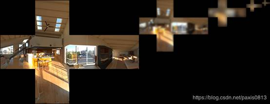

我们将该函数法向和视图方向都作为输入来使用Cook-Torrance BRDF的正态分布函数(NDF)生成采样向量及其散射强度。由于卷积环境贴图映射时，我们事先不知道视图方向，Epic Games 通过猜测视图方向来使得进一步的接近(镜面反射方向)输出样本*ωo*ωo ω_o ωo方向。这使得它转为下面的代码： 

vec3 N = normalize(ωo); 
 vec3 R = N; 
 vec3 V = R; 

这样，预先过滤的环境卷积就不需要知道视图的方向。意味着当我们从如下图所示的角度观察镜面反射时，我们并没有得到很好的grazing镜面反射(*courtesy of the Moving Frostbite to PBR article*);然而，这通常被认为是一种可以接受的方式: 

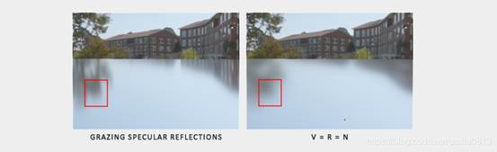

方程的第二部分等于镜面积分的BRDF部分。如果我们假设传入的各个方向都是纯白光(因此L(p,x)= 1.0 )我们可以输入一个粗糙度和一个在法线n和光线方向*wi*wi w_i wi或者n**wi*wi w_i wi之间的角度值来预计算出BRDF结果。Epic Games将预先计算的BRDF结合每个法线和光方向合并出不同粗糙度值存储在二维查找纹理(LUT)中也就是BRDF集成图（**BRDF integration** map。二维查找纹理图片输出一定比例的(红色)和一个偏差值(绿色)到物体表面的产生菲涅尔现象，给出我们镜面的第二部分的积分: 

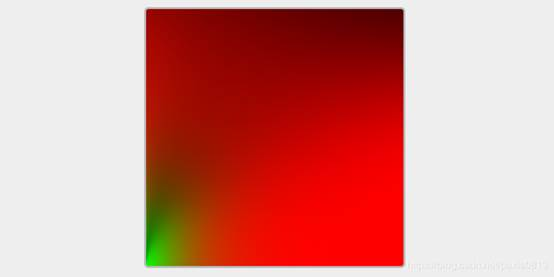

我们通过把一个平面的水平纹理坐标（在0.0.和1.0范围之间）和竖直方向纹理坐标作为BRDF中的 n* *wi*wi w_i wi和粗糙度从而产生一个查找图。有了这个BRDF积分图和预先过滤的环境图，我们可以将两者结合起来得到镜面积分的结果： 


 float lod             = getMipLevelFromRoughness(roughness); 
 vec3 prefilteredColor = textureCubeLod(PrefilteredEnvMap, refVec, lod); 
 vec2 envBRDF          = texture2D(BRDFIntegrationMap, vec2(NdotV, roughness)).xy; 
 vec3 indirectSpecular = prefilteredColor * (F * envBRDF.x + envBRDF.y)  

这将让你大致了解Epic Games的分割和近似是如何粗略等于反射率方程的间接镜面部分的公式的。现在让我们尝试自己构建预卷积的部分。 

**Pre-filtering an HDR environment map** 

预过滤环境图与我们如何卷积辐照度图非常相似。不同之处在于，我们现在考虑了粗糙度，并在预先过滤的贴图的mip级别中有顺序的存储了的粗糙度反射. 

首先，我们需要生成一个新的cubemap来保存预过滤的环境图数据。为了确保为其mip级别分配足够的内存，我们将glGenerateMipmap作为一种分配所需内存数量的方法。 

unsigned int prefilterMap; 
 glGenTextures(1, &prefilterMap); 
 glBindTexture(GL_TEXTURE_CUBE_MAP, prefilterMap); 
 for (unsigned int i = 0; i < 6; ++i) 
 { 
     glTexImage2D(GL_TEXTURE_CUBE_MAP_POSITIVE_X + i, 0, GL_RGB16F, 128, 128, 0, GL_RGB, GL_FLOAT, nullptr); 
 } 
 glTexParameteri(GL_TEXTURE_CUBE_MAP, GL_TEXTURE_WRAP_S, GL_CLAMP_TO_EDGE); 
 glTexParameteri(GL_TEXTURE_CUBE_MAP, GL_TEXTURE_WRAP_T, GL_CLAMP_TO_EDGE); 
 glTexParameteri(GL_TEXTURE_CUBE_MAP, GL_TEXTURE_WRAP_R, GL_CLAMP_TO_EDGE); 
 glTexParameteri(GL_TEXTURE_CUBE_MAP, GL_TEXTURE_MIN_FILTER, GL_LINEAR_MIPMAP_LINEAR);  
 glTexParameteri(GL_TEXTURE_CUBE_MAP, GL_TEXTURE_MAG_FILTER, GL_LINEAR); 
  

glGenerateMipmap(GL_TEXTURE_CUBE_MAP); 
  

注意，因为我们计划对prefilterMap及其mipmap进行采样，所以需要确保将其缩小过滤器设置为GL_LINEAR_MIPMAP_LINEAR以启用三线性过滤。我们将预先过滤的镜面反射以128×128的分辨率存储在其基本mip的级别。这对于大多数反射来说已经足够了，但是如果你有大量光滑的材质(比如汽车反射)，你可能需要提高分辨率。 

在前面的教程中我们通过在半球Ω上使用球坐标生成通用的采样向量来卷积环境图。虽然这对于辐照度来说很好，但是对于镜面反射来说效率就低了。当涉及到镜面反射时，基于表面的粗糙度，光线会围绕反射矢量r在法向n上进行近距离或粗略的反射，但是(除非表面非常粗糙)在反射矢量周围： 

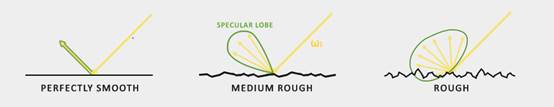

通常可能输出的光线的反射形状就是我们所知的高光瓣（specular lobe）。随着粗糙度的增加specular lobe的大小也会增加;specular lobe 的形状随着入射光方向的不同而变化。因此，specular lobe 的形状很依赖于材料. 

当涉及到微表面模型时，我们可以把这个specular lobe想象成在给定入射光方向的微面半矢量上的反射方向。由于大多数光线最终会反射到微面半矢量周围的一个specular lobe 中，以与大多数向量相似的方式生成采样向量是有意义的，否则就是浪费。这个个过程称为重要采样（ importance sampling）。 

**蒙特卡罗积分和重要采样（** **importance sampling****）** 

为了充分理解importance sampling，我们首先一个引入一个数学构造模型就是我们知道的蒙特卡罗积分（ Monte Carlo integration）。蒙特卡洛积分主要围绕统计和概率论的结合。蒙特卡罗帮助通过离散方式解决了不需要考虑总体的情况下求出总体中的某个统计量或值的问题。 

例如，假设您想计算一个国家所有公民的平均身高。为了得到你想要的结果，你可以测量每个公民的身高，然后求出他们的平均身高，这样你就能得到你想要的准确答案。然而，由于大多数国家都有相当多的人口，这并不是一个现实的方法:它将需要太多的精力和时间。 

另一种方法是选择一个很小的完全随机的人群子集，测量他们的身高并对结果取平均值。这个人口可能只有100人。虽然没有准确的答案准确，但你会得到一个相对接近基本事实的答案。这就是众所周知的**大数定律**（law of large numbers）。它的思想是，如果你从总体中测量一个更小的随机样本集N，结果会随着样本N的增加会越来越接近真实答案。 

蒙特卡罗积分建立在大数定律的基础上，采用同样的方法求解积分。而不是求所有可能的(理论上无限的)样本值x的积分，简单地总体和平均值中随机选取生成N个采样值然后平均他们。随着N的增加，我们可以得到的结果越接近积分的真实答案: 

*O*=∫*abf*(*x*)*dx*=1*N*∑*N*−1*i*=0*f*(*x*)*pdf*(*x*)O=∫abf(x)dx=1N∑i=0N−1f(x)pdf(x) O = \int\limits_{a}^{b} f(x) dx = \frac{1}{N} \sum_{i=0}^{N-1} \frac{f(x)}{pdf(x)} O=a∫bf(x)dx=N1i=0∑N−1pdf(x)f(x) 

为了求解这个积分，我们取N个随机样本除以从a到b的总体值，将它们加在一起，除以样本总数，求平均值。pdf代表概率密度函数，它告诉我们一个特定样本发生在整个样本集上的概率。例如人口高度的pdf看起来有点像这样: 

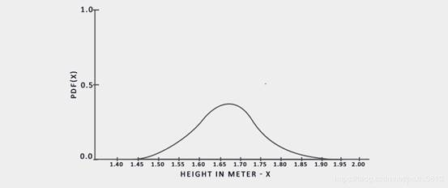

从这张图中我们可以看到如果我们取任意一个总体的随机样本，选择身高170的人作为样本的概率更高，而样本高度为1.5的概率较低。涉及蒙特卡罗积分时，一些样本可能比其他样本有更高的概率。这就是为什么对于一般的蒙特卡罗我们要根据pdf将采样值除以或乘以采样概率评估。到目前为止，任一种积分评估生成的样本都是均匀的，生成的概率完全相同。到目前为止，我们的评估是没有偏差的，这意味着在不断增加的样本数量下，我们最终会收敛到积分的精确解。 

然而，一些蒙特卡罗估计是有偏差(biased)的，这意味着生成的样本不是完全随机的，而是集中在一个特定的值或方向上。这些有偏差的蒙特卡罗估计具有更快的收敛速度（faster rate of convergence ），这意味着它们可以以更快的速度收敛到精确解，但由于它们的偏差它们可能永远不会收敛到精确的解。这通常是一个可以接受的权衡方法，特别是在计算机图形学中，因为精确的解决方案并不太重要，只要结果在视觉上是可接受的。我们很快就会看到， importance sampling(使用有偏差估计器)生成的样本偏向于特定的方向，在这种情况下，我们通过将每个样本乘以或除以其对应的pdf来计算这一点。 

蒙特卡罗积分在计算机图形学中非常普遍，因为它是一种非常直观的方法，以离散和高效的方式近似连续积分： 

采取任何面积/体积样品(如半球**Ω**),生成神经网络的随机样本内的面积/体积总和 和权衡每个样本对最终结果的贡献。 

蒙特卡罗积分是一个广泛的数学主题，我们不去深入研究其中的细节，但是我们会提到产生随机样本的多种方法。默认情况下，每个样本都是完全(伪)随机的。但是通过利用半随机序列的某些性质，我们可以生成仍然是随机的样本向量，但是有一些有趣的性质。例如，我们可以对产生的随机样本的低差异序列（low-discrepancy sequence）进行蒙特卡罗积分，但是每个样本的分布得更加均匀: 

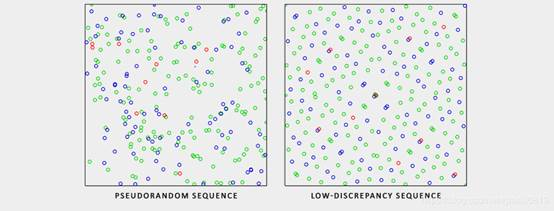

当使用低差异序列生成蒙特卡罗样本向量时，这个过程被称为（Quasi-Monte Carlo integration）准蒙特卡罗积分。准蒙特卡罗方法具有较快的收敛速度，这对于性能要求较高的应用程序非常有用。 

根据我们新近获得的蒙特卡罗和准蒙特卡罗积分的知识，我们可以利用一个有趣的性质来获得更快的收敛速度，即重要性抽样（importance sampling）。我们在本教程中已经提到过，但是当提到光的镜面反射时，反射光向量被限制在一个由表面粗糙度决定大小的specular lobe中。由于任意(准)随机产生的采样在镜面外与镜面积分无关，因此在镜面内采样积分是有用的，但代价是使蒙特卡罗估计值会产生偏差。 

这就是抽样的本质：在微表面半圆向量周围的粗糙度约束下，产生样本向量。将模拟蒙特卡罗采样与低差异序列相结合，利用重要采样对样本向量进行偏置，得到了较高的收敛速度。因为我们以更快的速度得到解，所以我们需要更少的样本就可以得到足够的近似值。正因为如此，这种组合甚至允许图形应用程序实时求解镜面积分，尽管它仍然比预先计算结果慢得多。 

**low-discrepancy****序列** 

在本教程中，我们将使用基于准蒙特卡罗方法的随机低差异序列的重要性抽样，预先计算间接反射方程的镜面部分。我们将要使用的序列被称为哈默斯利序列（Holger Dammertz)，正如[霍尔格·达默茨仔细（Holger Dammertz）](http://holger.dammertz.org/stuff/notes_HammersleyOnHemisphere.html)描述的那样。哈默斯利序列（Hammersley Sequence ）基于范德语料库（ Van Der Corpus）序列，该序列在小数点周围使用一个十进制的二进制的镜像。 

使用一些巧妙的技巧，我们可以在着色程序中非常有效地生成范德语料库序列，我们将使 i 除以 总样本N 获得哈默斯利序列样本: 


​     float RadicalInverse_VdC(uint bits)  
​     { 
​         bits = (bits << 16u) | (bits >> 16u); 
​         bits = ((bits & 0x55555555u) << 1u) | ((bits & 0xAAAAAAAAu) >> 1u); 
​         bits = ((bits & 0x33333333u) << 2u) | ((bits & 0xCCCCCCCCu) >> 2u); 
​         bits = ((bits & 0x0F0F0F0Fu) << 4u) | ((bits & 0xF0F0F0F0u) >> 4u); 
​         bits = ((bits & 0x00FF00FFu) << 8u) | ((bits & 0xFF00FF00u) >> 8u); 
​         return float(bits) * 2.3283064365386963e-10; // / 0x100000000 
​     } 
​     // ---------------------------------------------------------------------------- 
​     vec2 Hammersley(uint i, uint N) 
​     { 
​         return vec2(float(i)/float(N), RadicalInverse_VdC(i)); 
​     }   

GLSL Hammersley函数给出了大小为N的总样本集的低差异样本i。 

哈默斯利序列不支持位操作符的情况： 

并非所有与OpenGL相关的驱动程序都支持位操作符(例如WebGL和OpenGL ES 

2.0)，在这种情况下，您可能希望使用不依赖于位操作符的范德语料库序列的替代版本: 

​    float invBase = 1.0 / float(base); 
​     float denom   = 1.0; 
​     float result  = 0.0; 
  

for(uint i = 0u; i < 32u; ++i) 
     { 
         if(n > 0u) 
         { 
             denom   = mod(float(n), 2.0); 
             result += denom * invBase; 
             invBase = invBase / 2.0; 
             n       = uint(float(n) / 2.0); 
         } 
     } 
  

return result; } // ---------------------------------------------------------------------------- vec2 HammersleyNoBitOps(uint i, uint N) { 
     return vec2(float(i)/float(N), VanDerCorpus(i, 2u)); } ``` 

注意，在旧硬件中的GLSL中，循环遍历32位序列是受到限制的。但是如果您发现自己没有位操作符，那么它就可以在所有硬件上工作. 

**GGX Importance sampling** 

（我们）不在在半球Ω的积分上均匀或随机(蒙特卡罗)生成采样向量， 我们会偏向于依据表面的粗糙度向朝向微表面半矢量的一般反射方向生成有**偏向的**(biased)样本向量。采样过程与我们之前看到的类似:生成一个随机(低差异)序列值,取序列值在切空间中生成样本向量，转换到世界空间，采样场景的辐射率。不同的是，我们现在使用低差异序列值作为输入来生成一个样本向量： 

const uint SAMPLE_COUNT = 4096u; 
 for(uint i = 0u; i < SAMPLE_COUNT; ++i) 
 { 
     vec2 Xi = Hammersley(i, SAMPLE_COUNT);    

此外，为了建立一个采样向量，我们需要一些方法，使采样向量的方向偏置一些表面粗糙的specular lobe。我们可以采用[**Theory**](https://learnopengl.com/#!PBR/Theory) 中描述的NDF并且将在Epic Games所描述的那样将GGX和 NDF在球形样本向量过程中结合: 

vec3 ImportanceSampleGGX(vec2 Xi, vec3 N, float roughness) 
 { 
     float a = roughness*roughness; 

​     float phi = 2.0 * PI * Xi.x; 
​     float cosTheta = sqrt((1.0 - Xi.y) / (1.0 + (a*a - 1.0) * Xi.y)); 
​     float sinTheta = sqrt(1.0 - cosTheta*cosTheta); 

​     // from spherical coordinates to cartesian coordinates 
​     vec3 H; 
​     H.x = cos(phi) * sinTheta; 
​     H.y = sin(phi) * sinTheta; 
​     H.z = cosTheta; 

​     // from tangent-space vector to world-space sample vector 
​     vec3 up        = abs(N.z) < 0.999 ? vec3(0.0, 0.0, 1.0) : vec3(1.0, 0.0, 0.0); 
​     vec3 tangent   = normalize(cross(up, N)); 
​     vec3 bitangent = cross(N, tangent); 

​     vec3 sampleVec = tangent * H.x + bitangent * H.y + N * H.z; 
​     return normalize(sampleVec); 
 }   

这给了我们一个基于输入粗糙度和低差异序列值*Xi*Xi X_i Xi的样本向量，该样本向量在一定程度上围绕着预想的微表面的中间向量。请注意Epic Games使用了基于迪士尼最初PBR研究的*方形的*（squared）的粗糙度来获得更好的视觉效果。 

通过low-discrepancy Hammersley序列和样本生成的定义，我们可以最终得到 pre-filter 卷积着色器: 

\#version 330 core 
 out vec4 FragColor; 
 in vec3 localPos; 
  

uniform samplerCube environmentMap; 
 uniform float roughness; 
  

const float PI = 3.14159265359; 
  

float RadicalInverse_VdC(uint bits); 
 vec2 Hammersley(uint i, uint N); 
 vec3 ImportanceSampleGGX(vec2 Xi, vec3 N, float roughness); 
    
 void main() 
 {  
     vec3 N = normalize(localPos);     
     vec3 R = N; 
     vec3 V = R; 
  

const uint SAMPLE_COUNT = 1024u; 
     float totalWeight = 0.0;    
     vec3 prefilteredColor = vec3(0.0);      
     for(uint i = 0u; i < SAMPLE_COUNT; ++i) 
     { 
         vec2 Xi = Hammersley(i, SAMPLE_COUNT); 
         vec3 H  = ImportanceSampleGGX(Xi, N, roughness); 
         vec3 L  = normalize(2.0 * dot(V, H) * H - V); 
  

float NdotL = max(dot(N, L), 0.0); 
         if(NdotL > 0.0) 
         { 
             prefilteredColor += texture(environmentMap, L).rgb * NdotL; 
             totalWeight      += NdotL; 
         } 
     } 
     prefilteredColor = prefilteredColor / totalWeight; 
  

FragColor = vec4(prefilteredColor, 1.0); 
 }   

我们根据预过滤器cubemap的每个mipmap级别(从0.0到1.0)上不同的输入粗糙度对环境进行预过滤并且将结果存储为prefilteredColor。得到的prefilteredColor除以总样本权重，其中对最终结果影响较小的样本(对于较小的NdotL)对最终权重的贡献较小。 

**捕获预过滤器****mipmap****级别** 

剩下要做的就是让OpenGL在多个mipmap级别上预先过滤具有不同粗糙度值的环境图。这实际上在原来的设置[辐照度（irradiance）](https://learnopengl.com/#!PBR/IBL/Diffuse-irradiance)教程是相当容易做到的: 

prefilterShader.use(); 
 prefilterShader.setInt("environmentMap", 0); 
 prefilterShader.setMat4("projection", captureProjection); 
 glActiveTexture(GL_TEXTURE0); 
 glBindTexture(GL_TEXTURE_CUBE_MAP, envCubemap); 
  

glBindFramebuffer(GL_FRAMEBUFFER, captureFBO); 
 unsigned int maxMipLevels = 5; 
 for (unsigned int mip = 0; mip < maxMipLevels; ++mip) 
 { 
     // reisze framebuffer according to mip-level size. 
     unsigned int mipWidth  = 128 * std::pow(0.5, mip); 
     unsigned int mipHeight = 128 * std::pow(0.5, mip); 
     glBindRenderbuffer(GL_RENDERBUFFER, captureRBO); 
     glRenderbufferStorage(GL_RENDERBUFFER, GL_DEPTH_COMPONENT24, mipWidth, mipHeight); 
     glViewport(0, 0, mipWidth, mipHeight); 
  

float roughness = (float)mip / (float)(maxMipLevels - 1); 
     prefilterShader.setFloat("roughness", roughness); 
     for (unsigned int i = 0; i < 6; ++i) 
     { 
         prefilterShader.setMat4("view", captureViews[i]); 
         glFramebufferTexture2D(GL_FRAMEBUFFER, GL_COLOR_ATTACHMENT0,  
                                GL_TEXTURE_CUBE_MAP_POSITIVE_X + i, prefilterMap, mip); 
  

glClear(GL_COLOR_BUFFER_BIT | GL_DEPTH_BUFFER_BIT); 
         renderCube(); 
     } 
 } 
 glBindFramebuffer(GL_FRAMEBUFFER, 0);    
  


这个过程类似于辐照度图的卷积，但是这次我们将framebuffer的尺寸缩放到适当的mipmap尺寸，此外，我们在glFramebufferTexture2D的最后一个参数中指定要渲染到的mip级别并且将我们预过滤的粗糙度传递给预过滤着色器。 

这将为我们提供一个适当的预过滤环境映射，它将返回更高mip级别的模糊反射。如果我们在skybox着色器中显示预先过滤的环境cubemap，并像这样在其着色器中采样高于第一个mip级别如下: 

vec3 envColor = textureLod(environmentMap, WorldPos, 1.2).rgb; 
  

·         1 

我们得到的结果看起来确实像是之前图像的一个模糊的版本: 

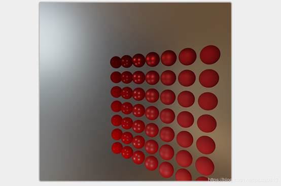

如果看起来有点类似，那么您已经成功地预过滤了HDR环境图。使用不同的mipmap级别，可以看到预滤镜图在增加mip级别时逐渐从锐化到模糊。 

**预滤器卷积伪影** 

虽然当前预过滤器映射在大多数情况下工作良好，您迟早会遇到几个与预过滤器卷积直接相关的渲染伪影。我将列出最常见的方法，包括如何修复它们。 

**高粗糙度的****Cubemap****接缝** 

用粗糙表面对预滤镜贴图进行采样意味着对预滤镜贴图的一些较低的mip水平进行采样。当采样cubemaps时候,OpenGL在默认情况下不会对立方体映射面进行线性插值。因为mip水平越低，分辨率越低，当预滤波映射与大得多的样本lobe卷积时候，方体-面之间（between-cube-face filtering） 缺乏过滤变得相当明显: 

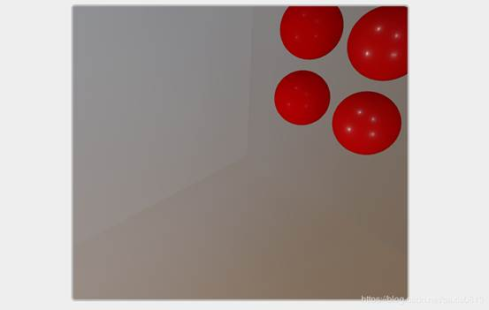

幸运的是，OpenGL通过启用GL_TEXTURE_CUBE_MAP_SEAMLESS，为我们提供了正确过滤cubemap面的选项: 

glEnable(GL_TEXTURE_CUBE_MAP_SEAMLESS);   
  

只要在应用程序开始的某个地方启用这个属性，接缝就会消失。 

**pre-filter****卷积中的光点** 

由于镜面反射中高频率的细节和广泛变化的光强度，对镜面反射进行卷积需要大量的样本导致HDR环境反射会产生很大的差异。我们虽然已经取了大量的样本，但在某些环境中，在一些较粗糙的mip级别上，这可能还不够，在这种情况下，您将开始看到在明亮区域周围出现点状图案: 

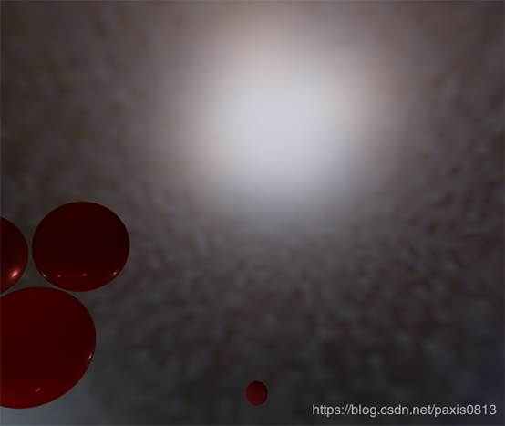

一种选择是进一步增加样本数量，但这在有的情况是不够的。如[Chetan Jags](https://chetanjags.wordpress.com/2015/08/26/image-based-lighting/)所述，我们可以通过(在预滤波卷积过程中)不直接采样环境图来减少这种伪影，而是根据积分的PDF和粗糙度采样特定mip级别的环境贴图: 

float D   = DistributionGGX(NdotH, roughness); 
 float pdf = (D * NdotH / (4.0 * HdotV)) + 0.0001;  
  

float resolution = 512.0; // resolution of source cubemap (per face) 
 float saTexel  = 4.0 * PI / (6.0 * resolution * resolution); 
 float saSample = 1.0 / (float(SAMPLE_COUNT) * pdf + 0.0001); 
  

float mipLevel = roughness == 0.0 ? 0.0 : 0.5 * log2(saSample / saTexel);  
  

不要忘记在环境贴图上启用三线性过滤，你可以从以下例子中获得它的mip级别: 

glBindTexture(GL_TEXTURE_CUBE_MAP, envCubemap); 
 glTexParameteri(GL_TEXTURE_CUBE_MAP, GL_TEXTURE_MIN_FILTER, GL_LINEAR_MIPMAP_LINEAR);  
  


设置完cubemap的基本纹理后，让OpenGL生成mipmaps： 

// convert HDR equirectangular environment map to cubemap equivalent 
 [...] 
 // then generate mipmaps 
 glBindTexture(GL_TEXTURE_CUBE_MAP, envCubemap); 
 glGenerateMipmap(GL_TEXTURE_CUBE_MAP); 
  


**Pre-computing the BRDF** 

随着预过滤环境的使用和运行，我们可以专注于split-sum approximation的第二部分:BRDF 

让我们再次简要回顾 specular split sum approximation: 

*Lo*(*p*,*ωo*)=∫Ω*Li*(*p*,*ωi*)*dωi*∗∫Ω*fr*(*p*,*ωi*,*ωo*)*n*⋅*ωidωi*Lo(p,ωo)=∫ΩLi(p,ωi)dωi∗∫Ωfr(p,ωi,ωo)n⋅ωidωi L_o(p,\omega_o) = \int\limits_{\Omega} L_i(p,\omega_i) d\omega_i * \int\limits_{\Omega} f_r(p, \omega_i, \omega_o) n \cdot \omega_i d\omega_i Lo(p,ωo)=Ω∫Li(p,ωi)dωi∗Ω∫fr(p,ωi,ωo)n⋅ωidωi 

我们已经在预滤镜贴图中预先计算了不同粗糙度级别的split sum approximation 的左边部分。要求我们卷积BRDF方程右边的角n⋅*ωo*ωo ω_o ωo,表面粗糙度和菲涅尔*F*0F0 F_0 F0.这类似于将镜面BRDF与纯白色环境贴图或者恒辐射度*Li*Li L_i Li丽1.0积分.将BRDF与3个变量进行卷积有点过头了，但是我们可以把*F*0F0 F_0 F0移出镜面BRDF方程: 

∫Ω*fr*(*p*,*ωi*,*ωo*)*n*⋅*ωidωi*=∫Ω*fr*(*p*,*ωi*,*ωo*)*F*(*ωo*,*h*)*F*(*ωo*,*h*)*n*⋅*ωidωi*∫Ωfr(p,ωi,ωo)n⋅ωidωi=∫Ωfr(p,ωi,ωo)F(ωo,h)F(ωo,h)n⋅ωidωi \int\limits_{\Omega} f_r(p, \omega_i, \omega_o) n \cdot \omega_i d\omega_i = \int\limits_{\Omega} f_r(p, \omega_i, \omega_o) \frac{F(\omega_o, h)}{F(\omega_o, h)} n \cdot \omega_i d\omega_i Ω∫fr(p,ωi,ωo)n⋅ωidωi=Ω∫fr(p,ωi,ωo)F(ωo,h)F(ωo,h)n⋅ωidωi 

F是菲涅耳方程。把菲涅耳分母移到BRDF上，得到如下等价方程 

∫Ω*fr*(*p*,*ωi*,*ωo*)*F*(*ωo*,*h*)*F*(*ωo*,*h*)*n*⋅*ωidωi*∫Ωfr(p,ωi,ωo)F(ωo,h)F(ωo,h)n⋅ωidωi \int\limits_{\Omega} \frac{f_r(p, \omega_i, \omega_o)}{F(\omega_o, h)} F(\omega_o, h) n \cdot \omega_i d\omega_i Ω∫F(ωo,h)fr(p,ωi,ωo)F(ωo,h)n⋅ωidωi 

用Fresnel-Schlick近似替换最右边的F得到: 

∫Ω*fr*(*p*,*ωi*,*ωo*)*F*(*ωo*,*h*)(*F*0+(1−*F*0)(1−*ωo*⋅*h*)5)*n*⋅*ωidωi*∫Ωfr(p,ωi,ωo)F(ωo,h)(F0+(1−F0)(1−ωo⋅h)5)n⋅ωidωi \int\limits_{\Omega} \frac{f_r(p, \omega_i, \omega_o)}{F(\omega_o, h)} (F_0 + (1 - F_0){(1 - \omega_o \cdot h)}^5) n \cdot \omega_i d\omega_i Ω∫F(ωo,h)fr(p,ωi,ωo)(F0+(1−F0)(1−ωo⋅h)5)n⋅ωidωi 

我们用α替换(1−ωo⋅h)5为*F*0F0 F_0 F0更容易计算: 

∫Ω*fr*(*p*,*ωi*,*ωo*)*F*(*ωo*,*h*)(*F*0+(1−*F*0)*α*)*n*⋅*ωidωi*∫Ωfr(p,ωi,ωo)F(ωo,h)(F0+(1−F0)α)n⋅ωidωi \int\limits_{\Omega} \frac{f_r(p, \omega_i, \omega_o)}{F(\omega_o, h)} (F_0 + (1 - F_0)\alpha) n \cdot \omega_i d\omega_i Ω∫F(ωo,h)fr(p,ωi,ωo)(F0+(1−F0)α)n⋅ωidωi 

∫Ω*fr*(*p*,*ωi*,*ωo*)*F*(*ωo*,*h*)(*F*0+1∗*α*−*F*0∗*α*)*n*⋅*ωidωi*∫Ωfr(p,ωi,ωo)F(ωo,h)(F0+1∗α−F0∗α)n⋅ωidωi \int\limits_{\Omega} \frac{f_r(p, \omega_i, \omega_o)}{F(\omega_o, h)} (F_0 + 1*\alpha - F_0*\alpha) n \cdot \omega_i d\omega_i Ω∫F(ωo,h)fr(p,ωi,ωo)(F0+1∗α−F0∗α)n⋅ωidωi 

∫Ω*fr*(*p*,*ωi*,*ωo*)*F*(*ωo*,*h*)(*F*0∗(1−*α*)+*α*)*n*⋅*ωidωi*∫Ωfr(p,ωi,ωo)F(ωo,h)(F0∗(1−α)+α)n⋅ωidωi \int\limits_{\Omega} \frac{f_r(p, \omega_i, \omega_o)}{F(\omega_o, h)} (F_0 * (1 - \alpha) + \alpha) n \cdot \omega_i d\omega_i Ω∫F(ωo,h)fr(p,ωi,ωo)(F0∗(1−α)+α)n⋅ωidωi 

然后我们把菲涅耳函数F除以两个积分: 

∫Ω*fr*(*p*,*ωi*,*ωo*)*F*(*ωo*,*h*)(*F*0∗(1−*α*))*n*⋅*ωidωi*+∫Ω*fr*(*p*,*ωi*,*ωo*)*F*(*ωo*,*h*)(*α*)*n*⋅*ωidωi*∫Ωfr(p,ωi,ωo)F(ωo,h)(F0∗(1−α))n⋅ωidωi+∫Ωfr(p,ωi,ωo)F(ωo,h)(α)n⋅ωidωi \int\limits_{\Omega} \frac{f_r(p, \omega_i, \omega_o)}{F(\omega_o, h)} (F_0 * (1 - \alpha)) n \cdot \omega_i d\omega_i+ \int\limits_{\Omega} \frac{f_r(p, \omega_i, \omega_o)}{F(\omega_o, h)} (\alpha) n \cdot \omega_i d\omega_i Ω∫F(ωo,h)fr(p,ωi,ωo)(F0∗(1−α))n⋅ωidωi+Ω∫F(ωo,h)fr(p,ωi,ωo)(α)n⋅ωidωi 

这样，*F*0F0 F_0 F0是常数除以积分我们可以把*F*0F0 F_0 F0从积分中提出来。接下来,我们代替α回原来形式给我们最终的split sum 双向反射方程: 

*F*0∫Ω*fr*(*p*,*ωi*,*ωo*)(1−(1−*ωo*⋅*h*)5)*n*⋅*ωidωi*+∫Ω*fr*(*p*,*ωi*,*ωo*)(1−*ωo*⋅*h*)5*n*⋅*ωidωi*F0∫Ωfr(p,ωi,ωo)(1−(1−ωo⋅h)5)n⋅ωidωi+∫Ωfr(p,ωi,ωo)(1−ωo⋅h)5n⋅ωidωi F_0 \int\limits_{\Omega} f_r(p, \omega_i, \omega_o)(1 - {(1 - \omega_o \cdot h)}^5) n \cdot \omega_i d\omega_i+ \int\limits_{\Omega} f_r(p, \omega_i, \omega_o) {(1 - \omega_o \cdot h)}^5 n \cdot \omega_i d\omega_i F0Ω∫fr(p,ωi,ωo)(1−(1−ωo⋅h)5)n⋅ωidωi+Ω∫fr(p,ωi,ωo)(1−ωo⋅h)5n⋅ωidωi 

得到的两个积分分别代表了*F*0F0 F_0 F0的大小和偏差值。注意,*f*(*p*,*ωi*,*ωo*)f(p,ωi,ωo) f(p, \omega_i, \omega_o) f(p,ωi,ωo)已经包含F的一项随着f移除F他们都被消掉了。 

与早期复杂的环境贴图映射类似，我们可以对BRDF方程的输入进行卷积：n和*ωo*ωo ω_o ωo之间角度，粗糙度,并将卷积的结果都存储在一个纹理中。我们将卷积结果存储在二维查找纹理(LUT)中，称为BRDF集成图，稍后我们将在PBR光照着色器中使用该图来获得最终的卷积间接高光结果。 

BRDF卷积着色器在二维平面上工作，接使用二维纹理坐标作为BRDF卷积(NdotV和粗糙度)的输入。卷积代码与预滤波卷积有很大的相似之处，只是它现在根据BRDF的几何函数和Fresnel-Schlick的近似来处理采样向量: 

vec2 IntegrateBRDF(float NdotV, float roughness) 
 { 
     vec3 V; 
     V.x = sqrt(1.0 - NdotV*NdotV); 
     V.y = 0.0; 
     V.z = NdotV; 
  

float A = 0.0; 
     float B = 0.0; 
  

vec3 N = vec3(0.0, 0.0, 1.0); 
  

const uint SAMPLE_COUNT = 1024u; 
     for(uint i = 0u; i < SAMPLE_COUNT; ++i) 
     { 
         vec2 Xi = Hammersley(i, SAMPLE_COUNT); 
         vec3 H  = ImportanceSampleGGX(Xi, N, roughness); 
         vec3 L  = normalize(2.0 * dot(V, H) * H - V); 
  

float NdotL = max(L.z, 0.0); 
         float NdotH = max(H.z, 0.0); 
         float VdotH = max(dot(V, H), 0.0); 
  

if(NdotL > 0.0) 
         { 
             float G = GeometrySmith(N, V, L, roughness); 
             float G_Vis = (G * VdotH) / (NdotH * NdotV); 
             float Fc = pow(1.0 - VdotH, 5.0); 
  

A += (1.0 - Fc) * G_Vis; 
             B += Fc * G_Vis; 
         } 
     } 
     A /= float(SAMPLE_COUNT); 
     B /= float(SAMPLE_COUNT); 
     return vec2(A, B); 
 } 
 // ---------------------------------------------------------------------------- 
 void main()  
 { 
     vec2 integratedBRDF = IntegrateBRDF(TexCoords.x, TexCoords.y); 
     FragColor = integratedBRDF; 
 } 

正如你所看到的BRDF卷积是从数学到代码的直接转换。我们取角θ和粗糙度作为输入,生成一个与重要性抽样样本向量，在BRDF的几何和推导出的菲涅耳项上处理它，并为每个样本输出一个大小和一个偏差到*F*0F0 F_0 F0，最后平均它们。 

您可能已经从[理论](https://learnopengl.com/PBR/Theory)教程中回忆过，BRDF的几何术语在与IBL一起使用时略有不同，因为它的k变量有略微不同的逻辑: 

*kdirect*=(*α*+1)28kdirect=(α+1)28 k_{direct} = \frac{(\alpha + 1)^2}{8} kdirect=8(α+1)2 

*kIBL*=*α*22kIBL=α22 k_{IBL} = \frac{\alpha^2}{2} kIBL=2α2 

由于BRDF卷积是高光IBL积分的一部分，我们将使用*kIBL*kIBL k_{IBL} kIBL来处理Schlick-GGX几何函数: 

float GeometrySchlickGGX(float NdotV, float roughness) 
 { 
     float a = roughness; 
     float k = (a * a) / 2.0; 
  

float nom   = NdotV; 
     float denom = NdotV * (1.0 - k) + k; 
  

return nom / denom; 
 } 
 // ---------------------------------------------------------------------------- 
 float GeometrySmith(vec3 N, vec3 V, vec3 L, float roughness) 
 { 
     float NdotV = max(dot(N, V), 0.0); 
     float NdotL = max(dot(N, L), 0.0); 
     float ggx2 = GeometrySchlickGGX(NdotV, roughness); 
     float ggx1 = GeometrySchlickGGX(NdotL, roughness); 
  

return ggx1 * ggx2; 
 }   

注意，当k为参数时，我们不像对a的其他逻辑那样对粗糙度进行平方；很可能a已经平方了。我不确定这是Epic Games的部分还是迪士尼的原始论文的不一致之处，但是直接将粗糙度转换为a会得到与Epic Games版本相同的BRDF积分图。 

最后，为了存储BRDF卷积结果，我们将生成一个512×512分辨率的二维纹理。 

unsigned int brdfLUTTexture; 
 glGenTextures(1, &brdfLUTTexture); 
  

// pre-allocate enough memory for the LUT texture. 
 glBindTexture(GL_TEXTURE_2D, brdfLUTTexture); 
 glTexImage2D(GL_TEXTURE_2D, 0, GL_RG16F, 512, 512, 0, GL_RG, GL_FLOAT, 0); 
 glTexParameteri(GL_TEXTURE_2D, GL_TEXTURE_WRAP_S, GL_CLAMP_TO_EDGE); 
 glTexParameteri(GL_TEXTURE_2D, GL_TEXTURE_WRAP_T, GL_CLAMP_TO_EDGE); 
 glTexParameteri(GL_TEXTURE_2D, GL_TEXTURE_MIN_FILTER, GL_LINEAR); 
 glTexParameteri(GL_TEXTURE_2D, GL_TEXTURE_MAG_FILTER, GL_LINEAR);  
  


注意，我们使用Epic Games推荐的16位精度浮点格式。确保将包装模式设置为GL_CLAMP_TO_EDGE，以防止边缘采样锯齿。 

然后，我们用相同的framebuffer对象，并在一个NDC屏幕空间上运行这个着色器： 

glBindFramebuffer(GL_FRAMEBUFFER, captureFBO); 
 glBindRenderbuffer(GL_RENDERBUFFER, captureRBO); 
 glRenderbufferStorage(GL_RENDERBUFFER, GL_DEPTH_COMPONENT24, 512, 512); 
 glFramebufferTexture2D(GL_FRAMEBUFFER, GL_COLOR_ATTACHMENT0, GL_TEXTURE_2D, brdfLUTTexture, 0); 
  

glViewport(0, 0, 512, 512); 
 brdfShader.use(); 
 glClear(GL_COLOR_BUFFER_BIT | GL_DEPTH_BUFFER_BIT); 
 RenderQuad(); 
  

glBindFramebuffer(GL_FRAMEBUFFER, 0);   
  


split sum积分的卷积BRDF部分应该会给出如下结果： 

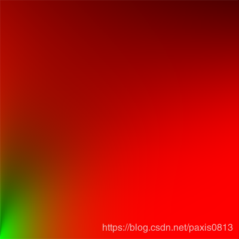

利用预先过滤的环境映射和BRDF二维LUT，我们可以根据split sum approximation重新构造间接镜面积分。结合后的结果作为间接或环境反射光。 

**完整的****IBL****反射** 

为了得到反射方程的间接镜面部分，我们需要把split sum approximation 的两个部分缝合在一起。让我们从添加预先计算的照明数据添加到我们的PBR着色器的顶部: 

uniform samplerCube prefilterMap; 
 uniform sampler2D   brdfLUT;   
  

·         1 

·         2 

首先，利用反射矢量对预滤后的环境映射进行采样，得到曲面的间接镜面反射。注意，我们根据表面粗糙度采样适当的mip级别，使粗糙的表面有更模糊的镜面反射。 

void main() 
 { 
     [...] 
     vec3 R = reflect(-V, N);    
  

const float MAX_REFLECTION_LOD = 4.0; 
     vec3 prefilteredColor = textureLod(prefilterMap, R,  roughness * MAX_REFLECTION_LOD).rgb;     
     [...] 
 } 
  


在预筛选步骤中，我们只对环境映射进行卷积，最大可达5 mip级别(0到4)，们在这里MAX_REFLECTION_LOD表示，以确保我们不会在没有(相关)数据的情况下采样mip级别。然后我们从BRDF查找纹理中取样，给定材质的粗糙度和法线与视图向量之间的角度： 

vec3 F        = FresnelSchlickRoughness(max(dot(N, V), 0.0), F0, roughness); 
 vec2 envBRDF  = texture(brdfLUT, vec2(max(dot(N, V), 0.0), roughness)).rg; 
 vec3 specular = prefilteredColor * (F * envBRDF.x + envBRDF.y); 

给定*Fo*Fo F_o Fo的大小和偏差(这里我们直接使用间接菲涅尔结果F)从BRDF查找纹理，我们将其与IBL反射方程的左预滤镜部分结合，并重新构造积分得到相似的高光效果。 

这给出了反射方程的间接镜面部分。现在，将它与上一教程中反射方程的漫反射部分结合起来，我们就得到了完整的PBR IBL结果： 

vec3 F = FresnelSchlickRoughness(max(dot(N, V), 0.0), F0, roughness); 
  

vec3 kS = F; 
 vec3 kD = 1.0 - kS; 
 kD *= 1.0 - metallic;    
    
 vec3 irradiance = texture(irradianceMap, N).rgb; 
 vec3 diffuse    = irradiance * albedo; 
    
 const float MAX_REFLECTION_LOD = 4.0; 
 vec3 prefilteredColor = textureLod(prefilterMap, R,  roughness * MAX_REFLECTION_LOD).rgb;    
 vec2 envBRDF  = texture(brdfLUT, vec2(max(dot(N, V), 0.0), roughness)).rg; 
 vec3 specular = prefilteredColor * (F * envBRDF.x + envBRDF.y); 
    
 vec3 ambient = (kD * diffuse + specular) * ao;  
  

注意，我们没有用kS乘以高光因为这里已经有了菲涅耳乘法。在一系列的球上运行这个代码，通过不同的粗糙度和金属属性，我们可以最后通过PBR渲染程序看到他们的真实颜色： 

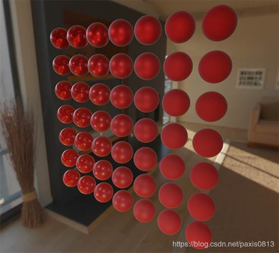

我们还可以更疯狂一点，使用一些很酷的纹理[PBR材质](https://freepbr.com/)： 


或者加载一些 令人生畏的[Andrew Maximov](http://artisaverb.info/PBT.html)的免费PBR 3D模型 ： 

 

我相信我们都同意我们的照明现在看起来更有说服力。更棒的是，无论我们使用哪种环境图，我们的照明看起来都是正确的。下面您将看到几个不同的预先计算的HDR图，它们完全改变了照明的动态，但是在不改变任何一个照明变量的情况下仍然看起来是正确的！  

 

嗯，这个PBR的冒险原来是一个相当长的旅程。有很多步骤，因此很多可能出错，所以研究[球体场景](https://learnopengl.com/code_viewer_gh.php?code=src/6.pbr/2.2.1.ibl_specular/ibl_specular.cpp)或[纹理场景](https://learnopengl.com/code_viewer_gh.php?code=src/6.pbr/2.2.2.ibl_specular_textured/ibl_specular_textured.cpp)的代码(包括所有的着色器)，如果你卡住了，检查和或者在评论中询问。 

**接下来还有什么** 

希望在本教程结束时，您应该对PBR有一个非常清楚的了解，甚至应该有一个实际的PBR渲染器。在这些教程中，在我们的应用程序开始时，在渲染循环之前，我们已经预先计算了所有相关的基于PBR图像的光照数据。这对于研究学习很好，但是对于PBR的实际应用来说就不太好了。首先，预计算只需要执行一次，而不是每次启动时都执行一次。其次，当你使用多个环境映射时，你需要在每次启动时预先计算它们中的每一个。 

出于这个原因，您通常只需要将环境映射预计算为辐照度并预筛选映射一次，然后将其存储在磁盘上(请注意，BRDF集成映射不依赖于环境映射，因此您只需计算或加载它一次)。这意味着您需要使用定制的图像格式来存储HDR cubemaps，包括其mip等级。或者，您可以将其存储(并加载)为可用格式之一(如支持存储mip级别的.dds)。 

此外，我们在这些教程中描述了整个过程，包括生成预先计算的IBL映像，以帮助进一步理解PBR管线。但是，您也可以使用一些很棒的工具，如[cmftStudio](https://github.com/dariomanesku/cmftStudio)或[IBLBaker](https://github.com/derkreature/IBLBaker)来为您生成这些预先计算的贴图。 

我们跳过的一点是使用反射探针预先计算cubemap: cubemap插值和视差校正是在场景中放置几个反射探针的过程，这些反射探针获取场景在该特定位置的cubemap快照，然后我们可以将其作为场景的IBL数据进行卷积处理。通过基于相机附近的几个探头之间的插值，我们可以实现基于图像的局部高细节照明，这仅仅是受我们愿意放置的反射探头数量的限制。这样，当从一个场景的一个明亮的室外部分移动到一个黑暗的室内部分时，基于图像的照明可以正确地更新。在将来的某个地方，我将编写一个关于反射探测的教程，但是现在我推荐下面Chetan Jags的文章，让您先对它有一个初步的了解。 

**Further reading** 

·         Real Shading in Unreal Engine 4: explains Epic Games’ split sum 
 approximation. This is the article the IBL PBR code is based of. 

·         Physically Based Shading and Image Based Lighting: great blog post by 
 Trent Reed about integrating specular IBL into a PBR pipeline in real 
 time. 

·         Image Based Lighting: very extensive write-up by Chetan Jags about 
 specular-based image-based lighting and several of its caveats, 
 including light probe interpolation. 

·         Moving Frostbite to PBR: well written and in-depth overview of 
 integrating PBR into a AAA game engine by Sébastien Lagarde and 
 Charles de Rousiers. 

·         Physically Based Rendering – Part Three: high level overview of IBL 
 lighting and PBR by the JMonkeyEngine team. 

·         Implementation Notes: Runtime Environment Map Filtering for Image 
 Based Lighting: extensive write-up by Padraic Hennessy about 
 pre-filtering HDR environment maps and significanly optimizing the 
 sample process. 

 

来自 <<https://blog.csdn.net/paxis0813/article/details/85233978>>  

 

 