# （转）Specular IBL---OpenGL 

小道实现会放在单独开在Opengl的案例渲染中 

 

 

**Specular IBL** 

In the [previous](https://learnopengl.com/#!PBR/IBL/Diffuse-irradiance) tutorial we've set up PBR in combination with image based lighting by pre-computing an irradiance map as the lighting's indirect diffuse portion. In this tutorial we'll focus on the specular part of the reflectance equation:  

*Lo*(*p*,*ωo*)=∫Ω(*kdcπ*+*ksDFG*4(*ωo*⋅*n*)(*ωi*⋅*n*))*Li*(*p*,*ωi*)*n*⋅*ωidωi*Lo(p,ωo)=∫Ω(kdcπ+ksDFG4(ωo⋅n)(ωi⋅n))Li(p,ωi)n⋅ωidωi 

You'll notice that the Cook-Torrance specular portion (multiplied by *kS*kS ) isn't constant over the integral and is dependent on the incoming light direction, but **also** the incoming view direction. Trying to solve the integral for all incoming light directions including all possible view directions is a combinatorial overload and way too expensive to calculate on a real-time basis. Epic Games proposed a solution where they were able to pre-convolute the specular part for real time purposes, given a few compromises, known as the split sum approximation.  

The split sum approximation splits the specular part of the reflectance equation into two separate parts that we can individually convolute and later combine in the PBR shader for specular indirect image based lighting. Similar to how we pre-convoluted the irradiance map, the split sum approximation requires an HDR environment map as its convolution input. To understand the split sum approximation we'll again look at the reflectance equation, but this time only focus on the specular part (we've extracted the diffuse part in the [previous](https://learnopengl.com/#!PBR/IBL/Diffuse-irradiance) tutorial):  

*Lo*(*p*,*ωo*)=∫Ω(*ksDFG*4(*ωo*⋅*n*)(*ωi*⋅*n*)*Li*(*p*,*ωi*)*n*⋅*ωidωi*=∫Ω*fr*(*p*,*ωi*,*ωo*)*Li*(*p*,*ωi*)*n*⋅*ωidωi*Lo(p,ωo)=∫Ω(ksDFG4(ωo⋅n)(ωi⋅n)Li(p,ωi)n⋅ωidωi=∫Ωfr(p,ωi,ωo)Li(p,ωi)n⋅ωidωi 

For the same (performance) reasons as the irradiance convolution, we can't solve the specular part of the integral in real time and expect a reasonable performance. So preferably we'd pre-compute this integral to get something like a specular IBL map, sample this map with the fragment's normal and be done with it. However, this is where it gets a bit tricky. We were able to pre-compute the irradiance map as the integral only depended on *ωi*ωi and we could move the constant diffuse albedo terms out of the integral. This time, the integral depends on more than just *ωi*ωi as evident from the BRDF:  

*fr*(*p*,*wi*,*wo*)=*DFG*4(*ωo*⋅*n*)(*ωi*⋅*n*)fr(p,wi,wo)=DFG4(ωo⋅n)(ωi⋅n) 

This time the integral also depends on *wo*wo and we can't really sample a pre-computed cubemap with two direction vectors. The position *p*p is irrelevant here as described in the previous tutorial. Pre-computing this integral for every possible combination of *ωi*ωi and *ωo*ωo isn't practical in a real-time setting.  

Epic Games' split sum approximation solves the issue by splitting the pre-computation into 2 individual parts that we can later combine to get the resulting pre-computed result we're after. The split sum approximation splits the specular integral into two separate integrals:  

*Lo*(*p*,*ωo*)=∫Ω*Li*(*p*,*ωi*)*dωi*∗∫Ω*fr*(*p*,*ωi*,*ωo*)*n*⋅*ωidωi*Lo(p,ωo)=∫ΩLi(p,ωi)dωi∗∫Ωfr(p,ωi,ωo)n⋅ωidωi 

The first part (when convoluted) is known as the pre-filtered environment map which is (similar to the irradiance map) a pre-computed environment convolution map, but this time taking roughness into account. For increasing roughness levels, the environment map is convoluted with more scattered sample vectors, creating more blurry reflections. For each roughness level we convolute, we store the sequentially blurrier results in the pre-filtered map's mipmap levels. For instance, a pre-filtered environment map storing the pre-convoluted result of 5 different roughness values in its 5 mipmap levels looks as follows:  

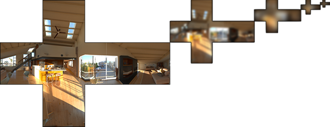

We generate the sample vectors and their scattering strength using the normal distribution function (NDF) of the Cook-Torrance BRDF that takes as input both a normal and view direction. As we don't know beforehand the view direction when convoluting the environment map, Epic Games makes a further approximation by assuming the view direction (and thus the specular reflection direction) is always equal to the output sample direction *ωo*ωo . This translates itself to the following code:  

 
 vec3 N = normalize(w_o); 
 vec3 R = N; 
 vec3 V = R; 
  

This way the pre-filtered environment convolution doesn't need to be aware of the view direction. This does mean we don't get nice grazing specular reflections when looking at specular surface reflections from an angle as seen in the image below (courtesy of the *Moving Frostbite to PBR* article); this is however generally considered a decent compromise:  

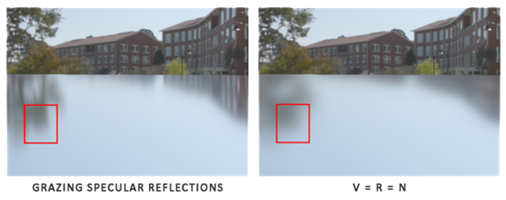

The second part of the equation equals the BRDF part of the specular integral. If we pretend the incoming radiance is completely white for every direction (thus *L*(*p*,*x*)=1.0L(p,x)=1.0 ) we can pre-calculate the BRDF's response given an input roughness and an input angle between the normal *n*n and light direction *ωi*ωi , or *n*⋅*ωi*n⋅ωi . Epic Games stores the pre-computed BRDF's response to each normal and light direction combination on varying roughness values in a 2D lookup texture (LUT) known as the BRDF integration map. The 2D lookup texture outputs a scale (red) and a bias value (green) to the surface's Fresnel response giving us the second part of the split specular integral:  

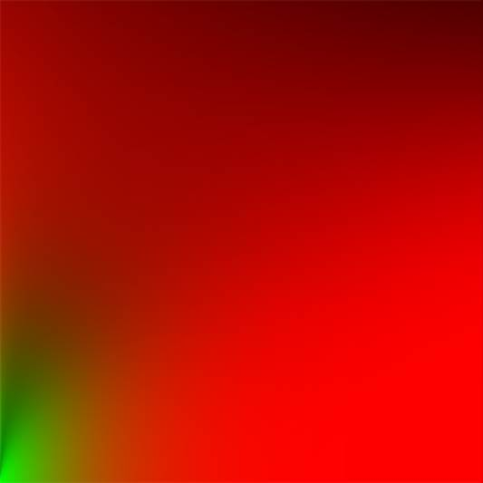

We generate the lookup texture by treating the horizontal texture coordinate (ranged between 0.0 and 1.0) of a plane as the BRDF's input *n*⋅*ωi*n⋅ωi and its vertical texture coordinate as the input roughness value. With this BRDF integration map and the pre-filtered environment map we can combine both to get the result of the specular integral:  

 
 **float** lod             = getMipLevelFromRoughness(roughness); 
 vec3 prefilteredColor = textureCubeLod(PrefilteredEnvMap, refVec, lod); 
 vec2 envBRDF          = texture2D(BRDFIntegrationMap, vec2(NdotV, roughness)).xy; 
 vec3 indirectSpecular = prefilteredColor * (F * envBRDF.x + envBRDF.y)  
  

This should give you a bit of an overview on how Epic Games' split sum approximation roughly approaches the indirect specular part of the reflectance equation. Let's now try and build the pre-convoluted parts ourselves.  

**Pre-filtering an HDR environment map** 

Pre-filtering an environment map is quite similar to how we convoluted an irradiance map. The difference being that we now account for roughness and store sequentially rougher reflections in the pre-filtered map's mip levels.  

First, we need to generate a new cubemap to hold the pre-filtered environment map data. To make sure we allocate enough memory for its mip levels we call glGenerateMipmap as an easy way to allocate the required amount of memory.  

 
 **unsigned** **int** prefilterMap; 
 glGenTextures(1, &prefilterMap); 
 glBindTexture(GL_TEXTURE_CUBE_MAP, prefilterMap); 
 **for** (**unsigned** **int** i = 0; i < 6; ++i) 
 { 
     glTexImage2D(GL_TEXTURE_CUBE_MAP_POSITIVE_X + i, 0, GL_RGB16F, 128, 128, 0, GL_RGB, GL_FLOAT, **nullptr**); 
 } 
 glTexParameteri(GL_TEXTURE_CUBE_MAP, GL_TEXTURE_WRAP_S, GL_CLAMP_TO_EDGE); 
 glTexParameteri(GL_TEXTURE_CUBE_MAP, GL_TEXTURE_WRAP_T, GL_CLAMP_TO_EDGE); 
 glTexParameteri(GL_TEXTURE_CUBE_MAP, GL_TEXTURE_WRAP_R, GL_CLAMP_TO_EDGE); 
 glTexParameteri(GL_TEXTURE_CUBE_MAP, GL_TEXTURE_MIN_FILTER, GL_LINEAR_MIPMAP_LINEAR);  
 glTexParameteri(GL_TEXTURE_CUBE_MAP, GL_TEXTURE_MAG_FILTER, GL_LINEAR); 
  

glGenerateMipmap(GL_TEXTURE_CUBE_MAP); 
  

Note that because we plan to sample the prefilterMap its mipmaps you'll need to make sure its minification filter is set to GL_LINEAR_MIPMAP_LINEAR to enable trilinear filtering. We store the pre-filtered specular reflections in a per-face resolution of 128 by 128 at its base mip level. This is likely to be enough for most reflections, but if you have a large number of smooth materials (think of car reflections) you may want to increase the resolution.  

In the previous tutorial we convoluted the environment map by generating sample vectors uniformly spread over the hemisphere ΩΩ using spherical coordinates. While this works just fine for irradiance, for specular reflections it's less efficient. When it comes to specular reflections, based on the roughness of a surface, the light reflects closely or roughly around a reflection vector *r*r over a normal *n*n , but (unless the surface is extremely rough) around the reflection vector nonetheless:  

The general shape of possible outgoing light reflections is known as the specular lobe. As roughness increases, the specular lobe's size increases; and the shape of the specular lobe changes on varying incoming light directions. The shape of the specular lobe is thus highly dependent on the material.  

When it comes to the microsurface model, we can imagine the specular lobe as the reflection orientation about the microfacet halfway vectors given some incoming light direction. Seeing as most light rays end up in a specular lobe reflected around the microfacet halfway vectors it makes sense to generate the sample vectors in a similar fashion as most would otherwise be wasted. This process is known as importance sampling.  

**Monte Carlo integration and importance sampling** 

To fully get a grasp of importance sampling it's relevant we first delve into the mathematical construct known as Monte Carlo integration. Monte Carlo integration revolves mostly around a combination of statistics and probability theory. Monte Carlo helps us in discretely solving the problem of figuring out some statistic or value of a population without having to take **all** of the population into consideration.  

For instance, let's say you want to count the average height of all citizens of a country. To get your result, you could measure **every** citizen and average their height which will give you the **exact** answer you're looking for. However, since most countries have a considerable population this isn't a realistic approach: it would take too much effort and time.  

A different approach is to pick a much smaller **completely random** (unbiased) subset of this population, measure their height and average the result. This population could be as small as a 100 people. While not as accurate as the exact answer, you'll get an answer that is relatively close to the ground truth. This is known as the law of large numbers. The idea is that if you measure a smaller set of size *N*N of truly random samples from the total population, the result will be relatively close to the true answer and gets closer as the number of samples *N*N increases.  

Monte Carlo integration builds on this law of large numbers and takes the same approach in solving an integral. Rather than solving an integral for all possible (theoretically infinite) sample values *x*x , simply generate *N*N sample values randomly picked from the total population and average. As *N*N increases we're guaranteed to get a result closer to the exact answer of the integral:  

*O*=∫*abf*(*x*)*dx*=1*N*∑*i*=0*N*−1*f*(*x*)*pdf*(*x*)O=∫abf(x)dx=1N∑i=0N−1f(x)pdf(x) 

To solve the integral, we take *N*N random samples over the population *a*a to *b*b , add them together and divide by the total number of samples to average them. The *pdf*pdf stands for the probability density function that tells us the probability a specific sample occurs over the total sample set. For instance, the pdf of the height of a population would look a bit like this:  

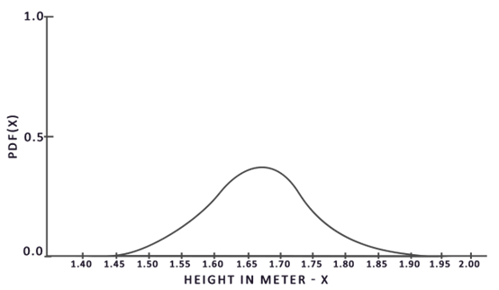

From this graph we can see that if we take any random sample of the population, there is a higher chance of picking a sample of someone of height 1.70, compared to the lower probability of the sample being of height 1.50.  

When it comes to Monte Carlo integration, some samples might have a higher probability of being generated than others. This is why for any general Monte Carlo estimation we divide or multiply the sampled value by the sample probability according to a pdf. So far, in each of our cases of estimating an integral, the samples we've generated were uniform, having the exact same chance of being generated. Our estimations so far were unbiased, meaning that given an ever-increasing amount of samples we will eventually converge to the **exact** solution of the integral.  

However, some Monte Carlo estimators are biased, meaning that the generated samples aren't completely random, but focused towards a specific value or direction. These biased Monte Carlo estimators have a faster rate of convergence meaning they can converge to the exact solution at a much faster rate, but due to their biased nature it's likely they won't ever converge to the exact solution. This is generally an acceptable tradeoff, especially in computer graphics, as the exact solution isn't too important as long as the results are visually acceptable. As we'll soon see with importance sampling (which uses a biased estimator) the generated samples are biased towards specific directions in which case we account for this by multiplying or dividing each sample by its corresponding pdf.  

Monte Carlo integration is quite prevalent in computer graphics as it's a fairly intuitive way to approximate continuous integrals in a discrete and efficient fashion: take any area/volume to sample over (like the hemisphere ΩΩ ), generate *N*N amount of random samples within the area/volume and sum and weigh every sample contribution to the final result.  

Monte Carlo integration is an extensive mathematical topic and I won't delve much further into the specifics, but we'll mention that there are also multiple ways of generating the *random samples*. By default, each sample is completely (pseudo)random as we're used to, but by utilizing certain properties of semi-random sequences we can generate sample vectors that are still random, but have interesting properties. For instance, we can do Monte Carlo integration on something called low-discrepancy sequences which still generate random samples, but each sample is more evenly distributed:  

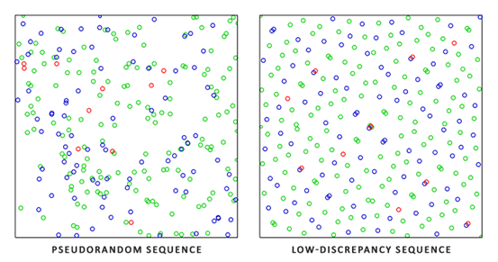

When using a low-discrepancy sequence for generating the Monte Carlo sample vectors, the process is known as Quasi-Monte Carlo integration. Quasi-Monte Carlo methods have a faster rate of convergence which makes them interesting for performance heavy applications.  

Given our newly obtained knowledge of Monte Carlo and Quasi-Monte Carlo integration, there is an interesting property we can use for an even faster rate of convergence known as importance sampling. We've mentioned it before in this tutorial, but when it comes to specular reflections of light, the reflected light vectors are constrained in a specular lobe with its size determined by the roughness of the surface. Seeing as any (quasi-)randomly generated sample outside the specular lobe isn't relevant to the specular integral it makes sense to focus the sample generation to within the specular lobe, at the cost of making the Monte Carlo estimator biased.  

This is in essence what importance sampling is about: generate sample vectors in some region constrained by the roughness oriented around the microfacet's halfway vector. By combining Quasi-Monte Carlo sampling with a low-discrepancy sequence and biasing the sample vectors using importance sampling we get a high rate of convergence. Because we reach the solution at a faster rate, we'll need less samples to reach an approximation that is sufficient enough. Because of this, the combination even allows graphics applications to solve the specular integral in real-time, albeit it still significantly slower than pre-computing the results.  

**A low-discrepancy sequence** 

In this tutorial we'll pre-compute the specular portion of the indirect reflectance equation using importance sampling given a random low-discrepancy sequence based on the Quasi-Monte Carlo method. The sequence we'll be using is known as the Hammersley Sequence as carefully described by [Holger Dammertz](http://holger.dammertz.org/stuff/notes_HammersleyOnHemisphere.html). The Hammersley sequence is based on the Van Der Corpus sequence which mirrors a decimal binary representation around its decimal point.  

Given some neat bit tricks we can quite efficiently generate the Van Der Corpus sequence in a shader program which we'll use to get a Hammersley sequence sample i over N total samples:  

 
 **float** RadicalInverse_VdC(uint bits)  
 { 
     bits = (bits << 16u) | (bits >> 16u); 
     bits = ((bits & 0x55555555u) << 1u) | ((bits & 0xAAAAAAAAu) >> 1u); 
     bits = ((bits & 0x33333333u) << 2u) | ((bits & 0xCCCCCCCCu) >> 2u); 
     bits = ((bits & 0x0F0F0F0Fu) << 4u) | ((bits & 0xF0F0F0F0u) >> 4u); 
     bits = ((bits & 0x00FF00FFu) << 8u) | ((bits & 0xFF00FF00u) >> 8u); 
     **return** **float**(bits) * 2.3283064365386963e-10; // / 0x100000000 
 } 
 // ---------------------------------------------------------------------------- 
 vec2 Hammersley(uint i, uint N) 
 { 
     **return** vec2(**float**(i)/**float**(N), RadicalInverse_VdC(i)); 
 }   
  

The GLSL Hammersley function gives us the low-discrepancy sample i of the total sample set of size N.  

**Hammersley sequence without bit operator support** 

Not all OpenGL related drivers support bit operators (WebGL and OpenGL ES 2.0 for instance) in which case you might want to use an alternative version of the Van Der Corpus Sequence that doesn't rely on bit operators:  

 
 **float** VanDerCorpus(uint n, uint base) 
 { 
     **float** invBase = 1.0 / **float**(base); 
     **float** denom   = 1.0; 
     **float** result  = 0.0; 
  

**for**(uint i = 0u; i < 32u; ++i) 
     { 
         **if**(n > 0u) 
         { 
             denom   = mod(**float**(n), 2.0); 
             result += denom * invBase; 
             invBase = invBase / 2.0; 
             n       = uint(**float**(n) / 2.0); 
         } 
     } 
  

**return** result; 
 } 
 // ---------------------------------------------------------------------------- 
 vec2 HammersleyNoBitOps(uint i, uint N) 
 { 
     **return** vec2(**float**(i)/**float**(N), VanDerCorpus(i, 2u)); 
 } 
  

Note that due to GLSL loop restrictions in older hardware the sequence loops over all possible 32 bits. This version is less performant, but does work on all hardware if you ever find yourself without bit operators.  

**GGX Importance sampling** 

Instead of uniformly or randomly (Monte Carlo) generating sample vectors over the integral's hemisphere ΩΩ we'll generate sample vectors biased towards the general reflection orientation of the microsurface halfway vector based on the surface's roughness. The sampling process will be similar to what we've seen before: begin a large loop, generate a random (low-discrepancy) sequence value, take the sequence value to generate a sample vector in tangent space, transform to world space and sample the scene's radiance. What's different is that we now use a low-discrepancy sequence value as input to generate a sample vector:  

 
 **const** uint SAMPLE_COUNT = 4096u; 
 **for**(uint i = 0u; i < SAMPLE_COUNT; ++i) 
 { 
     vec2 Xi = Hammersley(i, SAMPLE_COUNT);    
  

Additionally, to build a sample vector, we need some way of orienting and biasing the sample vector towards the specular lobe of some surface roughness. We can take the NDF as described in the [Theory](https://learnopengl.com/#!PBR/Theory) tutorial and combine the GGX NDF in the spherical sample vector process as described by Epic Games:  

 
 vec3 ImportanceSampleGGX(vec2 Xi, vec3 N, **float** roughness) 
 { 
     **float** a = roughness*roughness; 
  
     **float** phi = 2.0 * PI * Xi.x; 
     **float** cosTheta = sqrt((1.0 - Xi.y) / (1.0 + (a*a - 1.0) * Xi.y)); 
     **float** sinTheta = sqrt(1.0 - cosTheta*cosTheta); 
  
     // from spherical coordinates to cartesian coordinates 
     vec3 H; 
     H.x = cos(phi) * sinTheta; 
     H.y = sin(phi) * sinTheta; 
     H.z = cosTheta; 
  
     // from tangent-space vector to world-space sample vector 
     vec3 up        = abs(N.z) < 0.999 ? vec3(0.0, 0.0, 1.0) : vec3(1.0, 0.0, 0.0); 
     vec3 tangent   = normalize(cross(up, N)); 
     vec3 bitangent = cross(N, tangent); 
  
     vec3 sampleVec = tangent * H.x + bitangent * H.y + N * H.z; 
     **return** normalize(sampleVec); 
 }   
  

This gives us a sample vector somewhat oriented around the expected microsurface's halfway vector based on some input roughness and the low-discrepancy sequence value Xi. Note that Epic Games uses the squared roughness for better visual results as based on Disney's original PBR research.  

With the low-discrepancy Hammersley sequence and sample generation defined we can finalize the pre-filter convolution shader:  

 
 \#version 330 core 
 **out** vec4 FragColor; 
 **in** vec3 localPos; 
  

**uniform** samplerCube environmentMap; 
 **uniform** **float** roughness; 
  

**const** **float** PI = 3.14159265359; 
  

**float** RadicalInverse_VdC(uint bits); 
 vec2 Hammersley(uint i, uint N); 
 vec3 ImportanceSampleGGX(vec2 Xi, vec3 N, **float** roughness); 
    
 **void** main() 
 {  
     vec3 N = normalize(localPos);     
     vec3 R = N; 
     vec3 V = R; 
  

**const** uint SAMPLE_COUNT = 1024u; 
     **float** totalWeight = 0.0;    
     vec3 prefilteredColor = vec3(0.0);      
     **for**(uint i = 0u; i < SAMPLE_COUNT; ++i) 
     { 
         vec2 Xi = Hammersley(i, SAMPLE_COUNT); 
         vec3 H  = ImportanceSampleGGX(Xi, N, roughness); 
         vec3 L  = normalize(2.0 * dot(V, H) * H - V); 
  

**float** NdotL = max(dot(N, L), 0.0); 
         **if**(NdotL > 0.0) 
         { 
             prefilteredColor += texture(environmentMap, L).rgb * NdotL; 
             totalWeight      += NdotL; 
         } 
     } 
     prefilteredColor = prefilteredColor / totalWeight; 
  

FragColor = vec4(prefilteredColor, 1.0); 
 }   
    
  

We pre-filter the environment, based on some input roughness that varies over each mipmap level of the pre-filter cubemap (from 0.0 to 1.0) and store the result in prefilteredColor. The resulting prefilteredColor is divided by the total sample weight, where samples with less influence on the final result (for small NdotL) contribute less to the final weight.  

**Capturing pre-filter mipmap levels** 

What's left to do is let OpenGL pre-filter the environment map with different roughness values over multiple mipmap levels. This is actually fairly easy to do with the original setup of the [irradiance](https://learnopengl.com/#!PBR/IBL/Diffuse-irradiance) tutorial:  

 
 prefilterShader.use(); 
 prefilterShader.setInt("environmentMap", 0); 
 prefilterShader.setMat4("projection", captureProjection); 
 glActiveTexture(GL_TEXTURE0); 
 glBindTexture(GL_TEXTURE_CUBE_MAP, envCubemap); 
  

glBindFramebuffer(GL_FRAMEBUFFER, captureFBO); 
 **unsigned** **int** maxMipLevels = 5; 
 **for** (**unsigned** **int** mip = 0; mip < maxMipLevels; ++mip) 
 { 
     // reisze framebuffer according to mip-level size. 
     **unsigned** **int** mipWidth  = 128 * std::pow(0.5, mip); 
     **unsigned** **int** mipHeight = 128 * std::pow(0.5, mip); 
     glBindRenderbuffer(GL_RENDERBUFFER, captureRBO); 
     glRenderbufferStorage(GL_RENDERBUFFER, GL_DEPTH_COMPONENT24, mipWidth, mipHeight); 
     glViewport(0, 0, mipWidth, mipHeight); 
  

**float** roughness = (**float**)mip / (**float**)(maxMipLevels - 1); 
     prefilterShader.setFloat("roughness", roughness); 
     **for** (**unsigned** **int** i = 0; i < 6; ++i) 
     { 
         prefilterShader.setMat4("view", captureViews[i]); 
         glFramebufferTexture2D(GL_FRAMEBUFFER, GL_COLOR_ATTACHMENT0,  
                                GL_TEXTURE_CUBE_MAP_POSITIVE_X + i, prefilterMap, mip); 
  

glClear(GL_COLOR_BUFFER_BIT | GL_DEPTH_BUFFER_BIT); 
         renderCube(); 
     } 
 } 
 glBindFramebuffer(GL_FRAMEBUFFER, 0);    
  

The process is similar to the irradiance map convolution, but this time we scale the framebuffer's dimensions to the appropriate mipmap scale, each mip level reducing the dimensions by 2. Additionally, we specify the mip level we're rendering into in glFramebufferTexture2D's last parameter and pass the roughness we're pre-filtering for to the pre-filter shader.  

This should give us a properly pre-filtered environment map that returns blurrier reflections the higher mip level we access it from. If we display the pre-filtered environment cubemap in the skybox shader and forecefully sample somewhat above its first mip level in its shader like so:  

 
 vec3 envColor = textureLod(environmentMap, WorldPos, 1.2).rgb;  
  

We get a result that indeed looks like a blurrier version of the original environment:  

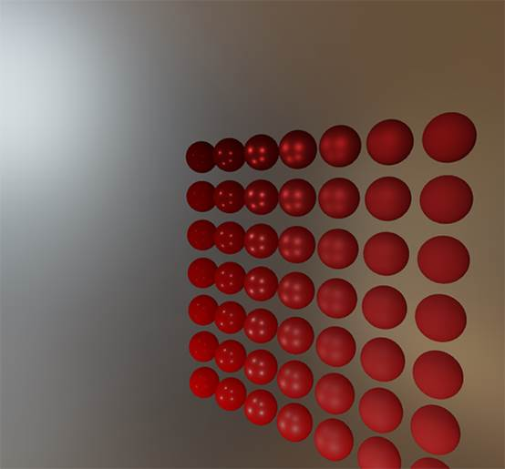

If it looks somewhat similar you've successfully pre-filtered the HDR environment map. Play around with different mipmap levels to see the pre-filter map gradually change from sharp to blurry reflections on increasing mip levels.  

**Pre-filter convolution artifacts** 

While the current pre-filter map works fine for most purposes, sooner or later you'll come across several render artifacts that are directly related to the pre-filter convolution. I'll list the most common here including how to fix them.  

**Cubemap seams at high roughness** 

Sampling the pre-filter map on surfaces with a rough surface means sampling the pre-filter map on some of its lower mip levels. When sampling cubemaps, OpenGL by default doesn't linearly interpolate **across** cubemap faces. Because the lower mip levels are both of a lower resolution and the pre-filter map is convoluted with a much larger sample lobe, the lack of *between-cube-face filtering* becomes quite apparent:  

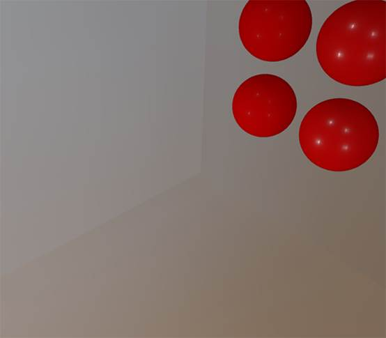

Luckily for us, OpenGL gives us the option to properly filter across cubemap faces by enabling GL_TEXTURE_CUBE_MAP_SEAMLESS:  

 
 glEnable(GL_TEXTURE_CUBE_MAP_SEAMLESS);   
  

Simply enable this property somewhere at the start of your application and the seams will be gone.  

**Bright dots in the pre-filter convolution** 

Due to high frequency details and wildly varying light intensities in specular reflections, convoluting the specular reflections requires a large number of samples to properly account for the wildly varying nature of HDR environmental reflections. We already take a very large number of samples, but on some environments it might still not be enough at some of the rougher mip levels in which case you'll start seeing dotted patterns emerge around bright areas:  

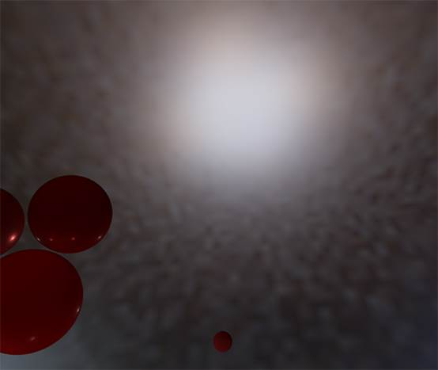

One option is to further increase the sample count, but this won't be enough for all environments. As described by [Chetan Jags](https://chetanjags.wordpress.com/2015/08/26/image-based-lighting/) we can reduce this artifact by (during the pre-filter convolution) not directly sampling the environment map, but sampling a mip level of the environment map based on the integral's PDF and the roughness:  

 
 **float** D   = DistributionGGX(NdotH, roughness); 
 **float** pdf = (D * NdotH / (4.0 * HdotV)) + 0.0001;  
  

**float** resolution = 512.0; // resolution of source cubemap (per face) 
 **float** saTexel  = 4.0 * PI / (6.0 * resolution * resolution); 
 **float** saSample = 1.0 / (**float**(SAMPLE_COUNT) * pdf + 0.0001); 
  

**float** mipLevel = roughness == 0.0 ? 0.0 : 0.5 * log2(saSample / saTexel);  
  

Don't forget to enable trilinear filtering on the environment map you want to sample its mip levels from:  

 
 glBindTexture(GL_TEXTURE_CUBE_MAP, envCubemap); 
 glTexParameteri(GL_TEXTURE_CUBE_MAP, GL_TEXTURE_MIN_FILTER, GL_LINEAR_MIPMAP_LINEAR);  
  

And let OpenGL generate the mipmaps **after** the cubemap's base texture is set:  

 
 // convert HDR equirectangular environment map to cubemap equivalent 
 [...] 
 // then generate mipmaps 
 glBindTexture(GL_TEXTURE_CUBE_MAP, envCubemap); 
 glGenerateMipmap(GL_TEXTURE_CUBE_MAP); 
  

This works surprisingly well and should remove most, if not all, dots in your pre-filter map on rougher surfaces.  

**Pre-computing the BRDF** 

With the pre-filtered environment up and running, we can focus on the second part of the split-sum approximation: the BRDF. Let's briefly review the specular split sum approximation again:  

*Lo*(*p*,*ωo*)=∫Ω*Li*(*p*,*ωi*)*dωi*∗∫Ω*fr*(*p*,*ωi*,*ωo*)*n*⋅*ωidωi*Lo(p,ωo)=∫ΩLi(p,ωi)dωi∗∫Ωfr(p,ωi,ωo)n⋅ωidωi 

We've pre-computed the left part of the split sum approximation in the pre-filter map over different roughness levels. The right side requires us to convolute the BRDF equation over the angle *n*⋅*ωo*n⋅ωo , the surface roughness and Fresnel's *F*0F0 . This is similar to integrating the specular BRDF with a solid-white environment or a constant radiance *Li*Li of 1.0. Convoluting the BRDF over 3 variables is a bit much, but we can move *F*0F0 out of the specular BRDF equation:  

∫Ω*fr*(*p*,*ωi*,*ωo*)*n*⋅*ωidωi*=∫Ω*fr*(*p*,*ωi*,*ωo*)*F*(*ωo*,*h*)*F*(*ωo*,*h*)*n*⋅*ωidωi*∫Ωfr(p,ωi,ωo)n⋅ωidωi=∫Ωfr(p,ωi,ωo)F(ωo,h)F(ωo,h)n⋅ωidωi 

With *F*F being the Fresnel equation. Moving the Fresnel denominator to the BRDF gives us the following equivalent equation:  

∫Ω*fr*(*p*,*ωi*,*ωo*)*F*(*ωo*,*h*)*F*(*ωo*,*h*)*n*⋅*ωidωi*∫Ωfr(p,ωi,ωo)F(ωo,h)F(ωo,h)n⋅ωidωi 

Substituting the right-most *F*F with the Fresnel-Schlick approximation gives us:  

∫Ω*fr*(*p*,*ωi*,*ωo*)*F*(*ωo*,*h*)(*F*0+(1−*F*0)(1−*ωo*⋅*h*)5)*n*⋅*ωidωi*∫Ωfr(p,ωi,ωo)F(ωo,h)(F0+(1−F0)(1−ωo⋅h)5)n⋅ωidωi 

Let's replace (1−*ωo*⋅*h*)5(1−ωo⋅h)5 by *α*α to make it easier to solve for *F*0F0 :  

∫Ω*fr*(*p*,*ωi*,*ωo*)*F*(*ωo*,*h*)(*F*0+(1−*F*0)*α*)*n*⋅*ωidωi*∫Ωfr(p,ωi,ωo)F(ωo,h)(F0+(1−F0)α)n⋅ωidωi 

∫Ω*fr*(*p*,*ωi*,*ωo*)*F*(*ωo*,*h*)(*F*0+1∗*α*−*F*0∗*α*)*n*⋅*ωidωi*∫Ωfr(p,ωi,ωo)F(ωo,h)(F0+1∗α−F0∗α)n⋅ωidωi 

∫Ω*fr*(*p*,*ωi*,*ωo*)*F*(*ωo*,*h*)(*F*0∗(1−*α*)+*α*)*n*⋅*ωidωi*∫Ωfr(p,ωi,ωo)F(ωo,h)(F0∗(1−α)+α)n⋅ωidωi 

Then we split the Fresnel function *F*F over two integrals:  

∫Ω*fr*(*p*,*ωi*,*ωo*)*F*(*ωo*,*h*)(*F*0∗(1−*α*))*n*⋅*ωidωi*+∫Ω*fr*(*p*,*ωi*,*ωo*)*F*(*ωo*,*h*)(*α*)*n*⋅*ωidωi*∫Ωfr(p,ωi,ωo)F(ωo,h)(F0∗(1−α))n⋅ωidωi+∫Ωfr(p,ωi,ωo)F(ωo,h)(α)n⋅ωidωi 

This way, *F*0F0 is constant over the integral and we can take *F*0F0 out of the integral. Next, we substitute *α*α back to its original form giving us the final split sum BRDF equation:  

*F*0∫Ω*fr*(*p*,*ωi*,*ωo*)(1−(1−*ωo*⋅*h*)5)*n*⋅*ωidωi*+∫Ω*fr*(*p*,*ωi*,*ωo*)(1−*ωo*⋅*h*)5*n*⋅*ωidωi*F0∫Ωfr(p,ωi,ωo)(1−(1−ωo⋅h)5)n⋅ωidωi+∫Ωfr(p,ωi,ωo)(1−ωo⋅h)5n⋅ωidωi 

The two resulting integrals represent a scale and a bias to *F*0F0 respectively. Note that as *f*(*p*,*ωi*,*ωo*)f(p,ωi,ωo) already contains a term for *F*F they both cancel out, removing *F*F from *f*f .  

In a similar fashion to the earlier convoluted environment maps, we can convolute the BRDF equations on their inputs: the angle between *n*n and *ωo*ωo and the roughness, and store the convoluted result in a texture. We store the convoluted results in a 2D lookup texture (LUT) known as a BRDF integration map that we later use in our PBR lighting shader to get the final convoluted indirect specular result.  

The BRDF convolution shader operates on a 2D plane, using its 2D texture coordinates directly as inputs to the BRDF convolution (NdotV and roughness). The convolution code is largely similar to the pre-filter convolution, except that it now processes the sample vector according to our BRDF's geometry function and Fresnel-Schlick's approximation:  

​           
 vec2 IntegrateBRDF(**float** NdotV, **float** roughness) 
 { 
​     vec3 V; 
​     V.x = sqrt(1.0 - NdotV*NdotV); 
​     V.y = 0.0; 
​     V.z = NdotV; 
  

**float** A = 0.0; 
     **float** B = 0.0; 
  

vec3 N = vec3(0.0, 0.0, 1.0); 
  

**const** uint SAMPLE_COUNT = 1024u; 
     **for**(uint i = 0u; i < SAMPLE_COUNT; ++i) 
     { 
         vec2 Xi = Hammersley(i, SAMPLE_COUNT); 
         vec3 H  = ImportanceSampleGGX(Xi, N, roughness); 
         vec3 L  = normalize(2.0 * dot(V, H) * H - V); 
  

**float** NdotL = max(L.z, 0.0); 
         **float** NdotH = max(H.z, 0.0); 
         **float** VdotH = max(dot(V, H), 0.0); 
  

**if**(NdotL > 0.0) 
         { 
             **float** G = GeometrySmith(N, V, L, roughness); 
             **float** G_Vis = (G * VdotH) / (NdotH * NdotV); 
             **float** Fc = pow(1.0 - VdotH, 5.0); 
  

A += (1.0 - Fc) * G_Vis; 
             B += Fc * G_Vis; 
         } 
     } 
     A /= **float**(SAMPLE_COUNT); 
     B /= **float**(SAMPLE_COUNT); 
     **return** vec2(A, B); 
 } 
 // ---------------------------------------------------------------------------- 
 **void** main()  
 { 
     vec2 integratedBRDF = IntegrateBRDF(TexCoords.x, TexCoords.y); 
     FragColor = integratedBRDF; 
 } 
  

As you can see the BRDF convolution is a direct translation from the mathematics to code. We take both the angle *θ*θ and the roughness as input, generate a sample vector with importance sampling, process it over the geometry and the derived Fresnel term of the BRDF, and output both a scale and a bias to *F*0F0 for each sample, averaging them in the end.  

You might've recalled from the [theory](https://learnopengl.com/#!PBR/Theory) tutorial that the geometry term of the BRDF is slightly different when used alongside IBL as its *k*k variable has a slightly different interpretation:  

*kdirect*=(*α*+1)28kdirect=(α+1)28 

*kIBL*=*α*22kIBL=α22 

Since the BRDF convolution is part of the specular IBL integral we'll use *kIBL*kIBL for the Schlick-GGX geometry function:  

 
 **float** GeometrySchlickGGX(**float** NdotV, **float** roughness) 
 { 
     **float** a = roughness; 
     **float** k = (a * a) / 2.0; 
  

**float** nom   = NdotV; 
     **float** denom = NdotV * (1.0 - k) + k; 
  

**return** nom / denom; 
 } 
 // ---------------------------------------------------------------------------- 
 **float** GeometrySmith(vec3 N, vec3 V, vec3 L, **float** roughness) 
 { 
     **float** NdotV = max(dot(N, V), 0.0); 
     **float** NdotL = max(dot(N, L), 0.0); 
     **float** ggx2 = GeometrySchlickGGX(NdotV, roughness); 
     **float** ggx1 = GeometrySchlickGGX(NdotL, roughness); 
  

**return** ggx1 * ggx2; 
 }   
  

Note that while *k*k takes a as its parameter we didn't square roughness as a as we originally did for other interpretations of a; likely as a is squared here already. I'm not sure whether this is an inconsistency on Epic Games' part or the original Disney paper, but directly translating roughness to a gives the BRDF integration map that is identical to Epic Games' version.  

Finally, to store the BRDF convolution result we'll generate a 2D texture of a 512 by 512 resolution.  

 
 **unsigned** **int** brdfLUTTexture; 
 glGenTextures(1, &brdfLUTTexture); 
  

// pre-allocate enough memory for the LUT texture. 
 glBindTexture(GL_TEXTURE_2D, brdfLUTTexture); 
 glTexImage2D(GL_TEXTURE_2D, 0, GL_RG16F, 512, 512, 0, GL_RG, GL_FLOAT, 0); 
 glTexParameteri(GL_TEXTURE_2D, GL_TEXTURE_WRAP_S, GL_CLAMP_TO_EDGE); 
 glTexParameteri(GL_TEXTURE_2D, GL_TEXTURE_WRAP_T, GL_CLAMP_TO_EDGE); 
 glTexParameteri(GL_TEXTURE_2D, GL_TEXTURE_MIN_FILTER, GL_LINEAR); 
 glTexParameteri(GL_TEXTURE_2D, GL_TEXTURE_MAG_FILTER, GL_LINEAR);  
  

Note that we use a 16-bit precision floating format as recommended by Epic Games. Be sure to set the wrapping mode to GL_CLAMP_TO_EDGE to prevent edge sampling artifacts.  

Then, we re-use the same framebuffer object and run this shader over an NDC screen-space quad:  

 
 glBindFramebuffer(GL_FRAMEBUFFER, captureFBO); 
 glBindRenderbuffer(GL_RENDERBUFFER, captureRBO); 
 glRenderbufferStorage(GL_RENDERBUFFER, GL_DEPTH_COMPONENT24, 512, 512); 
 glFramebufferTexture2D(GL_FRAMEBUFFER, GL_COLOR_ATTACHMENT0, GL_TEXTURE_2D, brdfLUTTexture, 0); 
  

glViewport(0, 0, 512, 512); 
 brdfShader.use(); 
 glClear(GL_COLOR_BUFFER_BIT | GL_DEPTH_BUFFER_BIT); 
 RenderQuad(); 
  

glBindFramebuffer(GL_FRAMEBUFFER, 0);   
  

The convoluted BRDF part of the split sum integral should give you the following result:  

With both the pre-filtered environment map and the BRDF 2D LUT we can re-construct the indirect specular integral according to the split sum approximation. The combined result then acts as the indirect or ambient specular light.  

**Completing the IBL reflectance** 

To get the indirect specular part of the reflectance equation up and running we need to stitch both parts of the split sum approximation together. Let's start by adding the pre-computed lighting data to the top of our PBR shader:  

 
 **uniform** samplerCube prefilterMap; 
 **uniform** sampler2D   brdfLUT;   
  

First, we get the indirect specular reflections of the surface by sampling the pre-filtered environment map using the reflection vector. Note that we sample the appropriate mip level based on the surface roughness, giving rougher surfaces *blurrier* specular reflections.  

 
 **void** main() 
 { 
     [...] 
     vec3 R = reflect(-V, N);    
  

**const** **float** MAX_REFLECTION_LOD = 4.0; 
     vec3 prefilteredColor = textureLod(prefilterMap, R,  roughness * MAX_REFLECTION_LOD).rgb;     
     [...] 
 } 
  

In the pre-filter step we only convoluted the environment map up to a maximum of 5 mip levels (0 to 4), which we denote here as MAX_REFLECTION_LOD to ensure we don't sample a mip level where there's no (relevant) data.  

Then we sample from the BRDF lookup texture given the material's roughness and the angle between the normal and view vector:  

 
 vec3 F        = FresnelSchlickRoughness(max(dot(N, V), 0.0), F0, roughness); 
 vec2 envBRDF  = texture(brdfLUT, vec2(max(dot(N, V), 0.0), roughness)).rg; 
 vec3 specular = prefilteredColor * (F * envBRDF.x + envBRDF.y); 
  

Given the scale and bias to *F*0F0 (here we're directly using the indirect Fresnel result F) from the BRDF lookup texture we combine this with the left pre-filter portion of the IBL reflectance equation and re-construct the approximated integral result as specular.  

This gives us the indirect specular part of the reflectance equation. Now, combine this with the diffuse part of the reflectance equation from the [last](https://learnopengl.com/#!PBR/IBL/Diffuse-irradiance) tutorial and we get the full PBR IBL result:  

 
 vec3 F = FresnelSchlickRoughness(max(dot(N, V), 0.0), F0, roughness); 
  

vec3 kS = F; 
 vec3 kD = 1.0 - kS; 
 kD *= 1.0 - metallic;    
    
 vec3 irradiance = texture(irradianceMap, N).rgb; 
 vec3 diffuse    = irradiance * albedo; 
    
 **const** **float** MAX_REFLECTION_LOD = 4.0; 
 vec3 prefilteredColor = textureLod(prefilterMap, R,  roughness * MAX_REFLECTION_LOD).rgb;    
 vec2 envBRDF  = texture(brdfLUT, vec2(max(dot(N, V), 0.0), roughness)).rg; 
 vec3 specular = prefilteredColor * (F * envBRDF.x + envBRDF.y); 
    
 vec3 ambient = (kD * diffuse + specular) * ao;  
  

Note that we don't multiply specular by kS as we already have a Fresnel multiplication in there.  

Now, running this exact code on the series of spheres that differ by their roughness and metallic properties we finally get to see their true colors in the final PBR renderer:  

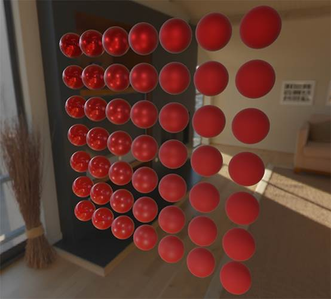

We could even go wild, and use some cool textured [PBR materials](http://freepbr.com):  

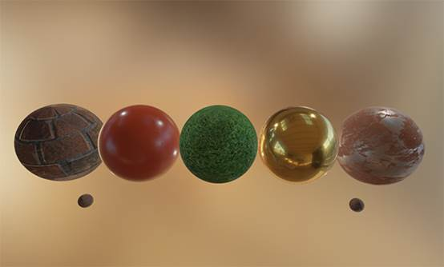

Or load [this awesome free PBR 3D model](http://artisaverb.info/PBT.html) by Andrew Maximov:  

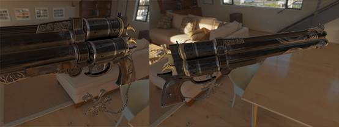

I'm sure we can all agree that our lighting now looks a lot more convincing. What's even better, is that our lighting looks physically correct, regardless of which environment map we use. Below you'll see several different pre-computed HDR maps, completely changing the lighting dynamics, but still looking physically correct without changing a single lighting variable!  

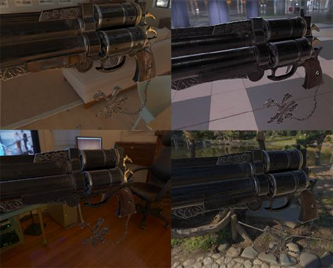

Well, this PBR adventure turned out to be quite a long journey. There are a lot of steps and thus a lot that could go wrong so carefully work your way through the [sphere scene](https://learnopengl.com/code_viewer_gh.php?code=src/6.pbr/2.2.1.ibl_specular/ibl_specular.cpp) or [textured scene](https://learnopengl.com/code_viewer_gh.php?code=src/6.pbr/2.2.2.ibl_specular_textured/ibl_specular_textured.cpp) code samples (including all shaders) if you're stuck, or check and ask around in the comments.  

**What's next?** 

Hopefully, by the end of this tutorial you should have a pretty clear understanding of what PBR is about, and even have an actual PBR renderer up and running. In these tutorials, we've pre-computed all the relevant PBR image-based lighting data at the start of our application, before the render loop. This was fine for educational purposes, but not too great for any practical use of PBR. First, the pre-computation only really has to be done once, not at every startup. And second, the moment you use multiple environment maps you'll have to pre-compute each and every one of them at every startup which tends to build up.  

For this reason you'd generally pre-compute an environment map into an irradiance and pre-filter map just once, and then store it on disk (note that the BRDF integration map isn't dependent on an environment map so you only need to calculate or load it once). This does mean you'll need to come up with a custom image format to store HDR cubemaps, including their mip levels. Or, you'll store (and load) it as one of the available formats (like .dds that supports storing mip levels).  

Furthermore, we've described the **total** process in these tutorials, including generating the pre-computed IBL images to help further our understanding of the PBR pipeline. But, you'll be just as fine by using several great tools like [cmftStudio](https://github.com/dariomanesku/cmftStudio) or [IBLBaker](https://github.com/derkreature/IBLBaker) to generate these pre-computed maps for you.  

One point we've skipped over is pre-computed cubemaps as reflection probes: cubemap interpolation and parallax correction. This is the process of placing several reflection probes in your scene that take a cubemap snapshot of the scene at that specific location, which we can then convolute as IBL data for that part of the scene. By interpolating between several of these probes based on the camera's vicinity we can achieve local high-detail image-based lighting that is simply limited by the amount of reflection probes we're willing to place. This way, the image-based lighting could correctly update when moving from a bright outdoor section of a scene to a darker indoor section for instance. I'll write a tutorial about reflection probes somewhere in the future, but for now I recommend the article by Chetan Jags below to give you a head start.  

**Further reading** 

·    [Real Shading in Unreal Engine 4](http://blog.selfshadow.com/publications/s2013-shading-course/karis/s2013_pbs_epic_notes_v2.pdf): explains Epic Games' split sum approximation. This is the article the IBL PBR code is based of. 

·    [Physically Based Shading and Image Based Lighting](http://www.trentreed.net/blog/physically-based-shading-and-image-based-lighting/): great blog post by Trent Reed about integrating specular IBL into a PBR pipeline in real time.  

·    [Image Based Lighting](https://chetanjags.wordpress.com/2015/08/26/image-based-lighting/): very extensive write-up by Chetan Jags about specular-based image-based lighting and several of its caveats, including light probe interpolation. 

·    [Moving Frostbite to PBR](https://seblagarde.files.wordpress.com/2015/07/course_notes_moving_frostbite_to_pbr_v32.pdf): well written and in-depth overview of integrating PBR into a AAA game engine by Sébastien Lagarde and Charles de Rousiers. 

·    [Physically Based Rendering – Part Three](https://jmonkeyengine.github.io/wiki/jme3/advanced/pbr_part3.html): high level overview of IBL lighting and PBR by the JMonkeyEngine team. 

·    [Implementation Notes: Runtime Environment Map Filtering for Image Based Lighting](https://placeholderart.wordpress.com/2015/07/28/implementation-notes-runtime-environment-map-filtering-for-image-based-lighting/): extensive write-up by Padraic Hennessy about pre-filtering HDR environment maps and significanly optimizing the sample process. 

 

来自 <<https://learnopengl.com/PBR/IBL/Specular-IBL>>  

 

 