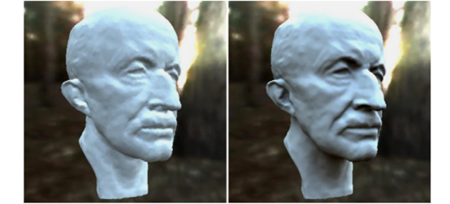
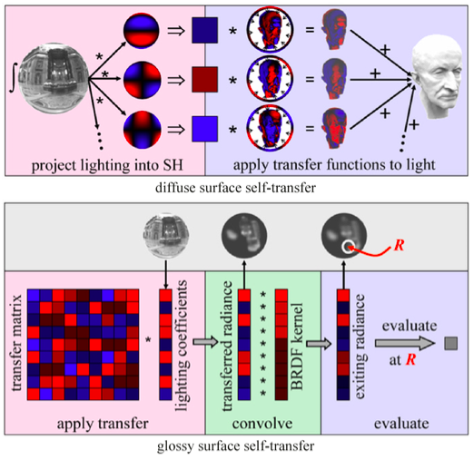
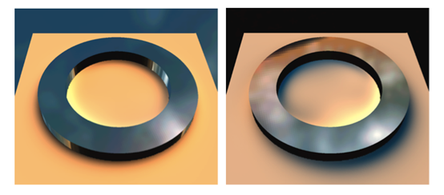
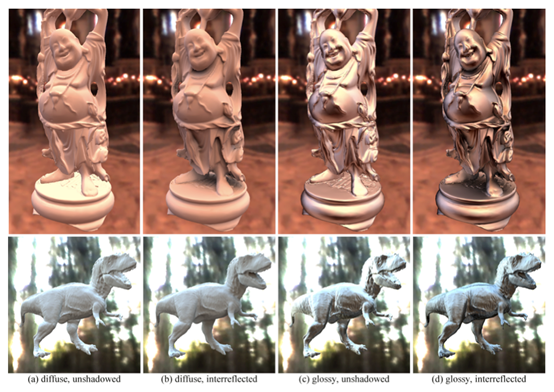
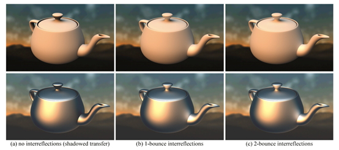

# 基于物理的渲染—基于球面调和基的实时全局光照明 

在介绍本文的主要内容PRT之前，我们先介绍在游戏引擎渲染管线中常见的一个步骤 IBL。迪士尼在2012年Siggraph会议上发表的 PBR course中提到，他们在 PBR 的渲染管线中加入了 IBL（Image Based Lighting）使得渲染结果更加真实。目前，IBL几乎成为了 PBR 渲染管线必不可少的一部分（例如：很多引擎提供了 SkyBox 作为环境光贴图，或者提供采样工具来抓取场景的环境光贴图，然后用该贴图来渲染场景中物体）。 

什么是IBL，为什么要使用它呢？其实，在早期实时渲染中，我们常用方向光模拟无限远的太阳光，用点光源来模拟近处的灯光。但实际上，当一个物体处于某一个场景中时，它被来自四面八方的入射光线所照亮。这些入射光不仅来自于光源，有的还来自于物体表面的漫反射、镜面反射、折射，甚至有的来自于雾气中的散射。为了模拟这些真实的、来自四面八方的入射光，IBL的思路是：假设场景中的物理被一个密闭的立方体包围，那么场景中射向它的光线必定来自于这个立方体的6个面。我们只需要将物体周围的场景渲染到这6个面上作为入射光，那么这6个面即涵盖了所有来自光源、物体表面反射、雾气散射等的各种光线。 

由于 IBL 采用了真实拍摄的环境光贴图作为入射光，因此能够更加逼真地模拟物体在真实环境中被照亮的情况。但是这一算法需要对立方体环境贴图进行采样，计算来自环境贴图各个方向的入射光对物体的光照信息，这一过程时间开销非常大，即使是利用GPU的并行性也无法实时地完成。于是，有人提出了将入射光和材质在半球面上的卷积计算转换为球面调和函数基（Spherical Harmonic Function，简称 SH）上的点积，减少实时计算的开销。今天我们介绍的这篇论文就是基于IBL，并且在此基础上引入了全局光照明，达到了实时全局光照的效果。 

这篇文章是Peter-Pike Sloan发表在2002年Siggraph会议上的论文。它提出了一种预计算的方法，将全局光照计算中的不变量预计算存储下来，实时渲染时只需要计算变化的部分，这样大大减少了实时渲染的时间开销。这篇论文的算法是第一个做到实时全局光照的渲染算法，并随后掀起了一波极大的研究浪潮，它就是著名的PRT（Precomputed Radiance Transfer）。 

我们首先来看这篇论文的渲染结果，如下图所示。 

其中，左图是不包含全局光照的结果，右图是包含全局光照的结果。对比左右两边，可以看到右边的模型表面凹陷进去的地方比左边更加暗，这是因为右图增加了AO（AmbientOcclusion）。同时，右图还增加了表面多次反射光照的计算。这些效果都是通过实时计算完成，而这正是传统的全局光照算法无法达到的，如：蒙特卡洛光线跟踪、辐射度以及多遍点光源等。 

要实时地渲染出全局光照效果，其难点主要有三个：1）需要模拟复杂的BRDF；2）需要计算入射光线半球积分；3）需要计算遮挡，物体表面多次反射。 

论文作者将这些复杂的光照计算过程看作一个光线传输函数（Transfer Function），将入射光信息看作函数的输入。并且利用球面调和基函数、光线传输的线性性以及预计算，将入射光线在物体之间多次反射传递的复杂计算变为简单快速的内积计算。由于作者采用了低阶的球面调和基函数来表示，因此只考虑了低频的光照信息（环境光贴图的变化不大）。PRT 算法的流程图如下图所示。 

其中，上图是 Diffuse 材质的流程图，下图是 Glossy 材质的流程图。从上图可以看到，PRT 算法先将环境光贴图投射到 SH 上，计算出一个 SH 系数向量。然后，利用离线的全局光照算法对物体进行全局光照模拟计算出传输函数，并且将传输函数也投射到 SH 上，得到一个系数向量。最后在实时计算的时候，将光照的 SH 系数向量与预先计算好的传输函数 SH 系数向量做点积，即可计算出物体表面上的光照。由于 Diffuse 材质与视线方向无关，因此传输函数只需一个向量即可表示。但是对于 Glossy 材质，不同视点观察物体表面同一点会有不同的光照。因此，Glossy 材质的传输函数需要增加一个视线方向的维度，变成一个矩阵。在实时计算时与 Diffuse 一样，将光照向量与传输函数矩阵做乘法，得到传输后的入射光照向量。然后，将该向量与物体材质 BRDF 做卷积，得到一个表示各个方向反射光线的向量。最后，从这个向量中计算出视线方向的反射光线。接下来我们介绍这篇论文的主要内容。 

 
  

一、球面调和基函数介绍 

PRT 算法利用了一个重要的数学工具，就是球面调和基函数。SH 类似于傅里叶变换，只不过傅里叶变换定义在一维变量上，SH 是定义在二维球面上。而渲染方程中的积分正是定义在二维球面方向上，因此 SH 非常适合解决渲染方程的计算问题。同样，一个定义在二维球面 s 上的函数可以用 SH 基函数以及系数近似表示。若用 l 和 m 表示 SH 的两个参数， f(s) 表示定义在球面上的函数，ylm 表示基函数，则 f(s) 在 SH 上的投影系数可以表示为： 

f(s) 则可以近似表示为： 

PRT 利用了 SH 的两个性质，1）旋转不变性，2）正交性。旋转不变性保证了在将环境光贴图投射到 SH 上之后，对于物体表面任意法线方向，我们可以对其进行旋转后采样。正交性保证了对于任意两个定义在球面上的函数的卷积计算，它们可以转化为对应 SH 系数的点积。 

 
  

二、传输函数介绍 

2.1 Diffuse材质 

不考虑物体表面多次反射时，对于材质为Diffuse的物体 O ，其表面一点 p ∈ O 处的渲染方程可表示为： 

其中， HNP(s)=max(Np . s, 0) 为余弦项，Np 为 p 点法向，ρp 为 p 点颜色，Lp 为入射光，可见性函数Vp (s) → {0,1} ，被遮挡时取 0，反之取 1 。因此，传输函数 MpDS 可表示为： 

其中将 Lp 以及 Mp 分别投影到 SH 上，TDS 的积分计算变成了 SH 系数向量的点积。 

考虑物体表面多次反射时，p 点的渲染方程可表示为： 

其中，L'P (s）表示来自物体 O 从 s 方向射入 p 点的光。对于TDI 的传输函数 MpDI (s) ，难以用完整的表达式表示。但是在实现的过程中，我们可以通过多次迭代表面反射来计算 MpDI (s) 。 

2.2 Glossy材质 

类似于 Diffuse 材质，Glossy 材质的渲染方程可以表示为： 

其中，G (s, R, r ) 为 p 点 BRDF，R 为反射光线方向，r 为 Glossy 参数。由于 Glossy 材质不仅与光线入射方向 s 有关，因此其传输函数不能仅仅用一个向量表示。论文作者提出的方法是，将入射光 LP (s）转换为传输后的入射光 L'P (s） 。假设 G 是关于 R 对称的，则可通过将L'P (s）与卷积 G (s,(0,0,1), r ) 来计算最后的结果。因此，从 LP (s）到 L'P (s）的传输函数可以表示为： 

 

 
  

三、预计算与实时渲染 

论文作者采用多遍模拟方式来预计算传输函数。在第一遍时，对于物体 O 上每一点 p ，仅仅计算直接光照的结果。然后，对于被物体遮挡住的光线，继续迭代计算从该方向反射的光线。并且，在后续的迭代计算中，将之前的光照结果加入其中。在计算每一点的传输函数时，论文作者采样 10k~30k 个方向。在计算光照的同时，也计算遮挡信息。随着迭代次数的增加，当能量衰减到某一阈值时，停止迭代结束计算。 

在实时渲染时，采用如下步骤： 

1） 计算物体 O 入射光 Lp; 

2） 将 Lp 旋转到 O 法线方向的局部坐标; 

3） 将 Lp 向量与 Mp 向量做点积，或者与Mp 矩阵乘法; 

4） 对于 Glossy 物体，将传输后的入射光 L'p 与 BRDF 做卷积，并计算 R 方向反射光线。 

当需要计算不同物体之间的多次反射光线时，采用如同单个物体一样的迭代计算，但在迭代时不仅仅计算来自自身的反射光线，也计算来自其他物体的反射光。 

 
  

四、实验结果 

论文作者采用不同的场景做实验，均能达到实时的帧率。实验数据如下图所示。 

 

更多的渲染结果对比如下图所示。 

 

 

 
  

五、总结 

论文作者利用 SH 的旋转不变性和正交性，在预计算中模拟光线在照亮物体时传输的过程，并将该过程的传输函数投射到 SH 上。在实时渲染时，只需要计算光源在 SH 上的投射系数，然后与传输函数的 SH 投射做点积即可计算出光照信息。这一算法达到了实时地计算全局光的效果。 

PRT 不仅为我们提供了实时全局光照明的方法，更重要的是它为我们提供了一个优化实时渲染性能的思路，即预计算。在任何渲染计算中，我们都可以找到一个预计算与实时计算的平衡点。当实时性需求高而硬件性能又达不到要求时，我们可以将部分计算预先做好，然后只保留少量必要的变量。在实时计算时，通过查表的方式读取预先计算好的结果，然后通过简单拟合计算出最终结果。当然，如果采用预计算的方式，就意味着需要采样，增加存储量。并且，输入环境发生改变时，预计算的变量不会发生变化了，这必然会带来限制条件。例如本文介绍的这篇论文中的 PRT ，因为它采用传输函数将光线在物体间传输的过程预计算好，所以它只能计算实时计算静态物体的全局光照。当物体之间的几何关系发生变化时，预计算好的传输函数则不再有效。 

 
  

六、论文信息 

论文参考视频： 

视频网址：<https://v.qq.com/x/page/x0382thpc7b.html> 

作者介绍： 

Peter-Pike Sloan，著名计算机图形学学者，曾经在微软研究院从事图形学研究工作，目前在动视暴雪做图形研究。 

Jan Kautz，著名计算机图形学学者，曾经在max planck institut informatik研究所学习，目前在Nvidia做图形研究。 

John Snyder，著名计算机图形学学者，曾经在微软研究院从事图形学研究工作。 

下载链接： 

[www-inst.eecs.berkeley.edu/~cs283/fa10/lectures/p527-sloan.pdf](http://www-inst.eecs.berkeley.edu/~cs283/fa10/lectures/p527-sloan.pdf) 

这是侑虎科技第209篇原创文章，欢迎转发分享，未经作者授权请勿转载。如果您也有任何独到的见解或者全新的发现也欢迎联系我们，一起探讨。（QQ群465082844） 

 
  

关于惟学无际 

UWA在2017年推出的全新研究型专栏，我们将为大家推荐极具实际价值的学术论文，并梳理其中的研究背景、实现原理和执行方法等。内容专注于游戏、VR和AR相关的计算机图形学领域。正所谓问渠哪得清如许，为有源头活水来 ，希望大家在研发的过程中不仅知其然，还能知其所以然。 

 

来自 <<https://blog.csdn.net/uwa4d/article/details/72828537>>  

 

 