# Matcap Shader 详解【1】-基础思想与U3D实现


https://zhuanlan.zhihu.com/p/37702186


## **Matcap简介**

Matcap Shader是一种在某些层面能替代甚至超越PBR的次时代渲染方案。

它的效率极高、计算成本极低，显示效果极佳，却能完美运行于不同的移动平台，并兼容AR、VR设备，所以极具研究与实用价值。

但Matcap也有很多局限性和缺点，此系列文章就是用于讲解Matcap的实现方法与针对其问题的优化。

> [Unity Community Wiki ](https://link.zhihu.com/?target=http%3A//wiki.unity3d.com/index.php/MatCap)中将其定义为：
> *用于均一表面反射材质的着色器，在Zbrush/Mudbox等软件中被广泛运用。它借助一幅含有球面的图片作为视线空间的环境映射，计算成本非常低廉，当相机不转动时视觉效果极其出色。*


*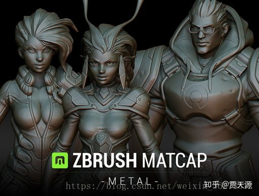ZB中的Matcap*

## **Matcap原理**

Matcap的原理并不复杂，就是使用一张中间为球面的图片作为不同法线方向的光照颜色，然后将这些颜色根据模型的法线信息渲染到相应位置。

例如下图图二（黑白）中，球形就是Matcap贴图，箭头代表了右下朝向的法线，车与人的模型法线朝向此相同方向时，就会渲染为球形贴图上相应点的颜色——白色。


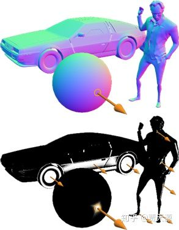matcap原理示意图

## **Matcap的优点**

正如文章开始所说，Matcap一大优势是——运算效率极高，计算成本极低，在很多场合却能够替代PBR。用Unlit级别的计算成本，获得3A级的渲染效果，这正是Matcap吸引人的地方。

除此之外，Matcap也拥有PBR不具备的优势——充满了很多新的可能性，只需简单更换Matcap贴图，就能实现各种神奇的渲染效果。具体请看下方示例，每幅左上角为Matcap取样贴图。


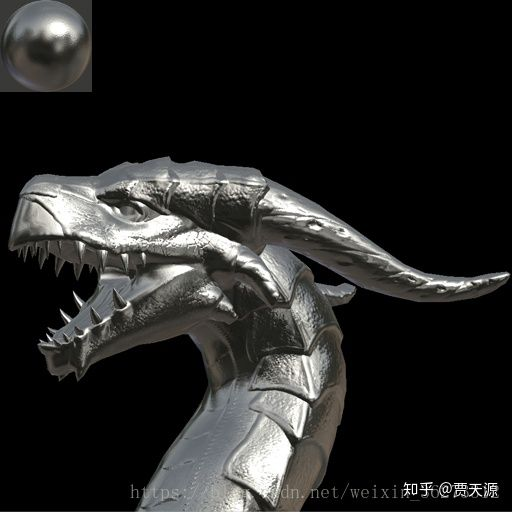粗糙金属质感


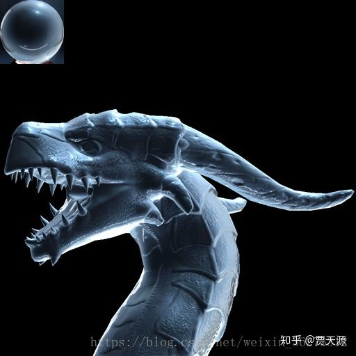冰霜质感


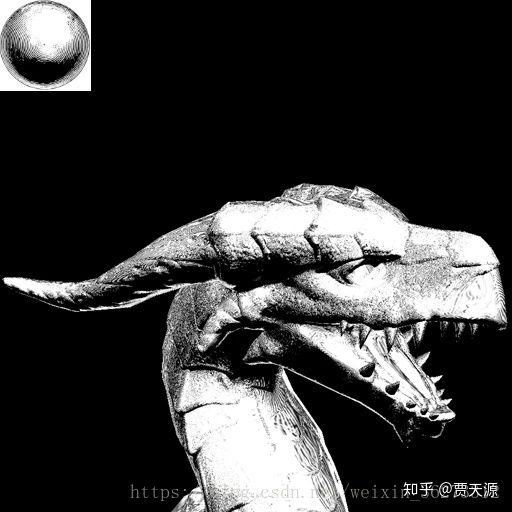素描质感


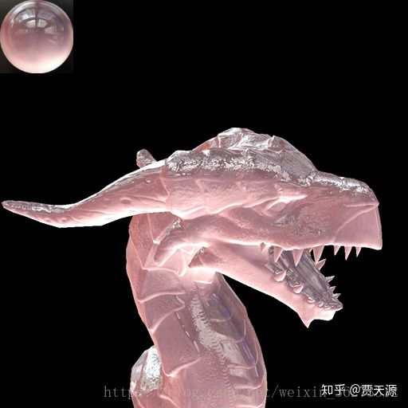粉晶质感


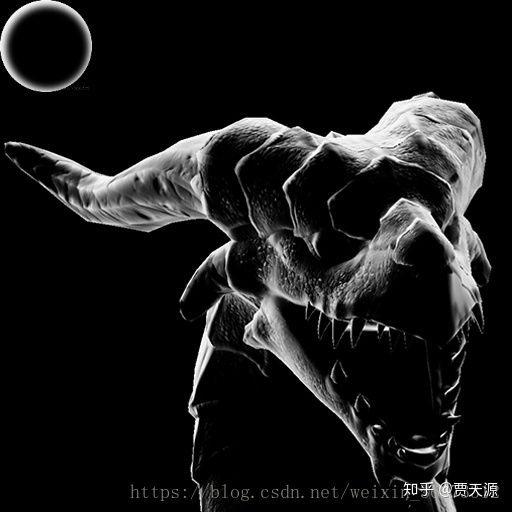幽灵质感


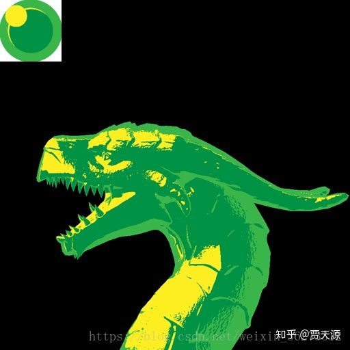卡通质感


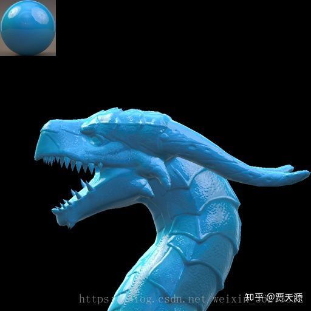车漆质感

## **如何实现Matcap**

Matcap的原理简单，实现起来也并不复杂，下面是基础Matcap在U3D中的实现代码：

```cpp
Shader "TJia/Matcap_Basic" {
	Properties {
		_MatCapDiffuse ("MatCapDiffuse (RGB)", 2D) = "white" {}
	}
	
	Subshader {
		Tags { "RenderType"="Opaque" }
		
		Pass {
			Tags { "LightMode" = "Always" }
			
			CGPROGRAM
				#pragma vertex vert
				#pragma fragment frag
				#include "UnityCG.cginc"
				
				struct v2f { 
					float4 pos : SV_POSITION;
					float2	NtoV : TEXCOORD1;
				};
				
				v2f vert (appdata_tan v)
				{
					v2f o;
					o.pos = UnityObjectToClipPos (v.vertex);

					o.NtoV.x = mul(UNITY_MATRIX_IT_MV[0], v.normal);
					o.NtoV.y = mul(UNITY_MATRIX_IT_MV[1], v.normal);
					return o;
				}
				
				uniform sampler2D _MatCapDiffuse;
				
				float4 frag (v2f i) : COLOR
				{
					fixed4 matcapLookup = tex2D(_MatCapDiffuse, i.NtoV * 0.5 + 0.5);					
					fixed4 finalColor = matcapLookup;
					return finalColor;
				}

			ENDCG
		}
	}
}
```

说明：

1. LightMode 为 Alyaws，这样无论是否有灯光都会渲染
2. UNITY_MATRIX_IT_MV 用于 将法线从模型空间转化到视觉空间，以便映射Matcap采样贴图，使用方法可自行查询
3. NtoV（视觉空间下的二维法线向量）值域为[-1,1]，而贴图UV的定义域是[0,1]，所以用 uv = i.NtoV * 0.5 + 0.5 的方法进行了映射

最终结果如下，可以更换MatcapDiffuse来更换渲染效果：


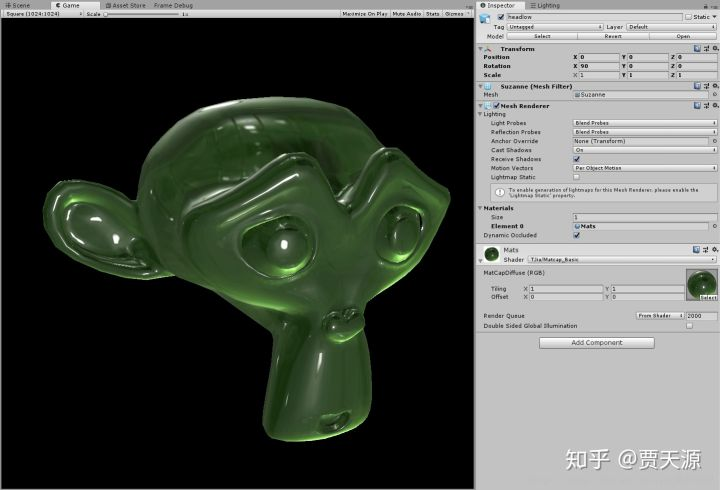


## **基础Matcap的缺陷**

Matcap最初广泛用于ZBrush等3D雕刻软件，并没有固有色贴图、法线贴图等需要，所以 [Unity Community Wiki](https://link.zhihu.com/?target=http%3A//wiki.unity3d.com/index.php/MatCap) 才将其定义为均一表面颜色使用的着色方法。

正因如此，基础Matcap的第一个缺陷就是只适用于单一材质、单一固有色且无法线贴图细节的模型

此外，经典PBR光照模型还包含了漫反射、高光反射、菲涅尔、金属度、光滑度等参数，也是基础Matcap不具备的（第二个缺陷）

第三个缺陷是Matcap无法响应光源与相机位置的变化，原因很简单——Matcap采样贴图是静态的，通过相机空间映射的

第四个问题在于Matcap只能表现单一质感，不支持多种质感或者混合质感的材质

最后的问题是，Matcap在平面、圆柱体及相近形体的渲染上效果并不好（见下图）


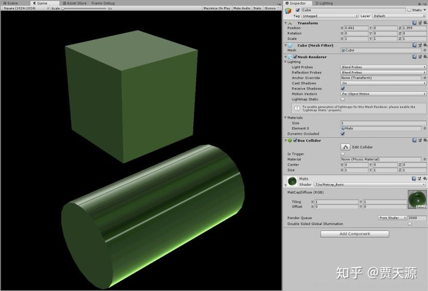


> Matcap在平面及圆柱体渲染上表现很糟

针对以上缺陷，我提出了一些优化的方案，以解决Matcap面对的部分问题，在保留它优点的基础上进一步提高其实用性。

每个缺陷的具体原因及解决方法可以参考此系列之后的文章。

------

系列链接（全）：

[Matcap Shader 详解【1】 - 基础思想与Unity中实现](https://zhuanlan.zhihu.com/p/37702186)

[Matcap Shader 详解【2】 - Matcap的固有色贴图与法线贴图](https://zhuanlan.zhihu.com/p/37719909)

[Matcap Shader 详解【3】 - 利用Matcap实现基本PBR光照模型](https://zhuanlan.zhihu.com/p/37814820)

[Matcap Shader 详解【4】 - 多材质与混合材质](https://zhuanlan.zhihu.com/p/38575505)

[Matcap Shader 详解【5】-动态光照、机位与反射](https://zhuanlan.zhihu.com/p/39087865) 

[Matcap Shader 详解【6】-平面渲染与更佳的反射](https://zhuanlan.zhihu.com/p/40109002)