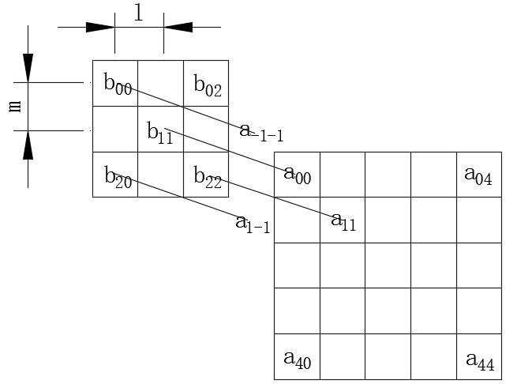

 		[浅谈卷积和C++实现](https://www.cnblogs.com/yabin/p/6664011.html) 	

# 1 信号处理中的卷积

无论是信号处理、图像处理还是其他一些领域，我们经常会在一些相互关联的数据处理中使用卷积。卷积可以说是算法中一个非常重要的概念。这个概念最早起源于信号处理之中。
 假设对于一个线性系统其在单位脉冲δ(t)的响应下，输出为h(t).那么在Aδ(t)的响应下输出为Ah(t).而所有的信号都可以用δ(t)乘以一个系数的和来表示。即
 
=\int_{-\infty}^{+\infty}u(x)\delta(t-x)dx)
 .于是对于线性系统而言，我们可以将当前及过去所有时刻信号（看出无数个脉冲乘以系数）产生的输出进行叠加来得到当前时刻的输出。即对于任意时刻
 

 的输出为
 
=\int_{-\infty}^{+\infty}u(x)h(t_k-x)dx)
 .关于卷积的来源和其物理意义教课书和网上都有很多的介绍，我这里也不再啰嗦了，卷积的物理意义主要体现在如下四个方面：

1. 信号响应的计算
2. 和多项式的关系
3. 滤波器的应用
4. 图像处理中的应用

# 2 matlab中卷积函数

matlab中提供了两个常用的卷积函数`conv`和`conv2`.分别用来计算一维卷积和二维卷积。这两个函数都是对离散的数据进行卷积，接下来我们就分别讨论这两种卷积。

## 2.1一维卷积conv函数

通过对之前信号处理中卷积的介绍，我们将其进行离散化处理可以得到如下离散的一维卷积表达式：
 
=\sum_ju(j)v(k-j))
 .其中u和v为被卷积的信号，y为输出信号。由于matlab中矩阵访问的角标从1开始，所以针对matlab中的输入矩阵u，v其卷积输出y为：
 
=\sum_ju(j)v(k-j+1))

### 卷积和多项式

其实两个多项式之间的乘法我们可以看作是它们系数矩阵之间的卷积。例如
 

 之间的乘积就可以看成u=[1 0 1]和v = [2 7]之间的卷积。这时卷积后的结果序列长度为size(u)+size(v)-1.对应matlab代码如下：

```
clear
clc
u = [1 0 1];
v = [2 7];
w = conv(u,v)
```

执行结果为`w=[2 7 2 7]`,表示u,v得到的对应多项式为：
 

 .由于卷积满足交换律，所以u和v的卷积和v和u的卷积结果一致，即`conv(u,v)`和`conv(v,u)`的结果相同。

### 卷积和滤波器

从另一方面我们也可以将卷积看作是一个滤波的过程（FIR），将u看成被滤波的信号，将v看成一个滤波器。此时滤波后得到的结果序列长度和u相同。在v里面有一个滤波中心点，在卷积乘加的过程中，中心点对应“时刻”的滤波值始终和对应卷积结果时刻的值相乘，通过平移滤波器序列改变中心点的位置，后面图示会直观的解释这一概念。对于信号处理由于只能知道过去时刻的信号，所以中心点应该选择v的第一个元素上（即v[0]为中心点）。对于已知整个序列的信号（如图像处理）则中心点的位置一般选择在size(v)/2+1(如果不能整除则选在这个值的左边或右边)上。特殊的如果选择的滤波器各个值都相等且和为1则这是一个均值滤波器，下面是一个中心点在v[0]，size(v)=3的一个均值滤波器滤波示意图：


上图中为了方便观测卷积滤波器的物理意义，这里直接求w[2]和w[3].图中的连线表示被连接的两个数需要相乘。可以看出此时v就相当于一个滤波因子对u的对应值进行滤波,我们将v看出一个单位脉冲响应，因此也称为FIR(有限脉冲响应)滤波器。
 对于图像处理或者已知整个信号序列值的场合，滤波器的中心点往往选在在v的中心（或左右），matlab中conv函数在调用的过程中如果加入了same参数则表示把该卷积看成一个滤波器，且滤波器的中心点在`size(v)/2+1`或者`round(size(v)/2)`(v长度为奇数时)。下面是matlab中将卷积看成滤波器且滤波器中心点在中间的计算代码和计算过程的示意图：

```
clear
clc
u = [1,2,3,4,3,1];
v = [1/3 1/3 1/3];
w = conv(u,v,'same')
```

执行结果：

```
w =

    1.0000    2.0000    3.0000    3.3333    2.6667    1.3333
```


我们发现将卷积看成是一个滤波器（滤波算子）后，在乘加的过程中我们总需要将v进行交叉。这也是为什么在图像处理中为什么各种算子和对应的卷积核总是倒转了180°的原因。针对这个问题有两种解决方法，一个是改变在滤波过程中的卷积公式，将其中的减改成加即定义滤波卷积公式为：
 
=\sum_ju(j)v(k-j))
 。第二个解决方法是，就接受这个相反的事实，在画相关示意图时手动将它调转180°。我们对上面两个图进行反转也行看的能更顺眼一些：


 

在信号滤波中滤波器中心点一般选择在最左边，而在图像处理中滤波器中心一般选择在中心位置。其他位置的使用较少。事实上，可以通过对上节通用的卷积结果进行移位和截断能得到任意中心位置的卷积结果。
 除了`same`参数以外，matlab还提供了`valid`参数用来计算有效的滤波点数。所谓的有效点数就是中心点在滤波器中心的条件下，能全部使用滤波器数据进行计算的数据点。比如上面中的w[0]就不是一个有效的数据点。用图像处理的角度来说就是，算子在计算边界时没有足够的数据进行计算然后舍弃这些点。计算后的w长度=`max(length(u)-length(v)+1,0)`.下面是一个matlab示例，可以体会一下：

```
clear
clc
u = [1,2,3,4,3,1];
v = [1/3 1/3 1/3];
w = conv(u,v,'valid')
```

执行结果如下：

```
w =

    2.0000    3.0000    3.3333    2.6667
```

## 2.2二维卷积conv2函数

和前面一维卷积一样，我们可以将卷积的概念推广到二维卷积上。二维卷积最常用的地方就是图像的滤波处理。这里我们将卷积所用的滤波器称为卷积核，一些常用的卷积核和我们又称之为某某算子。比如常用于边沿检测的Sobel算子。事实上，由于卷积的概念来自于数字信号处理，所以在图像处理中算子和卷积核刚好关于中心点成中心对称（前面我们已经解释了）。但是不引起混淆的情况下，我默认它们是一样的不再进行区分了。
 首先我们我们先看一下二维卷积的定义，可以使用`doc conv2`参考matlab中的说明文档，但需要注意matlab中角标是从1开始而不是0开始，公式会有些不一致。
 两个二维矩阵a,b的卷积结果c可以用如下的公式表示：
 
=\sum_{k_1=-\infty}^{\infty}\sum_{k_2=-\infty}^{\infty}a(k_1,k_2)b(n_1-k_1,n_2-k_2))
 对于`C=conv2(A,B)`,如果有`[ma,na]=size(A)`,`[mb,nb]=size(C)`,`[mc,nc]=size(C)`.那么`mc=max([ma+mb-1],ma,mb)`,`nc=max(na+nb-1,na,nb)`.
 对于二维卷积结果中的一点c(m,n),它其实就是将a(m,n)周围的点和b中所有的点对应相乘然后求和（假设b矩阵的维数小于a）。在图像处理中a(m,n)周围的点是指以a(m,n)为中心周围的点。具体的意义可以百度“二维卷积”一般都有配图，我这里就不画图了，我在网上随便截了个图，大概就是这个意思：


在matlab在调用二维卷积的时候同样也提供了三个可选参数:

```
full:     计算两个二维矩阵的常规卷积（默认参数），和一维卷积一样
same:     和一维卷积一样
valid:    和一维卷积一样
```

上面三个参数中当参数为`full`时表示的意义和信号处理中卷积的意义相同。当参数为`same`时，对应的卷积公式为：
 
=\sum_{k_1}\sum_{k_2}a(k_1,k_2)b(n_1-k_1+\lfloor\frac{mb}2\rfloor,n_2-k_2+\lfloor\frac{nb}2\rfloor))
 上面这个公式实际上是在原来的卷积公式中，将卷积核向右，向下分别平移了卷积核行列一半的向下取整个单位。也就是说让卷积核的中心和计算卷积的点对应。下面是`full`参数下和`same`参数下卷积的物理意义对比，以计算c(0,0)为例。
 `full`参数对应公式：


`same`参数对应公式:


可以看出`full`参数计算卷积求c(0,0)时，从图像上来看首先是将b矩阵旋转180°(注意b矩阵左上角为(2,2),右下角为(0,0)),然后让a(0,0)和b(0,0)对齐，最后对应乘加计算c(0,0)的值，这里有可能会涉及到a矩阵边界以外的点。
 对应`same`参数来说大体计算流程并没有改变多少，只是这里不是让a(0,0)和b(0,0)对齐，而是让a(0,0)和b矩阵的中心点b(mb/2,nb/2)对齐(行列为奇数时向下取整)，同样这里有可能会涉及到a矩阵边界以外的点。
 由于边界以外的点的情况我们往往并不知道，所以matlab中提供了一个`valid`参数，该参数下计算卷积时，如果计算某个卷积点c(i,j)用到了a矩阵边界外的点，那么就会去掉这个卷积结果。其对应的公式为：
 
=\sum_{k_1}\sum_{k_2}a(k_1,k_2)b(n_1-k_1+mb-1,n_2-k_2+nb-1))
 该公式的思想和`same`参数下公式的思想相同。只是这里计算c(0,0)时，将a(0,0)和b(2,2)对齐。由于a(0,0)和b(2,2)都是矩阵在计算时的右上角元素，所以计算c(0,0)时并不会用到a矩阵边界外的点。接下来计算的时候只要保证卷积核b不移动到a矩阵外面即可。

除了上面和一维卷积相同的调用形式以外，matlab中还提供了另外一种调用形式，即`C=conv2(h1,h2,A)`.它首先让A的每一列和h1进行卷积，然后再让结果的每一行和h2进行卷积，如果`n1=length(h1),n2=length(h2)`,那么`mc=max([ma+n1-1,ma,n1]),nc=max([na+n2-1],na,n2)`.一般情况下这种调用形式我们用的比较少。

## 2.3 边界的扩充

matlab的卷积计算过程中使用的是信号处理中求系统响应的标准计算公式（图像处理等实际上就是在标准卷积结果中进行截取），这时候针对图像处理中的“边界”以外的点都是认为为0的。然而在计算机图形学中有时候我们并不认为这是一个合理的假设。比如这幅图是在一个大的图像中截取的我们认为边界点的以外的点约等于边界上的点更合适。或者这幅图是一个周期循环的图，我们在这里截取的是一个周期上的图像，这时候认为边界以外的点等于另一边界上的点更合适。
 此外，当卷积核一部分跑到边界以外的时候，我们想舍去这些点。这时候我们就可以用`valid`参数进行舍弃。

# 3 卷积的C++实现

为了使我们的代码在计算系统响应、多项式乘法、滤波器设计、图像处理中有更广泛的通用性，除了实现上面matlab中提供的卷积实现以外，我们还要增加matlab`conv2`函数中没有的边界处理条件选择。
 可选的边界条件有：边界以外的点为0（默认），边界以外的点和边界值相等，边界以外的点和另一边界上的点组成周期信号。
 这里实现C++卷积算法的时候使用的是C++矩阵计算库Eigen.
 需要注意的是这里卷积实现的时候将conv和conv2合在一起了。事实上，在matlab中的大部分场合使用conv的地方都可以使用conv2代替，因此在C++实现里不再区分conv和conv2.但是需要注意的是，使用conv计算一个行向量和一个列向量的卷积得到的是一个向量，而使用conv2得到的却是一个矩阵，在这一点上conv和conv2是有区别的。因此在使用时如果你确保你求的是一维卷积，请保证两个向量要么都是行向量要么都是列向量。下面是matlab的一个示例：

```
clear
clc
a = rand(1,3);
b = rand(3,1);
c = conv(a,b)
d = conv2(a,b)
e = conv2(a,b')
执行结果：
c =
    0.1409
    0.4958
    0.2941
    0.1608
    0.0380
d =
    0.1409    0.0357    0.0384
    0.4601    0.1165    0.1255
    0.1391    0.0352    0.0380
e =
    0.1409    0.4958    0.2941    0.1608    0.0380
```

# 3.1 C++中卷积的简单实现

有了上面的分析之后，首先我们先编写一个较为简单的卷积函数来验证一下功能。之后再将这个函数封装成一个类。简单的C++卷积代码如下：

```
#include <iostream>  

using namespace std;

enum BoundaryCondition
{
    zero
    ,bound
    ,period
};

enum Method
{
    full
    ,same
    ,valid
};

//参数设置
const int A_Row = 4;
const int A_Col = 5;
const int B_Row = 2;
const int B_Col = 3;
BoundaryCondition Bc = zero;
Method method = full;

float A[A_Row][A_Col] = {
                         {1,2,3,4,5},
                         {2,3,4,5,6},
                         {3,4,5,6,7},
                         {4,5,6,7,8}
                        };
float B[B_Row][B_Col] = {
                         {1,2,1},
                         {2,3,2}
                        };
float** C = 0;
int cR;
int cC;

template <typename T>
T GetA_Ele(int row,int col);
template <typename T>
void conv(const T a[][A_Col],const T b[][B_Col],T**& c);

int main()
{
    conv(A,B,C);
    for(int i = 0;i < cR;i++)
    {
        for(int j = 0;j < cC;j++)
            cout<<C[i][j]<<"\t";
        cout<<endl;
    }
    delete[] C;
}

//计算A和B的卷积  
template<typename T>
void conv(const T a[][A_Col],const T b[][B_Col],T**& c)
{
    int offsetR = 0;
    int offsetC = 0;
    
    switch(method)
    {
        case full:
            cR = A_Row + B_Row - 1;
            cC = A_Col + B_Col - 1;
            break;
        case same:
            cR = A_Row;
            cC = A_Col;
            offsetR = B_Row/2;
            offsetC = B_Col/2;
            break;
        case valid:
            cR = A_Row - B_Row + 1;
            cC = A_Col - B_Col + 1;
            if((cR < 1)|(cC < 1))
                return;
            offsetR = B_Row - 1;
            offsetC = B_Col - 1;
            break;
        default:
            return;
    }
    c = new T*[cR];             //给二维数组分配空间
    for(int i = 0;i < cR;i++)
        c[i] = new T[cC];
    for(int i = 0;i < cR;i++)
    {
        for(int j = 0;j < cC;j++)
        {
            c[i][j] = 0;
            for(int k1 = 0;k1 < B_Row;k1++)
            {
                for(int k2 = 0;k2 < B_Col;k2++)
                    c[i][j] += b[k1][k2]*GetA_Ele<float>(i - k1 + offsetR,j - k2 + offsetC);
            }
        }
    }
}

//根据边界条件获取A矩阵的元素
template <typename T>
T GetA_Ele(int row,int col)
{
    switch(Bc)
    {
        case zero:      //索引超出界限认为0
            if((row < 0)|(row > A_Row)|(col < 0)|(col > A_Col))
                return 0;
        case bound:     //超出索引部分和边界值相等
            if(row < 0)
                row = 0;
            else if(row >= A_Row)
                row = A_Row - 1;
            if(col < 0)
                col = 0;
            else if(col >= A_Col)
                col = A_Col - 1;
            return A[row][col];
        case period:
            while((row < 0)|(row >= A_Row))
            {
                if(row < 0)
                    row += A_Row;
                else
                    row -= A_Row;
            }
            while((col < 0)|(col >= A_Col))
            {
                if(col < 0)
                    col += A_Col;
                else
                    col -= A_Col;
            }
            return A[row][col];
        default:
            return T(0);
    }
}
```

------

上面函数执行结果为:

```
1       4       8       12      16      19      15
4       14      26      37      48      56      43
7       22      37      48      59      67      51
10      30      48      59      70      78      59
12      35      55      66      77      85      64
```

由于没有使用矩阵运行库且算法较为简单，所以参数设置起来比较麻烦。需要手动给出矩阵的行和列。这里方法中的三个参数`full`,`same`,`valid`和MATLAB中相同。此外为了更方便的进行图像处理，有提供了3种可选的卷积边界条件。由于在卷积计算的过程中，对A矩阵的取值有可能超出索引，因此必须使用一个Get方法进行封装。
 为了使用matlab对我们的算法进行验证，这里取`Bc = zero;`，然后判断三个不同的方法计算结果是否和matlab中相同。matlab对应代码如下：

```
clear
clc
a = [1,2,3,4,5;...
    2,3,4,5,6;...
    3,4,5,6,7;...
    4 5 6 7 8];
b = [1 2 1;2 3 2];
c = conv2(a,b,'full')
```

有了上面的简单移植代码做铺垫，我们就可以编写一个较为正式的conv模板来供我们以后使用了。对应的C++类模板conv使用方法如下（源码见文章的最后面）：

```
#include "Eigen\core"
#include <iostream>
#include "Conv.h"

using namespace std;
using namespace Eigen;
using namespace ConvSpace;

int main()
{
    MatrixXd a(4,5);
    MatrixXd b(2,3);
    a << 1, 2, 3, 4, 5,
        2, 3, 4, 5, 6,
        3, 4, 5, 6, 7,
        4, 5, 6, 7, 8;
    b << 1, 2, 1,
        2, 3, 2;
    try
    {
        Conv<MatrixXd> myConv(a, b);        //第一种调用形式
        //Conv<MatrixXd> myConv(a, b,ConvType::Full,BoundaryConditon::Period);  //不使用默认参数
        cout << myConv.Eval() << endl;      //直接输出结果

        //const MatrixXd &r = myConv.Eval();    //第二种获取结果的形式
        //cout << r << endl;

        //Conv<MatrixXd> myConv;            //第二种调用形式
        //myConv.SetA(a);
        //myConv.SetB(b);
        //cout << myConv.Eval() << endl;
    }
    catch(ConvError ce)
    {
        cout<<ce.GetMessage()<<endl;
    }
    int c;
    cin >> c;    //程序暂停
}
```

执行结果如下:


该算法需要使用到Eigen矩阵运行库，因此需要包含Eigen相关文件和命名空间。此外这里将该算法在`ConvSpace`命名空间中实现，因此在使用函数之前必须要包含该命名空间和相关文件。
 该函数大体上有两种调用形式，一种是在构造函数中给出被卷积矩阵然后进行计算，另外一种是使用空构造函数，然后通过`Set`方法设置相关矩阵，最后计算。第一种方式调用比较简单如下：

```
Conv<MatrixXd> myConv(a, b);        //第一种调用形式
cout << myConv.Eval() << endl;      //直接输出结果
```

在使用上面代码时应该将所有的代码放到一个try语句块中，并且捕获`ConvError`异常。当出现参数配置错误或其他错误时，会抛出该异常通过查看该异常的说明可以判断异常出现的原因。
 上面使用了默认的边界条件`zero`和默认的卷积方法`full`。当然也可以自己选择边界条件和卷积方法（如上面注释）。
 前面在介绍原理的时候提到过，matlab中`conv2`还有另外一种调用形式，是计算两个向量和一个矩阵的卷积。这里并没有实现这个算法。实际上向量也是一种特殊的矩阵，有兴趣的同学可以在代码中补全这一部分内容，最好将补全后的代码再分享出来。
 [源代码](http://download.csdn.net/detail/u013298009/9835116)

# 4 关于图像卷积的思考

由前面卷积的定义，我们可以发现把卷积的概念引入图像处理中并不能直接的看出其物理意义，主要由以下三个方面的移植问题：

1. 它将其中的一个输入序列“向前”进行了平移，这就要求计算某个点k的卷积结果时，需要知道k+i“时刻”的输入序列值。而这在时间序列作为输入时往往是不可能做到的。
    
2. 有图像卷积的图示可以知道，卷积实际上是将卷积核先进行中心对称旋转后，再和另外一个矩阵对应乘加。由于并不是直接乘加因此没有滤波算子的所表达的物理意义明确。
    
3. 在图像处理中卷积往往有一个“边界的概念”。而在数字信号处理中并不会有这种概念，因为在数字信号零状态下，线性系统没有输入就没有输出。
    由上面几点可以看出，卷积的概念推广到图像处理中，已经有何很大的改变，也赋予了卷积更多的意义。由于卷积的概念在图像处理中并实现完全的“本地化”给其赋予一个直观的物理意义。因此我们可以对卷积的定义稍作修改，定义一个在图像处理中意义更加明确的图像卷积如下：
    
=\sum_{k_1}\sum_{k_2}a(k_1,k_2)b(k_1-n_1+l,k_2-n_2+m))
    其对应的示意图如下：




上面定义的图像卷积和数组信号处理中的卷积略有不同，这样将卷积的概念移植到图像处理中并不会将卷积核进行颠倒，注意b矩阵左上角为b(0,0).而且可以通过两个可调的偏移量l和m调整卷积核在乘加过程中的中心位置。上面的图像卷积公式有着更加直观的物理意义。
 当然有利有弊，在数字信号处理中我们关于卷积的讨论已经有了很多非常成熟的结论。因此如果我们使用的是普通的卷积概念，这些讨论和结论在图像处理中是可以直接使用的。如卷积等于频域中的乘积、卷积的交换律和分配率等。虽然上面卷积通过讨论也能得到相似的性质，但是毕竟增加了许多的工作量。
 总之，有利有弊，如果我们需要直观的在图像处理中使用卷积的话，上面的公式在某种方面也有助于我们对基本卷积公式的理解。
