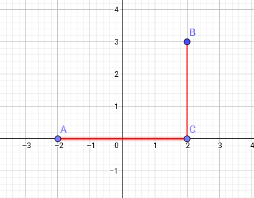
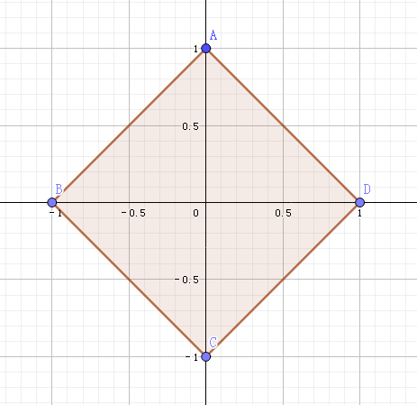
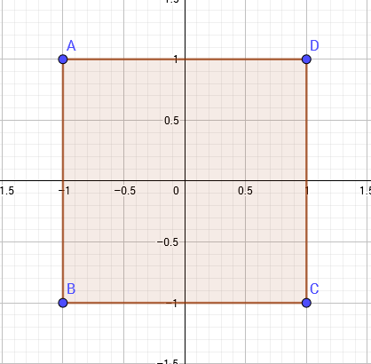

本文只讨论二维空间中的曼哈顿距离与切比雪夫距离

[回到顶部](https://www.cnblogs.com/zwfymqz/p/8253530.html#_labelTop)

## 曼哈顿距离

### 定义

设平面空间内存在两点，它们的坐标为(*x*1,*y*1)

，(*x*2,*y*2)

则*d**i**s*=|*x*1−*x*2|+|*y*1−*y*2|

即两点横纵坐标差之和

### 煮个栗子

如图所示，图中*A*,*B*

两点的曼哈顿距离为*A**C*+*B**C*=4+3=7

 

[回到顶部](https://www.cnblogs.com/zwfymqz/p/8253530.html#_labelTop)

## 切比雪夫距离

### 定义

设平面空间内存在两点，它们的坐标为(*x*1,*y*1)

，(*x*2,*y*2)

则*d**i**s*=*m**a**x*(|*x*1−*x*2|,|*y*1−*y*2|)

即两点横纵坐标差的最大值

### 再煮个栗子

*d**i**s*=*m**a**x*(*A**C*,*B**C*)=*A**C*=4

 

[回到顶部](https://www.cnblogs.com/zwfymqz/p/8253530.html#_labelTop)

## 两者之间的关系

两者的定义看上去好像毛线关系都没有，但实际上，这两种距离可以**相互转化**！

我们考虑最简单的情况，在一个二维坐标系中，设原点为(0,0)

如果用曼哈顿距离表示，则与原点距离为1

的点会构成一个边长为2–√

的正方形

 

 

如果用切比雪夫距离表示，则与原点距离为1

的点会构成一个边长为2

的正方形

 

 

仔细对比这两个图形，我们会发现这两个图形长得差不多，他们应该可以通过某种变换互相转化。

事实上,

将一个点(*x*,*y*)

的坐标变为(*x*+*y*,*x*−*y*)

后,原坐标系中的曼哈顿距离 =

 新坐标系中的切比雪夫距离

将一个点(*x*,*y*)

的坐标变为(*x*+*y*2,*x*−*y*2)

 后,原坐标系中的切比雪夫距离 =

 新坐标系中的曼哈顿距离

 

[回到顶部](https://www.cnblogs.com/zwfymqz/p/8253530.html#_labelTop)

## 用处

切比雪夫距离在计算的时候需要取*m**a**x*

，往往不是很好优化，对于一个点，计算其他点到该的距离的复杂度为*O*(*n*)

而曼哈顿距离只有求和以及取绝对值两种运算，我们把坐标排序后可以去掉绝对值的影响，进而用前缀和优化，可以把复杂度降为*O*(1)

[例题](https://www.luogu.org/problemnew/show/P3964)

 

 

 

作者：[自为风月马前卒](https://www.cnblogs.com/zwfymqz/p/8253530.html)

个人博客[http://attack204.com//](http://attack204.com/)

出处：<http://zwfymqz.cnblogs.com/>

本文版权归作者和博客园共有，欢迎转载，但未经作者同意必须保留此段声明，且在文章页面明显位置给出原文连接，否则保留追究法律责任的权利。  
