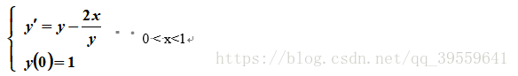
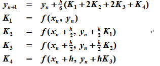
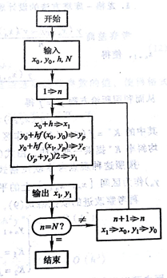
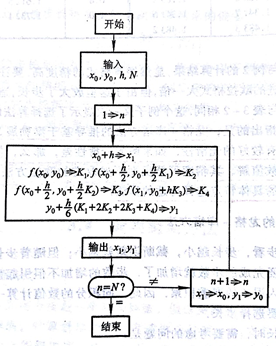
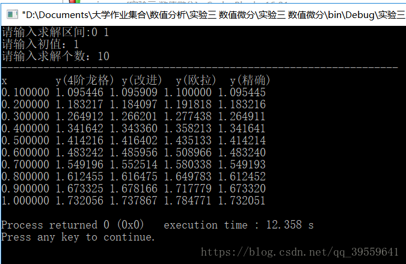

# 数值微分C++实现

    问题描述

取h=0.1时用Euler法，改进Euler法，Rung-Kutta方法求其数值解并与精确解进行比较。

输入：求解区间，初值，数值解个数

输出：数值解

    基本公式

改进欧拉公式：

 四阶龙格—库塔方法：

流程图

    

改进的欧拉方程 ：      

                       

四阶龙格—库塔方法：

    算法实现
    
    #include <iostream>
    #include <math.h>
    #include <iomanip>
     
    using namespace std;
     
    //定义系数C
    double C;
    //保存生成的节点横坐标
    double dataX[100];
    //保存生成的节点准确的纵坐标
    double dataY[100];
    //保存Euler的解
    double dataE[100];
    //保存改进Euler的解
    double dataIE[100];
    //保存Rung-Kutta方法求其数值解
    double dataRK[100];
    //定义原函数
    double function(double x,double y);
    //定义导函数
    double derivative(double x);
    //分割区间
    void devide(double a,double b,int N,double y);
    //定义用欧拉方法求解的函数
    void Euler(double a,double b,double n);
    //定义用改进欧拉方法求解的函数
    void improveEuler(double a,double b,double n);
    //定义四阶龙格-库塔方法求解的函数
    void RungKutta(double a,double b,double n);
    //打印表格
    void printTable(double n);
     
    int main()
    {
        //定义左右区间端点
        double a ,b;
        //定义初值
        double y;
        //定义数值解的个数
        int n;
        cout<<"请输入求解区间:";
        cin>>a>>b;
        cout<<"请输入初值：";
        cin>>y;
        cout<<"请输入求解个数：";
        cin>>n;
        //算出原函数的系数C
        C = (pow(y,2) - 2*a - 1)/(pow(M_E,2*a));
        devide(a,b,n,y);
        Euler(a,b,n);
        improveEuler(a,b,n);
        RungKutta(a,b,n);
        printTable(n);
        return 0;
    }
    //定义原函数
    double function(double x)
    {
        return sqrt(C*pow(M_E,2*x) + 2*x + 1);
    }
    //定义导函数
    double derivative(double x,double y)
    {
        return y - 2*x/y;
    }
     
    //分割区间
    void devide(double a,double b,int N,double y)
    {
        double x = a;
        double dX = (b - a) /(N) ;
        //x=0时，特殊处理
        dataX[0] = x;
        dataY[0] = y;
        for(int i=1;i<=N;i++)
        {
            x = a + i * dX;
            dataX[i] = x;
            dataY[i] = function(x);
        }
    }
    //定义用欧拉方法求解的函数
    void Euler(double a,double b,double n)
    {
        dataE[0] = dataY[0];
        for(int i=0;i<n;i++)
        {
            double value = dataE[i] + ((b-a)/n)*derivative(dataX[i],dataE[i]);
            dataE[i+1] = value;
        }
    }
    //定义用改进欧拉方法求解的函数
    void improveEuler(double a,double b,double n)
    {
        dataIE[0] = dataY[0];
        for(int i=0;i<n;i++)
        {
            //计算向前差商
            double Yp = dataIE[i] + ((b-a)/n)*derivative(dataX[i],dataIE[i]);
            //计算向后差商
            double Yc = dataIE[i] + ((b-a)/n)*derivative(dataX[i+1],Yp);
            dataIE[i+1] = 0.5 * (Yp + Yc);
        }
    }
    //定义四阶龙格-库塔方法求解的函数
    void RungKutta(double a,double b,double n)
    {
        dataRK[0] = dataY[0];
        for(int i=0;i<n;i++)
        {
            double K1 = derivative(dataX[i],dataRK[i]);
            double middleX = (dataX[i] + dataX[i+1]) * 0.5;
            double K2 = derivative(middleX,dataRK[i]+ 0.5 * ((b - a)/n) * K1);
            double K3 = derivative(middleX,dataRK[i]+ 0.5 * ((b - a)/n) * K2);
            double K4 = derivative(dataX[i+1],dataRK[i] + ((b - a)/n) * K3);
            dataRK[i+1] = dataRK[i] + (1.0/6) * ((b - a)/n) * (K1 + 2 * K2 + 2 * K3 + K4);
        }
    }
    //打印表格
    void printTable(double n)
    {
        cout<<"------------------------------------------------------------------"<<endl;
        cout<<"x        "<<"y(4阶龙格) "<<"y(改进)  "<<"y(欧拉)  "<<"y(精确)    "<<endl;
        for(int i=1;i<=n;i++)
        {
            cout<<setiosflags(ios::fixed);
            cout<<setprecision(6)<<dataX[i]<<" "<<dataRK[i]<<" "<<dataIE[i]<<" "<<dataE[i]<<" "<<dataY[i]<<endl;
        }
    }

    运行截图

---------------------

作者：仁者乐山智者乐水 
来源：CSDN 
原文：https://blog.csdn.net/qq_39559641/article/details/81050845 
版权声明：本文为博主原创文章，转载请附上博文链接！
