# 平面方程(Plane Equation)

 

原文链接：<http://www.songho.ca/math/plane/plane.html>

翻译：罗朝辉 (<http://www.cnblogs.com/kesalin/>)

本文遵循“[署名-非商业用途-保持一致](http://creativecommons.org/licenses/by-nc-sa/2.5/cn/)”创作公用协议

**平面方程**

 **平面上的一点以及垂直于该平面的法线唯一定义了 3D 空间的一个平面。**

 
 (图一) 3D 空间的平面

 

在图一中，给定法线向量  ，以及平面上的一点 P1，对于平面上的任意一点 P ，我们可以在平面上定义一个由 P1 指向 P 的向量：

​                        
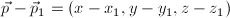

因为法线  垂直于平面，它必定也垂直于位于平面上的向量 
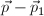，因此它们的点积为 0 ：

​                        
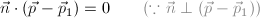

以上就是**平面方程的向量形式**，下面我们来看代数形式的，通过点积计算，我们得到：

​                        

​      如果我们用 
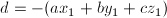 来替代上面表达式中的常数部分，就得到**平面方程的代数形式**：

​                                                                         

### 原点到平面的距离

**如果法线是归一化的，那么平面方程中的常数表达式 d 就是原点到平面的距离。**

 
 （图二）平面和归一化法线

如图二中，给定归一化法线向量 (a1, b1, c1)，以及平面上的一点 P1 (*D*a1, *D*b1, *D*c1)，我们来推导原点到平面的距离 *D*。 将法线向量(a1, b1, c1) 和点 P1 代入平面方程，得到：

​                 
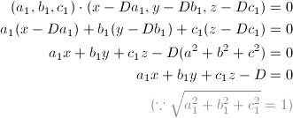

因此，我们可以用标准平面方程除以法线的模（法线长度）来计算原点到平面的距离。举个例子，原点到以 (1, 2, 2) 为法线的平面（x + 2y + 2z - 6 = 0）的距离为 2，计算过程如下：

​                                                                         
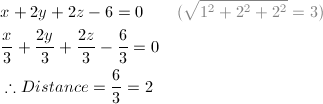

### 任意点到平面的距离

 
 (图三) 任意点到平面的距离

如图三中，我们来推导空间中任意一点 P2 到平面的距离 D 的计算公式。P2 到平面的距离等于由 P1 指向 P2 的向量 
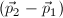在法线向量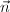 上的投影。我们用点积来计算投影距离 D ：

​            
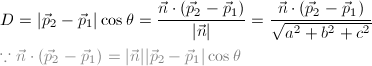

展开分子 
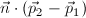 ：

​            
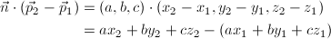

 

代入前面的距离公式，得到最终的**点到平面的距离公式**：

​            

 

观察上面的式子，我们就可以发现距离 D 是将点 P2 代入平面方程中，再除以法线的模得到的。举个例子，点(-1, -2, -3)到平面 x + 2y + 2z - 6 = 0 的距离为：

​                                                                  
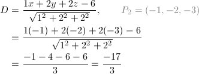

注意：距离是有符号的！它可以为负值，我们可以通过这个符号来决定点位于平面的哪一边(D > 0，点在平面的正面-法线指向那一边；D < 0，带在平面的反面-法线相反方向的那一边，当然 D = 0 就是在平面上啦！)。
