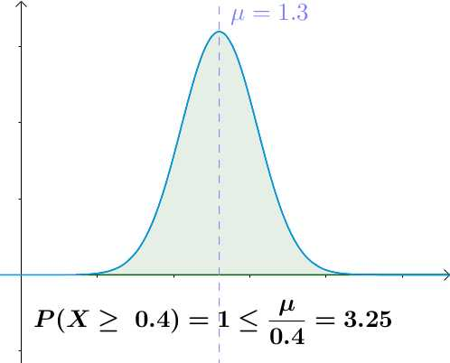
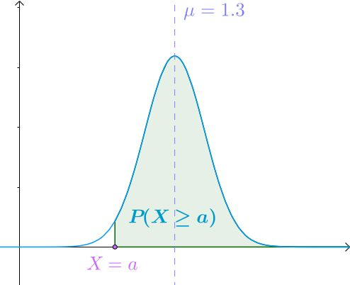
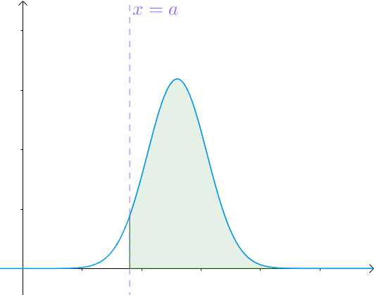
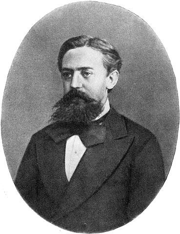
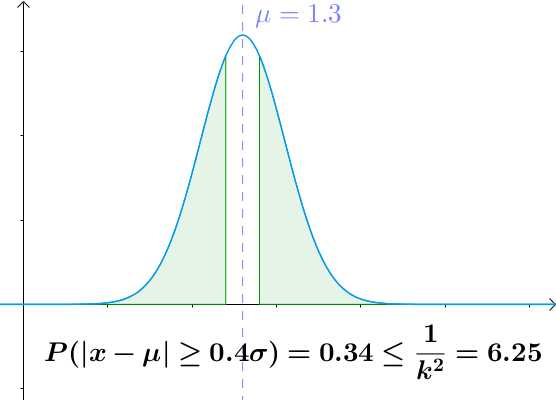
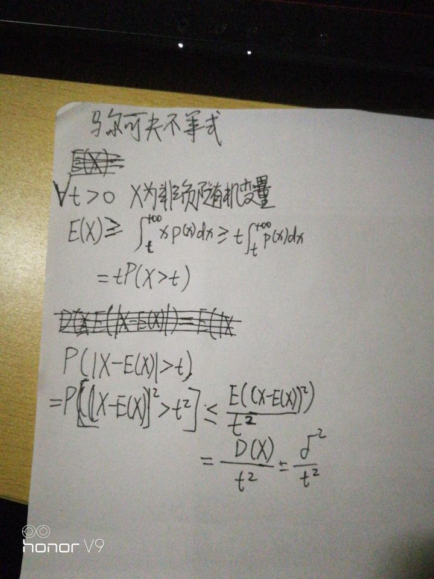



# 切比雪夫不等式

描述了这样一个事实，事件大多会集中在平均值附近。

比如，假设中国男人平均身高1.7m，那么不太可能出现身高17m的巨人。事实上我们从来没有见过这种“怪物”。

下面结合一个热门话题：“年薪百万”来讲解一下。

站在知乎一眼望去，似乎年薪百万的人到处都是，而且经常有人会提出“怎样才能年薪百万”这样的问题。

我们从数学的角度来解答一下，年薪百万难不难？

1 马尔科夫不等式

切比雪夫不等式是马尔科夫不等式的特殊情况，所以我们先来看看马尔科夫不等式。

1.1 马尔科夫不等式与直观感受

马尔科夫不等式是这么写的（本文代数只讨论离散的情况）：

其中 

。

我们通过 

的正态分布解释下，首先， 

就是指的是曲线下

部分的面积：

来感受一下马尔科夫不等式：

可见，越大于平均值，概率越低。

1.2 马尔科夫不等式与年薪百万

看看这个怎么去计算百万年薪的概率。

我随便搜索了下，查到以下数据：

- 中国人均收入：7900美元（      [来源](https://link.zhihu.com/?target=https%3A//zh.wikipedia.org/wiki/%25E5%2590%2584%25E5%259B%25BD%25E4%25BA%25BA%25E5%259D%2587%25E5%259B%25BD%25E6%25B0%2591%25E6%2580%25BB%25E6%2594%25B6%25E5%2585%25A5%25E5%2588%2597%25E8%25A1%25A8%23.E5.9C.8B.E5.AE.B6.E5.92.8C.E5.9C.B0.E5.8D.80.E5.88.97.E8.A1.A8) ）
- 珠三角人均GDP标准差：44000元（      [来源](https://link.zhihu.com/?target=http%3A//www.sohu.com/a/158544770_481785)中说这是方差，我严重怀疑这是标准差）

人均收入的标准差，我确实查不到。至少免费的我没有查到，有哪位同学知道望告知。

咱们就用上面的数据近似一下，粗糙的认为：

- 中国人均收入 

：51350元

- 人均收入的标准差 

：44000元

好，开始我们的计算。根据马尔科夫不等式：

也就是说，最多在20个人中有一个。

全国985院校的录取率是低于 

的，看起来似乎基本上能进入985，就能年薪百万（如果我们认为收入和教育程度正相关的话）。

是吗？似乎看起来比例比我想象的更高啊。

1.3 马尔科夫不等式的证明

证明的方式很多，我找了一种我觉得容易理解的方式，不过不是很严格，大家权且当作一种证明思路的说明吧。

试证： 

下面的证明虽然是用正态分布来演示的，但是实际是与分布无关的。

之前我们说过， 

就是指的是曲线下 

部分的面积：

要扩大这部分面积很简单，就是让曲线 

的部分变得“高”一些，至于 

的部分嘛，怎么变化完全没有关系，反正这部分和计算面积没有关系：

很显然， 

是小于扩大后的面积的。

通过什么数学方式让 

的部分变得“高”一些呢？

根据下图：

我们很容易得到：

那问题就很简单了，乘上 

：

根据期望的定义有：

显然：

因此有：

综上，得到要证的目标：

其中 

。

2 切比雪夫不等式

切比雪夫不等式是马尔科夫不等式的特殊情况，而且还有进一步的关系：这两个不等式的作者是师生关系。

安德雷·马尔可夫

马尔科夫不等式是以俄国数学家安德雷·马尔可夫命名的。

巴夫尼提·列波维奇·切比雪夫

而切比雪夫不等式是以马尔科夫的老师巴夫尼提·列波维奇·切比雪夫命名的。

2.1 切比雪夫不等式与直观感受

切比雪夫不等式是这么写的：

其中 

， 

是期望， 

是标准差。

我们还是通过 

的正态分布来感受一下切比雪夫不等式：

可见，越远离平均值，概率越低。

2.2 切比雪夫不等式与年薪百万

根据之前的数据，我们来算下切比雪夫认为年薪百万的概率是多少？

晕倒，切比雪夫认为最多只有千分之二的概率，比之前大大降低。

应该说切比雪夫不等式预测的准确率要远远高于马尔科夫不等式。

2.3 切比雪夫不等式的证明

马尔科夫不等式是这样的：

我们把 

代入：

很显然等价于：

令 

，容易得到 

：

3 总结

如果我们把人群的收入分布计算出来，我估计应该是个正态分布，那么年入百万的概率就更低了，知乎有人算出来是 [万分之四](https://zhihu.com/question/21809313/answer/62418816) 。

所以马尔科夫不等式、切比雪夫不等式只是对概率的一个估计，有可能不是很准确，但总比瞎想要准确。

百万年薪固然很难，但是根据 [贝叶斯定理](https://www.zhihu.com/question/19725590/answer/217025594) ，或许增加一些条件，可以大大增加概率：

- 接受好的教育，不能就读名校也没有关系，现在网上公开课的资源也很好
- 勤奋、并有明确的目标
- 要有耐心，数据显示，40左右慢慢达到人生的收入巅峰
- .....
- 跟着马同学，看图学

