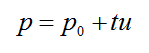
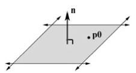
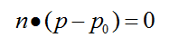
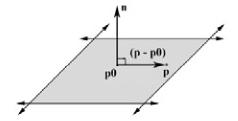
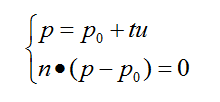
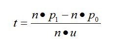

##  			[射线与平面的相交检测(Ray-Plane intersection test)](https://www.cnblogs.com/graphics/archive/2009/10/17/1585281.html) 		

# 射线的定义

在欧几里德几何中，射线的定义是：直线上一点和它一旁的部分。由此可知，射线有两个性质，一是只有一个端点，二是一端无限延伸。

# 射线的参数方程

其中p0是射线的起点， u是射线的方向向量，t >= 0，根据t的取值不同，可得射线上不同的点，所有这些点便构成了整个射线，如图

# 平面的定义

平面可以由法向量和平面内的一点来确定，因为过一点，有且只有一个平面与已知直线垂直

# 平面的参数方程

其中n是平面的法向量，p0是已知的平面内一点，符号●表示 点积，因n与平面垂直，所以n与平面内任意直线垂直， 而(p-p0)则是平面内的一个向量，所以n与 (p-p0)垂直，而互相垂直的向量其点积为0，见下图

 

向量的点积公式

#    射线与平面的交点 

有了射线和平面的参数方程，那么求二者的交点相当于解下面的方程组

注意这里两个方程中的p0是不同的，为区别彼此，将平面方程中的p0改为p1，并将射线方程代入平面方程，整理得到

若t >= 0， 则射线与平面相交，且交点为p0 + tu，若t < 0，则不相交。（注意这里，n不可约去，因为做的是点积，而不是普通乘法）  
