##  			[射线和三角形的相交检测（ray triangle intersection test）](https://www.cnblogs.com/graphics/archive/2010/08/09/1795348.html) 		

本文以[Fast, Minimum Storage Ray Triangle Intersection](http://www.cs.virginia.edu/~gfx/Courses/2003/ImageSynthesis/papers/Acceleration/Fast%20MinimumStorage%20RayTriangle%20Intersection.pdf)为参考，在此感谢原作者，大家也可以直接阅读原版。

# 概述

射线和三角形的相交检测是游戏程序设计中一个常见的问题，最典型的应用就是拾取(Picking)，本文介绍一个最常见的方法，这个方法也是DirectX中采用的方法，该方法速度快，而且存储空间少。先讲述理论，然后给出对应的代码实现。


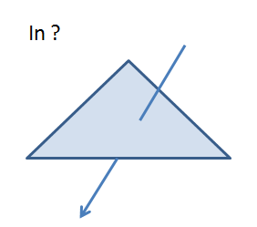
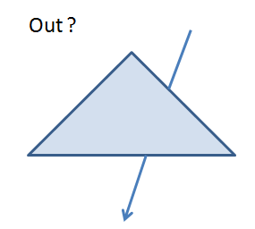

# 理论部分

## 一个直观的方法

我想大多数人在看到这个问题时，可能都会想到一个简单而直观的方法：首先判断射线是否与三角形所在的平面相交，如果相交，再判断交点是否在三角形内。

[判断射线是否与平面相交](http://www.cnblogs.com/graphics/archive/2009/10/17/1585281.html)

[判断点是否在三角形内](http://www.cnblogs.com/graphics/archive/2010/08/05/1793393.html)

但是，上面的方法效率并不很高，因为需要一个额外的计算，那就是计算出三角形所在的平面，而下面要介绍的方法则可以省去这个计算。

## 本文的方法

接下来会涉及到一些数学知识，不过没关系，我会详细解释每一个步骤，不至于太晦涩，只要您不觉得烦就行了，好了开始！

射线的参数方程如下，其中O是射线的起点，D是射线的方向。


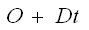

我们可以这样理解射线，一个点从起点O开始，沿着方向D移动任意长度，得到终点R，根据t值的不同，得到的R值也不同，所有这些不同的R值便构成了整条射线，比如下面的射线，起点是P0，方向是u，p0 + tu也就构成了整条射线。


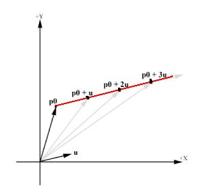

三角形的参数方程如下，其中V0，V1和V2是三角形的三个点，u, v是V1和V2的权重，1-u-v是V0的权重，并且满足u>=0, v >= 0,u+v<=1。


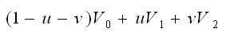

确切的说，上面的方程是三角形及其内部所有点的方程，因为三角形内任意一点都可以理解为从顶点V0开始，沿着边V0V1移动一段距离，然后再沿着边V0V2移动一段距离，然后求他们的和向量。至于移动多大距离，就是由参数u和v控制的。


于是，求射线与三角形的交点也就变成了解下面这个方程-其中t,u,v是未知数，其他都是已知的


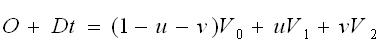

移项并整理，将t,u,v提取出来作为未知数，得到下面的线性方程组


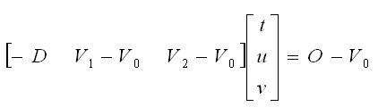

现在开始解这个方程组，这里要用到两个知识点，一是克莱姆法则，二是向量的混合积。

令E1 = V1 - V0，E2 = V2 - V0，T = O - V0上式可以改写成


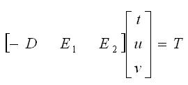

根据克莱姆法则，可得到t,u,v的解分别是


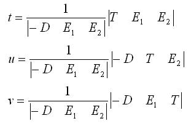

将这三个解联合起来写就是


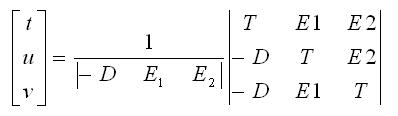

根据混合积公式


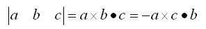

上式可以改写成


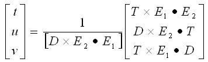

令


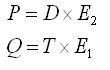

得到最终的公式，这便是下面代码中用到的最终公式了，之所以提炼出P和Q是为了避免重复计算


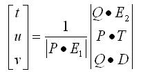

# 代码部分

理论部分阐述完毕，开始上代码，这份代码来自DirectX  SDK中的Demo，名字叫做Picking(拾取)，该函数位于文件Pick.cpp的最末尾。这个函数有一个特点，就是判断语句特别多，因为对于一个频繁被调用的函数来说，效率是最重要的，这么多判断就是为了在某个条件不满足时，及时返回，避免后续不必要的计算。

[](javascript:void(0);)

```
 1 // Determine whether a ray intersect with a triangle
 2 // Parameters
 3 // orig: origin of the ray
 4 // dir: direction of the ray
 5 // v0, v1, v2: vertices of triangle
 6 // t(out): weight of the intersection for the ray
 7 // u(out), v(out): barycentric coordinate of intersection
 8 
 9 bool IntersectTriangle(const Vector3& orig, const Vector3& dir,
10     Vector3& v0, Vector3& v1, Vector3& v2,
11     float* t, float* u, float* v)
12 {
13     // E1
14     Vector3 E1 = v1 - v0;
15 
16     // E2
17     Vector3 E2 = v2 - v0;
18 
19     // P
20     Vector3 P = dir.Cross(E2);
21 
22     // determinant
23     float det = E1.Dot(P);
24 
25     // keep det > 0, modify T accordingly
26     Vector3 T;
27     if( det >0 )
28     {
29         T = orig - v0;
30     }
31     else
32     {
33         T = v0 - orig;
34         det = -det;
35     }
36 
37     // If determinant is near zero, ray lies in plane of triangle
38     if( det < 0.0001f )
39         return false;
40 
41     // Calculate u and make sure u <= 1
42     *u = T.Dot(P);
43     if( *u < 0.0f || *u > det )
44         return false;
45 
46     // Q
47     Vector3 Q = T.Cross(E1);
48 
49     // Calculate v and make sure u + v <= 1
50     *v = dir.Dot(Q);
51     if( *v < 0.0f || *u + *v > det )
52         return false;
53 
54     // Calculate t, scale parameters, ray intersects triangle
55     *t = E2.Dot(Q);
56 
57     float fInvDet = 1.0f / det;
58     *t *= fInvDet;
59     *u *= fInvDet;
60     *v *= fInvDet;
61 
62     return true;
63 }
```

[](javascript:void(0);)

## 参数说明

输入参数：前两个参数orig和dir是射线的起点和方向，中间三个参数v0，v1和v2是三角形的三个顶点。 

输出参数：t是交点对应的射线方程中的t值，u，v则是交点的纹理坐标值

## 代码说明

变量的命名方式：为了方便阅读，代码中的变量命名与上面公式中的变量保持一致，如E1，E2，T等。

变量det表示矩阵的行列式值

27-35行用来确保det>0，如果det<0则令det = -det，并对T做相应的调整，这样做是为了方便后续计算，否则的话需要分别处理det>0和det<0两种情况。

第38行，注意浮点数和0的比较，一般不用 == 0的方式，而是给定一个Epsilon值，并与这个值比较。

第43行，这里实际上u还没有计算完毕，此时的值是Dot(P,T)，如果Dot(P,T) > det, 那么u > 1，无交点。

第51行，要确保u + v <= 1，也即 [Dot(P,T) + Dot(Q, D)] / det 必须不能大于1，否则无交点。

第57-60行，走到这里时，表明前面的条件都已经满足，开始计算t, u, v的最终值。

## 交点坐标

根据上面代码求出的t,u,v的值，交点的最终坐标可以用下面两种方法计算

O + Dt

(1 - u - v)V0 + uV1 + vV2

# 后记

在本文开头已经说了，射线和三角形的相交检测最典型的应用就是拾取，比如在一个三维场景中用鼠标选择某个物体。那么拾取是如何实现的呢？我们知道在物体的三维模型表示中，三角形是最小的几何图元，最小意味着不可再分，也就是说任何模型，无论它多么复杂，都可以由若干个三角形组合而成。拾取过程实际是判断拾取射线是否与模型相交，而这又可以转化为-只要射线与模型中的任何一个三角形相交即可。下面是模型的线框表示法，可见如果想要判断某条射线是否与这个茶壶相交，只要判断该射线是否与茶壶模型中某个三角形相交即可。


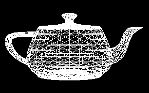

需要注意的是，虽然射线和三角形的相交检测可以用来实现拾取，但是大多数程序并不采用这个方法，原因是这个方法效率很低，我们可以设想，一个大型的3D在线游戏，它的模型数量以及复杂程度都是很高的，如果用这种方法来判断，需要对模型中每个三角形都做一次判断，效率极其低下，一种可行的方案是，用包围球或者包围盒来代替，计算出能容纳模型的最小球体或者矩形体，只要判断出射线与包围球或者包围盒相交，我们就认为射线与模型相交，这样效率会显著提高，只是精确度上会有一定误差，但是足以满足多数程序的需要。


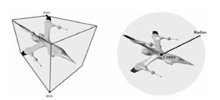

 

Happy Coding

== The End ==
