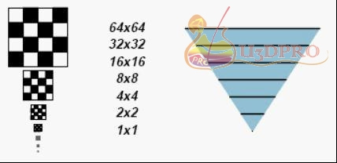
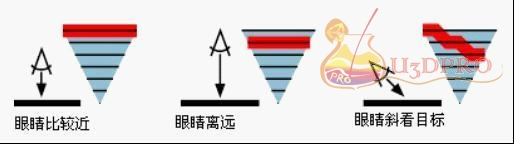

MIPMap

2019年1月17日 星期四

10:01

 

[**MipMap**](http://www.cppblog.com/wc250en007/archive/2011/08/06/152653.html)

首先从MIPMAP的原理说起，它是把一张贴图按照2的倍数进行缩小。直到1X1。把缩小的图都存储起来。在渲染时，根据一个像素离眼睛为之的距离，来判断从一个合适的图层中取出texel颜色赋值给像素。在D3D和OGL都有相对应的API控制接

口

 

透过它的工作原理我们可以发现，硬件总是根据眼睛到目标的距离，来玄奇最适合当前屏幕像素分辨率的图层。假设一张32768x32768的mipmap贴图，当前屏幕分辨率为1024*1024。眼睛距离物体比较近时，mipmap最大也只可能从1024*1024的Mipmap图层选取texel。再次，当使用三线性过滤（trilinear）时，最大也只能访问2048*2048的图层选取texel，来和1024*1024图层中的像素进行线性插值。

 

为了加快渲染速度和减少图像锯齿，贴图被处理成由一系列被预先计算和优化过的图片组成的文件,这样的贴图被称为 MIP map 或者 mipmap

 

 

多级渐进纹理由一组分辨率逐渐降低的纹理序列组成，每一级纹理宽度和高度都是上一级纹理宽度和高度的一半。宽和高不一定相等，也就是说，这些纹理不一定都是正方形。

Direct3D在纹理映射时，自动选择一幅与物体大小最接近的纹理进行渲染。当物体离投影平面较远时，Direct3D会选择一张尺寸较小、分辨率较低的纹理进行渲染；当物体离投影平面较近时，Direct3D会选择一张尺寸较大、分辨率较高的纹理进行渲染。Direct3D将纹理序列看成一条多级渐进纹理链。链头处纹理的分辨率最高，下一级往后依次递减，链尾处纹理的分辨率最低。

Direct3D能估计出多级渐进纹理链中哪幅纹理的分辨率最接近想要的输出结果，然后它将像素映射到纹理空间。当最终显示的图形大小介于任意两级纹理图形之间时，Direct3D将两级纹理的相应元素进行混合后显示。

多级渐进纹理过滤能够有效地提高图形渲染速度，当物体离投影平面较远时，Direct3D会选择一张尺寸较小的纹理进行渲染，而无需经过复杂的诸如各项异性纹理过滤，并且由于这时纹理需要的显存比不使用多级渐进纹理时小，因此能有效地减少纹理载入显存的时间。缺点是对内存的要求比较高

 

**设置多级渐进纹理过滤方式**

当最终显示的纹理贴图大小介于任意两级纹理之间时，Direct3D能够取得两级纹理元素进行混合后显示，具体的混合方式由指定的多级渐进纹理过滤方式决定。可以调用函数IDirect3DDevice9::SetSamplerState()设置多级渐进纹理过滤方式，将第一个参数设为纹理层序号，第二个参数设为D3DSAMP_MIPFILTER表示多级渐进纹理过滤，第三个参数设为在相邻纹理级之间的过滤方式，可取枚举类型D3DTEXTUREFILTERTYPE的任意值。下面的示例代码设置相邻纹理级之间的过滤方式为线性过滤。

g_device->SetSamplerState(0, D3DSAMP_MIPFILTER, D3DTEXF_LINEAR);

如果将第三个参数设为D3DTEXF_NONE，那么就会一直使用最高一级的纹理，即禁用多级渐进纹理过滤。如果将其设为D3DTEXF_POINT，就会只使用与图元大小最匹配的一级纹理。如果将其设为D3DTEXF_LINEAR，Direct3D就将与图元大小最匹配的两级纹理以线性方式混合。

需要注意的是，多级纹理过滤是缩小和放大过滤器的结合。例如，如果将缩小和方法过滤器设为线性过滤，但是多级纹理过滤方式设为最近点采样，Direct3D就会选择与要显示的纹理贴图大小最接近的纹理级别，在该级纹理上完成双线性纹理过滤，并将结果作为像素的值。如果将缩小、放大过滤器和多级渐进纹理都设置为线性过滤，则Direct3D就会在两个最接近的纹理级别上都进行双线性纹理过滤，然后再对相邻两级纹理图形上对应的两个纹理颜色进行加权平均，最后的结果作为单个像素值。这种为了图元中的一个像素，而结合了两幅纹理，共8个像素的技术，称为“三线性过滤”，因为它在纹理的三个方向----u、 v和纹理级别上都进行了线性过滤。

可以通过IDirect3DDevice9::SetSamplerState()函数设置实际渲染时纹理过滤的最大级数，其中需要将第二个参数设为D3DSAMP_MAXMIPLEVEL，第三个参数设为实际渲染时纹理过滤的最大级数。下面的示例代码设置纹理层0的最大多级纹理过滤级数为16。

g_device->SetSamplerState(0, D3DSAMP_MAXMIPLEVEL, 16);

还可以通过将IDirect3DDevice9::SetSamplerState()的第二个参数设为D3DSAMP_MIPMAPLODBIAS，设置多级纹理映射级数偏移值。如果对某个纹理映射设置正偏移值，得到的图形结果就会比原来的更清晰，但锯齿更多；反之设为负偏移值，得到的图形结果就会更模糊。

代码：[实例下载](http://www.cppblog.com/Files/wc250en007/D3D/TextQuad%E7%BA%B9%E7%90%86%E6%98%A0%E5%B0%84.rar)

 

来自 <<http://www.cppblog.com/wc250en007/archive/2011/08/06/152653.html>> 
