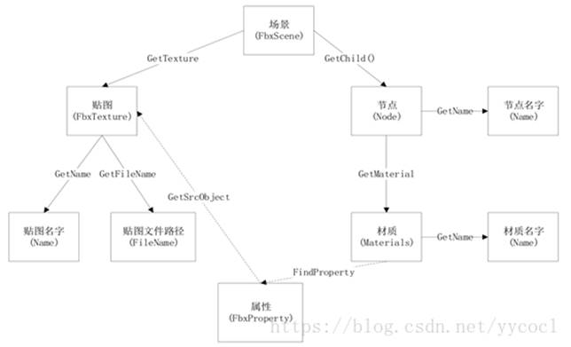

（原)   **FBX** **解析 材质与贴图**

2018年11月22日 星期四

9:46

@author: 黑袍小道

 

本文采用 AUTODESK的FBX SDK来解析fbx文件，使用语言为python。

 

   下面结合代码解析出fbx文件中的材质与贴图，以及简单介绍涉及到的类的关系。

 

 

## 1.sdk中的一些基本概念

   FbxScene

   该类包含了整个3D场景的描述。对文件进行解析时，要先获得场景对象，然后在解析该对象里的内容。

   FbxObject

   大多数FBX对象的基类。对象之间通过connections进行连接。通过连接，对象间相互关联以形成层次结构或结构。即fbx的场景中对象的关系都表示为对象的连接。

   FbxObject提供了Property（属性）这种机制来描述场景中对象的特征。

   FbxProperty

   用来保存属性的类

   ClassID

   用于在运行时区分对象的内部类。每个类都有唯一的ClassId

 

## 2.解析fbx文件

   下面是本次解析内容（mesh的名字，材质名称，贴图名称，材质贴图引用关系）的的关系结构图：

 

 

1）加载scene

 

lSdkManager,lScene = InitializeSdkObjects()

LoadScene(lSdkManager,lScene,"xxx.FBX")

1

2

2）获取节点node以及名字

   scene中包含了所有node中的root节点。

 

rootNode = pScene.GetRootNode()

1

   node之间通过树状结构连接，通过 GetChild() 与递归即可获得所有node

 

if rootNode:

for i inrange(rootNode.GetChildCount()):

ChildNode = rootNode.GetChild(i)

if ChildNode:

AllNodes.append(ChildNode)

FindChildNodes(AllNodes,ChildNode)

   获取node名字

 

lNode.GetName()

1

3）获取材质Material以及名字

   获取材质

 

NodeMaterial = lNode.GetMaterial(0)

1

   获取材质名字

 

NodeMaterial.GetName()

1

4）获取贴图Texture以及文件路径

 

   贴图可以直接从scene中获得

 

tex_num = lScene.GetTextureCount()

\#print(tex_num)

for i inrange(tex_num):

tex = lScene.GetTexture(i)

1

2

3

4

   贴图文件路径

 

path = tex.GetFileName()

1

5）获取材质，贴图关系

   根据材质拥有的属性去获取相应的关系

 

\#DiffuseTextures

lProperty = pMaterial.FindProperty(FbxSurfaceMaterial.sDiffuse)

 

\#BumpTextures

lProperty = pMaterial.FindProperty(FbxSurfaceMaterial.sBump)

1

2

3

4

5

   可以通过关系去获取相应材质

 

num_textures = pProperty.GetSrcObjectCount(FbxCriteria.ObjectType(FbxTexture.ClassId))

texture = pProperty.GetSrcObject(FbxCriteria.ObjectType(FbxTexture.ClassId),i)

\--------------------- 

作者：yycocl 

来源：CSDN 

原文：https://blog.csdn.net/yycocl/article/details/82945608 

版权声明：本文为博主原创文章，转载请附上博文链接！
