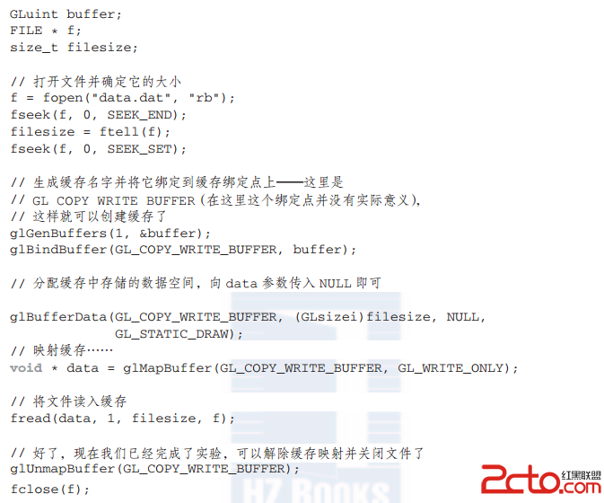
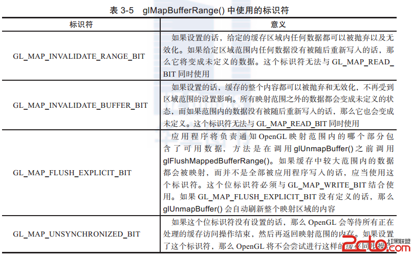

# GLES --访问缓存的内容

目前为止，在这一节当中给出的所有函数（glBufferData()、glBufferSubData()、glCopyBufferSubData()和glGetBufferSubData()）都存在同一个问题，就是它们都会导致OpenGL进行一次数据的拷贝操作。glBufferData()和glBufferSubData()会将应用程序内存中的数据拷贝到OpenGL管理的内存当中。显而易见glCopyBufferSubData()会将源缓存中的内容进行一次拷贝。glGetBufferSubData()则是将OpenGL管理的内存中的数据拷贝到应用程序内存中。根据硬件的配置，其实也可以通过获取一个指针的形式，直接在应用程序中对OpenGL管理的内存进行访问。当然，获取这个指针的对应函数就是glMapBuffer()。
 

void* glMapBuffer(GLenum target, GLenum access);
 

将当前绑定到target的缓存对象的整个数据区域映射到客户端的地址空间中。之后可以根据给定的access策略，通过返回的指针对数据进行直接读或者写的操作。如果OpenGL无法将缓存对象的数据映射出来，那么glMapBuffer()将产生一个错误并且返回NULL。发生这种情况的原因可能是与[系统](https://www.2cto.com/os/)相关的，比如可用的虚拟内存过低等。
 

当我们调用glMapBuffer()时，这个函数会返回一个指针，它指向绑定到target的缓存对象的数据区域所对应的内存。注意这块内存只是对应于这个缓存对象本身—它不一定就是图形处理器用到的内存区域。access参数指定了应用程序对于映射后的内存区域的使用方式。它必须是表3-4中列出的标识符之一。
 

 

如果glMapBuffer()无法映射缓存对象的数据，那么它将返回NULL。access参数相当于用户程序与OpenGL对内存访问的一个约定。如果用户违反了这个约定，那么将产生很不好的结果，例如写缓存的操作将被忽略，数据将被破坏，甚至用户程序会直接崩溃。
 

　当你要求映射到应用程序层面的数据正处于无法访问的内存当中，OpenGL可能会被迫将数据进行移动，以保证能够获取到数据的指针，也就是你期望的结果。与之类似，当你完成了对数据的操作，以及对它进行了修改，那么OpenGL将再次把数据移回到图形处理器所需的位置上。这样的操作对于性能上的损耗是比较高的，因此必须特别加以对待。
 

如果缓存已经通过GL_READ_ONLY或者GL_READ_WRITE访问模式进行了映射，那么缓存对象中的数据对于应用程序就是可见的。我们可以回读它的内容，将它写入磁盘文件，甚至直接对它进行修改（如果使用了GL_READ_WRITE作为访问模式的话）。如果访问模式为GL_READ_WRITE或者GL_WRITE_ONLY，那么可以通过OpenGL返回的指针向映射内存中写入数据。当结束数据的读取或者写入到缓存对象的操作之后，必须使用glUnmapBuffer()执行解除映射操作，它的原型如下所示：
 

GLboolean glUnmapBuffer(GLenum target);
 

解除glMapBuffer()创建的映射。如果对象数据的内容在映射过程中没有发生损坏，那么glUnmapBuffer()将返回GL_TRUE。发生损坏的原因通常与[系统](https://www.2cto.com/os/)相关，例如屏幕模式发生了改变，这会影响图形内存的可用性。这种情况下，函数的返回值为GL_FALSE，并且对应的数据内容是不可预测的。应用程序必须考虑到这种几率较低的情形，并且及时对数据进行重新初始化。
 

如果解除了缓存的映射，那么之前写入到OpenGL映射内存中的数据将会重新对缓存对象可见。这句话的意义是，我们可以先使用glBufferData()分配数据空间，并且在data参数中直接传递NULL，之后进行映射并且直接将数据写入，最后解除映射，从而完成了数据向缓存对象传递的操作。例3.2所示就是一个将文件内容读取并写入到缓存对象的例子。
 

例3.2　使用glMapBuffer()初始化缓存对象
 

 

在例3.2中，文件的所有内容都在单一操作中被读入到缓存对象当中。缓存对象创建时的大小与文件是相同的。当缓存映射之后，我们就可以直接将文件内容读入到缓存对象的数据区域当中。应用程序端并没有拷贝的操作，并且如果数据对于应用程序和图形处理器都是可见的，那么OpenGL端也没有进行任何拷贝的操作。
 

使用这种方式来初始化缓存对象可能会带来显著的性能优势。其理由如下：如果调用glBufferData()或者glBufferSubData()，当返回这些函数后，我们可以对返回的内存区域中的数据进行任何操作—释放它，使用它做别的事情—都是可以的。这也就是说，这些函数在完成后不能与内存区域再有任何瓜葛，因此必须采取数据拷贝的方式。但是，如果调用glMapBuffer()，它所返回的指针是OpenGL端管理的。当调用glUnmapBuffer()时，OpenGL依然负责管理这处内存，而用户程序与这处内存已经不再有瓜葛了。这样的话即使数据需要移动或者拷贝，OpenGL都可以在调用glUnmapBuffer()之后才开始这些操作并且立即返回，而内容操作是在系统的空闲时间之内完成，不再受到应用程序的影响。因此，OpenGL的数据拷贝操作与应用程序之后的操作（例如建立更多的缓存，读取别的文件，等等）实际上是同步进行的。如果不需要进行拷贝的话，那么结果就再好不过了！此时在本质上解除映射的操作相当于是对空间的释放。
 

异步和显式的映射
 

为了避免glMapBuffer()可能造成的缓存映射问题（例如应用程序错误地指定了access参数，或者总是使用GL_READ_WRITE），glMapBufferRange()函数使用额外的标识符来更精确地设置访问模式，glMapBufferRange()函数的原型如下所示：
 

void* glMapBufferRange(GLenum target, GLintptr offset, GLsizeiptr length, GLbitfield access);
 

将缓存对象数据的全部或者一部分映射到应用程序的地址空间中。target设置了缓存对象当前绑定的目标。offset和length一起设置了准备映射的数据范围（单位为字节）。access是一个位域标识符，用于描述映射的模式。
 

对于glMapBufferRange()来说，access位域中必须包含GL_MAP_READ_BIT和GL_MAP_WRITE_BIT中的一个或者两个，以确认应用程序是否要对映射数据进行读操作、写操作，或者两者皆有。此外，access中还可以包含一个或多个其他的标识符，如表3-5所示。
 

 

正如你在表3-5中看到的这些标识符所提示的，对于OpenGL数据的使用以及数据访问时的同步操作，这个命令可以实现一个更精确的控制过程。
 

如果打算通过GL_MAP_INVALIDATE_RANGE_BIT或者GL_MAP_INVALIDATE_BUFFER_BIT标识符来实现缓存数据的无效化，那么也就意味着OpenGL可以对缓存对象中任何已有的数据进行清理。除非你确信自己要同时使用GL_MAP_WRITE_BIT标识符对缓存进行写入操作，否则不要设置这两个标识符中的任意一个。如果你设置了GL_MAP_INVALIDATE_RANGE_BIT的话，你的目的应该是对某个区域的整体进行更新（或者至少是其中对你的程序有意义的部分）。如果设置了GL_MAP_INVALIDATE_BUFFER_BIT，那么就意味着你不打算再关心那些没有被映射的缓存区域的内容了。无论是哪种方法，你都必须通过标识符的设置来声明你准备在后继的映射当中对缓存中剩下的部分进行更新。由于此时OpenGL是可以抛弃缓存数据中剩余的部分，因此即使你将修改过的数据重新合并到原始缓存中也没有什么意义了。因此，如果打算对映射缓存的第一个部分使用GL_MAP_INVALIDATE_BUFFER_BIT，然后对缓存其他的部分使用GL_MAP_INVALIDATE_RANGE_BIT，那么应该是一个不错的想法。
 

GL_MAP_UNSYNCHRONIZED_BIT标识符用于禁止OpenGL数据传输和使用时的自动同步机制。没有这个标志符的话，OpenGL会在使用缓存对象之前完成任何正在执行的命令。这一步与OpenGL的管线有关，因此可能会造成性能上的损失。如果可以确保之后的操作可以在真正修改缓存内容之前完成（不过在调用glMapBufferRange()之前这并不是必须的），例如调用glFinish()或者使用一个同步对象（参见11.3节），那么OpenGL也就不需要专门为此维护一个同步功能了。
 

最后，GL_MAP_FLUSH_EXPLICIT_BIT标识符表明了应用程序将通知OpenGL它修改了缓存的哪些部分，然后再调用glUnmapBuffer()。通知的操作可以通过glFlushMappedBufferRange()函数的调用来完成，其原型如下：
 

**void glFlushMappedBufferRange(GLenum target, GLintptr offset, GLsizeiptr length);**

通知OpenGL，绑定到target的映射缓存中由offset和length所划分的区域已经发生了修改，需要立即更新到缓存对象的数据区域中。
 

我们可以对缓存对象中独立的或者互相重叠的映射范围多次调用glFlushMappedBufferRange()。缓存对象的范围是通过offset和length划分的，这两个值必须位于缓存对象的映射范围之内，并且映射范围必须通过glMapBufferRange()以及GL_MAP_FLUSH_EXPLICIT_BIT标识符来映射。当执行这个操作之后，会假设OpenGL对于映射缓存对象中指定区域的修改已经完成，并且开始执行一些相关的操作，例如重新激活数据的可用性，将它拷贝到图形处理器的显示内存中，或者进行刷新，数据缓存的重新更新等。就算缓存的一部分或者全部还处于映射状态下，这些操作也可以顺利完成。这一操作对于OpenGL与其他应用程序操作的并行化处理是非常有意义的。举例来说，如果需要从文件加载一个非常庞大的数据块并将他们送入缓存，那么需要在缓存中分配足够囊括整个文件大小的区域，然后读取文件的各个子块，并且对每个子块都调用一次glFlushMappedBufferRange()。然后OpenGL就可以与应用程序并行地执行一些工作，从文件读取更多的数据并且存入下一个子块当中。
 

通过这些标识符的不同混合方式，我们可以对应用程序和OpenGL之间的数据传输过程进行优化，或者实现一些高级的技巧，例如多线程或者异步的文件操作。