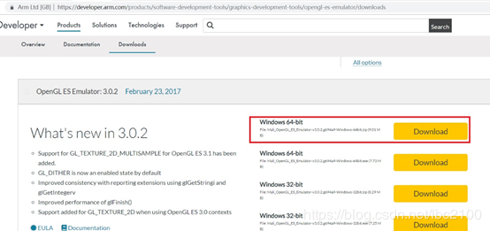
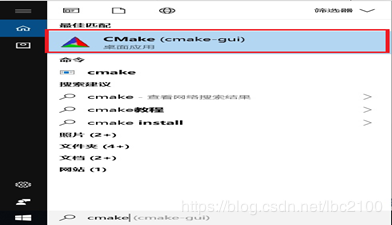
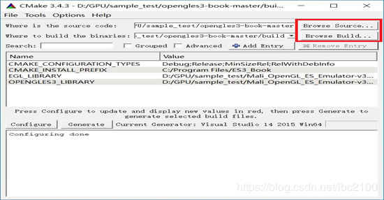
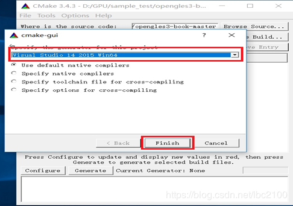
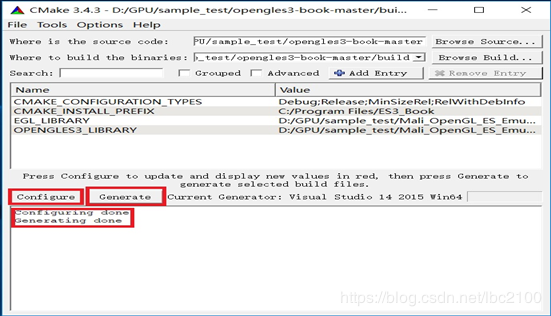
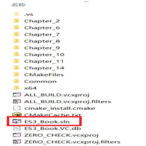
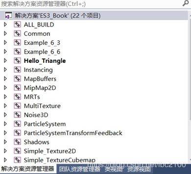
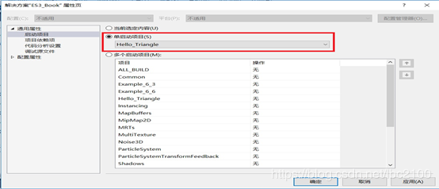
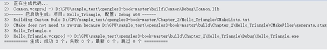
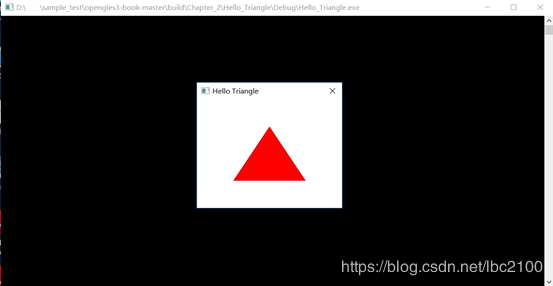

# opengl es3.0 仿真环境在win10上的搭建

已剪辑自: https://blog.csdn.net/lbc2100/article/details/86522724

参考：https://blog.csdn.net/msdb198901/article/details/77506165

https://blog.csdn.net/u010312436/article/details/82984322

**[1 ](https://blog.csdn.net/lbc2100/article/details/86522724)环境版本**

​    操作系统：win10 64bit

​    VS版本：2015

​    CMAKE版本：3.4.3

​    仿真库：Mali_OpenGL_ES_Emulator-v3.0.2.g694a9-Windows-64bit

   

**[2 ](https://blog.csdn.net/lbc2100/article/details/86522724)仿真库下载**

​     下载地址：https://developer.arm.com/products/software-development-tools/graphics-development-tools/opengl-es-emulator/downloads

​    进入下载页面后，选择Mali_OpenGL_ES_Emulator-v3.0.2.g694a9-Windows-64bit.zip,进行下载。如下图所示。

​    下载后解压Mali_OpenGL_ES_Emulator-v3.0.2.g694a9-Windows-64bit.zip，备用。

**[3 ](https://blog.csdn.net/lbc2100/article/details/86522724)下载《OPENGL ES 3.0编程指南》示例代码**

​    下载地址：https://codeload.github.com/danginsburg/opengles3-book/zip/master

​    下载完成成功后，会得到opengles3-book-master.zip。解压备用

 

[4 ](https://blog.csdn.net/lbc2100/article/details/86522724)通过cmake配置

**步骤1.** 新建sample_test目录

**步骤2.** 把opengles3-book-master目录和Mali_OpenGL_ES_Emulator-v3.0.2.g694a9-Windows-64bit目录复制到sample_test目录中。   

**步骤3.** 进入opengles3-book-master目录，在目录下新建build目录。

​    **步骤4.** 在win10的左下角【在这里输入你要搜索的内容】里输入cmake,出现Cmake应用，选择cmake-gui。如下图所示。

**步骤5.** 进入CMake界面，选择要编译的项目目录和建立目录，如图下图所示。

**步骤6.** 在界面的左下边点击【Configure】进行配置，选择Visual Studio 14 2015 Win64。点击【完成】。如下图所示

**步骤7.** 在界面的中间中间，配置EGL_LIBRARY和OPENGLES3_LIBRARY库，在EGL_LIBRARY后面配置库libEGL.lib，OPENGLES3_LIBRARY后面配置libGLESv2.lib。这两个库在Mali_OpenGL_ES_Emulator-v3.0.2.g694a9-Windows-64bit目录下。

**步骤8.** 在界面上点击【Generate】,正常情况，会出现配置成功。如下图所示。

**步骤9.** 检查配置是否成功，进入opengles3-book-master\build目录，查看存在有ES3_Book.sln VS2015工程文件表示成功。如下图所示。

 

**[5 ](https://blog.csdn.net/lbc2100/article/details/86522724)通过VS2015运行Hello_Triangle**

​    **步骤1.** VS2015以管理员身份运行，打开ES3_Book.sln解决方案如下图所示。

​    **步骤2.** 在【解方案’ES3_Book’】上单击右键，在启动项目的单启动项目选择Hello_Triangle。如下图所示。

​    **步骤3.** 在Hello_Triangle项目上单击右键，选择【生成】，如下图所示，表示生成成功。

**步骤4.** 点击【调试】-》【开始调试】，出现红色三角形，如下图所示。表示运行成功。

