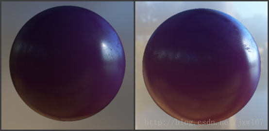
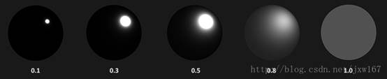
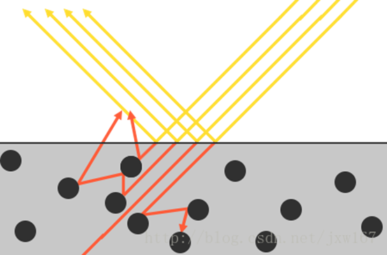

PBR，或者用更通俗一些的称呼是指基于物理的渲染(Physically Based Rendering)，它指的是一些在不同程度上都基于与现实世界的物理原理更相符的基本理论所构成的渲染技术的集合。正因为基于物理的渲染目的便是为了使用一种更符合物理学规律的方式来模拟光线，因此这种渲染方式与我们原来的Phong或者Blinn-Phong光照算法相比总体上看起来要更真实一些。除了看起来更好些以外，由于它与物理性质非常接近，因此我们（尤其是美术师们）可以直接以物理参数为依据来编写表面材质，而不必依靠粗劣的修改与调整来让光照效果看上去正常。使用基于物理参数的方法来编写材质还有一个更大的好处，就是不论光照条件如何，这些材质看上去都会是正确的，而在非PBR的渲染管线当中有些东西就不会那么真实了。 

虽然如此，基于物理的渲染仍然只是对基于物理原理的现实世界的一种近似，这也就是为什么它被称为基于物理的着色(Physically based Shading) 而非物理着色(Physical Shading)的原因。判断一种PBR光照模型是否是基于物理的，必须满足以下三个条件（不用担心，我们很快就会了解它们的）： 

\1. 基于微平面(Microfacet)的表面模型。 

\2. 能量守恒。 

\3. 应用基于物理的BRDF。 

在这次的PBR系列教程之中，我们将会把重点放在最先由迪士尼(Disney)提出探讨并被Epic Games首先应用于实时渲染的PBR方案。他们基于金属质地工作流(Metallic Workflow)的方案有非常完备的文献记录，广泛应用于各种流行的引擎之中并且有着非常令人惊叹的视觉效果。完成这次的教程之后我们将会制作出类似于这样的一些东西： 

  

请注意这个系列的教程所探讨的内容属于相当高端的领域，因此要求读者对OpenGL和着色器光照有较好的理解。读者将会需要这些相关的知识：[帧缓冲](http://blog.csdn.net/jxw167/article/details/54985183)，[立方体贴图](http://blog.csdn.net/jxw167/article/details/55056109)，[Gamma校正](http://blog.csdn.net/jxw167/article/details/56834341)，[HDR](http://blog.csdn.net/jxw167/article/details/60475929)和[法线贴图](http://blog.csdn.net/jxw167/article/details/58592875)。我们还会深入探讨一些高等数学的内容，我会尽我所能将相关的概念阐述清楚。 

  

所有的PBR技术都基于微平面理论。这项理论认为，达到微观尺度之后任何平面都可以用被称为微平面(Microfacets)的细小镜面来进行描绘。根据平面粗糙程度的不同，这些细小镜面的取向排列可以相当不一致： 

产生的效果就是：一个平面越是粗糙，这个平面上的微平面的排列就越混乱。这些微小镜面这样无序取向排列的影响就是，当我们特指镜面光/镜面反射时，入射光线更趋向于向完全不同的方向发散(Scatter)开来，进而产生出分布范围更广泛的镜面反射。而与之相反的是，对于一个光滑的平面，光线大体上会更趋向于向同一个方向反射，造成更小更锐利的反射： 

在微观尺度下，没有任何平面是完全光滑的。然而由于这些微平面已经微小到无法逐像素的继续对其进行区分，因此我们只有假设一个粗糙度(Roughness)参数，然后用统计学的方法来概略的估算微平面的粗糙程度。我们可以基于一个平面的粗糙度来计算出某个向量的方向与微平面平均取向方向一致的概率。这个向量便是位于光线向量l和视线向量v之间的中间向量(Halfway Vector)。我们曾经在之前的[高级光照](https://learnopengl-cn.github.io/05%20Advanced%20Lighting/01%20Advanced%20Lighting/)教程中谈到过中间向量，它的计算方法如下： 

微平面的取向方向与中间向量的方向越是一致，镜面反射的效果就越是强烈越是锐利。然后再加上一个介于0到1之间的粗糙度参数，这样我们就能概略的估算微平面的取向情况了： 

我们可以看到，较高的粗糙度值显示出来的镜面反射的轮廓要更大一些。与之相反地，较小的粗糙值显示出的镜面反射轮廓则更小更锐利。 

  

微平面近似法使用了这样一种形式的能量守恒(Energy Conservation)：出射光线的能量永远不能超过入射光线的能量（发光面除外）。如图示我们可以看到，随着粗糙度的上升镜面反射区域的会增加，但是镜面反射的亮度却会下降。如果不管反射轮廓的大小而让每个像素的镜面反射强度(Specular Intensity)都一样的话，那么粗糙的平面就会放射出过多的能量，而这样就违背了能量守恒定律。这也就是为什么正如我们看到的一样，光滑平面的镜面反射更强烈而粗糙平面的反射更昏暗。 

为了遵守能量守恒定律，我们需要对漫反射光和镜面反射光之间做出明确的区分。当一束光线碰撞到一个表面的时候，它就会分离成一个折射部分和一个反射部分。反射部分就是会直接反射开来而不会进入平面的那部分光线，这就是我们所说的镜面光照。而折射部分就是余下的会进入表面并被吸收的那部分光线，这也就是我们所说的漫反射光照。 

这里还有一些细节需要处理，因为当光线接触到一个表面的时候折射光是不会立即就被吸收的。通过物理学我们可以得知，光线实际上可以被认为是一束没有耗尽就不停向前运动的能量，而光束是通过碰撞的方式来消耗能量。每一种材料都是由无数微小的粒子所组成，这些粒子都能如下图所示一样与光线发生碰撞。这些粒子在每次的碰撞中都可以吸收光线所携带的一部分或者是全部的能量而后转变成为热量。 

  

  

  

一般来说，并非所有能量都会被全部吸收，而光线也会继续沿着（基本上）随机的方向发散，然后再和其他的粒子碰撞直至能量完全耗尽或者再次离开这个表面。而光线脱离物体表面后将会协同构成该表面的（漫反射）颜色。不过在基于物理的渲染之中我们进行了简化，假设对平面上的每一点所有的折射光都会被完全吸收而不会散开。而有一些被称为次表面散射(Subsurface Scattering)技术的着色器技术将这个问题考虑了进去，它们显著的提升了一些诸如皮肤，大理石或者蜡质这样材质的视觉效果，不过伴随而来的则是性能下降代价。 

对于金属(Metallic)表面，当讨论到反射与折射的时候还有一个细节需要注意。金属表面对光的反应与非金属材料还有电介质(Dielectrics)材料表面相比是不同的。它们遵从的反射与折射原理是相同的，但是所有的折射光都会被直接吸收而不会散开，只留下反射光或者说镜面反射光。亦即是说，金属表面不会显示出漫反射颜色。由于金属与电介质之间存在这样明显的区别，因此它们两者在PBR渲染管线中被区别处理，而我们将在文章的后面进一步详细探讨这个问题。(金属吸收，而我们看到的金属的颜色取决于环境给到的） 

反射光与折射光之间的这个区别使我们得到了另一条关于能量守恒的经验结论：反射光与折射光它们二者之间是互斥的关系。无论何种光线，其被材质表面所反射的能量将无法再被材质吸收。因此，诸如折射光这样的余下的进入表面之中的能量正好就是我们计算完反射之后余下的能量。 

我们按照能量守恒的关系，首先计算镜面反射部分，它的值等于入射光线被反射的能量所占的百分比。然后折射光部分就可以直接由镜面反射部分计算得出： 

 

\1.    float kS = calculateSpecularComponent(...); *//* *反射**/**镜面* *部分* 

\2.    float kD = 1.0 - ks;                        *//* *折射**/**漫反射* *部分* 

这样我们就能在遵守能量守恒定律的前提下知道入射光线的反射部分与折射部分所占的总量了。按照这种方法折射/漫反射与反射/镜面反射所占的份额都不会超过1.0，如此就能保证它们的能量总和永远不会超过入射光线的能量。而这些都是我们在前面的光照教程中没有考虑的问题。 

 

来自 <<https://blog.csdn.net/jxw167/article/details/63710248>>  

 

 