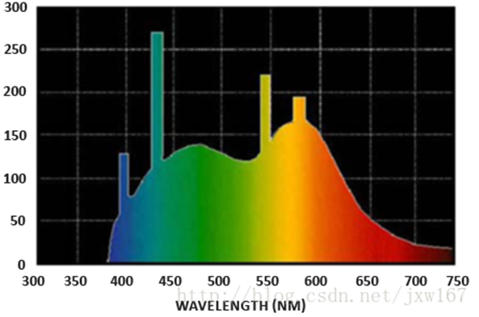
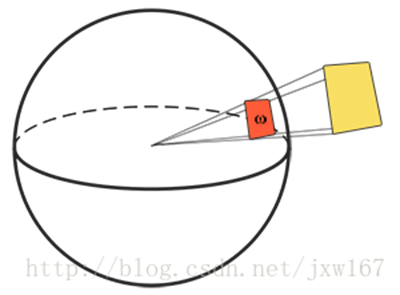
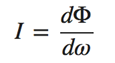
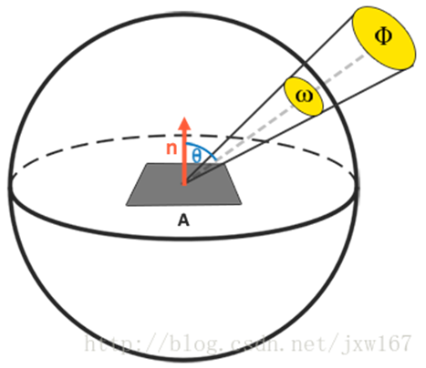
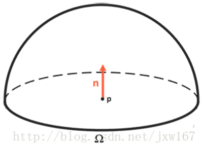

# 基于物理的渲染技术（PBR）系列二 

笔者介绍：[姜雪伟](http://www.vr3d-edu.com/)，IT公司技术合伙人，IT高级讲师，CSDN社区专家，特邀编辑，畅销书作者，国家专利发明人;已出版书籍：《手把手教你[**架****构**](http://lib.csdn.net/base/architecture)3D游戏引擎》电子工业出版社和《[**Unity3D**](http://lib.csdn.net/base/unity3d)实战核心技术详解》电子工业出版社等。 

CSDN视频网址：<http://edu.csdn.net/lecturer/144> 

继续上篇博客中[基于物理的渲染技术（PBR）系列一](http://blog.csdn.net/jxw167/article/details/63710248)的讲解，在这里我们引入了一种被称为[渲染方程](https://learnopengl.com/wiki-rendereuqation)(Render Equation)的东西。它是某些聪明绝顶人所构想出来的一个精妙的方程式，是如今我们所拥有的用来模拟光的视觉效果最好的模型。基于物理的渲染所坚定的遵循的是一种被称为反射率方程(The Reflectance Equation)的渲染方程的特化版本。要正确的理解PBR 很重要的一点就是要首先透彻的理解反射率方程： 

反射率方程一开始可能会显得有些吓人，不过随着我们慢慢对其进行剖析，读者最终会逐渐理解它的。要正确的理解这个方程式，我们必须要稍微涉足一些辐射度量学(Radiometry)的内容。辐射度量学是一种用来度量电磁场辐射（包括可见光）的手段。有很多种辐射度量(radiometric quantities)可以用来测量曲面或者某个方向上的光，但是我们将只会讨论其中和反射率方程有关的一种。它被称为辐射率(Radiance)，在这里用来表示。辐射率被用来量化单一方向上发射来的光线的大小或者强度。由于辐射率是由许多物理变量集合而成的，一开始理解起来可能有些困难，因此我们首先关注一下这些物理量： 

辐射通量：辐射通量表示的是一个光源所输出的能量，以瓦特为单位。光是由多种不同波长的能量所集合而成的，而每种波长则与一种特定的（可见的）颜色相关。因此一个光源所放射出来的能量可以被视作这个光源包含的所有各种波长的一个函数。波长介于390nm到700nm（纳米）的光被认为是处于可见光光谱中，也就是说它们是人眼可见的波长。在下面你可以看到一幅图片，里面展示了日光中不同波长的光所具有的能量： 

辐射通量将会计算这个由不同波长构成的函数的总面积。直接将这种对不同波长的计量作为参数输入计算机图形有一些不切实际，因此我们通常不直接使用波长的强度而是使用三原色编码，也就是RGB（或者按通常的称呼：光色）来作为辐射通量表示的简化。这套编码确实会带来一些信息上的损失，但是这对于视觉效果上的影响基本可以忽略。 

立体角：立体角用表示，它可以为我们描述投射到单位球体上的一个截面的大小或者面积。投射到这个单位球体上的截面的面积就被称为立体角(Solid Angle)，你可以把立体角想象成为一个带有体积的方向： 

可以把自己想象成为一个站在单位球面的中心的观察者，向着投影的方向看。这个投影轮廓的大小就是立体角。 

辐射强度：辐射强度(Radiant Intensity)表示的是在单位球面上，一个光源向每单位立体角所投送的辐射通量。举例来说，假设一个全向光源向所有方向均匀的辐射能量，辐射强度就能帮我们计算出它在一个单位面积（立体角）内的能量大小： 

计算辐射强度的公式如下所示： 

其中表示辐射通量除以立体角。 

在理解了辐射通量，辐射强度与立体角的概念之后，我们终于可以开始讨论辐射率的方程式了。这个方程表示的是，一个拥有辐射强度的光源在单位面积，单位立体角上的辐射出的总能量： 

L=d2ΦdAdωcosθ 

辐射率是辐射度量学上表示一个区域平面上光线总量的物理量，它受到入射(Incident)（或者来射）光线与平面法线间的夹角的余弦值的影响：当直接辐射到平面上的程度越低时，光线就越弱，而当光线完全垂直于平面时强度最高。这和我们在前面的[基础光照](https://learnopengl-cn.github.io/02 Lighting/02 Basic Lighting/)教程中对于漫反射光照的概念相似，其中就直接对应于光线的方向向量和平面法向量的点积： 

float cosTheta = dot(lightDir, N);   

辐射率方程很有用，因为它把大部分我们感兴趣的物理量都包含了进去。如果我们把立体角和面积看作是无穷小的，那么我们就能用辐射率来表示单束光线穿过空间中的一个点的通量。这就使我们可以计算得出作用于单个（片段）点上的单束光线的辐射率，我们实际上把立体角转变为方向向量然后把面转换为点。这样我们就能直接在我们的着色器中使用辐射率来计算单束光线对每个片段的作用了。 

事实上，当涉及到辐射率时，我们通常关心的是所有投射到点上的光线的总和，而这个和就称为辐射照度或者辐照度(Irradiance)。在理解了辐射率和辐照度的概念之后，让我们再回过头来看看反射率方程： 

Lo(p,ωo)=∫Ωfr(p,ωi,ωo)Li(p,ωi)n⋅ωidωi 

我们知道在渲染方程中代表通过某个无限小的立体角在某个点上的辐射率，而立体角可以视作是入射方向向量。注意我们利用光线和平面间的入射角的余弦值来计算能量，亦即从辐射率公式转化至反射率公式时的。用表示观察方向，也就是出射方向，反射率公式计算了点在方向上被反射出来的辐射率的总和。或者换句话说：表示了从方向上观察，光线投射到点上反射出来的辐照度。 

基于反射率公式是围绕所有入射辐射率的总和，也就是辐照度来计算的，所以我们需要计算的就不只是是单一的一个方向上的入射光，而是一个以点为球心的半球领域内所有方向上的入射光。一个半球领域(Hemisphere)可以描述为以平面法线为轴所环绕的半个球体： 

为了计算某些面积的值，或者像是在半球领域的问题中计算某一个体积的时候我们会需要用到一种称为积分(Integral)的数学手段，也就是反射率公式中的符号，它的运算包含了半球领域内所有入射方向上的 。积分运算的值等于一个函数曲线的面积，它的计算结果要么是解析解要么就是数值解。由于渲染方程和反射率方程都没有解析解，我们将会用离散的方法来求得这个积分的数值解。这个问题就转化为，在半球领域中按一定的步长将反射率方程分散求解，然后再按照步长大小将所得到的结果平均化。这种方法被称为黎曼和(Riemann sum) ，我们可以用下面的代码粗略的演示一下： 

 

\1.    int steps = 100; 

\2.    float sum = 0.0f; 

\3.    vec3 P    = ...; 

\4.    vec3 Wo   = ...; 

\5.    vec3 N    = ...; 

\6.    float dW  = 1.0f / steps; 

\7.    for(int i = 0; i < steps; ++i)  

\8.    { 

\9.    vec3 Wi = getNextIncomingLightDir(i); 

\10.  sum += Fr(p, Wi, Wo) * L(p, Wi) * dot(N, Wi) * dW; 

\11.  } 

通过利用dW来对所有离散部分进行缩放，其和最后就等于积分函数的总面积或者总体积。这个用来对每个离散步长进行缩放的dW可以认为就是反射率方程中的 。在数学上，用来计算积分的 表示的是一个连续的符号，而我们使用的dW在代码中和它并没有直接的联系（因为它代表的是黎曼和中的离散步长），这样说是为了可以帮助你理解。请牢记，使用离散步长得到的是函数总面积的一个近似值。细心的读者可能已经注意到了，我们可以通过增加离散部分的数量来提高黎曼和的准确度(Accuracy)。 

反射率方程概括了在半球领域内，碰撞到了点上的所有入射方向 上的光线的辐射率，并受到的约束，然后返回观察方向上反射光的。正如我们所熟悉的那样，入射光辐射率可以由[光源](https://learnopengl-cn.github.io/07 PBR/02 Lighting/)处获得，此外还可以利用一个环境贴图来测算所有入射方向上的辐射率，我们将在未来的[IBL](https://learnopengl-cn.github.io/07 PBR/03 IBL/01 Diffuse irradiance/)教程中讨论这个方法。 

现在唯一剩下的未知符号就是了，它被称为BRDF，或者双向反射分布函数(Bidirectional Reflective Distribution Function) ，它的作用是基于表面材质属性来对入射辐射率进行缩放或者加权。 

 

来自 <<https://blog.csdn.net/jxw167/article/details/64127720>>  

 

 