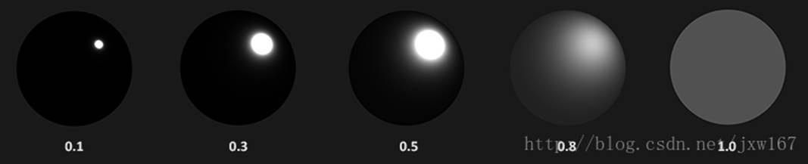
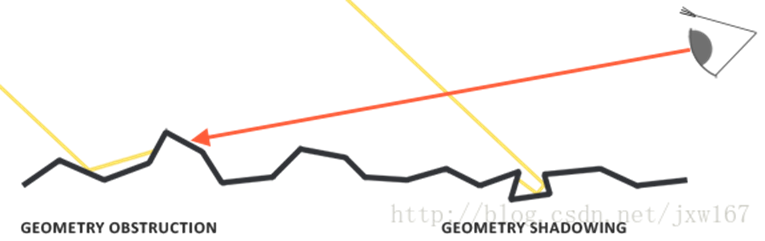
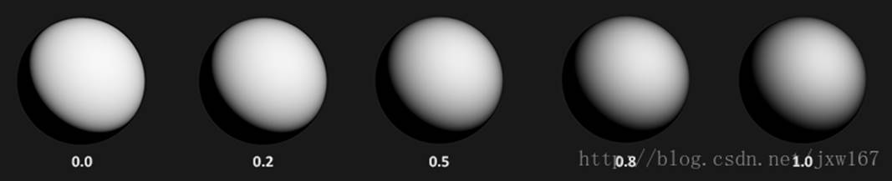

# 基于物理的渲染技术（PBR）系列三 

继续接着上一篇博客[基于物理的渲染技术（PBR）系列二](http://blog.csdn.net/jxw167/article/details/64127720)中的讲解， 

BRDF，或者说双向反射分布函数，它接受入射（光）方向，出射（观察）方向，平面法线以及一个用来表示微平面粗糙程度的参数作为函数的输入参数。BRDF可以近似的求出每束光线对一个给定了材质属性的平面上最终反射出来的光线所作出的贡献程度。举例来说，如果一个平面拥有完全光滑的表面（比如镜面），那么对于所有的入射光线（除了一束以外）而言BRDF函数都会返回0.0 ，只有一束与出射光线拥有相同（被反射）角度的光线会得到1.0这个返回值。 

BRDF基于我们之前所探讨过的微平面理论来近似的求得材质的反射与折射属性。对于一个BRDF，为了实现物理学上的可信度，它必须遵守能量守恒定律，也就是说反射光线的总和永远不能超过入射光线的总量。严格上来说，同样采用和作为输入参数的 Blinn-Phong光照模型也被认为是一个BRDF。然而由于Blinn-Phong模型并没有遵循能量守恒定律，因此它不被认为是基于物理的渲染。现在已经有很好几种BRDF都能近似的得出物体表面对于光的反应，但是几乎所有实时渲染管线使用的都是一种被称为Cook-Torrance BRDF模型。 

Cook-Torrance BRDF兼有漫反射和镜面反射两个部分： 

fr=kdflambert+ksfcook−torrance 

这里的是早先提到过的入射光线中被折射部分的能量所占的比率，而是被反射部分的比率。BRDF的左侧表示的是漫反射部分，这里用来表示。它被称为Lambertian漫反射，这和我们之前在漫反射着色中使用的常数因子类似，用如下的公式来表示： 

flambert=cπ 

表示表面颜色（回想一下漫反射表面纹理）。除以是为了对漫反射光进行标准化，因为前面含有BRDF的积分方程是受影响的。 

目前存在着许多不同类型的模型来实现BRDF的漫反射部分，大多看上去都相当真实，但是相应的运算开销也非常的昂贵。不过按照Epic公司给出的结论，Lambertian漫反射模型已经足够应付大多数实时渲染的用途了。 

BRDF的镜面反射部分要稍微更高级一些，它的形式如下所示： 

fcook−torrance=DFG4(ωo⋅n)(ωi⋅n) 

Cook-Torrance BRDF的镜面反射部分包含三个函数，此外分母部分还有一个标准化因子 。字母D，F与G分别代表着一种类型的函数，各个函数分别用来近似的计算出表面反射特性的一个特定部分。三个函数分别为正态分布函数(NormalDistribution Function)，菲涅尔方程(Fresnel Rquation)和几何函数(Geometry Function)： 

·         正态分布函数：估算在受到表面粗糙度的影响下，取向方向与中间向量一致的微平面的数量。这是用来估算微平面的主要函数。 

·         几何函数：描述了微平面自成阴影的属性。当一个平面相对比较粗糙的时候，平面表面上的微平面有可能挡住其他的微平面从而减少表面所反射的光线。 

·         菲涅尔方程：菲涅尔方程描述的是在不同的表面角下表面所反射的光线所占的比率。 

以上的每一种函数都是用来估算相应的物理参数的，而且你会发现用来实现相应物理机制的每种函数都有不止一种形式。它们有的非常真实，有的则性能高效。你可以按照自己的需求任意选择自己想要的函数的实现方法。英佩游戏公司的Brian Karis对于这些函数的多种近似实现方式进行了大量的研究。我们将会采用Epic Games在Unreal Engine 4中所使用的函数，其中D使用Trowbridge-Reitz GGX，F使用Fresnel-Schlick近似(Fresnel-Schlick Approximation)，而G使用Smith's Schlick-GGX。 

正态分布函数，或者说镜面分布，从统计学上近似的表示了与某些（中间）向量取向一致的微平面的比率。举例来说，假设给定向量，如果我们的微平面中有35%与向量取向一致，则正态分布函数或者说NDF将会返回0.35。目前有很多种NDF都可以从统计学上来估算微平面的总体取向度，只要给定一些粗糙度的参数以及一个我们马上将会要用到的参数Trowbridge-Reitz GGX： 

NDFGGXTR(n,h,α)=α2π((n⋅h)2(α2−1)+1)2 

在这里表示用来与平面上微平面做比较用的中间向量，而表示表面粗糙度。 

如果我们把当成是不同粗糙度参数下，平面法向量和光线方向向量之间的中间向量的话，我们可以得到如下图示的效果： 

当粗糙度很低（也就是说表面很光滑）的时候，与中间向量取向一致的微平面会高度集中在一个很小的半径范围内。由于这种集中性，NDF最终会生成一个非常明亮的斑点。但是当表面比较粗糙的时候，微平面的取向方向会更加的随机。你将会发现与向量取向一致的微平面分布在一个大得多的半径范围内，但是同时较低的集中性也会让我们的最终效果显得更加灰暗。： 

使用GLSL代码编写的Trowbridge-Reitz GGX正态分布函数是下面这个样子的： 

 

\1.    float D_GGX_TR(vec3 N, vec3 H, float a) 

\2.    { 

\3.    float a2     = a*a; 

\4.    float NdotH  = max(dot(N, H), 0.0); 

\5.    float NdotH2 = NdotH*NdotH; 

\6.    float nom    = a2; 

\7.    float denom  = (NdotH2 * (a2 - 1.0) + 1.0); 

\8.    denom        = PI * denom * denom; 

\9.    return nom / denom; 

\10.  } 

几何函数从统计学上近似的求得了微平面间相互遮蔽的比率，这种相互遮蔽会损耗光线的能量。 

： 

与NDF类似，几何函数采用一个材料的粗糙度参数作为输入参数，粗糙度较高的表面其微平面间相互遮蔽的概率就越高。我们将要使用的几何函数是GGX与Schlick-Beckmann近似的结合体，因此又称为Schlick-GGX： 

GSchlickGGX(n,v,k)=n⋅v(n⋅v)(1−k)+k 

这里的是基于几何函数是针对直接光照还是针对IBL光照的重映射(Remapping) : 

注意，根据你的引擎把粗糙度转化为的方式不同，得到的值也有可能不同。在接下来的教程中，我们将会广泛的讨论这个重映射是如何起作用的。 

为了有效的估算几何部分，需要将观察方向（几何遮蔽(Geometry Obstruction)）和光线方向向量（几何阴影(Geometry Shadowing)）都考虑进去。我们可以使用史密斯法(Smith’s method)来把两者都纳入其中： 

G(n,v,l,k)=Gsub(n,v,k)Gsub(n,l,k) 

使用史密斯法与Schlick-GGX作为可以得到如下所示不同粗糙度的视觉效果： 

几何函数是一个值域为[0.0, 1.0]的乘数，其中白色或者说1.0表示没有微平面阴影，而黑色或者说0.0则表示微平面彻底被遮蔽。 

使用GLSL编写的几何函数代码如下： 

 

\1.    float GeometrySchlickGGX(float NdotV, float k) 

\2.    { 

\3.    float nom   = NdotV; 

\4.    float denom = NdotV * (1.0 - k) + k; 

\5.    return nom / denom; 

\6.    } 

\7.    float GeometrySmith(vec3 N, vec3 V, vec3 L, float k) 

\8.    { 

\9.    float NdotV = max(dot(N, V), 0.0); 

\10.  float NdotL = max(dot(N, L), 0.0); 

\11.  float ggx1 = GeometrySchlickGGX(NdotV, k); 

\12.  float ggx2 = GeometrySchlickGGX(NdotL, k); 

\13.  return ggx1 * ggx2; 

\14.  } 

 

来自 <<https://blog.csdn.net/jxw167/article/details/64133796>>  

 

 