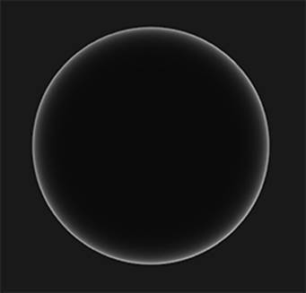
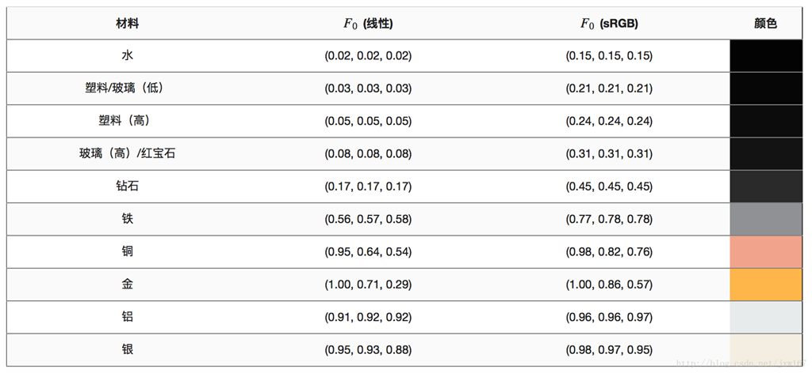
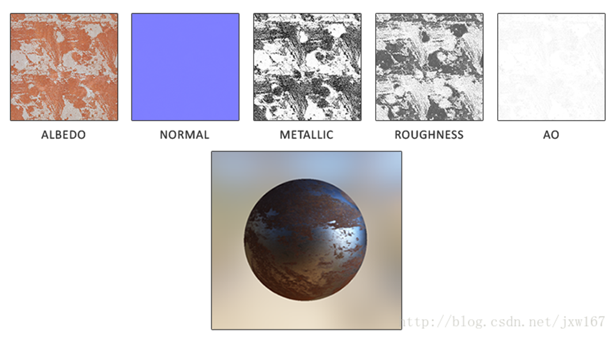

# 基于物理的渲染技术（PBR）系列四 

CSDN视频网址：<http://edu.csdn.net/lecturer/144> 

接着上一篇博客讲解的内容[基于物理的渲染技术（PBR）系列三](http://blog.csdn.net/jxw167/article/details/64133796)，下面介绍菲涅尔（发音为Freh-nel）方程描述的是被反射的光线对比光线被折射的部分所占的比率，这个比率会随着我们观察的角度不同而不同。当光线碰撞到一个表面的时候，菲涅尔方程会根据观察角度告诉我们被反射的光线所占的百分比。利用这个反射比率和能量守恒原则，我们可以直接得出光线被折射的部分以及光线剩余的能量。 

当垂直观察的时候，任何物体或者材质表面都有一个基础反射率(Base Reflectivity)，但是如果以一定的角度往平面上看的时候[所有](http://filmicgames.com/archives/557)反光都会变得明显起来。你可以自己尝试一下，用垂直的视角观察你自己的木制/金属桌面，此时一定只有最基本的反射性。但是如果你从近乎90度（注：应该是指和法线的夹角）的角度观察的话反光就会变得明显的多。如果从理想的90度视角观察，所有的平面理论上来说都能完全的反射光线。这种现象因菲涅尔而闻名，并体现在了菲涅尔方程之中。 

菲涅尔方程是一个相当复杂的方程式，不过幸运的是菲涅尔方程可以用Fresnel-Schlick近似法求得近似解： 

FSchlick(n,v,F0)=F0+(1−F0)(1−(n⋅v))5 

F0F0表示平面的基础反射率，它是利用所谓折射指数(Indices of Refraction)或者说IOR计算得出的。然后正如你可以从球体表面看到的那样，我们越是朝球面掠角的方向上看（此时视线和表面法线的夹角接近90度）菲涅尔现象就越明显，反光就越强： 

菲涅尔方程还存在一些细微的问题。其中一个问题是Fresnel-Schlick近似仅仅对电介质或者说非金属表面有定义。对于导体(Conductor)表面（金属），使用它们的折射指数计算基础折射率并不能得出正确的结果，这样我们就需要使用一种不同的菲涅尔方程来对导体表面进行计算。由于这样很不方便，所以我们预先计算出平面对于法向入射（）的反应（处于0度角，好像直接看向表面一样）然后基于相应观察角的Fresnel-Schlick近似对这个值进行插值，用这种方法来进行进一步的估算。这样我们就能对金属和非金属材质使用同一个公式了。 

平面对于法向入射的响应或者说基础反射率可以在一些大型数据库中找到，比如下图所示的，下面列举的这一些常见数值就是从Naty Hoffman的课程讲义中所得到的： 

这里可以观察到的一个有趣的现象，所有电介质材质表面的基础反射率都不会高于0.17，这其实是例外而非普遍情况。导体材质表面的基础反射率起点更高一些并且（大多）在0.5和1.0之间变化。此外，对于导体或者金属表面而言基础反射率一般是带有色彩的，这也是为什么要用RGB三原色来表示的原因（法向入射的反射率可随波长不同而不同）。这种现象我们只能在金属表面观察的到。 

金属表面这些和电介质表面相比所独有的特性引出了所谓的金属工作流的概念。也就是我们需要额外使用一个被称为金属度(Metalness)的参数来参与编写表面材质。金属度用来描述一个材质表面是金属还是非金属的。 

通过预先计算电介质与导体的值，我们可以对两种类型的表面使用相同的Fresnel-Schlick近似，但是如果是金属表面的话就需要对基础反射率添加色彩。我们一般是按下面这个样子来实现的： 

 

\1.    vec3 F0 = vec3(0.04); 

\2.    F0      = mix(F0, surfaceColor.rgb, metalness); 

我们为大多数电介质表面定义了一个近似的基础反射率。取最常见的电解质表面的平均值，这又是一个近似值。不过对于大多数电介质表面而言使用0.04作为基础反射率已经足够好了，而且可以在不需要输入额外表面参数的情况下得到物理可信的结果。然后，基于金属表面特性，我们要么使用电介质的基础反射率要么就使用来作为表面颜色。因为金属表面会吸收所有折射光线而没有漫反射，所以我们可以直接使用表面颜色纹理来作为它们的基础反射率。 

Fresnel Schlick近似可以用代码表示为： 

 

\1.    vec3 fresnelSchlick(float cosTheta, vec3 F0) 

\2.    { 

\3.    return F0 + (1.0 - F0) * pow(1.0 - cosTheta, 5.0); 

\4.    } 

其中cosTheta是表面法向量与观察方向的点乘的结果。 

随着Cook-Torrance BRDF中所有元素都介绍完毕，我们现在可以将基于物理的BRDF纳入到最终的反射率方程当中去了： 

Lo(p,ωo)=∫Ω(kdcπ+ksDFG4(ωo⋅n)(ωi⋅n))Li(p,ωi)n⋅ωidωi 

这个方程现在完整的描述了一个基于物理的渲染模型，它现在可以认为就是我们一般意义上理解的基于物理的渲染也就是PBR。如果你还没有能完全理解我们将如何把所有这些数学运算结合到一起并融入到代码当中去的话也不必担心。在下一个教程当中，我们将探索如何实现反射率方程来在我们渲染的光照当中获得更加物理可信的结果，而所有这些零零星星的碎片将会慢慢组合到一起来。 

在了解了PBR后面的数学模型之后，最后我们将通过说明美术师一般是如何编写一个我们可以直接输入PBR的平面物理属性的来结束这部分的讨论。PBR渲染管线所需要的每一个表面参数都可以用纹理来定义或者建模。使用纹理可以让我们逐个片段的来控制每个表面上特定的点对于光线是如何响应的：不论那个点是金属的，粗糙或者平滑，也不论表面对于不同波长的光会有如何的反应。 

在下面你可以看到在一个PBR渲染管线当中经常会碰到的纹理列表，还有将它们输入PBR渲染器所能得到的相应的视觉输出： 

反照率：反照率(Albedo)纹理为每一个金属的纹素(Texel)（纹理像素）指定表面颜色或者基础反射率。这和我们之前使用过的漫反射纹理相当类似，不同的是所有光照信息都是由一个纹理中提取的。漫反射纹理的图像当中常常包含一些细小的阴影或者深色的裂纹，而反照率纹理中是不会有这些东西的。它应该只包含表面的颜色（或者折射吸收系数）。 

法线：法线贴图纹理和我们之前在[法线贴图](https://learnopengl-cn.github.io/05 Advanced Lighting/04 Normal Mapping/)教程中所使用的贴图是完全一样的。法线贴图使我们可以逐片段的指定独特的法线，来为表面制造出起伏不平的假象。 

金属度：金属(Metallic)贴图逐个纹素的指定该纹素是不是金属质地的。根据PBR引擎设置的不同，美术师们既可以将金属度编写为灰度值又可以编写为1或0这样的二元值。 

粗糙度：粗糙度(Roughness)贴图可以以纹素为单位指定某个表面有多粗糙。采样得来的粗糙度数值会影响一个表面的微平面统计学上的取向度。一个比较粗糙的表面会得到更宽阔更模糊的镜面反射（高光），而一个比较光滑的表面则会得到集中而清晰的镜面反射。某些PBR引擎预设采用的是对某些美术师来说更加直观的光滑度(Smoothness)贴图而非粗糙度贴图，不过这些数值在采样之时就马上用（1.0 – 光滑度）转换成了粗糙度。 

AO：环境光遮蔽(Ambient Occlusion)贴图或者说AO贴图为表面和周围潜在的几何图形指定了一个额外的阴影因子。比如如果我们有一个砖块表面，反照率纹理上的砖块裂缝部分应该没有任何阴影信息。然而AO贴图则会把那些光线较难逃逸出来的暗色边缘指定出来。在光照的结尾阶段引入环境遮蔽可以明显的提升你场景的视觉效果。网格/表面的环境遮蔽贴图要么通过手动生成，要么由3D建模软件自动生成。 

美术师们可以在纹素级别设置或调整这些基于物理的输入值，还可以以现实世界材料的表面物理性质来建立他们的材质数据。这是PBR渲染管线最大的优势之一，因为不论环境或者光照的设置如何改变这些表面的性质是不会改变的，这使得美术师们可以更便捷的获取物理可信的结果。在PBR渲染管线中编写的表面可以非常方便的在不同的PBR渲染引擎间共享使用，不论处于何种环境中它们看上去都会是正确的，因此看上去也会更自然。 

 

来自 <<https://blog.csdn.net/jxw167/article/details/64438895>>  

 

 