# 球面高斯函数阅读笔记之一 

原文： **SG Series** 

地址：**https://mynameismjp.wordpress.com/2016/10/09/sg-series-part-1-a-brief-and-incomplete-history-of-baked-lighting-representations/** 

作为系列文章的第一篇，此文重点讨论如下两个问题： 

**1.** 预烘培（**Pre-Baked**）的光照贴图（**Light Map**）中存储的是什么？ 

**2.** 如何利用光照贴图中存储的数据计算漫反射（**Diffuse Lighting**）与镜面反射（**Specular Lighting**） 

 

**早期的光照贴图** 

 

光照贴图存储入射的辐照度（**Irradiance**），**BRDF** 是反射率（**albedo**）常量： 

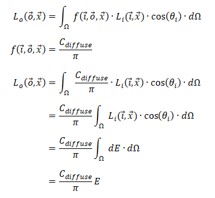

**注意：** 

上述方程中省略了可见性（**Visibility**）这一项，半球上可见性的分布一般具有高频、不连续等特点，是近似计算的难点。 

在预烘培阶段，间接光照（**Indirect Lighting**）计算已经将表面的反射率（**albedo**）编码（**encode**）进了 **LTE** ，因此，在运行时改变反射率将得到错误的结果。 

考虑到上述结论，为什么不在预烘培阶段将反射率与辐照度相乘： 

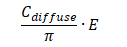

直接存储相乘后的结果呢？ 

原因是：**辐照度与反射率往往采用不同的密度（****Density****），一般反射率的密度更大。** 

辐照度、反射率一般存储在纹理贴图（**Texture Map**）上，纹理贴图的尺寸和纹理映射（**Texture Projection**）共同决定了密度。 

**a.** 贴图尺寸：尺寸越大密度越高 

**b.** 纹理映射：小贴图重复也可以看作更大的贴图尺寸，反射率贴图和光照贴图一般采用不同的映射 

 

**光照贴图与法线贴图** 

 

存储入射辐照度的光照贴图无法利用法线贴图提供更丰富的表面细节。 

为了让光照贴图与法线贴图合作起来，光照贴图存储的数据不能是与方向无关的辐照度，而需要近似的保存**入射****/****出射光线关于方向的一个分布**（方向定义在沿着表面法线张开的半球上）。 

这个分布最早、最简单的例子来自 **Half-Life 2** 引擎：辐射度法线映射（**Radiosity Normal Mapping**）。 

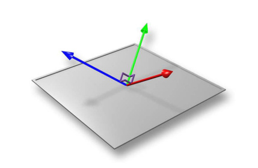

*Image from “Shading in Valve’s Source Engine “, SIGGRAPH 2006* 

早期光照贴图以表面的几何法线（**Geometry Normal**）为参考，在预烘培阶段计算该点的入射辐照度并存储。表面几何法线就是上图中与金属表面垂直向上的向量。 

法线贴图中存储的法线分布在沿着几何法线张开的半球中。 

为了利用法线贴图得到更多的细节（**Detail**），**Half-Life 2** 引擎将上图中红、绿、蓝三个向量作为基向量（**Basis Vector**），分别以这三个向量作为法线计算入射辐照度并存储，这样光照贴图存储的数据量是原来的三倍（三个辐照度）。 

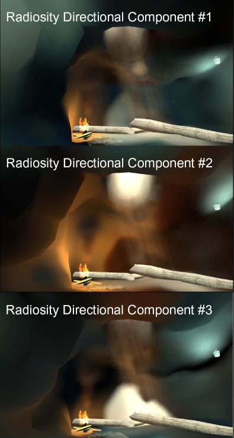  

在运行时，以法线贴图中的法线与基向量的点积（**Dot Product**）作为对应辐照度的权重，三个辐照度的加权平均乘以反射率得到最终结果。 

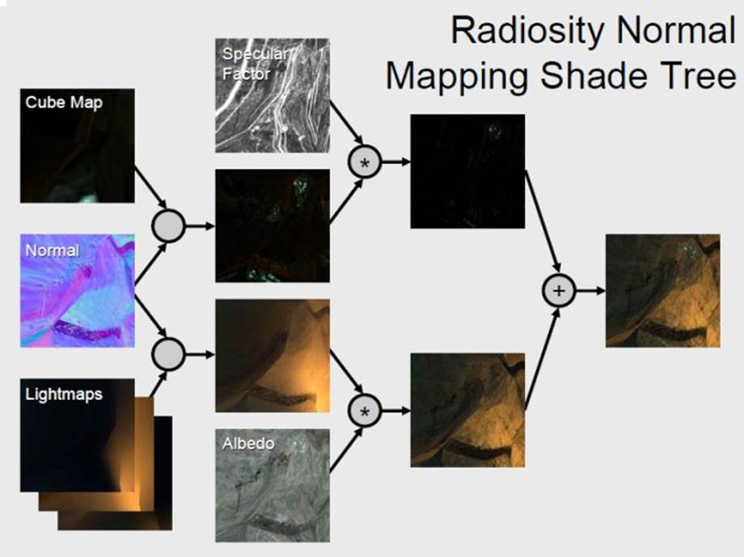  

**Ambient Cube** 

有别于与几何体紧密关联的光照贴图，**Half-Life 2** 引擎的 **Ambient Cube** 近似存储：以空间中某一点为球心的球面的入射辐照度分布，这是一类简化的的光照探针（**Light Probe**）。 

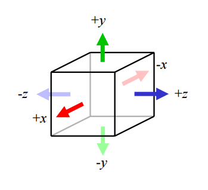

Image from “Shading in Valve’s Source Engine “, SIGGRAPH 2006* 

**Ambient Cube** 用六个颜色（分别对应上图中6个方向）来近似表达整个球面上的入射辐照度分布。 

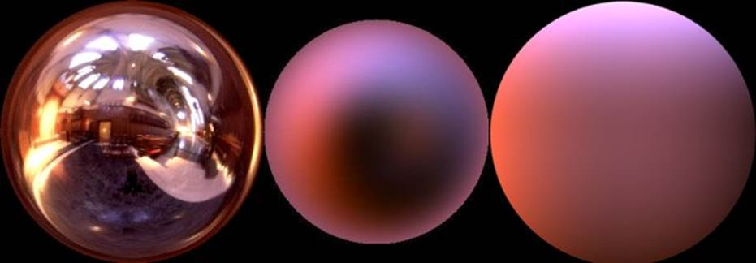*左：环境贴图，中：辐照度环境贴图，* *右：**Ambient Cube**近似的辐照度* 

**Half-Life 2** 引擎将 **Ambient Cube** 用于静态、动态道具（Props），动画角色的光照计算，而将光照贴图应用在大型、静态的集合体。 

 

**迈向镜面反射** 

 

对于理想漫反射（**Diffuse**）表面，出射辐亮度（**Radiance**）与出射方向无关（这是因为此种情况下， **BRDF** 是与出射方向无关的函数）： 

但是，只考虑漫反射的光照效果显得比较“平”，缺少丰富的细节，因此，让基于光照贴图的光照算法支持镜面反射是下一个需要解决的问题。 

基于环境贴图（**Environment Map**）的镜面反射是上述问题的一种常见解决方案。 

比如：**Unreal Engine 4** 对环境贴图进行预过滤（**Pre-filtering**），从而支持微表面反射模型（**Microfacet BRDF**）。 

由于环境贴图可观的内存消耗，场景中无法摆放足够多的镜面探针（**Specular Probe**），导致运行时镜面反射计算的错误。 

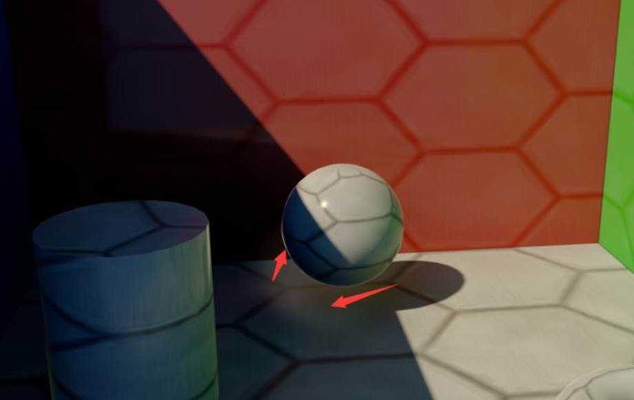*A combination of incorrect parallax and disocclusion when using a pre-filtered environment as a source for environment specular. Notice the bright edges on the sphere, which are actually caused by the sphere reflecting itself!*  

可以将 **Half-Life 2** 光照贴图存储的基向量入射辐照度看作方向光源，结合 **Phone BRDF** 做一个简单的尝试： 

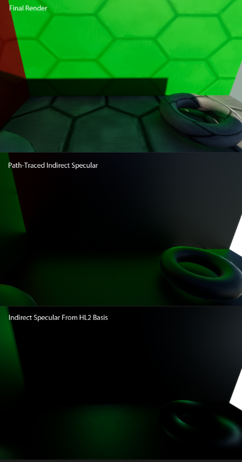

*顶图：路径追踪渲染结果，中图：路径追踪镜面反射分量图，下图：上文中的尝试结果* 

由于只有三个基向量的入射辐照度，对入射光线分布的近似过于粗燥，因此，尝试结果和 **Ground Truth** 差距很大。 

 

**试试球面调和函数** 

 

从上文中简单的尝试可以看出，为了得到更好的镜面反射效果，需要一种方法： 

**a.** 更好的表述入射光线（辐亮度）在球面上的分布 

**b.** 在此表述基础上，可以很简便的计算辐亮度与 **BRDF** 乘积的积分 

球面调和函数（**Spherical Harmonics**）在实时图形计算中有着广泛的应用，**SH** **常常被用来近似存储在离散探针位置上的间接光照**。 

**SH** 具有如下特征： 

**a.** **SH** 允许用一系列系数（1个、4个、9个、16个、n×n个）来近似一个关于方向（方向定义在球面上）的分布函数 

**b.** 用低阶的 **SH** （意味采用很少的系数来近似球面分布），只能表达低频分布（变化率很低、很模糊），在实践中，在可实用的系数数量下，SH 只能用来表达低频信号 

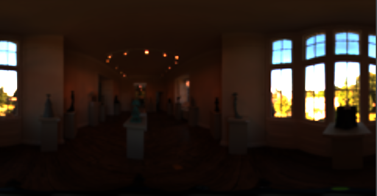

*入射辐亮度在球面上的分布* 

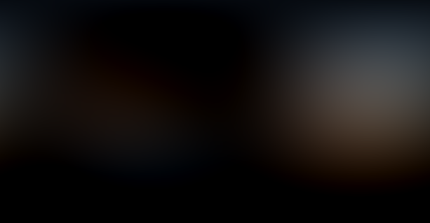

*经过**2**阶* *SH* *压缩之后的分布* 

对于辐照度（**Irradiance**）： 

可以看作关于法线向量 **n** 的分布。 

其中余弦项（**Cosine Term**）扮演了低通滤波（**Low Pass Filter**）的角色，辐照度呈现出低频的特点: 

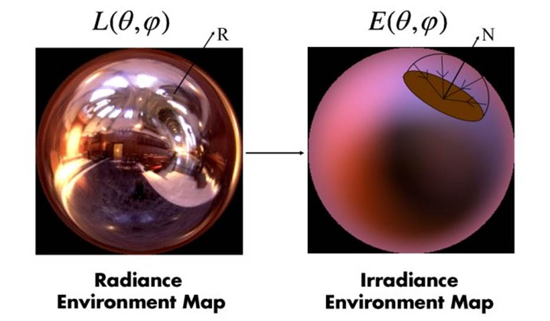辐照度非常适合采用 **SH** 来近似： 

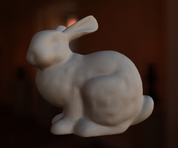

*The Stanford Bunny model being lit with diffuse lighting from an L2 spherical harmonics probe* 

回顾前文中提到的 **LTE** ： 

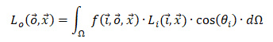

对于镜面反射，**BRDF** 与出射方向相关，因此，镜面反射需要对 **BRDF** 与入射辐亮度的乘积进行积分。如果采用 **SH** 来近似表达入射辐亮度分布，也同时需要用 **SH** 来近似表达 **BRDF** 函数。 

**Halo 3 BRDF** 

光环3提出了一种通过 **SH** 近似微表面反射模型（**Microfacet Specular BRDF**）的方法： 

**a.** 选定微表面反射模型控制参数为两个：粗燥度（**Roughness**）、菲涅尔项 **F0** 

**b.** 出射方向忽略方位角（下图中的 **phi**），只考虑出射方向与法线的夹角（下图中的 **theta**） 

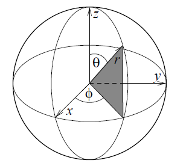

c. 只考虑粗燥度比较大的材质，因为表面越光滑，**BRDF lobe** 会越接近理想镜面反射（冲击函数，不连续），越无法用 **SH** 来表达；即便如此，对于较大粗燥度的分布，**也需要** **27** **个系数的** **SH** **来近似。** 

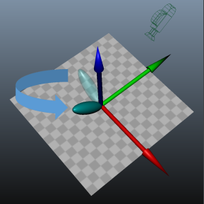

粗燥度为 0.39： 

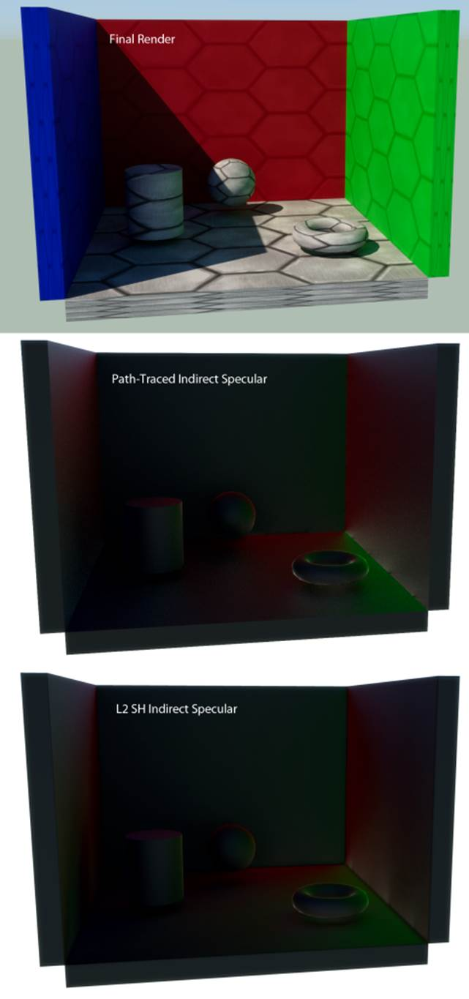

**Ringing** **现象** 

采用 SH 近似表达“强光源从球体的一侧入射”这种分布时，容易出现 **Ringing** 现象： 

在强光源入射的对立一侧，会出现接近于0，甚至负值分布。 

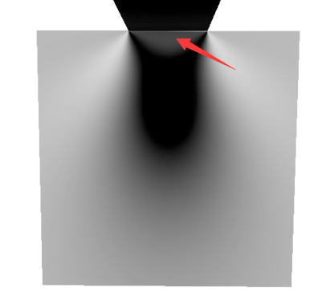

*信号不连续产生的混叠，信号不连续来自计算辐照度时对余弦项的**max(0, cos)**操作* 

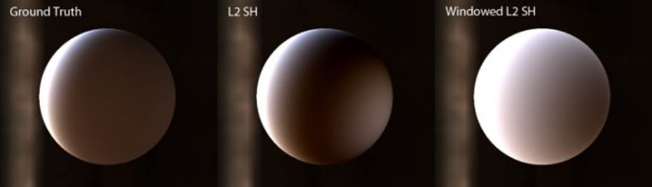

*A sphere with a Lambertian diffuse BRDF being lit by a lighting environment with a strong area light source. The left image shows the ground-truth result of using monte-carlo integration. The middle image shows the result of projecting radiance onto L2 SH, and then computing irradiance. The right image shows the result of applying a windowing function to the L2 SH coefficients before computing irradiance.* 

 

 

来自 <<http://blog.sina.com.cn/s/blog_53bc40730102y6tq.html>>  

 

 