# 球面高斯函数阅读笔记之二 

原文： **SG Series** 

地址：**https://mynameismjp.wordpress.com/2016/10/09/sg-series-part-2-spherical-gaussians-101/** 

作为系列文章的第二篇，此文介绍球面高斯函数，为系列的下一篇提供核心工具。 

球面高斯函数，**Spherical Gaussian**，简写为 **SG**，是一类球面径向基函数（**SRBF：Spherical Radial Basis Function**）。 

 

**什么是球面高斯函数** 

 

**一维高斯函数** 

一维高斯函数直观的看是钟形曲线： 

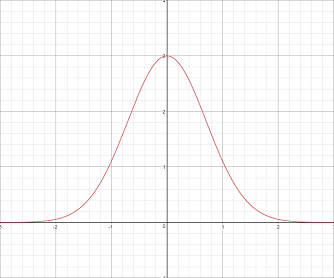

*A Gaussian in 1D centered at x=0, with a height of 3*  

数学形式： 

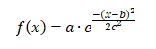

被用于概率密度函数时，也以这样的形式出现： 

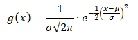

其中：**x-b** 称为笛卡尔距离（正交坐标系表示下的欧氏距离）。 

**二维高斯函数** 

二维高斯函数常被用来作为图像低通滤波的窗口函数： 

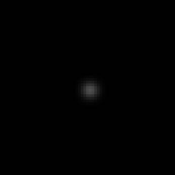

*A Gaussian filter applied to a 2D image of a white dot, showing that the impulse response is effectively a Gaussian function in 2D*  

数学形式： 

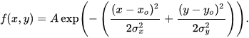

其中：**x-x0,** **y-y0** 称为笛卡尔距离（正交坐标系表示下的欧氏距离）。 

**球面高斯函数** 

球面高斯函数就是定义在球面上的高斯函数。在球面上，采用两方向向量夹角的余弦来表示“距离”。 

数学形式： 

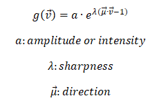

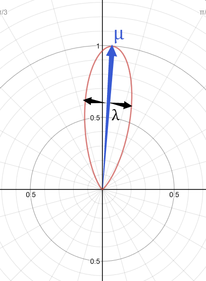

**为什么选择球面高斯函数** 

 

**向量积（向量对应分量的乘积）** 

两个 **SG** 的乘积还是一个 **SG:****** 

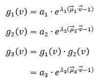

其中： 

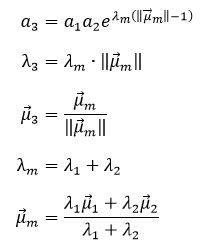

**积分** 

**SG** 在整个球上的积分有比较简单的解析形式： 

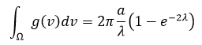

由此，可以得到 **SG** 的归一化形式： 

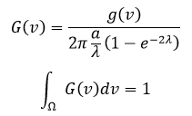

注意到指数项：

 

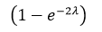

随着 **lambda** 的增加很快接近 1 

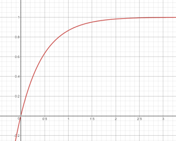



*A graph of the exponential term in computing the integral of an SG over a sphere, which approaches 1 as the sharpness increases. The X-axis is sharpness, and the Y-axis is the value of exponent term.* 

因此，计算 **SG** 在整个球上积分时，可以忽略指数项，采用如下简化公式近似计算： 

 

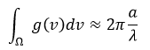**函数内积** 

球面函数内积/点积： 

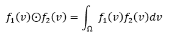**SG** 

函数内积： 

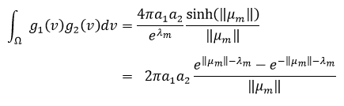

其中： 

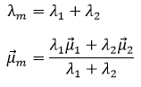

阈值** 

沿着 **SG** 的方向向量张开的 **lobe**，可以通过如下公式： 

得到一个最大张角 **theta**，在范围 **[0**, **theta]** 内，所有 **v** 对应的函数值都小于阈值 **e**。 

由此，我们可以给定一个最大张角 **theta** ，通过如下公式： 

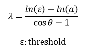

得到 **lambda** ，采用此 **lambda** 参数的高斯函数，其函数值在 **[0**, **theta]** 张角范围内均小于阈值 **e**。 

**旋转** 

对 **SG** 的方向向量进行旋转就可以得到旋转后的 **SG** ： 

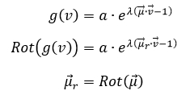 

来自 <<http://blog.sina.com.cn/s/blog_53bc40730102y6zz.html>>  

 

 