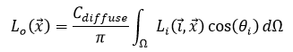
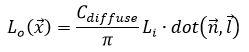
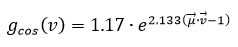
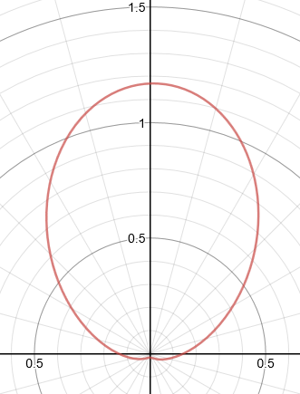
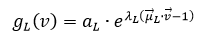
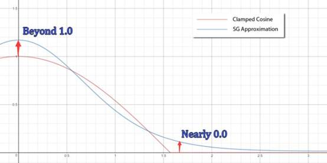
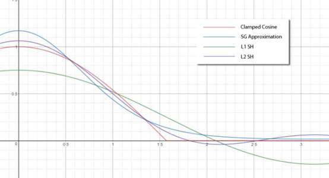
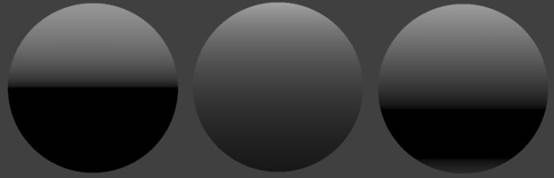
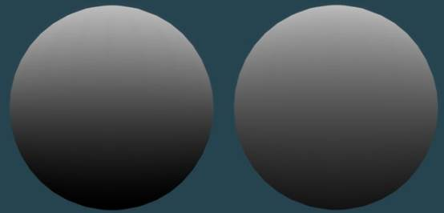
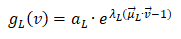

# 球面高斯函数阅读笔记之三 

原文： **SG Series** 

地址：**https://mynameismjp.wordpress.com/2016/10/09/sg-series-part-3-diffuse-lighting-from-an-sg-light-source/** 

作为系列文章的第三篇，此文介绍球面高斯函数在预计算光照中的应用。 

 

**近似漫反射****** 

 

对于理想漫反射表面，**BRDF** 是常量，**LTE** 简化为： 

对于理想光源，**Li** 变成冲击函数，**LTE** 进一步简化为： 

余弦项用如下 **SG** 来近似： 

  

入射辐亮度分布也采用 **SG** 来表述： 

则漫反射的积分项可以利用 **SG** 的函数内积公式得到： 

  

 

**误差分析** 

 

*Comparison of a clamped cosine cosine lobe (red) with an SG approximation (blue)* 

*L1 (green) and L2 (purple) SH* *approximation of a clamped cosine lobe compared with an SG approximation (blue) and the actual clamped cosine (red).* 

*From left to right: actual clamped cosine lobe, SG cosine approximation, L2 SH cosine approximation* 

*The resulting irradiance from an SG light source (with sharpness of 4.0) as a function of the angle between the light source and the surface normal. The red graph is the result of* *using numerical integration to compute the integral of the SG light source multiplied with a clamped cosine, while the blue graph was computed using an SG inner product of the light source with a cosine lobe approximated as an SG.* 

*The left sphere shows the resulting diffuse lighting from an SG light source with a sharpness of 4.0, where the irradiance was computed using monte carlo importance sampling. The right sphere shows the resulting diffuse lighting from computing irradiance using an SG inner product with an approximation of a cosine lobe.* 

 

**更廉价的近似** 

 

考虑上文中以 **SG** 表述的入射辐亮度分布： 

此分布函数总是在： 

 

处取最大值，并向其他方向衰减。因此，漫反射 **LTE** 可以做如下近似： 

 

 

 

*The resulting irradiance from an SG light source (with sharpness of 4.0) as function of the angle between the light source and the surface normal. The red graph was computed using numerical integration, while the blue graph was computed using an SG inner product of the light source with a cosine lobe approximated as an SG. The green graph was computed by pulling the cosine term out of the integral, and multiplying it with the result of integrating the SG light about the sphere.* 

 

******更准确的近似** 

 

 

*The resulting irradiance from an SG light source (with sharpness of 4.0) as function of the angle between the light source and the surface normal. The red graph was computed using numerical integration, while the blue graph was computed using an SG inner product of the light source with a cosine lobe approximated as an SG. The* *orange graph was computed using Stephen Hill**’s fitted curve approximation.* 

 

*The left sphere shows the resulting diffuse lighting from an SG light source with a sharpness of 4.0, where the irradiance was computed using an SG inner product with an approximation of a cosine lobe. The middle* *sphere shows the resulting diffuse lighting from computing irradiance using monte carlo importance sampling. The right sphere shows the resulting diffuse lighting from Stephen Hill**’s fitted approximation.* 

 

来自 <<http://blog.sina.com.cn/s/blog_53bc40730102y74l.html>>  

 

 