# 球面高斯函数阅读笔记之四 

**介绍** 

**** 

原文： **SG Series** 

地址：**https://mynameismjp.wordpress.com/2016/10/09/sg-series-part-4-specular-lighting-from-an-sg-light-source/** 

作为系列文章的第四篇，此文继续介绍球面高斯函数在预计算光照中的应用。 

 

**微表面镜面反射** 

 

微表面反射模型（**Microfacet Reflection Model**）是一类双向反射分布函数（**BRDF**），是关于入射与出射方向的函数，其数学形式： 

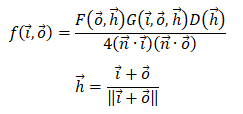

**法线分布函数** **NDF** 

法线分布函数（**NDF**）一般采用 **GGX** 分布： 

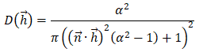

其中参数 **alpha** 是表面粗燥度（**Roughness**）的控制参数，下面两图是不同粗燥度的 **GGX** 分布曲线： 

 

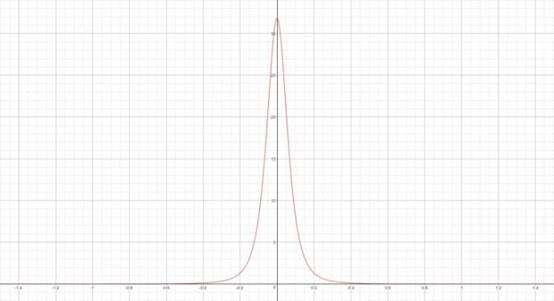

*The top image shows a GGX distribution term with a roughness parameter of 0.5. The bottom image shows the same GGX distribution term with a roughness parameter of 0.1. For both graphs, the X axis represents the angle between the surface normal and the half vector.*  

******几何项** **Geometry Term** 

几何项（**Geometry Term**）采用 **Smith** 模型： 

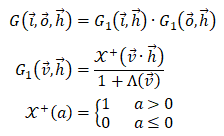

对 **GGX** 分布有： 

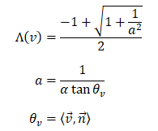

 

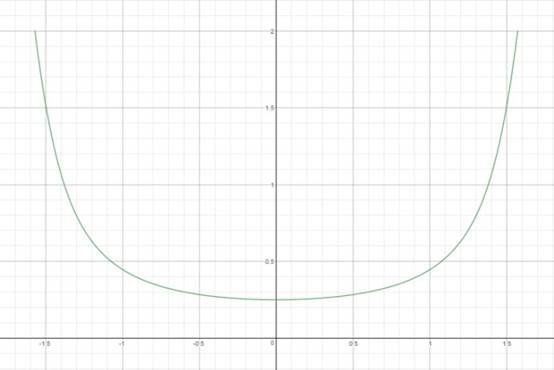

*The Smith visibility term for GGX as a function of the angle between the surface normal and the light direction. The roughness used is 0.25, and the angle between the normal and the view direction is 0.*  

**菲涅尔项** **Fresnel Term** 

菲涅尔项（**Fresnel Term**）一般采用 **Schlick** 近似： 

 

**从上述函数曲线可以直观看出，几何项与菲涅尔项都不是钟形曲线，与** **SG** **函数距离很远，没有采用** **SG** **近似的可能性。只有** **NDF** **是比较接近** **SG****。** 

 

**SG** **光源的镜面反射** 

 

******用** **SG** **近似** **NDF** **项** 

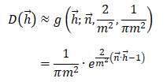

 

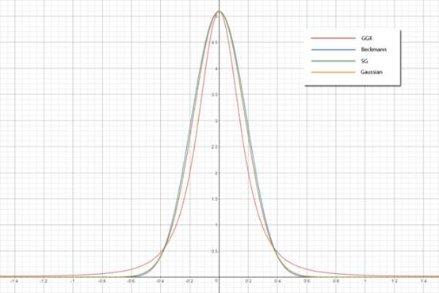

 

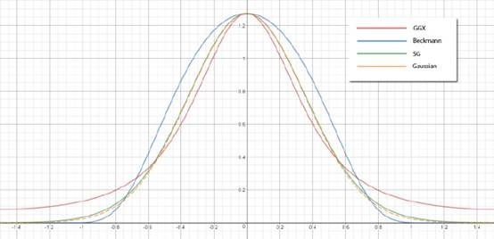

*Top graph shows a comparison between GGX, Beckmann, normalized Gaussian, and SG distribution terms with a roughness of 0.25. The bottom shows the same comparison with  a roughness of 0.5.* 

从上两幅图中可以看出，**SG** 近似结果丧失了 **GGX** 分布的长尾（**Long Tails**）。比较瘦、紧凑的钟形形状，以及长尾是 **GGX** 分布的主要特征。 

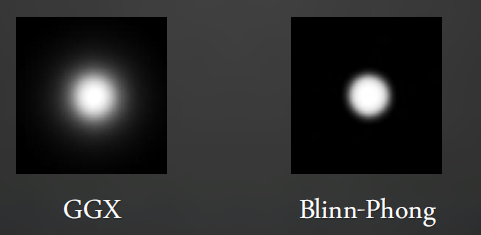

**弯曲** **SG** 

**NDF** 的 **SG** 近似： 

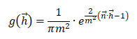

是关于 **h**（**half-vector**）的函数，需要转换为关于 **i**（**incident-vector**）的函数。 

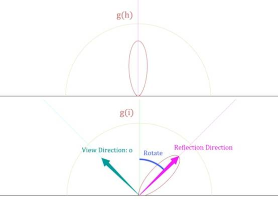

通过旋转和压扁操作，关于入射方向的 **SG** 分布如下： 

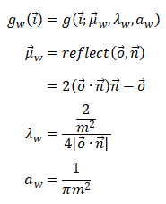

 

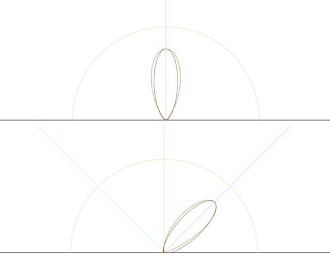

*Result of applying a spherical warp to the SG distribution term (green) compared with the actual GGX distribution (red). The top graph shows a viewing angle of 0 degrees, and the bottom graph shows a viewing angle of 45 degrees.* 

******近似其他项** 

几何项： 

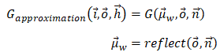

菲涅尔项： 

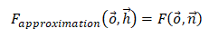

  

几何项和菲涅尔项都是用 **h** **= n** 处的值来代替整个函数，非常简单粗暴。 

******结果** 

 

**迈向各向异性** 

 

从上文中的结果图可以看出，摄像机是从贴地角（掠射角，**Ｇ****razing Angle**）观察地面的，地面上呈现的高光形状过于宽而圆润，这与现实生活体验不同。 

下左图是出射方向靠近表面法线（观察者在地面上方，几乎垂直的往下看地面）的 **GGX** 分布，下右图是出射方向与表面法线几乎垂直情况下（观察者贴地观察地面）的 **GGX** 分布： 

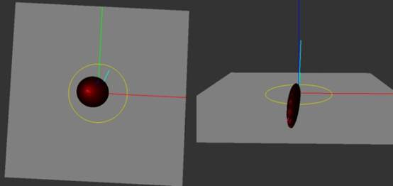

*3D graph of the GGX distribution term. The left image shows the distribution when the viewing angle is very low, while the right image shows the distribution when the viewing angle is very steep.* 

从图中可以看出，左图 **GGX Lobe** 宽而圆润，右图  **GGX Lobe** 窄而扁平。 

**ASG** **各向异性球面高斯函数** 

数学形式： 

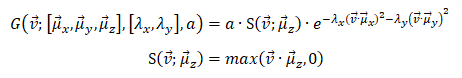

 

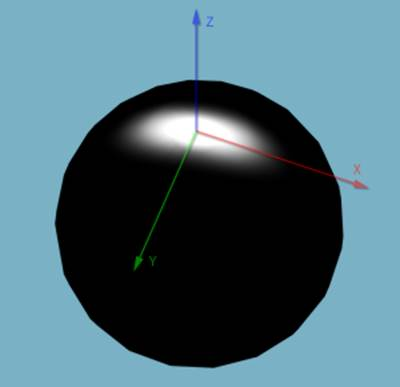

*An Anisotropic Spherical Gaussian visualized on the surface of a sphere.  has a value of 16, and  has a value of 64.* 

**ASG** 有两个有用的工具： 

**a.** 一个弯曲操作，此操作可以将 **SG** 表述的 **NDF** 分布转换为 **ASG** 表述 

**b.** 一个计算 **SG** 与 **ASG** 卷积的方法： 

有 **ASG** 函数： 

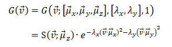

有 **SG** 函数： 

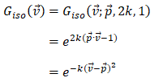

则上述两函数的卷积： 

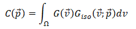

  

是一个关于 **Giso** 方向向量 **p** 的函数，此函数近似是一个 **ASG** ： 

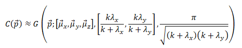

******结果** 

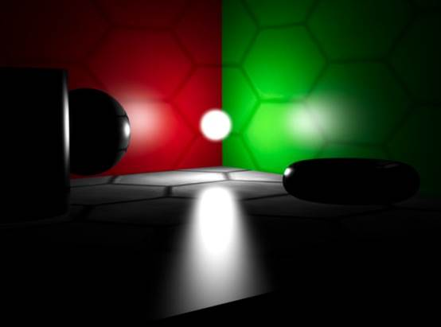

 

来自 <<http://blog.sina.com.cn/s/blog_53bc40730102y75e.html>>  

 

 