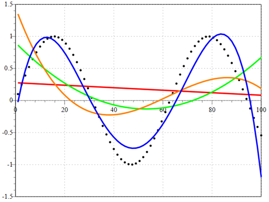
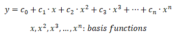
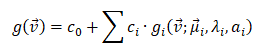
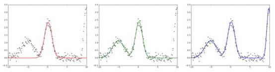

# 球面高斯函数阅读笔记之五

**介绍** 

**** 

原文： **SG Series** 

地址：**https://mynameismjp.wordpress.com/2016/10/09/sg-series-part-5-approximating-radiance-and-irradiance-with-sgs/** 

作为系列文章的第五篇，此文用 **SG** 近似光照分布。 

 

**拟合** 

 

给定一个样本集合，寻找具有解析形式的曲线来近似表示这个样本集合，这被称为曲线拟合（**Curve Fitting**）。曲线拟合可以看作一种有损压缩（**Lossy Compression**）。 

*Fitting various polynomials to data generated by a sine wave. Red is first degree, green is second degree, orange is third degree, blue is forth degree.By Krishnavedala (Own work) [CC0], via Wikimedia Commons* 

拟合曲线可以通过一组基函数（Basis Function）的线性组合（Linear Combination）得到。 

**多项式基函数** 

**高斯基函数** 

 

*Fitting Gaussians to a data set using least squares. The left graph shows a fit with a single Gaussian, the middle graph shows a fit with two Gaussians, and the right* *graph shows a fit with three Gaussians.* 

在拟合曲线的解析形式通过基函数确立之后，基函数的线性组合系数可以通过最小二乘法（**Least Squares Method**）来计算得到。 

 

来自 <<http://blog.sina.com.cn/s/blog_53bc40730102y7ct.html>>  

 

 