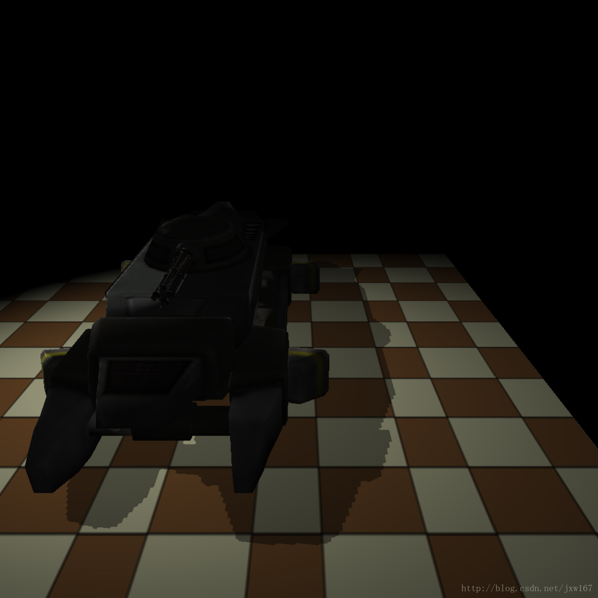
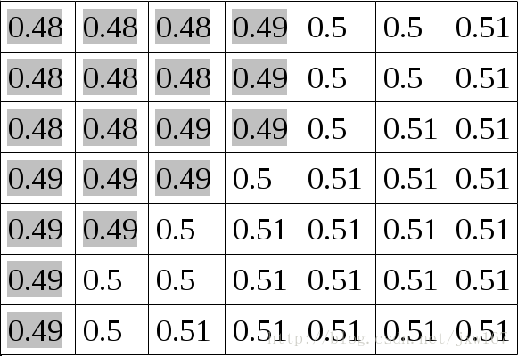
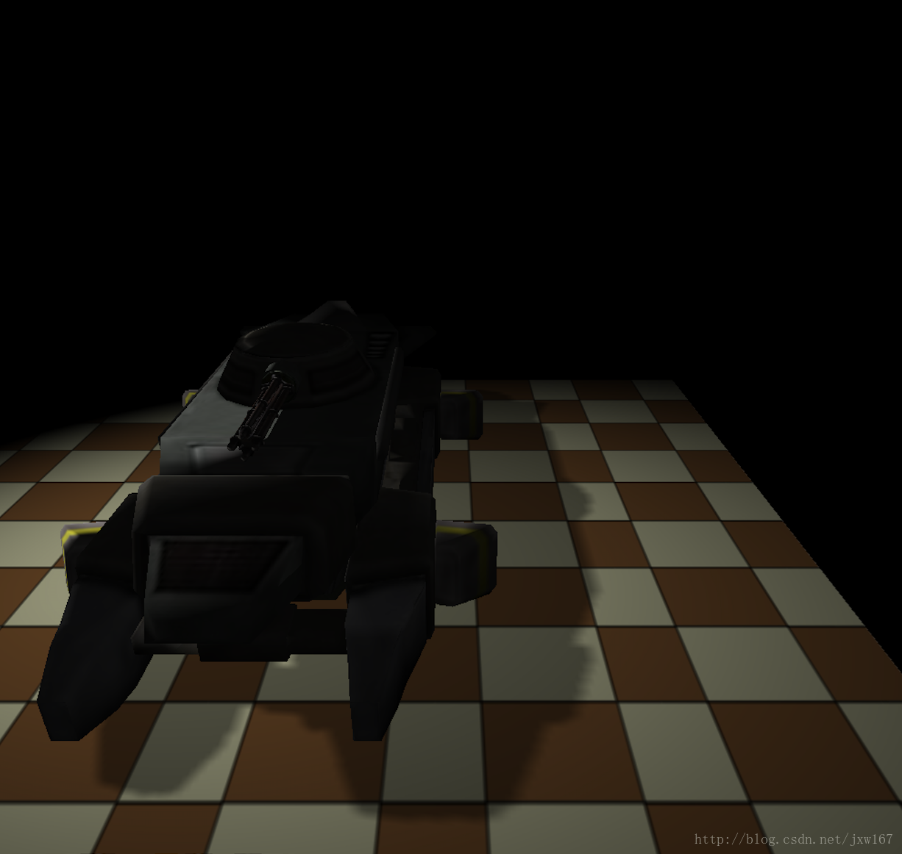

# PCF软阴影技术讲解

2017年03月24日 20:53:55

海洋_

阅读数：2104

更多

​                 个人分类：                                   [图形学编程                                  ](https://blog.csdn.net/jxw167/article/category/6624969)               

​                   

​                      版权声明：本文为博主原创文章，未经博主允许不得转载。          https://blog.csdn.net/jxw167/article/details/65632580        

笔者介绍：[姜雪伟](http://www.vr3d-edu.com/)，IT公司技术合伙人，IT高级讲师，CSDN社区专家，特邀编辑，畅销书作者，国家专利发明人;已出版书籍：《手把手教你[**架构**](http://lib.csdn.net/base/architecture)3D游戏引擎》电子工业出版社和《[**Unity3D**](http://lib.csdn.net/base/unity3d)实战核心技术详解》电子工业出版社等。

CSDN视频网址：<http://edu.csdn.net/lecturer/144>

​	先介绍一下平实使用的阴影算法，阴影映射产生的阴影不是很好，而且有很多锯齿，效果如下图所示：

​	


​	本博客描述了一种减少该问题的方法（许多方法之一），称为百分比更接近过滤或PCF。 这个想法是从当前像素周围的阴影图进行采样，并将其深度与所有采样本进行比较，通过对结果进行平均，我们得到光线和阴影之间更平滑的线。 例如，看看下面的阴影贴图：




​	上图中每个单元格包含每个像素的深度值（从光源观察时），  为了使其变的简单，让我们说上面所有像素的深度是0.5（从相机的角度来看）。  当阴影映射值小于0.5的所有像素将处于阴影中，阴影映射值大于或等于0.5的像素将会在光照中， 这将在光和阴影之间创建一个硬块状的线条。

​	现在考虑以下内容 - 最接近光线和阴影边界的像素被阴影映射值小于0.5的像素以及阴影映射值大于或等于0.5的像素包围。 如果我们对这些相邻像素进行采样，并将结果平均化，我们将获得一个可以帮助我们平滑光和阴影之间边界的水平因子。 当然，我们不知道什么像素最接近该边界，所以我们只是为每个像素做这个采样工作。 在本篇博文中，我们将在每个像素周围的3×3内核中抽取9个像素，并取平均得出结果， 这将是我们的影子系数。

​	现在让我们来看一下实现PCF的源代码：

​	

```cpp
(lighting.fs:64)


uniform sampler2DShadow gShadowMap;


 


#define EPSILON 0.00001


 


float CalcShadowFactor(vec4 LightSpacePos)


{


    vec3 ProjCoords = LightSpacePos.xyz / LightSpacePos.w;


    vec2 UVCoords;


    UVCoords.x = 0.5 * ProjCoords.x + 0.5;


    UVCoords.y = 0.5 * ProjCoords.y + 0.5;


    float z = 0.5 * ProjCoords.z + 0.5;


 


    float xOffset = 1.0/gMapSize.x;


    float yOffset = 1.0/gMapSize.y;


 


    float Factor = 0.0;


 


    for (int y = -1 ; y <= 1 ; y++) {


        for (int x = -1 ; x <= 1 ; x++) {


            vec2 Offsets = vec2(x * xOffset, y * yOffset);


            vec3 UVC = vec3(UVCoords + Offsets, z + EPSILON);


            Factor += texture(gShadowMap, UVC);


        }


    }


 


    return (0.5 + (Factor / 18.0));


}
```


​	这是更新的阴影系数计算功能， 它开始于相同的地方，我们从光源的角度手动执行裁剪空间坐标的透视分割，然后从（-1，+ 1）范围到（0,1）的变换。 我们现在可以使用坐标，可以使用它们从阴影贴图中采样，Z值与样本结果进行比较，从这里事情将会有所不同， 我们要对3×3内核进行采样，所以我们需要9个纹理坐标。 坐标必须导致在X或Y轴上以一个像素周期采样纹理。 由于UV纹理坐标从0到1运行，并分别映射到像素范围（0，宽度-1）和（0，高度-1），我们将1除以纹理的宽度和高度， 这些值存储在gMapSize统一矢量中，这给了我们两个相邻像素之间纹理坐标空间的偏移。

​	接下来，我们执行一个嵌套的for循环并计算我们将要采样的9个像素中的每一个的偏移矢量，循环中的最后几行可能看起来有点奇怪。我们使用带有3个组件（UVC）而不是仅仅2的矢量从阴影贴图中进行采样。最后一个组件与阴影贴图（光源Z加上一个小的epsilon避免Z比较）。这里的改变是我们使用sampler2DShadow作为'gShadowMap'类型而不是sampler2D。当从阴影类型的采样器（sampler1DShadow，sampler2DShadow等）采样时，GPU执行纹理值与作为纹理坐标向量的最后一个分量（第二个分量为1D，2D的第三个组件）提供的纹理值之间的比较，等等）。如果比较失败，我们得到零结果，如果比较成功，我们得到一个零结果。比较类型使用GL  API进行配置，而不是通过GLSL进行配置。稍后我们会看到这个变化。现在，假设我们得到一个零的结果为阴影和一个为光照。我们累积9个结果并将它们除以18。因此，我们得到一个介于0和0.5之间的值。我们把它添加到0.5的基数，这是我们的阴影系数。

​	

```cpp
bool ShadowMapFBO::Init(unsigned int WindowWidth, unsigned int WindowHeight)


{


    // Create the FBO


    glGenFramebuffers(1, &m_fbo);


 


    // Create the depth buffer


    glGenTextures(1, &m_shadowMap);


    glBindTexture(GL_TEXTURE_2D, m_shadowMap);


    glTexImage2D(GL_TEXTURE_2D, 0, GL_DEPTH_COMPONENT32, WindowWidth, WindowHeight, 0, GL_DEPTH_COMPONENT, GL_FLOAT, NULL);


    glTexParameteri(GL_TEXTURE_2D, GL_TEXTURE_MIN_FILTER, GL_LINEAR);


    glTexParameteri(GL_TEXTURE_2D, GL_TEXTURE_MAG_FILTER, GL_LINEAR);


    glTexParameteri(GL_TEXTURE_2D, GL_TEXTURE_COMPARE_MODE, GL_COMPARE_REF_TO_TEXTURE);


    glTexParameteri(GL_TEXTURE_2D, GL_TEXTURE_COMPARE_FUNC, GL_LEQUAL);


    glTexParameteri(GL_TEXTURE_2D, GL_TEXTURE_WRAP_S, GL_CLAMP_TO_EDGE);


    glTexParameteri(GL_TEXTURE_2D, GL_TEXTURE_WRAP_T, GL_CLAMP_TO_EDGE);


 


    glBindFramebuffer(GL_FRAMEBUFFER, m_fbo);


    glFramebufferTexture2D(GL_FRAMEBUFFER, GL_DEPTH_ATTACHMENT, GL_TEXTURE_2D, m_shadowMap, 0);


 


    // Disable writes to the color buffer


    glDrawBuffer(GL_NONE);


 


    // Disable reads from the color buffer


    glReadBuffer(GL_NONE);


 


    GLenum Status = glCheckFramebufferStatus(GL_FRAMEBUFFER);


 


    if (Status != GL_FRAMEBUFFER_COMPLETE) {


        printf("FB error, status: 0x%x\n", Status);


        return false;


    }


 


    return true;


}
```

​	这就是我们如何配置阴影

贴图纹理，使用着色器中的阴影采样器而不是常规采样器

，

首先我们将纹理比较模式设置为'比较参考纹理'。 这里第三个参数的唯一

可能的值是GL_NONE，它是默认值，使采样器的行为方式为常规非阴影形式。  对glTexParameteri的第二次调用将比较功能设置为“小于或等于”。  这意味着如果参考值小于或等于纹理中的值，则样本操作的结果将为1.0，否则为零。  您也可以使用GL_GEQUAL，GL_LESS，GL_GREATER，GL_EQUAL，GL_NOTEQUAL进行类似的比较

，

 还有GL_ALWAYS总是返回1.0，GL_NEVER总是返回0.0。


​	

```cpp
void ShadowMapPass()


{


    glCullFace(GL_FRONT);


    ...


}


 


 


void RenderPass()


{


    glCullFace(GL_BACK);


    ...


}
```

​	我想讨论的最后一点是一个小的改变，处理几乎任何阴影技术时，自我遮挡

都是一个大问题，因为深度缓冲区的精度非常有限（甚至是32位）。这个问题是面向光线并且不在阴影中的多边形

，

在阴影贴图中，我们将其深度渲染到阴影贴图中，并且在渲染过程中，我们将其深度与存储在阴影贴图中的值进行比较。由于深度精度问题，我们经常会遇到Z

比较

，导致一些像素处于阴影中，而其他像素在光

照

下

，

为了减少这个问题，我们反转剔除，以便我们在阴影贴图中剔除前面的多边形（并且只将后面的多边形渲染到阴影贴图中）。在渲染过程中，我们回到通常的淘汰状态

，

由于实际的

遮挡物

通常是封闭的，所以使用背面多边形可以进行深度比较，而不是面向前的多边形

，

您应该尝试禁用上述代码，并自己查看结果。


在应用我们讨论的所有更改后，阴影看起来像这样：

​	

