# The Peak-Performance-Percentage Analysis Method for Optimizing

Any GPU Workload

The Peak-Performance-Percentage Analysis Method for Optimizing Any GPU Workload

2019年2月7日

3:02

 

The Peak-Performance-Percentage Analysis Method for Optimizing Any GPU Workload

By [Louis Bavoil](https://devblogs.nvidia.com/author/louisbavoil/) | [November 27, 2018 ](https://devblogs.nvidia.com/the-peak-performance-analysis-method-for-optimizing-any-gpu-workload/)

 Tags: [DX11](https://devblogs.nvidia.com/tag/dx11/), [DX12](https://devblogs.nvidia.com/tag/dx12/), [GameWorks](https://devblogs.nvidia.com/tag/gameworks/), [HBAO+](https://devblogs.nvidia.com/tag/hbao/), [Nsight Graphics](https://devblogs.nvidia.com/tag/nsight-graphics/), [Nsight Visual Studio Edition](https://devblogs.nvidia.com/tag/nsight-visual-studio-edition/), [OpenGL](https://devblogs.nvidia.com/tag/opengl/)

Figuring out how to reduce the GPU frame time of a rendering application on PC is challenging for even the most experienced PC game developers. In this blog post, we describe a performance triage method we’ve been using internally at NVIDIA to let us figure out the main performance limiters of any given GPU workload (also known as perf marker or call range), using NVIDIA-specific hardware metrics.

Our performance triage method does not start from assumptions or knowledge about what is being rendered on the GPU. Instead, it starts solely from hardware metrics, letting us know how well the whole GPU is utilized, what hardware units and sub-units are limiting the performance, and how close they are running to their respective maximum throughputs (also known as “Speed Of Light” or ”SOL”). Assuming that the application does not use [asynchronous compute](http://32ipi028l5q82yhj72224m8j.wpengine.netdna-cdn.com/wp-content/uploads/2017/03/GDC2017-Asynchronous-Compute-Deep-Dive.pdf) nor [asynchronous copy queues](https://docs.microsoft.com/en-us/windows/desktop/direct3d12/user-mode-heap-synchronization), this hardware-centric information can then be mapped back to what the graphics API and shaders are doing, providing guidance on how to improve the GPU performance of any given workload, as shown in figure 1:

Figure 1. Data flow through the graphics pipeline.

\1.    If no GPU unit has a high throughput (compared to its SOL), then we strive to improve the achieved throughput of at least one unit.

\2.    If some GPU unit has a high throughput (compared to its SOL), then we figure out how to remove work from that unit.

The hardware metrics per GPU workload can be captured by our [PerfWorks](https://developer.nvidia.com/perfworks) library on all NVIDIA GPUs starting from the [Kepler](https://en.wikipedia.org/wiki/Kepler_(microarchitecture)) architecture[1] (so [Maxwell](https://developer.nvidia.com/maxwell-compute-architecture), [Pascal](https://www.nvidia.com/en-us/geforce/products/10series/architecture/), [Volta](https://www.nvidia.com/en-us/data-center/volta-gpu-architecture/) and [Turing](https://www.nvidia.com/en-us/geforce/turing/) GPUs are supported). Although the PerfWorks headers are not public yet, the library can be used today via publicly available tools: the Range Profiler of [Nsight Visual Studio Edition](https://developer.nvidia.com/nsight-visual-studio-edition) and [Nsight Graphics](https://developer.nvidia.com/nsight-graphics) for DX12, DX11 and OpenGL 4.6 (but not Vulkan yet and not on Turing yet), as well as Microsoft’s “[PIX on Windows”](https://blogs.msdn.microsoft.com/pix/2017/01/17/introducing-pix-on-windows-beta/) for DX12.

Table of Contents

[Step 1](https://devblogs.nvidia.com/the-peak-performance-analysis-method-for-optimizing-any-gpu-workload/#step1): Capturing a Frame with Nsight Graphics

[Step 2](https://devblogs.nvidia.com/the-peak-performance-analysis-method-for-optimizing-any-gpu-workload/#step2): Breaking Down the GPU Frame Time

[Step 3](https://devblogs.nvidia.com/the-peak-performance-analysis-method-for-optimizing-any-gpu-workload/#step3): Profiling a GPU Workload

[Step 4](https://devblogs.nvidia.com/the-peak-performance-analysis-method-for-optimizing-any-gpu-workload/#step4): Inspecting the Top SOLs & Cache Hit Rates

​     [4.1](https://devblogs.nvidia.com/the-peak-performance-analysis-method-for-optimizing-any-gpu-workload/#4.1). The Per-Unit SOL% Metrics

​     [4.2](https://devblogs.nvidia.com/the-peak-performance-analysis-method-for-optimizing-any-gpu-workload/#4.2). The “Top SOL Units”

​     [4.3](https://devblogs.nvidia.com/the-peak-performance-analysis-method-for-optimizing-any-gpu-workload/#4.3). Secondary SOL Units and TEX & L2 Hit Rates

[Step 5](https://devblogs.nvidia.com/the-peak-performance-analysis-method-for-optimizing-any-gpu-workload/#step5): Understand the Performance Limiters

​     [5.1](https://devblogs.nvidia.com/the-peak-performance-analysis-method-for-optimizing-any-gpu-workload/#5.1). If the Top SOL% is Low

​          [5.1.1](https://devblogs.nvidia.com/the-peak-performance-analysis-method-for-optimizing-any-gpu-workload/#5.1.1). The “Graphics/Compute Idle%” metric

​          [5.1.2](https://devblogs.nvidia.com/the-peak-performance-analysis-method-for-optimizing-any-gpu-workload/#5.1.2). The “SM Active%” metric

​          [5.1.3](https://devblogs.nvidia.com/the-peak-performance-analysis-method-for-optimizing-any-gpu-workload/#5.1.3). GPU Trace

​     [5.2](https://devblogs.nvidia.com/the-peak-performance-analysis-method-for-optimizing-any-gpu-workload/#5.2). If the Top SOL Unit is the SM

​          [5.2.1](https://devblogs.nvidia.com/the-peak-performance-analysis-method-for-optimizing-any-gpu-workload/#5.2.1). Case 1: “SM Throughput For Active Cycles” > 80%

​          [5.2.2](https://devblogs.nvidia.com/the-peak-performance-analysis-method-for-optimizing-any-gpu-workload/#5.2.2). Case 2: “SM Throughput For Active Cycles” < 60%

​          [5.2.3](https://devblogs.nvidia.com/the-peak-performance-analysis-method-for-optimizing-any-gpu-workload/#5.2.3). Case 3: SM Throughput For Active Cycles % in [60,80]

​     [5.3](https://devblogs.nvidia.com/the-peak-performance-analysis-method-for-optimizing-any-gpu-workload/#5.3). If the Top SOL unit is not the SM

​          [5.3.1](https://devblogs.nvidia.com/the-peak-performance-analysis-method-for-optimizing-any-gpu-workload/#5.3.1). If the Top SOL unit is TEX, L2, or VRAM

​          [5.3.2](https://devblogs.nvidia.com/the-peak-performance-analysis-method-for-optimizing-any-gpu-workload/#5.3.2). If the Top SOL unit is CROP or ZROP

​          [5.3.3](https://devblogs.nvidia.com/the-peak-performance-analysis-method-for-optimizing-any-gpu-workload/#5.3.3). If the Top SOL unit is PD

​          [5.3.4](https://devblogs.nvidia.com/the-peak-performance-analysis-method-for-optimizing-any-gpu-workload/#5.3.4). If the Top SOL unit is VAF

[Summary](https://devblogs.nvidia.com/the-peak-performance-analysis-method-for-optimizing-any-gpu-workload/#summary)

[Appendix](https://devblogs.nvidia.com/the-peak-performance-analysis-method-for-optimizing-any-gpu-workload/#appendix1): Performance Triage Examples

​     [Example 1](https://devblogs.nvidia.com/the-peak-performance-analysis-method-for-optimizing-any-gpu-workload/#example1): TEX-Interface Limited Workload

​     [Example 2](https://devblogs.nvidia.com/the-peak-performance-analysis-method-for-optimizing-any-gpu-workload/#example2): Math-Limited Workload

​     [Example 3](https://devblogs.nvidia.com/the-peak-performance-analysis-method-for-optimizing-any-gpu-workload/#example3): Tex-Latency Limited Workload

[Appendix](https://devblogs.nvidia.com/the-peak-performance-analysis-method-for-optimizing-any-gpu-workload/#appendix2): Optimizing Ray-Marching Loops

Step 1: Capturing a Frame with Nsight Graphics

Capturing a frame for non-UWP (Universal Windows Platform) applications can be done by launching [Nsight Graphics](https://developer.nvidia.com/nsight-graphics), creating a Project, and then going to Activity -> Generate C++ Capture, filling in the Application Executable path, and clicking “Launch”, as you see in figure 2.

Figure 2. Launching an EXE for capturing frames using [Nsight Graphics](https://developer.nvidia.com/nsight-graphics).

The next steps after launching your game include:

\1.    Proceed to the location in-game you want to capture

\2.    Press **CTRL-Z** to show the Nsight HUD in the top-right section of the screen, and

\3.    Press **Space** to export the current frame to a Visual Studio C++ project in  C:\Users\…\Documents\NVIDIA Nsight Graphics\…

You can click on “**Resume**” to keep playing your game and possibly capture more frames.

NOTE: You can also profile your application “live” via Activity -> Frame Profiler, but we recommend you always save your captures to disk and archive them so you can return to them later on. At NVIDIA, we treat performance analysis as a scientific process where we provide all the reproducible  data (frame captures, etc.) associated with our analysis and encourage colleagues to reproduce and review our results. In our experience, capturing frames before & after a performance optimization attempt has been made (be it successful or not) is also good practice, enabling analysis of how the hardware metrics have changed and learn from the results.

Once you have exported a frame to C++, you can find the capture in the Nsight Project Explorer and click on Build to build an EXE from the capture, as shown in figure 3.

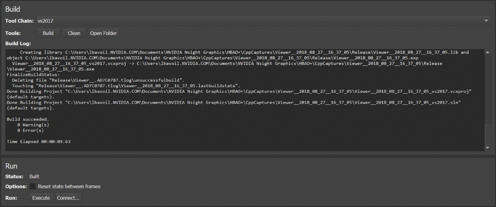

Figure 3. Building a Nsight frame EXE within Nsight Graphics.

Our next step is launching the Range Profiler on a frame-capture EXE by clicking on Frame -> Run -> Connect -> Frame Profiler.

NOTE: For DX12 applications, we recommend taking traces with asynchronous COMPUTE and COPY queues disabled on the application side to avoid asynchronous commands possibly biasing the performance metrics of other workloads executing concurrently on the GPU.

If you want to analyze the overlap of async COMPUTE activities with your DIRECT queue, you can now use our GPU Trace tool which ships with Nsight Graphics since version 2018.4.

Step 2: Breaking Down the GPU Frame Time

Once you’ve launched the Range Profiler on a given frame, you can hit CTRL-Z and Space again to actually profile the frame.

A top-down view of the GPU times is a great way to figure out what perf markers / workloads are the most expensive in a frame. For a [HBAO+](https://developer.nvidia.com/shadowworks) DX11 test app, rendering SSAO in 4K on a GeForce GTX 1080, the GPU-frame-time breakdown looks like this in the Range Profiler View, as shown in figure 4:

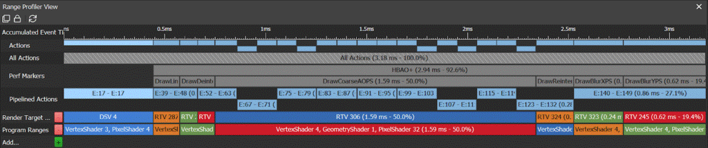(https://devblogs.nvidia.com/wp-content/uploads/2018/09/pasted-image-0-9.png)

Figure 4. Example GPU-frame-time breakdown in the Nsight Range Profiler.

In the “**Perf Markers**” row, the Range Profiler shows the elapsed GPU time per workload measured via D3D timestamp queries, as well as the percentage of the GPU frame time (with the Present call excluded) that each workload is taking. In this example, it’s immediately obvious which workload is most expensive in this frame: “DrawCoarseAOPS”, taking 50.0% of the GPU frame time.

NOTE: Since release 5.5 of Nsight: Visual Studio Edition, the Range Profiler effectively calls SetStablePowerState(TRUE/FALSE) before/after profiling any Range, using an internal driver API that works on all Windows versions (not just Windows 10) and does not require the OS to be in “Developer Mode”. So you should not need to worry about locking your GPU Core clock when using the Nsight Range Profiler.

NOTE: To repro this result, you can download version 3.1 of the HBAO+ source code from [GitHub](https://developer.nvidia.com/shadowworks) and then run the “SampleApp_D3D11” project in Visual Studio. To make the RenderAO call emit perf markers, you can define ENABLE_PERF_MARKERS=1 in GFSDK_SSAO_D3D11 -> Project Properties -> C/C+ -> Preprocessor. For the record, figure 4 shows what the frame looks like:

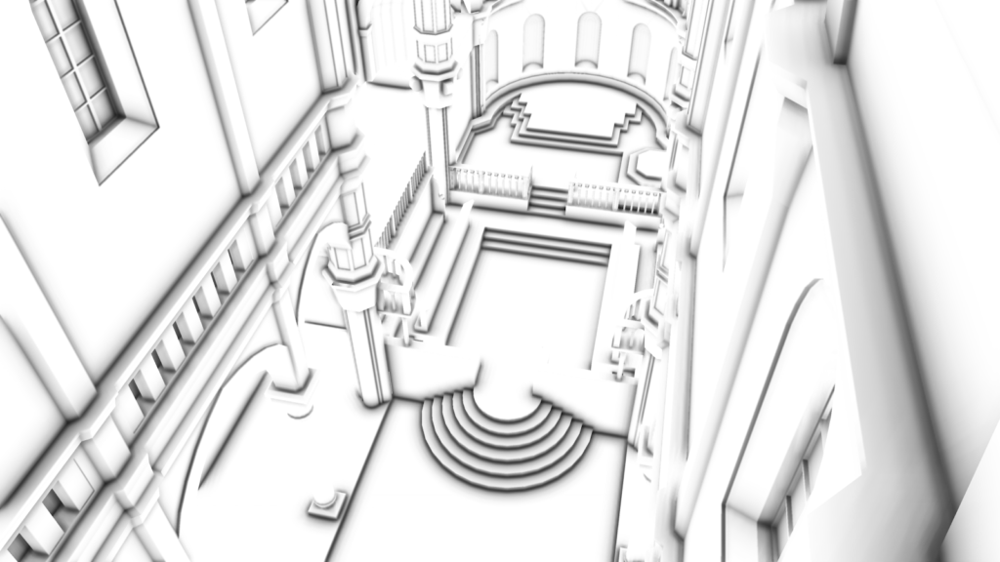(https://devblogs.nvidia.com/wp-content/uploads/2018/09/HBAO_Blog.png)

Figure 5. Looking at HBAO.

Step 3: Profiling a GPU Workload

Now we are in the Range Profiler, let’s invoke the Range Profiler on the “DrawCoarseAOPS” workload from Step 2 (by profiling only this call range, and nothing else) by clicking on the “DrawCoarseAOPS” box, shown in figure 6:

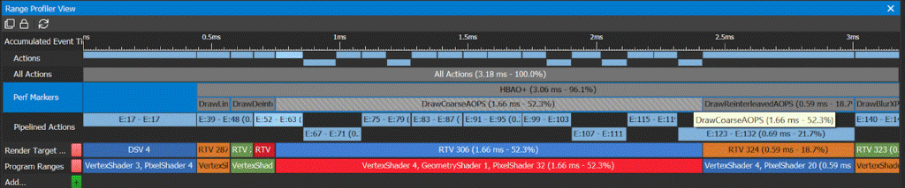

Figure 6. Launching the Nsight Range Profiler for a given workload.

The Range Profiler injects [PerfWorks](https://developer.nvidia.com/perfworks) calls inside the Nsight frame capture and collects a set of PerfWorks metrics for the specified workload. Once the profiling is complete, it shows the collected metrics in a new section below the Range Profiler View.

Step 4: Inspecting the Top SOLs & Cache Hit Rates

We start by inspecting the performance metrics from the Range Profiler for that range. This is just a view of PerfWorks metrics for the current workload. By hovering the mouse over any of the metrics, the actual Perfworks metric name gets displayed in a tooltip as you can see in figure 7:

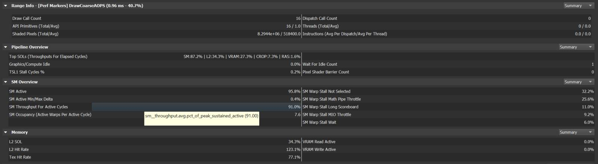(https://devblogs.nvidia.com/wp-content/uploads/2018/11/New_Fig7.png)

Figure 7. Nsight Range Profiler tooltip showing PerfWorks metric names and descriptions.

4.1. The Per-Unit SOL% Metrics

The first top-level metrics to look at for each workload are the per-unit SOL% metrics of the GPU. These convey how close each unit is to its maximum theoretical throughput or Speed Of Light (SOL). At a high level, one can imagine the per-unit SOL% metric as a ratio of achieved throughput to SOL throughput. However, for units with multiple sub-units or concurrent data paths, the per-unit SOL% is the MAX over all the sub-SOL-metrics of all sub-units & data paths.

NOTE: If you are not familiar with the names of the units in our GPUs, please check out this blog post which gives a high-level overview of how the logical graphics pipeline maps to GPU units in our GPU architectures: “[Life of a triangle – NVIDIA’s logical pipeline](https://developer.nvidia.com/content/life-triangle-nvidias-logical-pipeline)”, as well as slides 7-25 from this GTC 2016 presentation: “[GPU-driven rendering](http://on-demand.gputechconf.com/gtc/2016/presentation/s6138-christoph-kubisch-pierre-boudier-gpu-driven-rendering.pdf)”. In this context:

·         PD (Primitive Distributor) does index-buffer loads and distributes primitives across the chip.

·         VAF (Vertex Attribute Fetch) does vertex-buffer loads (before the vertex shader gets launched).

·         SM (Streaming Multiprocessor) runs the shaders.

·         TEX performs SRV fetches (and UAV accesses, since [Maxwell](https://developer.nvidia.com/maxwell-compute-architecture)).

·         VPC (Viewport Culling) does the viewport transform, frustum culling, and perspective correction of attributes.

·         L2 is the Level-2 cache attached to each VRAM memory partition.

·         CROP does color writes & blending to render targets.

·         ZROP does depth-stencil testing.

·         VRAM (“Memory” in the Range Diagram) is the GPU video memory.

NOTE: A simplified view of the graphics pipeline and its mapping to GPU units can be found within the Nsight Range Profiler results, by selecting “Range Diagram” in the Pipeline Overview. In this diagram, the per-unit SOL% values are displayed as green bars, shown in figure 8:

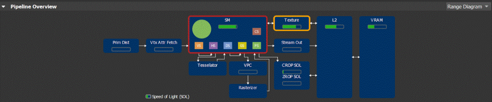(https://devblogs.nvidia.com/wp-content/uploads/2018/09/pasted-image-0-11.png)

Figure 8. Nsight Range Profiler: Pipeline Overview -> Range Diagram.

As you can see in Figure 8, a GPU today is not a simple linear pipeline (A→B→C→…), but rather a network of interconnected units (SM↔TEX↔L2, SM→CROP↔L2, etc). Simple “bottleneck” calculations, which rely on fixed upstream and downstream interfaces for each unit, are not sufficient to reason about GPU performance. Therefore, in doing our analysis, we primarily look at each unit’s SOL% metric to determine units and/or issues limiting performance. The next section will discuss this approach in detail.

4.2. The “Top SOL Units”

In our performance triage method, we always start by looking at the top 5 SOL units and their associated SOL% metrics. These are the top 5 hardware units that limit the GPU performance of this workload. The Nsight Range Profiler shows the top 5 SOL% metrics (aka “Top SOLs”) in the Pipeline Overview – Summary section, shown in figure 9:

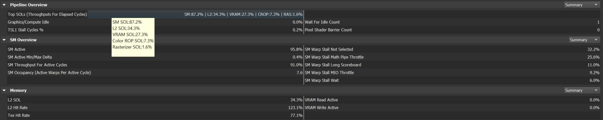(https://devblogs.nvidia.com/wp-content/uploads/2018/11/New_Fig9.png)

Figure 9. Example of “Top SOLs” in the Range Profiler -> Pipeline Overview.

Case 1: Top SOL% > 80%

If the top SOL% value is > 80%, then we know that the profiled workload is running very efficiently (close to max throughput) on the GPU, and to speed it up one should try removing work from the top SOL unit, possibly shifting it to another unit. For example, for workloads with the SM as top SOL unit with SOL% > 80%, one can try skipping groups of instructions opportunistically, or consider moving certain computations to lookup tables. Another example would be [moving structured-buffer loads to constant-buffer loads](https://developer.nvidia.com/content/how-about-constant-buffers) in shaders that are accessing structured buffers uniformly (where all threads load data from the same address), for workloads limited by texture throughput (since structured buffers are loaded via the TEX unit).

Case 2: Top SOL% < 60%

If the top SOL% value is < 60%, this means the top SOL unit and all other GPU units with lower SOL% are under-utilized (idle cycles), running inefficiently (stall cycles), or not hitting their fast paths due to the specifics of the workload they are given. Examples of these situations include:

·         The app being partly CPU limited (see Section [5.1.1](https://devblogs.nvidia.com/the-peak-performance-analysis-method-for-optimizing-any-gpu-workload/#5.1.1)).

·         Lots of Wait For Idle commands or Graphics<->Compute switches draining the GPU pipeline repeatedly (see Section [5.1.2](https://devblogs.nvidia.com/the-peak-performance-analysis-method-for-optimizing-any-gpu-workload/#5.1.2)).

·         TEX fetching from a texture object with a format, dimensionality, or filter mode that makes it run at reduced throughput by design (see these [synthetic benchmarks](http://www.hardware.fr/articles/948-9/performances-theoriques-pixels.html) for GTX 1080). For instance, a 50% TEX SOL% is expected when sampling a 3D texture with tri-linear filtering.

·         Memory-subsystem inefficiencies, such as poor cache hit rates in the TEX or L2 units, sparse VRAM accesses causing a low VRAM SOL%, and VB/IB/CB/TEX fetches from system memory instead of GPU VRAM.

·         Input Assembly fetching a 32-bit index buffer (half-rate compared to 16-bit indices).

NOTE: In this case, we can use the top SOL% value to derive an upper bound on the maximum gain that can be achieved on this workload by reducing inefficiencies: if a given workload is running at 50% of its SOL, and by assuming that one can increase the SOL% up to 90% by reducing internal inefficiencies, we know the max expected gain on the workload is 90/50 = 1.8x = 80%.

Case 3: Top SOL% in [60, 80]

In this case (gray zone), we follow the approaches from both Case 1 (high Top SOL%) and Case 2 (low Top SOL%).

NOTE: The per-unit SOL% metrics are all defined relative to the elapsed GPU cycles (wall clock), which may be different from the active cycles (cycles where that hardware unit is not idle). The main reason we define them relative to elapsed cycles and not per-unit active cycles is to make SOL% metrics comparable, by giving them all a common denominator. Another benefit of defining them relative to elapsed cycles is that any GPU idle cycles that limit the overall GPU performance are reported as a low top SOL% value for that workload (top-level metric in our SOL-guided triage).

4.3. Secondary SOL Units and TEX & L2 Hit Rates

The reason the Nsight Range Profiler is reporting the top 5 SOL units and not just the top one is that it’s possible for multiple hardware units to interact with one another and all limit the performance to some extent. So we recommend manually clustering the SOL units based on their SOL% values. (In practice, a 10% delta seems to work reasonably well to define these clusters, but we recommend doing the clustering manually to not miss anything.)

Note that we also recommend looking at the TEX (L1) and L2 hit rates, which are displayed in the “Memory” section of the Range Profiler. In general, hit rates greater than 90% are great, between 70% and 90% pretty good, and below 70% poor (may limit performance significantly).

Take a look at this full-screen HBAO+ blur workload with the top 5 SOLs:

SM:94.5% | TEX:94.5% | L2:37.3% | CROP:35.9% | VRAM:27.7%

Note how this workload is both SM and TEX limited. And since the SM and TEX SOL% values are identical, we can infer that the SM performance is most likely limited by the throughput of an interface between the SM and TEX units: either SM requests to TEX, or TEX returning data back to the SM.

It has TEX hit rate 88.9% and L2 hit rate 87.3%.

See the study of this workload in the “TEX-Interface Limited Workload” Appendix.

Switching away from the HBAO+ example, here are some typical game-engine workloads that we have recently analyzed.

Look at this SSR workload with top SOLs:

SM:49.1% | L2:36.8% | TEX:35.8% | VRAM:33.5% | CROP:0.0%

This has the SM as primary limiter, and the L2, TEX and VRAM units as secondary limiters, with TEX hit rate 54.6% and L2 hit rate 76.4%. This poor TEX hit rate can explain the low SM SOL%: since the TEX hit rate is poor (most likely due to adjacent pixels fetching far-apart texels), the average TEX latency as seen by the SM is higher that usual and more challenging to hide.

NOTE: Here the active units are actually a dependency chain: SM -> TEX -> L2 -> VRAM.

This tiled-lighting compute shader with top SOLs:

SM:70.4% | L2:67.5% | TEX:49.3% | VRAM:42.6% | CROP:0.0%

See how this has SM & L2 as primary limiters, and TEX & VRAM as secondary limiters, with TEX hit rate 64.3% and L2 hit rate 85.2%.

This shadow-map generation workload with top SOLs:

PD:31.6% | VRAM:19.8% | VPC:19.4% | L2:16.3% | VAF:12.4%

Now the workload is PD-limited (Primitive Distributor) and has a low top SOL%. In this case, changing the index-buffer format from 32 to 16 bits helped a lot. The TEX hit rate was irrelevant because TEX is not in the top 5 SOL units. And the L2 hit rate was 62.6%.

Step 5: Understand the Performance Limiters

Having done the previous step, we know what the Top SOLs (GPU unit names and associated percentage of max throughput) are for each workload of interest, as well as the TEX & L2 hit rates. We know that the top-SOL GPU units are limiting the performance of the workload being studied because these are the units that are running the closest to their maximum throughput. We now need to understand what is limiting the performance of these top-SOL units.

5.1. If the Top SOL% is Low

As outlined above in Section [4.2](https://devblogs.nvidia.com/the-peak-performance-analysis-method-for-optimizing-any-gpu-workload/#4.2), there are multiple possible causes for this. We often refer to these as pathologies. And as with real-life patients, a workload may suffer from multiple pathologies simultaneously. We start by inspecting the values of the following metrics: the “**Graphics/Compute Idle%**” and the “**SM Active %**”.

5.1.1. The “Graphics/Compute Idle%” metric

The “**Graphics/Compute Idle%**” metric is the percentage of the GPU elapsed cycles during which the whole Graphics & Compute hardware pipeline was fully idle for the current workload. These are the GPU cycles during which the graphics/compute pipeline is empty, either because the CPU is not feeding commands fast enough to the GPU or because the application is using the synchronous Copy Engine (which can happen when using Copy calls on a DIRECT queue or immediate context). Note that pipeline drains caused by Wait For Idle commands are not counted as “Graphics/Compute Idle”.

In this case, we recommend to measure the total elapsed CPU time per workload spent on the following CPU calls, and then try to minimize the most expensive ones:

For DX11:

·         Flush{,1}

·         Map

·         UpdateSubresource{,1}

For DX12:

·         Wait

·         ExecuteCommandLists

For DX11 and DX12:

·         Any Create or Release calls

DX11 Notes:

·         ID3D11DeviceContext::Flush forces a command-buffer kickoff, which may require the Flush() call to stall on the CPU.

·         Calling ID3D11DeviceContext::Map on a STAGING resource can cause a CPU stall due to resource contention, when mapping the same staging resource in consecutive frames. In this case, the Map call in the current frame must wait internally until the previous frame (which is using the same resource) has been processed before returning.

·         Calling ID3D11DeviceContext::Map with DX11_MAP_WRITE_DISCARD can cause a CPU stall due to the driver running out of versioning space. That is because each time a Map(WRITE_DISCARD) call is performed, our driver returns a new pointer to a fixed-size memory pool. If the driver runs out of versioning space, the Map call stalls.

DX12 Notes:

·         Each ExecuteCommandLists (ECL) call has some GPU idle overhead associated with it, for kicking off a new command buffer. So, to reduce GPU idle time, we recommend batching all your command lists into as few ECL calls as possible, unless you really want command-buffer kickoffs to happen at certain points in the frame (for example, to reduce input latency in VR apps with a single frame in flight).

·         When an application calls ID3D12CommandQueue::Wait on a fence, the OS (Windows 10) holds off submitting new command buffers to the GPU for that command queue until the Wait call returns.

NOTE: The CPU and GPU times per API call are measured by Nsight and presented in the API Statistics View each time the Range Profiler is launched, shown in figure 10:

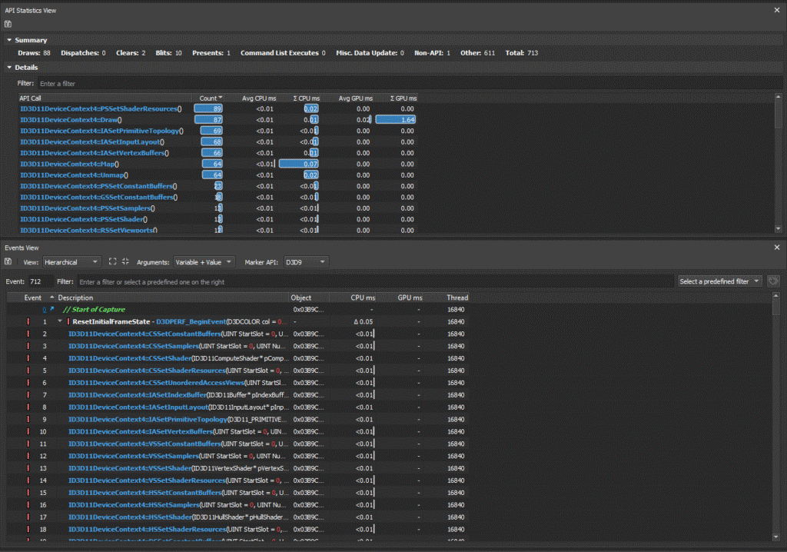(https://devblogs.nvidia.com/wp-content/uploads/2018/09/pasted-image-0-15.png)

Figure 10. CPU & GPU times per API call in the Range Profiler.

5.1.2. The “SM Active%” metric

The “**SM Active%**” metric reports the percentage of GPU elapsed cycles with at least 1 warp (32 threads) active for each SM instance, averaged across all of the SM instances. Note that warps that are waiting on memory requests to come back are accounted as “active” / in flight.

For a full-screen quad or a compute shader workload, the SM should be active for more than 95% of the workload. If not, there may be back-to-back serialized Dispatch calls with low amount of threads per call which are insufficient to fill all the SMs on the GPU, or there may be imbalances between the SMs, with some SMs being idle (no active warp) while others are active (at least one active warp).

If for any geometry-rendering workload, the SM Active% is below 90%, you know it may be possible to get a ~10% performance gain on this workload by overlapping asynchronous Compute work with it. On DX12 and Vulkan, this can be done by using a Compute-only queue. Note that it’s also possible to get a speedup from async compute even if the SM Active% is close to 100%, because the SMs may be tracked as active, but may be able to take on more active warps.

Another reason why the “SM Active%” may be below 90% for any workload is frequent **GPU pipeline drains** (Wait For Idle commands, aka WFIs), which can be caused by:

·         Frequent Compute<->Graphics switches in the same DX11 context or in the same DX12 queue.

·         **Problem**: Switching between Draw and Dispatch calls in the same hardware queue causes a GPU WFI to be executed. Also, performing non-CS state-setting calls in a compute-only workload (e.g. mapping a constant buffer which is bound to both CS and graphics shader stages) can result in WFI being executed.

·         **Solution**: Batch all Compute work and do NOT interleave graphics and compute API calls, including Map(WRITE_DISCARD) calls on “sticky” resources that are bound on all shader stages.

·         On DX11, multiple render calls with the same UAV bound and no “UAV overlap” hints provided to our driver.

·         **Problem**: Subsequent render calls having a bound UAV in common are conservatively separated by GPU WFI commands injected by our driver, to prevent any data hazards.

·         **Solution**: The following calls can be used to disable the insertion of UAV-related WFI commands: NvAPI_D3D11_{Begin,End}UAVOverlap or NvAPI_D3D11_BeginUAVOverlapEx.

·         Note that on DX12, OpenGL & Vulkan, the UAV-related WFIs are explicitly controlled by the application using explicit API calls (ResourceBarrier, glMemoryBarrier, etc).

·         On DX12, ResourceBarrier calls with little work in between the barriers.

·         **Problem**: Each batch of back-to-back ResourceBarrier calls on a given queue can cause all of the GPU work on that queue to be drained.

·         **Solution**: To minimize the performance impact of ResourceBarrier calls, it is important to minimize the number of locations in the frame where ResourceBarrier calls are performed.

·         Hundreds of state changes in workloads using tessellation shaders and/or geometry shader (except for GSs that were created as pass-through Fast GSs, using [NVAPI](http://docs.nvidia.com/gameworks/content/gameworkslibrary/coresdk/nvapi/group__dx.html) for DX11 & DX12, or [NV_geometry_shader_passthrough](https://www.khronos.org/registry/OpenGL/extensions/NV/NV_geometry_shader_passthrough.txt) for GL).

·         **Problem:** Having a lot of state changes with HS & DS active can cause the SMs to be drained, for shader scheduling reasons.

·         **Solution:** Minimize the number of state changes (including resource bindings) in workloads that have tessellation shaders.

5.1.3. GPU Trace

If your application is DX12, you can use our new GPU Trace tool (figure 11) which is part of Nsight Graphics to visualize:

·         The SM warp occupancy (active warps per active cycle) over time. By default, the tool shows the total for the whole GPU, and if you double-click on the GPU label, you get the per-GPC (Graphics Processing Cluster) averaged occupancy, and if you double-click on GPC you get the per-SM occupancy.

·         The average “Graphics/Compute Idle” and “SM Active” metrics over time.

·         On Turing GPUs, GPU Trace also lets you visualize the COPY queue activities.

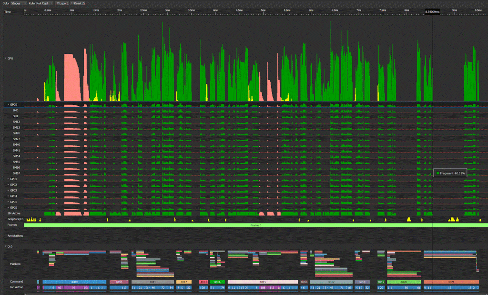

Figure 11. GPU Trace on a DX12 frame.

To use it, just launch your application via Activity -> GPU Trace, and then click on “Generate GPU Trace Capture” within Nsight, and finally Open the trace.

5.2. If the Top SOL Unit is the SM

If the SM is the top SOL unit (or close, in terms of SOL%), we analyze the values of the “SM Throughput For Active Cycles” metric in the Nsight Range Profiler, which is exposed in the User Metrics section of the Range Profiler as:

·         “sm__throughput.avg.pct_of_peak_sustained_active” for Turing GPUs.

·         “sm__active_sol_pct” for pre-Turing GPUs.

(https://devblogs.nvidia.com/wp-content/uploads/2018/11/New_Fig12.png)

Figure 12. The User Metrics section of the Range Profiler.The “SM Throughput for Active Cycles” metric is useful for determining whether a given workload is partly limited by the “SM Occupancy” (Active Warps per Active Cycle”).

5.2.1. Case 1: “SM Throughput For Active Cycles” > 80%

If the SM is the top SOL unit and “**SM Throughput For Active Cycles**” is greater than 80%, then the current workload is mainly limited by the SM scheduler issue rate, and therefore increasing the SM occupancy would not improve performance significantly (at least no more than a 5% gain on the workload).

In this case, the next step of the performance triage process is figuring out what kind of instructions are saturating the bandwidth of the SM scheduler. Typically, that’s the math instructions (FP32 or integer ops), but that can also be memory instructions such as texture fetches or shared-memory accesses. Also, it is unlikely that TEX instructions (SRV & UAV accesses) are limiting the performance for workloads with the SM as top SOL unit and SM Throughput for Active Cycles > 80%, unless the TEX unit also has a SOL% value close to the one of the SM.

5.2.2. Case 2: “SM Throughput For Active Cycles” < 60%

As described [on slide 15](http://on-demand.gputechconf.com/gtc/2013/presentations/S3466-Programming-Guidelines-GPU-Architecture.pdf#page=15) in this [GTC 2013 talk](http://on-demand.gputechconf.com/gtc/2013/video/S3466-Performance-Optimization-Guidelines-GPU-Architecture-Details.mp4) on the 14th minute, when a given warp instruction cannot be issued (because its operands are not ready or because the pipeline sub-unit it needs for execution is not ready — we call this a warp stall), then the SM instruction scheduler tries to hide latency by switching to a different active warp. So there are two ways one can help the SM scheduler issue more instructions per SM active cycle:

1) Increasing the SM occupancy (number of active warps the scheduler can switch to) and

2) Reducing the SM issue-stall latencies (so warps stay in the stalled state for fewer cycles).

**Approach 1: Increasing the SM Occupancy**

If the SM is the top SOL unit (or close), “**SM Throughput for Active Cycles**” < 60%, then increasing the SM occupancy should improve performance.o increase the SM occupancy, one must first figure out what is limiting it.

The most common SM-occupancy limiter for pixel and compute shaders is the number of hardware registers per thread used by the shader.

The impact of hardware register count on the maximum theoretical occupancy (number of active warps per active cycles) is available in our CUDA Occupancy Calculator. Figure 13 outlines theoretical occupancy graphs for “Compute Capability” 6.1, which includes all of GeForce GTX 10XX and Quadro Pxxxx GPUs (GP10X):

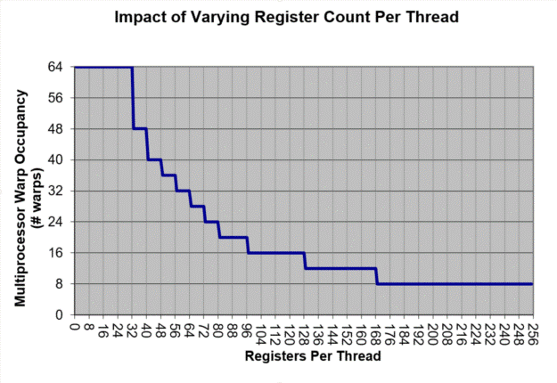](https://devblogs.nvidia.com/wp-content/uploads/2018/09/pasted-image-0-6.png)

Figure 13. Graph from the CUDA Occupancy Calculator for “Compute Capability” 6.1.

Other than registers, the following resources can also limit the SM occupancy on Maxwell, Pascal and Volta GPUs:

·         For graphics shaders:

·         The total size of the Vertex Shader output attributes.

·         The total size of the Pixel Shader input attributes.

·         The total sizes of the input & output attributes of the HS, DS or GS.

·         For Pixel Shaders, out-of-order completion of pixel warps (typically due to dynamic control flow such as dynamic loops or early-exit branches). Note that CSs do not have this issue as much, since CS thread groups can complete in arbitrary order. See slide 39 from our GDC 2016 talk on “[Practical DirectX 12](https://developer.nvidia.com/sites/default/files/akamai/gameworks/blog/GDC16/GDC16_gthomas_adunn_Practical_DX12.pdf)” by Gareth Thomas & Alex Dunn.

·         For compute shaders:

·         The thread-group size can directly impact the SM occupancy since warps of a thread group launch on the SM in an all-or-none fashion (i.e. all warps of a thread-group have the necessary resources available and will launch together, or none will). The larger the thread-group size, the coarser the quantization of resources like shared memory and register file. While some algorithms may genuinely require large thread groups, in all other cases, developers should try to restrict thread-group sizes to 64 or 32 threads as much as possible. That’s because thread groups of size 64 or 32 threads give the most flexibility to our shader compiler in picking the best possible register target for a shader program.

·         Furthermore, for shaders with high register usage (>= 64) and with high thread-group barrier stall times in the SM (GroupMemoryBarrierWithGroupSync() in HLSL), lowering the thread-group size to 32 may produce a speedup compared to 64. The >= 64 register guidance ensures that the 32 max thread-groups per SM limit (architecture-dependent “Thread Blocks / Multiprocessor” limit in the [CUDA Occupancy Calculator](https://developer.download.nvidia.com/compute/cuda/CUDA_Occupancy_calculator.xls)) does not become the primary SM occupancy limiter.

·         The total number of shared-memory bytes allocated per thread group can also directly impact the SM occupancy, as can be seen by plugging in various numbers into the [CUDA Occupancy Calculator](https://developer.download.nvidia.com/compute/cuda/CUDA_Occupancy_calculator.xls).

·         Finally, for sequences of Dispatch calls with short shaders (e.g. a TEX instruction and a couple of math instructions), the SM occupancy may be limited by the thread-group launch rate in upstream units. In this case, merging consecutive Dispatch calls may help.

Our CUDA Nsight documentation page on [Achieved Occupancy](https://docs.nvidia.com/gameworks/content/developertools/desktop/analysis/report/cudaexperiments/kernellevel/achievedoccupancy.htm) includes a couple of additional possible SM occupancy limiters for Compute Shaders:

·         Unbalanced workload within thread groups.

·         Too few thread groups launched. This can also be a problem for graphics shaders that do not launch enough warps to fully occupy the SMs in-between GPU Wait For Idles.

NOTE: There are actually two approaches to reducing thread-group sizes:

·         Approach 1: Lowering the thread-group size by a factor of N and simultaneously increasing grid launch dimensions by N. See above.

·         Approach 2: Merging the work of N>=2 threads into a single thread. This allows sharing common data between the N merged threads via registers, or performing reductions in registers instead of in shared memory with atomic ops (e.g. [InterlockedMin](https://msdn.microsoft.com/en-us/library/windows/desktop/ff471413(v=vs.85).aspx) in HLSL). Besides, this approach also has the advantage of automatically amortizing thread-group-uniform operations across the N merged threads. However, one should be wary of the likelihood of register bloat from this approach.

NOTE: If you want to get a sense of whether your SM occupancy for a given workload is mainly register-count limited for some full-screen Pixel Shader or some Compute Shader, you can do the following:

·         Do Add… “Program Ranges” in the Scrubber and find the shader-program range you are interested in studying. Right-click on your Program Range, launch the Range Profiler and check the “**SM Occupancy**” value in the Pipeline Overview Summary.

·         Select some render call in your Range by clicking on the “Time (ms)” line in the Scrubber. Switch tab to the API Inspector, select the shader stage that takes most of the cycles in the workload (PS or CS), and click on the “Stats” link next to the shader name.

·         This opens up the “Shaders” Nsight window (see figure 14 below) which shows the hardware register count for the shader, in the “Regs” column. Note that you may need to wait for a few seconds for the shader stats to get populated.

·         Lookup the Max Theoretical Occupancy associated with this register count by using the CUDA Occupancy Calculator graph from Figure 13, and compare it to the actual “SM Occupancy” reported by the Range Profiler for this shader.

·         If the achieved occupancy is much lower than the max occupancy, then you know the SM occupancy is limited by something else than just the amount of registers per thread.

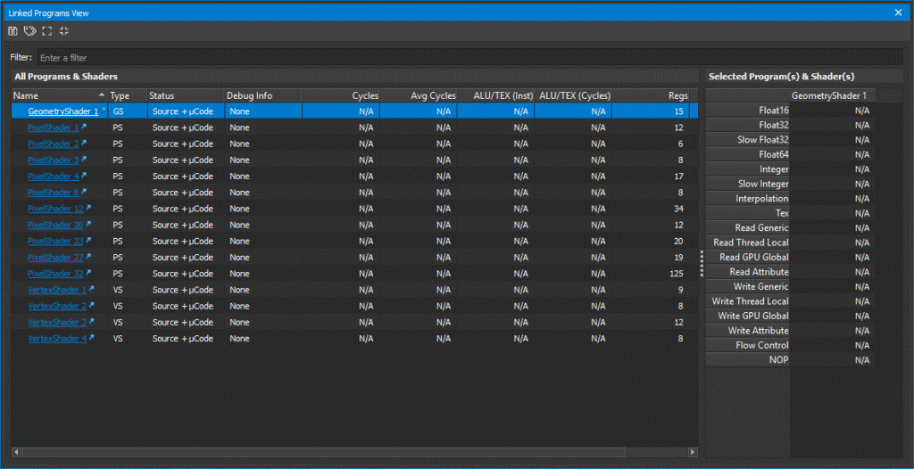

Figure 14. Nsight’s “Linked Programs View”, showing hardware register counts per shader in the “Regs” column.

 

To reduce the total number of registers allocated for a given shader, one can look at the DX shader assembly and study the number of registers used in each branch of the shader. The hardware needs to allocate registers for the most register-hungry branch, and the warps that skip that branch run with a sub-optimal SM occupancy.

For full-screen passes (pixel or compute shaders), a typical way to address this problem is to run a pre-pass that classifies the pixels into different regions and run different shader permutations for each region:

·         For compute shaders, this SIGGRAPH 2016 presentation describes a solution using DispatchIndirect calls to apply specialized compute shaders to different tiles on screen, with a variable number of thread blocks per shader permutation:
 “[Deferred Lighting in Uncharted 4](http://advances.realtimerendering.com/s2016/s16_ramy_final.pptx)” – Ramy El Garawany (Naughty Dog).

·         For pixel shaders, a different specialization approach can be used: a full-screen stencil buffer can be filled up in a pre-pass to classify the pixels. Then, multiple draw calls can be performed efficiently, by relying on the stencil test to happen before the pixel-shader execution (which should be done automatically by our driver), and using stencil tests that discard the pixels that the current shader permutation does not touch. This GDC 2013 presentation uses this approach to optimize MSAA deferred rendering: “[The Rendering Technologies of Crysis 3](http://www.crytek.com/cryengine/presentations/the-rendering-technologies-of-crysis-3)” – Tiago Sousa, Carsten Wenzel, Chris Raine (Crytek).

Finally, to better understand the SM occupancy limitedness of a given compute shader, you can use our [CUDA Occupancy Calculator](https://developer.download.nvidia.com/compute/cuda/CUDA_Occupancy_calculator.xls) spreadsheet. To use it, just fill in the [CUDA Compute Capability](https://en.wikipedia.org/wiki/CUDA) for your GPU, as well as the resource usage for your shader (thread-group size, register count from the Shader View, and shared-memory size in bytes).

**Approach 2: Reducing the SM issue-stall latencies**

There is another way to increase the SM Throughput For Active Cycles other than increasing the SM occupancy: by reducing the number of SM issue-stall cycles. These are the SM active cycles between instruction issue cycles during which a warp instruction is stalled, due to one of its operands not being ready or due to resource contention on the datapath that this instruction needs to be executed on.

The PerfWorks metrics smsp__warp_cycles_per_issue_stall_{reason} show the avg cycles between instruction issues that a warp is stalled for {reason}. The PerfWorks metric smsp__warp_stall_{reason}_pct is the % of active warps stalled for that reason per cycle. These metrics are exposed in the User Metrics section of the Range Profiler, as well as in the SM Overview Summary section of the profiler, sorted in decreasing order. Amongst these possible warp-stall reasons, the following are common:

\1.    The “smsp__warp_stall_long_scoreboard_pct” PerfWorks metric is the percentage of active warps that were stalled waiting for a scoreboard dependency on a L1TEX (local, global, surface, tex) operation.

\2.    The “smsp__warp_stall_barrier_pct” PerfWorks metric is the percentage of active warps that were stalled waiting for sibling warps at a thread-group barrier. In this case, lowering the thread-group size may improve performance, which can sometimes be done by making each thread process multiple input elements.

If “sm__issue_active_per_active_cycle_sol_pct” is lower than 80% and “smsp__warp_stall_long_scoreboard_pct” is the top warp-stall reason, then you know that the shader is TEX-latency limited. This means that that most of the stall cycles are coming from the dependencies with texture fetch results, In this case:

\1.    If the shader contains a loop for which the number of iterations can be known at shader compilation time (possibly by using different shader permutations per loop count), then try forcing FXC to fully unroll the loop by using the [[unroll\]](https://msdn.microsoft.com/en-us/library/windows/desktop/bb509602(v=vs.85).aspx) loop attribute in the HLSL.

\2.    If your shader is doing a dynamic loop that cannot be fully unrolled (e.g. a ray-marching loop), try batching the texture-fetch instructions to reduce the number of TEX-dependency stalls (by grouping independent texture fetches in batches of 2 to 4 back-to-back instructions at the HLSL level).
 See the “Optimizing Ray-Marching Loops” Appendix.

\3.    If your shader is iterating through all of the MSAA sub-samples per pixel for a given texture, fetch all of the sub-samples together, in a single batch of TEX instructions for that texture. Since the MSAA sub-samples are stored next to each other in VRAM, fetching them together maximizes the TEX hit rate.

\4.    If the texture loads are based on a conditional, that most of the time is expected to be true (e.g if (idx < maxidx) loadData(idx)), consider enforcing the load and clamping the coordinate ( loadData(min(idx,maxidx-1)) ).

\5.    Try reducing the TEX latency by improving the TEX and L2 cache hit rates. The TEX & L2 hit rates can be improved by tweaking sampling patterns to make adjacent pixels/threads fetch more adjacent texels, by using mipmaps if applicable, as well as by reducing texture dimensions & using more compact texture formats.

\6.    Try reducing the number of executed TEX instructions (possibly using branches per texture instruction, which get compiled as TEX instruction predicates, see the FXAA 3.11 HLSL for an example, e.g.: “if(!doneN) lumaEndN = FxaaLuma(…);”).

5.2.3. Case 3: SM Throughput For Active Cycles % in [60,80]

In this case, we follow the approaches from both Case 1 (high SM throughput) and Case 2 (low SM throughput).

5.3. If the Top SOL unit is not the SM

5.3.1. If the Top SOL unit is TEX, L2, or VRAM

If the top SOL unit is not the SM but is one of the memory-subsystem units (TEX-L1, L2, and VRAM), then it’s possible that the root cause of the poor performance is TEX or L2 cache thrashing caused by a non-GPU-friendly access pattern (typically, with adjacent threads in a warp accessing far-apart memory). In this case, the top limiting unit may be TEX or L2, but the root cause may be in the shaders executed by the SM, so it’s worth triaging the SM performance using the method from Section [5.2](https://devblogs.nvidia.com/the-peak-performance-analysis-method-for-optimizing-any-gpu-workload/#5.2) (if the Top SOL unit is the SM).

If the top SOL unit is the VRAM, and its SOL% value is not poor (>60%), then this workload is VRAM-throughput limited and merging it with another pass should speedup the frame. A typical example is merging a gamma-correction pass with another post-processing pass.

5.3.2. If the Top SOL unit is CROP or ZROP

If CROP is the Top SOL unit, you can try using smaller render target format (e.g R11G11B10F instead of RGBA16F), and if you are using Multiple Render Targets, you can try reducing the number of render targets. Also, killing pixels in the pixel shader more aggressively may be worth it (for instance, for certain transparency effects, discarding pixels that have less than 1% opacity). See this blog post for more possible strategies for optimizing transparency rendering: “[Transparency (or Translucency) Rendering](https://developer.nvidia.com/content/transparency-or-translucency-rendering)”.

If ZROP is the Top SOL unit, you can try using a smaller depth format (e.g. D16 instead of D24X8 for shadow maps, or D24S8 instead of D32S8), as well as drawing opaque objects more in front-to-back order so that ZCULL (coarse-granularity depth test) has a chance to discard more pixels before ZROP & the pixel shader get invoked.

5.3.3. If the Top SOL unit is PD

As mentioned earlier, PD does index-buffer loads, to gather the input indices of the vertices. If PD is the Top SOL unit, you can try using 16-bit index buffers instead of 32-bit ones. If that does not increase the PD SOL%, you can then try optimizing geometry for vertex reuse and locality.

5.3.4. If the Top SOL unit is VAF

In this case, reducing the number of vertex-shader input attributes should help.

Also, separating out the position stream from the rest of the attributes may be beneficial for z-only or shadow map rendering.

Summary

To wrap up, our SOL-guided performance triage method does the following, for any given GPU workload:

·         Check the “**Top SOL%”** value (Sections [4.2](https://devblogs.nvidia.com/the-peak-performance-analysis-method-for-optimizing-any-gpu-workload/#4.2) and [4.3](https://devblogs.nvidia.com/the-peak-performance-analysis-method-for-optimizing-any-gpu-workload/#4.3)).

·         If > 80% => (A) try removing work from the top SOL unit (Section [5.2.1](https://devblogs.nvidia.com/the-peak-performance-analysis-method-for-optimizing-any-gpu-workload/#5.2.1)).

·         If < 60% => (B) try increasing the top SOL% (Sections [5.2.2](https://devblogs.nvidia.com/the-peak-performance-analysis-method-for-optimizing-any-gpu-workload/#5.2.2) and [5.1](https://devblogs.nvidia.com/the-peak-performance-analysis-method-for-optimizing-any-gpu-workload/#5.1)).

·         Else do both (A) and (B).

·         If the SM is the Top SOL unit (or close, in terms of SOL%):

·         Check the “**SM Throughput for Active Cycles**” value.

·         If > 80% => (C) try skipping groups of instructions opportunistically or consider moving certain computations to lookup tables (Section [5.2.1](https://devblogs.nvidia.com/the-peak-performance-analysis-method-for-optimizing-any-gpu-workload/#5.2.1)).

·         If < 60% => (D) try increasing the SM occupancy (number of active warps in flight) & reducing the number of SM issue-stall cycles (Section [5.2.2](https://devblogs.nvidia.com/the-peak-performance-analysis-method-for-optimizing-any-gpu-workload/#5.2.2)).

·         Else do both (C) and (D).

·         If some other unit is the Top SOL unit, try reducing the amount of work sent to this unit. (see Section [5.3](https://devblogs.nvidia.com/the-peak-performance-analysis-method-for-optimizing-any-gpu-workload/#5.3)).

To use this method, all you need to have is [Nsight Visual Studio Edition](https://developer.nvidia.com/nsight-visual-studio-edition) or [Nsight Graphics](https://developer.nvidia.com/nsight-graphics), as well as the latest available graphics drivers installed.

Appendix: Performance Triage Examples

Example 1: TEX-Interface Limited Workload

The HBAO+ “DrawBlurXPS” full-screen pixel shader workload running on GTX 1060 6GB @1506 Mhz has the following metrics in the Nsight Range Profiler:

·         Top SOLs: SM:94.5% | TEX:94.5% | L2:37.2% | VRAM:27.6%

·         Graphics/Compute Idle: 0.0% => not CPU limited (see Section [5.1.1](https://devblogs.nvidia.com/the-peak-performance-analysis-method-for-optimizing-any-gpu-workload/#5.1.1))

·         SM Active: 99.3% => no SM idleness issue (see Section [5.1.2](https://devblogs.nvidia.com/the-peak-performance-analysis-method-for-optimizing-any-gpu-workload/#5.1.2))

·         SM Throughput For Active Cycles: 95.0%

·         SM Occupancy: 62.2 active warps per active cycle

·         TEX hit rate: 88.9%

·         L2 hit rate: 87.3%

Analysis:

·         Because the SM SOL% and TEX SOL% are both so close (equal actually), we know that the workload is limited by the throughput of an interface between the SM and TEX units.

·         Because the SM & TEX SOL%s are so high (94.5%), we know that the workload is completely limited by the throughputs of the SM & TEX units (95% is as high as SOL% values get in practice).

·         Because the SM Throughput For Active Cycles is much greater than 80%, we know that increasing the SM occupancy (number of active warps per active cycle) would not help.

·         The TEX & L2 hit rates are good (close to 90%).

**Conclusion:** This workload is primarily limited by the bandwidth of an SM-TEX interface and the only way to speed it up significantly is to reduce the number of executed TEX instructions (e.g. by using Gather instructions to do 4 single-channel loads in one TEX instruction, or by calculating multiple output values per thread and sharing texture samples via registers).

Example 2: Math-Limited workload

The HBAO+ “DrawCoarseAOPS” workload has the following metrics in the Range Profiler on GTX 1060 @ 1506 Mhz:

·         Top SOLs: SM:93.4% | TEX:71.9% | L2:50.1% | VRAM:27.3% | CROP:3.6%

·         Graphics/Compute Idle: 0.0% => not CPU limited (see section [5.1.1](https://devblogs.nvidia.com/the-peak-performance-analysis-method-for-optimizing-any-gpu-workload/#5.1.1))

·         SM Active: 99.8% => no SM idleness issue (see section [5.1.2](https://devblogs.nvidia.com/the-peak-performance-analysis-method-for-optimizing-any-gpu-workload/#5.2.2))

Top SOL analysis:

·         The top SOL unit is the SM, which is running at 93.4% of its maximum throughput, and the secondary SOL units (TEX, L2 and VRAM) are more than 20% behind the SM SOL, so we know that the workload is mainly SM-throughput limited.

·         The second top limiter is the TEX unit, running at 71.9% of its maximum throughput.

Now, let’s make the following thought experiment: if the TEX unit in this GPU was somehow made infinitely fast, the workload would still be limited by the SM at 93% of the SM SOL. Some of that work is typically texture fetches from shaders, so if the TEX unit was made infinitely fast and the SM was initially limited by the TEX latency, the SM SOL may increase. But because 95% is as high as SOL% values get in practice, we know that there is no way the SM SOL% can increase significantly by making any other units go faster (or process less work), and therefore we know that the only way to speedup this workload significantly is to figure out what are the internal performance limiters within the SM.

Additional analysis:

\1.    Because “SM Throughput for Active Cycles” > 80%, we know that the workload is not significantly limited by the SM occupancy, that is, increasing the number of active warps per active cycles would not significantly improve performance.

\2.    The Warp Stall reasons do not matter since the performance is mainly issue-throughput limited (“SM Throughput For Active Cycles” > 80%), and not warp-latency limited.

\3.    We can infer that the performance is not primarily limited by the TEX unit, otherwise we would have the TEX SOL% value being much closer to the SM SOL% value.

**Conclusion:** This workload is primarily limited by the number of math instructions (FP32 ops and/or integer ops and/or other math ops such as rsqrt, pow, cos/sin, etc) in the shader. To speed it up, one needs to find a way to somehow shade less pixels or execute less math instructions per pixel.

Example 3: TEX-Latency Limited workload

Now, let’s take a look at the “Advanced Motion Blur” DX11 SDK sample from <https://github.com/NVIDIAGameWorks/D3DSamples>

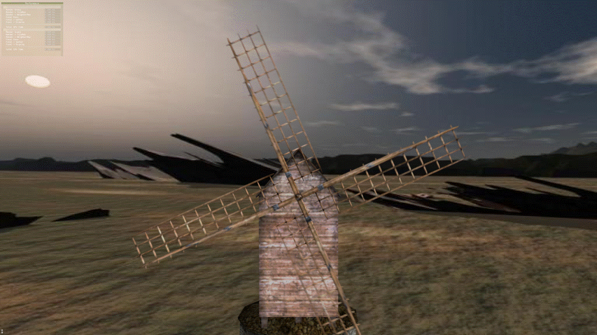

Figure 15. Advanced motion blur example.

By default, the app is running in 720p windowed mode. To make it start in 4K full-screen mode, I’ve made the following edit in main.cpp:

\#if 0
      deviceParams.startfull-screen = false;
      deviceParams.backBufferWidth = 1280;
      deviceParams.backBufferHeight = 720;
 \#else
      deviceParams.startfull-screen = **true**;
      deviceParams.backBufferWidth = 3840;
      deviceParams.backBufferHeight = 2160;
 \#endif

Next, we can manually insert a workload marker in main.cpp, which will be intercepted by NSight and become a “Perf Marker” Range in the Range Profiler:

**if** (g_view_mode == VIEW_MODE_FINAL
 {
      D3DPERF_BeginEvent(0x0, L"Final Pass");
      //...
      ctx --> Draw(6,0)
      D3DPERF_EndEvent();
 }

And finally we can profile this workload using the Nsight Range Profiler. On GTX 1060 @ 1506 Mhz, the Range Profiler provides the following metrics:

·         Top SOLs: SM:40.7% | TEX:39.8% | L2:36.3% | CROP:26.4% | VRAM:25.7%

·         GPU Elapsed Time: 0.70 ms

·         GPU Idle: 0.2% => not CPU limited (see section [5.1.1](https://devblogs.nvidia.com/the-peak-performance-analysis-method-for-optimizing-any-gpu-workload/#5.1.1))

·         SM Active: 97.4% => no SM idleness issue (see section [5.1.2](https://devblogs.nvidia.com/the-peak-performance-analysis-method-for-optimizing-any-gpu-workload/#5.1.2))

·         SM Throughput for Active Cycles: 43.0%

·         SM Occupancy: 37.0 active warps per active cycle

·         Top Warp Stall Reason: Long Scoreboard: 65.7%

·         TEX hit rate: 80.1%

·         L2 hit rate: 83.0%

Analysis:

·         The top SOL% units are SM and TEX.

·         The top SOL% value is below 60%, so this workload is running inefficiently on the GPU.

·         The workload is completely **TEX-latency limited** because “SM Throughput for Active Cycles” is far below 60%, the top warp-stall reason is the Long Scoreboard, and that Warp Stall Long Scoreboard% is  much higher than 10%.

·         The workload is also **SM-occupancy limited** (meaning having more active warps in flight should improve performance), since the top SOL unit is the SM, “SM SOL%” < 80% and “SM Throughput For Active Cycles” < 60% (see section [5.2.2](https://devblogs.nvidia.com/the-peak-performance-analysis-method-for-optimizing-any-gpu-workload/#5.2.2)).

·         The TEX & L2 hit rates are good.

Experiment: Removing the Early Exit

From Section [5.2.2](https://devblogs.nvidia.com/the-peak-performance-analysis-method-for-optimizing-any-gpu-workload/#5.2.2), we know that for workloads with the SM as top SOL unit, “SM SOL%” < 80% and “SM Throughput for Active Cycles” < 60%, and “Long Scoreboard” is the top warp-stall reason, the performance may be limited by:

·         High TEX latencies (due to not having enough Instruction Level Parallelism to hide the instruction latencies), and/or

·         Low SM occupancy (due to not having enough active warps to hide the issue stalls).

Let us determine the main cause of the low SM occupancy first. We know that this pixel shader has an early-exit branch, and by outputting a debug color if the branch is taken, we can see that most of the pixels are taking the early exit. We also know from Section [5.2.2](https://devblogs.nvidia.com/the-peak-performance-analysis-method-for-optimizing-any-gpu-workload/#5.2.2) that out-of-order pixel-shader warp completion (compared to their launch order) can limit the SM occupancy.

To verify that the early-exit branch is actually limiting the occupancy, let us do the experiment of simply removing it from the pixel shader (ps_gather.hlsl):

\#if 0
      // If the velocities are too short, we simply show the color texel and exit
      if (TempNX < HALF_VELOCITY_CUTOFF)
      {
            return CX;
      }
 \#endif

| Metric                            | New   value   | Old   value | New   / Old |
| --------------------------------- | ------------- | ----------- | ----------- |
| GPU   Elapsed Time                | **5.05   ms** | 0.70   ms   | 7.21x       |
| Top   SOL[0]                      | SM:47.2%      | SM:40.7%    | 1.16x       |
| Top   SOL[1]                      | TEX:39.2%     | TEX:39.8%   | 0.01x       |
| SM   Active                       | **99.7%**     | 94.9%       | 1.05x       |
| SM   Throughput for Active Cycles | 47.3%         | 43.0%       | 1.10x       |
| SM   Warp Stall Long Scoreboard   | 76.3%         | 63.5%       | 1.20x       |
| SM   Occupancy                    | **62.0**      | 37.0        | 1.68x       |
| TEX   hit rate                    | **85.8%**     | 80.1%       | 1.07x       |
| L2   hit rate                     | **95.2%**     | 83.0%       | 1.15x       |

Table 1. New metrics with the early-exit branch removed.

We see that the new workload is still **SM-occupancy limited,** but the occupancy (62.0) is reaching the hardware limit (64.0). And even with this maxed-out occupancy, we see that the workload is still **TEX-latency limited** with top SOL units SM & TEX.

Obviously, the workload has become 7x slower due to the removal of the early exit, but that’s OK because we want to study its performance limiters this way. This is actually an approach we often use to analyze workloads that we expect have multiple performance issues: if the initial problem is too complex and the root-cause of the low SOL%s are not clear, we simplify the problem (in this case by removing the expected root cause of the low occupancy), and redo the analysis on the simpler problem until the top SOL%s become good. This is effectively a [Divide And Conquer](https://en.wikipedia.org/wiki/Divide_and_conquer_algorithm) performance-debugging approach. By taking a medical analogy, we are eliminating one pathology in order to make the analysis of other pathologies clearer and free of “cross talk”.

Note that there is a risk that performance optimizations that work for the simplified problems may not speedup the original problem. But we think that even if that happens, the analysis of the simpler problem is still very much worth having in most cases because not only does it help us verify that our understanding of the performance issues is correct, but it can also help re-architecting a rendering algorithm for avoiding GPU performance inefficiencies.

Conclusion:

The main reason for the poor SM occupancy in this workload is that the pixel-shader has an early-exit. Moving this pixel shader to a compute shader can alleviate this problem (warps that complete sooner than others within a given thread group would still limit the SM occupancy), but would also add some overhead for writing out the results via UAV write instructions.

Alternatively, using the stencil-masking approach described in Section [5.2.2](https://devblogs.nvidia.com/the-peak-performance-analysis-method-for-optimizing-any-gpu-workload/#5.2.2) should also help in this case, as it would make the full-screen pixel shader process the complex pixels only and all of these pixels would complete in launch order.

Optimization 1: Using R11G11B10F instead of RGBA16F

The original SDK sample app uses the RGBA16F texture format to store HDR colors, and these are the colors that are filtered by the Motion Blur “Final Pass”.

Because the alpha channel of this RGBA16F texture is never actually used by this application, we can change it to the more compact R11G11B10F format, which produces output images that look the same in this case. Implementing this optimization is just a format change in main.cpp:

CreateTextureWithViews(
 device, surface_desc->Width, surface_desc->Height,
 \#if 0
      DXGI_FORMAT_R16G16B16A16_FLOAT,
      DXGI_FORMAT_R16G16B16A16_FLOAT,
      DXGI_FORMAT_R16G16B16A16_FLOAT,
 \#else
      DXGI_FORMAT_R11G11B10_FLOAT,
      DXGI_FORMAT_R11G11B10_FLOAT,
      DXGI_FORMAT_R11G11B10_FLOAT,
 \#endif

Doing that helps reduce the TEX latency (“Warp Stall Long Scoreboard”) of the color fetches by increasing the TEX hit rate:

| Metrics                           | New   values  | Old   values  | New   / Old |
| --------------------------------- | ------------- | ------------- | ----------- |
| GPU   Elapsed Time                | **4.25   ms** | **5.05   ms** | 19% gain    |
| Top   SOL[0]                      | **SM:63.7%**  | SM:47.2%      | 1.35x       |
| Top   SOL[1]                      | **TEX:52.9%** | TEX:39.2%     | 1.35x       |
| SM   Active                       | 99.9%         | 99.7%         | 1.00x       |
| SM   Throughput for Active Cycles | **62.9%**     | **47.3%**     | 1.33x       |
| SM   Warp Stall Long Scoreboard   | **71.2%**     | **76.3%**     | 0.93        |
| SM   Occupancy                    | 62.8          | 62.0          | 1.01x       |
| TEX   hit rate                    | **94.2%**     | **85.8%**     | 1.10x       |
| L2   hit rate                     | **91.5%**     | **95.2%**     | 0.96x       |

Table 2. New metrics with the color format reduced from RGBA16F to R11G11B10F.

Optimization 2: Loop Unrolling

Now, let’s look that the HLSL for this full-screen pixel shader. It contains the following loop with 3 texture fetches per loop iteration and a dynamic branch that skips the loop body for a certain loop iteration index:

for (int i = 0; i < c_S; ++i)
 {
      // Skip the same fragment
      If (i == SelfIndex) { continue; }
      //…

float2 VY = readBiasScale(texVelocity.SampleLevel(sampPointClamp, Y, 0).xy);
      //…

float ZY = getDepth(Y);
      //…
      Weight += alphaY;
      Sum += (alphaY * texColor.SampleLevel(sampLinearClamp, Y, 0).xyz);
 }

Running this HLSL through FXC with the following command line:

fxc /T ps_5_0 /Ges /O3 ps_gather.hlsl

… produces the following control flow & texture fetches in the DXASM:

loop
    itof r5.w, r4.w
    ge r6.x, r5.w, cb0[21].z
    breakc_nz r6.x
    ieq r6.x, r3.x, r4.w
    if_nz r6.x
      mov r4.w, r3.w
      continue
    endif>
    ...
    sample_l_indexable(texture2d)(float,float,float,float) r6.zw, r6.xyxx, t2.zwxy, s1, l(0.000000)
    ...
    sample_l_indexable(texture2d)(float,float,float,float) r6.w, r6.xyxx, t1.yzwx, s1, l(0.000000)
    ...
    sample_l_indexable(texture2d)(float,float,float,float) r6.xyz, r6.xyxx, t0.xyzw, s2, l(0.000000)
    mad r5.xyz, r5.wwww, r6.xyzx, r5.xyzx
    iadd r4.w, r4.w, l(1)
 endloop

We know that this workload is partly TEX latency limited. That happens because there are not enough instructions between the texture fetches and the dependent math instructions. To let our shader compiler better schedule the texture instructions, this loop needs to be unrolled, so our compiler knows that all of the texture fetches will be executed and can decide how to schedule them (possibly batching multiple texture fetches together) to try to best cover the latency of the texture instructions with independent math instructions.

In this case, the number of loop iterations (“c_S”) must be known at the FXC compilation time, which is not the case in the original shader where c_S is a constant-buffer value.

The “c_s” constant is stored in a constant buffer, but because this value does not change from frame to frame, it is possible to generate permutations of this pixel shader for different c_s constants, or just hard-code the value with a #define, like this:

\#if 0
      float c_S;
 \#else
      \#define c_S 15
      **float** c_S_unused;
 \#endif

Now that c_S is known at FXC compilation time, the for() loop can then be fully unrolled using the [unroll] HLSL keyword, like this:

​        **[unroll]** for (int i = 0; i < c_S; ++i)

| Metrics                           | New   values  | Old   values  | New   / Old |
| --------------------------------- | ------------- | ------------- | ----------- |
| GPU   Elapsed Time                | **3.44   ms** | **4.25   ms** | 24%   gain  |
| Top   SOL[0]                      | **SM:81.9%**  | **SM:63.7%**  | 1.37x       |
| Top   SOL[1]                      | **TEX:81.9%** | **TEX:52.9%** | 1.65x       |
| SM   Active                       | 99.9%         | 99.9%         | 1.00x       |
| SM   Throughput for Active Cycles | 82.1%         | 62.9%         | 1.31x       |
| SM   Warp Stall Long Scoreboard   | **64.7%**     | **71.2%**     | 0.91x       |
| SM   Occupancy                    | 45.6          | 62.8          | 0.72x       |
| TEX   hit rate                    | **96.2%**     | **94.2%**     | 1.02x       |
| L2   hit rate                     | **85.6%**     | **91.5%**     | 0.94x       |

Table 3. New metrics with the unrolled loop.

The SM occupancy has gone down from 62.8 to 45.6 active warps per active cycle due to the increased register pressure: fully unrolling the loop has resulted in more TEX instructions to be executed concurrently, which consumes more registers for storing the TEX results. Still, the “SM Throughput for Active Cycles” metric is 82.1% which is higher than 80%, so having a few more active warps in flight would not speed up this workload.

Overall, the two optimizations combined have produced a 47% performance gain on the workload (5.05 to 3.44 ms). And for the record, with the early-exit branch added back, these optimizations produce a 21% gain on the workload (0.75 to 0.62 ms).

Appendix: Optimizing Ray-Marching Loops

As mentioned in Section [5.2.2](https://devblogs.nvidia.com/the-peak-performance-analysis-method-for-optimizing-any-gpu-workload/#5.2.2) (“reducing the SM issue-stall latencies”), dynamic loops[2] containing TEX instructions can be limited by the latency of the TEX instructions and the fact that there are no independent instructions that can be scheduled from the same warp (no instruction level parallelism), and that the number of active warps in the SM is insufficient to fully hide the TEX latency.

This happens commonly in ray-marching dynamic loops, which are typically used in [Screen-Space Reflections](https://docs.unrealengine.com/latest/INT/Engine/Rendering/PostProcessEffects/ScreenSpaceReflection/) (SSR) shaders, as well as [ray-marched volumetric lighting](https://www.gdcvault.com/play/1023002/Low-Complexity-High-Fidelity-INSIDE).

A typical SSR ray-marching loop with early exit looks like this in HLSL:

**float** MinHitT = 1.0;
 **float** RayT = Jitter * Step + Step;

[loop] **for** ( **int** i = 0; i < NumSteps; i++ )
 {
      float3 RayUVZ = RayStartUVZ + RaySpanUVZ * RayT;
      **float** SampleDepth = Texture.SampleLevel( Sampler, RayUVZ.xy, GetMipLevel(i) ).r;

**float** HitT = GetRayHitT(RayT, RayUVZ, SampleDepth, Tolerance);
      [branch] **if** (HitT < 1.0)
      {
           MinHitT = HitT;
           **break**;
      }

RayT += Step;
 }

By partially unrolling the loop 2 times and placing the texture-fetch instructions back-to-back in the HLSL, the batches of independent texture instructions can be executed together in parallel, and the latency of the second fetch can be partly hidden by the latency of the first one.

The resulting HLSL then looks like this, assuming that NumSteps is a multiple of 2:

**float** MinHitT = 1.0;
 **float** RayT = Jitter * Step + Step;
 [loop] **for** ( **int** i = 0; i < NumSteps; i += 2 )
 {
      **float** RayT_0 = RayT;
      **float** RayT_1 = RayT + Step;

float3 RayUVZ_0 = RayStartUVZ + RaySpanUVZ * RayT_0;
      float3 RayUVZ_1 = RayStartUVZ + RaySpanUVZ * RayT_1;

// batch texture instructions to better hide their latencies
      **float** SampleDepth_0 = Texture.SampleLevel( Sampler, RayUVZ_0.xy, GetMipLevel(i+0) ).r;
      **float** SampleDepth_1 = Texture.SampleLevel( Sampler, RayUVZ_1.xy, GetMipLevel(i+1) ).r;

**float** HitT_0 = GetRayHitT(RayT_0, RayUVZ_0, SampleDepth_0, Tolerance);
      **float** HitT_1 = GetRayHitT(RayT_1, RayUVZ_1, SampleDepth_1, Tolerance);

[branch] **if** (HitT_0 < 1.0 || HitT_1 < 1.0)
      {
           MinHitT = **min**(HitT_0, HitT_1);
           **break**;
      }

RayT += Step * 2.0;
 }

By implementing the above optimization on a SSR test app in 4K on GTX 1080 @ 1607 Mhz, the elapsed GPU time on the SSR workload went from 0.54 ms to 0.42 ms (29% speedup on the workload). By going further and batching 4 texture fetches instead of 2, the GPU time went down to 0.33 ms (64% speedup on the workload: 0.54 -> 0.33 ms / frame).

Acknowledgements

This blog post would not have been possible without the help of Marc Blackstein, Ram Rangan, and Zhen Yang who have taught me & NVIDIA’s DevTech group the SOL-guided performance triage method presented in this blog post.

I would like to thank the following NVIDIAns for their valuable expertise and feedback:

·         Avinash Baliga

·         Iain Cantlay

·         Jon Jansen

·         Alfred Junklewitz

·         Jeff Kiel

·         Justin Kim

·         Christoph Kubisch

·         Axel Mamode

·         Patrick Neill

·         Suryakant Patidar

·         Aurelio Reis

·         Mathias Schott

·         Greg Smith

·         John Spitzer

·         Nick Stam

·         Fabian Thuering

·         Yury Uralsky

[1] As can be found on [wikipedia](https://en.wikipedia.org/wiki/List_of_Nvidia_graphics_processing_units), the GeForce 600 and 700 series are mostly Kepler, the 900 series is Maxwell, the 1000 series is Pascal, TITAN V is Volta, and the RTX 20 series is Turing.

[2] Dynamic loops are loops whose iteration counts are not known at HLSL compilation time.

 

来自 <[*https://devblogs.nvidia.com/the-peak-performance-analysis-method-for-optimizing-any-gpu-workload/*](https://devblogs.nvidia.com/the-peak-performance-analysis-method-for-optimizing-any-gpu-workload/)> 

 
